# MG US: GLM (hg38)

**Start date:** 03-06-2021

**End date:** 03-06-2021

**Analysed by:** Ruth Chia

**Working directory:** `/data/NDRS_LNG/MyastheniaGravis/updated.April2020/US/Analysis.GLM.hg38/US.JointPostImputation`

**Additional notes about this analysis:** Needed to remove some controls samples from dbGAP because they no longer are available for use.


```python
!pwd
```

    /gpfs/gsfs11/users/NDRS_LNG/MyastheniaGravis/updated.April2020/US/Analysis.GLM.hg38/US.JointPostImputation


<h1>Table of Contents<span class="tocSkip"></span></h1>
<div class="toc"><ul class="toc-item"><li><span><a href="#QUICK-GUIDE-TO-THE-FILES-I-NEED-HERE" data-toc-modified-id="QUICK-GUIDE-TO-THE-FILES-I-NEED-HERE-1">QUICK GUIDE TO THE FILES I NEED HERE</a></span></li><li><span><a href="#Run-association-analysis-using-plink2---glm" data-toc-modified-id="Run-association-analysis-using-plink2---glm-2">Run association analysis using plink2 --glm</a></span><ul class="toc-item"><li><span><a href="#Merge-logistic-per-chr-files-to-single-file" data-toc-modified-id="Merge-logistic-per-chr-files-to-single-file-2.1">Merge logistic per chr files to single file</a></span></li></ul></li><li><span><a href="#Plot-Manhattan-and-QQ" data-toc-modified-id="Plot-Manhattan-and-QQ-3">Plot Manhattan and QQ</a></span><ul class="toc-item"><li><span><a href="#Plots/Results-(pre-validation)" data-toc-modified-id="Plots/Results-(pre-validation)-3.1">Plots/Results (pre-validation)</a></span><ul class="toc-item"><li><span><a href="#filtered-by-maf-(all)->-0.01" data-toc-modified-id="filtered-by-maf-(all)->-0.01-3.1.1">filtered by maf (all) &gt; 0.01</a></span></li></ul></li><li><span><a href="#Prepare-file-for-meta-analysis" data-toc-modified-id="Prepare-file-for-meta-analysis-3.2">Prepare file for meta analysis</a></span></li></ul></li><li><span><a href="#Run-conditional-analysis-from-top-hits-from-meta-analysis" data-toc-modified-id="Run-conditional-analysis-from-top-hits-from-meta-analysis-4">Run conditional analysis from top hits from meta analysis</a></span><ul class="toc-item"><li><span><a href="#On-single-top-index-variant" data-toc-modified-id="On-single-top-index-variant-4.1">On single top index variant</a></span></li><li><span><a href="#Run-additional-conditional-analysis-for-a-second-independent-signal-on-chr6" data-toc-modified-id="Run-additional-conditional-analysis-for-a-second-independent-signal-on-chr6-4.2">Run additional conditional analysis for a second independent signal on chr6</a></span></li><li><span><a href="#Merge-files" data-toc-modified-id="Merge-files-4.3">Merge files</a></span></li><li><span><a href="#Plot-conditioned-manhattan-(per-loci/chromosome)" data-toc-modified-id="Plot-conditioned-manhattan-(per-loci/chromosome)-4.4">Plot conditioned manhattan (per loci/chromosome)</a></span><ul class="toc-item"><li><span><a href="#chr1_113834946_A_G" data-toc-modified-id="chr1_113834946_A_G-4.4.1">chr1_113834946_A_G</a></span></li><li><span><a href="#chr2_174764492_G_A" data-toc-modified-id="chr2_174764492_G_A-4.4.2">chr2_174764492_G_A</a></span></li><li><span><a href="#chr6_32620936_T_C" data-toc-modified-id="chr6_32620936_T_C-4.4.3">chr6_32620936_T_C</a></span></li><li><span><a href="#chr6_31358836_A_G" data-toc-modified-id="chr6_31358836_A_G-4.4.4">chr6_31358836_A_G</a></span></li><li><span><a href="#chr6_31358836_A_G.chr6_32620936_T_C" data-toc-modified-id="chr6_31358836_A_G.chr6_32620936_T_C-4.4.5">chr6_31358836_A_G.chr6_32620936_T_C</a></span></li><li><span><a href="#chr8_108247378_T_C" data-toc-modified-id="chr8_108247378_T_C-4.4.6">chr8_108247378_T_C</a></span></li><li><span><a href="#chr10_7410781_A_G" data-toc-modified-id="chr10_7410781_A_G-4.4.7">chr10_7410781_A_G</a></span></li><li><span><a href="#chr11_95578258_T_C" data-toc-modified-id="chr11_95578258_T_C-4.4.8">chr11_95578258_T_C</a></span></li><li><span><a href="#chr18_62355088_C_T" data-toc-modified-id="chr18_62355088_C_T-4.4.9">chr18_62355088_C_T</a></span></li></ul></li><li><span><a href="#Plot-genome-wide-manhattan-and-QQ-(with-summ-stats-from-conditional-analysis)-for-meta-analysis" data-toc-modified-id="Plot-genome-wide-manhattan-and-QQ-(with-summ-stats-from-conditional-analysis)-for-meta-analysis-4.5">Plot genome-wide manhattan and QQ (with summ stats from conditional analysis) for meta analysis</a></span><ul class="toc-item"><li><span><a href="#Merge-conditional-analysis-with-non-conditional-summary-stats" data-toc-modified-id="Merge-conditional-analysis-with-non-conditional-summary-stats-4.5.1">Merge conditional analysis with non-conditional summary stats</a></span></li></ul></li><li><span><a href="#Prepare-file-for-conditional-meta-analysis" data-toc-modified-id="Prepare-file-for-conditional-meta-analysis-4.6">Prepare file for conditional meta analysis</a></span></li></ul></li></ul></div>

## QUICK GUIDE TO THE FILES I NEED HERE

1. `CLEAN` raw genotype file for unrelated samples:
    - `/data/NDRS_LNG/MyastheniaGravis/updated.April2020/US/CLEAN.rawGenotype.UNRELATED/FILTERED.US_mg_noDups.UNRELATED.hwe1e-10.geno005.bed/bim/fam`
    
    
2. Merged imputed dosage vcfs:
    - USmerged: `/data/NDRS_LNG/MyastheniaGravis/updated.April2020/US/Analysis.GLM.hg38/US.JointPostImputation/merged.vcf/US.chr${CHNUM}.vcf.gz`
    
    
3. List of variants to keep for analysis:
    - USmerged: `/data/NDRS_LNG/MyastheniaGravis/updated.April2020/US/Analysis.GLM.hg38/US.JointPostImputation/sharedVars.postImputation/SharedVars.postImputation.Rsq03MAF00001.chr${CHNUM}.txt`


4. Covariate files for **UNRELATED** samples: `/data/NDRS_LNG/MyastheniaGravis/updated.April2020/US/COVARIATES.US_mg_noDups.UNRELATED.forImputed.txt`


5. Covariates to adjust for: `GENDER,age_at_onset,PC1,PC2,PC4,PC5,PC6,PC8,PC9,PC10`


## Run association analysis using plink2 --glm


```bash
%%bash

JointVCF="/data/NDRS_LNG/MyastheniaGravis/updated.April2020/US/Analysis.GLM.hg38/US.JointPostImputation"
DATA="/data/NDRS_LNG/MyastheniaGravis/updated.April2020/US"
COVAR="GENDER,age_at_onset,PC1,PC2,PC4,PC5,PC6,PC8,PC9,PC10"

for CHNUM in {1..22};
  do
echo "plink \
--vcf $JointVCF/merged.vcf/US.chr${CHNUM}.vcf.gz \
--extract $JointVCF/sharedVars.postImputation/SharedVars.postImputation.Rsq03MAF00001.chr${CHNUM}.txt \
--remove $JointVCF/SamplesToRemove.dbGAP.FID_IID.forImputed.txt \
--double-id \
--pheno-name PHENO \
--pheno $DATA/COVARIATES.US_mg_noDups.UNRELATED.forImputed.txt \
--covar $DATA/COVARIATES.US_mg_noDups.UNRELATED.forImputed.txt \
--glm hide-covar firth-fallback cols=+a1freq,+a1freqcc,+a1count,+totallele,+a1countcc,+totallelecc,+err \
--out MG.US.noDups.UNRELATED.hg38.glm_chr${CHNUM} \
--covar-name $COVAR \
--covar-variance-standardize" >> GWAS.MG.swarm
done

```


```bash
%%bash
swarm --file GWAS.MG.swarm \
--logdir swarmOE_GWAS.MG \
--gres=lscratch:800 \
-t 32 -g 120 --time 04:00:00 --partition quick \
--module plink/2.0-dev-20191128 \
--sbatch '--constraint=ibfdr'
```

    9826654


```python
# View glm log file
!cat MG.US.noDups.UNRELATED.hg38.glm_chr1.log
```

    PLINK v2.00a2LM 64-bit Intel (28 Nov 2019)
    Options in effect:
      --covar /data/NDRS_LNG/MyastheniaGravis/updated.April2020/US/COVARIATES.US_mg_noDups.UNRELATED.forImputed.txt
      --covar-name GENDER,age_at_onset,PC1,PC2,PC4,PC5,PC6,PC8,PC9,PC10
      --covar-variance-standardize
      --double-id
      --extract /data/NDRS_LNG/MyastheniaGravis/updated.April2020/US/Analysis.GLM.hg38/US.JointPostImputation/sharedVars.postImputation/SharedVars.postImputation.Rsq03MAF00001.chr1.txt
      --glm hide-covar firth-fallback cols=+a1freq,+a1freqcc,+a1count,+totallele,+a1countcc,+totallelecc,+err
      --out MG.US.noDups.UNRELATED.hg38.glm_chr1
      --pheno /data/NDRS_LNG/MyastheniaGravis/updated.April2020/US/COVARIATES.US_mg_noDups.UNRELATED.forImputed.txt
      --pheno-name PHENO
      --remove /data/NDRS_LNG/MyastheniaGravis/updated.April2020/US/Analysis.GLM.hg38/US.JointPostImputation/SamplesToRemove.dbGAP.FID_IID.forImputed.txt
      --vcf /data/NDRS_LNG/MyastheniaGravis/updated.April2020/US/Analysis.GLM.hg38/US.JointPostImputation/merged.vcf/US.chr1.vcf.gz
    
    Hostname: cn2633
    Working directory: /gpfs/gsfs11/users/NDRS_LNG/MyastheniaGravis/updated.April2020/US/Analysis.GLM.hg38/US.JointPostImputation
    Start time: Mon Mar  8 13:29:05 2021
    
    Random number seed: 1615228145
    128639 MiB RAM detected; reserving 64319 MiB for main workspace.
    Using up to 40 threads (change this with --threads).
    --vcf: 18371451 variants scanned.
    --vcf: MG.US.noDups.UNRELATED.hg38.glm_chr1-temporary.pgen +
    MG.US.noDups.UNRELATED.hg38.glm_chr1-temporary.pvar +
    MG.US.noDups.UNRELATED.hg38.glm_chr1-temporary.psam written.
    40733 samples (0 females, 0 males, 40733 ambiguous; 40733 founders) loaded from
    MG.US.noDups.UNRELATED.hg38.glm_chr1-temporary.psam.
    18371451 variants loaded from
    MG.US.noDups.UNRELATED.hg38.glm_chr1-temporary.pvar.
    1 binary phenotype loaded (964 cases, 35124 controls).
    --extract: 2616251 variants remaining.
    --remove: 40269 samples remaining.
    10 covariates loaded from /data/NDRS_LNG/MyastheniaGravis/updated.April2020/US/COVARIATES.US_mg_noDups.UNRELATED.forImputed.txt.
    40269 samples (0 females, 0 males, 40269 ambiguous; 40269 founders) remaining
    after main filters.
    964 cases and 35124 controls remaining after main filters.
    --covar-variance-standardize: 10 covariates transformed.
    Calculating allele frequencies... done.
    2616251 variants remaining after main filters.
    --glm logistic-Firth hybrid regression on phenotype 'PHENO': done.
    Results written to MG.US.noDups.UNRELATED.hg38.glm_chr1.PHENO.glm.logistic.hybrid .
    
    End time: Mon Mar  8 16:43:12 2021


### Merge logistic per chr files to single file

then filter by maf(cases): 0.001, 0.01, 0.05


```bash
%%bash

head -n 1 MG.US.noDups.UNRELATED.hg38.glm_chr1.PHENO.glm.logistic.hybrid > MG.US.noDups.UNRELATED.hg38.glm.Rsq03MAF00001_ALLchr.txt

for CHNUM in {1..22}
do
tail -n +2 MG.US.noDups.UNRELATED.hg38.glm_chr${CHNUM}.PHENO.glm.logistic.hybrid >> MG.US.noDups.UNRELATED.hg38.glm.Rsq03MAF00001_ALLchr.txt
done

## Filter by maf (cases)
awk 'NR==1;NR>1 {if($14 >= 0.001) print}' MG.US.noDups.UNRELATED.hg38.glm.Rsq03MAF00001_ALLchr.txt > MG.US.noDups.UNRELATED.hg38.glm.Rsq03.maf0001cases_ALLchr.txt
awk 'NR==1;NR>1 {if($14 >= 0.01) print}' MG.US.noDups.UNRELATED.hg38.glm.Rsq03.maf0001cases_ALLchr.txt > MG.US.noDups.UNRELATED.hg38.glm.Rsq03.maf001cases_ALLchr.txt
awk 'NR==1;NR>1 {if($14 >= 0.05) print}' MG.US.noDups.UNRELATED.hg38.glm.Rsq03.maf001cases_ALLchr.txt > MG.US.noDups.UNRELATED.hg38.glm.Rsq03.maf005cases_ALLchr.txt

awk 'NR==1;NR>1 {if($13 >= 0.001) print}' MG.US.noDups.UNRELATED.hg38.glm.Rsq03MAF00001_ALLchr.txt > MG.US.noDups.UNRELATED.hg38.glm.Rsq03.maf0001_ALLchr.txt
awk 'NR==1;NR>1 {if($13 >= 0.01) print}' MG.US.noDups.UNRELATED.hg38.glm.Rsq03.maf0001_ALLchr.txt > MG.US.noDups.UNRELATED.hg38.glm.Rsq03.maf001_ALLchr.txt
awk 'NR==1;NR>1 {if($13 >= 0.05) print}' MG.US.noDups.UNRELATED.hg38.glm.Rsq03.maf001_ALLchr.txt > MG.US.noDups.UNRELATED.hg38.glm.Rsq03.maf005_ALLchr.txt

wc -l MG.US.noDups.UNRELATED.hg38.glm.Rsq03MAF00001_ALLchr.txt
wc -l MG.US.noDups.UNRELATED.hg38.glm.Rsq03.maf00*_ALLchr.txt
```

    32911788 MG.US.noDups.UNRELATED.hg38.glm.Rsq03MAF00001_ALLchr.txt
      14317629 MG.US.noDups.UNRELATED.hg38.glm.Rsq03.maf0001_ALLchr.txt
      15929167 MG.US.noDups.UNRELATED.hg38.glm.Rsq03.maf0001cases_ALLchr.txt
       8826745 MG.US.noDups.UNRELATED.hg38.glm.Rsq03.maf001_ALLchr.txt
       8808026 MG.US.noDups.UNRELATED.hg38.glm.Rsq03.maf001cases_ALLchr.txt
       6195945 MG.US.noDups.UNRELATED.hg38.glm.Rsq03.maf005_ALLchr.txt
       6185074 MG.US.noDups.UNRELATED.hg38.glm.Rsq03.maf005cases_ALLchr.txt
      60262586 total


```python
!rm MG.US.noDups.UNRELATED.hg38.glm_chr*.PHENO.glm.logistic.hybrid
!rm MG.US.noDups.UNRELATED.hg38.glm_chr*.log
```

## Plot Manhattan and QQ


```bash
%%bash
DATA="/data/NDRS_LNG/MyastheniaGravis/updated.April2020/US"
head -n 1 $DATA/COVARIATES.US_mg_noDups.UNRELATED.forImputed.txt | tr '\t' '\n' | cat -n
```

         1	FID
         2	IID
         3	MAT
         4	PAT
         5	SEX
         6	PHENO
         7	diagnosis
         8	genderONFILE
         9	age_at_onset
        10	PC1
        11	PC2
        12	PC3
        13	PC4
        14	PC5
        15	PC6
        16	PC7
        17	PC8
        18	PC9
        19	PC10
        20	GENDER


```bash
%%bash
DATA="/data/NDRS_LNG/MyastheniaGravis/updated.April2020/US"

awk 'NR==1;NR>1 {if($9 != "NA" && $20 != "NA") print}' $DATA/COVARIATES.US_mg_noDups.UNRELATED.forImputed.txt | cut -f6 | sort | uniq -c
```

      33957 1
        964 2
          1 PHENO


```bash
%%bash
DATA="/data/NDRS_LNG/MyastheniaGravis/updated.April2020/US"

echo "Breakdown of controls by sex:"
awk 'NR==1;NR>1 {if($9 != "NA" && $20 != "NA" && $6 == 1) print}' $DATA/COVARIATES.US_mg_noDups.UNRELATED.forImputed.txt | cut -f5 | sort | uniq -c


echo "Breakdown of cases by sex:"
awk 'NR==1;NR>1 {if($9 != "NA" && $20 != "NA" && $6 == 2) print}' $DATA/COVARIATES.US_mg_noDups.UNRELATED.forImputed.txt | cut -f5 | sort | uniq -c
```

    Breakdown of controls by sex:
       9809 1
      24148 2
          1 SEX
    Breakdown of cases by sex:
        544 1
        420 2
          1 SEX


```bash
%%bash
echo "Number of case alleles:"
cut -f11 MG.US.noDups.UNRELATED.hg38.glm.Rsq03.maf005_ALLchr.txt | sort | uniq -c

echo "Number of control alleles:"
cut -f12 MG.US.noDups.UNRELATED.hg38.glm.Rsq03.maf005_ALLchr.txt | sort | uniq -c 
```

    Number of case alleles:
    6195944 1928
          1 CASE_ALLELE_CT
    Number of control alleles:
    6195944 67914
          1 CTRL_ALLELE_CT


```bash
%%bash

cases="964"
controls="33957"

echo "Rscript ../../scripts/QQ_manhattan_plots_GLMresults.FromImputed.wgs.R MG.US.noDups.UNRELATED.hg38.glm.Rsq03.maf001cases_ALLchr.txt $cases $controls MG.US.unrelated.Rsq03.maf001cases.hg38.glm-dosage" > plot.swarm
echo "Rscript ../../scripts/QQ_manhattan_plots_GLMresults.FromImputed.wgs.R MG.US.noDups.UNRELATED.hg38.glm.Rsq03.maf005cases_ALLchr.txt $cases $controls MG.US.unrelated.Rsq03.maf005cases.hg38.glm-dosage" >> plot.swarm

echo "Rscript ../../scripts/QQ_manhattan_plots_GLMresults.FromImputed.wgs.R MG.US.noDups.UNRELATED.hg38.glm.Rsq03.maf001_ALLchr.txt $cases $controls MG.US.unrelated.Rsq03.maf001.hg38.glm-dosage" >> plot.swarm
echo "Rscript ../../scripts/QQ_manhattan_plots_GLMresults.FromImputed.wgs.R MG.US.noDups.UNRELATED.hg38.glm.Rsq03.maf005_ALLchr.txt $cases $controls MG.US.unrelated.Rsq03.maf005.hg38.glm-dosage" >> plot.swarm

swarm --file plot.swarm --logdir swarmOE_plot --module R/3.5.2 --time 04:00:00 -g 120 --partition quick
```

    9855271


### Plots/Results (pre-validation)

#### filtered by maf (all) > 0.01


```python
from IPython.display import display
from PIL import Image

print("Manhattan & QQ plots \nMG.US, Rsq > 0.3, maf(all) > 0.01")
manhattan="MG.US.unrelated.Rsq03.maf001.hg38.glm-dosage.manhattan_v0.jpeg"
display(Image.open(manhattan))

qq="MG.US.unrelated.Rsq03.maf001.hg38.glm-dosage.QQ.jpeg"
display(Image.open(qq))
```

    Manhattan & QQ plots 
    MG.US, Rsq > 0.3, maf(all) > 0.01


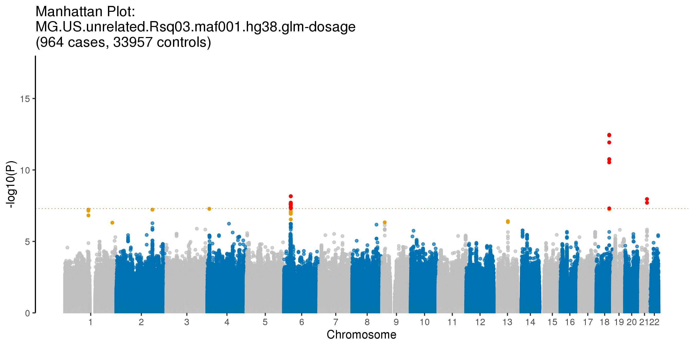


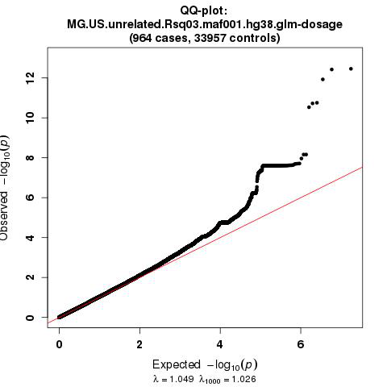


```python
import pandas as pd
import numpy as np

mg = pd.read_csv("MG.US.noDups.UNRELATED.hg38.glm.Rsq03.maf001_ALLchr.txt",sep="\t")
mgSignificant2 = mg[(mg['P'] <= 0.0000001) & (mg['#CHROM'] != 6)]
mgSignificant2 = mgSignificant2.sort_values(by=['#CHROM','POS'])
mgSignificant2.drop(['TEST','OBS_CT','Z_STAT','ERRCODE'],axis=1)
```


<div>
<style scoped>
    .dataframe tbody tr th:only-of-type {
        vertical-align: middle;
    }

    .dataframe tbody tr th {
        vertical-align: top;
    }

    .dataframe thead th {
        text-align: right;
    }
</style>
<table border="1" class="dataframe">
  <thead>
    <tr style="text-align: right;">
      <th></th>
      <th>#CHROM</th>
      <th>POS</th>
      <th>ID</th>
      <th>REF</th>
      <th>ALT</th>
      <th>A1</th>
      <th>A1_CT</th>
      <th>ALLELE_CT</th>
      <th>A1_CASE_CT</th>
      <th>A1_CTRL_CT</th>
      <th>CASE_ALLELE_CT</th>
      <th>CTRL_ALLELE_CT</th>
      <th>A1_FREQ</th>
      <th>A1_CASE_FREQ</th>
      <th>A1_CTRL_FREQ</th>
      <th>FIRTH?</th>
      <th>OR</th>
      <th>LOG(OR)_SE</th>
      <th>P</th>
    </tr>
  </thead>
  <tbody>
    <tr>
      <th>340117</th>
      <td>1</td>
      <td>113630788</td>
      <td>chr1:113630788:A:G</td>
      <td>A</td>
      <td>G</td>
      <td>A</td>
      <td>9958</td>
      <td>69842</td>
      <td>354</td>
      <td>9604</td>
      <td>1928</td>
      <td>67914</td>
      <td>0.142579</td>
      <td>0.183610</td>
      <td>0.141414</td>
      <td>N</td>
      <td>1.39400</td>
      <td>0.061624</td>
      <td>7.031110e-08</td>
    </tr>
    <tr>
      <th>340520</th>
      <td>1</td>
      <td>113834946</td>
      <td>chr1:113834946:A:G</td>
      <td>A</td>
      <td>G</td>
      <td>A</td>
      <td>6828</td>
      <td>69842</td>
      <td>255</td>
      <td>6573</td>
      <td>1928</td>
      <td>67914</td>
      <td>0.097764</td>
      <td>0.132261</td>
      <td>0.096784</td>
      <td>N</td>
      <td>1.46029</td>
      <td>0.069870</td>
      <td>5.988890e-08</td>
    </tr>
    <tr>
      <th>1213479</th>
      <td>2</td>
      <td>174725872</td>
      <td>chr2:174725872:G:A</td>
      <td>G</td>
      <td>A</td>
      <td>A</td>
      <td>3050</td>
      <td>69842</td>
      <td>125</td>
      <td>2925</td>
      <td>1928</td>
      <td>67914</td>
      <td>0.043670</td>
      <td>0.064834</td>
      <td>0.043069</td>
      <td>N</td>
      <td>1.69474</td>
      <td>0.097358</td>
      <td>6.011220e-08</td>
    </tr>
    <tr>
      <th>2084512</th>
      <td>4</td>
      <td>9567569</td>
      <td>chr4:9567569:C:G</td>
      <td>C</td>
      <td>G</td>
      <td>G</td>
      <td>918</td>
      <td>69842</td>
      <td>55</td>
      <td>863</td>
      <td>1928</td>
      <td>67914</td>
      <td>0.013144</td>
      <td>0.028527</td>
      <td>0.012707</td>
      <td>N</td>
      <td>2.21051</td>
      <td>0.145739</td>
      <td>5.245500e-08</td>
    </tr>
    <tr>
      <th>8115982</th>
      <td>18</td>
      <td>62337813</td>
      <td>chr18:62337813:A:C</td>
      <td>A</td>
      <td>C</td>
      <td>A</td>
      <td>30656</td>
      <td>69842</td>
      <td>996</td>
      <td>29660</td>
      <td>1928</td>
      <td>67914</td>
      <td>0.438934</td>
      <td>0.516598</td>
      <td>0.436729</td>
      <td>N</td>
      <td>1.37348</td>
      <td>0.047261</td>
      <td>1.884350e-11</td>
    </tr>
    <tr>
      <th>8115988</th>
      <td>18</td>
      <td>62339745</td>
      <td>chr18:62339745:C:G</td>
      <td>C</td>
      <td>G</td>
      <td>C</td>
      <td>32077</td>
      <td>69842</td>
      <td>1043</td>
      <td>31034</td>
      <td>1928</td>
      <td>67914</td>
      <td>0.459280</td>
      <td>0.540975</td>
      <td>0.456960</td>
      <td>N</td>
      <td>1.40171</td>
      <td>0.047514</td>
      <td>1.184090e-12</td>
    </tr>
    <tr>
      <th>8115989</th>
      <td>18</td>
      <td>62340030</td>
      <td>chr18:62340030:T:C</td>
      <td>T</td>
      <td>C</td>
      <td>T</td>
      <td>24963</td>
      <td>69842</td>
      <td>804</td>
      <td>24159</td>
      <td>1928</td>
      <td>67914</td>
      <td>0.357421</td>
      <td>0.417012</td>
      <td>0.355729</td>
      <td>N</td>
      <td>1.29940</td>
      <td>0.048218</td>
      <td>5.582690e-08</td>
    </tr>
    <tr>
      <th>8115990</th>
      <td>18</td>
      <td>62340106</td>
      <td>chr18:62340106:T:C</td>
      <td>T</td>
      <td>C</td>
      <td>T</td>
      <td>24929</td>
      <td>69842</td>
      <td>803</td>
      <td>24126</td>
      <td>1928</td>
      <td>67914</td>
      <td>0.356934</td>
      <td>0.416494</td>
      <td>0.355243</td>
      <td>N</td>
      <td>1.30049</td>
      <td>0.048224</td>
      <td>5.085940e-08</td>
    </tr>
    <tr>
      <th>8115999</th>
      <td>18</td>
      <td>62342581</td>
      <td>chr18:62342581:C:T</td>
      <td>C</td>
      <td>T</td>
      <td>C</td>
      <td>32261</td>
      <td>69842</td>
      <td>1052</td>
      <td>31209</td>
      <td>1928</td>
      <td>67914</td>
      <td>0.461914</td>
      <td>0.545643</td>
      <td>0.459537</td>
      <td>N</td>
      <td>1.41306</td>
      <td>0.047532</td>
      <td>3.487840e-13</td>
    </tr>
    <tr>
      <th>8116001</th>
      <td>18</td>
      <td>62343215</td>
      <td>chr18:62343215:A:C</td>
      <td>A</td>
      <td>C</td>
      <td>A</td>
      <td>32227</td>
      <td>69842</td>
      <td>1051</td>
      <td>31176</td>
      <td>1928</td>
      <td>67914</td>
      <td>0.461427</td>
      <td>0.545124</td>
      <td>0.459051</td>
      <td>N</td>
      <td>1.41249</td>
      <td>0.047545</td>
      <td>3.767170e-13</td>
    </tr>
    <tr>
      <th>8116014</th>
      <td>18</td>
      <td>62349000</td>
      <td>chr18:62349000:G:A</td>
      <td>G</td>
      <td>A</td>
      <td>G</td>
      <td>26744</td>
      <td>69842</td>
      <td>883</td>
      <td>25861</td>
      <td>1928</td>
      <td>67914</td>
      <td>0.382921</td>
      <td>0.457988</td>
      <td>0.380790</td>
      <td>N</td>
      <td>1.37806</td>
      <td>0.047684</td>
      <td>1.755940e-11</td>
    </tr>
    <tr>
      <th>8116018</th>
      <td>18</td>
      <td>62350973</td>
      <td>chr18:62350973:A:T</td>
      <td>A</td>
      <td>T</td>
      <td>A</td>
      <td>26736</td>
      <td>69842</td>
      <td>881</td>
      <td>25855</td>
      <td>1928</td>
      <td>67914</td>
      <td>0.382807</td>
      <td>0.456950</td>
      <td>0.380702</td>
      <td>N</td>
      <td>1.37300</td>
      <td>0.047671</td>
      <td>2.937860e-11</td>
    </tr>
    <tr>
      <th>8116035</th>
      <td>18</td>
      <td>62355088</td>
      <td>chr18:62355088:C:T</td>
      <td>C</td>
      <td>T</td>
      <td>C</td>
      <td>22925</td>
      <td>69842</td>
      <td>743</td>
      <td>22182</td>
      <td>1928</td>
      <td>67914</td>
      <td>0.328241</td>
      <td>0.385373</td>
      <td>0.326619</td>
      <td>N</td>
      <td>1.30568</td>
      <td>0.048900</td>
      <td>4.909940e-08</td>
    </tr>
    <tr>
      <th>8116037</th>
      <td>18</td>
      <td>62355419</td>
      <td>chr18:62355419:C:A</td>
      <td>C</td>
      <td>A</td>
      <td>C</td>
      <td>22930</td>
      <td>69842</td>
      <td>743</td>
      <td>22187</td>
      <td>1928</td>
      <td>67914</td>
      <td>0.328312</td>
      <td>0.385373</td>
      <td>0.326693</td>
      <td>N</td>
      <td>1.30471</td>
      <td>0.048894</td>
      <td>5.328670e-08</td>
    </tr>
    <tr>
      <th>8116039</th>
      <td>18</td>
      <td>62355457</td>
      <td>chr18:62355457:G:A</td>
      <td>G</td>
      <td>A</td>
      <td>G</td>
      <td>22932</td>
      <td>69842</td>
      <td>743</td>
      <td>22189</td>
      <td>1928</td>
      <td>67914</td>
      <td>0.328341</td>
      <td>0.385373</td>
      <td>0.326722</td>
      <td>N</td>
      <td>1.30461</td>
      <td>0.048895</td>
      <td>5.382120e-08</td>
    </tr>
    <tr>
      <th>8116040</th>
      <td>18</td>
      <td>62355578</td>
      <td>chr18:62355578:A:G</td>
      <td>A</td>
      <td>G</td>
      <td>A</td>
      <td>22925</td>
      <td>69842</td>
      <td>743</td>
      <td>22182</td>
      <td>1928</td>
      <td>67914</td>
      <td>0.328241</td>
      <td>0.385373</td>
      <td>0.326619</td>
      <td>N</td>
      <td>1.30501</td>
      <td>0.048889</td>
      <td>5.175460e-08</td>
    </tr>
    <tr>
      <th>8116043</th>
      <td>18</td>
      <td>62356049</td>
      <td>chr18:62356049:G:A</td>
      <td>G</td>
      <td>A</td>
      <td>G</td>
      <td>22932</td>
      <td>69842</td>
      <td>743</td>
      <td>22189</td>
      <td>1928</td>
      <td>67914</td>
      <td>0.328341</td>
      <td>0.385373</td>
      <td>0.326722</td>
      <td>N</td>
      <td>1.30461</td>
      <td>0.048891</td>
      <td>5.365030e-08</td>
    </tr>
    <tr>
      <th>8116044</th>
      <td>18</td>
      <td>62356057</td>
      <td>chr18:62356057:A:T</td>
      <td>A</td>
      <td>T</td>
      <td>A</td>
      <td>22931</td>
      <td>69842</td>
      <td>743</td>
      <td>22188</td>
      <td>1928</td>
      <td>67914</td>
      <td>0.328327</td>
      <td>0.385373</td>
      <td>0.326707</td>
      <td>N</td>
      <td>1.30471</td>
      <td>0.048893</td>
      <td>5.324460e-08</td>
    </tr>
    <tr>
      <th>8687356</th>
      <td>21</td>
      <td>41988989</td>
      <td>chr21:41988989:C:T</td>
      <td>C</td>
      <td>T</td>
      <td>T</td>
      <td>6181</td>
      <td>69842</td>
      <td>244</td>
      <td>5937</td>
      <td>1928</td>
      <td>67914</td>
      <td>0.088500</td>
      <td>0.126556</td>
      <td>0.087419</td>
      <td>N</td>
      <td>1.50735</td>
      <td>0.071792</td>
      <td>1.091720e-08</td>
    </tr>
    <tr>
      <th>8687382</th>
      <td>21</td>
      <td>41998312</td>
      <td>chr21:41998312:C:G</td>
      <td>C</td>
      <td>G</td>
      <td>G</td>
      <td>14624</td>
      <td>69842</td>
      <td>510</td>
      <td>14114</td>
      <td>1928</td>
      <td>67914</td>
      <td>0.209387</td>
      <td>0.264523</td>
      <td>0.207822</td>
      <td>N</td>
      <td>1.35448</td>
      <td>0.054042</td>
      <td>1.971470e-08</td>
    </tr>
  </tbody>
</table>
</div>


### Prepare file for meta analysis


```python
!cat ../../scripts/toMetaprep.glm.updated.v2.R
```

    #!/usr/bin/env Rscript
    
    args <- commandArgs(trailingOnly=TRUE)
    if (length(args) != 2) {
      stop("USAGE: Rscript toMetaprep.glm.updated.v2.R args[1] args[2]
      where args[1] = glm_results
            args[2] = OutputFileName")
    }
    
    require(data.table)
    require(tidyverse)
    data <- fread(args[1],header=T)
    
    # Reformat
    data$A2 <- ifelse(data$A1 == data$ALT, data$REF, data$ALT)
    data$EffectAllele <- ifelse(data$A1_FREQ < 0.5, data$A1, data$A2)
    data$OtherAllele <- ifelse(data$A1_FREQ < 0.5, data$A2, data$A1)
    data$BETA <- ifelse(data$EffectAllele == data$A1, log(data$OR), log(data$OR)*-1)
    data$SE <- data$`LOG(OR)_SE`
    
    ## freq
    data$Freq_EffectAllele <- ifelse(data$EffectAllele == data$A1, data$A1_FREQ, 1-data$A1_FREQ)
    data$Freq_EffectAllele.CASE <- ifelse(data$EffectAllele == data$A1, data$A1_CASE_FREQ, 1-data$A1_CASE_FREQ)
    data$Freq_EffectAllele.CTRL <- ifelse(data$EffectAllele == data$A1, data$A1_CTRL_FREQ, 1-data$A1_CTRL_FREQ)
    
    ## counts
    data$EffectAllele_CT <- ifelse(data$EffectAllele == data$A1, data$A1_CT, data$ALLELE_CT-data$A1_CT)
    data$EffectAllele_CT.CASE <- ifelse(data$EffectAllele == data$A1, data$A1_CASE_CT, data$CASE_ALLELE_CT-data$A1_CASE_CT)
    data$EffectAllele_CT.CTRL <- ifelse(data$EffectAllele == data$A1, data$A1_CTRL_CT, data$CTRL_ALLELE_CT-data$A1_CTRL_CT)
    
    data$marker <- paste(data$`#CHROM`,data$POS,data$OtherAllele,data$EffectAllele,sep=":")
    data1 <- data %>% rename(CHROM = `#CHROM`) %>% 
             select(CHROM,POS,ID,marker,EffectAllele,OtherAllele,
                    OR,BETA,SE,P,Freq_EffectAllele,Freq_EffectAllele.CASE,Freq_EffectAllele.CTRL,
                    ALLELE_CT,CASE_ALLELE_CT,CTRL_ALLELE_CT,
                    EffectAllele_CT,EffectAllele_CT.CASE,EffectAllele_CT.CTRL) %>%
             filter(BETA > -5 & BETA < 5) %>%
             filter(!is.na(BETA))
             
    dups <- data1 %>% select(marker,P) %>% filter(marker == duplicated(marker))
    temp1 <- subset(data1, data1$marker %in% dups$marker) %>%
             group_by(marker) %>%
             filter(P == min(P)) %>%
             data.frame()
    temp2 <- subset(data1, !(data1$marker %in% temp1$marker))
    data2 <- rbind(temp1,temp2) %>% arrange(CHROM,POS)
    
    write.table(data2, file=paste("toMeta.",args[2],".tab", sep=""), quote = F, sep = "\t", row.names = F)
    


```bash
%%bash
echo "Rscript ../../scripts/toMetaprep.glm.updated.v2.R MG.US.noDups.UNRELATED.hg38.glm.Rsq03MAF00001_ALLchr.txt MG.US.noDups.UNRELATED.hg38.glm.Rsq03MAF00001" > prep.swarm
swarm --file prep.swarm --logdir swarmOE_prep -g 120 --module R/3.5.2 --gres=lscratch:500  --time 4:00:00
```

    10632581


## Run conditional analysis from top hits from meta analysis


```bash
%%bash
# View top hits from meta analysis
DIR="/data/NDRS_LNG/MyastheniaGravis/updated.April2020/MetaAnalysis.hg38.ByCohort.rerun/USmerged.Itals.hg38"
cat $DIR/IndexVarsSummStats.META_MG.USmerged.Itals.UNRELATED.hg38.Rsq03.filteredDirectionHetISq80MAF001cases.p5e-8.txt | column -t
```

    CHROM  POS        MarkerName        Allele1  Allele2  Freq1   Effect   StdErr  Direction  P          HetISq
    1      113761186  1:113761186:C:A   a        c        0.1154  0.3937   0.0613  ++         1.354e-10  0
    1      113834946  1:113834946:G:A   a        g        0.1166  0.396    0.0609  ++         7.949e-11  0
    2      174764492  2:174764492:G:A   a        g        0.057   0.4495   0.0812  ++         3.072e-08  0
    6      31358835   6:31358835:A:G    a        g        0.628   -0.2602  0.039   --         2.554e-11  79.6
    6      31358841   6:31358841:A:G    a        g        0.628   -0.2602  0.039   --         2.554e-11  79.6
    6      32620936   6:32620936:T:C    t        c        0.9743  0.8661   0.1128  ++         1.576e-14  40.1
    6      32625016   6:32625016:C:T    t        c        0.0257  -0.8661  0.1128  --         1.582e-14  40.2
    8      108247378  8:108247378:T:C   t        c        0.9875  -1.0637  0.1935  --         3.859e-08  0
    8      108248309  8:108248309:G:GA  g        ga       0.9875  -1.0637  0.1935  --         3.859e-08  0
    10     7410781    10:7410781:A:G    a        g        0.7273  -0.2369  0.042   --         1.665e-08  46
    11     95578258   11:95578258:T:C   t        c        0.7835  -0.2545  0.045   --         1.541e-08  0
    18     62342581   18:62342581:T:C   t        c        0.4631  -0.2874  0.0369  --         7.085e-15  73.7
    18     62343215   18:62343215:C:A   a        c        0.5364  0.287    0.0369  ++         7.692e-15  73.7


Get imputation info for each index variant/hit from each of the US subsets that were imputed separately. Need to make sure that the imputation quality are good across both imputed subsets.


```bash
%%bash
DATA="/data/NDRS_LNG/MyastheniaGravis/updated.April2020/US"
head -n 1 $DATA/Imputation.subset1.hg38/chr1.info > topHits.ImputationInfo.US.subset1.txt
grep "chr1:113834946:" $DATA/Imputation.subset1.hg38/chr1.info >> topHits.ImputationInfo.US.subset1.txt
grep "chr2:174764492:" $DATA/Imputation.subset1.hg38/chr2.info >> topHits.ImputationInfo.US.subset1.txt
grep "chr6:32620936:" $DATA/Imputation.subset1.hg38/chr6.info >> topHits.ImputationInfo.US.subset1.txt
grep "chr8:108247378:" $DATA/Imputation.subset1.hg38/chr8.info >> topHits.ImputationInfo.US.subset1.txt
grep "chr10:7410781:" $DATA/Imputation.subset1.hg38/chr10.info >> topHits.ImputationInfo.US.subset1.txt
grep "chr11:95578258:" $DATA/Imputation.subset1.hg38/chr11.info >> topHits.ImputationInfo.US.subset1.txt
grep "chr18:62355088:" $DATA/Imputation.subset1.hg38/chr18.info >> topHits.ImputationInfo.US.subset1.txt
```


```python
import pandas as pd
pd.read_csv("topHits.ImputationInfo.US.subset1.txt",sep="\t")
```


<div>
<style scoped>
    .dataframe tbody tr th:only-of-type {
        vertical-align: middle;
    }

    .dataframe tbody tr th {
        vertical-align: top;
    }

    .dataframe thead th {
        text-align: right;
    }
</style>
<table border="1" class="dataframe">
  <thead>
    <tr style="text-align: right;">
      <th></th>
      <th>SNP</th>
      <th>REF(0)</th>
      <th>ALT(1)</th>
      <th>ALT_Frq</th>
      <th>MAF</th>
      <th>AvgCall</th>
      <th>Rsq</th>
      <th>Genotyped</th>
      <th>LooRsq</th>
      <th>EmpR</th>
      <th>EmpRsq</th>
      <th>Dose0</th>
      <th>Dose1</th>
    </tr>
  </thead>
  <tbody>
    <tr>
      <th>0</th>
      <td>chr1:113834946:A:G</td>
      <td>A</td>
      <td>G</td>
      <td>0.90304</td>
      <td>0.09696</td>
      <td>0.99635</td>
      <td>0.96516</td>
      <td>Imputed</td>
      <td>-</td>
      <td>-</td>
      <td>-</td>
      <td>-</td>
      <td>-</td>
    </tr>
    <tr>
      <th>1</th>
      <td>chr2:174764492:G:A</td>
      <td>G</td>
      <td>A</td>
      <td>0.03513</td>
      <td>0.03513</td>
      <td>0.99888</td>
      <td>0.97306</td>
      <td>Imputed</td>
      <td>-</td>
      <td>-</td>
      <td>-</td>
      <td>-</td>
      <td>-</td>
    </tr>
    <tr>
      <th>2</th>
      <td>chr6:32620936:T:C</td>
      <td>T</td>
      <td>C</td>
      <td>0.06075</td>
      <td>0.06075</td>
      <td>0.99979</td>
      <td>0.99673</td>
      <td>Imputed</td>
      <td>-</td>
      <td>-</td>
      <td>-</td>
      <td>-</td>
      <td>-</td>
    </tr>
    <tr>
      <th>3</th>
      <td>chr8:108247378:T:C</td>
      <td>T</td>
      <td>C</td>
      <td>0.00405</td>
      <td>0.00405</td>
      <td>0.99998</td>
      <td>0.99502</td>
      <td>Imputed</td>
      <td>-</td>
      <td>-</td>
      <td>-</td>
      <td>-</td>
      <td>-</td>
    </tr>
    <tr>
      <th>4</th>
      <td>chr10:7410781:A:G</td>
      <td>A</td>
      <td>G</td>
      <td>0.21193</td>
      <td>0.21193</td>
      <td>0.99615</td>
      <td>0.98145</td>
      <td>Imputed</td>
      <td>-</td>
      <td>-</td>
      <td>-</td>
      <td>-</td>
      <td>-</td>
    </tr>
    <tr>
      <th>5</th>
      <td>chr11:95578258:T:C</td>
      <td>T</td>
      <td>C</td>
      <td>0.17396</td>
      <td>0.17396</td>
      <td>0.99992</td>
      <td>0.99958</td>
      <td>Genotyped</td>
      <td>0.994</td>
      <td>0.997</td>
      <td>0.99496</td>
      <td>0.99578</td>
      <td>0.00110</td>
    </tr>
    <tr>
      <th>6</th>
      <td>chr18:62355088:C:T</td>
      <td>C</td>
      <td>T</td>
      <td>0.67385</td>
      <td>0.32615</td>
      <td>0.99839</td>
      <td>0.99325</td>
      <td>Imputed</td>
      <td>-</td>
      <td>-</td>
      <td>-</td>
      <td>-</td>
      <td>-</td>
    </tr>
  </tbody>
</table>
</div>


```bash
%%bash
DATA="/data/NDRS_LNG/MyastheniaGravis/updated.April2020/US"
head -n 1 $DATA/Imputation.subset2.hg38/chr1.info > topHits.ImputationInfo.US.subset2.txt
grep "chr1:113834946:" $DATA/Imputation.subset2.hg38/chr1.info >> topHits.ImputationInfo.US.subset2.txt
grep "chr2:174764492:" $DATA/Imputation.subset2.hg38/chr2.info >> topHits.ImputationInfo.US.subset2.txt
grep "chr6:32620936:" $DATA/Imputation.subset2.hg38/chr6.info >> topHits.ImputationInfo.US.subset2.txt
grep "chr8:108247378:" $DATA/Imputation.subset2.hg38/chr8.info >> topHits.ImputationInfo.US.subset2.txt
grep "chr10:7410781:" $DATA/Imputation.subset2.hg38/chr10.info >> topHits.ImputationInfo.US.subset2.txt
grep "chr11:95578258:" $DATA/Imputation.subset2.hg38/chr11.info >> topHits.ImputationInfo.US.subset2.txt
grep "chr18:62355088:" $DATA/Imputation.subset2.hg38/chr18.info >> topHits.ImputationInfo.US.subset2.txt

```


```python
import pandas as pd
pd.read_csv("topHits.ImputationInfo.US.subset2.txt",sep="\t")
```


<div>
<style scoped>
    .dataframe tbody tr th:only-of-type {
        vertical-align: middle;
    }

    .dataframe tbody tr th {
        vertical-align: top;
    }

    .dataframe thead th {
        text-align: right;
    }
</style>
<table border="1" class="dataframe">
  <thead>
    <tr style="text-align: right;">
      <th></th>
      <th>SNP</th>
      <th>REF(0)</th>
      <th>ALT(1)</th>
      <th>ALT_Frq</th>
      <th>MAF</th>
      <th>AvgCall</th>
      <th>Rsq</th>
      <th>Genotyped</th>
      <th>LooRsq</th>
      <th>EmpR</th>
      <th>EmpRsq</th>
      <th>Dose0</th>
      <th>Dose1</th>
    </tr>
  </thead>
  <tbody>
    <tr>
      <th>0</th>
      <td>chr1:113834946:A:G</td>
      <td>A</td>
      <td>G</td>
      <td>0.90183</td>
      <td>0.09817</td>
      <td>0.99615</td>
      <td>0.96413</td>
      <td>Imputed</td>
      <td>-</td>
      <td>-</td>
      <td>-</td>
      <td>-</td>
      <td>-</td>
    </tr>
    <tr>
      <th>1</th>
      <td>chr2:174764492:G:A</td>
      <td>G</td>
      <td>A</td>
      <td>0.03511</td>
      <td>0.03511</td>
      <td>0.99902</td>
      <td>0.97591</td>
      <td>Imputed</td>
      <td>-</td>
      <td>-</td>
      <td>-</td>
      <td>-</td>
      <td>-</td>
    </tr>
    <tr>
      <th>2</th>
      <td>chr6:32620936:T:C</td>
      <td>T</td>
      <td>C</td>
      <td>0.06225</td>
      <td>0.06225</td>
      <td>0.99980</td>
      <td>0.99699</td>
      <td>Imputed</td>
      <td>-</td>
      <td>-</td>
      <td>-</td>
      <td>-</td>
      <td>-</td>
    </tr>
    <tr>
      <th>3</th>
      <td>chr8:108247378:T:C</td>
      <td>T</td>
      <td>C</td>
      <td>0.00363</td>
      <td>0.00363</td>
      <td>0.99997</td>
      <td>0.99389</td>
      <td>Imputed</td>
      <td>-</td>
      <td>-</td>
      <td>-</td>
      <td>-</td>
      <td>-</td>
    </tr>
    <tr>
      <th>4</th>
      <td>chr10:7410781:A:G</td>
      <td>A</td>
      <td>G</td>
      <td>0.21031</td>
      <td>0.21031</td>
      <td>0.99587</td>
      <td>0.98037</td>
      <td>Imputed</td>
      <td>-</td>
      <td>-</td>
      <td>-</td>
      <td>-</td>
      <td>-</td>
    </tr>
    <tr>
      <th>5</th>
      <td>chr11:95578258:T:C</td>
      <td>T</td>
      <td>C</td>
      <td>0.17414</td>
      <td>0.17414</td>
      <td>0.99996</td>
      <td>0.99978</td>
      <td>Genotyped</td>
      <td>0.994</td>
      <td>0.998</td>
      <td>0.99624</td>
      <td>0.99606</td>
      <td>0.00087</td>
    </tr>
    <tr>
      <th>6</th>
      <td>chr18:62355088:C:T</td>
      <td>C</td>
      <td>T</td>
      <td>0.66673</td>
      <td>0.33327</td>
      <td>0.99837</td>
      <td>0.99332</td>
      <td>Imputed</td>
      <td>-</td>
      <td>-</td>
      <td>-</td>
      <td>-</td>
      <td>-</td>
    </tr>
  </tbody>
</table>
</div>


### On single top index variant

List of single index variants per loci to condition on:
- chr1:113834946:A:G 
- chr2:174764492:G:A
- chr6:32620936:T:C
- chr8:108247378:T:C
- chr10:7410781:A:G
- chr11:95578258:T:C
- chr18:62355088:C:T

Notes:
1. conditioning on `chr6:32620936:T:C` revealed there was a second independent peak in the same locus. The top hit here is `chr6:31358836:G:A`.
2. Run additional conditional analysis on:
- chr6:31358836:G:A
- chr6:31358836:G:A,chr6:32620936:T:C


```bash
%%bash
# create list of snps to condition on 
echo "chr1:113834946:A:G" > IndexVars.ConditionList.txt
echo "chr2:174764492:G:A" >> IndexVars.ConditionList.txt
echo "chr6:32620936:T:C" >> IndexVars.ConditionList.txt
echo "chr8:108247378:T:C" >> IndexVars.ConditionList.txt
echo "chr10:7410781:A:G" >> IndexVars.ConditionList.txt
echo "chr11:95578258:T:C" >> IndexVars.ConditionList.txt
echo "chr18:62355088:C:T" >> IndexVars.ConditionList.txt

cat IndexVars.ConditionList.txt
```

    chr1:113834946:A:G
    chr2:174764492:G:A
    chr6:32620936:T:C
    chr8:108247378:T:C
    chr10:7410781:A:G
    chr11:95578258:T:C
    chr18:62355088:C:T


```bash
%%bash
mkdir ConditionalAnalysis

JointVCF="/data/NDRS_LNG/MyastheniaGravis/updated.April2020/US/Analysis.GLM.hg38/US.JointPostImputation"
DATA="/data/NDRS_LNG/MyastheniaGravis/updated.April2020/US"
COVAR="GENDER,age_at_onset,PC1,PC2,PC4,PC5,PC6,PC8,PC9,PC10"

for CHNUM in {1,2,6,8,10,11,18};
  do
echo "plink \
--vcf $JointVCF/merged.vcf/US.chr${CHNUM}.vcf.gz \
--extract $JointVCF/sharedVars.postImputation/SharedVars.postImputation.Rsq03MAF00001.chr${CHNUM}.txt \
--remove $JointVCF/SamplesToRemove.dbGAP.FID_IID.forImputed.txt \
--double-id \
--pheno-name PHENO \
--pheno $DATA/COVARIATES.US_mg_noDups.UNRELATED.forImputed.txt \
--covar $DATA/COVARIATES.US_mg_noDups.UNRELATED.forImputed.txt \
--glm hide-covar firth-fallback cols=+a1freq,+a1freqcc,+a1count,+totallele,+a1countcc,+totallelecc,+err \
--out ConditionalAnalysis/MG.USmerged.noDups.UNRELATED.hg38.conditioned.glm_chr${CHNUM} \
--condition-list IndexVars.ConditionList.txt \
--covar-name $COVAR \
--covar-variance-standardize" >> GWAS.condition.swarm
done

```


```bash
%%bash
swarm --file GWAS.condition.swarm \
--logdir swarmOE_GWAS.MG \
--gres=lscratch:800 \
-t 32 --partition quick -g 120 --time 04:00:00 \
--module plink/2.0-dev-20191128 \
--sbatch '--constraint=ibfdr'
```

    10184424


### Run additional conditional analysis for a second independent signal on chr6


```python
import pandas as pd
pd.read_csv("/data/NDRS_LNG/MyastheniaGravis/updated.April2020/MetaAnalysis.hg38.ByCohort.rerun/USmerged.Itals.conditional.hg38/IndexVarsSummStats.META_MG.USmerged.Itals.UNRELATED.hg38.Rsq03.filteredDirectionHetISq80MAF001cases.ConditionalIndependentSignal.chr6.txt",sep="\t")
```


<div>
<style scoped>
    .dataframe tbody tr th:only-of-type {
        vertical-align: middle;
    }

    .dataframe tbody tr th {
        vertical-align: top;
    }

    .dataframe thead th {
        text-align: right;
    }
</style>
<table border="1" class="dataframe">
  <thead>
    <tr style="text-align: right;">
      <th></th>
      <th>CHROM</th>
      <th>POS</th>
      <th>MarkerName</th>
      <th>Allele1</th>
      <th>Allele2</th>
      <th>Freq1</th>
      <th>Effect</th>
      <th>StdErr</th>
      <th>Direction</th>
      <th>P</th>
      <th>HetISq</th>
    </tr>
  </thead>
  <tbody>
    <tr>
      <th>0</th>
      <td>6</td>
      <td>31358745</td>
      <td>6:31358745:G:GC</td>
      <td>g</td>
      <td>gc</td>
      <td>0.6268</td>
      <td>-0.2489</td>
      <td>0.0391</td>
      <td>--</td>
      <td>1.962000e-10</td>
      <td>79.4</td>
    </tr>
    <tr>
      <th>1</th>
      <td>6</td>
      <td>31358836</td>
      <td>6:31358836:G:A</td>
      <td>a</td>
      <td>g</td>
      <td>0.3734</td>
      <td>0.2490</td>
      <td>0.0391</td>
      <td>++</td>
      <td>1.917000e-10</td>
      <td>79.3</td>
    </tr>
  </tbody>
</table>
</div>


```bash
%%bash
# Run additional conditional analysis for a second independent signal on chr6

JointVCF="/data/NDRS_LNG/MyastheniaGravis/updated.April2020/US/Analysis.GLM.hg38/US.JointPostImputation"
DATA="/data/NDRS_LNG/MyastheniaGravis/updated.April2020/US"
COVAR="GENDER,age_at_onset,PC1,PC2,PC4,PC5,PC6,PC8,PC9,PC10"

for CHNUM in 6;
  do
echo "plink \
--vcf $JointVCF/merged.vcf/US.chr${CHNUM}.vcf.gz \
--extract $JointVCF/sharedVars.postImputation/SharedVars.postImputation.Rsq03MAF00001.chr${CHNUM}.txt \
--remove $JointVCF/SamplesToRemove.dbGAP.FID_IID.forImputed.txt \
--double-id \
--pheno-name PHENO \
--pheno $DATA/COVARIATES.US_mg_noDups.UNRELATED.forImputed.txt \
--covar $DATA/COVARIATES.US_mg_noDups.UNRELATED.forImputed.txt \
--glm hide-covar firth-fallback cols=+a1freq,+a1freqcc,+a1count,+totallele,+a1countcc,+totallelecc,+err \
--out ConditionalAnalysis/MG.USmerged.noDups.UNRELATED.hg38.conditioned.glm.chr6_31358836_A_G_chr${CHNUM} \
--condition chr6:31358836:A:G \
--covar-name $COVAR \
--covar-variance-standardize" > GWAS.condition.2.swarm
done

echo "chr6:31358836:A:G" > IndexVars.ConditionList.2.txt
echo "chr6:32620936:T:C" >> IndexVars.ConditionList.2.txt

for CHNUM in 6;
  do
echo "plink \
--vcf $JointVCF/merged.vcf/US.chr${CHNUM}.vcf.gz \
--extract $JointVCF/sharedVars.postImputation/SharedVars.postImputation.Rsq03MAF00001.chr${CHNUM}.txt \
--remove $JointVCF/SamplesToRemove.dbGAP.FID_IID.forImputed.txt \
--double-id \
--pheno-name PHENO \
--pheno $DATA/COVARIATES.US_mg_noDups.UNRELATED.forImputed.txt \
--covar $DATA/COVARIATES.US_mg_noDups.UNRELATED.forImputed.txt \
--glm hide-covar firth-fallback cols=+a1freq,+a1freqcc,+a1count,+totallele,+a1countcc,+totallelecc,+err \
--out ConditionalAnalysis/MG.USmerged.noDups.UNRELATED.hg38.conditioned.glm.chr6_31358836_A_G.chr6_32620936_T_C_chr${CHNUM} \
--condition-list IndexVars.ConditionList.2.txt \
--covar-name $COVAR \
--covar-variance-standardize" >> GWAS.condition.2.swarm
done
```


```bash
%%bash
swarm --file GWAS.condition.2.swarm \
--logdir swarmOE_GWAS.MG \
--gres=lscratch:800 \
-t 32 --partition quick -g 120 --time 04:00:00 \
--module plink/2.0-dev-20191128 \
--sbatch '--constraint=ibfdr'
```

    10260855


### Merge files


```bash
%%bash
cd ConditionalAnalysis

for Variant in chr1_113834946_A_G;
do 
awk 'NR==1;NR>1 {if($22 != "NA" && $14 >= 0.01) print}' MG.USmerged.noDups.UNRELATED.hg38.conditioned.glm_chr1.PHENO.glm.logistic.hybrid > MG.USmerged.noDups.UNRELATED.hg38.glm.condition.${Variant}.chr1.maf001cases.txt
done

for Variant in chr2_174764492_G_A;
do 
awk 'NR==1;NR>1 {if($22 != "NA" && $14 >= 0.01) print}' MG.USmerged.noDups.UNRELATED.hg38.conditioned.glm_chr2.PHENO.glm.logistic.hybrid > MG.USmerged.noDups.UNRELATED.hg38.glm.condition.${Variant}.chr2.maf001cases.txt
done

for Variant in chr6_32620936_T_C;
do 
awk 'NR==1;NR>1 {if($22 != "NA" && $14 >= 0.01) print}' MG.USmerged.noDups.UNRELATED.hg38.conditioned.glm_chr6.PHENO.glm.logistic.hybrid > MG.USmerged.noDups.UNRELATED.hg38.glm.condition.${Variant}.chr6.maf001cases.txt
done

for Variant in chr8_108247378_T_C;
do 
awk 'NR==1;NR>1 {if($22 != "NA" && $14 >= 0.01) print}' MG.USmerged.noDups.UNRELATED.hg38.conditioned.glm_chr8.PHENO.glm.logistic.hybrid > MG.USmerged.noDups.UNRELATED.hg38.glm.condition.${Variant}.chr8.maf001cases.txt
done

for Variant in chr10_7410781_A_G;
do 
awk 'NR==1;NR>1 {if($22 != "NA" && $14 >= 0.01) print}' MG.USmerged.noDups.UNRELATED.hg38.conditioned.glm_chr10.PHENO.glm.logistic.hybrid > MG.USmerged.noDups.UNRELATED.hg38.glm.condition.${Variant}.chr10.maf001cases.txt
done

for Variant in chr11_95578258_T_C;
do 
awk 'NR==1;NR>1 {if($22 != "NA" && $14 >= 0.01) print}' MG.USmerged.noDups.UNRELATED.hg38.conditioned.glm_chr11.PHENO.glm.logistic.hybrid > MG.USmerged.noDups.UNRELATED.hg38.glm.condition.${Variant}.chr11.maf001cases.txt
done

for Variant in chr18_62355088_C_T;
do 
awk 'NR==1;NR>1 {if($22 != "NA" && $14 >= 0.01) print}' MG.USmerged.noDups.UNRELATED.hg38.conditioned.glm_chr18.PHENO.glm.logistic.hybrid > MG.USmerged.noDups.UNRELATED.hg38.glm.condition.${Variant}.chr18.maf001cases.txt
done
```


```bash
%%bash
cd ConditionalAnalysis

for Variant in {chr6_31358836_A_G,chr6_31358836_A_G.chr6_32620936_T_C};
do 
awk 'NR==1;NR>1 {if($22 != "NA" && $14 >= 0.01) print}' MG.USmerged.noDups.UNRELATED.hg38.conditioned.glm.${Variant}_chr6.PHENO.glm.logistic.hybrid > MG.USmerged.noDups.UNRELATED.hg38.glm.condition.${Variant}.chr6.maf001cases.txt
done
```


```bash
%%bash
cd ConditionalAnalysis
## Tidy up directory
mkdir toArchive
mv MG.USmerged.noDups.UNRELATED.hg38.conditioned.glm.*_chr*.PHENO.glm.logistic.hybrid ./toArchive
mv MG.USmerged.noDups.UNRELATED.hg38.conditioned.glm.*_chr*.log ./toArchive

```

### Plot conditioned manhattan (per loci/chromosome)


```bash
%%bash
DATA="/data/NDRS_LNG/MyastheniaGravis/updated.April2020/US"

awk 'NR==1;NR>1 {if($9 != "NA") print}' $DATA/COVARIATES.US_mg_noDups.UNRELATED.forImputed.txt | awk 'NR==1;NR>1 {if($20 != "NA") print}' | cut -f6 | sort | uniq -c
```

      33957 1
        964 2
          1 PHENO


```bash
%%bash
cd ConditionalAnalysis

# Plot chromosomes without conditional analysis for comparison
# First subset chromosome from summ stats
for CHNUM in {1,2,6,8,10,11,18}
do
awk "NR==1;NR>1 {if(\$1 == ${CHNUM}) print}" ../MG.US.noDups.UNRELATED.hg38.glm.Rsq03.maf001cases_ALLchr.txt > summ.stats.unconditioned.chr${CHNUM}.txt
done
```


```bash
%%bash
cd ConditionalAnalysis

cases="964"
controls="33957"

echo "Rscript ../../../scripts/QQ_manhattan_plots_GLMresults.FromImputed.wgs.R summ.stats.unconditioned.chr1.txt $cases $controls MG.US.noDups.UNRELATED.hg38.glm.Rsq03.maf001cases.unconditioned.chr1" > plot1.swarm
echo "Rscript ../../../scripts/QQ_manhattan_plots_GLMresults.FromImputed.wgs.R summ.stats.unconditioned.chr2.txt $cases $controls MG.US.noDups.UNRELATED.hg38.glm.Rsq03.maf001cases.unconditioned.chr2" >> plot1.swarm
echo "Rscript ../../../scripts/QQ_manhattan_plots_GLMresults.FromImputed.wgs.R summ.stats.unconditioned.chr6.txt $cases $controls MG.US.noDups.UNRELATED.hg38.glm.Rsq03.maf001cases.unconditioned.chr6" >> plot1.swarm
echo "Rscript ../../../scripts/QQ_manhattan_plots_GLMresults.FromImputed.wgs.R summ.stats.unconditioned.chr8.txt $cases $controls MG.US.noDups.UNRELATED.hg38.glm.Rsq03.maf001cases.unconditioned.chr8" >> plot1.swarm
echo "Rscript ../../../scripts/QQ_manhattan_plots_GLMresults.FromImputed.wgs.R summ.stats.unconditioned.chr10.txt $cases $controls MG.US.noDups.UNRELATED.hg38.glm.Rsq03.maf001cases.unconditioned.chr10" >> plot1.swarm
echo "Rscript ../../../scripts/QQ_manhattan_plots_GLMresults.FromImputed.wgs.R summ.stats.unconditioned.chr11.txt $cases $controls MG.US.noDups.UNRELATED.hg38.glm.Rsq03.maf001cases.unconditioned.chr11" >> plot1.swarm
echo "Rscript ../../../scripts/QQ_manhattan_plots_GLMresults.FromImputed.wgs.R summ.stats.unconditioned.chr18.txt $cases $controls MG.US.noDups.UNRELATED.hg38.glm.Rsq03.maf001cases.unconditioned.chr18" >> plot1.swarm

swarm --file plot1.swarm --logdir swarmOE_plot --module R/3.5.2 -g 120 --time 02:00:00 --partition quick

```

    10207718


```bash
%%bash
cd ConditionalAnalysis

cases="964"
controls="33957"

echo "Rscript ../../../scripts/QQ_manhattan_plots_GLMresults.FromImputed.wgs.R MG.USmerged.noDups.UNRELATED.hg38.glm.condition.chr1_113834946_A_G.chr1.maf001cases.txt $cases $controls MG.USmerged.noDups.UNRELATED.hg38.glm.condition.chr1_113834946_A_G.chr1.maf001cases" > plot2.swarm
echo "Rscript ../../../scripts/QQ_manhattan_plots_GLMresults.FromImputed.wgs.R MG.USmerged.noDups.UNRELATED.hg38.glm.condition.chr2_174764492_G_A.chr2.maf001cases.txt $cases $controls MG.USmerged.noDups.UNRELATED.hg38.glm.condition.chr2_174764492_G_A.chr2.maf001cases" >> plot2.swarm
echo "Rscript ../../../scripts/QQ_manhattan_plots_GLMresults.FromImputed.wgs.R MG.USmerged.noDups.UNRELATED.hg38.glm.condition.chr6_32620936_T_C.chr6.maf001cases.txt $cases $controls MG.USmerged.noDups.UNRELATED.hg38.glm.condition.chr6_32620936_T_C.chr6.maf001cases" >> plot2.swarm
echo "Rscript ../../../scripts/QQ_manhattan_plots_GLMresults.FromImputed.wgs.R MG.USmerged.noDups.UNRELATED.hg38.glm.condition.chr8_108247378_T_C.chr8.maf001cases.txt $cases $controls MG.USmerged.noDups.UNRELATED.hg38.glm.condition.chr8_108247378_T_C.chr8.maf001cases" >> plot2.swarm
echo "Rscript ../../../scripts/QQ_manhattan_plots_GLMresults.FromImputed.wgs.R MG.USmerged.noDups.UNRELATED.hg38.glm.condition.chr10_7410781_A_G.chr10.maf001cases.txt $cases $controls MG.USmerged.noDups.UNRELATED.hg38.glm.condition.chr10_7410781_A_G.chr10.maf001cases" >> plot2.swarm
echo "Rscript ../../../scripts/QQ_manhattan_plots_GLMresults.FromImputed.wgs.R MG.USmerged.noDups.UNRELATED.hg38.glm.condition.chr11_95578258_T_C.chr11.maf001cases.txt $cases $controls MG.USmerged.noDups.UNRELATED.hg38.glm.condition.chr11_95578258_T_C.chr11.maf001cases" >> plot2.swarm
echo "Rscript ../../../scripts/QQ_manhattan_plots_GLMresults.FromImputed.wgs.R MG.USmerged.noDups.UNRELATED.hg38.glm.condition.chr18_62355088_C_T.chr18.maf001cases.txt $cases $controls MG.USmerged.noDups.UNRELATED.hg38.glm.condition.chr18_62355088_C_T.chr18.maf001cases" >> plot2.swarm

swarm --file plot2.swarm --logdir swarmOE_plot --module R/3.5.2 -g 120 --time 02:00:00 --partition quick

```

    10208172


```bash
%%bash
cd ConditionalAnalysis

cases="964"
controls="33957"

echo "Rscript ../../../scripts/QQ_manhattan_plots_GLMresults.FromImputed.wgs.R MG.USmerged.noDups.UNRELATED.hg38.glm.condition.chr6_31358836_A_G.chr6.maf001cases.txt $cases $controls MG.USmerged.noDups.UNRELATED.hg38.glm.condition.chr6_31358836_A_G.chr6.maf001cases" > plot3.swarm
echo "Rscript ../../../scripts/QQ_manhattan_plots_GLMresults.FromImputed.wgs.R MG.USmerged.noDups.UNRELATED.hg38.glm.condition.chr6_31358836_A_G.chr6_32620936_T_C.chr6.maf001cases.txt $cases $controls MG.USmerged.noDups.UNRELATED.hg38.glm.condition.chr6_31358836_A_G.chr6_32620936_T_C.chr6.maf001cases" >> plot3.swarm

swarm --file plot3.swarm --logdir swarmOE_plot --module R/3.5.2 -g 120 --time 02:00:00 --partition quick

```

    10285264


#### chr1_113834946_A_G


```python
from IPython.display import display
from PIL import Image

uncond="ConditionalAnalysis/MG.US.noDups.UNRELATED.hg38.glm.Rsq03.maf001cases.unconditioned.chr1.manhattan_v1.jpeg"
display(Image.open(uncond))

cond="ConditionalAnalysis/MG.USmerged.noDups.UNRELATED.hg38.glm.condition.chr1_113834946_A_G.chr1.maf001cases.manhattan_v1.jpeg"
display(Image.open(cond))
```


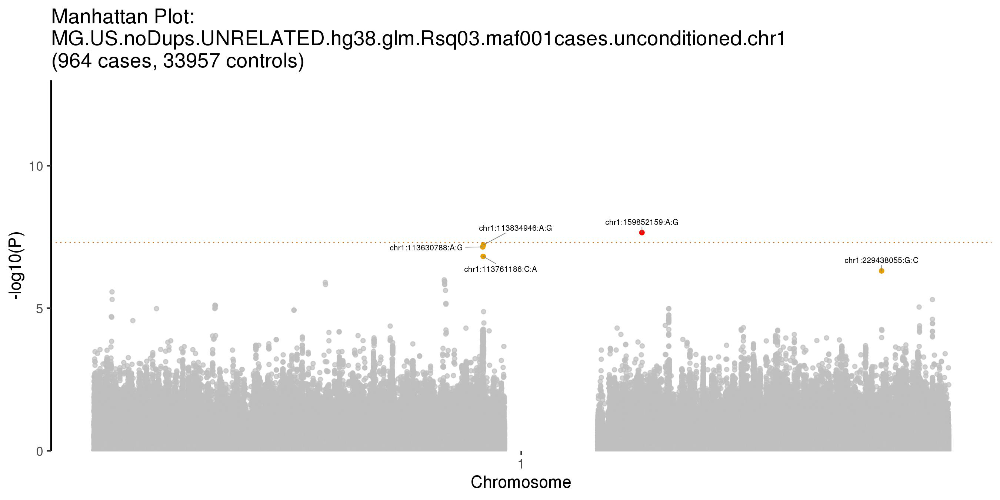


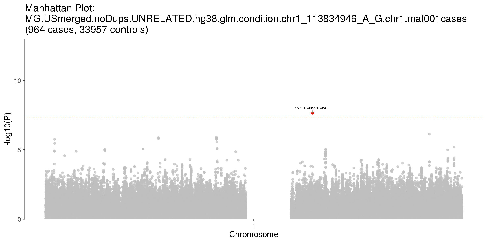


#### chr2_174764492_G_A


```python
from IPython.display import display
from PIL import Image

uncond="ConditionalAnalysis/MG.US.noDups.UNRELATED.hg38.glm.Rsq03.maf001cases.unconditioned.chr2.manhattan_v1.jpeg"
display(Image.open(uncond))

cond="ConditionalAnalysis/MG.USmerged.noDups.UNRELATED.hg38.glm.condition.chr2_174764492_G_A.chr2.maf001cases.manhattan_v1.jpeg"
display(Image.open(cond))
```


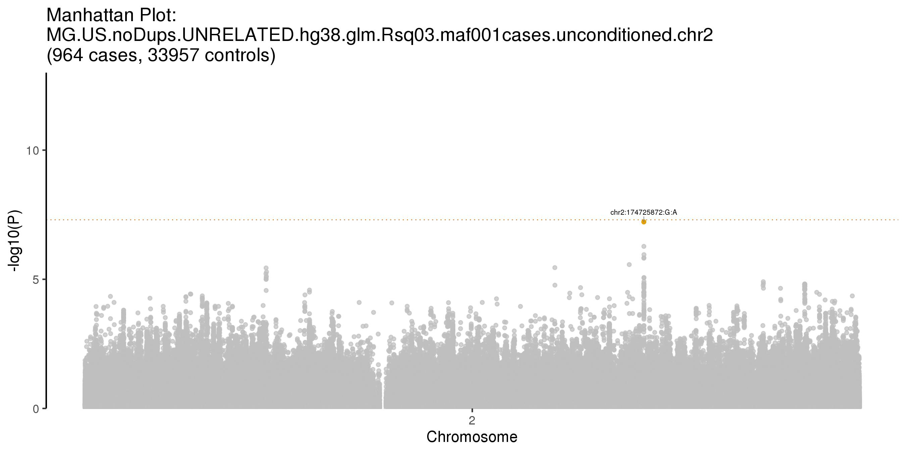


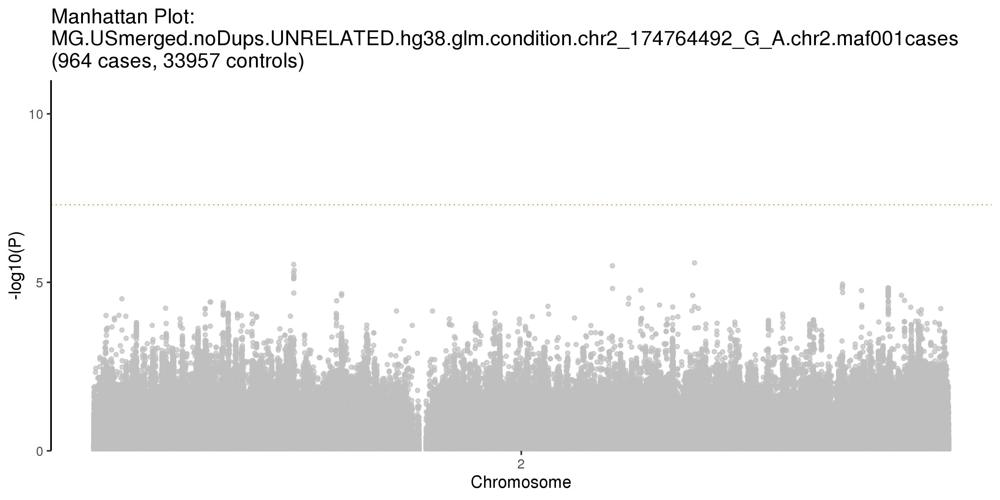


#### chr6_32620936_T_C


```python
from IPython.display import display
from PIL import Image

uncond="ConditionalAnalysis/MG.US.noDups.UNRELATED.hg38.glm.Rsq03.maf001cases.unconditioned.chr6.manhattan_v1.jpeg"
display(Image.open(uncond))

cond="ConditionalAnalysis/MG.USmerged.noDups.UNRELATED.hg38.glm.condition.chr6_32620936_T_C.chr6.maf001cases.manhattan_v1.jpeg"
display(Image.open(cond))
```


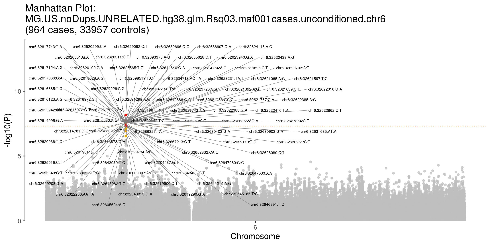


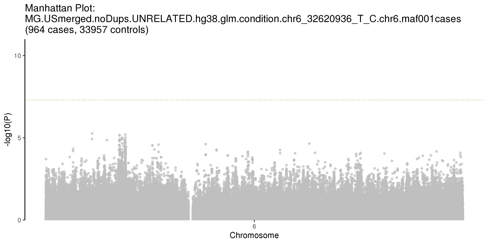


#### chr6_31358836_A_G


```python
from IPython.display import display
from PIL import Image

cond="ConditionalAnalysis/MG.USmerged.noDups.UNRELATED.hg38.glm.condition.chr6_31358836_A_G.chr6.maf001cases.manhattan_v1.jpeg"
display(Image.open(cond))
```


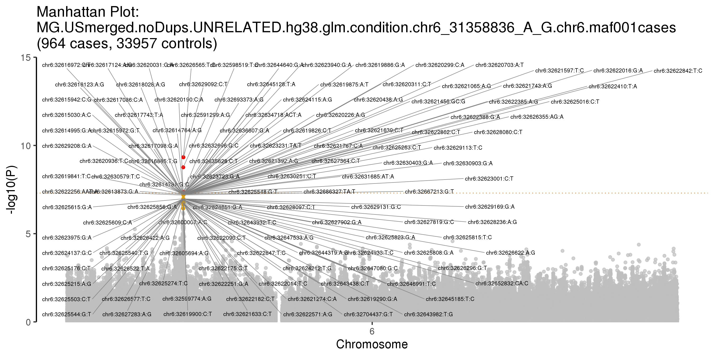


#### chr6_31358836_A_G.chr6_32620936_T_C


```python
from IPython.display import display
from PIL import Image

cond="ConditionalAnalysis/MG.USmerged.noDups.UNRELATED.hg38.glm.condition.chr6_31358836_A_G.chr6_32620936_T_C.chr6.maf001cases.manhattan_v1.jpeg"
display(Image.open(cond))
```


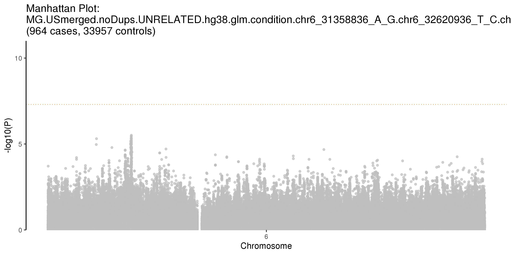


#### chr8_108247378_T_C


```python
from IPython.display import display
from PIL import Image

uncond="ConditionalAnalysis/MG.US.noDups.UNRELATED.hg38.glm.Rsq03.maf001cases.unconditioned.chr8.manhattan_v1.jpeg"
display(Image.open(uncond))

cond="ConditionalAnalysis/MG.USmerged.noDups.UNRELATED.hg38.glm.condition.chr8_108247378_T_C.chr8.maf001cases.manhattan_v1.jpeg"
display(Image.open(cond))
```


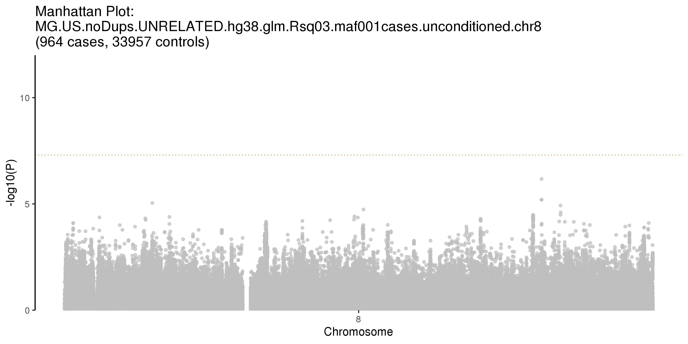


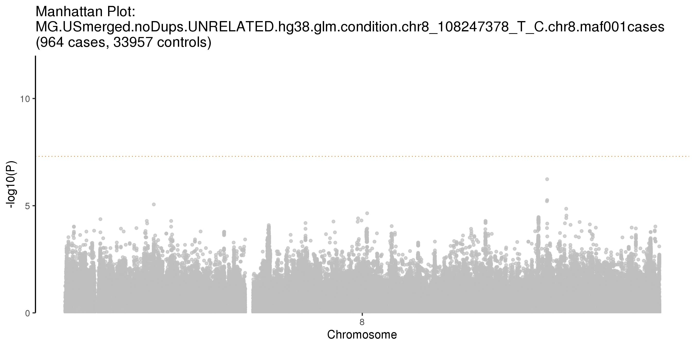


#### chr10_7410781_A_G


```python
from IPython.display import display
from PIL import Image

uncond="ConditionalAnalysis/MG.US.noDups.UNRELATED.hg38.glm.Rsq03.maf001cases.unconditioned.chr10.manhattan_v1.jpeg"
display(Image.open(uncond))

cond="ConditionalAnalysis/MG.USmerged.noDups.UNRELATED.hg38.glm.condition.chr10_7410781_A_G.chr10.maf001cases.manhattan_v1.jpeg"
display(Image.open(cond))
```


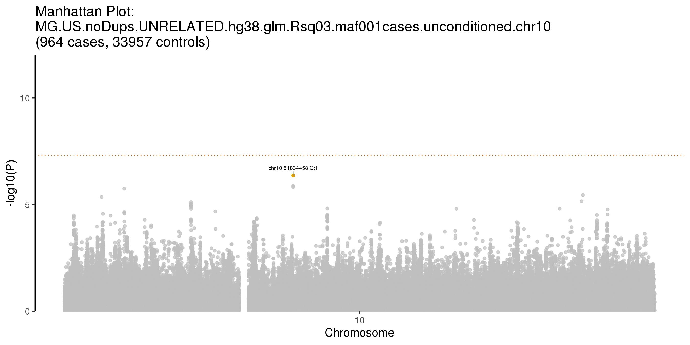


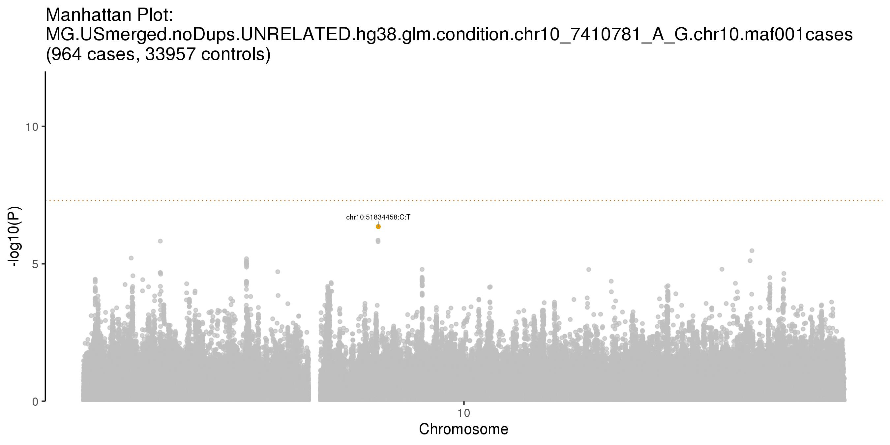


#### chr11_95578258_T_C


```python
from IPython.display import display
from PIL import Image

uncond="ConditionalAnalysis/MG.US.noDups.UNRELATED.hg38.glm.Rsq03.maf001cases.unconditioned.chr11.manhattan_v1.jpeg"
display(Image.open(uncond))

cond="ConditionalAnalysis/MG.USmerged.noDups.UNRELATED.hg38.glm.condition.chr11_95578258_T_C.chr11.maf001cases.manhattan_v1.jpeg"
display(Image.open(cond))
```


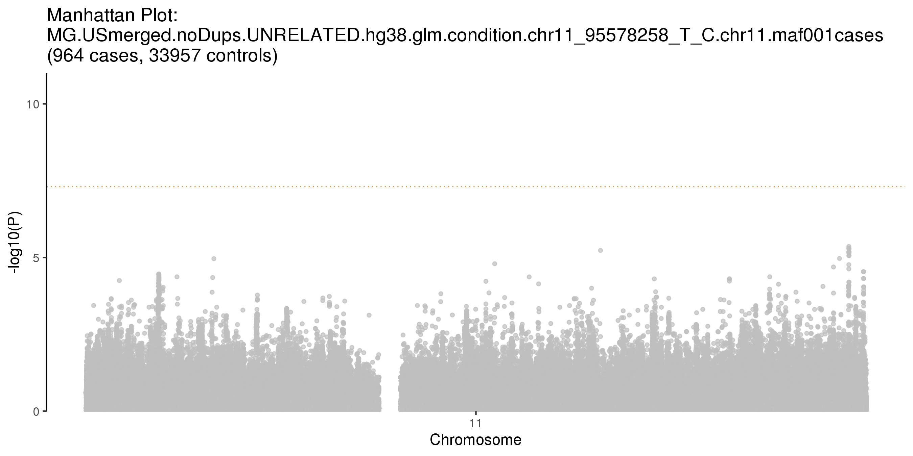


#### chr18_62355088_C_T


```python
from IPython.display import display
from PIL import Image

uncond="ConditionalAnalysis/MG.US.noDups.UNRELATED.hg38.glm.Rsq03.maf001cases.unconditioned.chr18.manhattan_v1.jpeg"
display(Image.open(uncond))

cond="ConditionalAnalysis/MG.USmerged.noDups.UNRELATED.hg38.glm.condition.chr18_62355088_C_T.chr18.maf001cases.manhattan_v1.jpeg"
display(Image.open(cond))
```


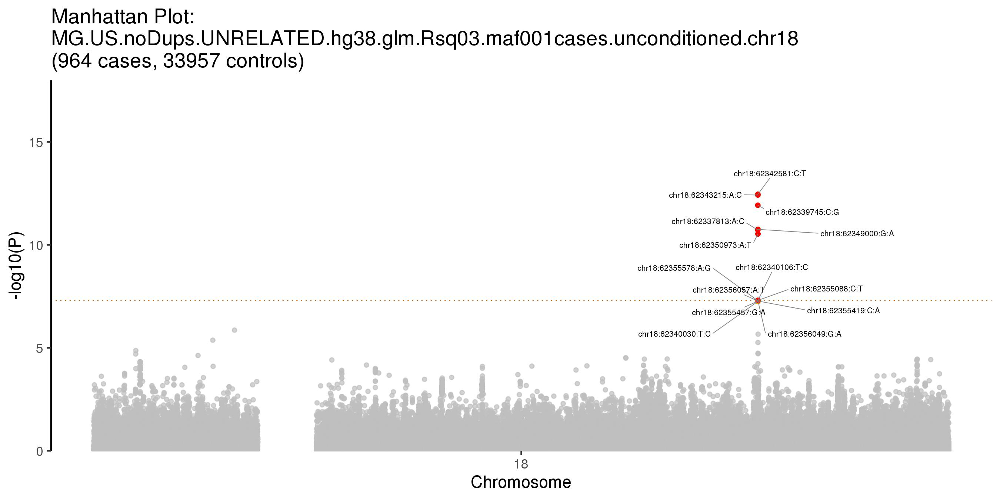


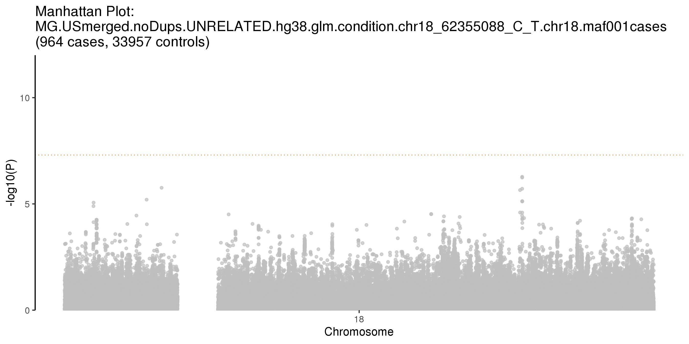


### Plot genome-wide manhattan and QQ (with summ stats from conditional analysis) for meta analysis

#### Merge conditional analysis with non-conditional summary stats

**Notes:** 
1. Replace results from chr1,2,6,8,10,11 and 18 from non-conditional summary stats with summ stats from conditional analysis --> plot QQ and Manhattan
2. Where there are multiple significant loci per chromosome, the index variant with the smallest p-value is used for conditional analysis.

Index variants:
- chr1_113834946_A_G
- chr2_174764492_G_A
- chr6_32620936_T_C
- chr8_108247378_T_C
- chr10_7410781_A_G
- chr11_95578258_T_C
- chr18_62355088_C_T


```bash
%%bash
cd ConditionalAnalysis

head -n 1 ./toArchive/MG.USmerged.noDups.UNRELATED.hg38.conditioned.glm_chr1.PHENO.glm.logistic.hybrid > MG.USmerged.noDups.UNRELATED.hg38.glm.condition.tophits.txt 

tail -n +2 ./toArchive/MG.USmerged.noDups.UNRELATED.hg38.conditioned.glm_chr1.PHENO.glm.logistic.hybrid >> MG.USmerged.noDups.UNRELATED.hg38.glm.condition.tophits.txt
tail -n +2 ./toArchive/MG.USmerged.noDups.UNRELATED.hg38.conditioned.glm_chr2.PHENO.glm.logistic.hybrid >> MG.USmerged.noDups.UNRELATED.hg38.glm.condition.tophits.txt
tail -n +2 ./toArchive/MG.USmerged.noDups.UNRELATED.hg38.conditioned.glm_chr6.PHENO.glm.logistic.hybrid >> MG.USmerged.noDups.UNRELATED.hg38.glm.condition.tophits.txt
tail -n +2 ./toArchive/MG.USmerged.noDups.UNRELATED.hg38.conditioned.glm_chr8.PHENO.glm.logistic.hybrid >> MG.USmerged.noDups.UNRELATED.hg38.glm.condition.tophits.txt
tail -n +2 ./toArchive/MG.USmerged.noDups.UNRELATED.hg38.conditioned.glm_chr10.PHENO.glm.logistic.hybrid >> MG.USmerged.noDups.UNRELATED.hg38.glm.condition.tophits.txt
tail -n +2 ./toArchive/MG.USmerged.noDups.UNRELATED.hg38.conditioned.glm_chr11.PHENO.glm.logistic.hybrid >> MG.USmerged.noDups.UNRELATED.hg38.glm.condition.tophits.txt
tail -n +2 ./toArchive/MG.USmerged.noDups.UNRELATED.hg38.conditioned.glm_chr18.PHENO.glm.logistic.hybrid >> MG.USmerged.noDups.UNRELATED.hg38.glm.condition.tophits.txt

```


```bash
%%bash
cd ConditionalAnalysis

module load R/3.5.2
R --vanilla --no-save

# Load libraries
require(data.table)
require(tidyverse)

# Read in data
summ <- fread("../MG.US.noDups.UNRELATED.hg38.glm.Rsq03MAF00001_ALLchr.txt",header=T)
summ1 <- summ %>% filter(`#CHROM` != "1" &
                         `#CHROM` != "2" & 
                         `#CHROM` != "6" & 
                         `#CHROM` != "8" & 
                         `#CHROM` != "10" & 
                         `#CHROM` != "11" & 
                         `#CHROM` != "18")
cond <- fread("MG.USmerged.noDups.UNRELATED.hg38.glm.condition.tophits.txt",header=T)
both <- rbind(summ1,cond) %>% arrange(`#CHROM`,POS)
write.table(both,"MG.USmerged.noDups.UNRELATED.hg38.MERGEDconditional.txt",quote=F,sep="\t",col.names=T,row.names=F)
```

    
    R version 3.5.2 (2018-12-20) -- "Eggshell Igloo"
    Copyright (C) 2018 The R Foundation for Statistical Computing
    Platform: x86_64-pc-linux-gnu (64-bit)
    
    R is free software and comes with ABSOLUTELY NO WARRANTY.
    You are welcome to redistribute it under certain conditions.
    Type 'license()' or 'licence()' for distribution details.
    
    R is a collaborative project with many contributors.
    Type 'contributors()' for more information and
    'citation()' on how to cite R or R packages in publications.
    
    Type 'demo()' for some demos, 'help()' for on-line help, or
    'help.start()' for an HTML browser interface to help.
    Type 'q()' to quit R.
    
    > 
    > # Load libraries
    > require(data.table)
    > require(tidyverse)
    > 
    > # Read in data
    > summ <- fread("../MG.US.noDups.UNRELATED.hg38.glm.Rsq03MAF00001_ALLchr.txt",header=T)
    > summ1 <- summ %>% filter(`#CHROM` != "1" &
    +                          `#CHROM` != "2" & 
    +                          `#CHROM` != "6" & 
    +                          `#CHROM` != "8" & 
    +                          `#CHROM` != "10" & 
    +                          `#CHROM` != "11" & 
    +                          `#CHROM` != "18")
    > cond <- fread("MG.USmerged.noDups.UNRELATED.hg38.glm.condition.tophits.txt",header=T)
    > both <- rbind(summ1,cond) %>% arrange(`#CHROM`,POS)
    > write.table(both,"MG.USmerged.noDups.UNRELATED.hg38.MERGEDconditional.txt",quote=F,sep="\t",col.names=T,row.names=F)
    > 


    [-] Unloading gcc  9.2.0  ... 
    [-] Unloading GSL 2.6 for GCC 9.2.0 ... 
    [-] Unloading openmpi 3.1.4  for GCC 9.2.0 
    [-] Unloading ImageMagick  7.0.8  on cn3524 
    [-] Unloading HDF5  1.10.4 
    [-] Unloading NetCDF 4.7.4_gcc9.2.0 
    [-] Unloading pandoc  2.11.4  on cn3524 
    [-] Unloading pcre2 10.21  ... 
    [-] Unloading R 4.0.3 
    [+] Loading gcc  7.3.0  ... 
    [+] Loading GSL 2.4 for GCC 7.2.0 ... 
    [-] Unloading gcc  7.3.0  ... 
    [+] Loading gcc  7.3.0  ... 
    [+] Loading openmpi 3.0.2  for GCC 7.3.0 
    [+] Loading ImageMagick  7.0.8  on cn3524 
    [+] Loading HDF5  1.10.4 
    [+] Loading pandoc  2.11.4  on cn3524 
    [+] Loading R 3.5.2 
    
    The following have been reloaded with a version change:
      1) GSL/2.6_gcc-9.2.0 => GSL/2.4_gcc-7.2.0     3) gcc/9.2.0 => gcc/7.3.0
      2) R/4.0 => R/3.5.2
    
    Loading required package: data.table
    Loading required package: tidyverse
    -- Attaching packages --------------------------------------- tidyverse 1.2.1 --
    v ggplot2 3.3.2     v purrr   0.3.4
    v tibble  3.0.3     v dplyr   0.8.5
    v tidyr   0.8.3     v stringr 1.4.0
    v readr   1.3.1     v forcats 0.5.0
    -- Conflicts ------------------------------------------ tidyverse_conflicts() --
    x dplyr::between()   masks data.table::between()
    x dplyr::filter()    masks stats::filter()
    x dplyr::first()     masks data.table::first()
    x dplyr::lag()       masks stats::lag()
    x dplyr::last()      masks data.table::last()
    x purrr::transpose() masks data.table::transpose()


### Prepare file for conditional meta analysis


```bash
%%bash
cd ConditionalAnalysis

echo "Rscript ../../../scripts/toMetaprep.glm.updated.v2.R MG.USmerged.noDups.UNRELATED.hg38.MERGEDconditional.txt MG.USmerged.noDups.UNRELATED.hg38.MERGEDconditional" > prep2.swarm
swarm --file prep2.swarm --logdir swarmOE_prep -g 120 --module R/3.5.2 --gres=lscratch:500  --time 4:00:00
```

    10632693


```bash
%%bash
# for the additional independent signal on chr 6
cd ConditionalAnalysis

for Variant in {chr6_31358836_A_G,chr6_31358836_A_G.chr6_32620936_T_C};
do
echo "Rscript ../../../scripts/toMetaprep.glm.updated.v2.R MG.USmerged.noDups.UNRELATED.hg38.glm.condition.${Variant}.chr6.maf001cases.txt MG.USmerged.noDups.UNRELATED.hg38.glm.condition.${Variant}.chr6.maf001cases" >> prep3.swarm
done
swarm --file prep3.swarm --logdir swarmOE_prep -g 120 --module R/3.5.2 --gres=lscratch:500  --time 4:00:00
```

    10632968

