# Meta Analysis MG: USmerged and Itals (imputed hg38)

**Start date:** 03-08-2021

**Updated date:** 03-08-2021

**Analysed by:** Ruth Chia

**Working directory:** `/data/NDRS_LNG/MyastheniaGravis/updated.April2020/MetaAnalysis.hg38.ByCohort.rerun/USmerged.Itals.hg38`

___


```python
!pwd
```

    /gpfs/gsfs11/users/NDRS_LNG/MyastheniaGravis/updated.April2020/MetaAnalysis.hg38.ByCohort.rerun/USmerged.Itals.hg38


<h1>Table of Contents<span class="tocSkip"></span></h1>
<div class="toc"><ul class="toc-item"><li><span><a href="#Summary-stats-file-needed" data-toc-modified-id="Summary-stats-file-needed-1">Summary stats file needed</a></span></li><li><span><a href="#What-I-need-to-do" data-toc-modified-id="What-I-need-to-do-2">What I need to do</a></span></li><li><span><a href="#Run-metal" data-toc-modified-id="Run-metal-3">Run metal</a></span></li><li><span><a href="#Include-maf-cases-and-controls-in-meta-results" data-toc-modified-id="Include-maf-cases-and-controls-in-meta-results-4">Include maf cases and controls in meta results</a></span></li><li><span><a href="#Plot-manhattan-and-QQ" data-toc-modified-id="Plot-manhattan-and-QQ-5">Plot manhattan and QQ</a></span><ul class="toc-item"><li><span><a href="#filtered-maf-(overall)->-0.01" data-toc-modified-id="filtered-maf-(overall)->-0.01-5.1">filtered maf (overall) &gt; 0.01</a></span></li><li><span><a href="#Get-list-of-hits-with-p-<-1e-7" data-toc-modified-id="Get-list-of-hits-with-p-<-1e-7-5.2">Get list of hits with p &lt; 1e-7</a></span></li></ul></li><li><span><a href="#Extract-hits-from-each-cohort" data-toc-modified-id="Extract-hits-from-each-cohort-6">Extract hits from each cohort</a></span><ul class="toc-item"><li><span><a href="#USmerged" data-toc-modified-id="USmerged-6.1">USmerged</a></span></li><li><span><a href="#Italy" data-toc-modified-id="Italy-6.2">Italy</a></span></li></ul></li><li><span><a href="#Create-forest-plot" data-toc-modified-id="Create-forest-plot-7">Create forest plot</a></span></li><li><span><a href="#Convert-index-variants-at-signif-loci-to-hg19-(to-be-used-to-extract-vars-for-glm-from-UKBB-hg19-dataset)" data-toc-modified-id="Convert-index-variants-at-signif-loci-to-hg19-(to-be-used-to-extract-vars-for-glm-from-UKBB-hg19-dataset)-8">Convert index variants at signif loci to hg19 (to be used to extract vars for glm from UKBB hg19 dataset)</a></span><ul class="toc-item"><li><span><a href="#Prep-for-liftover" data-toc-modified-id="Prep-for-liftover-8.1">Prep for liftover</a></span></li><li><span><a href="#Run-liftover" data-toc-modified-id="Run-liftover-8.2">Run liftover</a></span></li><li><span><a href="#Update-positions-to-hg19" data-toc-modified-id="Update-positions-to-hg19-8.3">Update positions to hg19</a></span></li><li><span><a href="#Get-imputation-info-of-variants-of-interest-from-UKBB" data-toc-modified-id="Get-imputation-info-of-variants-of-interest-from-UKBB-8.4">Get imputation info of variants of interest from UKBB</a></span></li><li><span><a href="#Run-replication-in-UKBB" data-toc-modified-id="Run-replication-in-UKBB-8.5">Run replication in UKBB</a></span><ul class="toc-item"><li><span><a href="#Run-GLM-MG" data-toc-modified-id="Run-GLM-MG-8.5.1">Run GLM MG</a></span></li><li><span><a href="#Run-GLM-MG_Males" data-toc-modified-id="Run-GLM-MG_Males-8.5.2">Run GLM MG_Males</a></span></li><li><span><a href="#Run-GLM-MG_Females" data-toc-modified-id="Run-GLM-MG_Females-8.5.3">Run GLM MG_Females</a></span></li><li><span><a href="#Run-GLM-LOMG-(conditional-for-chr-6-on-rs76815088)" data-toc-modified-id="Run-GLM-LOMG-(conditional-for-chr-6-on-rs76815088)-8.5.4">Run GLM LOMG (conditional for chr 6 on rs76815088)</a></span></li><li><span><a href="#Prepare-UKBB-results-for-meta-analysis" data-toc-modified-id="Prepare-UKBB-results-for-meta-analysis-8.5.5">Prepare UKBB results for meta analysis</a></span></li></ul></li></ul></li><li><span><a href="#Merge-summary-stats-with-hg38-rsid-file-to-get-rsids" data-toc-modified-id="Merge-summary-stats-with-hg38-rsid-file-to-get-rsids-9">Merge summary stats with hg38 rsid file to get rsids</a></span></li><li><span><a href="#Prep-file-for-LocusZoom" data-toc-modified-id="Prep-file-for-LocusZoom-10">Prep file for LocusZoom</a></span><ul class="toc-item"><li><span><a href="#Link-to-plots" data-toc-modified-id="Link-to-plots-10.1">Link to plots</a></span></li></ul></li><li><span><a href="#Plot-demographic-sample-distribution-for-each-cohort" data-toc-modified-id="Plot-demographic-sample-distribution-for-each-cohort-11">Plot demographic sample distribution for each cohort</a></span></li></ul></div>

## Summary stats file needed
1. MG.USmerged: `/data/NDRS_LNG/MyastheniaGravis/updated.April2020/US/Analysis.GLM.hg38/US.JointPostImputation/toMeta.MG.US.noDups.UNRELATED.hg38.glm.Rsq03MAF00001.tab`

2. MG.Itals: `/data/NDRS_LNG/MyastheniaGravis/updated.April2020/Itals/Analysis.GLM.hg38.rerun/toMeta.MG.ITALS.noDups.UNRELATED.hg38.glm.Rsq03MAF00001.tab`
    
## What I need to do
1. Prepare summary stats for meta analysis
2. Run metal
3. Filter by direction and maf > 0.01 --> plot QQ and manhattan

## Run metal

metal script: `metal_MG.US.Itals.hg38.v1.txt`

```bash
# THIS SCRIPT EXECUTES AN ANALYSIS OF THREE STUDIES
# (i.e. MG.US and MG.Itals filtered for --maf 0.0001, Rsq>03)

# THE RESULTS FOR EACH STUDY ARE STORED IN FILES:
# /data/NDRS_LNG/MyastheniaGravis/updated.April2020/US/Analysis.GLM.hg38/US.JointPostImputation/toMeta.MG.US.noDups.UNRELATED.hg38.glm.Rsq03MAF00001.tab
# /data/NDRS_LNG/MyastheniaGravis/updated.April2020/Itals/Analysis.GLM.hg38.rerun/toMeta.MG.ITALS.noDups.UNRELATED.hg38.glm.Rsq03MAF00001.tab

SCHEME  STDERR
AVERAGEFREQ ON
MINMAXFREQ ON

# LOAD THE FIRST INPUT FILE
# UNCOMMENT THE NEXT LINE TO ENABLE GenomicControl CORRECTION
# GENOMICCONTROL ON

# === DESCRIBE AND PROCESS THE FIRST INPUT FILE ===
MARKER marker
ALLELE EffectAllele OtherAllele
FREQ   Freq_EffectAllele.CASE
EFFECT BETA
STDERR SE
PVALUE P
#WEIGHT OBS_CT
PROCESS /data/NDRS_LNG/MyastheniaGravis/updated.April2020/US/Analysis.GLM.hg38/US.JointPostImputation/toMeta.MG.US.noDups.UNRELATED.hg38.glm.Rsq03MAF00001.tab

# === DESCRIBE AND PROCESS ADDITIONAL INPUT FILE ===
PROCESS /data/NDRS_LNG/MyastheniaGravis/updated.April2020/Itals/Analysis.GLM.hg38.rerun/toMeta.MG.ITALS.noDups.UNRELATED.hg38.glm.Rsq03MAF00001.tab

OUTFILE META_MG.USmerged.Itals.UNRELATED.hg38.Rsq03MAF00001.FreqCases.glm .tbl
ANALYZE HETEROGENEITY
```

___

metal script: `metal_MG.US.Itals.hg38.v2.txt`

```bash
# THIS SCRIPT EXECUTES AN ANALYSIS OF THREE STUDIES
# (i.e. MG.US and MG.Itals filtered for --maf 0.0001, Rsq>03)

# THE RESULTS FOR EACH STUDY ARE STORED IN FILES:
# /data/NDRS_LNG/MyastheniaGravis/updated.April2020/US/Analysis.GLM.hg38/US.JointPostImputation/toMeta.MG.US.noDups.UNRELATED.hg38.glm.Rsq03MAF00001.tab
# /data/NDRS_LNG/MyastheniaGravis/updated.April2020/Itals/Analysis.GLM.hg38.rerun/toMeta.MG.ITALS.noDups.UNRELATED.hg38.glm.Rsq03MAF00001.tab

SCHEME  STDERR
AVERAGEFREQ ON
MINMAXFREQ ON

# LOAD THE FIRST INPUT FILE
# UNCOMMENT THE NEXT LINE TO ENABLE GenomicControl CORRECTION
# GENOMICCONTROL ON

# === DESCRIBE AND PROCESS THE FIRST INPUT FILE ===
MARKER marker
ALLELE EffectAllele OtherAllele
FREQ   Freq_EffectAllele
EFFECT BETA
STDERR SE
PVALUE P
#WEIGHT OBS_CT
PROCESS /data/NDRS_LNG/MyastheniaGravis/updated.April2020/US/Analysis.GLM.hg38/US.JointPostImputation/toMeta.MG.US.noDups.UNRELATED.hg38.glm.Rsq03MAF00001.tab

# === DESCRIBE AND PROCESS ADDITIONAL INPUT FILE ===
PROCESS /data/NDRS_LNG/MyastheniaGravis/updated.April2020/Itals/Analysis.GLM.hg38.rerun/toMeta.MG.ITALS.noDups.UNRELATED.hg38.glm.Rsq03MAF00001.tab

OUTFILE META_MG.USmerged.Itals.UNRELATED.hg38.Rsq03MAF00001.FreqBoth.glm .tbl
ANALYZE HETEROGENEITY
```


```bash
%%bash
echo "metal metal_MG.US.Itals.hg38.v1.txt" > metal.swarm
echo "metal metal_MG.US.Itals.hg38.v2.txt" >> metal.swarm
swarm --file metal.swarm --logdir swarmOE_metal --module metal -g 120 -t auto --time 02:00:00 --partition quick
```

    10644237


## Include maf cases and controls in meta results

script to reformat, add maf for cases and controls before plotting: `ReformatMetaResults.addMAF.v2.R`
```Rscript

#!/usr/bin/env Rscript

args <- commandArgs(trailingOnly=TRUE)
if (length(args) != 4) {
  stop("USAGE: Rscript ReformatMetaResults.addMAF.R args[1] args[2] args[3] args[4]
  where args[1] = metaResults
        args[2] = toMetaInput.US
        args[3] = toMetaInput.Itals
        args[4] = outputFileName")
}

# Load libraries
require(data.table)
require(tidyverse)


# Set variables
metaResults <- args[1]
toMetaInput.US <- args[2]
toMetaInput.Itals <- args[3]
outputFileName <- args[4]

# Read in files and reformat meta
meta <- fread(metaResults, header=T) %>%
        mutate(snp = MarkerName) %>%
        separate(snp,c("CHROM","POS","OA","EA"),sep=":")

meta$OA <- tolower(meta$OA)
meta$EA <- tolower(meta$EA)
meta$EffectAllele <- ifelse(meta$EA == meta$Allele1, meta$Allele1, meta$Allele2)
meta$OtherAllele <- ifelse(meta$EA == meta$Allele1, meta$Allele2, meta$Allele1)
meta$maf_EA.cases <- ifelse(meta$EA == meta$Allele1, meta$Freq1, 1 - meta$Freq1)
meta$beta <- ifelse(meta$EffectAllele == meta$Allele1, meta$Effect, meta$Effect*-1)

tmp1 <- meta %>% rename(P = `P-value`) %>% filter(P > 0.00000005)
tmp2 <- meta %>% rename(P = `P-value`) %>%
        filter(P < 0.00000005) %>%
        filter(Direction == "--" | Direction == "++")

data <- rbind(tmp1,tmp2) %>%
        mutate(CHROM = as.numeric(gsub("chr","",CHROM), POS = as.numeric(POS))) %>%
        filter(POS != is.na(POS)) %>%
        filter(HetISq <= 80) %>%
        filter(Direction == "--" | Direction == "+-" | Direction == "-+" | Direction == "++") %>%
        select(CHROM,POS,MarkerName,EffectAllele,OtherAllele,maf_EA.cases,beta,StdErr,P,Direction,HetISq) %>%
        arrange(CHROM,POS)

dim(meta)
dim(data)

# Get frequency information
us <- fread(args[2],header=T) %>%
      select(marker,Freq_EffectAllele,Freq_EffectAllele.CASE,Freq_EffectAllele.CTRL,
             ALLELE_CT,CASE_ALLELE_CT,CTRL_ALLELE_CT,
             EffectAllele_CT,EffectAllele_CT.CASE,EffectAllele_CT.CTRL)
colnames(us)[2:10] <- paste(colnames(us)[2:10],"_US",sep="")

itals <- fread(args[3],header=T) %>%
         select(marker,Freq_EffectAllele,Freq_EffectAllele.CASE,Freq_EffectAllele.CTRL,
                ALLELE_CT,CASE_ALLELE_CT,CTRL_ALLELE_CT,
                EffectAllele_CT,EffectAllele_CT.CASE,EffectAllele_CT.CTRL)
colnames(itals)[2:10] <- paste(colnames(itals)[2:10],"_Italy",sep="")

both <- merge(us,itals,by="marker")

dim(us)
dim(itals)
dim(both)

both$Freq_EffectAllele <- (both$Freq_EffectAllele_US + both$Freq_EffectAllele_Italy)/2
both$Freq_EffectAllele.CASE <- (both$Freq_EffectAllele.CASE_US + both$Freq_EffectAllele.CASE_Italy)/2
both$Freq_EffectAllele.CTRL <- (both$Freq_EffectAllele.CTRL_US + both$Freq_EffectAllele.CTRL_Italy)/2

both$ALLELE_CT <- both$ALLELE_CT_US + both$ALLELE_CT_Italy
both$ALLELE_CT.CASE <- both$CASE_ALLELE_CT_US + both$CASE_ALLELE_CT_Italy
both$ALLELE_CT.CTRL <- both$CTRL_ALLELE_CT_US + both$CTRL_ALLELE_CT_Italy

both$EffectAllele_CT <- both$EffectAllele_CT_US + both$EffectAllele_CT_Italy
both$EffectAllele_CT.CASE <- both$EffectAllele_CT.CASE_US + both$EffectAllele_CT.CASE_Italy
both$EffectAllele_CT.CTRL <- both$EffectAllele_CT.CTRL_US + both$EffectAllele_CT.CTRL_Italy

both$maf_EA <- both$EffectAllele_CT/both$ALLELE_CT
both$maf_EA.CASE <- both$EffectAllele_CT.CASE/both$ALLELE_CT.CASE
both$maf_EA.CTRL <- both$EffectAllele_CT.CTRL/both$ALLELE_CT.CTRL
write.table(both,"MAF.USmerged.Itals.txt",sep="\t",quote=F,row.names=F,col.names=T)
            
freq <- both %>%
        select(marker,Freq_EffectAllele,Freq_EffectAllele.CASE,Freq_EffectAllele.CTRL,
              ALLELE_CT,ALLELE_CT.CASE,ALLELE_CT.CTRL,
              EffectAllele_CT,EffectAllele_CT.CASE,EffectAllele_CT.CTRL,
              maf_EA,maf_EA.CASE,maf_EA.CTRL)


# merge formatted meta results with frequency file
tmp <- merge(data,freq,by.x="MarkerName",by.y="marker")
data2 <- tmp %>% 
         select(CHROM,POS,MarkerName,EffectAllele,OtherAllele,
                maf_EA,maf_EA.CASE,maf_EA.CTRL,beta,StdErr,P,Direction,HetISq)

write.table(data2,paste(args[4],".filteredDirection.HetISq80.TIDY.v2",".txt",sep=""),quote=F,row.names=F,col.names=T,sep="\t")
```


```bash
%%bash
DIR="/data/NDRS_LNG/MyastheniaGravis/updated.April2020"

echo "Rscript ReformatMetaResults.addMAF.v2.R \
META_MG.USmerged.Itals.UNRELATED.hg38.Rsq03MAF00001.FreqCases.glm1.tbl \
$DIR/US/Analysis.GLM.hg38/US.JointPostImputation/toMeta.MG.US.noDups.UNRELATED.hg38.glm.Rsq03MAF00001.tab \
$DIR/Itals/Analysis.GLM.hg38.rerun/toMeta.MG.ITALS.noDups.UNRELATED.hg38.glm.Rsq03MAF00001.tab \
META_MG.USmerged.Itals.UNRELATED.hg38.Rsq03" > format.v2.swarm

swarm --file format.v2.swarm --logdir swarmOE_plot -g 120 --time 3:00:00 \
--gres=lscratch:200 --module R/3.5.2 --partition quick --dependency=afterany:10644237
```

    11781677


## Plot manhattan and QQ

script to plot: `plotResults.meta-GLM.FilterMAFcases.updated.R`
    
```Rscript
#!/usr/bin/env Rscript

args <- commandArgs(trailingOnly=TRUE)
if (length(args) != 5) {
  stop("USAGE: Rscript plotResults.meta-GLM.FilterMAFcases.updated.R args[1] args[2] args[3] args[4] args[5]
  where args[1] = inputFileGLM.formatted
        args[2] = title
        args[3] = NoCases
        args[4] = NoControls
        args[5] = MAFcutoff")
}

# Load libraries
require(data.table)
require(tidyverse)
library(ggrepel)
library(ggplot2)

# read in data
input <- args[1]
title <- args[2]
MAFcutoff <-  as.numeric(args[5]) 

metal00 <- fread(input,header=T)
metal00$P <- as.numeric(metal00$P)

metal01 <- metal00 %>%
           mutate(CHROM = as.integer(CHROM)) %>%
           mutate(POS = as.integer(POS))

metal <- metal01 %>%
         group_by(CHROM) %>%
         summarise(chr_len=max(POS)) %>%
         mutate(tot=cumsum(as.numeric(chr_len))-chr_len) %>%
         select(-chr_len) %>%
         left_join(metal01, ., by=c("CHROM"="CHROM")) %>%
         arrange(CHROM, POS) %>%
         mutate( BPcum=POS+tot) %>%
         filter(maf_EA.CASE > MAFcutoff) %>%
         arrange(CHROM,BPcum)
         
write.table(metal, paste(title,".tbl",sep=""),quote=F,sep="\t",row.names=F,col.names=T)


# Setup some variables
cutoff <- 0.00000005
NoCases <- args[3]
NoControls <- args[4]


# Combine all to single data frame
data <- metal %>%
        filter(P != is.na(P)) %>%
        mutate( is_highlight_sig=ifelse(-log10(P)>=-log10(cutoff), "yes", "no")) %>%
        mutate( is_highlight_subsig=ifelse(-log10(P)>=-log10(cutoff)-1, "yes", "no")) %>%
        mutate( is_annotate=ifelse(-log10(P)>=-log10(cutoff)-1, "yes", "no"))

# Plot QQ and manhattan
# Prepare axis split by chrom
axisdf = data %>% group_by(CHROM) %>% summarize(center=( max(BPcum) + min(BPcum) ) / 2 )


# Calculate lambda(raw) and lambda(1000)
print("Calculating lambda")
p1 <- data$P
n1 <- length(data$P)
NoCases <- as.numeric(args[3])
NoControls <- as.numeric(args[4])
x2obs_1 <- qchisq(as.numeric(as.character(p1)), 1, lower.tail = FALSE)
x2exp_1 <- qchisq((1:n1)/n1, 1, lower.tail = FALSE)
lambda <- median(x2obs_1)/median(x2exp_1)
print(paste("Lambda(raw) = ", lambda, sep = ""))
lambda1000 <- 1 + ( lambda -1 ) * (1/NoCases + 1/NoControls)/(1/1000 + 1/1000)
print(paste("Lambda(1000) = ", lambda1000, sep = ""))

# Graph QQ plot
if(!require(qqman)){
    install.packages("qqman")
    library(qqman)
}

CASES <- paste(NoCases,"cases",sep=" ")
CONTROLS <- paste(NoControls,"controls",sep=" ")

jpeg(paste(title,".QQ.jpeg", sep = ""))
qq(data$P, main = paste("QQ-plot: \n", title,"\n(",CASES,"\n",CONTROLS,")", sep = ""), sub = bquote(lambda ~ '=' ~ .(signif(lambda, 4)) ~~ lambda[1000] ~ '=' ~.(signif(lambda1000, 4))), cex.lab=1.2, cex.axis=1.2, font.lab=2, font.axis=2, lwd=1.3, ylim = c(0,ceiling(-log10(min(data$P)))))
dev.off()


# Graph manhattan plot i.e. plot_v0 = without label; plot_v1 = with labels
plot_v0 <- ggplot(data, aes(x=BPcum, y=-log10(P))) +
            geom_point( aes(color=as.factor(CHROM)),alpha =0.7,size=1) +
            scale_color_manual(values = rep(c("grey", "#0072B2"), 22 )) +
            scale_alpha_manual(guide='none', values = list("FALSE" = 0.8, "TRUE" = 0.2)) +
            scale_x_continuous( label = axisdf$CHROM, breaks= axisdf$center ) +
            scale_y_continuous(limits = c(0,ceiling(-log10(min(data$P)))+2), breaks = seq(0, ceiling(-log10(min(data$P)))+2, by = 1), expand = c(0, 0) ) +     ## remove space between plot area and x axis
            ggtitle(paste("Manhattan Plot:\n",title,"\n(",CASES,", ",CONTROLS,")", sep="")) +
            theme(plot.title = element_text(face = "bold", size = 3)) +
            xlab("Chromosome") +
            geom_point(data=subset(data, is_highlight_subsig=="yes"), color="#e69f00", size=1) +
            geom_point(data=subset(data, is_highlight_sig=="yes"), color="red", size=1) +
            geom_hline(yintercept = -log10(cutoff), linetype = "dotted", color = "darkorange3", size = 0.25) +
            ## Add label using ggrepel to avoid overlapping
            # geom_label_repel( data=subset(data, is_annotate=="yes"), aes(x=BPcum,y=-log10(P),label=MarkerName), size=1.8, nudge_x=0.06, nudge_y=0.06, min.segment.length = 0.05, label.padding=0.1, fill = "NA", label.size=NA, segment.size  = 0.2, segment.colour = "gray50") +
            ## Custom the theme:
            theme_bw() +
            theme( legend.position="none",
            panel.border = element_blank(),
            panel.grid.major.x = element_blank(),
            panel.grid.minor.x = element_blank(),
            panel.grid.major.y = element_blank(),
            panel.grid.minor.y = element_blank(),
            axis.line.y = element_line(colour = "black",size = 0.5)
            )

ggsave(paste(title,".manhattan_v0.jpeg", sep = ""), plot = plot_v0, device = "jpeg", scale = 1, width = 9, height = 4.5, units = "in", dpi = 300, limitsize = TRUE)

# Graph manhattan plot i.e. plot_v0 = without label; plot_v1 = with labels
plot_v1 <- ggplot(data, aes(x=BPcum, y=-log10(P))) +
            geom_point( aes(color=as.factor(CHROM)),alpha =0.7,size=1) +
            scale_color_manual(values = rep(c("grey", "#0072B2"), 22 )) +
            scale_alpha_manual(guide='none', values = list("FALSE" = 0.8, "TRUE" = 0.2)) +
            scale_x_continuous( label = axisdf$CHROM, breaks= axisdf$center ) +
            scale_y_continuous(limits = c(0,ceiling(-log10(min(data$P)))+2), breaks = seq(0, ceiling(-log10(min(data$P)))+2, by = 1), expand = c(0, 0) ) +     ## remove space between plot area and x axis
            ggtitle(paste("Manhattan Plot:\n",title,"\n(",CASES,", ",CONTROLS,")", sep="")) +
            theme(plot.title = element_text(face = "bold", size = 3)) +
            xlab("Chromosome") +
            geom_point(data=subset(data, is_highlight_subsig=="yes"), color="#e69f00", size=1) +
            geom_point(data=subset(data, is_highlight_sig=="yes"), color="red", size=1) +
            geom_hline(yintercept = -log10(cutoff), linetype = "dotted", color = "darkorange3", size = 0.25) +
            ## Add label using ggrepel to avoid overlapping
            geom_label_repel( data=subset(data, is_annotate=="yes"), aes(x=BPcum,y=-log10(P),label=MarkerName), size=1.8, nudge_x=0.06, nudge_y=0.06, min.segment.length = 0.05, label.padding=0.1, fill = "NA", label.size=NA, segment.size  = 0.2, segment.colour = "gray50") +
            ## Custom the theme:
            theme_bw() +
            theme( legend.position="none",
            panel.border = element_blank(),
            panel.grid.major.x = element_blank(),
            panel.grid.minor.x = element_blank(),
            panel.grid.major.y = element_blank(),
            panel.grid.minor.y = element_blank(),
            axis.line.y = element_line(colour = "black",size = 0.5)
            )

ggsave(paste(title,".manhattan_v1.jpeg", sep = ""), plot = plot_v1, device = "jpeg", scale = 1, width = 9, height = 4.5, units = "in", dpi = 300, limitsize = TRUE)
```

**Summary of cases and controls per cohort:**

Cohort | Cases | Controls
-------|-------|---------
USmerged | 964 | 33957
Italy | 909 | 2413
**Total** | **1873** | **36370**


```bash
%%bash

echo "Rscript plotResults.meta-GLM.FilterMAFcases.updated.R \
META_MG.USmerged.Itals.UNRELATED.hg38.Rsq03.filteredDirection.HetISq80.TIDY.txt \
META_MG.USmerged.Itals.UNRELATED.hg38.Rsq03.filteredDirectionHetISq80MAF001cases \
1873 36370 0.01" > plot.swarm

```


```bash
%%bash

echo "Rscript plotResults.meta-GLM.FilterMAFoverall.updated.R \
META_MG.USmerged.Itals.UNRELATED.hg38.Rsq03.filteredDirection.HetISq80.TIDY.v2.txt \
META_MG.USmerged.Itals.UNRELATED.hg38.Rsq03.filteredDirectionHetISq80MAF001overall \
1873 36370 0.01" > plot.1.swarm

```


```python
!head -n 1 META_MG.USmerged.Itals.UNRELATED.hg38.Rsq03.filteredDirection.HetISq80.TIDY.v2.txt | tr '\t' '\n' | cat -n
```

         1	CHROM
         2	POS
         3	MarkerName
         4	EffectAllele
         5	OtherAllele
         6	maf_EA
         7	maf_EA.CASE
         8	maf_EA.CTRL
         9	beta
        10	StdErr
        11	P
        12	Direction
        13	HetISq


```bash
%%bash
swarm --file plot.swarm --logdir swarmOE_plot -g 120 --time 3:00:00 \
--gres=lscratch:200 --module R/3.5.2 --partition quick --dependency=afterany:10683728
```


```bash
%%bash
swarm --file plot.1.swarm --logdir swarmOE_plot -g 120 --time 3:00:00 \
--gres=lscratch:200 --module R/3.5.2 --partition quick --dependency=afterany:10683728
```

    11788230


### filtered maf (overall) > 0.01


```python
from IPython.display import display
from PIL import Image

print("Manhattan and QQ plots - Meta Analysis of MG.US and MG.ITALS dataset (maf overall > 0.01, HetISq < 80, no missingness)")

manhattan="META_MG.USmerged.Itals.UNRELATED.hg38.Rsq03.filteredDirectionHetISq80MAF001overall.manhattan_v0.jpeg"
display(Image.open(manhattan))

qq="META_MG.USmerged.Itals.UNRELATED.hg38.Rsq03.filteredDirectionHetISq80MAF001overall.QQ.jpeg"
display(Image.open(qq))

```

    Manhattan and QQ plots - Meta Analysis of MG.US and MG.ITALS dataset (maf overall > 0.01, HetISq < 80, no missingness)


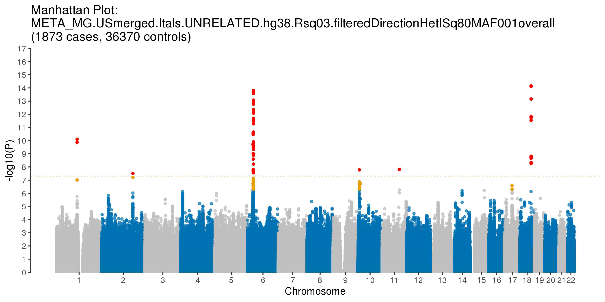


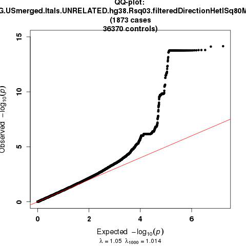


### Get list of hits with p < 1e-7


```python
import pandas as pd
import numpy as np

mg = pd.read_csv("META_MG.USmerged.Itals.UNRELATED.hg38.Rsq03.filteredDirectionHetISq80MAF001overall.tbl",sep="\t")
mgSignificant2 = mg[(mg['P'] <= 0.00000005) & (mg['CHROM'] != 6)]
mgSignificant2.sort_values(by=['CHROM','POS']).drop(['CHROM','POS','BPcum','tot'],axis=1)
```


<div>
<style scoped>
    .dataframe tbody tr th:only-of-type {
        vertical-align: middle;
    }

    .dataframe tbody tr th {
        vertical-align: top;
    }

    .dataframe thead th {
        text-align: right;
    }
</style>
<table border="1" class="dataframe">
  <thead>
    <tr style="text-align: right;">
      <th></th>
      <th>MarkerName</th>
      <th>EffectAllele</th>
      <th>OtherAllele</th>
      <th>maf_EA</th>
      <th>maf_EA.CASE</th>
      <th>maf_EA.CTRL</th>
      <th>beta</th>
      <th>StdErr</th>
      <th>P</th>
      <th>Direction</th>
      <th>HetISq</th>
    </tr>
  </thead>
  <tbody>
    <tr>
      <th>322637</th>
      <td>1:113761186:C:A</td>
      <td>a</td>
      <td>c</td>
      <td>0.092854</td>
      <td>0.099573</td>
      <td>0.092508</td>
      <td>0.3937</td>
      <td>0.0613</td>
      <td>1.354000e-10</td>
      <td>++</td>
      <td>0.0</td>
    </tr>
    <tr>
      <th>322762</th>
      <td>1:113834946:G:A</td>
      <td>a</td>
      <td>g</td>
      <td>0.093468</td>
      <td>0.100641</td>
      <td>0.093099</td>
      <td>0.3960</td>
      <td>0.0609</td>
      <td>7.949000e-11</td>
      <td>++</td>
      <td>0.0</td>
    </tr>
    <tr>
      <th>1152443</th>
      <td>2:174764492:G:A</td>
      <td>a</td>
      <td>g</td>
      <td>0.037275</td>
      <td>0.057395</td>
      <td>0.036239</td>
      <td>0.4495</td>
      <td>0.0812</td>
      <td>3.072000e-08</td>
      <td>++</td>
      <td>0.0</td>
    </tr>
    <tr>
      <th>5011861</th>
      <td>10:7410781:A:G</td>
      <td>g</td>
      <td>a</td>
      <td>0.216576</td>
      <td>0.276829</td>
      <td>0.213473</td>
      <td>0.2369</td>
      <td>0.0420</td>
      <td>1.665000e-08</td>
      <td>--</td>
      <td>46.0</td>
    </tr>
    <tr>
      <th>5704007</th>
      <td>11:95578258:T:C</td>
      <td>c</td>
      <td>t</td>
      <td>0.175915</td>
      <td>0.217032</td>
      <td>0.173797</td>
      <td>0.2545</td>
      <td>0.0450</td>
      <td>1.541000e-08</td>
      <td>--</td>
      <td>0.0</td>
    </tr>
    <tr>
      <th>7714267</th>
      <td>18:62337813:C:A</td>
      <td>a</td>
      <td>c</td>
      <td>0.439427</td>
      <td>0.496263</td>
      <td>0.436500</td>
      <td>0.2603</td>
      <td>0.0369</td>
      <td>1.815000e-12</td>
      <td>++</td>
      <td>73.3</td>
    </tr>
    <tr>
      <th>7714273</th>
      <td>18:62339745:G:C</td>
      <td>c</td>
      <td>g</td>
      <td>0.460999</td>
      <td>0.525360</td>
      <td>0.457685</td>
      <td>0.2769</td>
      <td>0.0370</td>
      <td>6.949000e-14</td>
      <td>++</td>
      <td>75.9</td>
    </tr>
    <tr>
      <th>7714274</th>
      <td>18:62340030:C:T</td>
      <td>t</td>
      <td>c</td>
      <td>0.360654</td>
      <td>0.418580</td>
      <td>0.357671</td>
      <td>0.2182</td>
      <td>0.0374</td>
      <td>5.540000e-09</td>
      <td>++</td>
      <td>51.5</td>
    </tr>
    <tr>
      <th>7714275</th>
      <td>18:62340106:C:T</td>
      <td>t</td>
      <td>c</td>
      <td>0.360131</td>
      <td>0.418046</td>
      <td>0.357149</td>
      <td>0.2197</td>
      <td>0.0375</td>
      <td>4.493000e-09</td>
      <td>++</td>
      <td>50.1</td>
    </tr>
    <tr>
      <th>7714284</th>
      <td>18:62342581:T:C</td>
      <td>c</td>
      <td>t</td>
      <td>0.464516</td>
      <td>0.534971</td>
      <td>0.460888</td>
      <td>0.2874</td>
      <td>0.0369</td>
      <td>7.085000e-15</td>
      <td>--</td>
      <td>73.7</td>
    </tr>
    <tr>
      <th>7714286</th>
      <td>18:62343215:C:A</td>
      <td>a</td>
      <td>c</td>
      <td>0.464020</td>
      <td>0.534437</td>
      <td>0.460393</td>
      <td>0.2870</td>
      <td>0.0369</td>
      <td>7.692000e-15</td>
      <td>++</td>
      <td>73.7</td>
    </tr>
    <tr>
      <th>7714299</th>
      <td>18:62349000:A:G</td>
      <td>g</td>
      <td>a</td>
      <td>0.386097</td>
      <td>0.452216</td>
      <td>0.382692</td>
      <td>0.2621</td>
      <td>0.0370</td>
      <td>1.480000e-12</td>
      <td>--</td>
      <td>73.7</td>
    </tr>
    <tr>
      <th>7714303</th>
      <td>18:62350973:T:A</td>
      <td>a</td>
      <td>t</td>
      <td>0.386031</td>
      <td>0.451949</td>
      <td>0.382637</td>
      <td>0.2586</td>
      <td>0.0370</td>
      <td>2.887000e-12</td>
      <td>++</td>
      <td>73.6</td>
    </tr>
    <tr>
      <th>7714320</th>
      <td>18:62355088:T:C</td>
      <td>c</td>
      <td>t</td>
      <td>0.333577</td>
      <td>0.400427</td>
      <td>0.330135</td>
      <td>0.2275</td>
      <td>0.0377</td>
      <td>1.541000e-09</td>
      <td>--</td>
      <td>36.7</td>
    </tr>
    <tr>
      <th>7714322</th>
      <td>18:62355419:A:C</td>
      <td>c</td>
      <td>a</td>
      <td>0.333630</td>
      <td>0.400160</td>
      <td>0.330203</td>
      <td>0.2263</td>
      <td>0.0377</td>
      <td>1.870000e-09</td>
      <td>--</td>
      <td>38.2</td>
    </tr>
    <tr>
      <th>7714324</th>
      <td>18:62355457:A:G</td>
      <td>g</td>
      <td>a</td>
      <td>0.333643</td>
      <td>0.399893</td>
      <td>0.330231</td>
      <td>0.2253</td>
      <td>0.0377</td>
      <td>2.180000e-09</td>
      <td>--</td>
      <td>40.9</td>
    </tr>
    <tr>
      <th>7714325</th>
      <td>18:62355578:G:A</td>
      <td>a</td>
      <td>g</td>
      <td>0.333551</td>
      <td>0.400160</td>
      <td>0.330121</td>
      <td>0.2273</td>
      <td>0.0377</td>
      <td>1.588000e-09</td>
      <td>++</td>
      <td>35.7</td>
    </tr>
    <tr>
      <th>7714328</th>
      <td>18:62356049:A:G</td>
      <td>g</td>
      <td>a</td>
      <td>0.333656</td>
      <td>0.400160</td>
      <td>0.330231</td>
      <td>0.2263</td>
      <td>0.0377</td>
      <td>1.881000e-09</td>
      <td>--</td>
      <td>38.2</td>
    </tr>
    <tr>
      <th>7714329</th>
      <td>18:62356057:T:A</td>
      <td>a</td>
      <td>t</td>
      <td>0.333643</td>
      <td>0.400160</td>
      <td>0.330217</td>
      <td>0.2263</td>
      <td>0.0377</td>
      <td>1.869000e-09</td>
      <td>++</td>
      <td>38.2</td>
    </tr>
  </tbody>
</table>
</div>


## Extract hits from each cohort

Will make a list of hits using the meta files filtered based on maf (cases) > 0.01 for now - curious to see how what additional hits might come up. But for the final paper, will filter by maf (overall) > 0.01.

**Update notes:** Had to rerun this part to include additional independent signal on chr6 that was identified after running conditional analysis. Index variant of independent signal is `6:31358836:G:A`


```bash
%%bash
module load R/3.5.2
R --vanilla --no-save

require(data.table)
require(tidyverse)

data <- fread("META_MG.USmerged.Itals.UNRELATED.hg38.Rsq03.filteredDirectionHetISq80MAF001cases.tbl",header=T)
extra <- data %>% filter(MarkerName == "6:31358836:G:A") %>%
         select(CHROM,POS,MarkerName,EffectAllele,OtherAllele,maf_EA.CASE,maf_EA.CTRL,beta,StdErr,Direction,P,HetISq)

## Create list of single index variants per significant loci @ p < 5e-8
temp1 <- subset(data, data$P < 0.00000005)
temp2 <- split(temp1,temp1$CHROM)

## Group by similaries by CHROM and POS --> select top single index variants per loci
loci <- list()
for (i in 1:nrow(table(temp1$CHROM)))
{
loci[[i]] <- temp2[[i]] %>%
             mutate(groupPOS = substr(POS, start = 1, stop = 2)) %>%
             group_by(groupPOS) %>%
             arrange(P) %>%
             slice(1) %>%
             group_by(groupPOS)
}
indexVar <- do.call(rbind,loci) %>%
            data.frame() %>%
            select(CHROM,POS,MarkerName,EffectAllele,OtherAllele,maf_EA.CASE,maf_EA.CTRL,beta,StdErr,Direction,P,HetISq) %>%
            arrange(CHROM,POS)
write.table(indexVar,"IndexVarsSummStats.META_MG.USmerged.Itals.UNRELATED.hg38.Rsq03.filteredDirectionHetISq80MAF001cases.p5e-8.txt",sep="\t",quote=F,row.names=F,col.names=T)            

indexVarList <- indexVar %>% select(MarkerName)
write.table(indexVarList,"IndexVarsList.META_MG.USmerged.Itals.UNRELATED.hg38.Rsq03.filteredDirectionHetISq80MAF001cases.p5e-8.txt",sep="\t",quote=F,row.names=F,col.names=T)            

## updated to include conditional analysis results i.e. extra independent signal on chr 6
indexVar2 <- rbind(indexVar,extra) %>%
            data.frame() %>%
            select(CHROM,POS,MarkerName,EffectAllele,OtherAllele,maf_EA.CASE,maf_EA.CTRL,beta,StdErr,Direction,P,HetISq) %>%
            arrange(CHROM,POS)
write.table(indexVar2,"IndexVarsSummStats.META_MG.USmerged.Itals.UNRELATED.hg38.Rsq03.filteredDirectionHetISq80MAF001cases.inclExtraSignalChr6.p5e-8.txt",sep="\t",quote=F,row.names=F,col.names=T)            

indexVarList2 <- indexVar2 %>% select(MarkerName)
write.table(indexVarList2,"IndexVarsList.META_MG.USmerged.Itals.UNRELATED.hg38.Rsq03.filteredDirectionHetISq80MAF001cases.inclExtraSignalChr6.p5e-8.txt",sep="\t",quote=F,row.names=F,col.names=T)            

```

    
    R version 3.5.2 (2018-12-20) -- "Eggshell Igloo"
    Copyright (C) 2018 The R Foundation for Statistical Computing
    Platform: x86_64-pc-linux-gnu (64-bit)
    
    R is free software and comes with ABSOLUTELY NO WARRANTY.
    You are welcome to redistribute it under certain conditions.
    Type 'license()' or 'licence()' for distribution details.
    
    R is a collaborative project with many contributors.
    Type 'contributors()' for more information and
    'citation()' on how to cite R or R packages in publications.
    
    Type 'demo()' for some demos, 'help()' for on-line help, or
    'help.start()' for an HTML browser interface to help.
    Type 'q()' to quit R.
    
    > 
    > require(data.table)
    > require(tidyverse)
    > 
    > data <- fread("META_MG.USmerged.Itals.UNRELATED.hg38.Rsq03.filteredDirectionHetISq80MAF001cases.tbl",header=T)
    > extra <- data %>% filter(MarkerName == "6:31358836:G:A") %>%
    +          select(CHROM,POS,MarkerName,EffectAllele,OtherAllele,maf_EA.CASE,maf_EA.CTRL,beta,StdErr,Direction,P,HetISq)
    > 
    > ## Create list of single index variants per significant loci @ p < 5e-8
    > temp1 <- subset(data, data$P < 0.00000005)
    > temp2 <- split(temp1,temp1$CHROM)
    > 
    > ## Group by similaries by CHROM and POS --> select top two index variants per loci
    > loci <- list()
    > for (i in 1:nrow(table(temp1$CHROM)))
    + {
    + loci[[i]] <- temp2[[i]] %>%
    +              mutate(groupPOS = substr(POS, start = 1, stop = 2)) %>%
    +              group_by(groupPOS) %>%
    +              arrange(P) %>%
    +              slice(1) %>%
    +              group_by(groupPOS)
    + }
    > indexVar <- do.call(rbind,loci) %>%
    +             data.frame() %>%
    +             select(CHROM,POS,MarkerName,EffectAllele,OtherAllele,maf_EA.CASE,maf_EA.CTRL,beta,StdErr,Direction,P,HetISq) %>%
    +             arrange(CHROM,POS)
    > write.table(indexVar,"IndexVarsSummStats.META_MG.USmerged.Itals.UNRELATED.hg38.Rsq03.filteredDirectionHetISq80MAF001cases.p5e-8.txt",sep="\t",quote=F,row.names=F,col.names=T)            
    > 
    > indexVarList <- indexVar %>% select(MarkerName)
    > write.table(indexVarList,"IndexVarsList.META_MG.USmerged.Itals.UNRELATED.hg38.Rsq03.filteredDirectionHetISq80MAF001cases.p5e-8.txt",sep="\t",quote=F,row.names=F,col.names=T)            
    > 
    > ## updated to include conditional analysis results i.e. extra independent signal on chr 6
    > indexVar2 <- rbind(indexVar,extra) %>%
    +             data.frame() %>%
    +             select(CHROM,POS,MarkerName,EffectAllele,OtherAllele,maf_EA.CASE,maf_EA.CTRL,beta,StdErr,Direction,P,HetISq) %>%
    +             arrange(CHROM,POS)
    > write.table(indexVar2,"IndexVarsSummStats.META_MG.USmerged.Itals.UNRELATED.hg38.Rsq03.filteredDirectionHetISq80MAF001cases.inclExtraSignalChr6.p5e-8.txt",sep="\t",quote=F,row.names=F,col.names=T)            
    > 
    > indexVarList2 <- indexVar2 %>% select(MarkerName)
    > write.table(indexVarList2,"IndexVarsList.META_MG.USmerged.Itals.UNRELATED.hg38.Rsq03.filteredDirectionHetISq80MAF001cases.inclExtraSignalChr6.p5e-8.txt",sep="\t",quote=F,row.names=F,col.names=T)            
    > 


    [-] Unloading gcc  9.2.0  ... 
    [-] Unloading GSL 2.6 for GCC 9.2.0 ... 
    [-] Unloading openmpi 3.1.4  for GCC 9.2.0 
    [-] Unloading ImageMagick  7.0.8  on cn2969 
    [-] Unloading HDF5  1.10.4 
    [-] Unloading NetCDF 4.7.4_gcc9.2.0 
    [-] Unloading pandoc  2.11.4  on cn2969 
    [-] Unloading pcre2 10.21  ... 
    [-] Unloading R 4.0.3 
    [+] Loading gcc  7.3.0  ... 
    [+] Loading GSL 2.4 for GCC 7.2.0 ... 
    [-] Unloading gcc  7.3.0  ... 
    [+] Loading gcc  7.3.0  ... 
    [+] Loading openmpi 3.0.2  for GCC 7.3.0 
    [+] Loading ImageMagick  7.0.8  on cn2969 
    [+] Loading HDF5  1.10.4 
    [+] Loading pandoc  2.11.4  on cn2969 
    [+] Loading R 3.5.2 
    
    The following have been reloaded with a version change:
      1) GSL/2.6_gcc-9.2.0 => GSL/2.4_gcc-7.2.0     3) gcc/9.2.0 => gcc/7.3.0
      2) R/4.0 => R/3.5.2
    
    Loading required package: data.table
    Loading required package: tidyverse
    -- Attaching packages --------------------------------------- tidyverse 1.2.1 --
    v ggplot2 3.3.2     v purrr   0.3.4
    v tibble  3.0.3     v dplyr   0.8.5
    v tidyr   0.8.3     v stringr 1.4.0
    v readr   1.3.1     v forcats 0.5.0
    -- Conflicts ------------------------------------------ tidyverse_conflicts() --
    x dplyr::between()   masks data.table::between()
    x dplyr::filter()    masks stats::filter()
    x dplyr::first()     masks data.table::first()
    x dplyr::lag()       masks stats::lag()
    x dplyr::last()      masks data.table::last()
    x purrr::transpose() masks data.table::transpose()


```bash
%%bash
head -n 1 /data/NDRS_LNG/MyastheniaGravis/updated.April2020/US/Analysis.GLM.hg38/US.JointPostImputation/toMeta.MG.US.noDups.UNRELATED.hg38.glm.Rsq03MAF00001.tab > VarListSignif.MG.USmerged.noDups.UNRELATED.txt
grep -Ewf IndexVarsList.META_MG.USmerged.Itals.UNRELATED.hg38.Rsq03.filteredDirectionHetISq80MAF001cases.inclExtraSignalChr6.p5e-8.txt /data/NDRS_LNG/MyastheniaGravis/updated.April2020/US/Analysis.GLM.hg38/US.JointPostImputation/toMeta.MG.US.noDups.UNRELATED.hg38.glm.Rsq03MAF00001.tab >> VarListSignif.MG.USmerged.noDups.UNRELATED.txt

head -n 1 /data/NDRS_LNG/MyastheniaGravis/updated.April2020/Itals/Analysis.GLM.hg38.rerun/toMeta.MG.ITALS.noDups.UNRELATED.hg38.glm.Rsq03MAF00001.tab > VarListSignif.MG.ITALS.noDups.UNRELATED.txt
grep -Ewf IndexVarsList.META_MG.USmerged.Itals.UNRELATED.hg38.Rsq03.filteredDirectionHetISq80MAF001cases.inclExtraSignalChr6.p5e-8.txt /data/NDRS_LNG/MyastheniaGravis/updated.April2020/Itals/Analysis.GLM.hg38.rerun/toMeta.MG.ITALS.noDups.UNRELATED.hg38.glm.Rsq03MAF00001.tab >> VarListSignif.MG.ITALS.noDups.UNRELATED.txt
```


```python
!wc -l VarListSignif.MG.*.noDups.UNRELATED.txt
```

      10 VarListSignif.MG.ITALS.noDups.UNRELATED.txt
      10 VarListSignif.MG.USmerged.noDups.UNRELATED.txt
      20 total


### USmerged


```python
import pandas as pd
import numpy as np

mg = pd.read_csv("VarListSignif.MG.USmerged.noDups.UNRELATED.txt",sep="\t")
mg
```


<div>
<style scoped>
    .dataframe tbody tr th:only-of-type {
        vertical-align: middle;
    }

    .dataframe tbody tr th {
        vertical-align: top;
    }

    .dataframe thead th {
        text-align: right;
    }
</style>
<table border="1" class="dataframe">
  <thead>
    <tr style="text-align: right;">
      <th></th>
      <th>CHROM</th>
      <th>POS</th>
      <th>ID</th>
      <th>marker</th>
      <th>EffectAllele</th>
      <th>OtherAllele</th>
      <th>OR</th>
      <th>BETA</th>
      <th>SE</th>
      <th>P</th>
      <th>Freq_EffectAllele</th>
      <th>Freq_EffectAllele.CASE</th>
      <th>Freq_EffectAllele.CTRL</th>
      <th>ALLELE_CT</th>
      <th>CASE_ALLELE_CT</th>
      <th>CTRL_ALLELE_CT</th>
      <th>EffectAllele_CT</th>
      <th>EffectAllele_CT.CASE</th>
      <th>EffectAllele_CT.CTRL</th>
    </tr>
  </thead>
  <tbody>
    <tr>
      <th>0</th>
      <td>1</td>
      <td>113834946</td>
      <td>chr1:113834946:A:G</td>
      <td>1:113834946:G:A</td>
      <td>A</td>
      <td>G</td>
      <td>1.460290</td>
      <td>0.378635</td>
      <td>0.069870</td>
      <td>5.988890e-08</td>
      <td>0.097764</td>
      <td>0.132261</td>
      <td>0.096784</td>
      <td>69842</td>
      <td>1928</td>
      <td>67914</td>
      <td>6828</td>
      <td>255</td>
      <td>6573</td>
    </tr>
    <tr>
      <th>1</th>
      <td>2</td>
      <td>174764492</td>
      <td>chr2:174764492:G:A</td>
      <td>2:174764492:G:A</td>
      <td>A</td>
      <td>G</td>
      <td>1.675030</td>
      <td>0.515831</td>
      <td>0.105906</td>
      <td>1.112240e-06</td>
      <td>0.036039</td>
      <td>0.054461</td>
      <td>0.035515</td>
      <td>69842</td>
      <td>1928</td>
      <td>67914</td>
      <td>2517</td>
      <td>105</td>
      <td>2412</td>
    </tr>
    <tr>
      <th>2</th>
      <td>6</td>
      <td>31358835</td>
      <td>chr6:31358835:G:A</td>
      <td>6:31358835:A:G</td>
      <td>G</td>
      <td>A</td>
      <td>1.217410</td>
      <td>0.196726</td>
      <td>0.048442</td>
      <td>4.886010e-05</td>
      <td>0.356777</td>
      <td>0.405083</td>
      <td>0.355405</td>
      <td>69842</td>
      <td>1928</td>
      <td>67914</td>
      <td>24918</td>
      <td>781</td>
      <td>24137</td>
    </tr>
    <tr>
      <th>3</th>
      <td>6</td>
      <td>31358836</td>
      <td>chr6:31358836:A:G</td>
      <td>6:31358836:G:A</td>
      <td>A</td>
      <td>G</td>
      <td>1.220840</td>
      <td>0.199539</td>
      <td>0.048419</td>
      <td>3.769520e-05</td>
      <td>0.357335</td>
      <td>0.406120</td>
      <td>0.355950</td>
      <td>69842</td>
      <td>1928</td>
      <td>67914</td>
      <td>24957</td>
      <td>783</td>
      <td>24174</td>
    </tr>
    <tr>
      <th>4</th>
      <td>6</td>
      <td>32620936</td>
      <td>chr6:32620936:T:C</td>
      <td>6:32620936:T:C</td>
      <td>C</td>
      <td>T</td>
      <td>0.465365</td>
      <td>-0.764933</td>
      <td>0.137251</td>
      <td>2.500220e-08</td>
      <td>0.061768</td>
      <td>0.029564</td>
      <td>0.062682</td>
      <td>69842</td>
      <td>1928</td>
      <td>67914</td>
      <td>4314</td>
      <td>57</td>
      <td>4257</td>
    </tr>
    <tr>
      <th>5</th>
      <td>8</td>
      <td>108247378</td>
      <td>chr8:108247378:T:C</td>
      <td>8:108247378:T:C</td>
      <td>C</td>
      <td>T</td>
      <td>2.739510</td>
      <td>1.007779</td>
      <td>0.268056</td>
      <td>1.701960e-04</td>
      <td>0.003823</td>
      <td>0.008299</td>
      <td>0.003696</td>
      <td>69842</td>
      <td>1928</td>
      <td>67914</td>
      <td>267</td>
      <td>16</td>
      <td>251</td>
    </tr>
    <tr>
      <th>6</th>
      <td>10</td>
      <td>7410781</td>
      <td>chr10:7410781:A:G</td>
      <td>10:7410781:A:G</td>
      <td>G</td>
      <td>A</td>
      <td>1.207110</td>
      <td>0.188229</td>
      <td>0.055173</td>
      <td>6.457570e-04</td>
      <td>0.212279</td>
      <td>0.245332</td>
      <td>0.211341</td>
      <td>69842</td>
      <td>1928</td>
      <td>67914</td>
      <td>14826</td>
      <td>473</td>
      <td>14353</td>
    </tr>
    <tr>
      <th>7</th>
      <td>11</td>
      <td>95578258</td>
      <td>chr11:95578258:T:C</td>
      <td>11:95578258:T:C</td>
      <td>C</td>
      <td>T</td>
      <td>1.303040</td>
      <td>0.264700</td>
      <td>0.057503</td>
      <td>4.159410e-06</td>
      <td>0.174408</td>
      <td>0.214212</td>
      <td>0.173278</td>
      <td>69842</td>
      <td>1928</td>
      <td>67914</td>
      <td>12181</td>
      <td>413</td>
      <td>11768</td>
    </tr>
    <tr>
      <th>8</th>
      <td>18</td>
      <td>62342581</td>
      <td>chr18:62342581:C:T</td>
      <td>18:62342581:T:C</td>
      <td>C</td>
      <td>T</td>
      <td>1.413060</td>
      <td>0.345758</td>
      <td>0.047532</td>
      <td>3.487840e-13</td>
      <td>0.461914</td>
      <td>0.545643</td>
      <td>0.459537</td>
      <td>69842</td>
      <td>1928</td>
      <td>67914</td>
      <td>32261</td>
      <td>1052</td>
      <td>31209</td>
    </tr>
  </tbody>
</table>
</div>


### Italy


```python
import pandas as pd
import numpy as np

mg = pd.read_csv("VarListSignif.MG.ITALS.noDups.UNRELATED.txt",sep="\t")
mg
```


<div>
<style scoped>
    .dataframe tbody tr th:only-of-type {
        vertical-align: middle;
    }

    .dataframe tbody tr th {
        vertical-align: top;
    }

    .dataframe thead th {
        text-align: right;
    }
</style>
<table border="1" class="dataframe">
  <thead>
    <tr style="text-align: right;">
      <th></th>
      <th>CHROM</th>
      <th>POS</th>
      <th>ID</th>
      <th>marker</th>
      <th>EffectAllele</th>
      <th>OtherAllele</th>
      <th>OR</th>
      <th>BETA</th>
      <th>SE</th>
      <th>P</th>
      <th>Freq_EffectAllele</th>
      <th>Freq_EffectAllele.CASE</th>
      <th>Freq_EffectAllele.CTRL</th>
      <th>ALLELE_CT</th>
      <th>CASE_ALLELE_CT</th>
      <th>CTRL_ALLELE_CT</th>
      <th>EffectAllele_CT</th>
      <th>EffectAllele_CT.CASE</th>
      <th>EffectAllele_CT.CTRL</th>
    </tr>
  </thead>
  <tbody>
    <tr>
      <th>0</th>
      <td>1</td>
      <td>113834946</td>
      <td>chr1:113834946:A:G</td>
      <td>1:113834946:G:A</td>
      <td>A</td>
      <td>G</td>
      <td>1.569830</td>
      <td>0.450967</td>
      <td>0.124311</td>
      <td>2.859210e-04</td>
      <td>0.048314</td>
      <td>0.067107</td>
      <td>0.041235</td>
      <td>6644</td>
      <td>1818</td>
      <td>4826</td>
      <td>321</td>
      <td>122</td>
      <td>199</td>
    </tr>
    <tr>
      <th>1</th>
      <td>2</td>
      <td>174764492</td>
      <td>chr2:174764492:G:A</td>
      <td>2:174764492:G:A</td>
      <td>A</td>
      <td>G</td>
      <td>1.426150</td>
      <td>0.354979</td>
      <td>0.126374</td>
      <td>4.970140e-03</td>
      <td>0.050271</td>
      <td>0.060506</td>
      <td>0.046415</td>
      <td>6644</td>
      <td>1818</td>
      <td>4826</td>
      <td>334</td>
      <td>110</td>
      <td>224</td>
    </tr>
    <tr>
      <th>2</th>
      <td>6</td>
      <td>31358835</td>
      <td>chr6:31358835:G:A</td>
      <td>6:31358835:A:G</td>
      <td>G</td>
      <td>A</td>
      <td>1.458700</td>
      <td>0.377546</td>
      <td>0.065828</td>
      <td>9.733030e-09</td>
      <td>0.243679</td>
      <td>0.310781</td>
      <td>0.218400</td>
      <td>6644</td>
      <td>1818</td>
      <td>4826</td>
      <td>1619</td>
      <td>565</td>
      <td>1054</td>
    </tr>
    <tr>
      <th>3</th>
      <td>6</td>
      <td>31358836</td>
      <td>chr6:31358836:A:G</td>
      <td>6:31358836:G:A</td>
      <td>A</td>
      <td>G</td>
      <td>1.442280</td>
      <td>0.366225</td>
      <td>0.065574</td>
      <td>2.338990e-08</td>
      <td>0.247592</td>
      <td>0.312981</td>
      <td>0.222959</td>
      <td>6644</td>
      <td>1818</td>
      <td>4826</td>
      <td>1645</td>
      <td>569</td>
      <td>1076</td>
    </tr>
    <tr>
      <th>4</th>
      <td>6</td>
      <td>32620936</td>
      <td>chr6:32620936:T:C</td>
      <td>6:32620936:T:C</td>
      <td>C</td>
      <td>T</td>
      <td>0.340973</td>
      <td>-1.075952</td>
      <td>0.197733</td>
      <td>5.285280e-08</td>
      <td>0.035069</td>
      <td>0.017602</td>
      <td>0.041649</td>
      <td>6644</td>
      <td>1818</td>
      <td>4826</td>
      <td>233</td>
      <td>32</td>
      <td>201</td>
    </tr>
    <tr>
      <th>5</th>
      <td>8</td>
      <td>108247378</td>
      <td>chr8:108247378:T:C</td>
      <td>8:108247378:T:C</td>
      <td>C</td>
      <td>T</td>
      <td>3.079080</td>
      <td>1.124631</td>
      <td>0.279629</td>
      <td>5.773830e-05</td>
      <td>0.009031</td>
      <td>0.017052</td>
      <td>0.006009</td>
      <td>6644</td>
      <td>1818</td>
      <td>4826</td>
      <td>60</td>
      <td>31</td>
      <td>29</td>
    </tr>
    <tr>
      <th>6</th>
      <td>10</td>
      <td>7410781</td>
      <td>chr10:7410781:A:G</td>
      <td>10:7410781:A:G</td>
      <td>G</td>
      <td>A</td>
      <td>1.355200</td>
      <td>0.303949</td>
      <td>0.064709</td>
      <td>2.638100e-06</td>
      <td>0.261740</td>
      <td>0.310231</td>
      <td>0.243473</td>
      <td>6644</td>
      <td>1818</td>
      <td>4826</td>
      <td>1739</td>
      <td>564</td>
      <td>1175</td>
    </tr>
    <tr>
      <th>7</th>
      <td>11</td>
      <td>95578258</td>
      <td>chr11:95578258:T:C</td>
      <td>11:95578258:T:C</td>
      <td>C</td>
      <td>T</td>
      <td>1.269330</td>
      <td>0.238489</td>
      <td>0.072265</td>
      <td>9.660160e-04</td>
      <td>0.191752</td>
      <td>0.220022</td>
      <td>0.181102</td>
      <td>6644</td>
      <td>1818</td>
      <td>4826</td>
      <td>1274</td>
      <td>400</td>
      <td>874</td>
    </tr>
    <tr>
      <th>8</th>
      <td>18</td>
      <td>62342581</td>
      <td>chr18:62342581:C:T</td>
      <td>18:62342581:T:C</td>
      <td>C</td>
      <td>T</td>
      <td>1.219630</td>
      <td>0.198548</td>
      <td>0.058640</td>
      <td>7.095300e-04</td>
      <td>0.491872</td>
      <td>0.523652</td>
      <td>0.479901</td>
      <td>6644</td>
      <td>1818</td>
      <td>4826</td>
      <td>3268</td>
      <td>952</td>
      <td>2316</td>
    </tr>
  </tbody>
</table>
</div>


## Create forest plot

R meta package vignette: `https://cran.r-project.org/web/packages/meta/meta.pdf`

Had to rerun this part to include additional independent signal on chr6 that was identified after running conditional analysis.


```python
!mkdir ForestPlots
```


```bash
%%bash
cd ForestPlots/

module load R/3.5.2
R --vanilla --no-save

require(data.table)
require(tidyverse)
library(meta)

# Read in summ stats
us1 <- fread("../VarListSignif.MG.USmerged.noDups.UNRELATED.txt",header=T) %>% mutate(COHORT="US")
itals <- fread("../VarListSignif.MG.ITALS.noDups.UNRELATED.txt",header=T) %>% mutate(COHORT="Italy")

# Merge
data <- rbind(us1,itals)
data$CI.low <- exp(data$BETA - qnorm(0.975)*data$SE)
data$CI.high <- exp(data$BETA + qnorm(0.975)*data$SE)
write.table(data,"merged.US.Itals.forForestPlot.txt",quote=F,sep="\t",row.names=F,col.names=T)


# Plot
input <- data
input$Name <- input$marker
input$Name <- gsub(":","_",input$Name)
byVar <- split(input, input$marker)

for (i in 1:length(byVar))
{
sumstats <- byVar[[i]]
m <- metagen(BETA,
             SE,
             data=sumstats,
             studlab=COHORT,
             comb.fixed = TRUE,
             comb.random = FALSE,
             prediction=FALSE,
             level.ci = 0.95,
             sm="OR")

pdf(file = paste("chr",sumstats$Name[1],'.forestplot.pdf',sep=""), 
    width = 6, # The width of the plot in inches
    height = 2.6) 
forest.jama <- forest(m,
                      layout = "JAMA",
                      text.fixed = "Summary (Fixed Effects)",
                      leftlabs=c("COHORT", paste(sumstats$ID[1],"OR (95% CI)",sep="\n")),
                      smlab = "OR",
                      squaresize = 0.5,
                      col.square = "grey",
                      col.square.lines = "grey",
                      col.diamond.fixed = "red",
                      ff.fixed = "bold",
                      ff.fixed.labels = "bold",
                      fs.hetstat = 10,
                      just.addcols = "center",
                      spacing = 1.25,
                      colgap.forest.left = unit(1,"mm"),
                      colgap.forest.right = unit(15,"mm"),
                      colgap.studlab = unit(10,"mm"),
                      plotwidth = unit(45,"mm"))
dev.off() 

jpeg(file = paste("chr",sumstats$Name[1],'.forestplot.jpeg',sep=""), width = 500, height = 200) 
forest.jama <- forest(m,
                      layout = "JAMA",
                      text.fixed = "Summary (Fixed Effects)",
                      leftlabs=c("COHORT", paste(sumstats$ID[1],"OR (95% CI)",sep="\n")),
                      smlab = "OR",
                      squaresize = 0.5,
                      col.square = "grey",
                      col.square.lines = "grey",
                      col.diamond.fixed = "red",
                      ff.fixed = "bold",
                      ff.fixed.labels = "bold",
                      fs.hetstat = 10,
                      just.addcols = "center",
                      spacing = 1.25,
                      colgap.forest.left = unit(1,"mm"),
                      colgap.forest.right = unit(15,"mm"),
                      colgap.studlab = unit(10,"mm"),
                      plotwidth = unit(45,"mm"))
dev.off() 

}

```

    
    R version 3.5.2 (2018-12-20) -- "Eggshell Igloo"
    Copyright (C) 2018 The R Foundation for Statistical Computing
    Platform: x86_64-pc-linux-gnu (64-bit)
    
    R is free software and comes with ABSOLUTELY NO WARRANTY.
    You are welcome to redistribute it under certain conditions.
    Type 'license()' or 'licence()' for distribution details.
    
    R is a collaborative project with many contributors.
    Type 'contributors()' for more information and
    'citation()' on how to cite R or R packages in publications.
    
    Type 'demo()' for some demos, 'help()' for on-line help, or
    'help.start()' for an HTML browser interface to help.
    Type 'q()' to quit R.
    
    > 
    > require(data.table)
    > require(tidyverse)
    > library(meta)
    > 
    > # Read in summ stats
    > us1 <- fread("../VarListSignif.MG.USmerged.noDups.UNRELATED.txt",header=T) %>% mutate(COHORT="US")
    > itals <- fread("../VarListSignif.MG.ITALS.noDups.UNRELATED.txt",header=T) %>% mutate(COHORT="Italy")
    > 
    > # Merge
    > data <- rbind(us1,itals)
    > data$CI.low <- exp(data$BETA - qnorm(0.975)*data$SE)
    > data$CI.high <- exp(data$BETA + qnorm(0.975)*data$SE)
    > write.table(data,"merged.US.Itals.forForestPlot.txt",quote=F,sep="\t",row.names=F,col.names=T)
    > 
    > 
    > # Plot
    > input <- data
    > input$Name <- input$marker
    > input$Name <- gsub(":","_",input$Name)
    > byVar <- split(input, input$marker)
    > 
    > for (i in 1:length(byVar))
    + {
    + sumstats <- byVar[[i]]
    + m <- metagen(BETA,
    +              SE,
    +              data=sumstats,
    +              studlab=COHORT,
    +              comb.fixed = TRUE,
    +              comb.random = FALSE,
    +              prediction=FALSE,
    +              level.ci = 0.95,
    +              sm="OR")
    + 
    + pdf(file = paste("chr",sumstats$Name[1],'.forestplot.pdf',sep=""), 
    +     width = 6, # The width of the plot in inches
    +     height = 2.6) 
    + forest.jama <- forest(m,
    +                       layout = "JAMA",
    +                       text.fixed = "Summary (Fixed Effects)",
    +                       leftlabs=c("COHORT", paste(sumstats$ID[1],"OR (95% CI)",sep="\n")),
    +                       smlab = "OR",
    +                       squaresize = 0.5,
    +                       col.square = "grey",
    +                       col.square.lines = "grey",
    +                       col.diamond.fixed = "red",
    +                       ff.fixed = "bold",
    +                       ff.fixed.labels = "bold",
    +                       fs.hetstat = 10,
    +                       just.addcols = "center",
    +                       spacing = 1.25,
    +                       colgap.forest.left = unit(1,"mm"),
    +                       colgap.forest.right = unit(15,"mm"),
    +                       colgap.studlab = unit(10,"mm"),
    +                       plotwidth = unit(45,"mm"))
    + dev.off() 
    + 
    + jpeg(file = paste("chr",sumstats$Name[1],'.forestplot.jpeg',sep=""), width = 500, height = 200) 
    + forest.jama <- forest(m,
    +                       layout = "JAMA",
    +                       text.fixed = "Summary (Fixed Effects)",
    +                       leftlabs=c("COHORT", paste(sumstats$ID[1],"OR (95% CI)",sep="\n")),
    +                       smlab = "OR",
    +                       squaresize = 0.5,
    +                       col.square = "grey",
    +                       col.square.lines = "grey",
    +                       col.diamond.fixed = "red",
    +                       ff.fixed = "bold",
    +                       ff.fixed.labels = "bold",
    +                       fs.hetstat = 10,
    +                       just.addcols = "center",
    +                       spacing = 1.25,
    +                       colgap.forest.left = unit(1,"mm"),
    +                       colgap.forest.right = unit(15,"mm"),
    +                       colgap.studlab = unit(10,"mm"),
    +                       plotwidth = unit(45,"mm"))
    + dev.off() 
    + 
    + }
    > 


    [-] Unloading gcc  9.2.0  ... 
    [-] Unloading GSL 2.6 for GCC 9.2.0 ... 
    [-] Unloading openmpi 3.1.4  for GCC 9.2.0 
    [-] Unloading ImageMagick  7.0.8  on cn2969 
    [-] Unloading HDF5  1.10.4 
    [-] Unloading NetCDF 4.7.4_gcc9.2.0 
    [-] Unloading pandoc  2.11.4  on cn2969 
    [-] Unloading pcre2 10.21  ... 
    [-] Unloading R 4.0.3 
    [+] Loading gcc  7.3.0  ... 
    [+] Loading GSL 2.4 for GCC 7.2.0 ... 
    [-] Unloading gcc  7.3.0  ... 
    [+] Loading gcc  7.3.0  ... 
    [+] Loading openmpi 3.0.2  for GCC 7.3.0 
    [+] Loading ImageMagick  7.0.8  on cn2969 
    [+] Loading HDF5  1.10.4 
    [+] Loading pandoc  2.11.4  on cn2969 
    [+] Loading R 3.5.2 
    
    The following have been reloaded with a version change:
      1) GSL/2.6_gcc-9.2.0 => GSL/2.4_gcc-7.2.0     3) gcc/9.2.0 => gcc/7.3.0
      2) R/4.0 => R/3.5.2
    
    Loading required package: data.table
    Loading required package: tidyverse
    -- Attaching packages --------------------------------------- tidyverse 1.2.1 --
    v ggplot2 3.3.2     v purrr   0.3.4
    v tibble  3.0.3     v dplyr   0.8.5
    v tidyr   0.8.3     v stringr 1.4.0
    v readr   1.3.1     v forcats 0.5.0
    -- Conflicts ------------------------------------------ tidyverse_conflicts() --
    x dplyr::between()   masks data.table::between()
    x dplyr::filter()    masks stats::filter()
    x dplyr::first()     masks data.table::first()
    x dplyr::lag()       masks stats::lag()
    x dplyr::last()      masks data.table::last()
    x purrr::transpose() masks data.table::transpose()
    Loading 'meta' package (version 4.9-5).
    Type 'help(meta)' for a brief overview.


```python
import pandas as pd

data = pd.read_csv("ForestPlots/merged.US.Itals.forForestPlot.txt",sep="\t")
data.sort_values(by=['CHROM','POS',"COHORT"]).drop(['CHROM','POS','marker','Freq_EffectAllele','ALLELE_CT','CASE_ALLELE_CT','CTRL_ALLELE_CT','EffectAllele_CT','EffectAllele_CT.CASE','EffectAllele_CT.CTRL'],axis=1)
```


<div>
<style scoped>
    .dataframe tbody tr th:only-of-type {
        vertical-align: middle;
    }

    .dataframe tbody tr th {
        vertical-align: top;
    }

    .dataframe thead th {
        text-align: right;
    }
</style>
<table border="1" class="dataframe">
  <thead>
    <tr style="text-align: right;">
      <th></th>
      <th>ID</th>
      <th>EffectAllele</th>
      <th>OtherAllele</th>
      <th>OR</th>
      <th>BETA</th>
      <th>SE</th>
      <th>P</th>
      <th>Freq_EffectAllele.CASE</th>
      <th>Freq_EffectAllele.CTRL</th>
      <th>COHORT</th>
      <th>CI.low</th>
      <th>CI.high</th>
    </tr>
  </thead>
  <tbody>
    <tr>
      <th>9</th>
      <td>chr1:113834946:A:G</td>
      <td>A</td>
      <td>G</td>
      <td>1.569830</td>
      <td>0.450967</td>
      <td>0.124311</td>
      <td>2.859210e-04</td>
      <td>0.067107</td>
      <td>0.041235</td>
      <td>Italy</td>
      <td>1.230379</td>
      <td>2.002933</td>
    </tr>
    <tr>
      <th>0</th>
      <td>chr1:113834946:A:G</td>
      <td>A</td>
      <td>G</td>
      <td>1.460290</td>
      <td>0.378635</td>
      <td>0.069870</td>
      <td>5.988890e-08</td>
      <td>0.132261</td>
      <td>0.096784</td>
      <td>US</td>
      <td>1.273403</td>
      <td>1.674605</td>
    </tr>
    <tr>
      <th>10</th>
      <td>chr2:174764492:G:A</td>
      <td>A</td>
      <td>G</td>
      <td>1.426150</td>
      <td>0.354979</td>
      <td>0.126374</td>
      <td>4.970140e-03</td>
      <td>0.060506</td>
      <td>0.046415</td>
      <td>Italy</td>
      <td>1.113257</td>
      <td>1.826985</td>
    </tr>
    <tr>
      <th>1</th>
      <td>chr2:174764492:G:A</td>
      <td>A</td>
      <td>G</td>
      <td>1.675030</td>
      <td>0.515831</td>
      <td>0.105906</td>
      <td>1.112240e-06</td>
      <td>0.054461</td>
      <td>0.035515</td>
      <td>US</td>
      <td>1.361054</td>
      <td>2.061436</td>
    </tr>
    <tr>
      <th>11</th>
      <td>chr6:31358835:G:A</td>
      <td>G</td>
      <td>A</td>
      <td>1.458700</td>
      <td>0.377546</td>
      <td>0.065828</td>
      <td>9.733030e-09</td>
      <td>0.310781</td>
      <td>0.218400</td>
      <td>Italy</td>
      <td>1.282133</td>
      <td>1.659583</td>
    </tr>
    <tr>
      <th>2</th>
      <td>chr6:31358835:G:A</td>
      <td>G</td>
      <td>A</td>
      <td>1.217410</td>
      <td>0.196726</td>
      <td>0.048442</td>
      <td>4.886010e-05</td>
      <td>0.405083</td>
      <td>0.355405</td>
      <td>US</td>
      <td>1.107142</td>
      <td>1.338660</td>
    </tr>
    <tr>
      <th>12</th>
      <td>chr6:31358836:A:G</td>
      <td>A</td>
      <td>G</td>
      <td>1.442280</td>
      <td>0.366225</td>
      <td>0.065574</td>
      <td>2.338990e-08</td>
      <td>0.312981</td>
      <td>0.222959</td>
      <td>Italy</td>
      <td>1.268331</td>
      <td>1.640086</td>
    </tr>
    <tr>
      <th>3</th>
      <td>chr6:31358836:A:G</td>
      <td>A</td>
      <td>G</td>
      <td>1.220840</td>
      <td>0.199539</td>
      <td>0.048419</td>
      <td>3.769520e-05</td>
      <td>0.406120</td>
      <td>0.355950</td>
      <td>US</td>
      <td>1.110311</td>
      <td>1.342372</td>
    </tr>
    <tr>
      <th>13</th>
      <td>chr6:32620936:T:C</td>
      <td>C</td>
      <td>T</td>
      <td>0.340973</td>
      <td>-1.075952</td>
      <td>0.197733</td>
      <td>5.285280e-08</td>
      <td>0.017602</td>
      <td>0.041649</td>
      <td>Italy</td>
      <td>0.231425</td>
      <td>0.502378</td>
    </tr>
    <tr>
      <th>4</th>
      <td>chr6:32620936:T:C</td>
      <td>C</td>
      <td>T</td>
      <td>0.465365</td>
      <td>-0.764933</td>
      <td>0.137251</td>
      <td>2.500220e-08</td>
      <td>0.029564</td>
      <td>0.062682</td>
      <td>US</td>
      <td>0.355603</td>
      <td>0.609007</td>
    </tr>
    <tr>
      <th>14</th>
      <td>chr8:108247378:T:C</td>
      <td>C</td>
      <td>T</td>
      <td>3.079080</td>
      <td>1.124631</td>
      <td>0.279629</td>
      <td>5.773830e-05</td>
      <td>0.017052</td>
      <td>0.006009</td>
      <td>Italy</td>
      <td>1.779919</td>
      <td>5.326496</td>
    </tr>
    <tr>
      <th>5</th>
      <td>chr8:108247378:T:C</td>
      <td>C</td>
      <td>T</td>
      <td>2.739510</td>
      <td>1.007779</td>
      <td>0.268056</td>
      <td>1.701960e-04</td>
      <td>0.008299</td>
      <td>0.003696</td>
      <td>US</td>
      <td>1.619956</td>
      <td>4.632790</td>
    </tr>
    <tr>
      <th>15</th>
      <td>chr10:7410781:A:G</td>
      <td>G</td>
      <td>A</td>
      <td>1.355200</td>
      <td>0.303949</td>
      <td>0.064709</td>
      <td>2.638100e-06</td>
      <td>0.310231</td>
      <td>0.243473</td>
      <td>Italy</td>
      <td>1.193776</td>
      <td>1.538452</td>
    </tr>
    <tr>
      <th>6</th>
      <td>chr10:7410781:A:G</td>
      <td>G</td>
      <td>A</td>
      <td>1.207110</td>
      <td>0.188229</td>
      <td>0.055173</td>
      <td>6.457570e-04</td>
      <td>0.245332</td>
      <td>0.211341</td>
      <td>US</td>
      <td>1.083387</td>
      <td>1.344963</td>
    </tr>
    <tr>
      <th>16</th>
      <td>chr11:95578258:T:C</td>
      <td>C</td>
      <td>T</td>
      <td>1.269330</td>
      <td>0.238489</td>
      <td>0.072265</td>
      <td>9.660160e-04</td>
      <td>0.220022</td>
      <td>0.181102</td>
      <td>Italy</td>
      <td>1.101698</td>
      <td>1.462469</td>
    </tr>
    <tr>
      <th>7</th>
      <td>chr11:95578258:T:C</td>
      <td>C</td>
      <td>T</td>
      <td>1.303040</td>
      <td>0.264700</td>
      <td>0.057503</td>
      <td>4.159410e-06</td>
      <td>0.214212</td>
      <td>0.173278</td>
      <td>US</td>
      <td>1.164157</td>
      <td>1.458492</td>
    </tr>
    <tr>
      <th>17</th>
      <td>chr18:62342581:C:T</td>
      <td>C</td>
      <td>T</td>
      <td>1.219630</td>
      <td>0.198548</td>
      <td>0.058640</td>
      <td>7.095300e-04</td>
      <td>0.523652</td>
      <td>0.479901</td>
      <td>Italy</td>
      <td>1.087211</td>
      <td>1.368177</td>
    </tr>
    <tr>
      <th>8</th>
      <td>chr18:62342581:C:T</td>
      <td>C</td>
      <td>T</td>
      <td>1.413060</td>
      <td>0.345758</td>
      <td>0.047532</td>
      <td>3.487840e-13</td>
      <td>0.545643</td>
      <td>0.459537</td>
      <td>US</td>
      <td>1.287363</td>
      <td>1.551030</td>
    </tr>
  </tbody>
</table>
</div>


```python
from IPython.display import display
from PIL import Image

plot="ForestPlots/chr1_113834946_G_A.forestplot.jpeg"
display(Image.open(plot))

plot="ForestPlots/chr2_174764492_G_A.forestplot.jpeg"
display(Image.open(plot))

plot="ForestPlots/chr6_31358836_G_A.forestplot.jpeg"
display(Image.open(plot))

plot="ForestPlots/chr6_32620936_T_C.forestplot.jpeg"
display(Image.open(plot))

plot="ForestPlots/chr8_108247378_T_C.forestplot.jpeg"
display(Image.open(plot))

plot="ForestPlots/chr10_7410781_A_G.forestplot.jpeg"
display(Image.open(plot))

plot="ForestPlots/chr11_95578258_T_C.forestplot.jpeg"
display(Image.open(plot))

plot="ForestPlots/chr18_62342581_T_C.forestplot.jpeg"
display(Image.open(plot))
```


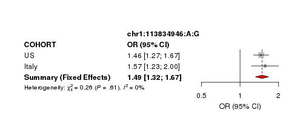


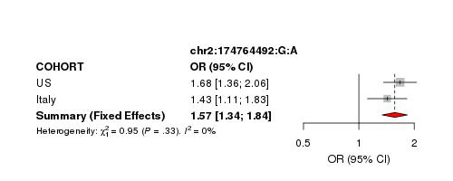


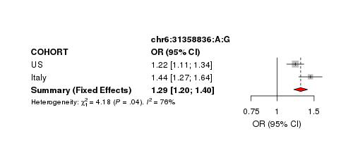


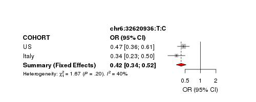


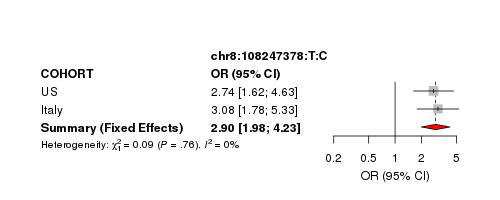


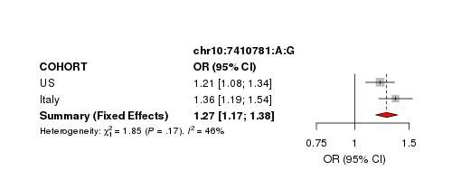


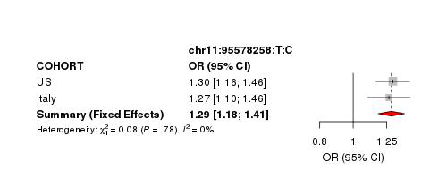


```python
import pandas as pd
pd.read_csv("IndexVarsSummStats.META_MG.USmerged.Itals.UNRELATED.hg38.Rsq03.filteredDirectionHetISq80MAF001cases.inclExtraSignalChr6.p5e-8.txt",sep="\t")
```


<div>
<style scoped>
    .dataframe tbody tr th:only-of-type {
        vertical-align: middle;
    }

    .dataframe tbody tr th {
        vertical-align: top;
    }

    .dataframe thead th {
        text-align: right;
    }
</style>
<table border="1" class="dataframe">
  <thead>
    <tr style="text-align: right;">
      <th></th>
      <th>CHROM</th>
      <th>POS</th>
      <th>MarkerName</th>
      <th>EffectAllele</th>
      <th>OtherAllele</th>
      <th>maf_EA.CASE</th>
      <th>maf_EA.CTRL</th>
      <th>beta</th>
      <th>StdErr</th>
      <th>Direction</th>
      <th>P</th>
      <th>HetISq</th>
    </tr>
  </thead>
  <tbody>
    <tr>
      <th>0</th>
      <td>1</td>
      <td>113834946</td>
      <td>1:113834946:G:A</td>
      <td>a</td>
      <td>g</td>
      <td>0.100641</td>
      <td>0.093099</td>
      <td>0.3960</td>
      <td>0.0609</td>
      <td>++</td>
      <td>7.949000e-11</td>
      <td>0.0</td>
    </tr>
    <tr>
      <th>1</th>
      <td>2</td>
      <td>174764492</td>
      <td>2:174764492:G:A</td>
      <td>a</td>
      <td>g</td>
      <td>0.057395</td>
      <td>0.036239</td>
      <td>0.4495</td>
      <td>0.0812</td>
      <td>++</td>
      <td>3.072000e-08</td>
      <td>0.0</td>
    </tr>
    <tr>
      <th>2</th>
      <td>6</td>
      <td>31358835</td>
      <td>6:31358835:A:G</td>
      <td>g</td>
      <td>a</td>
      <td>0.359317</td>
      <td>0.346316</td>
      <td>0.2602</td>
      <td>0.0390</td>
      <td>--</td>
      <td>2.554000e-11</td>
      <td>79.6</td>
    </tr>
    <tr>
      <th>3</th>
      <td>6</td>
      <td>31358836</td>
      <td>6:31358836:G:A</td>
      <td>a</td>
      <td>g</td>
      <td>0.360918</td>
      <td>0.347127</td>
      <td>0.2584</td>
      <td>0.0390</td>
      <td>++</td>
      <td>3.296000e-11</td>
      <td>76.1</td>
    </tr>
    <tr>
      <th>4</th>
      <td>6</td>
      <td>32620936</td>
      <td>6:32620936:T:C</td>
      <td>c</td>
      <td>t</td>
      <td>0.023759</td>
      <td>0.061287</td>
      <td>-0.8661</td>
      <td>0.1128</td>
      <td>++</td>
      <td>1.576000e-14</td>
      <td>40.1</td>
    </tr>
    <tr>
      <th>5</th>
      <td>8</td>
      <td>108247378</td>
      <td>8:108247378:T:C</td>
      <td>c</td>
      <td>t</td>
      <td>0.012547</td>
      <td>0.003849</td>
      <td>1.0637</td>
      <td>0.1935</td>
      <td>--</td>
      <td>3.859000e-08</td>
      <td>0.0</td>
    </tr>
    <tr>
      <th>6</th>
      <td>10</td>
      <td>7410781</td>
      <td>10:7410781:A:G</td>
      <td>g</td>
      <td>a</td>
      <td>0.276829</td>
      <td>0.213473</td>
      <td>0.2369</td>
      <td>0.0420</td>
      <td>--</td>
      <td>1.665000e-08</td>
      <td>46.0</td>
    </tr>
    <tr>
      <th>7</th>
      <td>11</td>
      <td>95578258</td>
      <td>11:95578258:T:C</td>
      <td>c</td>
      <td>t</td>
      <td>0.217032</td>
      <td>0.173797</td>
      <td>0.2545</td>
      <td>0.0450</td>
      <td>--</td>
      <td>1.541000e-08</td>
      <td>0.0</td>
    </tr>
    <tr>
      <th>8</th>
      <td>18</td>
      <td>62342581</td>
      <td>18:62342581:T:C</td>
      <td>c</td>
      <td>t</td>
      <td>0.534971</td>
      <td>0.460888</td>
      <td>0.2874</td>
      <td>0.0369</td>
      <td>--</td>
      <td>7.085000e-15</td>
      <td>73.7</td>
    </tr>
  </tbody>
</table>
</div>


## Convert index variants at signif loci to hg19 (to be used to extract vars for glm from UKBB hg19 dataset)

### Prep for liftover


```bash
%%bash

## create input file for liftover of SNPs from b38 to b37
module load R/4.0
R --vanilla --no-save

require("data.table")
bim <- fread("IndexVarsSummStats.META_MG.USmerged.Itals.UNRELATED.hg38.Rsq03.filteredDirectionHetISq80MAF001cases.inclExtraSignalChr6.p5e-8.txt", header=T)
bed <- bim[,c("CHROM","POS","MarkerName")]
bed$POS_end <- bed$POS + 1
bed <- bed[,c("CHROM","POS","POS_end","MarkerName")]
bed$CHROM <- paste("chr",bed$CHROM,sep="")
options(scipen=999, justified="none")
bed$V1 <- gsub("chr23","chrX",bed$V1)
write.table(bed,"IndexVarsSummStats.META_MG.USmerged.Itals.b38.bed", col.names=F,row.names=F,quote=F,sep="\t")
```

    
    R version 4.0.3 (2020-10-10) -- "Bunny-Wunnies Freak Out"
    Copyright (C) 2020 The R Foundation for Statistical Computing
    Platform: x86_64-pc-linux-gnu (64-bit)
    
    R is free software and comes with ABSOLUTELY NO WARRANTY.
    You are welcome to redistribute it under certain conditions.
    Type 'license()' or 'licence()' for distribution details.
    
    R is a collaborative project with many contributors.
    Type 'contributors()' for more information and
    'citation()' on how to cite R or R packages in publications.
    
    Type 'demo()' for some demos, 'help()' for on-line help, or
    'help.start()' for an HTML browser interface to help.
    Type 'q()' to quit R.
    
    > 
    > require("data.table")
    > bim <- fread("IndexVarsSummStats.META_MG.USmerged.Itals.UNRELATED.hg38.Rsq03.filteredDirectionHetISq80MAF001cases.inclExtraSignalChr6.p5e-8.txt", header=T)
    > bed <- bim[,c("CHROM","POS","MarkerName")]
    > bed$POS_end <- bed$POS + 1
    > bed <- bed[,c("CHROM","POS","POS_end","MarkerName")]
    > bed$CHROM <- paste("chr",bed$CHROM,sep="")
    > options(scipen=999, justified="none")
    > bed$V1 <- gsub("chr23","chrX",bed$V1)
    > write.table(bed,"IndexVarsSummStats.META_MG.USmerged.Itals.b38.bed", col.names=F,row.names=F,quote=F,sep="\t")
    > 


    [-] Unloading gcc  9.2.0  ... 
    [-] Unloading GSL 2.6 for GCC 9.2.0 ... 
    [-] Unloading openmpi 3.1.4  for GCC 9.2.0 
    [-] Unloading ImageMagick  7.0.8  on cn2969 
    [-] Unloading HDF5  1.10.4 
    [-] Unloading NetCDF 4.7.4_gcc9.2.0 
    [-] Unloading pandoc  2.11.4  on cn2969 
    [-] Unloading pcre2 10.21  ... 
    [-] Unloading R 4.0.3 
    [+] Loading gcc  9.2.0  ... 
    [+] Loading GSL 2.6 for GCC 9.2.0 ... 
    [-] Unloading gcc  9.2.0  ... 
    [+] Loading gcc  9.2.0  ... 
    [+] Loading openmpi 3.1.4  for GCC 9.2.0 
    [+] Loading ImageMagick  7.0.8  on cn2969 
    [+] Loading HDF5  1.10.4 
    [-] Unloading gcc  9.2.0  ... 
    [+] Loading gcc  9.2.0  ... 
    [+] Loading NetCDF 4.7.4_gcc9.2.0 
    [+] Loading pandoc  2.11.4  on cn2969 
    [+] Loading pcre2 10.21  ... 
    [+] Loading R 4.0.3 
    Loading required package: data.table


### Run liftover


```bash
%%bash

## Download binary tools for liftover
mkdir LiftOver
wget http://hgdownload.cse.ucsc.edu/admin/exe/linux.x86_64/liftOver -O LiftOver/liftOver
wget --timestamping 'ftp://hgdownload.soe.ucsc.edu/goldenPath/hg38/liftOver/hg38ToHg19.over.chain.gz' -O LiftOver/hg38ToHg19.over.chain.gz

chmod u+x LiftOver/liftOver
LiftOver/liftOver IndexVarsSummStats.META_MG.USmerged.Itals.b38.bed LiftOver/hg38ToHg19.over.chain.gz IndexVarsSummStats.META_MG.USmerged.Itals.b37.bed unlifted.bed

grep -v "#Deleted" unlifted.bed | awk '{print $4}' > SNPs_not_in_b37.txt
awk '{print $4,$2}' IndexVarsSummStats.META_MG.USmerged.Itals.b37.bed > IndexVarsSummStats.META_MG.USmerged.Itals_update-map_to_b37.txt

```

    Reading liftover chains
    Mapping coordinates


```bash
%%bash
# number of variants lifted/unlifted
wc -l IndexVarsSummStats.META_MG.USmerged.Itals_update-map_to_b37.txt
wc -l SNPs_not_in_b37.txt
```

    9 IndexVarsSummStats.META_MG.USmerged.Itals_update-map_to_b37.txt
    0 SNPs_not_in_b37.txt


### Update positions to hg19


```bash
%%bash
module load R/3.5.2
R --vanilla --no-save

require(data.table)
require(tidyverse)

data <- fread("IndexVarsSummStats.META_MG.USmerged.Itals.UNRELATED.hg38.Rsq03.filteredDirectionHetISq80MAF001cases.inclExtraSignalChr6.p5e-8.txt",header=T)
map <- fread("IndexVarsSummStats.META_MG.USmerged.Itals_update-map_to_b37.txt",header=F) %>%
       rename(MarkerName = V1, POS_hg19 = V2)

data1 <- merge(data, map,by="MarkerName") %>%
         rename(POS_hg38 = POS) %>%
         arrange(CHROM,POS_hg38)
write.table(data1,"IndexVarsSummStats.META_MG.USmerged.Itals.UNRELATED.hg38.Rsq03.filteredDirectionHetISq80MAF001cases.p5e-8.LiftedOverHG19.txt",quote=F,sep="\t",row.names=F,col.names=T)
```

    
    R version 3.5.2 (2018-12-20) -- "Eggshell Igloo"
    Copyright (C) 2018 The R Foundation for Statistical Computing
    Platform: x86_64-pc-linux-gnu (64-bit)
    
    R is free software and comes with ABSOLUTELY NO WARRANTY.
    You are welcome to redistribute it under certain conditions.
    Type 'license()' or 'licence()' for distribution details.
    
    R is a collaborative project with many contributors.
    Type 'contributors()' for more information and
    'citation()' on how to cite R or R packages in publications.
    
    Type 'demo()' for some demos, 'help()' for on-line help, or
    'help.start()' for an HTML browser interface to help.
    Type 'q()' to quit R.
    
    > 
    > require(data.table)
    > require(tidyverse)
    > 
    > data <- fread("IndexVarsSummStats.META_MG.USmerged.Itals.UNRELATED.hg38.Rsq03.filteredDirectionHetISq80MAF001cases.inclExtraSignalChr6.p5e-8.txt",header=T)
    > map <- fread("IndexVarsSummStats.META_MG.USmerged.Itals_update-map_to_b37.txt",header=F) %>%
    +        rename(MarkerName = V1, POS_hg19 = V2)
    > 
    > data1 <- merge(data, map,by="MarkerName") %>%
    +          rename(POS_hg38 = POS) %>%
    +          arrange(CHROM,POS_hg38)
    > write.table(data1,"IndexVarsSummStats.META_MG.USmerged.Itals.UNRELATED.hg38.Rsq03.filteredDirectionHetISq80MAF001cases.p5e-8.LiftedOverHG19.txt",quote=F,sep="\t",row.names=F,col.names=T)
    > 


    [-] Unloading gcc  9.2.0  ... 
    [-] Unloading GSL 2.6 for GCC 9.2.0 ... 
    [-] Unloading openmpi 3.1.4  for GCC 9.2.0 
    [-] Unloading ImageMagick  7.0.8  on cn2969 
    [-] Unloading HDF5  1.10.4 
    [-] Unloading NetCDF 4.7.4_gcc9.2.0 
    [-] Unloading pandoc  2.11.4  on cn2969 
    [-] Unloading pcre2 10.21  ... 
    [-] Unloading R 4.0.3 
    [+] Loading gcc  7.3.0  ... 
    [+] Loading GSL 2.4 for GCC 7.2.0 ... 
    [-] Unloading gcc  7.3.0  ... 
    [+] Loading gcc  7.3.0  ... 
    [+] Loading openmpi 3.0.2  for GCC 7.3.0 
    [+] Loading ImageMagick  7.0.8  on cn2969 
    [+] Loading HDF5  1.10.4 
    [+] Loading pandoc  2.11.4  on cn2969 
    [+] Loading R 3.5.2 
    
    The following have been reloaded with a version change:
      1) GSL/2.6_gcc-9.2.0 => GSL/2.4_gcc-7.2.0     3) gcc/9.2.0 => gcc/7.3.0
      2) R/4.0 => R/3.5.2
    
    Loading required package: data.table
    Loading required package: tidyverse
    -- Attaching packages --------------------------------------- tidyverse 1.2.1 --
    v ggplot2 3.3.2     v purrr   0.3.4
    v tibble  3.0.3     v dplyr   0.8.5
    v tidyr   0.8.3     v stringr 1.4.0
    v readr   1.3.1     v forcats 0.5.0
    -- Conflicts ------------------------------------------ tidyverse_conflicts() --
    x dplyr::between()   masks data.table::between()
    x dplyr::filter()    masks stats::filter()
    x dplyr::first()     masks data.table::first()
    x dplyr::lag()       masks stats::lag()
    x dplyr::last()      masks data.table::last()
    x purrr::transpose() masks data.table::transpose()


```python
import pandas as pd
pd.read_csv("IndexVarsSummStats.META_MG.USmerged.Itals.UNRELATED.hg38.Rsq03.filteredDirectionHetISq80MAF001cases.p5e-8.LiftedOverHG19.txt",sep="\t")
```


<div>
<style scoped>
    .dataframe tbody tr th:only-of-type {
        vertical-align: middle;
    }

    .dataframe tbody tr th {
        vertical-align: top;
    }

    .dataframe thead th {
        text-align: right;
    }
</style>
<table border="1" class="dataframe">
  <thead>
    <tr style="text-align: right;">
      <th></th>
      <th>MarkerName</th>
      <th>CHROM</th>
      <th>POS_hg38</th>
      <th>EffectAllele</th>
      <th>OtherAllele</th>
      <th>maf_EA.CASE</th>
      <th>maf_EA.CTRL</th>
      <th>beta</th>
      <th>StdErr</th>
      <th>Direction</th>
      <th>P</th>
      <th>HetISq</th>
      <th>POS_hg19</th>
    </tr>
  </thead>
  <tbody>
    <tr>
      <th>0</th>
      <td>1:113834946:G:A</td>
      <td>1</td>
      <td>113834946</td>
      <td>a</td>
      <td>g</td>
      <td>0.100641</td>
      <td>0.093099</td>
      <td>0.3960</td>
      <td>0.0609</td>
      <td>++</td>
      <td>7.949000e-11</td>
      <td>0.0</td>
      <td>114377568</td>
    </tr>
    <tr>
      <th>1</th>
      <td>2:174764492:G:A</td>
      <td>2</td>
      <td>174764492</td>
      <td>a</td>
      <td>g</td>
      <td>0.057395</td>
      <td>0.036239</td>
      <td>0.4495</td>
      <td>0.0812</td>
      <td>++</td>
      <td>3.072000e-08</td>
      <td>0.0</td>
      <td>175629220</td>
    </tr>
    <tr>
      <th>2</th>
      <td>6:31358835:A:G</td>
      <td>6</td>
      <td>31358835</td>
      <td>g</td>
      <td>a</td>
      <td>0.359317</td>
      <td>0.346316</td>
      <td>0.2602</td>
      <td>0.0390</td>
      <td>--</td>
      <td>2.554000e-11</td>
      <td>79.6</td>
      <td>31326612</td>
    </tr>
    <tr>
      <th>3</th>
      <td>6:31358836:G:A</td>
      <td>6</td>
      <td>31358836</td>
      <td>a</td>
      <td>g</td>
      <td>0.360918</td>
      <td>0.347127</td>
      <td>0.2584</td>
      <td>0.0390</td>
      <td>++</td>
      <td>3.296000e-11</td>
      <td>76.1</td>
      <td>31326613</td>
    </tr>
    <tr>
      <th>4</th>
      <td>6:32620936:T:C</td>
      <td>6</td>
      <td>32620936</td>
      <td>c</td>
      <td>t</td>
      <td>0.023759</td>
      <td>0.061287</td>
      <td>-0.8661</td>
      <td>0.1128</td>
      <td>++</td>
      <td>1.576000e-14</td>
      <td>40.1</td>
      <td>32588713</td>
    </tr>
    <tr>
      <th>5</th>
      <td>8:108247378:T:C</td>
      <td>8</td>
      <td>108247378</td>
      <td>c</td>
      <td>t</td>
      <td>0.012547</td>
      <td>0.003849</td>
      <td>1.0637</td>
      <td>0.1935</td>
      <td>--</td>
      <td>3.859000e-08</td>
      <td>0.0</td>
      <td>109259607</td>
    </tr>
    <tr>
      <th>6</th>
      <td>10:7410781:A:G</td>
      <td>10</td>
      <td>7410781</td>
      <td>g</td>
      <td>a</td>
      <td>0.276829</td>
      <td>0.213473</td>
      <td>0.2369</td>
      <td>0.0420</td>
      <td>--</td>
      <td>1.665000e-08</td>
      <td>46.0</td>
      <td>7452743</td>
    </tr>
    <tr>
      <th>7</th>
      <td>11:95578258:T:C</td>
      <td>11</td>
      <td>95578258</td>
      <td>c</td>
      <td>t</td>
      <td>0.217032</td>
      <td>0.173797</td>
      <td>0.2545</td>
      <td>0.0450</td>
      <td>--</td>
      <td>1.541000e-08</td>
      <td>0.0</td>
      <td>95311422</td>
    </tr>
    <tr>
      <th>8</th>
      <td>18:62342581:T:C</td>
      <td>18</td>
      <td>62342581</td>
      <td>c</td>
      <td>t</td>
      <td>0.534971</td>
      <td>0.460888</td>
      <td>0.2874</td>
      <td>0.0369</td>
      <td>--</td>
      <td>7.085000e-15</td>
      <td>73.7</td>
      <td>60009814</td>
    </tr>
  </tbody>
</table>
</div>


### Get imputation info of variants of interest from UKBB

Some notes about where the current UKBB data is located:
- DIR : `/data/CARD/UKBIOBANK/EGAD00010001474/`
- imputed files: `$DIR/ukb_imp_chr${CHNUM}_v3.bgen`
- imputed info files: `$DIR/ukb_mfi_chr${CHNUM}_v3.txt`
- sample name file: `$DIR/ukb33601_imp_chr1_v3_s487395.sample`


```bash
%%bash
mkdir UKBB.replication
cd UKBB.replication

# Extract imputation info from UKBB for variants of interest
echo "1:114377568_" > IndexVars.ToExtractInfoFromUKBB.txt
echo "2:175629220_" >> IndexVars.ToExtractInfoFromUKBB.txt
echo "6:31326613_" >> IndexVars.ToExtractInfoFromUKBB.txt
echo "6:32588713_" >> IndexVars.ToExtractInfoFromUKBB.txt
echo "8:109259607_" >> IndexVars.ToExtractInfoFromUKBB.txt
echo "10:7452743_" >> IndexVars.ToExtractInfoFromUKBB.txt
echo "11:95311422_" >> IndexVars.ToExtractInfoFromUKBB.txt
echo "18:60009814_" >> IndexVars.ToExtractInfoFromUKBB.txt
echo "rs2476601" >> IndexVars.ToExtractInfoFromUKBB.txt
echo "rs2245569" >> IndexVars.ToExtractInfoFromUKBB.txt
echo "rs4409785" >> IndexVars.ToExtractInfoFromUKBB.txt


echo "Alternate_id RS_id POS_hg19 Allele1 Allele2 MAF MinorAllele R2score" | tr ' ' '\t' > IndexVars.InfoFromUKBB.txt

DIR="/data/CARD/UKBIOBANK/EGAD00010001474"
for CHNUM in {1,2,6,8,10,11,18}
do
grep -Ef IndexVars.ToExtractInfoFromUKBB.txt $DIR/ukb_mfi_chr${CHNUM}_v3.txt >> IndexVars.InfoFromUKBB.txt
done

```

    mkdir: cannot create directory 'UKBB.replication': File exists


```python
import pandas as pd
pd.read_csv("UKBB.replication/IndexVars.InfoFromUKBB.txt",sep="\t")
```


<div>
<style scoped>
    .dataframe tbody tr th:only-of-type {
        vertical-align: middle;
    }

    .dataframe tbody tr th {
        vertical-align: top;
    }

    .dataframe thead th {
        text-align: right;
    }
</style>
<table border="1" class="dataframe">
  <thead>
    <tr style="text-align: right;">
      <th></th>
      <th>Alternate_id</th>
      <th>RS_id</th>
      <th>POS_hg19</th>
      <th>Allele1</th>
      <th>Allele2</th>
      <th>MAF</th>
      <th>MinorAllele</th>
      <th>R2score</th>
    </tr>
  </thead>
  <tbody>
    <tr>
      <th>0</th>
      <td>rs2476601</td>
      <td>rs2476601</td>
      <td>114377568</td>
      <td>A</td>
      <td>G</td>
      <td>0.096525</td>
      <td>A</td>
      <td>1.000000</td>
    </tr>
    <tr>
      <th>1</th>
      <td>2:175629220_G_A</td>
      <td>rs35274388</td>
      <td>175629220</td>
      <td>G</td>
      <td>A</td>
      <td>0.031561</td>
      <td>A</td>
      <td>0.982400</td>
    </tr>
    <tr>
      <th>2</th>
      <td>6:31326613_A_G</td>
      <td>rs9266277</td>
      <td>31326613</td>
      <td>A</td>
      <td>G</td>
      <td>0.371147</td>
      <td>A</td>
      <td>0.996102</td>
    </tr>
    <tr>
      <th>3</th>
      <td>6:32588713_T_C</td>
      <td>rs76815088</td>
      <td>32588713</td>
      <td>T</td>
      <td>C</td>
      <td>0.051098</td>
      <td>C</td>
      <td>0.999896</td>
    </tr>
    <tr>
      <th>4</th>
      <td>8:109259607_T_C</td>
      <td>rs57015275</td>
      <td>109259607</td>
      <td>T</td>
      <td>C</td>
      <td>0.004667</td>
      <td>C</td>
      <td>0.947321</td>
    </tr>
    <tr>
      <th>5</th>
      <td>rs2245569</td>
      <td>rs2245569</td>
      <td>7452743</td>
      <td>A</td>
      <td>G</td>
      <td>0.207267</td>
      <td>G</td>
      <td>1.000000</td>
    </tr>
    <tr>
      <th>6</th>
      <td>rs4409785</td>
      <td>rs4409785</td>
      <td>95311422</td>
      <td>T</td>
      <td>C</td>
      <td>0.170904</td>
      <td>C</td>
      <td>1.000000</td>
    </tr>
    <tr>
      <th>7</th>
      <td>18:60009814_C_T</td>
      <td>rs4574025</td>
      <td>60009814</td>
      <td>C</td>
      <td>T</td>
      <td>0.462171</td>
      <td>C</td>
      <td>0.990014</td>
    </tr>
  </tbody>
</table>
</div>


### Run replication in UKBB

#### Run GLM MG


```bash
%%bash
cd UKBB.replication

# create list of variants to run glm on
echo "rs2476601" > IndexVarList.MG.hg19.txt
echo "rs35274388" >> IndexVarList.MG.hg19.txt
echo "rs9266277" >> IndexVarList.MG.hg19.txt
echo "rs76815088" >> IndexVarList.MG.hg19.txt
echo "rs57015275" >> IndexVarList.MG.hg19.txt
echo "rs2245569" >> IndexVarList.MG.hg19.txt
echo "rs4409785" >> IndexVarList.MG.hg19.txt
echo "rs4574025" >> IndexVarList.MG.hg19.txt

ImputedDIR="/data/CARD/UKBIOBANK/EGAD00010001474"
SampleList="/data/NDRS_LNG/MyastheniaGravis/updated.April2020/UKBB/SampleList.354MG_7080AgeGenderMatchedControls.FIDspaceIID.txt"
CovFile="/data/NDRS_LNG/MyastheniaGravis/updated.April2020/UKBB/COVARIATES.UKBB.EURO.NEW.354MG_7080AgeGenderMatchedControls.unrelated.txt"
COVAR="Age,PC2,PC8"

for CHNUM in {1,2,6,8,10,11,18};
do 
echo "plink \
--bgen $ImputedDIR/ukb_imp_chr${CHNUM}_v3.bgen \
--sample $ImputedDIR/ukb33601_imp_chr1_v3_s487395.sample \
--extract IndexVarList.MG.hg19.txt \
--keep $SampleList \
--pheno-name PHENO \
--pheno $CovFile \
--covar $CovFile \
--glm hide-covar firth-fallback cols=+a1freq,+a1freqcc,+a1count,+totallele,+a1countcc,+totallelecc,+err \
--out MG.UKBB.NEW.matchedRatio20.noDups.UNRELATED.hg19.glm_chr${CHNUM} \
--covar-name $COVAR \
--covar-variance-standardize \
--threads 32" >> GWAS.MG.UKBB.2.swarm
done

swarm --file GWAS.MG.UKBB.2.swarm \
--logdir swarmOE_GWAS.MG \
--gres=lscratch:800 \
-t 32 -g 120 --time 04:00:00 --partition quick \
--module plink/2.0-dev-20191128 \
--sbatch '--constraint=ibfdr'

```

    13653351


    rm: cannot remove 'GWAS.MG.UKBB.2.swarm': No such file or directory


```python
!cat UKBB.replication/MG.UKBB.NEW.matchedRatio20.noDups.UNRELATED.hg19.glm_chr2.log
```

    PLINK v2.00a2LM 64-bit Intel (28 Nov 2019)
    Options in effect:
      --bgen /data/CARD/UKBIOBANK/EGAD00010001474/ukb_imp_chr2_v3.bgen
      --covar /data/NDRS_LNG/MyastheniaGravis/updated.April2020/UKBB/COVARIATES.UKBB.EURO.NEW.354MG_7080AgeGenderMatchedControls.unrelated.txt
      --covar-name Age,PC2,PC8
      --covar-variance-standardize
      --extract IndexVarList.MG.hg19.txt
      --glm hide-covar firth-fallback cols=+a1freq,+a1freqcc,+a1count,+totallele,+a1countcc,+totallelecc,+err
      --keep /data/NDRS_LNG/MyastheniaGravis/updated.April2020/UKBB/SampleList.354MG_7080AgeGenderMatchedControls.FIDspaceIID.txt
      --out MG.UKBB.NEW.matchedRatio20.noDups.UNRELATED.hg19.glm_chr2
      --pheno /data/NDRS_LNG/MyastheniaGravis/updated.April2020/UKBB/COVARIATES.UKBB.EURO.NEW.354MG_7080AgeGenderMatchedControls.unrelated.txt
      --pheno-name PHENO
      --sample /data/CARD/UKBIOBANK/EGAD00010001474/ukb33601_imp_chr1_v3_s487395.sample
      --threads 32
    
    Hostname: cn4482
    Working directory: /gpfs/gsfs11/users/NDRS_LNG/MyastheniaGravis/updated.April2020/MetaAnalysis.hg38.ByCohort.rerun/USmerged.Itals.hg38/UKBB.replication
    Start time: Tue Apr 27 16:27:56 2021
    
    Warning: No --bgen REF/ALT mode specified ('ref-first', 'ref-last', or
    'ref-unknown').  This will be required as of alpha 3.
    Random number seed: 1619555276
    257653 MiB RAM detected; reserving 128826 MiB for main workspace.
    Using up to 32 threads (change this with --threads).
    --bgen: 8129063 variants detected, format v1.2.
    487409 samples imported from .sample file to
    MG.UKBB.NEW.matchedRatio20.noDups.UNRELATED.hg19.glm_chr2-temporary.psam .
    --bgen:
    MG.UKBB.NEW.matchedRatio20.noDups.UNRELATED.hg19.glm_chr2-temporary.pgen +
    MG.UKBB.NEW.matchedRatio20.noDups.UNRELATED.hg19.glm_chr2-temporary.pvar
    written.
    487409 samples (264362 females, 223033 males, 14 ambiguous; 487409 founders)
    loaded from
    MG.UKBB.NEW.matchedRatio20.noDups.UNRELATED.hg19.glm_chr2-temporary.psam.
    8129063 variants loaded from
    MG.UKBB.NEW.matchedRatio20.noDups.UNRELATED.hg19.glm_chr2-temporary.pvar.
    1 binary phenotype loaded (354 cases, 7058 controls).
    --extract: 1 variant remaining.
    --keep: 7412 samples remaining.
    3 covariates loaded from /data/NDRS_LNG/MyastheniaGravis/updated.April2020/UKBB/COVARIATES.UKBB.EURO.NEW.354MG_7080AgeGenderMatchedControls.unrelated.txt.
    7412 samples (3319 females, 4093 males; 7412 founders) remaining after main
    filters.
    354 cases and 7058 controls remaining after main filters.
    --covar-variance-standardize: 3 covariates transformed.
    Calculating allele frequencies... done.
    1 variant remaining after main filters.
    --glm logistic-Firth hybrid regression on phenotype 'PHENO': done.
    Results written to MG.UKBB.NEW.matchedRatio20.noDups.UNRELATED.hg19.glm_chr2.PHENO.glm.logistic.hybrid .
    
    End time: Tue Apr 27 17:00:24 2021


```bash
%%bash
cd UKBB.replication

head -n 1 MG.UKBB.NEW.matchedRatio20.noDups.UNRELATED.hg19.glm_chr2.PHENO.glm.logistic.hybrid > MG.UKBB.NEW.matchedRatio20.noDups.UNRELATED.hg19.DiscoverySignifHits.txt
cat MG.UKBB.NEW.matchedRatio20.noDups.UNRELATED.hg19.glm_chr*.PHENO.glm.logistic.hybrid | grep -v "POS" | sort -k1 >> MG.UKBB.NEW.matchedRatio20.noDups.UNRELATED.hg19.DiscoverySignifHits.txt

rm MG.UKBB.NEW.matchedRatio20.noDups.UNRELATED.hg19.glm_chr*.PHENO.glm.logistic.hybrid
rm MG.UKBB.NEW.matchedRatio20.noDups.UNRELATED.hg19.glm_chr*.log

```


```python
import pandas as pd
pd.read_csv("UKBB.replication/MG.UKBB.NEW.matchedRatio20.noDups.UNRELATED.hg19.DiscoverySignifHits.txt",sep="\t").drop(['A1_CT','ALLELE_CT','A1_CASE_CT','A1_CTRL_CT','CASE_ALLELE_CT','CTRL_ALLELE_CT','FIRTH?','TEST','OBS_CT','ERRCODE'],axis=1)
```


<div>
<style scoped>
    .dataframe tbody tr th:only-of-type {
        vertical-align: middle;
    }

    .dataframe tbody tr th {
        vertical-align: top;
    }

    .dataframe thead th {
        text-align: right;
    }
</style>
<table border="1" class="dataframe">
  <thead>
    <tr style="text-align: right;">
      <th></th>
      <th>#CHROM</th>
      <th>POS</th>
      <th>ID</th>
      <th>REF</th>
      <th>ALT</th>
      <th>A1</th>
      <th>A1_FREQ</th>
      <th>A1_CASE_FREQ</th>
      <th>A1_CTRL_FREQ</th>
      <th>OR</th>
      <th>LOG(OR)_SE</th>
      <th>Z_STAT</th>
      <th>P</th>
    </tr>
  </thead>
  <tbody>
    <tr>
      <th>0</th>
      <td>1</td>
      <td>114377568</td>
      <td>rs2476601</td>
      <td>G</td>
      <td>A</td>
      <td>A</td>
      <td>0.109012</td>
      <td>0.141243</td>
      <td>0.107396</td>
      <td>1.362040</td>
      <td>0.110357</td>
      <td>2.799860</td>
      <td>0.005112</td>
    </tr>
    <tr>
      <th>1</th>
      <td>10</td>
      <td>7452743</td>
      <td>rs2245569</td>
      <td>G</td>
      <td>A</td>
      <td>G</td>
      <td>0.205680</td>
      <td>0.216102</td>
      <td>0.205157</td>
      <td>1.067010</td>
      <td>0.093262</td>
      <td>0.695502</td>
      <td>0.486741</td>
    </tr>
    <tr>
      <th>2</th>
      <td>11</td>
      <td>95311422</td>
      <td>rs4409785</td>
      <td>C</td>
      <td>T</td>
      <td>C</td>
      <td>0.171816</td>
      <td>0.170904</td>
      <td>0.171862</td>
      <td>0.995514</td>
      <td>0.102726</td>
      <td>-0.043763</td>
      <td>0.965093</td>
    </tr>
    <tr>
      <th>3</th>
      <td>18</td>
      <td>60009814</td>
      <td>rs4574025</td>
      <td>T</td>
      <td>C</td>
      <td>C</td>
      <td>0.474639</td>
      <td>0.492179</td>
      <td>0.473759</td>
      <td>1.085080</td>
      <td>0.078532</td>
      <td>1.039790</td>
      <td>0.298438</td>
    </tr>
    <tr>
      <th>4</th>
      <td>2</td>
      <td>175629220</td>
      <td>rs35274388</td>
      <td>A</td>
      <td>G</td>
      <td>A</td>
      <td>0.031099</td>
      <td>0.046798</td>
      <td>0.030312</td>
      <td>1.603080</td>
      <td>0.187268</td>
      <td>2.520060</td>
      <td>0.011733</td>
    </tr>
    <tr>
      <th>5</th>
      <td>6</td>
      <td>31326613</td>
      <td>rs9266277</td>
      <td>G</td>
      <td>A</td>
      <td>A</td>
      <td>0.385079</td>
      <td>0.394683</td>
      <td>0.384597</td>
      <td>1.040750</td>
      <td>0.079052</td>
      <td>0.505237</td>
      <td>0.613392</td>
    </tr>
    <tr>
      <th>6</th>
      <td>6</td>
      <td>32588713</td>
      <td>rs76815088</td>
      <td>C</td>
      <td>T</td>
      <td>C</td>
      <td>0.050727</td>
      <td>0.028249</td>
      <td>0.051855</td>
      <td>0.536007</td>
      <td>0.228605</td>
      <td>-2.727890</td>
      <td>0.006374</td>
    </tr>
    <tr>
      <th>7</th>
      <td>8</td>
      <td>109259607</td>
      <td>rs57015275</td>
      <td>C</td>
      <td>T</td>
      <td>C</td>
      <td>0.001596</td>
      <td>0.000011</td>
      <td>0.001676</td>
      <td>0.000052</td>
      <td>34.461700</td>
      <td>-0.286301</td>
      <td>0.774648</td>
    </tr>
  </tbody>
</table>
</div>


#### Run GLM MG_Males


```python
!head -n 1 /data/NDRS_LNG/MyastheniaGravis/updated.April2020/UKBB/COVARIATES.UKBB.EURO.NEW.354MG_7080AgeGenderMatchedControls.unrelated.txt | tr '\t' '\n' | cat -n
```

         1	FID
         2	IID
         3	PHENO
         4	SEX
         5	BIRTH_YEAR
         6	Age
         7	Age_CONSENSUS
         8	AGE_OF_RECRUIT
         9	TOWNSEND
        10	BATCH
        11	GENETIC_SEX
        12	EUROPEAN
        13	DIAGNOSIS
        14	GENDER
        15	CASE
        16	PC1
        17	PC2
        18	PC3
        19	PC4
        20	PC5
        21	PC6
        22	PC7
        23	PC8
        24	PC9
        25	PC10


```bash
%%bash
cd UKBB.replication

ImputedDIR="/data/CARD/UKBIOBANK/EGAD00010001474"
CovFile="/data/NDRS_LNG/MyastheniaGravis/updated.April2020/UKBB/COVARIATES.UKBB.EURO.NEW.354MG_7080AgeGenderMatchedControls.unrelated.txt"
COVAR="Age,PC2,PC8"

## Make new list of samples to keep for analysis i.e. male cases + all controls
awk '{if($3 == 2 && $4 == 1) print}' $CovFile | awk '{print $1,$2}' > SampleList.UKBB.NEW.MG.Males_7080AgeGenderMatchedControls.FIDspaceIID.txt
awk '{if($3 == 1) print}' $CovFile | awk '{print $1,$2}' >> SampleList.UKBB.NEW.MG.Males_7080AgeGenderMatchedControls.FIDspaceIID.txt

SampleList="SampleList.UKBB.NEW.MG.Males_7080AgeGenderMatchedControls.FIDspaceIID.txt"

for CHNUM in {1,2,6,8,10,11,18};
do 
echo "plink \
--bgen $ImputedDIR/ukb_imp_chr${CHNUM}_v3.bgen \
--sample $ImputedDIR/ukb33601_imp_chr1_v3_s487395.sample \
--extract IndexVarList.MG.hg19.txt \
--keep $SampleList \
--pheno-name PHENO \
--pheno $CovFile \
--covar $CovFile \
--glm hide-covar firth-fallback cols=+a1freq,+a1freqcc,+a1count,+totallele,+a1countcc,+totallelecc,+err \
--out MG.Males.UKBB.NEW.matchedRatio20.noDups.UNRELATED.hg19.glm_chr${CHNUM} \
--covar-name $COVAR \
--covar-variance-standardize \
--threads 32" >> GWAS.MG.Males.UKBB.2.swarm
done

swarm --file GWAS.MG.Males.UKBB.2.swarm \
--logdir swarmOE_GWAS.MG \
--gres=lscratch:800 \
-t 32 -g 120 --time 04:00:00 --partition quick \
--module plink/2.0-dev-20191128 \
--sbatch '--constraint=ibfdr'

```

    13653391


```python
!cat UKBB.replication/MG.Males.UKBB.NEW.matchedRatio20.noDups.UNRELATED.hg19.glm_chr2.log
```

    PLINK v2.00a2LM 64-bit Intel (28 Nov 2019)
    Options in effect:
      --bgen /data/CARD/UKBIOBANK/EGAD00010001474/ukb_imp_chr2_v3.bgen
      --covar /data/NDRS_LNG/MyastheniaGravis/updated.April2020/UKBB/COVARIATES.UKBB.EURO.NEW.354MG_7080AgeGenderMatchedControls.unrelated.txt
      --covar-name Age,PC2,PC8
      --covar-variance-standardize
      --extract IndexVarList.MG.hg19.txt
      --glm hide-covar firth-fallback cols=+a1freq,+a1freqcc,+a1count,+totallele,+a1countcc,+totallelecc,+err
      --keep SampleList.UKBB.NEW.MG.Males_7080AgeGenderMatchedControls.FIDspaceIID.txt
      --out MG.Males.UKBB.NEW.matchedRatio20.noDups.UNRELATED.hg19.glm_chr2
      --pheno /data/NDRS_LNG/MyastheniaGravis/updated.April2020/UKBB/COVARIATES.UKBB.EURO.NEW.354MG_7080AgeGenderMatchedControls.unrelated.txt
      --pheno-name PHENO
      --sample /data/CARD/UKBIOBANK/EGAD00010001474/ukb33601_imp_chr1_v3_s487395.sample
      --threads 32
    
    Hostname: cn4504
    Working directory: /gpfs/gsfs11/users/NDRS_LNG/MyastheniaGravis/updated.April2020/MetaAnalysis.hg38.ByCohort.rerun/USmerged.Itals.hg38/UKBB.replication
    Start time: Tue Apr 27 16:37:20 2021
    
    Warning: No --bgen REF/ALT mode specified ('ref-first', 'ref-last', or
    'ref-unknown').  This will be required as of alpha 3.
    Random number seed: 1619555840
    257653 MiB RAM detected; reserving 128826 MiB for main workspace.
    Using up to 32 threads (change this with --threads).
    --bgen: 8129063 variants detected, format v1.2.
    487409 samples imported from .sample file to
    MG.Males.UKBB.NEW.matchedRatio20.noDups.UNRELATED.hg19.glm_chr2-temporary.psam
    .
    --bgen:
    MG.Males.UKBB.NEW.matchedRatio20.noDups.UNRELATED.hg19.glm_chr2-temporary.pgen
    +
    MG.Males.UKBB.NEW.matchedRatio20.noDups.UNRELATED.hg19.glm_chr2-temporary.pvar
    written.
    487409 samples (264362 females, 223033 males, 14 ambiguous; 487409 founders)
    loaded from
    MG.Males.UKBB.NEW.matchedRatio20.noDups.UNRELATED.hg19.glm_chr2-temporary.psam.
    8129063 variants loaded from
    MG.Males.UKBB.NEW.matchedRatio20.noDups.UNRELATED.hg19.glm_chr2-temporary.pvar.
    1 binary phenotype loaded (354 cases, 7058 controls).
    --extract: 1 variant remaining.
    --keep: 7239 samples remaining.
    3 covariates loaded from /data/NDRS_LNG/MyastheniaGravis/updated.April2020/UKBB/COVARIATES.UKBB.EURO.NEW.354MG_7080AgeGenderMatchedControls.unrelated.txt.
    7239 samples (3146 females, 4093 males; 7239 founders) remaining after main
    filters.
    181 cases and 7058 controls remaining after main filters.
    --covar-variance-standardize: 3 covariates transformed.
    Calculating allele frequencies... done.
    1 variant remaining after main filters.
    --glm logistic-Firth hybrid regression on phenotype 'PHENO': done.
    Results written to MG.Males.UKBB.NEW.matchedRatio20.noDups.UNRELATED.hg19.glm_chr2.PHENO.glm.logistic.hybrid .
    
    End time: Tue Apr 27 17:09:23 2021


```bash
%%bash
cd UKBB.replication

head -n 1 MG.Males.UKBB.NEW.matchedRatio20.noDups.UNRELATED.hg19.glm_chr2.PHENO.glm.logistic.hybrid > MG.Males.UKBB.NEW.matchedRatio20.noDups.UNRELATED.hg19.DiscoverySignifHits.txt
cat MG.Males.UKBB.NEW.matchedRatio20.noDups.UNRELATED.hg19.glm_chr*.PHENO.glm.logistic.hybrid | grep -v "POS" | sort -k1 >> MG.Males.UKBB.NEW.matchedRatio20.noDups.UNRELATED.hg19.DiscoverySignifHits.txt

rm MG.Males.UKBB.NEW.matchedRatio20.noDups.UNRELATED.hg19.glm_chr*.PHENO.glm.logistic.hybrid
rm MG.Males.UKBB.NEW.matchedRatio20.noDups.UNRELATED.hg19.glm_chr*.log

```


```python
import pandas as pd
pd.read_csv("UKBB.replication/MG.Males.UKBB.NEW.matchedRatio20.noDups.UNRELATED.hg19.DiscoverySignifHits.txt",sep="\t").drop(['A1_CT','ALLELE_CT','A1_CASE_CT','A1_CTRL_CT','CASE_ALLELE_CT','CTRL_ALLELE_CT','FIRTH?','TEST','OBS_CT','ERRCODE'],axis=1)
```


<div>
<style scoped>
    .dataframe tbody tr th:only-of-type {
        vertical-align: middle;
    }

    .dataframe tbody tr th {
        vertical-align: top;
    }

    .dataframe thead th {
        text-align: right;
    }
</style>
<table border="1" class="dataframe">
  <thead>
    <tr style="text-align: right;">
      <th></th>
      <th>#CHROM</th>
      <th>POS</th>
      <th>ID</th>
      <th>REF</th>
      <th>ALT</th>
      <th>A1</th>
      <th>A1_FREQ</th>
      <th>A1_CASE_FREQ</th>
      <th>A1_CTRL_FREQ</th>
      <th>OR</th>
      <th>LOG(OR)_SE</th>
      <th>Z_STAT</th>
      <th>P</th>
    </tr>
  </thead>
  <tbody>
    <tr>
      <th>0</th>
      <td>1</td>
      <td>114377568</td>
      <td>rs2476601</td>
      <td>G</td>
      <td>A</td>
      <td>A</td>
      <td>0.108095</td>
      <td>0.135359</td>
      <td>0.107396</td>
      <td>1.295470</td>
      <td>0.155476</td>
      <td>1.665060</td>
      <td>0.095900</td>
    </tr>
    <tr>
      <th>1</th>
      <td>10</td>
      <td>7452743</td>
      <td>rs2245569</td>
      <td>G</td>
      <td>A</td>
      <td>G</td>
      <td>0.205830</td>
      <td>0.232044</td>
      <td>0.205157</td>
      <td>1.163140</td>
      <td>0.125586</td>
      <td>1.203320</td>
      <td>0.228853</td>
    </tr>
    <tr>
      <th>2</th>
      <td>11</td>
      <td>95311422</td>
      <td>rs4409785</td>
      <td>C</td>
      <td>T</td>
      <td>C</td>
      <td>0.172261</td>
      <td>0.187845</td>
      <td>0.171862</td>
      <td>1.111320</td>
      <td>0.136762</td>
      <td>0.771794</td>
      <td>0.440236</td>
    </tr>
    <tr>
      <th>3</th>
      <td>18</td>
      <td>60009814</td>
      <td>rs4574025</td>
      <td>T</td>
      <td>C</td>
      <td>C</td>
      <td>0.475053</td>
      <td>0.525523</td>
      <td>0.473759</td>
      <td>1.234700</td>
      <td>0.108163</td>
      <td>1.949180</td>
      <td>0.051274</td>
    </tr>
    <tr>
      <th>4</th>
      <td>2</td>
      <td>175629220</td>
      <td>rs35274388</td>
      <td>A</td>
      <td>G</td>
      <td>A</td>
      <td>0.031211</td>
      <td>0.066276</td>
      <td>0.030312</td>
      <td>2.337570</td>
      <td>0.219937</td>
      <td>3.860700</td>
      <td>0.000113</td>
    </tr>
    <tr>
      <th>5</th>
      <td>6</td>
      <td>31326613</td>
      <td>rs9266277</td>
      <td>G</td>
      <td>A</td>
      <td>A</td>
      <td>0.385231</td>
      <td>0.409923</td>
      <td>0.384597</td>
      <td>1.094730</td>
      <td>0.108148</td>
      <td>0.836880</td>
      <td>0.402660</td>
    </tr>
    <tr>
      <th>6</th>
      <td>6</td>
      <td>32588713</td>
      <td>rs76815088</td>
      <td>C</td>
      <td>T</td>
      <td>C</td>
      <td>0.051318</td>
      <td>0.030387</td>
      <td>0.051855</td>
      <td>0.578678</td>
      <td>0.306955</td>
      <td>-1.782050</td>
      <td>0.074741</td>
    </tr>
    <tr>
      <th>7</th>
      <td>8</td>
      <td>109259607</td>
      <td>rs57015275</td>
      <td>C</td>
      <td>T</td>
      <td>C</td>
      <td>0.001634</td>
      <td>0.000000</td>
      <td>0.001676</td>
      <td>0.768988</td>
      <td>1.500820</td>
      <td>-0.175024</td>
      <td>0.861061</td>
    </tr>
  </tbody>
</table>
</div>


#### Run GLM MG_Females


```bash
%%bash
cd UKBB.replication

ImputedDIR="/data/CARD/UKBIOBANK/EGAD00010001474"
CovFile="/data/NDRS_LNG/MyastheniaGravis/updated.April2020/UKBB/COVARIATES.UKBB.EURO.NEW.354MG_7080AgeGenderMatchedControls.unrelated.txt"
COVAR="Age,PC2,PC8"

## Make new list of samples to keep for analysis i.e. male cases + all controls
awk '{if($3 == 2 && $4 == 2) print}' $CovFile | awk '{print $1,$2}' > SampleList.UKBB.NEW.MG.Females_7080AgeGenderMatchedControls.FIDspaceIID.txt
awk '{if($3 == 1) print}' $CovFile | awk '{print $1,$2}' >> SampleList.UKBB.NEW.MG.Females_7080AgeGenderMatchedControls.FIDspaceIID.txt

SampleList="SampleList.UKBB.NEW.MG.Females_7080AgeGenderMatchedControls.FIDspaceIID.txt"

for CHNUM in {1,2,6,8,10,11,18};
do 
echo "plink \
--bgen $ImputedDIR/ukb_imp_chr${CHNUM}_v3.bgen \
--sample $ImputedDIR/ukb33601_imp_chr1_v3_s487395.sample \
--extract IndexVarList.MG.hg19.txt \
--keep $SampleList \
--pheno-name PHENO \
--pheno $CovFile \
--covar $CovFile \
--glm hide-covar firth-fallback cols=+a1freq,+a1freqcc,+a1count,+totallele,+a1countcc,+totallelecc,+err \
--out MG.Females.UKBB.NEW.matchedRatio20.noDups.UNRELATED.hg19.glm_chr${CHNUM} \
--covar-name $COVAR \
--covar-variance-standardize \
--threads 32" >> GWAS.MG.Females.UKBB.2.swarm
done

swarm --file GWAS.MG.Females.UKBB.2.swarm \
--logdir swarmOE_GWAS.MG \
--gres=lscratch:800 \
-t 32 -g 120 --time 04:00:00 --partition quick \
--module plink/2.0-dev-20191128 \
--sbatch '--constraint=ibfdr'

```

    13649592


```python
!cat UKBB.replication/MG.Females.UKBB.NEW.matchedRatio20.noDups.UNRELATED.hg19.glm_chr2.log
```

    PLINK v2.00a2LM 64-bit Intel (28 Nov 2019)
    Options in effect:
      --bgen /data/CARD/UKBIOBANK/EGAD00010001474/ukb_imp_chr2_v3.bgen
      --covar /data/NDRS_LNG/MyastheniaGravis/updated.April2020/UKBB/COVARIATES.UKBB.EURO.NEW.354MG_7080AgeGenderMatchedControls.unrelated.txt
      --covar-name Age,PC2,PC8
      --covar-variance-standardize
      --extract IndexVarList.MG.hg19.txt
      --glm hide-covar firth-fallback cols=+a1freq,+a1freqcc,+a1count,+totallele,+a1countcc,+totallelecc,+err
      --keep SampleList.UKBB.NEW.MG.Females_7080AgeGenderMatchedControls.FIDspaceIID.txt
      --out MG.Females.UKBB.NEW.matchedRatio20.noDups.UNRELATED.hg19.glm_chr2
      --pheno /data/NDRS_LNG/MyastheniaGravis/updated.April2020/UKBB/COVARIATES.UKBB.EURO.NEW.354MG_7080AgeGenderMatchedControls.unrelated.txt
      --pheno-name PHENO
      --sample /data/CARD/UKBIOBANK/EGAD00010001474/ukb33601_imp_chr1_v3_s487395.sample
      --threads 32
    
    Hostname: cn4488
    Working directory: /gpfs/gsfs11/users/NDRS_LNG/MyastheniaGravis/updated.April2020/MetaAnalysis.hg38.ByCohort.rerun/USmerged.Itals.hg38/UKBB.replication
    Start time: Tue Apr 27 16:17:36 2021
    
    Warning: No --bgen REF/ALT mode specified ('ref-first', 'ref-last', or
    'ref-unknown').  This will be required as of alpha 3.
    Random number seed: 1619554656
    257653 MiB RAM detected; reserving 128826 MiB for main workspace.
    Using up to 32 threads (change this with --threads).
    --bgen: 8129063 variants detected, format v1.2.
    487409 samples imported from .sample file to
    MG.Females.UKBB.NEW.matchedRatio20.noDups.UNRELATED.hg19.glm_chr2-temporary.psam
    .
    --bgen:
    MG.Females.UKBB.NEW.matchedRatio20.noDups.UNRELATED.hg19.glm_chr2-temporary.pgen
    +
    MG.Females.UKBB.NEW.matchedRatio20.noDups.UNRELATED.hg19.glm_chr2-temporary.pvar
    written.
    487409 samples (264362 females, 223033 males, 14 ambiguous; 487409 founders)
    loaded from
    MG.Females.UKBB.NEW.matchedRatio20.noDups.UNRELATED.hg19.glm_chr2-temporary.psam.
    8129063 variants loaded from
    MG.Females.UKBB.NEW.matchedRatio20.noDups.UNRELATED.hg19.glm_chr2-temporary.pvar.
    1 binary phenotype loaded (354 cases, 7058 controls).
    --extract: 1 variant remaining.
    --keep: 7231 samples remaining.
    3 covariates loaded from /data/NDRS_LNG/MyastheniaGravis/updated.April2020/UKBB/COVARIATES.UKBB.EURO.NEW.354MG_7080AgeGenderMatchedControls.unrelated.txt.
    7231 samples (3319 females, 3912 males; 7231 founders) remaining after main
    filters.
    173 cases and 7058 controls remaining after main filters.
    --covar-variance-standardize: 3 covariates transformed.
    Calculating allele frequencies... done.
    1 variant remaining after main filters.
    --glm logistic-Firth hybrid regression on phenotype 'PHENO': done.
    Results written to MG.Females.UKBB.NEW.matchedRatio20.noDups.UNRELATED.hg19.glm_chr2.PHENO.glm.logistic.hybrid .
    
    End time: Tue Apr 27 16:51:34 2021


```bash
%%bash
cd UKBB.replication

head -n 1 MG.Females.UKBB.NEW.matchedRatio20.noDups.UNRELATED.hg19.glm_chr2.PHENO.glm.logistic.hybrid > MG.Females.UKBB.NEW.matchedRatio20.noDups.UNRELATED.hg19.DiscoverySignifHits.txt
cat MG.Females.UKBB.NEW.matchedRatio20.noDups.UNRELATED.hg19.glm_chr*.PHENO.glm.logistic.hybrid | grep -v "POS" | sort -k1 >> MG.Females.UKBB.NEW.matchedRatio20.noDups.UNRELATED.hg19.DiscoverySignifHits.txt

rm MG.Females.UKBB.NEW.matchedRatio20.noDups.UNRELATED.hg19.glm_chr*.PHENO.glm.logistic.hybrid
rm MG.Females.UKBB.NEW.matchedRatio20.noDups.UNRELATED.hg19.glm_chr*.log

```


```python
import pandas as pd
pd.read_csv("UKBB.replication/MG.Females.UKBB.NEW.matchedRatio20.noDups.UNRELATED.hg19.DiscoverySignifHits.txt",sep="\t").drop(['A1_CT','ALLELE_CT','A1_CASE_CT','A1_CTRL_CT','CASE_ALLELE_CT','CTRL_ALLELE_CT','FIRTH?','TEST','OBS_CT','ERRCODE'],axis=1)
```


<div>
<style scoped>
    .dataframe tbody tr th:only-of-type {
        vertical-align: middle;
    }

    .dataframe tbody tr th {
        vertical-align: top;
    }

    .dataframe thead th {
        text-align: right;
    }
</style>
<table border="1" class="dataframe">
  <thead>
    <tr style="text-align: right;">
      <th></th>
      <th>#CHROM</th>
      <th>POS</th>
      <th>ID</th>
      <th>REF</th>
      <th>ALT</th>
      <th>A1</th>
      <th>A1_FREQ</th>
      <th>A1_CASE_FREQ</th>
      <th>A1_CTRL_FREQ</th>
      <th>OR</th>
      <th>LOG(OR)_SE</th>
      <th>Z_STAT</th>
      <th>P</th>
    </tr>
  </thead>
  <tbody>
    <tr>
      <th>0</th>
      <td>1</td>
      <td>114377568</td>
      <td>rs2476601</td>
      <td>G</td>
      <td>A</td>
      <td>A</td>
      <td>0.108353</td>
      <td>0.147399</td>
      <td>0.107396</td>
      <td>1.411630</td>
      <td>0.152470</td>
      <td>2.261070</td>
      <td>0.023755</td>
    </tr>
    <tr>
      <th>1</th>
      <td>10</td>
      <td>7452743</td>
      <td>rs2245569</td>
      <td>G</td>
      <td>A</td>
      <td>G</td>
      <td>0.205020</td>
      <td>0.199422</td>
      <td>0.205157</td>
      <td>0.969718</td>
      <td>0.135871</td>
      <td>-0.226315</td>
      <td>0.820957</td>
    </tr>
    <tr>
      <th>2</th>
      <td>11</td>
      <td>95311422</td>
      <td>rs4409785</td>
      <td>C</td>
      <td>T</td>
      <td>C</td>
      <td>0.171415</td>
      <td>0.153179</td>
      <td>0.171862</td>
      <td>0.877819</td>
      <td>0.152180</td>
      <td>-0.856320</td>
      <td>0.391821</td>
    </tr>
    <tr>
      <th>3</th>
      <td>18</td>
      <td>60009814</td>
      <td>rs4574025</td>
      <td>T</td>
      <td>C</td>
      <td>C</td>
      <td>0.473365</td>
      <td>0.457294</td>
      <td>0.473759</td>
      <td>0.941537</td>
      <td>0.112354</td>
      <td>-0.536175</td>
      <td>0.591838</td>
    </tr>
    <tr>
      <th>4</th>
      <td>2</td>
      <td>175629220</td>
      <td>rs35274388</td>
      <td>A</td>
      <td>G</td>
      <td>A</td>
      <td>0.030218</td>
      <td>0.026419</td>
      <td>0.030312</td>
      <td>0.861697</td>
      <td>0.345340</td>
      <td>-0.431027</td>
      <td>0.666449</td>
    </tr>
    <tr>
      <th>5</th>
      <td>6</td>
      <td>31326613</td>
      <td>rs9266277</td>
      <td>G</td>
      <td>A</td>
      <td>A</td>
      <td>0.384457</td>
      <td>0.378737</td>
      <td>0.384597</td>
      <td>0.979781</td>
      <td>0.112778</td>
      <td>-0.181116</td>
      <td>0.856276</td>
    </tr>
    <tr>
      <th>6</th>
      <td>6</td>
      <td>32588713</td>
      <td>rs76815088</td>
      <td>C</td>
      <td>T</td>
      <td>C</td>
      <td>0.051237</td>
      <td>0.026012</td>
      <td>0.051855</td>
      <td>0.496883</td>
      <td>0.338646</td>
      <td>-2.065290</td>
      <td>0.038896</td>
    </tr>
    <tr>
      <th>7</th>
      <td>8</td>
      <td>109259607</td>
      <td>rs57015275</td>
      <td>C</td>
      <td>T</td>
      <td>C</td>
      <td>0.001636</td>
      <td>0.000023</td>
      <td>0.001676</td>
      <td>0.002230</td>
      <td>21.274700</td>
      <td>-0.286996</td>
      <td>0.774115</td>
    </tr>
  </tbody>
</table>
</div>


#### Run GLM LOMG (conditional for chr 6 on rs76815088)
to run only for rs9266277


```bash
%%bash
cd UKBB.replication

ImputedDIR="/data/CARD/UKBIOBANK/EGAD00010001474"
SampleList="/data/NDRS_LNG/MyastheniaGravis/updated.April2020/UKBB/SampleList.354MG_7080AgeGenderMatchedControls.FIDspaceIID.txt"
CovFile="/data/NDRS_LNG/MyastheniaGravis/updated.April2020/UKBB/COVARIATES.UKBB.EURO.NEW.354MG_7080AgeGenderMatchedControls.unrelated.txt"
COVAR="Age,PC2,PC8"
 
echo "plink \
--bgen $ImputedDIR/ukb_imp_chr6_v3.bgen \
--sample $ImputedDIR/ukb33601_imp_chr1_v3_s487395.sample \
--snps rs9266277,rs76815088 \
--condition rs76815088 \
--keep $SampleList \
--pheno-name PHENO \
--pheno $CovFile \
--covar $CovFile \
--glm hide-covar firth-fallback cols=+a1freq,+a1freqcc,+a1count,+totallele,+a1countcc,+totallelecc,+err \
--out MG.UKBB.NEW.matchedRatio20.noDups.UNRELATED.hg19.glm_conditioned.on.rs76815088.for.rs9266277 \
--covar-name $COVAR \
--covar-variance-standardize \
--threads 32" > conditional.1.swarm

swarm --file conditional.1.swarm \
--logdir swarmOE_GWAS.MG \
--gres=lscratch:800 \
-t 32 -g 120 --time 04:00:00 --partition quick \
--module plink/2.0-dev-20191128 \
--sbatch '--constraint=ibfdr'
```

    12675852


```python
!cat UKBB.replication/MG.UKBB.NEW.matchedRatio20.noDups.UNRELATED.hg19.glm_conditioned.on.rs76815088.for.rs9266277.log
```

    PLINK v2.00a2LM 64-bit Intel (28 Nov 2019)
    Options in effect:
      --bgen /data/CARD/UKBIOBANK/EGAD00010001474/ukb_imp_chr6_v3.bgen
      --condition rs76815088
      --covar /data/NDRS_LNG/MyastheniaGravis/updated.April2020/UKBB/COVARIATES.UKBB.EURO.NEW.354MG_7080AgeGenderMatchedControls.unrelated.txt
      --covar-name Age,PC2,PC8
      --covar-variance-standardize
      --glm hide-covar firth-fallback cols=+a1freq,+a1freqcc,+a1count,+totallele,+a1countcc,+totallelecc,+err
      --keep /data/NDRS_LNG/MyastheniaGravis/updated.April2020/UKBB/SampleList.354MG_7080AgeGenderMatchedControls.FIDspaceIID.txt
      --out MG.UKBB.NEW.matchedRatio20.noDups.UNRELATED.hg19.glm_conditioned.on.rs76815088.for.rs9266277
      --pheno /data/NDRS_LNG/MyastheniaGravis/updated.April2020/UKBB/COVARIATES.UKBB.EURO.NEW.354MG_7080AgeGenderMatchedControls.unrelated.txt
      --pheno-name PHENO
      --sample /data/CARD/UKBIOBANK/EGAD00010001474/ukb33601_imp_chr1_v3_s487395.sample
      --snps rs9266277,rs76815088
      --threads 32
    
    Hostname: cn2745
    Working directory: /gpfs/gsfs11/users/NDRS_LNG/MyastheniaGravis/updated.April2020/MetaAnalysis.hg38.ByCohort.rerun/USmerged.Itals.hg38/UKBB.replication
    Start time: Tue Apr 13 18:13:53 2021
    
    Warning: No --bgen REF/ALT mode specified ('ref-first', 'ref-last', or
    'ref-unknown').  This will be required as of alpha 3.
    Random number seed: 1618352033
    128639 MiB RAM detected; reserving 64319 MiB for main workspace.
    Using up to 32 threads (change this with --threads).
    --bgen: 5751712 variants detected, format v1.2.
    487409 samples imported from .sample file to
    MG.UKBB.NEW.matchedRatio20.noDups.UNRELATED.hg19.glm_conditioned.on.rs76815088.for.rs9266277-temporary.psam
    .
    --bgen:
    MG.UKBB.NEW.matchedRatio20.noDups.UNRELATED.hg19.glm_conditioned.on.rs76815088.for.rs9266277-temporary.pgen
    +
    MG.UKBB.NEW.matchedRatio20.noDups.UNRELATED.hg19.glm_conditioned.on.rs76815088.for.rs9266277-temporary.pvar
    written.
    487409 samples (264362 females, 223033 males, 14 ambiguous; 487409 founders)
    loaded from
    MG.UKBB.NEW.matchedRatio20.noDups.UNRELATED.hg19.glm_conditioned.on.rs76815088.for.rs9266277-temporary.psam.
    5751712 variants loaded from
    MG.UKBB.NEW.matchedRatio20.noDups.UNRELATED.hg19.glm_conditioned.on.rs76815088.for.rs9266277-temporary.pvar.
    1 binary phenotype loaded (354 cases, 7058 controls).
    --snps: 2 variants remaining.
    --keep: 7412 samples remaining.
    3 covariates loaded from /data/NDRS_LNG/MyastheniaGravis/updated.April2020/UKBB/COVARIATES.UKBB.EURO.NEW.354MG_7080AgeGenderMatchedControls.unrelated.txt.
    7412 samples (3319 females, 4093 males; 7412 founders) remaining after main
    filters.
    354 cases and 7058 controls remaining after main filters.
    --covar-variance-standardize: 3 covariates transformed.
    Calculating allele frequencies... done.
    2 variants remaining after main filters.
    --glm logistic-Firth hybrid regression on phenotype 'PHENO': done.
    Results written to MG.UKBB.NEW.matchedRatio20.noDups.UNRELATED.hg19.glm_conditioned.on.rs76815088.for.rs9266277.PHENO.glm.logistic.hybrid .
    
    End time: Tue Apr 13 18:40:57 2021


```python
import pandas as pd
pd.read_csv("UKBB.replication/MG.UKBB.NEW.matchedRatio20.noDups.UNRELATED.hg19.glm_conditioned.on.rs76815088.for.rs9266277.PHENO.glm.logistic.hybrid",sep="\t")
```


<div>
<style scoped>
    .dataframe tbody tr th:only-of-type {
        vertical-align: middle;
    }

    .dataframe tbody tr th {
        vertical-align: top;
    }

    .dataframe thead th {
        text-align: right;
    }
</style>
<table border="1" class="dataframe">
  <thead>
    <tr style="text-align: right;">
      <th></th>
      <th>#CHROM</th>
      <th>POS</th>
      <th>ID</th>
      <th>REF</th>
      <th>ALT</th>
      <th>A1</th>
      <th>A1_CT</th>
      <th>ALLELE_CT</th>
      <th>A1_CASE_CT</th>
      <th>A1_CTRL_CT</th>
      <th>...</th>
      <th>A1_CASE_FREQ</th>
      <th>A1_CTRL_FREQ</th>
      <th>FIRTH?</th>
      <th>TEST</th>
      <th>OBS_CT</th>
      <th>OR</th>
      <th>LOG(OR)_SE</th>
      <th>Z_STAT</th>
      <th>P</th>
      <th>ERRCODE</th>
    </tr>
  </thead>
  <tbody>
    <tr>
      <th>0</th>
      <td>6</td>
      <td>31326613</td>
      <td>rs9266277</td>
      <td>G</td>
      <td>A</td>
      <td>A</td>
      <td>5708.410</td>
      <td>14824</td>
      <td>279.435</td>
      <td>5428.980</td>
      <td>...</td>
      <td>0.394683</td>
      <td>0.384597</td>
      <td>N</td>
      <td>ADD</td>
      <td>7412</td>
      <td>1.0244</td>
      <td>0.079315</td>
      <td>0.30393</td>
      <td>0.761181</td>
      <td>.</td>
    </tr>
    <tr>
      <th>1</th>
      <td>6</td>
      <td>32588713</td>
      <td>rs76815088</td>
      <td>C</td>
      <td>T</td>
      <td>C</td>
      <td>751.984</td>
      <td>14824</td>
      <td>20.000</td>
      <td>731.984</td>
      <td>...</td>
      <td>0.028249</td>
      <td>0.051855</td>
      <td>N</td>
      <td>ADD</td>
      <td>7412</td>
      <td>NaN</td>
      <td>NaN</td>
      <td>NaN</td>
      <td>NaN</td>
      <td>CORR_TOO_HIGH</td>
    </tr>
  </tbody>
</table>
<p>2 rows × 23 columns</p>
</div>


#### Prepare UKBB results for meta analysis


```python
!cat ../../US/scripts/toMetaprep.glm.updated.ukbb.R
```

    #!/usr/bin/env Rscript
    
    args <- commandArgs(trailingOnly=TRUE)
    if (length(args) != 2) {
      stop("USAGE: Rscript toMetaprep.glm.updated.ukbb.R args[1] args[2]
      where args[1] = glm_results
            args[2] = OutputFileName")
    }
    
    require(data.table)
    require(tidyverse)
    data <- fread(args[1],header=T)
    
    # Reformat
    data$A2 <- ifelse(data$A1 == data$ALT, data$REF, data$ALT)
    data$EffectAllele <- ifelse(data$A1_FREQ < 0.5, data$A1, data$A2)
    data$OtherAllele <- ifelse(data$A1_FREQ < 0.5, data$A2, data$A1)
    data$BETA <- ifelse(data$EffectAllele == data$A1, log(data$OR), log(data$OR)*-1)
    data$SE <- data$`LOG(OR)_SE`
    
    ## freq
    data$Freq_EffectAllele <- ifelse(data$EffectAllele == data$A1, data$A1_FREQ, 1-data$A1_FREQ)
    data$Freq_EffectAllele.CASE <- ifelse(data$EffectAllele == data$A1, data$A1_CASE_FREQ, 1-data$A1_CASE_FREQ)
    data$Freq_EffectAllele.CTRL <- ifelse(data$EffectAllele == data$A1, data$A1_CTRL_FREQ, 1-data$A1_CTRL_FREQ)
    
    ## counts
    data$EffectAllele_CT <- ifelse(data$EffectAllele == data$A1, data$A1_CT, data$ALLELE_CT-data$A1_CT)
    data$EffectAllele_CT.CASE <- ifelse(data$EffectAllele == data$A1, data$A1_CASE_CT, data$CASE_ALLELE_CT-data$A1_CASE_CT)
    data$EffectAllele_CT.CTRL <- ifelse(data$EffectAllele == data$A1, data$A1_CTRL_CT, data$CTRL_ALLELE_CT-data$A1_CTRL_CT)
    
    data$marker <- paste(data$`#CHROM`,data$POS,data$OtherAllele,data$EffectAllele,sep=":")
    data1 <- data %>% rename(CHROM = `#CHROM`) %>% 
             select(CHROM,POS,ID,marker,EffectAllele,OtherAllele,
                    OR,BETA,SE,P,Freq_EffectAllele,Freq_EffectAllele.CASE,Freq_EffectAllele.CTRL,
                    ALLELE_CT,CASE_ALLELE_CT,CTRL_ALLELE_CT,
                    EffectAllele_CT,EffectAllele_CT.CASE,EffectAllele_CT.CTRL) %>%
             filter(!is.na(BETA))
             
    dups <- data1 %>% select(marker,P) %>% filter(marker == duplicated(marker))
    temp1 <- subset(data1, data1$marker %in% dups$marker) %>%
             group_by(marker) %>%
             filter(P == min(P)) %>%
             data.frame()
    temp2 <- subset(data1, !(data1$marker %in% temp1$marker))
    data2 <- rbind(temp1,temp2) %>% arrange(CHROM,POS)
    
    write.table(data2, file=paste("toMeta.",args[2],".tab", sep=""), quote = F, sep = "\t", row.names = F)


```bash
%%bash
cd UKBB.replication/

# update UKBB results from hg19 to hg38
module load R/3.5.2
R --vanilla --no-save

require(data.table)
require(tidyverse)

# MG
data <- fread("MG.UKBB.NEW.matchedRatio20.noDups.UNRELATED.hg19.DiscoverySignifHits.txt",header=T)
map <- fread("../IndexVarsSummStats.META_MG.USmerged.Itals.UNRELATED.hg38.Rsq03.filteredDirectionHetISq80MAF001cases.p5e-8.LiftedOverHG19.txt",header=T)

final <- merge(data,map[,c("CHROM","POS_hg38","POS_hg19")],by.x=c("#CHROM","POS"),by.y=c("CHROM","POS_hg19")) %>%
         mutate(POS = POS_hg38) %>%
         select(-POS_hg38) %>%
         arrange(`#CHROM`,POS)
write.table(final,"MG.UKBB.NEW.matchedRatio20.noDups.UNRELATED.hg38.DiscoverySignifHits.txt",sep="\t", quote=F,row.names=F,col.names=T)

# MG_Males
data <- fread("MG.Males.UKBB.NEW.matchedRatio20.noDups.UNRELATED.hg19.DiscoverySignifHits.txt",header=T)
map <- fread("../IndexVarsSummStats.META_MG.USmerged.Itals.UNRELATED.hg38.Rsq03.filteredDirectionHetISq80MAF001cases.p5e-8.LiftedOverHG19.txt",header=T)

final <- merge(data,map[,c("CHROM","POS_hg38","POS_hg19")],by.x=c("#CHROM","POS"),by.y=c("CHROM","POS_hg19")) %>%
         mutate(POS = POS_hg38) %>%
         select(-POS_hg38) %>%
         arrange(`#CHROM`,POS)
write.table(final,"MG.Males.UKBB.NEW.matchedRatio20.noDups.UNRELATED.hg38.DiscoverySignifHits.txt",sep="\t", quote=F,row.names=F,col.names=T)

# MG_Females
data <- fread("MG.Females.UKBB.NEW.matchedRatio20.noDups.UNRELATED.hg19.DiscoverySignifHits.txt",header=T)
map <- fread("../IndexVarsSummStats.META_MG.USmerged.Itals.UNRELATED.hg38.Rsq03.filteredDirectionHetISq80MAF001cases.p5e-8.LiftedOverHG19.txt",header=T)

final <- merge(data,map[,c("CHROM","POS_hg38","POS_hg19")],by.x=c("#CHROM","POS"),by.y=c("CHROM","POS_hg19")) %>%
         mutate(POS = POS_hg38) %>%
         select(-POS_hg38) %>%
         arrange(`#CHROM`,POS)
write.table(final,"MG.Females.UKBB.NEW.matchedRatio20.noDups.UNRELATED.hg38.DiscoverySignifHits.txt",sep="\t", quote=F,row.names=F,col.names=T)

```

    
    R version 3.5.2 (2018-12-20) -- "Eggshell Igloo"
    Copyright (C) 2018 The R Foundation for Statistical Computing
    Platform: x86_64-pc-linux-gnu (64-bit)
    
    R is free software and comes with ABSOLUTELY NO WARRANTY.
    You are welcome to redistribute it under certain conditions.
    Type 'license()' or 'licence()' for distribution details.
    
    R is a collaborative project with many contributors.
    Type 'contributors()' for more information and
    'citation()' on how to cite R or R packages in publications.
    
    Type 'demo()' for some demos, 'help()' for on-line help, or
    'help.start()' for an HTML browser interface to help.
    Type 'q()' to quit R.
    
    > 
    > require(data.table)
    > require(tidyverse)
    > 
    > # MG
    > data <- fread("MG.UKBB.NEW.matchedRatio20.noDups.UNRELATED.hg19.DiscoverySignifHits.txt",header=T)
    > map <- fread("../IndexVarsSummStats.META_MG.USmerged.Itals.UNRELATED.hg38.Rsq03.filteredDirectionHetISq80MAF001cases.p5e-8.LiftedOverHG19.txt",header=T)
    > 
    > final <- merge(data,map[,c("CHROM","POS_hg38","POS_hg19")],by.x=c("#CHROM","POS"),by.y=c("CHROM","POS_hg19")) %>%
    +          mutate(POS = POS_hg38) %>%
    +          select(-POS_hg38) %>%
    +          arrange(`#CHROM`,POS)
    > write.table(final,"MG.UKBB.NEW.matchedRatio20.noDups.UNRELATED.hg38.DiscoverySignifHits.txt",sep="\t", quote=F,row.names=F,col.names=T)
    > 
    > # MG_Males
    > data <- fread("MG.Males.UKBB.NEW.matchedRatio20.noDups.UNRELATED.hg19.DiscoverySignifHits.txt",header=T)
    > map <- fread("../IndexVarsSummStats.META_MG.USmerged.Itals.UNRELATED.hg38.Rsq03.filteredDirectionHetISq80MAF001cases.p5e-8.LiftedOverHG19.txt",header=T)
    > 
    > final <- merge(data,map[,c("CHROM","POS_hg38","POS_hg19")],by.x=c("#CHROM","POS"),by.y=c("CHROM","POS_hg19")) %>%
    +          mutate(POS = POS_hg38) %>%
    +          select(-POS_hg38) %>%
    +          arrange(`#CHROM`,POS)
    > write.table(final,"MG.Males.UKBB.NEW.matchedRatio20.noDups.UNRELATED.hg38.DiscoverySignifHits.txt",sep="\t", quote=F,row.names=F,col.names=T)
    > 
    > # MG_Females
    > data <- fread("MG.Females.UKBB.NEW.matchedRatio20.noDups.UNRELATED.hg19.DiscoverySignifHits.txt",header=T)
    > map <- fread("../IndexVarsSummStats.META_MG.USmerged.Itals.UNRELATED.hg38.Rsq03.filteredDirectionHetISq80MAF001cases.p5e-8.LiftedOverHG19.txt",header=T)
    > 
    > final <- merge(data,map[,c("CHROM","POS_hg38","POS_hg19")],by.x=c("#CHROM","POS"),by.y=c("CHROM","POS_hg19")) %>%
    +          mutate(POS = POS_hg38) %>%
    +          select(-POS_hg38) %>%
    +          arrange(`#CHROM`,POS)
    > write.table(final,"MG.Females.UKBB.NEW.matchedRatio20.noDups.UNRELATED.hg38.DiscoverySignifHits.txt",sep="\t", quote=F,row.names=F,col.names=T)
    > 


    [+] Loading gcc  7.3.0  ... 
    [+] Loading GSL 2.4 for GCC 7.2.0 ... 
    [-] Unloading gcc  7.3.0  ... 
    [+] Loading gcc  7.3.0  ... 
    [+] Loading openmpi 3.0.2  for GCC 7.3.0 
    [+] Loading ImageMagick  7.0.8  on cn1940 
    [+] Loading HDF5  1.10.4 
    [+] Loading pandoc  2.13  on cn1940 
    [+] Loading R 3.5.2 
    Loading required package: data.table
    Loading required package: tidyverse
    -- Attaching packages --------------------------------------- tidyverse 1.2.1 --
    v ggplot2 3.3.2     v purrr   0.3.4
    v tibble  3.0.3     v dplyr   0.8.5
    v tidyr   0.8.3     v stringr 1.4.0
    v readr   1.3.1     v forcats 0.5.0
    -- Conflicts ------------------------------------------ tidyverse_conflicts() --
    x dplyr::between()   masks data.table::between()
    x dplyr::filter()    masks stats::filter()
    x dplyr::first()     masks data.table::first()
    x dplyr::lag()       masks stats::lag()
    x dplyr::last()      masks data.table::last()
    x purrr::transpose() masks data.table::transpose()


```bash
%%bash
cd UKBB.replication
module load R/3.5.2
Rscript ../../../US/scripts/toMetaprep.glm.updated.ukbb.R MG.UKBB.NEW.matchedRatio20.noDups.UNRELATED.hg38.DiscoverySignifHits.txt MG.UKBB.NEW.matchedRatio20.noDups.UNRELATED.hg38.DiscoverySignifHits
Rscript ../../../US/scripts/toMetaprep.glm.updated.ukbb.R MG.Males.UKBB.NEW.matchedRatio20.noDups.UNRELATED.hg38.DiscoverySignifHits.txt MG.Males.UKBB.NEW.matchedRatio20.noDups.UNRELATED.hg38.DiscoverySignifHits
Rscript ../../../US/scripts/toMetaprep.glm.updated.ukbb.R MG.Females.UKBB.NEW.matchedRatio20.noDups.UNRELATED.hg38.DiscoverySignifHits.txt MG.Females.UKBB.NEW.matchedRatio20.noDups.UNRELATED.hg38.DiscoverySignifHits
```

    [+] Loading gcc  7.3.0  ... 
    [+] Loading GSL 2.4 for GCC 7.2.0 ... 
    [-] Unloading gcc  7.3.0  ... 
    [+] Loading gcc  7.3.0  ... 
    [+] Loading openmpi 3.0.2  for GCC 7.3.0 
    [+] Loading ImageMagick  7.0.8  on cn1940 
    [+] Loading HDF5  1.10.4 
    [+] Loading pandoc  2.13  on cn1940 
    [+] Loading R 3.5.2 
    Loading required package: data.table
    Loading required package: tidyverse
    -- Attaching packages --------------------------------------- tidyverse 1.2.1 --
    v ggplot2 3.3.2     v purrr   0.3.4
    v tibble  3.0.3     v dplyr   0.8.5
    v tidyr   0.8.3     v stringr 1.4.0
    v readr   1.3.1     v forcats 0.5.0
    -- Conflicts ------------------------------------------ tidyverse_conflicts() --
    x dplyr::between()   masks data.table::between()
    x dplyr::filter()    masks stats::filter()
    x dplyr::first()     masks data.table::first()
    x dplyr::lag()       masks stats::lag()
    x dplyr::last()      masks data.table::last()
    x purrr::transpose() masks data.table::transpose()
    Loading required package: data.table
    Loading required package: tidyverse
    -- Attaching packages --------------------------------------- tidyverse 1.2.1 --
    v ggplot2 3.3.2     v purrr   0.3.4
    v tibble  3.0.3     v dplyr   0.8.5
    v tidyr   0.8.3     v stringr 1.4.0
    v readr   1.3.1     v forcats 0.5.0
    -- Conflicts ------------------------------------------ tidyverse_conflicts() --
    x dplyr::between()   masks data.table::between()
    x dplyr::filter()    masks stats::filter()
    x dplyr::first()     masks data.table::first()
    x dplyr::lag()       masks stats::lag()
    x dplyr::last()      masks data.table::last()
    x purrr::transpose() masks data.table::transpose()
    Loading required package: data.table
    Loading required package: tidyverse
    -- Attaching packages --------------------------------------- tidyverse 1.2.1 --
    v ggplot2 3.3.2     v purrr   0.3.4
    v tibble  3.0.3     v dplyr   0.8.5
    v tidyr   0.8.3     v stringr 1.4.0
    v readr   1.3.1     v forcats 0.5.0
    -- Conflicts ------------------------------------------ tidyverse_conflicts() --
    x dplyr::between()   masks data.table::between()
    x dplyr::filter()    masks stats::filter()
    x dplyr::first()     masks data.table::first()
    x dplyr::lag()       masks stats::lag()
    x dplyr::last()      masks data.table::last()
    x purrr::transpose() masks data.table::transpose()


```python
import pandas as pd
pd.read_csv("UKBB.replication/toMeta.MG.UKBB.NEW.matchedRatio20.noDups.UNRELATED.hg38.DiscoverySignifHits.tab",sep="\t")
```


<div>
<style scoped>
    .dataframe tbody tr th:only-of-type {
        vertical-align: middle;
    }

    .dataframe tbody tr th {
        vertical-align: top;
    }

    .dataframe thead th {
        text-align: right;
    }
</style>
<table border="1" class="dataframe">
  <thead>
    <tr style="text-align: right;">
      <th></th>
      <th>CHROM</th>
      <th>POS</th>
      <th>ID</th>
      <th>marker</th>
      <th>EffectAllele</th>
      <th>OtherAllele</th>
      <th>OR</th>
      <th>BETA</th>
      <th>SE</th>
      <th>P</th>
      <th>Freq_EffectAllele</th>
      <th>Freq_EffectAllele.CASE</th>
      <th>Freq_EffectAllele.CTRL</th>
      <th>ALLELE_CT</th>
      <th>CASE_ALLELE_CT</th>
      <th>CTRL_ALLELE_CT</th>
      <th>EffectAllele_CT</th>
      <th>EffectAllele_CT.CASE</th>
      <th>EffectAllele_CT.CTRL</th>
    </tr>
  </thead>
  <tbody>
    <tr>
      <th>0</th>
      <td>1</td>
      <td>113834946</td>
      <td>rs2476601</td>
      <td>1:113834946:G:A</td>
      <td>A</td>
      <td>G</td>
      <td>1.362040</td>
      <td>0.308984</td>
      <td>0.110357</td>
      <td>0.005112</td>
      <td>0.109012</td>
      <td>0.141243</td>
      <td>0.107396</td>
      <td>14824</td>
      <td>708</td>
      <td>14116</td>
      <td>1616.0000</td>
      <td>100.000000</td>
      <td>1516.0000</td>
    </tr>
    <tr>
      <th>1</th>
      <td>2</td>
      <td>174764492</td>
      <td>rs35274388</td>
      <td>2:174764492:G:A</td>
      <td>A</td>
      <td>G</td>
      <td>1.603080</td>
      <td>0.471927</td>
      <td>0.187268</td>
      <td>0.011733</td>
      <td>0.031099</td>
      <td>0.046798</td>
      <td>0.030312</td>
      <td>14824</td>
      <td>708</td>
      <td>14116</td>
      <td>461.0110</td>
      <td>33.133100</td>
      <td>427.8770</td>
    </tr>
    <tr>
      <th>2</th>
      <td>6</td>
      <td>31358836</td>
      <td>rs9266277</td>
      <td>6:31358836:G:A</td>
      <td>A</td>
      <td>G</td>
      <td>1.040750</td>
      <td>0.039942</td>
      <td>0.079052</td>
      <td>0.613392</td>
      <td>0.385079</td>
      <td>0.394683</td>
      <td>0.384597</td>
      <td>14824</td>
      <td>708</td>
      <td>14116</td>
      <td>5708.4100</td>
      <td>279.435000</td>
      <td>5428.9800</td>
    </tr>
    <tr>
      <th>3</th>
      <td>6</td>
      <td>32620936</td>
      <td>rs76815088</td>
      <td>6:32620936:T:C</td>
      <td>C</td>
      <td>T</td>
      <td>0.536007</td>
      <td>-0.623608</td>
      <td>0.228605</td>
      <td>0.006374</td>
      <td>0.050727</td>
      <td>0.028249</td>
      <td>0.051855</td>
      <td>14824</td>
      <td>708</td>
      <td>14116</td>
      <td>751.9840</td>
      <td>20.000000</td>
      <td>731.9840</td>
    </tr>
    <tr>
      <th>4</th>
      <td>8</td>
      <td>108247378</td>
      <td>rs57015275</td>
      <td>8:108247378:T:C</td>
      <td>C</td>
      <td>T</td>
      <td>0.000052</td>
      <td>-9.866400</td>
      <td>34.461700</td>
      <td>0.774648</td>
      <td>0.001596</td>
      <td>0.000011</td>
      <td>0.001676</td>
      <td>14824</td>
      <td>708</td>
      <td>14116</td>
      <td>23.6625</td>
      <td>0.007812</td>
      <td>23.6547</td>
    </tr>
    <tr>
      <th>5</th>
      <td>10</td>
      <td>7410781</td>
      <td>rs2245569</td>
      <td>10:7410781:A:G</td>
      <td>G</td>
      <td>A</td>
      <td>1.067010</td>
      <td>0.064860</td>
      <td>0.093262</td>
      <td>0.486741</td>
      <td>0.205680</td>
      <td>0.216102</td>
      <td>0.205157</td>
      <td>14824</td>
      <td>708</td>
      <td>14116</td>
      <td>3049.0000</td>
      <td>153.000000</td>
      <td>2896.0000</td>
    </tr>
    <tr>
      <th>6</th>
      <td>11</td>
      <td>95578258</td>
      <td>rs4409785</td>
      <td>11:95578258:T:C</td>
      <td>C</td>
      <td>T</td>
      <td>0.995514</td>
      <td>-0.004496</td>
      <td>0.102726</td>
      <td>0.965093</td>
      <td>0.171816</td>
      <td>0.170904</td>
      <td>0.171862</td>
      <td>14824</td>
      <td>708</td>
      <td>14116</td>
      <td>2547.0000</td>
      <td>121.000000</td>
      <td>2426.0000</td>
    </tr>
    <tr>
      <th>7</th>
      <td>18</td>
      <td>62342581</td>
      <td>rs4574025</td>
      <td>18:62342581:T:C</td>
      <td>C</td>
      <td>T</td>
      <td>1.085080</td>
      <td>0.081654</td>
      <td>0.078532</td>
      <td>0.298438</td>
      <td>0.474639</td>
      <td>0.492179</td>
      <td>0.473759</td>
      <td>14824</td>
      <td>708</td>
      <td>14116</td>
      <td>7036.0500</td>
      <td>348.463000</td>
      <td>6687.5800</td>
    </tr>
  </tbody>
</table>
</div>


```python
import pandas as pd
pd.read_csv("UKBB.replication/toMeta.MG.Males.UKBB.NEW.matchedRatio20.noDups.UNRELATED.hg38.DiscoverySignifHits.tab",sep="\t")
```


<div>
<style scoped>
    .dataframe tbody tr th:only-of-type {
        vertical-align: middle;
    }

    .dataframe tbody tr th {
        vertical-align: top;
    }

    .dataframe thead th {
        text-align: right;
    }
</style>
<table border="1" class="dataframe">
  <thead>
    <tr style="text-align: right;">
      <th></th>
      <th>CHROM</th>
      <th>POS</th>
      <th>ID</th>
      <th>marker</th>
      <th>EffectAllele</th>
      <th>OtherAllele</th>
      <th>OR</th>
      <th>BETA</th>
      <th>SE</th>
      <th>P</th>
      <th>Freq_EffectAllele</th>
      <th>Freq_EffectAllele.CASE</th>
      <th>Freq_EffectAllele.CTRL</th>
      <th>ALLELE_CT</th>
      <th>CASE_ALLELE_CT</th>
      <th>CTRL_ALLELE_CT</th>
      <th>EffectAllele_CT</th>
      <th>EffectAllele_CT.CASE</th>
      <th>EffectAllele_CT.CTRL</th>
    </tr>
  </thead>
  <tbody>
    <tr>
      <th>0</th>
      <td>1</td>
      <td>113834946</td>
      <td>rs2476601</td>
      <td>1:113834946:G:A</td>
      <td>A</td>
      <td>G</td>
      <td>1.295470</td>
      <td>0.258874</td>
      <td>0.155476</td>
      <td>0.095900</td>
      <td>0.108095</td>
      <td>0.135359</td>
      <td>0.107396</td>
      <td>14478</td>
      <td>362</td>
      <td>14116</td>
      <td>1565.0000</td>
      <td>49.0000</td>
      <td>1516.0000</td>
    </tr>
    <tr>
      <th>1</th>
      <td>2</td>
      <td>174764492</td>
      <td>rs35274388</td>
      <td>2:174764492:G:A</td>
      <td>A</td>
      <td>G</td>
      <td>2.337570</td>
      <td>0.849112</td>
      <td>0.219937</td>
      <td>0.000113</td>
      <td>0.031211</td>
      <td>0.066276</td>
      <td>0.030312</td>
      <td>14478</td>
      <td>362</td>
      <td>14116</td>
      <td>451.8700</td>
      <td>23.9921</td>
      <td>427.8770</td>
    </tr>
    <tr>
      <th>2</th>
      <td>6</td>
      <td>31358836</td>
      <td>rs9266277</td>
      <td>6:31358836:G:A</td>
      <td>A</td>
      <td>G</td>
      <td>1.094730</td>
      <td>0.090508</td>
      <td>0.108148</td>
      <td>0.402660</td>
      <td>0.385231</td>
      <td>0.409923</td>
      <td>0.384597</td>
      <td>14478</td>
      <td>362</td>
      <td>14116</td>
      <td>5577.3700</td>
      <td>148.3920</td>
      <td>5428.9800</td>
    </tr>
    <tr>
      <th>3</th>
      <td>6</td>
      <td>32620936</td>
      <td>rs76815088</td>
      <td>6:32620936:T:C</td>
      <td>C</td>
      <td>T</td>
      <td>0.578678</td>
      <td>-0.547009</td>
      <td>0.306955</td>
      <td>0.074741</td>
      <td>0.051318</td>
      <td>0.030387</td>
      <td>0.051855</td>
      <td>14478</td>
      <td>362</td>
      <td>14116</td>
      <td>742.9840</td>
      <td>11.0000</td>
      <td>731.9840</td>
    </tr>
    <tr>
      <th>4</th>
      <td>8</td>
      <td>108247378</td>
      <td>rs57015275</td>
      <td>8:108247378:T:C</td>
      <td>C</td>
      <td>T</td>
      <td>0.768988</td>
      <td>-0.262680</td>
      <td>1.500820</td>
      <td>0.861061</td>
      <td>0.001634</td>
      <td>0.000000</td>
      <td>0.001676</td>
      <td>14478</td>
      <td>362</td>
      <td>14116</td>
      <td>23.6547</td>
      <td>0.0000</td>
      <td>23.6547</td>
    </tr>
    <tr>
      <th>5</th>
      <td>10</td>
      <td>7410781</td>
      <td>rs2245569</td>
      <td>10:7410781:A:G</td>
      <td>G</td>
      <td>A</td>
      <td>1.163140</td>
      <td>0.151123</td>
      <td>0.125586</td>
      <td>0.228853</td>
      <td>0.205830</td>
      <td>0.232044</td>
      <td>0.205157</td>
      <td>14478</td>
      <td>362</td>
      <td>14116</td>
      <td>2980.0000</td>
      <td>84.0000</td>
      <td>2896.0000</td>
    </tr>
    <tr>
      <th>6</th>
      <td>11</td>
      <td>95578258</td>
      <td>rs4409785</td>
      <td>11:95578258:T:C</td>
      <td>C</td>
      <td>T</td>
      <td>1.111320</td>
      <td>0.105548</td>
      <td>0.136762</td>
      <td>0.440236</td>
      <td>0.172261</td>
      <td>0.187845</td>
      <td>0.171862</td>
      <td>14478</td>
      <td>362</td>
      <td>14116</td>
      <td>2494.0000</td>
      <td>68.0000</td>
      <td>2426.0000</td>
    </tr>
    <tr>
      <th>7</th>
      <td>18</td>
      <td>62342581</td>
      <td>rs4574025</td>
      <td>18:62342581:T:C</td>
      <td>C</td>
      <td>T</td>
      <td>1.234700</td>
      <td>0.210828</td>
      <td>0.108163</td>
      <td>0.051274</td>
      <td>0.475053</td>
      <td>0.525523</td>
      <td>0.473759</td>
      <td>14478</td>
      <td>362</td>
      <td>14116</td>
      <td>6877.8200</td>
      <td>190.2390</td>
      <td>6687.5800</td>
    </tr>
  </tbody>
</table>
</div>


```python
import pandas as pd
pd.read_csv("UKBB.replication/toMeta.MG.Females.UKBB.NEW.matchedRatio20.noDups.UNRELATED.hg38.DiscoverySignifHits.tab",sep="\t")
```


<div>
<style scoped>
    .dataframe tbody tr th:only-of-type {
        vertical-align: middle;
    }

    .dataframe tbody tr th {
        vertical-align: top;
    }

    .dataframe thead th {
        text-align: right;
    }
</style>
<table border="1" class="dataframe">
  <thead>
    <tr style="text-align: right;">
      <th></th>
      <th>CHROM</th>
      <th>POS</th>
      <th>ID</th>
      <th>marker</th>
      <th>EffectAllele</th>
      <th>OtherAllele</th>
      <th>OR</th>
      <th>BETA</th>
      <th>SE</th>
      <th>P</th>
      <th>Freq_EffectAllele</th>
      <th>Freq_EffectAllele.CASE</th>
      <th>Freq_EffectAllele.CTRL</th>
      <th>ALLELE_CT</th>
      <th>CASE_ALLELE_CT</th>
      <th>CTRL_ALLELE_CT</th>
      <th>EffectAllele_CT</th>
      <th>EffectAllele_CT.CASE</th>
      <th>EffectAllele_CT.CTRL</th>
    </tr>
  </thead>
  <tbody>
    <tr>
      <th>0</th>
      <td>1</td>
      <td>113834946</td>
      <td>rs2476601</td>
      <td>1:113834946:G:A</td>
      <td>A</td>
      <td>G</td>
      <td>1.411630</td>
      <td>0.344745</td>
      <td>0.152470</td>
      <td>0.023755</td>
      <td>0.108353</td>
      <td>0.147399</td>
      <td>0.107396</td>
      <td>14462</td>
      <td>346</td>
      <td>14116</td>
      <td>1567.0000</td>
      <td>51.000000</td>
      <td>1516.0000</td>
    </tr>
    <tr>
      <th>1</th>
      <td>2</td>
      <td>174764492</td>
      <td>rs35274388</td>
      <td>2:174764492:G:A</td>
      <td>A</td>
      <td>G</td>
      <td>0.861697</td>
      <td>-0.148852</td>
      <td>0.345340</td>
      <td>0.666449</td>
      <td>0.030218</td>
      <td>0.026419</td>
      <td>0.030312</td>
      <td>14462</td>
      <td>346</td>
      <td>14116</td>
      <td>437.0180</td>
      <td>9.141050</td>
      <td>427.8770</td>
    </tr>
    <tr>
      <th>2</th>
      <td>6</td>
      <td>31358836</td>
      <td>rs9266277</td>
      <td>6:31358836:G:A</td>
      <td>A</td>
      <td>G</td>
      <td>0.979781</td>
      <td>-0.020426</td>
      <td>0.112778</td>
      <td>0.856276</td>
      <td>0.384457</td>
      <td>0.378737</td>
      <td>0.384597</td>
      <td>14462</td>
      <td>346</td>
      <td>14116</td>
      <td>5560.0200</td>
      <td>131.043000</td>
      <td>5428.9800</td>
    </tr>
    <tr>
      <th>3</th>
      <td>6</td>
      <td>32620936</td>
      <td>rs76815088</td>
      <td>6:32620936:T:C</td>
      <td>C</td>
      <td>T</td>
      <td>0.496883</td>
      <td>-0.699401</td>
      <td>0.338646</td>
      <td>0.038896</td>
      <td>0.051237</td>
      <td>0.026012</td>
      <td>0.051855</td>
      <td>14462</td>
      <td>346</td>
      <td>14116</td>
      <td>740.9840</td>
      <td>9.000000</td>
      <td>731.9840</td>
    </tr>
    <tr>
      <th>4</th>
      <td>8</td>
      <td>108247378</td>
      <td>rs57015275</td>
      <td>8:108247378:T:C</td>
      <td>C</td>
      <td>T</td>
      <td>0.002230</td>
      <td>-6.105772</td>
      <td>21.274700</td>
      <td>0.774115</td>
      <td>0.001636</td>
      <td>0.000023</td>
      <td>0.001676</td>
      <td>14462</td>
      <td>346</td>
      <td>14116</td>
      <td>23.6625</td>
      <td>0.007812</td>
      <td>23.6547</td>
    </tr>
    <tr>
      <th>5</th>
      <td>10</td>
      <td>7410781</td>
      <td>rs2245569</td>
      <td>10:7410781:A:G</td>
      <td>G</td>
      <td>A</td>
      <td>0.969718</td>
      <td>-0.030750</td>
      <td>0.135871</td>
      <td>0.820957</td>
      <td>0.205020</td>
      <td>0.199422</td>
      <td>0.205157</td>
      <td>14462</td>
      <td>346</td>
      <td>14116</td>
      <td>2965.0000</td>
      <td>69.000000</td>
      <td>2896.0000</td>
    </tr>
    <tr>
      <th>6</th>
      <td>11</td>
      <td>95578258</td>
      <td>rs4409785</td>
      <td>11:95578258:T:C</td>
      <td>C</td>
      <td>T</td>
      <td>0.877819</td>
      <td>-0.130315</td>
      <td>0.152180</td>
      <td>0.391821</td>
      <td>0.171415</td>
      <td>0.153179</td>
      <td>0.171862</td>
      <td>14462</td>
      <td>346</td>
      <td>14116</td>
      <td>2479.0000</td>
      <td>53.000000</td>
      <td>2426.0000</td>
    </tr>
    <tr>
      <th>7</th>
      <td>18</td>
      <td>62342581</td>
      <td>rs4574025</td>
      <td>18:62342581:T:C</td>
      <td>C</td>
      <td>T</td>
      <td>0.941537</td>
      <td>-0.060242</td>
      <td>0.112354</td>
      <td>0.591838</td>
      <td>0.473365</td>
      <td>0.457294</td>
      <td>0.473759</td>
      <td>14462</td>
      <td>346</td>
      <td>14116</td>
      <td>6845.8100</td>
      <td>158.224000</td>
      <td>6687.5800</td>
    </tr>
  </tbody>
</table>
</div>


## Merge summary stats with hg38 rsid file to get rsids

**Notes:**

Location of rsid hg38 file: 
- master file: `/data/ALS_50k/DementiaSeq_LBD/GWAS_LBD.v2/scripts/hg38_rsID_AUG2019_goodFormat.ALLFINAL.txt`
- chunked per chr: `/data/ALS_50k/DementiaSeq_LBD/GWAS_LBD.v2/scripts/rsid_perChr/rsid.chr*.txt`

Summ stats to use: `/data/NDRS_LNG/MyastheniaGravis/updated.April2020/MetaAnalysis.hg38.ByCohort.rerun/USmerged.Itals.hg38/META_MG.USmerged.Itals.UNRELATED.hg38.Rsq03.filteredDirection.HetISq80.TIDY.v2.txt`


Script to merge by chromosome: `getRsid.summStats.GLM.R`

```bash
#!/usr/bin/env Rscript

# read command line
args <- commandArgs(trailingOnly=TRUE)
if (length(args) != 3) {
stop("USAGE: Rscript getRsid.summStats.GLM.R inputSummStatsFile CHNUM OutputFileName")
}

# Load required libraries
require(data.table)
require(tidyverse)

# Read in files
data <- fread(args[1], header=T)
data1 <- subset(data, data$CHROM == args[2])
data1$EffectAllele <- toupper(data1$EffectAllele)
data1$OtherAllele <- toupper(data1$OtherAllele)

input <- paste("/data/ALS_50k/DementiaSeq_LBD/GWAS_LBD.v2/scripts/rsid_perChr/rsid.chr",args[2],".txt",sep="")
rsid <- fread(input, header = F)
colnames(rsid) <- c("markerID","rsID","CHROM","POS","REF","ALT")

# Merge files - make sure to flip alleles to make sure to account for any REF/ALT mismatch
merge1 <- merge(data1, rsid[,2:6], by.x=c("CHROM","POS","OtherAllele","EffectAllele"),by.y=c("CHROM","POS","REF","ALT"))

merge2 <- subset(data1, !(data1$MarkerName %in% merge1$MarkerName))
merge3 <- merge(merge2, rsid[,2:6], by.x=c("CHROM","POS","OtherAllele","EffectAllele"),by.y=c("CHROM","POS","ALT","REF"))

merge4 <- rbind(merge1,merge3)

merge5 <- subset(data1, !(data1$MarkerName %in% merge4$MarkerName)) %>% mutate(rsID = "NA")

mergeFINAL <- rbind(merge4,merge5) %>% arrange(CHROM,POS)

write.table(mergeFINAL, paste(args[3],".rsid.chr",args[2],".txt",sep=""), quote=F,row.names=F,col.names=T,sep="\t")
```


```bash
%%bash
# Run rsid script above
for CHNUM in {1..22}
do
echo "Rscript getRsid.summStats.GLM.R \
META_MG.USmerged.Itals.UNRELATED.hg38.Rsq03.filteredDirection.HetISq80.TIDY.v2.txt \
${CHNUM} \
META_MG.USmerged.Itals.UNRELATED.hg38.Rsq03MAF00001.glm_filteredDirection.HetISq80" >> getRsID.hg38.swarm
done
swarm --file getRsID.hg38.swarm --logdir swarmOE_getRsID.hg38 -g 120 --time 02:00:00 --module R/3.5.2
```

    12147388


Merge per chr summ stats file to single large file


```bash
%%bash
head -n 1 META_MG.USmerged.Itals.UNRELATED.hg38.Rsq03MAF00001.glm_filteredDirection.HetISq80.rsid.chr1.txt > META_MG.USmerged.Itals.UNRELATED.hg38.Rsq03MAF00001.glm_filteredDirection.HetISq80.rsid.txt
for CHNUM in {1..22}
do
tail -n +2 META_MG.USmerged.Itals.UNRELATED.hg38.Rsq03MAF00001.glm_filteredDirection.HetISq80.rsid.chr${CHNUM}.txt >> META_MG.USmerged.Itals.UNRELATED.hg38.Rsq03MAF00001.glm_filteredDirection.HetISq80.rsid.txt
rm META_MG.USmerged.Itals.UNRELATED.hg38.Rsq03MAF00001.glm_filteredDirection.HetISq80.rsid.chr${CHNUM}.txt
done
```


```python
import pandas as pd
pd.read_csv("META_MG.USmerged.Itals.UNRELATED.hg38.Rsq03MAF00001.glm_filteredDirection.HetISq80.rsid.txt",sep="\t").head()
```


<div>
<style scoped>
    .dataframe tbody tr th:only-of-type {
        vertical-align: middle;
    }

    .dataframe tbody tr th {
        vertical-align: top;
    }

    .dataframe thead th {
        text-align: right;
    }
</style>
<table border="1" class="dataframe">
  <thead>
    <tr style="text-align: right;">
      <th></th>
      <th>CHROM</th>
      <th>POS</th>
      <th>OtherAllele</th>
      <th>EffectAllele</th>
      <th>MarkerName</th>
      <th>maf_EA</th>
      <th>maf_EA.CASE</th>
      <th>maf_EA.CTRL</th>
      <th>beta</th>
      <th>StdErr</th>
      <th>P</th>
      <th>Direction</th>
      <th>HetISq</th>
      <th>rsID</th>
    </tr>
  </thead>
  <tbody>
    <tr>
      <th>0</th>
      <td>1</td>
      <td>630405</td>
      <td>CCG</td>
      <td>C</td>
      <td>1:630405:CCG:C</td>
      <td>0.000915</td>
      <td>0.001068</td>
      <td>0.000907</td>
      <td>0.4614</td>
      <td>0.6762</td>
      <td>0.4950</td>
      <td>+-</td>
      <td>9.8</td>
      <td>rs533946070</td>
    </tr>
    <tr>
      <th>1</th>
      <td>1</td>
      <td>713473</td>
      <td>T</td>
      <td>A</td>
      <td>1:713473:T:A</td>
      <td>0.000314</td>
      <td>0.000534</td>
      <td>0.000302</td>
      <td>0.7904</td>
      <td>0.8441</td>
      <td>0.3491</td>
      <td>++</td>
      <td>0.0</td>
      <td>rs1056201166</td>
    </tr>
    <tr>
      <th>2</th>
      <td>1</td>
      <td>722408</td>
      <td>C</td>
      <td>G</td>
      <td>1:722408:C:G</td>
      <td>0.155283</td>
      <td>0.163107</td>
      <td>0.154880</td>
      <td>0.0594</td>
      <td>0.0495</td>
      <td>0.2299</td>
      <td>-+</td>
      <td>68.7</td>
      <td>rs75935175</td>
    </tr>
    <tr>
      <th>3</th>
      <td>1</td>
      <td>722700</td>
      <td>G</td>
      <td>A</td>
      <td>1:722700:G:A</td>
      <td>0.017180</td>
      <td>0.013081</td>
      <td>0.017391</td>
      <td>-0.2150</td>
      <td>0.1581</td>
      <td>0.1740</td>
      <td>--</td>
      <td>0.0</td>
      <td>rs1415481957</td>
    </tr>
    <tr>
      <th>4</th>
      <td>1</td>
      <td>722704</td>
      <td>C</td>
      <td>T</td>
      <td>1:722704:C:T</td>
      <td>0.001752</td>
      <td>0.001602</td>
      <td>0.001760</td>
      <td>0.2627</td>
      <td>0.4765</td>
      <td>0.5814</td>
      <td>++</td>
      <td>0.0</td>
      <td>rs1476056020</td>
    </tr>
  </tbody>
</table>
</div>


```python
!head -n 1 META_MG.USmerged.Itals.UNRELATED.hg38.Rsq03MAF00001.glm_filteredDirection.HetISq80.rsid.txt | tr '\t' '\n' | cat -n
```

         1	CHROM
         2	POS
         3	OtherAllele
         4	EffectAllele
         5	MarkerName
         6	maf_EA
         7	maf_EA.CASE
         8	maf_EA.CTRL
         9	beta
        10	StdErr
        11	P
        12	Direction
        13	HetISq
        14	rsID


```bash
%%bash
awk 'NR==1;NR>1 {if($7 > 0.01) print}' META_MG.USmerged.Itals.UNRELATED.hg38.Rsq03MAF00001.glm_filteredDirection.HetISq80.rsid.txt | awk '{print $5,$1,$2,$3,$4,$6,$7,$8,$9,$10,$11,$12,$13,$14}' OFS="\t" > META_MG.USmerged.Itals.UNRELATED.hg38.Rsq03.glm_filteredDirection.HetISq80MAF001cases.rsid.txt
awk 'NR==1;NR>1 {if($6 > 0.01) print}' META_MG.USmerged.Itals.UNRELATED.hg38.Rsq03MAF00001.glm_filteredDirection.HetISq80.rsid.txt | awk '{print $5,$1,$2,$3,$4,$6,$7,$8,$9,$10,$11,$12,$13,$14}' OFS="\t" > META_MG.USmerged.Itals.UNRELATED.hg38.Rsq03.glm_filteredDirection.HetISq80MAF001overall.rsid.txt
```


```python
!wc -l META_MG.USmerged.Itals.UNRELATED.hg38.Rsq03.glm_filteredDirection.HetISq80MAF001*.rsid.txt
```

       8353241 META_MG.USmerged.Itals.UNRELATED.hg38.Rsq03.glm_filteredDirection.HetISq80MAF001cases.rsid.txt
       8387158 META_MG.USmerged.Itals.UNRELATED.hg38.Rsq03.glm_filteredDirection.HetISq80MAF001overall.rsid.txt
      16740399 total


## Prep file for LocusZoom

Upload to LocusZoom browser: `https://my.locuszoom.org/`

Need minimum column as follows:
- chromosome, 
- position, 
- reference (aka majorAllele) and 
- alt alleles (aka minorAllele)
- p-value (or -log10 p)


```bash
%%bash
module load R/3.5.2
R --vanilla --no-save

# load libraries
require(data.table)
require(tidyverse)

# Read in summ stats
data <- fread("META_MG.USmerged.Itals.UNRELATED.hg38.Rsq03.filteredDirectionHetISq80MAF001overall.tbl",header=T)

data1 <- data %>%
        select(CHROM,POS,EffectAllele,OtherAllele,maf_EA,maf_EA.CASE,maf_EA.CTRL,beta,P)
write.table(data1,"META_USmerged.Itals.UNRELATED.hg38.HetISq80MAFoverall001.forLocusZoom.txt",sep="\t",quote=F,row.names=F,col.names=T)
```

    
    R version 3.5.2 (2018-12-20) -- "Eggshell Igloo"
    Copyright (C) 2018 The R Foundation for Statistical Computing
    Platform: x86_64-pc-linux-gnu (64-bit)
    
    R is free software and comes with ABSOLUTELY NO WARRANTY.
    You are welcome to redistribute it under certain conditions.
    Type 'license()' or 'licence()' for distribution details.
    
    R is a collaborative project with many contributors.
    Type 'contributors()' for more information and
    'citation()' on how to cite R or R packages in publications.
    
    Type 'demo()' for some demos, 'help()' for on-line help, or
    'help.start()' for an HTML browser interface to help.
    Type 'q()' to quit R.
    
    > 
    > # load libraries
    > require(data.table)
    > require(tidyverse)
    > 
    > # Read in summ stats
    > data <- fread("META_MG.USmerged.Itals.UNRELATED.hg38.Rsq03.filteredDirectionHetISq80MAF001overall.tbl",header=T)
    > 
    > data1 <- data %>%
    +         select(CHROM,POS,EffectAllele,OtherAllele,maf_EA,maf_EA.CASE,maf_EA.CTRL,beta,P)
    > write.table(data1,"META_USmerged.Itals.UNRELATED.hg38.HetISq80MAFoverall001.forLocusZoom.txt",sep="\t",quote=F,row.names=F,col.names=T)
    > 


    [+] Loading gcc  7.3.0  ... 
    [+] Loading GSL 2.4 for GCC 7.2.0 ... 
    [-] Unloading gcc  7.3.0  ... 
    [+] Loading gcc  7.3.0  ... 
    [+] Loading openmpi 3.0.2  for GCC 7.3.0 
    [+] Loading ImageMagick  7.0.8  on cn3147 
    [+] Loading HDF5  1.10.4 
    [+] Loading pandoc  2.13  on cn3147 
    [+] Loading R 3.5.2 
    Loading required package: data.table
    Loading required package: tidyverse
    -- Attaching packages --------------------------------------- tidyverse 1.2.1 --
    v ggplot2 3.3.2     v purrr   0.3.4
    v tibble  3.0.3     v dplyr   0.8.5
    v tidyr   0.8.3     v stringr 1.4.0
    v readr   1.3.1     v forcats 0.5.0
    -- Conflicts ------------------------------------------ tidyverse_conflicts() --
    x dplyr::between()   masks data.table::between()
    x dplyr::filter()    masks stats::filter()
    x dplyr::first()     masks data.table::first()
    x dplyr::lag()       masks stats::lag()
    x dplyr::last()      masks data.table::last()
    x purrr::transpose() masks data.table::transpose()


### Link to plots

LocusZoom: `https://my.locuszoom.org/gwas/736787/?token=48c522e2ac444791a22751e1a5f5ea10`

## Plot demographic sample distribution for each cohort

1. USmerged: `/data/NDRS_LNG/MyastheniaGravis/updated.April2020/US/COVARIATES.US_mg_noDups.UNRELATED.txt`
2. Itals: `/data/NDRS_LNG/MyastheniaGravis/updated.April2020/Itals/COVARIATES.Itals_mg_noDups.UNRELATED.txt`

gplot ref: `http://www.sthda.com/english/wiki/ggplot2-histogram-plot-quick-start-guide-r-software-and-data-visualization`


```bash
%%bash
module load R/3.5.2
R --vanilla --no-save

# Load libraries
require(data.table)
require(tidyverse)
library(gridExtra)
library(grid)

# Read in data
## USmerged
data <- fread("/data/NDRS_LNG/MyastheniaGravis/updated.April2020/US/COVARIATES.US_mg_noDups.UNRELATED.txt",header=T) %>%
        filter(GENDER != "NA" & age_at_onset != "NA") %>%
        select(IID,SEX,PHENO,diagnosis,age_at_onset)
data$SEX <- gsub("1","Male",data$SEX)
data$SEX <- gsub("2","Female",data$SEX)
data$SEX <- factor(data$SEX, levels=c("Male","Female"))

tags <- c("<10","[10-20)","[20-30)","[30-40)","[40-50)", "[50-60)", "[60-70)", "[70-80)", "[80-90)",">90")
vgroup <- as_tibble(data) %>%
mutate(tag = case_when(
age_at_onset < 10 ~ tags[1],
age_at_onset >= 10 & age_at_onset < 20 ~ tags[2],
age_at_onset >= 20 & age_at_onset < 30 ~ tags[3],
age_at_onset >= 30 & age_at_onset < 40 ~ tags[4],
age_at_onset >= 40 & age_at_onset < 50 ~ tags[5],
age_at_onset >= 50 & age_at_onset < 60 ~ tags[6],
age_at_onset >= 60 & age_at_onset < 70 ~ tags[7],
age_at_onset >= 70 & age_at_onset < 80 ~ tags[8],
age_at_onset >= 80 & age_at_onset < 90 ~ tags[9],
age_at_onset >= 90 ~ tags[10]
))

data2 <- data.frame(vgroup) %>% filter(PHENO == "2") %>% group_by(SEX,tag) %>% count()
data3 <- data.frame(data2) %>% 
         add_row(SEX = "Male", tag = ">90", n=0) %>% 
         add_row(SEX = "Female", tag = ">90", n=0) %>%
         arrange(SEX,tag)
cases <- data3 %>% mutate(Proportion = (n/sum(n))*100)
cases$tag <- factor(cases$tag, levels=c("<10","[10-20)","[20-30)","[30-40)","[40-50)", "[50-60)", "[60-70)", "[70-80)", "[80-90)",">90"))

data4 <- data.frame(vgroup) %>% filter(PHENO == "1") %>% group_by(SEX,tag) %>% count()
data5 <- data.frame(data4) %>% 
         add_row(SEX = "Male", tag = "<10", n=0) %>% 
         add_row(SEX = "Female", tag = "<10", n=0) %>%
         arrange(SEX,tag)
ctrls <- data5 %>% mutate(Proportion = (n/sum(n))*100)
ctrls$tag <- factor(ctrls$tag, levels=c("<10","[10-20)","[20-30)","[30-40)","[40-50)", "[50-60)", "[60-70)", "[70-80)", "[80-90)",">90"))

p1 <- ggplot(data = cases, aes(x=tag, y = Proportion, fill=SEX)) +
        geom_bar(stat="identity",position=position_dodge()) +
        scale_x_discrete(limits = c("<10","[10-20)","[20-30)","[30-40)","[40-50)", "[50-60)", "[60-70)", "[70-80)", "[80-90)",">90")) +
        scale_y_continuous(limits = c(0,30), breaks = seq(0, 30, by = 5), expand = c(0, 0) ) +
        scale_color_manual(values=c("#999999", "#E69F00", "#56B4E9")) +
        scale_fill_manual(values=c("#999999", "#E69F00", "#56B4E9")) +
        labs(title="Demographic plot: US",x="Age at onset(yrs)", y = "Rel. Proportion (%)") +
        theme_bw() +
        theme(axis.text.x = element_text(color = "black", size = 4, face = "plain", vjust=0.5),
              axis.ticks.x = element_blank(),
              axis.ticks.y = element_line(colour = "black",size = 0.25),
              axis.text.y = element_text(color = "black", size = 4, face = "plain"),  
              axis.title.x = element_blank(),
              axis.title.y = element_text(color = "black", size = 5, face = "plain")) +
        theme(plot.title = element_text(face = "bold", size = 5)) +
        guides(fill = guide_legend(override.aes = list(size = 0.1))) +
        theme( legend.position=c(0.1, 0.9),
               legend.text=element_text(size=4),
               legend.title=element_blank(),
               legend.key.size = unit(0.3, "lines"),
               legend.background = element_blank(),
               panel.border = element_blank(),
               panel.grid.major.x = element_blank(),
               panel.grid.minor.x = element_blank(),
               panel.grid.major.y = element_blank(),
               panel.grid.minor.y = element_blank(),
               axis.line.y = element_line(colour = "black",size = 0.25),
               plot.margin = unit(c(2, 2, 0, 2), "pt")) +
        annotate("text", label = "CASES", x = 1.1, y = 29, size=1.5)

p2 <- ggplot(data = ctrls, aes(x=tag, y = Proportion, color=SEX, fill=SEX,alpha=0.3)) +
        geom_bar(stat="identity",position=position_dodge()) +
        scale_x_discrete(limits = c("<10","[10-20)","[20-30)","[30-40)","[40-50)", "[50-60)", "[60-70)", "[70-80)", "[80-90)",">90")) +
        scale_y_reverse(limits = c(30,0), breaks = seq(0, 30, by = 5), expand = c(0, 0) ) +
        scale_color_manual(values=c("#999999", "#E69F00", "#56B4E9")) +
        scale_fill_manual(values=c("#999999", "#E69F00", "#56B4E9")) +
        labs(y = "Rel. Proportion (%)") +
        theme_bw() +
        theme(axis.text.x = element_blank(),
        axis.ticks.x = element_blank(),
        axis.ticks.y = element_line(colour = "black",size = 0.25),
        axis.text.y = element_text(color = "black", size = 4, face = "plain"),  
        axis.title.x = element_blank(),
        axis.title.y = element_text(color = "black", size = 5, face = "plain")) +
        theme(plot.title = element_blank()) +
        theme( legend.position="none",
        panel.border = element_blank(),
        panel.grid.major.x = element_blank(),
        panel.grid.minor.x = element_blank(),
        panel.grid.major.y = element_blank(),
        panel.grid.minor.y = element_blank(),
        axis.line.y = element_line(colour = "black",size = 0.25),
        plot.margin = unit(c(5, 2, 25, 2), "pt")) +
        annotate("text", label = "CONTROLS", x = 1.4, y = 29, size=1.5)

blank <- grid.rect(gp=gpar(col="white"))
all <- grid.arrange(p1,p2, ncol = 1)

ggsave("US.all.DemographicPlot.jpeg", plot = all, device = "jpeg", scale = 1, width = 2.5, height = 3, units = "in", dpi = 300, limitsize = TRUE)
ggsave("US.all.DemographicPlot.pdf", plot = all, device = "pdf", scale = 1, width = 2.5, height = 3, units = "in", dpi = 300, limitsize = TRUE)


## Itals
data <- fread("/data/NDRS_LNG/MyastheniaGravis/updated.April2020/Itals/COVARIATES.Itals_mg_noDups.UNRELATED.txt",header=T) %>%
        filter(GENDER != "NA" & age_at_onset != "NA") %>%
        select(IID,SEX,PHENO,diagnosis,age_at_onset)
data$SEX <- gsub("1","Male",data$SEX)
data$SEX <- gsub("2","Female",data$SEX)
data$SEX <- factor(data$SEX, levels=c("Male","Female"))

tags <- c("<10","[10-20)","[20-30)","[30-40)","[40-50)", "[50-60)", "[60-70)", "[70-80)", "[80-90)",">90")
vgroup <- as_tibble(data) %>%
mutate(tag = case_when(
age_at_onset < 10 ~ tags[1],
age_at_onset >= 10 & age_at_onset < 20 ~ tags[2],
age_at_onset >= 20 & age_at_onset < 30 ~ tags[3],
age_at_onset >= 30 & age_at_onset < 40 ~ tags[4],
age_at_onset >= 40 & age_at_onset < 50 ~ tags[5],
age_at_onset >= 50 & age_at_onset < 60 ~ tags[6],
age_at_onset >= 60 & age_at_onset < 70 ~ tags[7],
age_at_onset >= 70 & age_at_onset < 80 ~ tags[8],
age_at_onset >= 80 & age_at_onset < 90 ~ tags[9],
age_at_onset >= 90 ~ tags[10]
))

data2 <- data.frame(vgroup) %>% filter(PHENO == "2") %>% group_by(SEX,tag) %>% count()
data3 <- data.frame(data2) %>% 
         add_row(SEX = "Male", tag = ">90", n=0) %>% 
         add_row(SEX = "Female", tag = ">90", n=0) %>%
         arrange(SEX,tag)
cases <- data3 %>% mutate(Proportion = (n/sum(n))*100)
cases$tag <- factor(cases$tag, levels=c("<10","[10-20)","[20-30)","[30-40)","[40-50)", "[50-60)", "[60-70)", "[70-80)", "[80-90)",">90"))

data4 <- data.frame(vgroup) %>% filter(PHENO == "1") %>% group_by(SEX,tag) %>% count()
data5 <- data.frame(data4) %>% 
         add_row(SEX = "Male", tag = "<10", n=0) %>%
         arrange(SEX,tag)
ctrls <- data5 %>% mutate(Proportion = (n/sum(n))*100)
ctrls$tag <- factor(ctrls$tag, levels=c("<10","[10-20)","[20-30)","[30-40)","[40-50)", "[50-60)", "[60-70)", "[70-80)", "[80-90)",">90"))

p1 <- ggplot(data = cases, aes(x=tag, y = Proportion, fill=SEX)) +
        geom_bar(stat="identity",position=position_dodge()) +
        scale_x_discrete(limits = c("<10","[10-20)","[20-30)","[30-40)","[40-50)", "[50-60)", "[60-70)", "[70-80)", "[80-90)",">90")) +
        scale_y_continuous(limits = c(0,20), breaks = seq(0, 20, by = 5), expand = c(0, 0) ) +
        scale_color_manual(values=c("#999999", "#E69F00", "#56B4E9")) +
        scale_fill_manual(values=c("#999999", "#E69F00", "#56B4E9")) +
        labs(title="Demographic plot: Italy",x="Age at onset(yrs)", y = "Rel. Proportion (%)") +
        theme_bw() +
        theme(axis.text.x = element_text(color = "black", size = 4, face = "plain", vjust=0.5),
              axis.ticks.x = element_blank(),
              axis.ticks.y = element_line(colour = "black",size = 0.25),
              axis.text.y = element_text(color = "black", size = 4, face = "plain"),  
              axis.title.x = element_blank(),
              axis.title.y = element_text(color = "black", size = 5, face = "plain")) +
        theme(plot.title = element_text(face = "bold", size = 5)) +
        guides(fill = guide_legend(override.aes = list(size = 0.1))) +
        theme( legend.position=c(0.1, 0.9),
               legend.text=element_text(size=4),
               legend.title=element_blank(),
               legend.key.size = unit(0.3, "lines"),
               legend.background = element_blank(),
               panel.border = element_blank(),
               panel.grid.major.x = element_blank(),
               panel.grid.minor.x = element_blank(),
               panel.grid.major.y = element_blank(),
               panel.grid.minor.y = element_blank(),
               axis.line.y = element_line(colour = "black",size = 0.25),
               plot.margin = unit(c(2, 2, 0, 2), "pt")) +
        annotate("text", label = "CASES", x = 1.1, y = 19.5, size=1.5)

p2 <- ggplot(data = ctrls, aes(x=tag, y = Proportion, color=SEX, fill=SEX,alpha=0.3)) +
        geom_bar(stat="identity",position=position_dodge()) +
        scale_x_discrete(limits = c("<10","[10-20)","[20-30)","[30-40)","[40-50)", "[50-60)", "[60-70)", "[70-80)", "[80-90)",">90")) +
        scale_y_reverse(limits = c(20,0), breaks = seq(0, 20, by = 5), expand = c(0, 0) ) +
        scale_color_manual(values=c("#999999", "#E69F00", "#56B4E9")) +
        scale_fill_manual(values=c("#999999", "#E69F00", "#56B4E9")) +
        labs(y = "Rel. Proportion (%)") +
        theme_bw() +
        theme(axis.text.x = element_blank(),
        axis.ticks.x = element_blank(),
        axis.ticks.y = element_line(colour = "black",size = 0.25),
        axis.text.y = element_text(color = "black", size = 4, face = "plain"),  
        axis.title.x = element_blank(),
        axis.title.y = element_text(color = "black", size = 5, face = "plain")) +
        theme(plot.title = element_blank()) +
        theme( legend.position="none",
        panel.border = element_blank(),
        panel.grid.major.x = element_blank(),
        panel.grid.minor.x = element_blank(),
        panel.grid.major.y = element_blank(),
        panel.grid.minor.y = element_blank(),
        axis.line.y = element_line(colour = "black",size = 0.25),
        plot.margin = unit(c(5, 2, 25, 2), "pt")) +
        annotate("text", label = "CONTROLS", x = 1.4, y = 19.5, size=1.5)

blank <- grid.rect(gp=gpar(col="white"))
all <- grid.arrange(p1,p2, ncol = 1)

ggsave("Itals.DemographicPlot.jpeg", plot = all, device = "jpeg", scale = 1, width = 2.5, height = 3, units = "in", dpi = 300, limitsize = TRUE)
ggsave("Itals.DemographicPlot.pdf", plot = all, device = "pdf", scale = 1, width = 2.5, height = 3, units = "in", dpi = 300, limitsize = TRUE)

```

    
    R version 3.5.2 (2018-12-20) -- "Eggshell Igloo"
    Copyright (C) 2018 The R Foundation for Statistical Computing
    Platform: x86_64-pc-linux-gnu (64-bit)
    
    R is free software and comes with ABSOLUTELY NO WARRANTY.
    You are welcome to redistribute it under certain conditions.
    Type 'license()' or 'licence()' for distribution details.
    
    R is a collaborative project with many contributors.
    Type 'contributors()' for more information and
    'citation()' on how to cite R or R packages in publications.
    
    Type 'demo()' for some demos, 'help()' for on-line help, or
    'help.start()' for an HTML browser interface to help.
    Type 'q()' to quit R.
    
    > 
    > # Load libraries
    > require(data.table)
    > require(tidyverse)
    > library(gridExtra)
    > library(grid)
    > 
    > # Read in data
    > ## USmerged
    > data <- fread("/data/NDRS_LNG/MyastheniaGravis/updated.April2020/US/COVARIATES.US_mg_noDups.UNRELATED.txt",header=T) %>%
    +         filter(GENDER != "NA" & age_at_onset != "NA") %>%
    +         select(IID,SEX,PHENO,diagnosis,age_at_onset)
    > data$SEX <- gsub("1","Male",data$SEX)
    > data$SEX <- gsub("2","Female",data$SEX)
    > data$SEX <- factor(data$SEX, levels=c("Male","Female"))
    > 
    > tags <- c("<10","[10-20)","[20-30)","[30-40)","[40-50)", "[50-60)", "[60-70)", "[70-80)", "[80-90)",">90")
    > vgroup <- as_tibble(data) %>%
    + mutate(tag = case_when(
    + age_at_onset < 10 ~ tags[1],
    + age_at_onset >= 10 & age_at_onset < 20 ~ tags[2],
    + age_at_onset >= 20 & age_at_onset < 30 ~ tags[3],
    + age_at_onset >= 30 & age_at_onset < 40 ~ tags[4],
    + age_at_onset >= 40 & age_at_onset < 50 ~ tags[5],
    + age_at_onset >= 50 & age_at_onset < 60 ~ tags[6],
    + age_at_onset >= 60 & age_at_onset < 70 ~ tags[7],
    + age_at_onset >= 70 & age_at_onset < 80 ~ tags[8],
    + age_at_onset >= 80 & age_at_onset < 90 ~ tags[9],
    + age_at_onset >= 90 ~ tags[10]
    + ))
    > 
    > data2 <- data.frame(vgroup) %>% filter(PHENO == "2") %>% group_by(SEX,tag) %>% count()
    > data3 <- data.frame(data2) %>% 
    +          add_row(SEX = "Male", tag = ">90", n=0) %>% 
    +          add_row(SEX = "Female", tag = ">90", n=0) %>%
    +          arrange(SEX,tag)
    > cases <- data3 %>% mutate(Proportion = (n/sum(n))*100)
    > cases$tag <- factor(cases$tag, levels=c("<10","[10-20)","[20-30)","[30-40)","[40-50)", "[50-60)", "[60-70)", "[70-80)", "[80-90)",">90"))
    > 
    > data4 <- data.frame(vgroup) %>% filter(PHENO == "1") %>% group_by(SEX,tag) %>% count()
    > data5 <- data.frame(data4) %>% 
    +          add_row(SEX = "Male", tag = "<10", n=0) %>% 
    +          add_row(SEX = "Female", tag = "<10", n=0) %>%
    +          arrange(SEX,tag)
    > ctrls <- data5 %>% mutate(Proportion = (n/sum(n))*100)
    > ctrls$tag <- factor(ctrls$tag, levels=c("<10","[10-20)","[20-30)","[30-40)","[40-50)", "[50-60)", "[60-70)", "[70-80)", "[80-90)",">90"))
    > 
    > p1 <- ggplot(data = cases, aes(x=tag, y = Proportion, fill=SEX)) +
    +         geom_bar(stat="identity",position=position_dodge()) +
    +         scale_x_discrete(limits = c("<10","[10-20)","[20-30)","[30-40)","[40-50)", "[50-60)", "[60-70)", "[70-80)", "[80-90)",">90")) +
    +         scale_y_continuous(limits = c(0,30), breaks = seq(0, 30, by = 5), expand = c(0, 0) ) +
    +         scale_color_manual(values=c("#999999", "#E69F00", "#56B4E9")) +
    +         scale_fill_manual(values=c("#999999", "#E69F00", "#56B4E9")) +
    +         labs(title="Demographic plot: US",x="Age at onset(yrs)", y = "Rel. Proportion (%)") +
    +         theme_bw() +
    +         theme(axis.text.x = element_text(color = "black", size = 4, face = "plain", vjust=0.5),
    +               axis.ticks.x = element_blank(),
    +               axis.ticks.y = element_line(colour = "black",size = 0.25),
    +               axis.text.y = element_text(color = "black", size = 4, face = "plain"),  
    +               axis.title.x = element_blank(),
    +               axis.title.y = element_text(color = "black", size = 5, face = "plain")) +
    +         theme(plot.title = element_text(face = "bold", size = 5)) +
    +         guides(fill = guide_legend(override.aes = list(size = 0.1))) +
    +         theme( legend.position=c(0.1, 0.9),
    +                legend.text=element_text(size=4),
    +                legend.title=element_blank(),
    +                legend.key.size = unit(0.3, "lines"),
    +                legend.background = element_blank(),
    +                panel.border = element_blank(),
    +                panel.grid.major.x = element_blank(),
    +                panel.grid.minor.x = element_blank(),
    +                panel.grid.major.y = element_blank(),
    +                panel.grid.minor.y = element_blank(),
    +                axis.line.y = element_line(colour = "black",size = 0.25),
    +                plot.margin = unit(c(2, 2, 0, 2), "pt")) +
    +         annotate("text", label = "CASES", x = 1.1, y = 29, size=1.5)
    > 
    > p2 <- ggplot(data = ctrls, aes(x=tag, y = Proportion, color=SEX, fill=SEX,alpha=0.3)) +
    +         geom_bar(stat="identity",position=position_dodge()) +
    +         scale_x_discrete(limits = c("<10","[10-20)","[20-30)","[30-40)","[40-50)", "[50-60)", "[60-70)", "[70-80)", "[80-90)",">90")) +
    +         scale_y_reverse(limits = c(30,0), breaks = seq(0, 30, by = 5), expand = c(0, 0) ) +
    +         scale_color_manual(values=c("#999999", "#E69F00", "#56B4E9")) +
    +         scale_fill_manual(values=c("#999999", "#E69F00", "#56B4E9")) +
    +         labs(y = "Rel. Proportion (%)") +
    +         theme_bw() +
    +         theme(axis.text.x = element_blank(),
    +         axis.ticks.x = element_blank(),
    +         axis.ticks.y = element_line(colour = "black",size = 0.25),
    +         axis.text.y = element_text(color = "black", size = 4, face = "plain"),  
    +         axis.title.x = element_blank(),
    +         axis.title.y = element_text(color = "black", size = 5, face = "plain")) +
    +         theme(plot.title = element_blank()) +
    +         theme( legend.position="none",
    +         panel.border = element_blank(),
    +         panel.grid.major.x = element_blank(),
    +         panel.grid.minor.x = element_blank(),
    +         panel.grid.major.y = element_blank(),
    +         panel.grid.minor.y = element_blank(),
    +         axis.line.y = element_line(colour = "black",size = 0.25),
    +         plot.margin = unit(c(5, 2, 25, 2), "pt")) +
    +         annotate("text", label = "CONTROLS", x = 1.4, y = 29, size=1.5)
    > 
    > blank <- grid.rect(gp=gpar(col="white"))
    > all <- grid.arrange(p1,p2, ncol = 1)
    > 
    > ggsave("US.all.DemographicPlot.jpeg", plot = all, device = "jpeg", scale = 1, width = 2.5, height = 3, units = "in", dpi = 300, limitsize = TRUE)
    > ggsave("US.all.DemographicPlot.pdf", plot = all, device = "pdf", scale = 1, width = 2.5, height = 3, units = "in", dpi = 300, limitsize = TRUE)
    > 
    > 
    > ## Itals
    > data <- fread("/data/NDRS_LNG/MyastheniaGravis/updated.April2020/Itals/COVARIATES.Itals_mg_noDups.UNRELATED.txt",header=T) %>%
    +         filter(GENDER != "NA" & age_at_onset != "NA") %>%
    +         select(IID,SEX,PHENO,diagnosis,age_at_onset)
    > data$SEX <- gsub("1","Male",data$SEX)
    > data$SEX <- gsub("2","Female",data$SEX)
    > data$SEX <- factor(data$SEX, levels=c("Male","Female"))
    > 
    > tags <- c("<10","[10-20)","[20-30)","[30-40)","[40-50)", "[50-60)", "[60-70)", "[70-80)", "[80-90)",">90")
    > vgroup <- as_tibble(data) %>%
    + mutate(tag = case_when(
    + age_at_onset < 10 ~ tags[1],
    + age_at_onset >= 10 & age_at_onset < 20 ~ tags[2],
    + age_at_onset >= 20 & age_at_onset < 30 ~ tags[3],
    + age_at_onset >= 30 & age_at_onset < 40 ~ tags[4],
    + age_at_onset >= 40 & age_at_onset < 50 ~ tags[5],
    + age_at_onset >= 50 & age_at_onset < 60 ~ tags[6],
    + age_at_onset >= 60 & age_at_onset < 70 ~ tags[7],
    + age_at_onset >= 70 & age_at_onset < 80 ~ tags[8],
    + age_at_onset >= 80 & age_at_onset < 90 ~ tags[9],
    + age_at_onset >= 90 ~ tags[10]
    + ))
    > 
    > data2 <- data.frame(vgroup) %>% filter(PHENO == "2") %>% group_by(SEX,tag) %>% count()
    > data3 <- data.frame(data2) %>% 
    +          add_row(SEX = "Male", tag = ">90", n=0) %>% 
    +          add_row(SEX = "Female", tag = ">90", n=0) %>%
    +          arrange(SEX,tag)
    > cases <- data3 %>% mutate(Proportion = (n/sum(n))*100)
    > cases$tag <- factor(cases$tag, levels=c("<10","[10-20)","[20-30)","[30-40)","[40-50)", "[50-60)", "[60-70)", "[70-80)", "[80-90)",">90"))
    > 
    > data4 <- data.frame(vgroup) %>% filter(PHENO == "1") %>% group_by(SEX,tag) %>% count()
    > data5 <- data.frame(data4) %>% 
    +          add_row(SEX = "Male", tag = "<10", n=0) %>%
    +          arrange(SEX,tag)
    > ctrls <- data5 %>% mutate(Proportion = (n/sum(n))*100)
    > ctrls$tag <- factor(ctrls$tag, levels=c("<10","[10-20)","[20-30)","[30-40)","[40-50)", "[50-60)", "[60-70)", "[70-80)", "[80-90)",">90"))
    > 
    > p1 <- ggplot(data = cases, aes(x=tag, y = Proportion, fill=SEX)) +
    +         geom_bar(stat="identity",position=position_dodge()) +
    +         scale_x_discrete(limits = c("<10","[10-20)","[20-30)","[30-40)","[40-50)", "[50-60)", "[60-70)", "[70-80)", "[80-90)",">90")) +
    +         scale_y_continuous(limits = c(0,20), breaks = seq(0, 20, by = 5), expand = c(0, 0) ) +
    +         scale_color_manual(values=c("#999999", "#E69F00", "#56B4E9")) +
    +         scale_fill_manual(values=c("#999999", "#E69F00", "#56B4E9")) +
    +         labs(title="Demographic plot: Italy",x="Age at onset(yrs)", y = "Rel. Proportion (%)") +
    +         theme_bw() +
    +         theme(axis.text.x = element_text(color = "black", size = 4, face = "plain", vjust=0.5),
    +               axis.ticks.x = element_blank(),
    +               axis.ticks.y = element_line(colour = "black",size = 0.25),
    +               axis.text.y = element_text(color = "black", size = 4, face = "plain"),  
    +               axis.title.x = element_blank(),
    +               axis.title.y = element_text(color = "black", size = 5, face = "plain")) +
    +         theme(plot.title = element_text(face = "bold", size = 5)) +
    +         guides(fill = guide_legend(override.aes = list(size = 0.1))) +
    +         theme( legend.position=c(0.1, 0.9),
    +                legend.text=element_text(size=4),
    +                legend.title=element_blank(),
    +                legend.key.size = unit(0.3, "lines"),
    +                legend.background = element_blank(),
    +                panel.border = element_blank(),
    +                panel.grid.major.x = element_blank(),
    +                panel.grid.minor.x = element_blank(),
    +                panel.grid.major.y = element_blank(),
    +                panel.grid.minor.y = element_blank(),
    +                axis.line.y = element_line(colour = "black",size = 0.25),
    +                plot.margin = unit(c(2, 2, 0, 2), "pt")) +
    +         annotate("text", label = "CASES", x = 1.1, y = 19.5, size=1.5)
    > 
    > p2 <- ggplot(data = ctrls, aes(x=tag, y = Proportion, color=SEX, fill=SEX,alpha=0.3)) +
    +         geom_bar(stat="identity",position=position_dodge()) +
    +         scale_x_discrete(limits = c("<10","[10-20)","[20-30)","[30-40)","[40-50)", "[50-60)", "[60-70)", "[70-80)", "[80-90)",">90")) +
    +         scale_y_reverse(limits = c(20,0), breaks = seq(0, 20, by = 5), expand = c(0, 0) ) +
    +         scale_color_manual(values=c("#999999", "#E69F00", "#56B4E9")) +
    +         scale_fill_manual(values=c("#999999", "#E69F00", "#56B4E9")) +
    +         labs(y = "Rel. Proportion (%)") +
    +         theme_bw() +
    +         theme(axis.text.x = element_blank(),
    +         axis.ticks.x = element_blank(),
    +         axis.ticks.y = element_line(colour = "black",size = 0.25),
    +         axis.text.y = element_text(color = "black", size = 4, face = "plain"),  
    +         axis.title.x = element_blank(),
    +         axis.title.y = element_text(color = "black", size = 5, face = "plain")) +
    +         theme(plot.title = element_blank()) +
    +         theme( legend.position="none",
    +         panel.border = element_blank(),
    +         panel.grid.major.x = element_blank(),
    +         panel.grid.minor.x = element_blank(),
    +         panel.grid.major.y = element_blank(),
    +         panel.grid.minor.y = element_blank(),
    +         axis.line.y = element_line(colour = "black",size = 0.25),
    +         plot.margin = unit(c(5, 2, 25, 2), "pt")) +
    +         annotate("text", label = "CONTROLS", x = 1.4, y = 19.5, size=1.5)
    > 
    > blank <- grid.rect(gp=gpar(col="white"))
    > all <- grid.arrange(p1,p2, ncol = 1)
    > 
    > ggsave("Itals.DemographicPlot.jpeg", plot = all, device = "jpeg", scale = 1, width = 2.5, height = 3, units = "in", dpi = 300, limitsize = TRUE)
    > ggsave("Itals.DemographicPlot.pdf", plot = all, device = "pdf", scale = 1, width = 2.5, height = 3, units = "in", dpi = 300, limitsize = TRUE)
    > 


    [-] Unloading gcc  9.2.0  ... 
    [-] Unloading GSL 2.6 for GCC 9.2.0 ... 
    [-] Unloading openmpi 3.1.4  for GCC 9.2.0 
    [-] Unloading ImageMagick  7.0.8  on cn3524 
    [-] Unloading HDF5  1.10.4 
    [-] Unloading NetCDF 4.7.4_gcc9.2.0 
    [-] Unloading pandoc  2.11.4  on cn3524 
    [-] Unloading pcre2 10.21  ... 
    [-] Unloading R 4.0.3 
    [+] Loading gcc  7.3.0  ... 
    [+] Loading GSL 2.4 for GCC 7.2.0 ... 
    [-] Unloading gcc  7.3.0  ... 
    [+] Loading gcc  7.3.0  ... 
    [+] Loading openmpi 3.0.2  for GCC 7.3.0 
    [+] Loading ImageMagick  7.0.8  on cn3524 
    [+] Loading HDF5  1.10.4 
    [+] Loading pandoc  2.11.4  on cn3524 
    [+] Loading R 3.5.2 
    
    The following have been reloaded with a version change:
      1) GSL/2.6_gcc-9.2.0 => GSL/2.4_gcc-7.2.0     3) gcc/9.2.0 => gcc/7.3.0
      2) R/4.0 => R/3.5.2
    
    Loading required package: data.table
    Loading required package: tidyverse
    -- Attaching packages --------------------------------------- tidyverse 1.2.1 --
    v ggplot2 3.3.2     v purrr   0.3.4
    v tibble  3.0.3     v dplyr   0.8.5
    v tidyr   0.8.3     v stringr 1.4.0
    v readr   1.3.1     v forcats 0.5.0
    -- Conflicts ------------------------------------------ tidyverse_conflicts() --
    x dplyr::between()   masks data.table::between()
    x dplyr::filter()    masks stats::filter()
    x dplyr::first()     masks data.table::first()
    x dplyr::lag()       masks stats::lag()
    x dplyr::last()      masks data.table::last()
    x purrr::transpose() masks data.table::transpose()
    
    Attaching package: 'gridExtra'
    
    The following object is masked from 'package:dplyr':
    
        combine
    


```python
from IPython.display import display
from PIL import Image

plot="US.all.DemographicPlot.jpeg"
display(Image.open(plot))

plot="Itals.DemographicPlot.jpeg"
display(Image.open(plot))
```


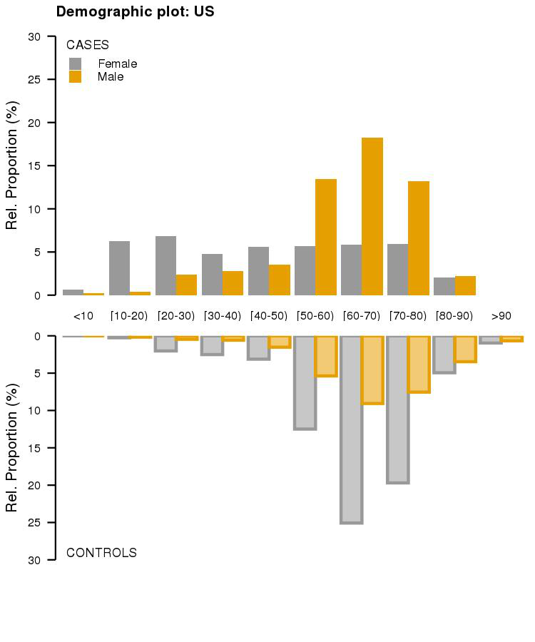


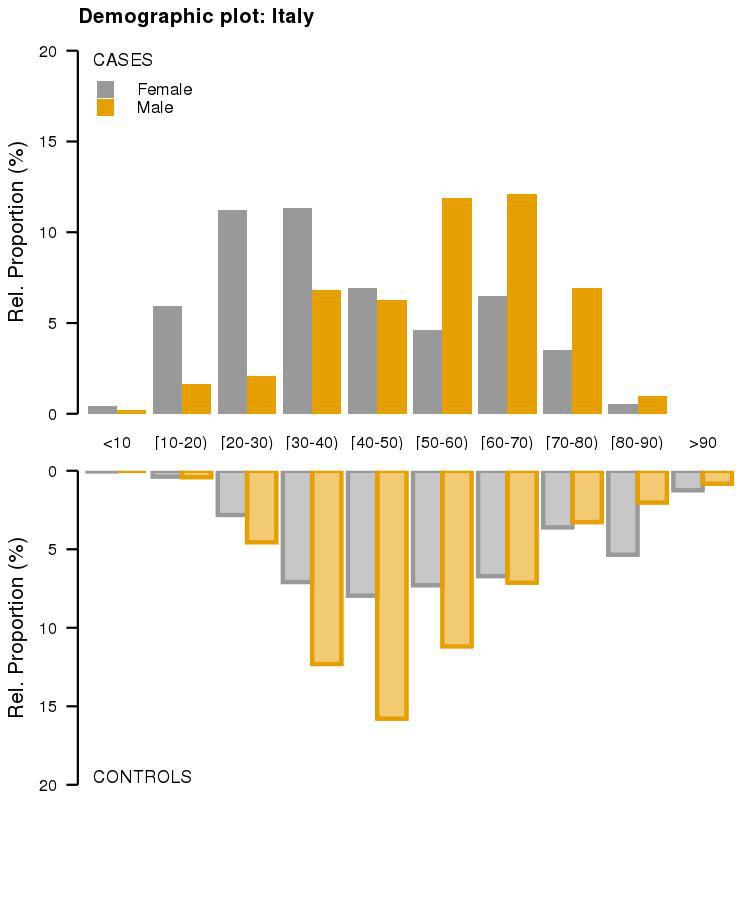

