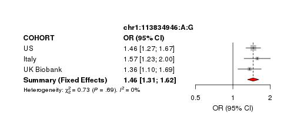
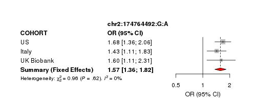
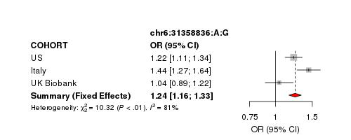
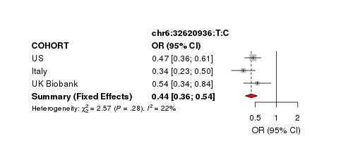
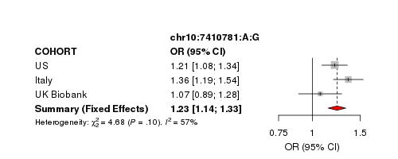
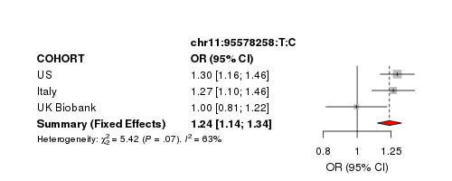
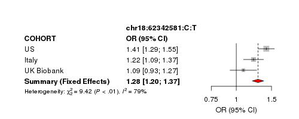

# Meta Analysis MG: USmerged,Itals,UKBB (imputed hg38)
# Overall MG

**Start date:** 03-30-2021

**End date:** 03-30-2021

**Analysed by:** Ruth Chia

**Working directory:** `/data/NDRS_LNG/MyastheniaGravis/updated.April2020/MetaAnalysis.hg38.ByCohort.rerun/USmerged.Itals.UKBB.hg38`

___


<h1>Table of Contents<span class="tocSkip"></span></h1>
<div class="toc"><ul class="toc-item"><li><span><a href="#Summary-stats-file-needed" data-toc-modified-id="Summary-stats-file-needed-1">Summary stats file needed</a></span></li><li><span><a href="#What-I-need-to-do" data-toc-modified-id="What-I-need-to-do-2">What I need to do</a></span></li><li><span><a href="#Subset-US-and-Itals-to-contain-only-index-vars-of-interest" data-toc-modified-id="Subset-US-and-Itals-to-contain-only-index-vars-of-interest-3">Subset US and Itals to contain only index vars of interest</a></span></li><li><span><a href="#Run-metal-(index-vars-from-meta-MG)" data-toc-modified-id="Run-metal-(index-vars-from-meta-MG)-4">Run metal (index vars from meta MG)</a></span></li><li><span><a href="#Include-maf-cases-and-controls-in-meta-results" data-toc-modified-id="Include-maf-cases-and-controls-in-meta-results-5">Include maf cases and controls in meta results</a></span></li><li><span><a href="#Create-forest-plot" data-toc-modified-id="Create-forest-plot-6">Create forest plot</a></span></li></ul></div>

## Summary stats file needed
1. to subset from MG.USmerged: `/data/NDRS_LNG/MyastheniaGravis/updated.April2020/US/Analysis.GLM.hg38/US.JointPostImputation/toMeta.MG.US.noDups.UNRELATED.hg38.glm.Rsq03MAF00001.tab`
2. to subset from MG.Itals: `/data/NDRS_LNG/MyastheniaGravis/updated.April2020/Itals/Analysis.GLM.hg38.rerun/toMeta.MG.ITALS.noDups.UNRELATED.hg38.glm.Rsq03MAF00001.tab`
3. UKBB: `/data/NDRS_LNG/MyastheniaGravis/updated.April2020/MetaAnalysis.hg38.ByCohort.rerun/USmerged.Itals.hg38/UKBB.replication/toMeta.MG.UKBB.NEW.matchedRatio20.noDups.UNRELATED.hg38.DiscoverySignifHits.tab`
    
## What I need to do
1. Prepare summary stats for meta analysis
2. Run metal

## Subset US and Itals to contain only index vars of interest


```python
!cut -f4 /data/NDRS_LNG/MyastheniaGravis/updated.April2020/MetaAnalysis.hg38.ByCohort.rerun/USmerged.Itals.hg38/UKBB.replication/toMeta.MG.UKBB.NEW.matchedRatio20.noDups.UNRELATED.hg38.DiscoverySignifHits.tab > IndexVars.txt
!grep -Ewf IndexVars.txt /data/NDRS_LNG/MyastheniaGravis/updated.April2020/US/Analysis.GLM.hg38/US.JointPostImputation/toMeta.MG.US.noDups.UNRELATED.hg38.glm.Rsq03MAF00001.tab > toMeta.USmerged.MG.hg38.DiscoverySignifHits.tab
!grep -Ewf IndexVars.txt /data/NDRS_LNG/MyastheniaGravis/updated.April2020/Itals/Analysis.GLM.hg38.rerun/toMeta.MG.ITALS.noDups.UNRELATED.hg38.glm.Rsq03MAF00001.tab > toMeta.Itals.MG.hg38.DiscoverySignifHits.tab
!wc -l toMeta.*.MG.hg38.DiscoverySignifHits.tab
```

       9 toMeta.Itals.MG.hg38.DiscoverySignifHits.tab
       9 toMeta.USmerged.MG.hg38.DiscoverySignifHits.tab
      18 total


## Run metal (index vars from meta MG)

metal script: `metal_MG.US.Itals.newUKBB.hg38.v1.txt`

```bash
# THIS SCRIPT EXECUTES AN ANALYSIS OF THREE STUDIES
# (i.e. MG.US and MG.Itals filtered for --maf 0.0001, Rsq>03)

# THE RESULTS FOR EACH STUDY ARE STORED IN FILES:
# toMeta.USmerged.MG.hg38.DiscoverySignifHits.tab
# toMeta.Itals.MG.hg38.DiscoverySignifHits.tab
# /data/NDRS_LNG/MyastheniaGravis/updated.April2020/MetaAnalysis.hg38.ByCohort.rerun/USmerged.Itals.hg38/UKBB.replication/toMeta.MG.UKBB.NEW.matchedRatio20.noDups.UNRELATED.hg38.DiscoverySignifHits.tab

SCHEME  STDERR
AVERAGEFREQ ON
MINMAXFREQ ON

# LOAD THE FIRST INPUT FILE
# UNCOMMENT THE NEXT LINE TO ENABLE GenomicControl CORRECTION
# GENOMICCONTROL ON

# === DESCRIBE AND PROCESS THE FIRST INPUT FILE ===
MARKER marker
ALLELE EffectAllele OtherAllele
FREQ   Freq_EffectAllele.CASE
EFFECT BETA
STDERR SE
PVALUE P
#WEIGHT OBS_CT
PROCESS toMeta.USmerged.MG.hg38.DiscoverySignifHits.tab

# === DESCRIBE AND PROCESS ADDITIONAL INPUT FILE ===
PROCESS toMeta.Itals.MG.hg38.DiscoverySignifHits.tab
PROCESS /data/NDRS_LNG/MyastheniaGravis/updated.April2020/MetaAnalysis.hg38.ByCohort.rerun/USmerged.Itals.hg38/UKBB.replication/toMeta.MG.UKBB.NEW.matchedRatio20.noDups.UNRELATED.hg38.DiscoverySignifHits.tab

OUTFILE META_USmerged.Itals.newUKBB.MG.UNRELATED.hg38.MetaMGindexVars.FreqCases.glm .tbl
ANALYZE HETEROGENEITY
```


```bash
%%bash
module load metal
metal metal_MG.US.Itals.newUKBB.hg38.v1.txt
```

    MetaAnalysis Helper - (c) 2007 - 2009 Goncalo Abecasis
    This version released on 2018-08-28
    
    # This program faciliates meta-analysis of genome-wide association studies.
    # Commonly used commands are listed below:
    #
    # Options for describing input files ...
    #   SEPARATOR        [WHITESPACE|COMMA|BOTH|TAB] (default = WHITESPACE)
    #   COLUMNCOUNTING   [STRICT|LENIENT]            (default = 'STRICT')
    #   MARKERLABEL      [LABEL]                     (default = 'MARKER')
    #   ALLELELABELS     [LABEL1 LABEL2]             (default = 'ALLELE1','ALLELE2')
    #   EFFECTLABEL      [LABEL|log(LABEL)]          (default = 'EFFECT')
    #   FLIP
    #
    # Options for filtering input files ...
    #   ADDFILTER        [LABEL CONDITION VALUE]     (example = ADDFILTER N > 10)
    #                    (available conditions are <, >, <=, >=, =, !=, IN)
    #   REMOVEFILTERS
    #
    # Options for sample size weighted meta-analysis ...
    #   WEIGHTLABEL      [LABEL]                     (default = 'N')
    #   PVALUELABEL      [LABEL]                     (default = 'PVALUE')
    #   DEFAULTWEIGHT    [NUMBER]                    (default = 1.0)
    #   MINWEIGHT        [NUMBER]                    (default = 1.0)
    #
    # Options for inverse variance weighted meta-analysis ...
    #   STDERRLABEL      [LABEL]                     (default = 'STDERR')
    #   SCHEME           [SAMPLESIZE|STDERR]         (default = SAMPLESIZE)
    #
    # Options to enable tracking of allele frequencies ...
    #   AVERAGEFREQ      [ON|OFF]                    (default = OFF)
    #   MINMAXFREQ       [ON|OFF]                    (default = OFF)
    #   FREQLABEL        [LABEL]                     (default = 'FREQ')
    #
    # Options to enable tracking of user defined variables ...
    #   CUSTOMVARIABLE   [VARNAME]
    #   LABEL            [VARNAME] AS [HEADER]
    #
    # Options to enable tracking of chromosomes and positions ...
    #   TRACKPOSITIONS   [ON|OFF]                    (default = OFF
    #   CHROMOSOMELABEL  [LABEL]                     (default = 'CHROMOSOME')
    #   POSITIONLABEL    [LABEL]                     (default = 'POSITION')
    #
    # Options to enable explicit strand information ...
    #   USESTRAND        [ON|OFF]                    (default = OFF)
    #   STRANDLABEL      [LABEL]                     (default = 'STRAND')
    #
    # Automatic genomic control correction of input statistics ...
    #   GENOMICCONTROL   [ON|OFF|VALUE|LIST snps.txt](default = OFF)
    #
    # Options to account for samples overlap ...
    #   OVERLAP          [ON|OFF]                    (default = OFF)
    #   ZCUTOFF          [NUMBER]                    (default = 1.0)
    #
    # Options for general analysis control ...
    #   PROCESSFILE      [FILENAME]
    #   OUTFILE          [PREFIX SUFFIX]             (default = 'METAANALYSIS','.TBL')
    #   MAXWARNINGS      [NUMBER]                    (default = 20)
    #   VERBOSE          [ON|OFF]                    (default = 'OFF')
    #   LOGPVALUE        [ON|OFF]                    (default = 'OFF')
    #   ANALYZE          [HETEROGENEITY]
    #   CLEAR
    
    # Options for general run control ...
    #   SOURCE           [SCRIPTFILE]
    #   RETURN
    #   QUIT
    
    # Processing commands in metal_MG.US.Itals.newUKBB.hg38.v1.txt ...
    ## Meta-analysis will be based on effect sizes and their standard errors ...
    ## Averaging of allele frequencies enabled
    ## Tracking of extreme allele frequencies enabled
    ## Set marker header to marker ...
    ## Set allele headers to EffectAllele and OtherAllele ...
    ## Set frequency header to Freq_EffectAllele.CASE ...
    ## Set effect header to BETA ...
    ## Set standard error header to SE ...
    ## Set p-value header to P ...
    ###########################################################################
    ## Processing file 'toMeta.USmerged.MG.hg38.DiscoverySignifHits.tab'
    ## Processed 8 markers ...
    
    ###########################################################################
    ## Processing file 'toMeta.Itals.MG.hg38.DiscoverySignifHits.tab'
    ## Processed 8 markers ...
    
    ###########################################################################
    ## Processing file '/data/NDRS_LNG/MyastheniaGravis/updated.April2020/MetaAnalysis.hg38.ByCohort.rerun/USmerged.Itals.hg38/UKBB.replication/toMeta.MG.UKBB.NEW.matchedRatio20.noDups.UNRELATED.hg38.DiscoverySignifHits.tab'
    ## Processed 8 markers ...
    
    ## Set output file prefix and suffix to META_USmerged.Itals.newUKBB.MG.UNRELATED.hg38.MetaMGindexVars.FreqCases.glm and .tbl ...
    ###########################################################################
    ## Running second pass analysis to evaluate heterogeneity...
    ## Processing file '/data/NDRS_LNG/MyastheniaGravis/updated.April2020/MetaAnalysis.hg38.ByCohort.rerun/USmerged.Itals.hg38/UKBB.replication/toMeta.MG.UKBB.NEW.matchedRatio20.noDups.UNRELATED.hg38.DiscoverySignifHits.tab'
    ## Processing file 'toMeta.Itals.MG.hg38.DiscoverySignifHits.tab'
    ## Processing file 'toMeta.USmerged.MG.hg38.DiscoverySignifHits.tab'
    
    ###########################################################################
    ## Executing meta-analysis ...
    ## Complete results will be stored in file 'META_USmerged.Itals.newUKBB.MG.UNRELATED.hg38.MetaMGindexVars.FreqCases.glm1.tbl'
    ## Column descriptions will be stored in file 'META_USmerged.Itals.newUKBB.MG.UNRELATED.hg38.MetaMGindexVars.FreqCases.glm1.tbl.info'
    ## Completed meta-analysis for 8 markers!
    ## Smallest p-value is 5.703e-16 at marker '6:32620936:T:C'
    
    ## Clearing all stored statistics ...
    # Clearing user defined filters ...


    [+] Loading metal  2018-08-28 


```python
import pandas as pd
import numpy as np

pd.read_csv("META_USmerged.Itals.newUKBB.MG.UNRELATED.hg38.MetaMGindexVars.FreqCases.glm1.tbl",sep="\t").sort_values(by=['MarkerName'])
```


<div>
<style scoped>
    .dataframe tbody tr th:only-of-type {
        vertical-align: middle;
    }

    .dataframe tbody tr th {
        vertical-align: top;
    }

    .dataframe thead th {
        text-align: right;
    }
</style>
<table border="1" class="dataframe">
  <thead>
    <tr style="text-align: right;">
      <th></th>
      <th>MarkerName</th>
      <th>Allele1</th>
      <th>Allele2</th>
      <th>Freq1</th>
      <th>FreqSE</th>
      <th>MinFreq</th>
      <th>MaxFreq</th>
      <th>Effect</th>
      <th>StdErr</th>
      <th>P-value</th>
      <th>Direction</th>
      <th>HetISq</th>
      <th>HetChiSq</th>
      <th>HetDf</th>
      <th>HetPVal</th>
    </tr>
  </thead>
  <tbody>
    <tr>
      <th>2</th>
      <td>10:7410781:A:G</td>
      <td>a</td>
      <td>g</td>
      <td>0.7369</td>
      <td>0.0361</td>
      <td>0.6898</td>
      <td>0.7839</td>
      <td>-0.2079</td>
      <td>0.0383</td>
      <td>5.582000e-08</td>
      <td>---</td>
      <td>57.3</td>
      <td>4.683</td>
      <td>2</td>
      <td>0.096200</td>
    </tr>
    <tr>
      <th>0</th>
      <td>11:95578258:T:C</td>
      <td>t</td>
      <td>c</td>
      <td>0.7909</td>
      <td>0.0169</td>
      <td>0.7800</td>
      <td>0.8291</td>
      <td>-0.2128</td>
      <td>0.0412</td>
      <td>2.416000e-07</td>
      <td>--+</td>
      <td>63.1</td>
      <td>5.415</td>
      <td>2</td>
      <td>0.066690</td>
    </tr>
    <tr>
      <th>5</th>
      <td>18:62342581:T:C</td>
      <td>t</td>
      <td>c</td>
      <td>0.4712</td>
      <td>0.0198</td>
      <td>0.4544</td>
      <td>0.5078</td>
      <td>-0.2501</td>
      <td>0.0334</td>
      <td>7.119000e-14</td>
      <td>---</td>
      <td>78.8</td>
      <td>9.424</td>
      <td>2</td>
      <td>0.008988</td>
    </tr>
    <tr>
      <th>3</th>
      <td>1:113834946:G:A</td>
      <td>a</td>
      <td>g</td>
      <td>0.1224</td>
      <td>0.0265</td>
      <td>0.0671</td>
      <td>0.1412</td>
      <td>0.3757</td>
      <td>0.0533</td>
      <td>1.854000e-12</td>
      <td>+++</td>
      <td>0.0</td>
      <td>0.734</td>
      <td>2</td>
      <td>0.692900</td>
    </tr>
    <tr>
      <th>1</th>
      <td>2:174764492:G:A</td>
      <td>a</td>
      <td>g</td>
      <td>0.0553</td>
      <td>0.0046</td>
      <td>0.0468</td>
      <td>0.0605</td>
      <td>0.4530</td>
      <td>0.0745</td>
      <td>1.181000e-09</td>
      <td>+++</td>
      <td>0.0</td>
      <td>0.964</td>
      <td>2</td>
      <td>0.617600</td>
    </tr>
    <tr>
      <th>6</th>
      <td>6:31358836:G:A</td>
      <td>a</td>
      <td>g</td>
      <td>0.3774</td>
      <td>0.0408</td>
      <td>0.3130</td>
      <td>0.4061</td>
      <td>0.2157</td>
      <td>0.0349</td>
      <td>6.701000e-10</td>
      <td>+++</td>
      <td>80.6</td>
      <td>10.324</td>
      <td>2</td>
      <td>0.005731</td>
    </tr>
    <tr>
      <th>4</th>
      <td>6:32620936:T:C</td>
      <td>t</td>
      <td>c</td>
      <td>0.9738</td>
      <td>0.0051</td>
      <td>0.9704</td>
      <td>0.9824</td>
      <td>0.8186</td>
      <td>0.1011</td>
      <td>5.703000e-16</td>
      <td>+++</td>
      <td>22.3</td>
      <td>2.574</td>
      <td>2</td>
      <td>0.276000</td>
    </tr>
    <tr>
      <th>7</th>
      <td>8:108247378:T:C</td>
      <td>t</td>
      <td>c</td>
      <td>0.9875</td>
      <td>0.0044</td>
      <td>0.9829</td>
      <td>1.0000</td>
      <td>-1.0634</td>
      <td>0.1935</td>
      <td>3.897000e-08</td>
      <td>--+</td>
      <td>0.0</td>
      <td>0.192</td>
      <td>2</td>
      <td>0.908600</td>
    </tr>
  </tbody>
</table>
</div>


## Include maf cases and controls in meta results

script to reformat, add maf for cases and controls before plotting: `ReformatMetaResults.addMAF.v4.R`

```Rscript

#!/usr/bin/env Rscript

args <- commandArgs(trailingOnly=TRUE)
if (length(args) != 5) {
  stop("USAGE: Rscript ReformatMetaResults.addMAF.v3.R args[1] args[2] args[3] args[4] args[5]
  where args[1] = metaResults
        args[2] = toMetaInput.US
        args[3] = toMetaInput.Itals
        args[4] = toMetaInput.UKBB
        args[5] = outputFileName")
}

# Load libraries
require(data.table)
require(tidyverse)


# Set variables
metaResults <- args[1]
toMetaInput.US <- args[2]
toMetaInput.Itals <- args[3]
toMetaInput.UKBB <- args[4]
outputFileName <- args[5]

# Read in files and reformat meta
meta <- fread(metaResults, header=T) %>%
        mutate(snp = MarkerName) %>%
        separate(snp,c("CHROM","POS","OA","EA"),sep=":") %>%
        rename(P = `P-value`)

## format meta results such that the effect allele matches original allele designation 
## given in MarkerName as submitted in the original files used for meta analysis 
## i.e. chr:pos:OtherAllele:EffectAllele
meta$OA <- tolower(meta$OA)
meta$EA <- tolower(meta$EA)
meta$EffectAllele <- ifelse(meta$EA == meta$Allele1, meta$Allele1, meta$Allele2)
meta$OtherAllele <- ifelse(meta$EA == meta$Allele1, meta$Allele2, meta$Allele1)
meta$maf_EA.cases <- ifelse(meta$EA == meta$Allele1, meta$Freq1, 1 - meta$Freq1)
meta$beta <- ifelse(meta$EffectAllele == meta$Allele1, meta$Effect, meta$Effect*-1)

data <- meta %>%
        mutate(CHROM = as.numeric(gsub("chr","",CHROM), POS = as.numeric(POS))) %>%
        filter(POS != is.na(POS)) %>%
        select(CHROM,POS,MarkerName,EffectAllele,OtherAllele,maf_EA.cases,beta,StdErr,P,Direction,HetISq) %>%
        arrange(CHROM,POS)

dim(meta)
dim(data)

# Get frequency information
us <- fread(toMetaInput.US,header=T) %>%
      select(marker,Freq_EffectAllele,Freq_EffectAllele.CASE,Freq_EffectAllele.CTRL,
             ALLELE_CT,CASE_ALLELE_CT,CTRL_ALLELE_CT,
             EffectAllele_CT,EffectAllele_CT.CASE,EffectAllele_CT.CTRL)
colnames(us)[2:10] <- paste(colnames(us)[2:10],"_US",sep="")

itals <- fread(toMetaInput.Itals,header=T) %>%
         select(marker,Freq_EffectAllele,Freq_EffectAllele.CASE,Freq_EffectAllele.CTRL,
                ALLELE_CT,CASE_ALLELE_CT,CTRL_ALLELE_CT,
                EffectAllele_CT,EffectAllele_CT.CASE,EffectAllele_CT.CTRL)
colnames(itals)[2:10] <- paste(colnames(itals)[2:10],"_Italy",sep="")

ukbb <- fread(toMetaInput.UKBB,header=T) %>%
         select(marker,Freq_EffectAllele,Freq_EffectAllele.CASE,Freq_EffectAllele.CTRL,
                ALLELE_CT,CASE_ALLELE_CT,CTRL_ALLELE_CT,
                EffectAllele_CT,EffectAllele_CT.CASE,EffectAllele_CT.CTRL)
colnames(ukbb)[2:10] <- paste(colnames(ukbb)[2:10],"_UKBB",sep="")


both0 <- merge(us,itals,by="marker")
both <- merge(both0,ukbb,by="marker")

dim(us)
dim(itals)
dim(ukbb)
dim(both)

both$Freq_EffectAllele <- (both$Freq_EffectAllele_US + both$Freq_EffectAllele_Italy + both$Freq_EffectAllele_UKBB)/3
both$Freq_EffectAllele.CASE <- (both$Freq_EffectAllele.CASE_US + both$Freq_EffectAllele.CASE_Italy + both$Freq_EffectAllele.CASE_UKBB)/3
both$Freq_EffectAllele.CTRL <- (both$Freq_EffectAllele.CTRL_US + both$Freq_EffectAllele.CTRL_Italy + both$Freq_EffectAllele.CTRL_UKBB)/3

both$ALLELE_CT <- both$ALLELE_CT_US + both$ALLELE_CT_Italy + both$ALLELE_CT_UKBB
both$ALLELE_CT.CASE <- both$CASE_ALLELE_CT_US + both$CASE_ALLELE_CT_Italy + both$CASE_ALLELE_CT_UKBB
both$ALLELE_CT.CTRL <- both$CTRL_ALLELE_CT_US + both$CTRL_ALLELE_CT_Italy + both$CTRL_ALLELE_CT_UKBB

both$EffectAllele_CT <- both$EffectAllele_CT_US + both$EffectAllele_CT_Italy + both$EffectAllele_CT_UKBB
both$EffectAllele_CT.CASE <- both$EffectAllele_CT.CASE_US + both$EffectAllele_CT.CASE_Italy + both$EffectAllele_CT.CASE_UKBB
both$EffectAllele_CT.CTRL <- both$EffectAllele_CT.CTRL_US + both$EffectAllele_CT.CTRL_Italy + both$EffectAllele_CT.CTRL_UKBB

both$maf_EA <- both$EffectAllele_CT/both$ALLELE_CT
both$maf_EA.CASE <- both$EffectAllele_CT.CASE/both$ALLELE_CT.CASE
both$maf_EA.CTRL <- both$EffectAllele_CT.CTRL/both$ALLELE_CT.CTRL
write.table(both,"MAF.USmerged.Itals.txt",sep="\t",quote=F,row.names=F,col.names=T)
            
freq <- both %>%
        select(marker,Freq_EffectAllele,Freq_EffectAllele.CASE,Freq_EffectAllele.CTRL,
              ALLELE_CT,ALLELE_CT.CASE,ALLELE_CT.CTRL,
              EffectAllele_CT,EffectAllele_CT.CASE,EffectAllele_CT.CTRL,
              maf_EA,maf_EA.CASE,maf_EA.CTRL)


# merge formatted meta results with frequency file
tmp <- merge(data,freq,by.x="MarkerName",by.y="marker")
data2 <- tmp %>% 
         select(CHROM,POS,MarkerName,EffectAllele,OtherAllele,
                maf_EA,maf_EA.CASE,maf_EA.CTRL,beta,StdErr,P,Direction,HetISq)

write.table(data2,paste(args[5],".TIDY.txt",sep=""),quote=F,row.names=F,col.names=T,sep="\t")
```


```bash
%%bash
module load R/3.5.2
DIR="/data/NDRS_LNG/MyastheniaGravis/updated.April2020"

Rscript ReformatMetaResults.addMAF.v4.R \
META_USmerged.Itals.newUKBB.MG.UNRELATED.hg38.MetaMGindexVars.FreqCases.glm1.tbl \
toMeta.USmerged.MG.hg38.DiscoverySignifHits.tab \
toMeta.Itals.MG.hg38.DiscoverySignifHits.tab \
$DIR/MetaAnalysis.hg38.ByCohort.rerun/USmerged.Itals.hg38/UKBB.replication/toMeta.MG.UKBB.NEW.matchedRatio20.noDups.UNRELATED.hg38.DiscoverySignifHits.tab \
META_MG.USmerged.Itals.newUKBB.UNRELATED.hg38.Rsq03

```

    [1]  8 23
    [1]  8 11
    [1]  8 10
    [1]  8 10
    [1]  8 10
    [1]  8 28


    [+] Loading gcc  7.3.0  ... 
    [+] Loading GSL 2.4 for GCC 7.2.0 ... 
    [-] Unloading gcc  7.3.0  ... 
    [+] Loading gcc  7.3.0  ... 
    [+] Loading openmpi 3.0.2  for GCC 7.3.0 
    [+] Loading ImageMagick  7.0.8  on cn1940 
    [+] Loading HDF5  1.10.4 
    [+] Loading pandoc  2.13  on cn1940 
    [+] Loading R 3.5.2 
    Loading required package: data.table
    Loading required package: tidyverse
    -- Attaching packages --------------------------------------- tidyverse 1.2.1 --
    v ggplot2 3.3.2     v purrr   0.3.4
    v tibble  3.0.3     v dplyr   0.8.5
    v tidyr   0.8.3     v stringr 1.4.0
    v readr   1.3.1     v forcats 0.5.0
    -- Conflicts ------------------------------------------ tidyverse_conflicts() --
    x dplyr::between()   masks data.table::between()
    x dplyr::filter()    masks stats::filter()
    x dplyr::first()     masks data.table::first()
    x dplyr::lag()       masks stats::lag()
    x dplyr::last()      masks data.table::last()
    x purrr::transpose() masks data.table::transpose()


```python
import pandas as pd
import numpy as np

pd.read_csv("META_MG.USmerged.Itals.newUKBB.UNRELATED.hg38.Rsq03.TIDY.txt",sep="\t").sort_values(by=['CHROM','POS'])
```


<div>
<style scoped>
    .dataframe tbody tr th:only-of-type {
        vertical-align: middle;
    }

    .dataframe tbody tr th {
        vertical-align: top;
    }

    .dataframe thead th {
        text-align: right;
    }
</style>
<table border="1" class="dataframe">
  <thead>
    <tr style="text-align: right;">
      <th></th>
      <th>CHROM</th>
      <th>POS</th>
      <th>MarkerName</th>
      <th>EffectAllele</th>
      <th>OtherAllele</th>
      <th>maf_EA</th>
      <th>maf_EA.CASE</th>
      <th>maf_EA.CTRL</th>
      <th>beta</th>
      <th>StdErr</th>
      <th>P</th>
      <th>Direction</th>
      <th>HetISq</th>
    </tr>
  </thead>
  <tbody>
    <tr>
      <th>3</th>
      <td>1</td>
      <td>113834946</td>
      <td>1:113834946:G:A</td>
      <td>a</td>
      <td>g</td>
      <td>0.095992</td>
      <td>0.107095</td>
      <td>0.095422</td>
      <td>0.3757</td>
      <td>0.0533</td>
      <td>1.854000e-12</td>
      <td>+++</td>
      <td>0.0</td>
    </tr>
    <tr>
      <th>4</th>
      <td>2</td>
      <td>174764492</td>
      <td>2:174764492:G:A</td>
      <td>a</td>
      <td>g</td>
      <td>0.036272</td>
      <td>0.055710</td>
      <td>0.035275</td>
      <td>0.4530</td>
      <td>0.0745</td>
      <td>1.181000e-09</td>
      <td>+++</td>
      <td>0.0</td>
    </tr>
    <tr>
      <th>5</th>
      <td>6</td>
      <td>31358836</td>
      <td>6:31358836:G:A</td>
      <td>a</td>
      <td>g</td>
      <td>0.353854</td>
      <td>0.366285</td>
      <td>0.353217</td>
      <td>0.2157</td>
      <td>0.0349</td>
      <td>6.701000e-10</td>
      <td>+++</td>
      <td>80.6</td>
    </tr>
    <tr>
      <th>6</th>
      <td>6</td>
      <td>32620936</td>
      <td>6:32620936:T:C</td>
      <td>c</td>
      <td>t</td>
      <td>0.058033</td>
      <td>0.024472</td>
      <td>0.059754</td>
      <td>-0.8186</td>
      <td>0.1011</td>
      <td>5.703000e-16</td>
      <td>+++</td>
      <td>22.3</td>
    </tr>
    <tr>
      <th>7</th>
      <td>8</td>
      <td>108247378</td>
      <td>8:108247378:T:C</td>
      <td>c</td>
      <td>t</td>
      <td>0.003840</td>
      <td>0.010554</td>
      <td>0.003496</td>
      <td>1.0634</td>
      <td>0.1935</td>
      <td>3.897000e-08</td>
      <td>--+</td>
      <td>0.0</td>
    </tr>
    <tr>
      <th>0</th>
      <td>10</td>
      <td>7410781</td>
      <td>10:7410781:A:G</td>
      <td>g</td>
      <td>a</td>
      <td>0.214807</td>
      <td>0.267176</td>
      <td>0.212121</td>
      <td>0.2079</td>
      <td>0.0383</td>
      <td>5.582000e-08</td>
      <td>---</td>
      <td>57.3</td>
    </tr>
    <tr>
      <th>1</th>
      <td>11</td>
      <td>95578258</td>
      <td>11:95578258:T:C</td>
      <td>c</td>
      <td>t</td>
      <td>0.175249</td>
      <td>0.209699</td>
      <td>0.173483</td>
      <td>0.2128</td>
      <td>0.0412</td>
      <td>2.416000e-07</td>
      <td>--+</td>
      <td>63.1</td>
    </tr>
    <tr>
      <th>2</th>
      <td>18</td>
      <td>62342581</td>
      <td>18:62342581:T:C</td>
      <td>c</td>
      <td>t</td>
      <td>0.466160</td>
      <td>0.528169</td>
      <td>0.462980</td>
      <td>0.2501</td>
      <td>0.0334</td>
      <td>7.119000e-14</td>
      <td>---</td>
      <td>78.8</td>
    </tr>
  </tbody>
</table>
</div>


## Create forest plot

R meta package vignette: `https://cran.r-project.org/web/packages/meta/meta.pdf`

Create forest plots for LOMG males based on the significant hits from LOMG discovery analysis


```python
!mkdir ForestPlots
```


```bash
%%bash
cd ForestPlots/

# toMeta.USmerged.MG.hg38.DiscoverySignifHits.tab
# toMeta.Itals.MG.hg38.DiscoverySignifHits.tab
# /data/NDRS_LNG/MyastheniaGravis/updated.April2020/MetaAnalysis.hg38.ByCohort.rerun/USmerged.Itals.hg38/UKBB.replication/toMeta.MG.UKBB.NEW.matchedRatio20.noDups.UNRELATED.hg38.DiscoverySignifHits.tab

module load R/3.5.2
R --vanilla --no-save

require(data.table)
require(tidyverse)
library(meta)

# Read in summ stats
us <- fread("../toMeta.USmerged.MG.hg38.DiscoverySignifHits.tab",header=T) %>% mutate(COHORT="US")
itals <- fread("../toMeta.Itals.MG.hg38.DiscoverySignifHits.tab",header=T) %>% mutate(COHORT="Italy")
ukbb <- fread("/data/NDRS_LNG/MyastheniaGravis/updated.April2020/MetaAnalysis.hg38.ByCohort.rerun/USmerged.Itals.hg38/UKBB.replication/toMeta.MG.UKBB.NEW.matchedRatio20.noDups.UNRELATED.hg38.DiscoverySignifHits.tab",header=T) %>% mutate(COHORT="UK Biobank")

# Merge
data <- rbind(us,itals,ukbb)
data$CI.low <- exp(data$BETA - qnorm(0.975)*data$SE)
data$CI.high <- exp(data$BETA + qnorm(0.975)*data$SE)
write.table(data,"merged.US.Itals.newUKBB.MG.forForestPlot.txt",quote=F,sep="\t",row.names=F,col.names=T)


# Plot
input <- data
input$Name <- input$marker
input$Name <- gsub(":","_",input$Name)
byVar <- split(input, input$marker)

for (i in 1:length(byVar))
{
sumstats <- byVar[[i]]
m <- metagen(BETA,
             SE,
             data=sumstats,
             studlab=COHORT,
             comb.fixed = TRUE,
             comb.random = FALSE,
             prediction=FALSE,
             level.ci = 0.95,
             sm="OR")

pdf(file = paste("chr",sumstats$Name[1],'.new.MG.forestplot.pdf',sep=""), 
    width = 6, # The width of the plot in inches
    height = 2.6) 
forest.jama <- forest(m,
                      layout = "JAMA",
                      text.fixed = "Summary (Fixed Effects)",
                      leftlabs=c("COHORT", paste(sumstats$ID[1],"OR (95% CI)",sep="\n")),
                      smlab = "OR",
                      squaresize = 0.5,
                      col.square = "grey",
                      col.square.lines = "grey",
                      col.diamond.fixed = "red",
                      ff.fixed = "bold",
                      ff.fixed.labels = "bold",
                      fs.hetstat = 10,
                      just.addcols = "center",
                      spacing = 1.25,
                      colgap.forest.left = unit(1,"mm"),
                      colgap.forest.right = unit(15,"mm"),
                      colgap.studlab = unit(10,"mm"),
                      plotwidth = unit(45,"mm"))
dev.off() 

jpeg(file = paste("chr",sumstats$Name[1],'.new.MG.forestplot.jpeg',sep=""), width = 500, height = 200) 
forest.jama <- forest(m,
                      layout = "JAMA",
                      text.fixed = "Summary (Fixed Effects)",
                      leftlabs=c("COHORT", paste(sumstats$ID[1],"OR (95% CI)",sep="\n")),
                      smlab = "OR",
                      squaresize = 0.5,
                      col.square = "grey",
                      col.square.lines = "grey",
                      col.diamond.fixed = "red",
                      ff.fixed = "bold",
                      ff.fixed.labels = "bold",
                      fs.hetstat = 10,
                      just.addcols = "center",
                      spacing = 1.25,
                      colgap.forest.left = unit(1,"mm"),
                      colgap.forest.right = unit(15,"mm"),
                      colgap.studlab = unit(10,"mm"),
                      plotwidth = unit(45,"mm"))
dev.off() 

}

```

    
    R version 3.5.2 (2018-12-20) -- "Eggshell Igloo"
    Copyright (C) 2018 The R Foundation for Statistical Computing
    Platform: x86_64-pc-linux-gnu (64-bit)
    
    R is free software and comes with ABSOLUTELY NO WARRANTY.
    You are welcome to redistribute it under certain conditions.
    Type 'license()' or 'licence()' for distribution details.
    
    R is a collaborative project with many contributors.
    Type 'contributors()' for more information and
    'citation()' on how to cite R or R packages in publications.
    
    Type 'demo()' for some demos, 'help()' for on-line help, or
    'help.start()' for an HTML browser interface to help.
    Type 'q()' to quit R.
    
    > 
    > require(data.table)
    > require(tidyverse)
    > library(meta)
    > 
    > # Read in summ stats
    > us <- fread("../toMeta.USmerged.MG.hg38.DiscoverySignifHits.tab",header=T) %>% mutate(COHORT="US")
    > itals <- fread("../toMeta.Itals.MG.hg38.DiscoverySignifHits.tab",header=T) %>% mutate(COHORT="Italy")
    > ukbb <- fread("/data/NDRS_LNG/MyastheniaGravis/updated.April2020/MetaAnalysis.hg38.ByCohort.rerun/USmerged.Itals.hg38/UKBB.replication/toMeta.MG.UKBB.NEW.matchedRatio20.noDups.UNRELATED.hg38.DiscoverySignifHits.tab",header=T) %>% mutate(COHORT="UK Biobank")
    > 
    > # Merge
    > data <- rbind(us,itals,ukbb)
    > data$CI.low <- exp(data$BETA - qnorm(0.975)*data$SE)
    > data$CI.high <- exp(data$BETA + qnorm(0.975)*data$SE)
    > write.table(data,"merged.US.Itals.newUKBB.MG.forForestPlot.txt",quote=F,sep="\t",row.names=F,col.names=T)
    > 
    > 
    > # Plot
    > input <- data
    > input$Name <- input$marker
    > input$Name <- gsub(":","_",input$Name)
    > byVar <- split(input, input$marker)
    > 
    > for (i in 1:length(byVar))
    + {
    + sumstats <- byVar[[i]]
    + m <- metagen(BETA,
    +              SE,
    +              data=sumstats,
    +              studlab=COHORT,
    +              comb.fixed = TRUE,
    +              comb.random = FALSE,
    +              prediction=FALSE,
    +              level.ci = 0.95,
    +              sm="OR")
    + 
    + pdf(file = paste("chr",sumstats$Name[1],'.new.MG.forestplot.pdf',sep=""), 
    +     width = 6, # The width of the plot in inches
    +     height = 2.6) 
    + forest.jama <- forest(m,
    +                       layout = "JAMA",
    +                       text.fixed = "Summary (Fixed Effects)",
    +                       leftlabs=c("COHORT", paste(sumstats$ID[1],"OR (95% CI)",sep="\n")),
    +                       smlab = "OR",
    +                       squaresize = 0.5,
    +                       col.square = "grey",
    +                       col.square.lines = "grey",
    +                       col.diamond.fixed = "red",
    +                       ff.fixed = "bold",
    +                       ff.fixed.labels = "bold",
    +                       fs.hetstat = 10,
    +                       just.addcols = "center",
    +                       spacing = 1.25,
    +                       colgap.forest.left = unit(1,"mm"),
    +                       colgap.forest.right = unit(15,"mm"),
    +                       colgap.studlab = unit(10,"mm"),
    +                       plotwidth = unit(45,"mm"))
    + dev.off() 
    + 
    + jpeg(file = paste("chr",sumstats$Name[1],'.new.MG.forestplot.jpeg',sep=""), width = 500, height = 200) 
    + forest.jama <- forest(m,
    +                       layout = "JAMA",
    +                       text.fixed = "Summary (Fixed Effects)",
    +                       leftlabs=c("COHORT", paste(sumstats$ID[1],"OR (95% CI)",sep="\n")),
    +                       smlab = "OR",
    +                       squaresize = 0.5,
    +                       col.square = "grey",
    +                       col.square.lines = "grey",
    +                       col.diamond.fixed = "red",
    +                       ff.fixed = "bold",
    +                       ff.fixed.labels = "bold",
    +                       fs.hetstat = 10,
    +                       just.addcols = "center",
    +                       spacing = 1.25,
    +                       colgap.forest.left = unit(1,"mm"),
    +                       colgap.forest.right = unit(15,"mm"),
    +                       colgap.studlab = unit(10,"mm"),
    +                       plotwidth = unit(45,"mm"))
    + dev.off() 
    + 
    + }
    > 


    [+] Loading gcc  7.3.0  ... 
    [+] Loading GSL 2.4 for GCC 7.2.0 ... 
    [-] Unloading gcc  7.3.0  ... 
    [+] Loading gcc  7.3.0  ... 
    [+] Loading openmpi 3.0.2  for GCC 7.3.0 
    [+] Loading ImageMagick  7.0.8  on cn1940 
    [+] Loading HDF5  1.10.4 
    [+] Loading pandoc  2.13  on cn1940 
    [+] Loading R 3.5.2 
    Loading required package: data.table
    Loading required package: tidyverse
    -- Attaching packages --------------------------------------- tidyverse 1.2.1 --
    v ggplot2 3.3.2     v purrr   0.3.4
    v tibble  3.0.3     v dplyr   0.8.5
    v tidyr   0.8.3     v stringr 1.4.0
    v readr   1.3.1     v forcats 0.5.0
    -- Conflicts ------------------------------------------ tidyverse_conflicts() --
    x dplyr::between()   masks data.table::between()
    x dplyr::filter()    masks stats::filter()
    x dplyr::first()     masks data.table::first()
    x dplyr::lag()       masks stats::lag()
    x dplyr::last()      masks data.table::last()
    x purrr::transpose() masks data.table::transpose()
    Loading 'meta' package (version 4.9-5).
    Type 'help(meta)' for a brief overview.


```python
import pandas as pd

data = pd.read_csv("ForestPlots/merged.US.Itals.newUKBB.MG.forForestPlot.txt",sep="\t")
data.sort_values(by=['CHROM','POS',"COHORT"]).drop(['CHROM','POS','marker','Freq_EffectAllele','ALLELE_CT','CASE_ALLELE_CT','CTRL_ALLELE_CT','EffectAllele_CT','EffectAllele_CT.CASE','EffectAllele_CT.CTRL'],axis=1)
```


<div>
<style scoped>
    .dataframe tbody tr th:only-of-type {
        vertical-align: middle;
    }

    .dataframe tbody tr th {
        vertical-align: top;
    }

    .dataframe thead th {
        text-align: right;
    }
</style>
<table border="1" class="dataframe">
  <thead>
    <tr style="text-align: right;">
      <th></th>
      <th>ID</th>
      <th>EffectAllele</th>
      <th>OtherAllele</th>
      <th>OR</th>
      <th>BETA</th>
      <th>SE</th>
      <th>P</th>
      <th>Freq_EffectAllele.CASE</th>
      <th>Freq_EffectAllele.CTRL</th>
      <th>COHORT</th>
      <th>CI.low</th>
      <th>CI.high</th>
    </tr>
  </thead>
  <tbody>
    <tr>
      <th>8</th>
      <td>chr1:113834946:A:G</td>
      <td>A</td>
      <td>G</td>
      <td>1.569830</td>
      <td>0.450967</td>
      <td>0.124311</td>
      <td>2.859210e-04</td>
      <td>0.067107</td>
      <td>0.041235</td>
      <td>Italy</td>
      <td>1.230379e+00</td>
      <td>2.002933e+00</td>
    </tr>
    <tr>
      <th>16</th>
      <td>rs2476601</td>
      <td>A</td>
      <td>G</td>
      <td>1.362040</td>
      <td>0.308984</td>
      <td>0.110357</td>
      <td>5.112470e-03</td>
      <td>0.141243</td>
      <td>0.107396</td>
      <td>UK Biobank</td>
      <td>1.097119e+00</td>
      <td>1.690931e+00</td>
    </tr>
    <tr>
      <th>0</th>
      <td>chr1:113834946:A:G</td>
      <td>A</td>
      <td>G</td>
      <td>1.460290</td>
      <td>0.378635</td>
      <td>0.069870</td>
      <td>5.988890e-08</td>
      <td>0.132261</td>
      <td>0.096784</td>
      <td>US</td>
      <td>1.273403e+00</td>
      <td>1.674605e+00</td>
    </tr>
    <tr>
      <th>9</th>
      <td>chr2:174764492:G:A</td>
      <td>A</td>
      <td>G</td>
      <td>1.426150</td>
      <td>0.354979</td>
      <td>0.126374</td>
      <td>4.970140e-03</td>
      <td>0.060506</td>
      <td>0.046415</td>
      <td>Italy</td>
      <td>1.113257e+00</td>
      <td>1.826985e+00</td>
    </tr>
    <tr>
      <th>17</th>
      <td>rs35274388</td>
      <td>A</td>
      <td>G</td>
      <td>1.603080</td>
      <td>0.471927</td>
      <td>0.187268</td>
      <td>1.173350e-02</td>
      <td>0.046798</td>
      <td>0.030312</td>
      <td>UK Biobank</td>
      <td>1.110586e+00</td>
      <td>2.313972e+00</td>
    </tr>
    <tr>
      <th>1</th>
      <td>chr2:174764492:G:A</td>
      <td>A</td>
      <td>G</td>
      <td>1.675030</td>
      <td>0.515831</td>
      <td>0.105906</td>
      <td>1.112240e-06</td>
      <td>0.054461</td>
      <td>0.035515</td>
      <td>US</td>
      <td>1.361054e+00</td>
      <td>2.061436e+00</td>
    </tr>
    <tr>
      <th>10</th>
      <td>chr6:31358836:A:G</td>
      <td>A</td>
      <td>G</td>
      <td>1.442280</td>
      <td>0.366225</td>
      <td>0.065574</td>
      <td>2.338990e-08</td>
      <td>0.312981</td>
      <td>0.222959</td>
      <td>Italy</td>
      <td>1.268331e+00</td>
      <td>1.640086e+00</td>
    </tr>
    <tr>
      <th>18</th>
      <td>rs9266277</td>
      <td>A</td>
      <td>G</td>
      <td>1.040750</td>
      <td>0.039942</td>
      <td>0.079052</td>
      <td>6.133920e-01</td>
      <td>0.394683</td>
      <td>0.384597</td>
      <td>UK Biobank</td>
      <td>8.913681e-01</td>
      <td>1.215166e+00</td>
    </tr>
    <tr>
      <th>2</th>
      <td>chr6:31358836:A:G</td>
      <td>A</td>
      <td>G</td>
      <td>1.220840</td>
      <td>0.199539</td>
      <td>0.048419</td>
      <td>3.769520e-05</td>
      <td>0.406120</td>
      <td>0.355950</td>
      <td>US</td>
      <td>1.110311e+00</td>
      <td>1.342372e+00</td>
    </tr>
    <tr>
      <th>11</th>
      <td>chr6:32620936:T:C</td>
      <td>C</td>
      <td>T</td>
      <td>0.340973</td>
      <td>-1.075952</td>
      <td>0.197733</td>
      <td>5.285280e-08</td>
      <td>0.017602</td>
      <td>0.041649</td>
      <td>Italy</td>
      <td>2.314245e-01</td>
      <td>5.023780e-01</td>
    </tr>
    <tr>
      <th>19</th>
      <td>rs76815088</td>
      <td>C</td>
      <td>T</td>
      <td>0.536007</td>
      <td>-0.623608</td>
      <td>0.228605</td>
      <td>6.374080e-03</td>
      <td>0.028249</td>
      <td>0.051855</td>
      <td>UK Biobank</td>
      <td>3.424377e-01</td>
      <td>8.389950e-01</td>
    </tr>
    <tr>
      <th>3</th>
      <td>chr6:32620936:T:C</td>
      <td>C</td>
      <td>T</td>
      <td>0.465365</td>
      <td>-0.764933</td>
      <td>0.137251</td>
      <td>2.500220e-08</td>
      <td>0.029564</td>
      <td>0.062682</td>
      <td>US</td>
      <td>3.556030e-01</td>
      <td>6.090066e-01</td>
    </tr>
    <tr>
      <th>12</th>
      <td>chr8:108247378:T:C</td>
      <td>C</td>
      <td>T</td>
      <td>3.079080</td>
      <td>1.124631</td>
      <td>0.279629</td>
      <td>5.773830e-05</td>
      <td>0.017052</td>
      <td>0.006009</td>
      <td>Italy</td>
      <td>1.779919e+00</td>
      <td>5.326496e+00</td>
    </tr>
    <tr>
      <th>20</th>
      <td>rs57015275</td>
      <td>C</td>
      <td>T</td>
      <td>0.000052</td>
      <td>-9.866400</td>
      <td>34.461700</td>
      <td>7.746480e-01</td>
      <td>0.000011</td>
      <td>0.001676</td>
      <td>UK Biobank</td>
      <td>2.405607e-34</td>
      <td>1.119255e+25</td>
    </tr>
    <tr>
      <th>4</th>
      <td>chr8:108247378:T:C</td>
      <td>C</td>
      <td>T</td>
      <td>2.739510</td>
      <td>1.007779</td>
      <td>0.268056</td>
      <td>1.701960e-04</td>
      <td>0.008299</td>
      <td>0.003696</td>
      <td>US</td>
      <td>1.619956e+00</td>
      <td>4.632790e+00</td>
    </tr>
    <tr>
      <th>13</th>
      <td>chr10:7410781:A:G</td>
      <td>G</td>
      <td>A</td>
      <td>1.355200</td>
      <td>0.303949</td>
      <td>0.064709</td>
      <td>2.638100e-06</td>
      <td>0.310231</td>
      <td>0.243473</td>
      <td>Italy</td>
      <td>1.193776e+00</td>
      <td>1.538452e+00</td>
    </tr>
    <tr>
      <th>21</th>
      <td>rs2245569</td>
      <td>G</td>
      <td>A</td>
      <td>1.067010</td>
      <td>0.064860</td>
      <td>0.093262</td>
      <td>4.867410e-01</td>
      <td>0.216102</td>
      <td>0.205157</td>
      <td>UK Biobank</td>
      <td>8.887577e-01</td>
      <td>1.281013e+00</td>
    </tr>
    <tr>
      <th>5</th>
      <td>chr10:7410781:A:G</td>
      <td>G</td>
      <td>A</td>
      <td>1.207110</td>
      <td>0.188229</td>
      <td>0.055173</td>
      <td>6.457570e-04</td>
      <td>0.245332</td>
      <td>0.211341</td>
      <td>US</td>
      <td>1.083387e+00</td>
      <td>1.344963e+00</td>
    </tr>
    <tr>
      <th>14</th>
      <td>chr11:95578258:T:C</td>
      <td>C</td>
      <td>T</td>
      <td>1.269330</td>
      <td>0.238489</td>
      <td>0.072265</td>
      <td>9.660160e-04</td>
      <td>0.220022</td>
      <td>0.181102</td>
      <td>Italy</td>
      <td>1.101698e+00</td>
      <td>1.462469e+00</td>
    </tr>
    <tr>
      <th>22</th>
      <td>rs4409785</td>
      <td>C</td>
      <td>T</td>
      <td>0.995514</td>
      <td>-0.004496</td>
      <td>0.102726</td>
      <td>9.650930e-01</td>
      <td>0.170904</td>
      <td>0.171862</td>
      <td>UK Biobank</td>
      <td>8.139671e-01</td>
      <td>1.217553e+00</td>
    </tr>
    <tr>
      <th>6</th>
      <td>chr11:95578258:T:C</td>
      <td>C</td>
      <td>T</td>
      <td>1.303040</td>
      <td>0.264700</td>
      <td>0.057503</td>
      <td>4.159410e-06</td>
      <td>0.214212</td>
      <td>0.173278</td>
      <td>US</td>
      <td>1.164157e+00</td>
      <td>1.458492e+00</td>
    </tr>
    <tr>
      <th>15</th>
      <td>chr18:62342581:C:T</td>
      <td>C</td>
      <td>T</td>
      <td>1.219630</td>
      <td>0.198548</td>
      <td>0.058640</td>
      <td>7.095300e-04</td>
      <td>0.523652</td>
      <td>0.479901</td>
      <td>Italy</td>
      <td>1.087211e+00</td>
      <td>1.368177e+00</td>
    </tr>
    <tr>
      <th>23</th>
      <td>rs4574025</td>
      <td>C</td>
      <td>T</td>
      <td>1.085080</td>
      <td>0.081654</td>
      <td>0.078532</td>
      <td>2.984380e-01</td>
      <td>0.492179</td>
      <td>0.473759</td>
      <td>UK Biobank</td>
      <td>9.302842e-01</td>
      <td>1.265633e+00</td>
    </tr>
    <tr>
      <th>7</th>
      <td>chr18:62342581:C:T</td>
      <td>C</td>
      <td>T</td>
      <td>1.413060</td>
      <td>0.345758</td>
      <td>0.047532</td>
      <td>3.487840e-13</td>
      <td>0.545643</td>
      <td>0.459537</td>
      <td>US</td>
      <td>1.287363e+00</td>
      <td>1.551030e+00</td>
    </tr>
  </tbody>
</table>
</div>


```python
from IPython.display import display
from PIL import Image

plot="ForestPlots/chr1_113834946_G_A.new.MG.forestplot.jpeg"
display(Image.open(plot))

plot="ForestPlots/chr2_174764492_G_A.new.MG.forestplot.jpeg"
display(Image.open(plot))

plot="ForestPlots/chr6_31358836_G_A.new.MG.forestplot.jpeg"
display(Image.open(plot))

plot="ForestPlots/chr6_32620936_T_C.new.MG.forestplot.jpeg"
display(Image.open(plot))

plot="ForestPlots/chr10_7410781_A_G.new.MG.forestplot.jpeg"
display(Image.open(plot))

plot="ForestPlots/chr11_95578258_T_C.new.MG.forestplot.jpeg"
display(Image.open(plot))

plot="ForestPlots/chr18_62342581_T_C.new.MG.forestplot.jpeg"
display(Image.open(plot))
```






















