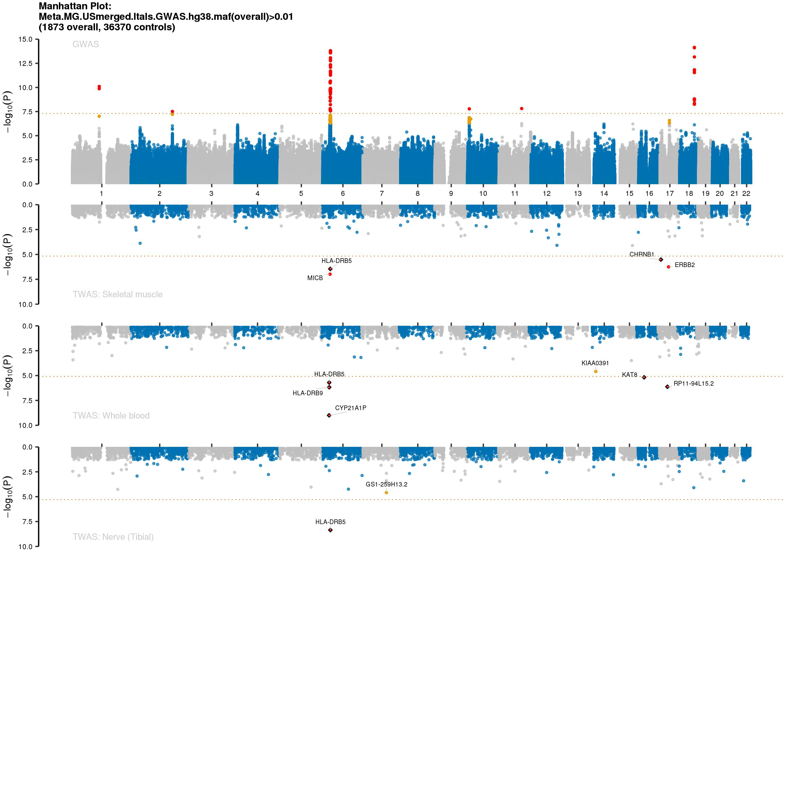
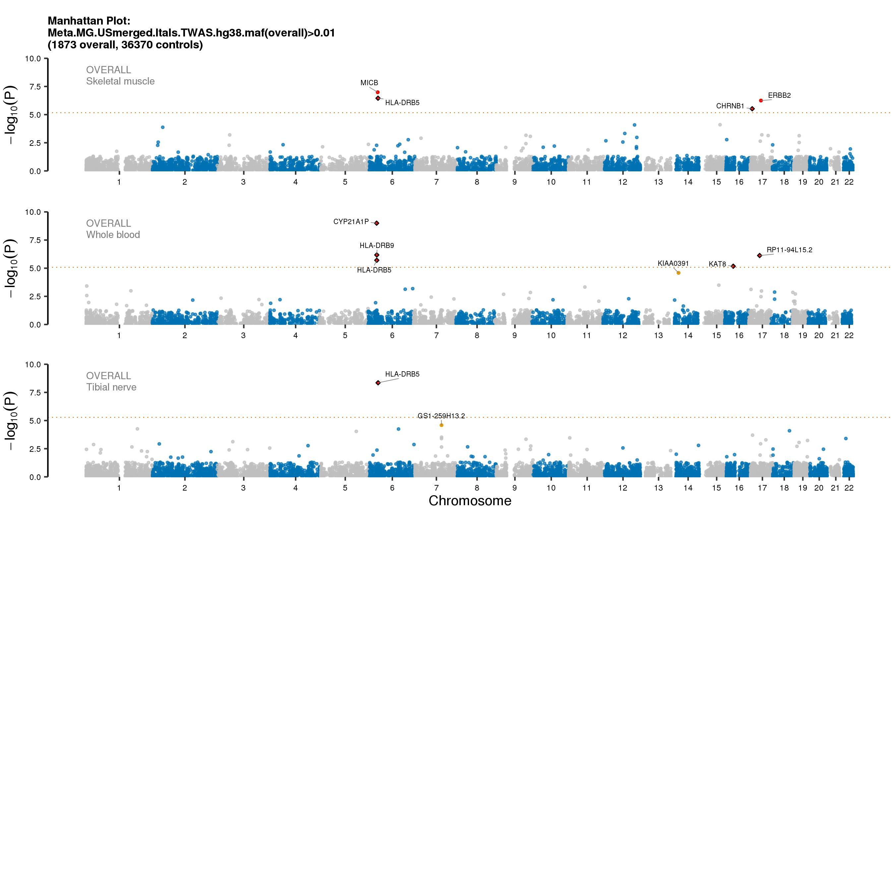

# TWAS MG
# Meta analysed results from USmerged and Itals (imputed hg38)

**Start date:** 03-09-2021

**End date:** 03-09-2021

**Analysed by:** Ruth Chia

**Working directory:** `/data/NDRS_LNG/MyastheniaGravis/updated.April2020/MetaAnalysis.hg38.ByCohort.rerun/TWAS`

___


<h1>Table of Contents<span class="tocSkip"></span></h1>
<div class="toc"><ul class="toc-item"><li><span><a href="#Summary-stats-file-needed" data-toc-modified-id="Summary-stats-file-needed-1">Summary stats file needed</a></span></li><li><span><a href="#What-I-need-to-do" data-toc-modified-id="What-I-need-to-do-2">What I need to do</a></span></li><li><span><a href="#Notes-about-TWAS" data-toc-modified-id="Notes-about-TWAS-3">Notes about TWAS</a></span></li><li><span><a href="#TWAS" data-toc-modified-id="TWAS-4">TWAS</a></span><ul class="toc-item"><li><span><a href="#Prep-file-for-TWAS" data-toc-modified-id="Prep-file-for-TWAS-4.1">Prep file for TWAS</a></span></li><li><span><a href="#Download-and-install-TWAS" data-toc-modified-id="Download-and-install-TWAS-4.2">Download and install TWAS</a></span></li><li><span><a href="#Run-TWAS" data-toc-modified-id="Run-TWAS-4.3">Run TWAS</a></span><ul class="toc-item"><li><span><a href="#merge-twas-results" data-toc-modified-id="merge-twas-results-4.3.1">merge twas results</a></span><ul class="toc-item"><li><span><a href="#Create-top-snps-from-coloc/twas-results" data-toc-modified-id="Create-top-snps-from-coloc/twas-results-4.3.1.1">Create top snps from coloc/twas results</a></span></li><li><span><a href="#Merge-all-top-hits-to-a-single-file-and-filtered-for-COLOC-PP4->-0.9-and/or-PERM.PV-<-0.01" data-toc-modified-id="Merge-all-top-hits-to-a-single-file-and-filtered-for-COLOC-PP4->-0.9-and/or-PERM.PV-<-0.01-4.3.1.2">Merge all top hits to a single file and filtered for <code>COLOC PP4 &gt; 0.9</code> and/or <code>PERM.PV &lt; 0.01</code></a></span></li></ul></li><li><span><a href="#Plot-GWAS/TWAS-mirror-manhattan" data-toc-modified-id="Plot-GWAS/TWAS-mirror-manhattan-4.3.2">Plot GWAS/TWAS mirror manhattan</a></span></li></ul></li><li><span><a href="#replot-just-TWAS-results-for-publication" data-toc-modified-id="replot-just-TWAS-results-for-publication-4.4">replot just TWAS results for publication</a></span></li><li><span><a href="#Generate-TWAS-table-for-paper" data-toc-modified-id="Generate-TWAS-table-for-paper-4.5">Generate TWAS table for paper</a></span></li></ul></li></ul></div>

## Summary stats file needed
1. Meta analysed summ stats: `/data/NDRS_LNG/MyastheniaGravis/updated.April2020/MetaAnalysis.hg38.ByCohort.rerun/USmerged.Itals.hg38/META_MG.USmerged.Itals.UNRELATED.hg38.Rsq03MAF00001.glm_filteredDirection.HetISq80.rsid.txt`
    
## What I need to do
1. Prepare summary stats for TWAS - has to be in a particular format
2. Run TWAS using pre-computed weights from FUSION/TWAS.


## Notes about TWAS
A powerful strategy that integrates gene expression measurements with summary association statistics from large-scale genome-wide association studies (GWAS) to identify genes whose cis-regulated expression is associated with complex traits

## TWAS

link to TWAS: `http://gusevlab.org/projects/fusion/`

        
Must have the following columns:
- SNP – SNP identifier (rsID)
- A1 – first allele (effect allele)
- A2 – second allele (other allele)
- Z – Z-scores, sign with respect to A1

Need to also filter to keep only variants that have maf cases > 0.01

### Prep file for TWAS 

I believe the GTEX datasets are based on hg19 ... at least those that are available from the gusex FUSION/TWAS website.

It requires rsID as input but does not specifically required the positions. So, will keep summ stats in hg38 and use rsids to map to GTEX dataset.


```bash
%%bash
module load R/3.5.2
R --vanilla --no-save

# Load libraries
library(data.table)
library(tidyverse)

# Read in data
data <- fread("/data/NDRS_LNG/MyastheniaGravis/updated.April2020/MetaAnalysis.hg38.ByCohort.rerun/USmerged.Itals.hg38/META_MG.USmerged.Itals.UNRELATED.hg38.Rsq03MAF00001.glm_filteredDirection.HetISq80.rsid.txt",header=T) %>%
        rename(A1=EffectAllele,A2=OtherAllele,SE=StdErr) %>%
        mutate(Z = beta/SE) %>%
        filter(maf_EA > 0.01) %>%
        select(rsID,A1,A2,Z) %>%
        rename(SNP=rsID)        
dim(data)
data1 <- data %>% filter(SNP != is.na(SNP))
dim(data1)
write.table(data1,"META_MG.USmerged.Itals.UNRELATED.hg38.filteredDirection.HetISq80MAFoverall001.forTWAS.txt",sep="\t",quote=F,row.names=F,col.names=T)
```

    
    R version 3.5.2 (2018-12-20) -- "Eggshell Igloo"
    Copyright (C) 2018 The R Foundation for Statistical Computing
    Platform: x86_64-pc-linux-gnu (64-bit)
    
    R is free software and comes with ABSOLUTELY NO WARRANTY.
    You are welcome to redistribute it under certain conditions.
    Type 'license()' or 'licence()' for distribution details.
    
    R is a collaborative project with many contributors.
    Type 'contributors()' for more information and
    'citation()' on how to cite R or R packages in publications.
    
    Type 'demo()' for some demos, 'help()' for on-line help, or
    'help.start()' for an HTML browser interface to help.
    Type 'q()' to quit R.
    
    > 
    > # Load libraries
    > library(data.table)
    > library(tidyverse)
    > 
    > # Read in data
    > data <- fread("/data/NDRS_LNG/MyastheniaGravis/updated.April2020/MetaAnalysis.hg38.ByCohort.rerun/USmerged.Itals.hg38/META_MG.USmerged.Itals.UNRELATED.hg38.Rsq03MAF00001.glm_filteredDirection.HetISq80.rsid.txt",header=T) %>%
    +         rename(A1=EffectAllele,A2=OtherAllele,SE=StdErr) %>%
    +         mutate(Z = beta/SE) %>%
    +         filter(maf_EA > 0.01) %>%
    +         select(rsID,A1,A2,Z) %>%
    +         rename(SNP=rsID)        
    > dim(data)
    [1] 8387157       4
    > data1 <- data %>% filter(SNP != is.na(SNP))
    > dim(data1)
    [1] 8302760       4
    > write.table(data1,"META_MG.USmerged.Itals.UNRELATED.hg38.filteredDirection.HetISq80MAFoverall001.forTWAS.txt",sep="\t",quote=F,row.names=F,col.names=T)
    > 


    [+] Loading gcc  7.3.0  ... 
    [+] Loading GSL 2.4 for GCC 7.2.0 ... 
    [-] Unloading gcc  7.3.0  ... 
    [+] Loading gcc  7.3.0  ... 
    [+] Loading openmpi 3.0.2  for GCC 7.3.0 
    [+] Loading ImageMagick  7.0.8  on cn3147 
    [+] Loading HDF5  1.10.4 
    [+] Loading pandoc  2.13  on cn3147 
    [+] Loading R 3.5.2 
    -- Attaching packages --------------------------------------- tidyverse 1.2.1 --
    v ggplot2 3.3.2     v purrr   0.3.4
    v tibble  3.0.3     v dplyr   0.8.5
    v tidyr   0.8.3     v stringr 1.4.0
    v readr   1.3.1     v forcats 0.5.0
    -- Conflicts ------------------------------------------ tidyverse_conflicts() --
    x dplyr::between()   masks data.table::between()
    x dplyr::filter()    masks stats::filter()
    x dplyr::first()     masks data.table::first()
    x dplyr::lag()       masks stats::lag()
    x dplyr::last()      masks data.table::last()
    x purrr::transpose() masks data.table::transpose()


### Download and install TWAS


```bash
%%bash
wget https://github.com/gusevlab/fusion_twas/archive/master.zip
unzip master.zip
cd fusion_twas-master

# Download and unpack the (1000 Genomes)
wget https://data.broadinstitute.org/alkesgroup/FUSION/LDREF.tar.bz2
tar xjvf LDREF.tar.bz2

# Download and unpack the plink2R library
wget https://github.com/gabraham/plink2R/archive/master.zip
unzip master.zip

mkdir WEIGHTS
cd WEIGHTS
# full list of weights from different tissues from GTEX: 
# `wget http://gusevlab.org/projects/fusion/weights/GTEX7.txt`
wget http://gusevlab.org/projects/fusion/weights/GTEX7.txt

wget http://gusevlab.org/projects/fusion/weights/GTEx.Adipose_Subcutaneous.P01.tar.bz2
wget http://gusevlab.org/projects/fusion/weights/GTEx.Adipose_Visceral_Omentum.P01.tar.bz2
wget http://gusevlab.org/projects/fusion/weights/GTEx.Adrenal_Gland.P01.tar.bz2
wget http://gusevlab.org/projects/fusion/weights/GTEx.Artery_Aorta.P01.tar.bz2
wget http://gusevlab.org/projects/fusion/weights/GTEx.Artery_Coronary.P01.tar.bz2
wget http://gusevlab.org/projects/fusion/weights/GTEx.Artery_Tibial.P01.tar.bz2
wget http://gusevlab.org/projects/fusion/weights/GTEx.Brain_Amygdala.P01.tar.bz2
wget http://gusevlab.org/projects/fusion/weights/GTEx.Brain_Anterior_cingulate_cortex_BA24.P01.tar.bz2
wget http://gusevlab.org/projects/fusion/weights/GTEx.Brain_Caudate_basal_ganglia.P01.tar.bz2
wget http://gusevlab.org/projects/fusion/weights/GTEx.Brain_Cerebellar_Hemisphere.P01.tar.bz2
wget http://gusevlab.org/projects/fusion/weights/GTEx.Brain_Cerebellum.P01.tar.bz2
wget http://gusevlab.org/projects/fusion/weights/GTEx.Brain_Cortex.P01.tar.bz2
wget http://gusevlab.org/projects/fusion/weights/GTEx.Brain_Frontal_Cortex_BA9.P01.tar.bz2
wget http://gusevlab.org/projects/fusion/weights/GTEx.Brain_Hippocampus.P01.tar.bz2
wget http://gusevlab.org/projects/fusion/weights/GTEx.Brain_Hypothalamus.P01.tar.bz2
wget http://gusevlab.org/projects/fusion/weights/GTEx.Brain_Nucleus_accumbens_basal_ganglia.P01.tar.bz2
wget http://gusevlab.org/projects/fusion/weights/GTEx.Brain_Putamen_basal_ganglia.P01.tar.bz2
wget http://gusevlab.org/projects/fusion/weights/GTEx.Brain_Spinal_cord_cervical_c-1.P01.tar.bz2
wget http://gusevlab.org/projects/fusion/weights/GTEx.Brain_Substantia_nigra.P01.tar.bz2
wget http://gusevlab.org/projects/fusion/weights/GTEx.Breast_Mammary_Tissue.P01.tar.bz2
wget http://gusevlab.org/projects/fusion/weights/GTEx.Cells_EBV-transformed_lymphocytes.P01.tar.bz2
wget http://gusevlab.org/projects/fusion/weights/GTEx.Cells_Transformed_fibroblasts.P01.tar.bz2
wget http://gusevlab.org/projects/fusion/weights/GTEx.Colon_Sigmoid.P01.tar.bz2
wget http://gusevlab.org/projects/fusion/weights/GTEx.Colon_Transverse.P01.tar.bz2
wget http://gusevlab.org/projects/fusion/weights/GTEx.Esophagus_Gastroesophageal_Junction.P01.tar.bz2
wget http://gusevlab.org/projects/fusion/weights/GTEx.Esophagus_Mucosa.P01.tar.bz2
wget http://gusevlab.org/projects/fusion/weights/GTEx.Esophagus_Muscularis.P01.tar.bz2
wget http://gusevlab.org/projects/fusion/weights/GTEx.Heart_Atrial_Appendage.P01.tar.bz2
wget http://gusevlab.org/projects/fusion/weights/GTEx.Heart_Left_Ventricle.P01.tar.bz2
wget http://gusevlab.org/projects/fusion/weights/GTEx.Liver.P01.tar.bz2
wget http://gusevlab.org/projects/fusion/weights/GTEx.Lung.P01.tar.bz2
wget http://gusevlab.org/projects/fusion/weights/GTEx.Minor_Salivary_Gland.P01.tar.bz2
wget http://gusevlab.org/projects/fusion/weights/GTEx.Muscle_Skeletal.P01.tar.bz2
wget http://gusevlab.org/projects/fusion/weights/GTEx.Nerve_Tibial.P01.tar.bz2
wget http://gusevlab.org/projects/fusion/weights/GTEx.Ovary.P01.tar.bz2
wget http://gusevlab.org/projects/fusion/weights/GTEx.Pancreas.P01.tar.bz2
wget http://gusevlab.org/projects/fusion/weights/GTEx.Pituitary.P01.tar.bz2
wget http://gusevlab.org/projects/fusion/weights/GTEx.Prostate.P01.tar.bz2
wget http://gusevlab.org/projects/fusion/weights/GTEx.Skin_Not_Sun_Exposed_Suprapubic.P01.tar.bz2
wget http://gusevlab.org/projects/fusion/weights/GTEx.Skin_Sun_Exposed_Lower_leg.P01.tar.bz2
wget http://gusevlab.org/projects/fusion/weights/GTEx.Small_Intestine_Terminal_Ileum.P01.tar.bz2
wget http://gusevlab.org/projects/fusion/weights/GTEx.Spleen.P01.tar.bz2
wget http://gusevlab.org/projects/fusion/weights/GTEx.Stomach.P01.tar.bz2
wget http://gusevlab.org/projects/fusion/weights/GTEx.Testis.P01.tar.bz2
wget http://gusevlab.org/projects/fusion/weights/GTEx.Thyroid.P01.tar.bz2
wget http://gusevlab.org/projects/fusion/weights/GTEx.Uterus.P01.tar.bz2
wget http://gusevlab.org/projects/fusion/weights/GTEx.Vagina.P01.tar.bz2
wget http://gusevlab.org/projects/fusion/weights/GTEx.Whole_Blood.P01.tar.bz2
wget https://data.broadinstitute.org/alkesgroup/FUSION/WGT/NTR.BLOOD.RNAARR.tar.bz2
wget https://data.broadinstitute.org/alkesgroup/FUSION/WGT/YFS.BLOOD.RNAARR.tar.bz2

tar xjf GTEx.Adipose_Subcutaneous.P01.tar.bz2
tar xjf GTEx.Adipose_Visceral_Omentum.P01.tar.bz2
tar xjf GTEx.Adrenal_Gland.P01.tar.bz2
tar xjf GTEx.Artery_Aorta.P01.tar.bz2
tar xjf GTEx.Artery_Coronary.P01.tar.bz2
tar xjf GTEx.Artery_Tibial.P01.tar.bz2
tar xjf GTEx.Brain_Amygdala.P01.tar.bz2
tar xjf GTEx.Brain_Anterior_cingulate_cortex_BA24.P01.tar.bz2
tar xjf GTEx.Brain_Caudate_basal_ganglia.P01.tar.bz2
tar xjf GTEx.Brain_Cerebellar_Hemisphere.P01.tar.bz2
tar xjf GTEx.Brain_Cerebellum.P01.tar.bz2
tar xjf GTEx.Brain_Cortex.P01.tar.bz2
tar xjf GTEx.Brain_Frontal_Cortex_BA9.P01.tar.bz2
tar xjf GTEx.Brain_Hippocampus.P01.tar.bz2
tar xjf GTEx.Brain_Hypothalamus.P01.tar.bz2
tar xjf GTEx.Brain_Nucleus_accumbens_basal_ganglia.P01.tar.bz2
tar xjf GTEx.Brain_Putamen_basal_ganglia.P01.tar.bz2
tar xjf GTEx.Brain_Spinal_cord_cervical_c-1.P01.tar.bz2
tar xjf GTEx.Brain_Substantia_nigra.P01.tar.bz2
tar xjf GTEx.Breast_Mammary_Tissue.P01.tar.bz2
tar xjf GTEx.Cells_EBV-transformed_lymphocytes.P01.tar.bz2
tar xjf GTEx.Cells_Transformed_fibroblasts.P01.tar.bz2
tar xjf GTEx.Colon_Sigmoid.P01.tar.bz2
tar xjf GTEx.Colon_Transverse.P01.tar.bz2
tar xjf GTEx.Esophagus_Gastroesophageal_Junction.P01.tar.bz2
tar xjf GTEx.Esophagus_Mucosa.P01.tar.bz2
tar xjf GTEx.Esophagus_Muscularis.P01.tar.bz2
tar xjf GTEx.Heart_Atrial_Appendage.P01.tar.bz2
tar xjf GTEx.Heart_Left_Ventricle.P01.tar.bz2
tar xjf GTEx.Liver.P01.tar.bz2
tar xjf GTEx.Lung.P01.tar.bz2
tar xjf GTEx.Minor_Salivary_Gland.P01.tar.bz2
tar xjf GTEx.Muscle_Skeletal.P01.tar.bz2
tar xjf GTEx.Nerve_Tibial.P01.tar.bz2
tar xjf GTEx.Ovary.P01.tar.bz2
tar xjf GTEx.Pancreas.P01.tar.bz2
tar xjf GTEx.Pituitary.P01.tar.bz2
tar xjf GTEx.Prostate.P01.tar.bz2
tar xjf GTEx.Skin_Not_Sun_Exposed_Suprapubic.P01.tar.bz2
tar xjf GTEx.Skin_Sun_Exposed_Lower_leg.P01.tar.bz2
tar xjf GTEx.Small_Intestine_Terminal_Ileum.P01.tar.bz2
tar xjf GTEx.Spleen.P01.tar.bz2
tar xjf GTEx.Stomach.P01.tar.bz2
tar xjf GTEx.Testis.P01.tar.bz2
tar xjf GTEx.Thyroid.P01.tar.bz2
tar xjf GTEx.Uterus.P01.tar.bz2
tar xjf GTEx.Vagina.P01.tar.bz2
tar xjf GTEx.Whole_Blood.P01.tar.bz2
tar xjf NTR.BLOOD.RNAARR.tar.bz2
tar xjf YFS.BLOOD.RNAARR.tar.bz2
```

    Archive:  master.zip
    06288921f2e6825fac4c9403842a12129ae504f8
       creating: fusion_twas-master/
      inflating: fusion_twas-master/FUSION.assoc_test.R  
      inflating: fusion_twas-master/FUSION.compute_weights.R  
      inflating: fusion_twas-master/FUSION.post_process.R  
      inflating: fusion_twas-master/LICENSE  
      inflating: fusion_twas-master/README.md  
       creating: fusion_twas-master/examples/
      inflating: fusion_twas-master/examples/GEUV.compute_weights.sh  
      inflating: fusion_twas-master/examples/GTEX_v7.sh  
      inflating: fusion_twas-master/gcta_nr_robust  
      inflating: fusion_twas-master/glist-hg19  
       creating: fusion_twas-master/utils/
      inflating: fusion_twas-master/utils/FUSION.profile_wgt.R  
      inflating: fusion_twas-master/utils/make_score.R  
    LDREF/
    LDREF/1000G.EUR.1.bim
    LDREF/1000G.EUR.10.bed
    LDREF/1000G.EUR.16.bed
    LDREF/1000G.EUR.1.fam
    LDREF/1000G.EUR.9.bim
    LDREF/1000G.EUR.12.bim
    LDREF/1000G.EUR.17.bed
    LDREF/1000G.EUR.5.fam
    LDREF/1000G.EUR.3.bim
    LDREF/1000G.EUR.18.fam
    LDREF/1000G.EUR.21.fam
    LDREF/1000G.EUR.13.bed
    LDREF/1000G.EUR.16.fam
    LDREF/1000G.EUR.22.bed
    LDREF/1000G.EUR.9.fam
    LDREF/1000G.EUR.19.bim
    LDREF/1000G.EUR.13.bim
    LDREF/1000G.EUR.12.fam
    LDREF/1000G.EUR.14.fam
    LDREF/1000G.EUR.11.fam
    LDREF/1000G.EUR.22.fam
    LDREF/1000G.EUR.11.bim
    LDREF/1000G.EUR.17.fam
    LDREF/1000G.EUR.10.bim
    LDREF/1000G.EUR.13.fam
    LDREF/1000G.EUR.21.bed
    LDREF/1000G.EUR.18.bim
    LDREF/1000G.EUR.15.fam
    LDREF/1000G.EUR.12.bed
    LDREF/1000G.EUR.21.bim
    LDREF/1000G.EUR.18.bed
    LDREF/1000G.EUR.7.bed
    LDREF/1000G.EUR.7.fam
    LDREF/1000G.EUR.19.bed
    LDREF/1000G.EUR.4.bed
    LDREF/1000G.EUR.4.fam
    LDREF/1000G.EUR.17.bim
    LDREF/1000G.EUR.14.bim
    LDREF/1000G.EUR.8.fam
    LDREF/1000G.EUR.10.fam
    LDREF/1000G.EUR.5.bim
    LDREF/1000G.EUR.3.fam
    LDREF/1000G.EUR.7.bim
    LDREF/1000G.EUR.11.bed
    LDREF/1000G.EUR.6.bed
    LDREF/1000G.EUR.20.fam
    LDREF/1000G.EUR.2.bed
    LDREF/1000G.EUR.4.bim
    LDREF/1000G.EUR.15.bed
    LDREF/1000G.EUR.19.fam
    LDREF/1000G.EUR.20.bim
    LDREF/1000G.EUR.2.fam
    LDREF/1000G.EUR.15.bim
    LDREF/1000G.EUR.2.bim
    LDREF/1000G.EUR.6.bim
    LDREF/1000G.EUR.3.bed
    LDREF/1000G.EUR.8.bed
    LDREF/1000G.EUR.16.bim
    LDREF/1000G.EUR.5.bed
    LDREF/1000G.EUR.20.bed
    LDREF/1000G.EUR.6.fam
    LDREF/1000G.EUR.14.bed
    LDREF/1000G.EUR.9.bed
    LDREF/1000G.EUR.1.bed
    LDREF/1000G.EUR.22.bim
    LDREF/1000G.EUR.8.bim
    Archive:  master.zip
    d74be015e8f54d662b96c6c2a52a614746f9030d
       creating: plink2R-master/
     extracting: plink2R-master/.gitignore  
      inflating: plink2R-master/README.md  
      inflating: plink2R-master/data.bed  
      inflating: plink2R-master/data.bim  
      inflating: plink2R-master/data.fam  
      inflating: plink2R-master/plink2R.R  
       creating: plink2R-master/plink2R/
      inflating: plink2R-master/plink2R/DESCRIPTION  
     extracting: plink2R-master/plink2R/NAMESPACE  
       creating: plink2R-master/plink2R/R/
      inflating: plink2R-master/plink2R/R/plink2R.R  
       creating: plink2R-master/plink2R/man/
      inflating: plink2R-master/plink2R/man/plink2R-package.Rd  
       creating: plink2R-master/plink2R/src/
      inflating: plink2R-master/plink2R/src/Makevars  
      inflating: plink2R-master/plink2R/src/Makevars.win  
      inflating: plink2R-master/plink2R/src/data.cpp  
      inflating: plink2R-master/plink2R/src/data.hpp  
      inflating: plink2R-master/plink2R/src/plink2R.cpp  
      inflating: plink2R-master/plink2R/src/plink2R.h  


    IOPub data rate exceeded.
    The notebook server will temporarily stop sending output
    to the client in order to avoid crashing it.
    To change this limit, set the config variable
    `--NotebookApp.iopub_data_rate_limit`.
    
    Current values:
    NotebookApp.iopub_data_rate_limit=1000000.0 (bytes/sec)
    NotebookApp.rate_limit_window=3.0 (secs)
    


### Run TWAS

with permutation and COLOC options


```bash
%%bash
# edit `YFS.BLOOD.RNAARR.pos` and `NTR.BLOOD.RNAARR.pos` to include panel name and N for coloc analysis
module load R/3.5.2
R --vanilla --no-save

# Load libraries
require(data.table)
require(tidyverse)

# Read in data
data <- fread("fusion_twas-master/WEIGHTS/NTR.BLOOD.RNAARR.pos",header=T) %>%
        mutate(PANEL = "NTR.BLOOD.RNAARR", N="1247") %>% 
        select(PANEL,WGT,ID,CHR,P0,P1,N)
write.table(data,"fusion_twas-master/WEIGHTS/NTR.BLOOD.RNAARR.pos",sep="\t",quote=F,row.names=F,col.names=T)

data <- fread("fusion_twas-master/WEIGHTS/YFS.BLOOD.RNAARR.pos",header=T) %>%
        mutate(PANEL = "YFS.BLOOD.RNAARR", N="1264") %>% 
        select(PANEL,WGT,ID,CHR,P0,P1,N)
write.table(data,"fusion_twas-master/WEIGHTS/YFS.BLOOD.RNAARR.pos",sep="\t",quote=F,row.names=F,col.names=T)
    
```

    
    R version 3.5.2 (2018-12-20) -- "Eggshell Igloo"
    Copyright (C) 2018 The R Foundation for Statistical Computing
    Platform: x86_64-pc-linux-gnu (64-bit)
    
    R is free software and comes with ABSOLUTELY NO WARRANTY.
    You are welcome to redistribute it under certain conditions.
    Type 'license()' or 'licence()' for distribution details.
    
    R is a collaborative project with many contributors.
    Type 'contributors()' for more information and
    'citation()' on how to cite R or R packages in publications.
    
    Type 'demo()' for some demos, 'help()' for on-line help, or
    'help.start()' for an HTML browser interface to help.
    Type 'q()' to quit R.
    
    > 
    > # Load libraries
    > require(data.table)
    > require(tidyverse)
    > 
    > # Read in data
    > data <- fread("fusion_twas-master/WEIGHTS/NTR.BLOOD.RNAARR.pos",header=T) %>%
    +         mutate(PANEL = "NTR.BLOOD.RNAARR", N="1247") %>% 
    +         select(PANEL,WGT,ID,CHR,P0,P1,N)
    > write.table(data,"fusion_twas-master/WEIGHTS/NTR.BLOOD.RNAARR.pos",sep="\t",quote=F,row.names=F,col.names=T)
    > 
    > data <- fread("fusion_twas-master/WEIGHTS/YFS.BLOOD.RNAARR.pos",header=T) %>%
    +         mutate(PANEL = "YFS.BLOOD.RNAARR", N="1264") %>% 
    +         select(PANEL,WGT,ID,CHR,P0,P1,N)
    > write.table(data,"fusion_twas-master/WEIGHTS/YFS.BLOOD.RNAARR.pos",sep="\t",quote=F,row.names=F,col.names=T)
    >     
    > 


    [-] Unloading gcc  9.2.0  ... 
    [-] Unloading GSL 2.6 for GCC 9.2.0 ... 
    [-] Unloading openmpi 3.1.4  for GCC 9.2.0 
    [-] Unloading ImageMagick  7.0.8  on cn4263 
    [-] Unloading HDF5  1.10.4 
    [-] Unloading NetCDF 4.7.4_gcc9.2.0 
    [-] Unloading pandoc  2.11.4  on cn4263 
    [-] Unloading pcre2 10.21  ... 
    [-] Unloading R 4.0.3 
    [+] Loading gcc  7.3.0  ... 
    [+] Loading GSL 2.4 for GCC 7.2.0 ... 
    [-] Unloading gcc  7.3.0  ... 
    [+] Loading gcc  7.3.0  ... 
    [+] Loading openmpi 3.0.2  for GCC 7.3.0 
    [+] Loading ImageMagick  7.0.8  on cn4263 
    [+] Loading HDF5  1.10.4 
    [+] Loading pandoc  2.11.4  on cn4263 
    [+] Loading R 3.5.2 
    
    The following have been reloaded with a version change:
      1) GSL/2.6_gcc-9.2.0 => GSL/2.4_gcc-7.2.0     3) gcc/9.2.0 => gcc/7.3.0
      2) R/4.0 => R/3.5.2
    
    Loading required package: data.table
    Loading required package: tidyverse
    -- Attaching packages --------------------------------------- tidyverse 1.2.1 --
    v ggplot2 3.3.2     v purrr   0.3.4
    v tibble  3.0.3     v dplyr   0.8.5
    v tidyr   0.8.3     v stringr 1.4.0
    v readr   1.3.1     v forcats 0.5.0
    -- Conflicts ------------------------------------------ tidyverse_conflicts() --
    x dplyr::between()   masks data.table::between()
    x dplyr::filter()    masks stats::filter()
    x dplyr::first()     masks data.table::first()
    x dplyr::lag()       masks stats::lag()
    x dplyr::last()      masks data.table::last()
    x purrr::transpose() masks data.table::transpose()


```bash
%%bash
module load R/3.5.2

cat fusion_twas-master/WEIGHTS/weightsFileNames.txt  | while read line
  do for CHNUM in {1..10}
        do
        echo "Rscript fusion_twas-master/FUSION.assoc_test.R \
        --sumstats META_MG.USmerged.Itals.UNRELATED.hg38.filteredDirection.HetISq80MAFoverall001.forTWAS.txt \
        --weights fusion_twas-master/WEIGHTS/$line \
        --weights_dir fusion_twas-master/WEIGHTS/ \
        --ref_ld_chr fusion_twas-master/LDREF/1000G.EUR. \
        --perm 100000 \
        --coloc_P 0.0001 \
        --GWASN 38243 \
        --PANELN fusion_twas-master/WEIGHTS/$line \
        --chr $CHNUM \
        --out META_MG.USmerged.Itals.UNRELATED.hg38.filteredDirection.HetISq80MAFoverall001.GTEx.$line.$CHNUM.coloc.dat" >> twas.gtex.perm.coloc1.overall.swarm
  done
done

cat fusion_twas-master/WEIGHTS/weightsFileNames.txt  | while read line
  do for CHNUM in {11..22}
        do
        echo "Rscript fusion_twas-master/FUSION.assoc_test.R \
        --sumstats META_MG.USmerged.Itals.UNRELATED.hg38.filteredDirection.HetISq80MAFoverall001.forTWAS.txt \
        --weights fusion_twas-master/WEIGHTS/$line \
        --weights_dir fusion_twas-master/WEIGHTS/ \
        --ref_ld_chr fusion_twas-master/LDREF/1000G.EUR. \
        --perm 100000 \
        --coloc_P 0.0001 \
        --GWASN 38243 \
        --PANELN fusion_twas-master/WEIGHTS/$line \
        --chr $CHNUM \
        --out META_MG.USmerged.Itals.UNRELATED.hg38.filteredDirection.HetISq80MAFoverall001.GTEx.$line.$CHNUM.coloc.dat" >> twas.gtex.perm.coloc2.overall.swarm
  done
done
```

    [+] Loading gcc  7.3.0  ... 
    [+] Loading GSL 2.4 for GCC 7.2.0 ... 
    [-] Unloading gcc  7.3.0  ... 
    [+] Loading gcc  7.3.0  ... 
    [+] Loading openmpi 3.0.2  for GCC 7.3.0 
    [+] Loading ImageMagick  7.0.8  on cn3147 
    [+] Loading HDF5  1.10.4 
    [+] Loading pandoc  2.13  on cn3147 
    [+] Loading R 3.5.2 


```bash
%%bash
swarm --file twas.gtex.perm.coloc1.overall.swarm --logdir swarmOE_TWAS -g 120 --time 00:20:00 -p 2 --module R/3.5.2
swarm --file twas.gtex.perm.coloc2.overall.swarm --logdir swarmOE_TWAS -g 120 --time 00:20:00 -p 2 --module R/3.5.2
```

    12162193
    12162194


#### merge twas results


```bash
%%bash
head -n 1 META_MG.USmerged.Itals.UNRELATED.hg38.filteredDirection.HetISq80MAFoverall001.GTEx.Whole_Blood.P01.pos.1.coloc.dat > header.txt

cat fusion_twas-master/WEIGHTS/weightsFileNames.txt  | while read line
do
cat header.txt > temp.$line
cat META_MG.USmerged.Itals.UNRELATED.hg38.filteredDirection.HetISq80MAFoverall001.GTEx.$line.*.coloc.dat* | grep -v "PANEL" >> temp.$line
grep -v "==> META_MG." temp.$line > META_MG.USmerged.Itals.UNRELATED.hg38.filteredDirection.HetISq80MAFoverall001.GTEx.$line.all.coloc.dat
rm temp.$line
done
```


```bash
%%bash
# Remove intermediate files from code block above
cat fusion_twas-master/WEIGHTS/weightsFileNames.txt  | while read line
do
rm META_MG.USmerged.Itals.UNRELATED.hg38.filteredDirection.HetISq80MAFoverall001.GTEx.$line.[0-9].coloc.dat*
rm META_MG.USmerged.Itals.UNRELATED.hg38.filteredDirection.HetISq80MAFoverall001.GTEx.$line.[0-9][0-9].coloc.dat*
done
```

##### Create top snps from coloc/twas results

signifcance threshold is define as `0.05/number of genes in GTEX dataset`


```bash
%%bash

cat fusion_twas-master/WEIGHTS/weightsFileNames.txt | while read line
do
tail -n +2 META_MG.USmerged.Itals.UNRELATED.hg38.filteredDirection.HetISq80MAFoverall001.GTEx.$line.all.coloc.dat | wc -l >> NumGenes.perDataset.hg38.txt
done

cat NumGenes.perDataset.hg38.txt
```

    8192
    6173
    4520
    6462
    3247
    8223
    1836
    2709
    3660
    4407
    5854
    4011
    3143
    2294
    2314
    3239
    2817
    2005
    1603
    5043
    2757
    7352
    4873
    5315
    4887
    8060
    7772
    5670
    5081
    2913
    7775
    1821
    7408
    9656
    2808
    5093
    4401
    2796
    7457
    8878
    2878
    4496
    4455
    9252
    9825
    2134
    2012
    6006
    2454
    4700


```bash
%%bash
cat fusion_twas-master/WEIGHTS/weightsFileNames.txt > DatasetNames.txt
echo "Names of datasets with number of genes:"
paste DatasetNames.txt NumGenes.perDataset.hg38.txt -d "\t" | cat -n | column -t
```

    Names of datasets with number of genes:
    1   Adipose_Subcutaneous.P01.pos                   8192
    2   Adipose_Visceral_Omentum.P01.pos               6173
    3   Adrenal_Gland.P01.pos                          4520
    4   Artery_Aorta.P01.pos                           6462
    5   Artery_Coronary.P01.pos                        3247
    6   Artery_Tibial.P01.pos                          8223
    7   Brain_Amygdala.P01.pos                         1836
    8   Brain_Anterior_cingulate_cortex_BA24.P01.pos   2709
    9   Brain_Caudate_basal_ganglia.P01.pos            3660
    10  Brain_Cerebellar_Hemisphere.P01.pos            4407
    11  Brain_Cerebellum.P01.pos                       5854
    12  Brain_Cortex.P01.pos                           4011
    13  Brain_Frontal_Cortex_BA9.P01.pos               3143
    14  Brain_Hippocampus.P01.pos                      2294
    15  Brain_Hypothalamus.P01.pos                     2314
    16  Brain_Nucleus_accumbens_basal_ganglia.P01.pos  3239
    17  Brain_Putamen_basal_ganglia.P01.pos            2817
    18  Brain_Spinal_cord_cervical_c-1.P01.pos         2005
    19  Brain_Substantia_nigra.P01.pos                 1603
    20  Breast_Mammary_Tissue.P01.pos                  5043
    21  Cells_EBV-transformed_lymphocytes.P01.pos      2757
    22  Cells_Transformed_fibroblasts.P01.pos          7352
    23  Colon_Sigmoid.P01.pos                          4873
    24  Colon_Transverse.P01.pos                       5315
    25  Esophagus_Gastroesophageal_Junction.P01.pos    4887
    26  Esophagus_Mucosa.P01.pos                       8060
    27  Esophagus_Muscularis.P01.pos                   7772
    28  Heart_Atrial_Appendage.P01.pos                 5670
    29  Heart_Left_Ventricle.P01.pos                   5081
    30  Liver.P01.pos                                  2913
    31  Lung.P01.pos                                   7775
    32  Minor_Salivary_Gland.P01.pos                   1821
    33  Muscle_Skeletal.P01.pos                        7408
    34  Nerve_Tibial.P01.pos                           9656
    35  Ovary.P01.pos                                  2808
    36  Pancreas.P01.pos                               5093
    37  Pituitary.P01.pos                              4401
    38  Prostate.P01.pos                               2796
    39  Skin_Not_Sun_Exposed_Suprapubic.P01.pos        7457
    40  Skin_Sun_Exposed_Lower_leg.P01.pos             8878
    41  Small_Intestine_Terminal_Ileum.P01.pos         2878
    42  Spleen.P01.pos                                 4496
    43  Stomach.P01.pos                                4455
    44  Testis.P01.pos                                 9252
    45  Thyroid.P01.pos                                9825
    46  Uterus.P01.pos                                 2134
    47  Vagina.P01.pos                                 2012
    48  Whole_Blood.P01.pos                            6006
    49  NTR.BLOOD.RNAARR.pos                           2454
    50  YFS.BLOOD.RNAARR.pos                           4700


```bash
%%bash
cat META_MG.USmerged.Itals.UNRELATED.hg38.filteredDirection.HetISq80MAFoverall001.GTEx.Adipose_Subcutaneous.P01.pos.all.coloc.dat | awk 'NR == 1 || $20 < 0.05/8192' > META_MG.USmerged.Itals.UNRELATED.hg38.filteredDirection.HetISq80MAFoverall001.GTEx.Adipose_Subcutaneous.P01.pos.coloc.topSummStats
cat META_MG.USmerged.Itals.UNRELATED.hg38.filteredDirection.HetISq80MAFoverall001.GTEx.Adipose_Visceral_Omentum.P01.pos.all.coloc.dat | awk 'NR == 1 || $20 < 0.05/6173' > META_MG.USmerged.Itals.UNRELATED.hg38.filteredDirection.HetISq80MAFoverall001.GTEx.Adipose_Visceral_Omentum.P01.pos.coloc.topSummStats
cat META_MG.USmerged.Itals.UNRELATED.hg38.filteredDirection.HetISq80MAFoverall001.GTEx.Adrenal_Gland.P01.pos.all.coloc.dat | awk 'NR == 1 || $20 < 0.05/4520' > META_MG.USmerged.Itals.UNRELATED.hg38.filteredDirection.HetISq80MAFoverall001.GTEx.Adrenal_Gland.P01.pos.coloc.topSummStats
cat META_MG.USmerged.Itals.UNRELATED.hg38.filteredDirection.HetISq80MAFoverall001.GTEx.Artery_Aorta.P01.pos.all.coloc.dat | awk 'NR == 1 || $20 < 0.05/6462' > META_MG.USmerged.Itals.UNRELATED.hg38.filteredDirection.HetISq80MAFoverall001.GTEx.Artery_Aorta.P01.pos.coloc.topSummStats
cat META_MG.USmerged.Itals.UNRELATED.hg38.filteredDirection.HetISq80MAFoverall001.GTEx.Artery_Coronary.P01.pos.all.coloc.dat | awk 'NR == 1 || $20 < 0.05/3247' > META_MG.USmerged.Itals.UNRELATED.hg38.filteredDirection.HetISq80MAFoverall001.GTEx.Artery_Coronary.P01.pos.coloc.topSummStats
cat META_MG.USmerged.Itals.UNRELATED.hg38.filteredDirection.HetISq80MAFoverall001.GTEx.Artery_Tibial.P01.pos.all.coloc.dat | awk 'NR == 1 || $20 < 0.05/8223' > META_MG.USmerged.Itals.UNRELATED.hg38.filteredDirection.HetISq80MAFoverall001.GTEx.Artery_Tibial.P01.pos.coloc.topSummStats
cat META_MG.USmerged.Itals.UNRELATED.hg38.filteredDirection.HetISq80MAFoverall001.GTEx.Brain_Amygdala.P01.pos.all.coloc.dat | awk 'NR == 1 || $20 < 0.05/1836' > META_MG.USmerged.Itals.UNRELATED.hg38.filteredDirection.HetISq80MAFoverall001.GTEx.Brain_Amygdala.P01.pos.coloc.topSummStats
cat META_MG.USmerged.Itals.UNRELATED.hg38.filteredDirection.HetISq80MAFoverall001.GTEx.Brain_Anterior_cingulate_cortex_BA24.P01.pos.all.coloc.dat | awk 'NR == 1 || $20 < 0.05/2709' > META_MG.USmerged.Itals.UNRELATED.hg38.filteredDirection.HetISq80MAFoverall001.GTEx.Brain_Anterior_cingulate_cortex_BA24.P01.pos.coloc.topSummStats
cat META_MG.USmerged.Itals.UNRELATED.hg38.filteredDirection.HetISq80MAFoverall001.GTEx.Brain_Caudate_basal_ganglia.P01.pos.all.coloc.dat | awk 'NR == 1 || $20 < 0.05/3660' > META_MG.USmerged.Itals.UNRELATED.hg38.filteredDirection.HetISq80MAFoverall001.GTEx.Brain_Caudate_basal_ganglia.P01.pos.coloc.topSummStats
cat META_MG.USmerged.Itals.UNRELATED.hg38.filteredDirection.HetISq80MAFoverall001.GTEx.Brain_Cerebellar_Hemisphere.P01.pos.all.coloc.dat | awk 'NR == 1 || $20 < 0.05/4407' > META_MG.USmerged.Itals.UNRELATED.hg38.filteredDirection.HetISq80MAFoverall001.GTEx.Brain_Cerebellar_Hemisphere.P01.pos.coloc.topSummStats
cat META_MG.USmerged.Itals.UNRELATED.hg38.filteredDirection.HetISq80MAFoverall001.GTEx.Brain_Cerebellum.P01.pos.all.coloc.dat | awk 'NR == 1 || $20 < 0.05/5854' > META_MG.USmerged.Itals.UNRELATED.hg38.filteredDirection.HetISq80MAFoverall001.GTEx.Brain_Cerebellum.P01.pos.coloc.topSummStats
cat META_MG.USmerged.Itals.UNRELATED.hg38.filteredDirection.HetISq80MAFoverall001.GTEx.Brain_Cortex.P01.pos.all.coloc.dat | awk 'NR == 1 || $20 < 0.05/4011' > META_MG.USmerged.Itals.UNRELATED.hg38.filteredDirection.HetISq80MAFoverall001.GTEx.Brain_Cortex.P01.pos.coloc.topSummStats
cat META_MG.USmerged.Itals.UNRELATED.hg38.filteredDirection.HetISq80MAFoverall001.GTEx.Brain_Frontal_Cortex_BA9.P01.pos.all.coloc.dat | awk 'NR == 1 || $20 < 0.05/3143' > META_MG.USmerged.Itals.UNRELATED.hg38.filteredDirection.HetISq80MAFoverall001.GTEx.Brain_Frontal_Cortex_BA9.P01.pos.coloc.topSummStats
cat META_MG.USmerged.Itals.UNRELATED.hg38.filteredDirection.HetISq80MAFoverall001.GTEx.Brain_Hippocampus.P01.pos.all.coloc.dat | awk 'NR == 1 || $20 < 0.05/2294' > META_MG.USmerged.Itals.UNRELATED.hg38.filteredDirection.HetISq80MAFoverall001.GTEx.Brain_Hippocampus.P01.pos.coloc.topSummStats
cat META_MG.USmerged.Itals.UNRELATED.hg38.filteredDirection.HetISq80MAFoverall001.GTEx.Brain_Hypothalamus.P01.pos.all.coloc.dat | awk 'NR == 1 || $20 < 0.05/2314' > META_MG.USmerged.Itals.UNRELATED.hg38.filteredDirection.HetISq80MAFoverall001.GTEx.Brain_Hypothalamus.P01.pos.coloc.topSummStats
cat META_MG.USmerged.Itals.UNRELATED.hg38.filteredDirection.HetISq80MAFoverall001.GTEx.Brain_Nucleus_accumbens_basal_ganglia.P01.pos.all.coloc.dat | awk 'NR == 1 || $20 < 0.05/3239' > META_MG.USmerged.Itals.UNRELATED.hg38.filteredDirection.HetISq80MAFoverall001.GTEx.Brain_Nucleus_accumbens_basal_ganglia.P01.pos.coloc.topSummStats
cat META_MG.USmerged.Itals.UNRELATED.hg38.filteredDirection.HetISq80MAFoverall001.GTEx.Brain_Putamen_basal_ganglia.P01.pos.all.coloc.dat | awk 'NR == 1 || $20 < 0.05/2817' > META_MG.USmerged.Itals.UNRELATED.hg38.filteredDirection.HetISq80MAFoverall001.GTEx.Brain_Putamen_basal_ganglia.P01.pos.coloc.topSummStats
cat META_MG.USmerged.Itals.UNRELATED.hg38.filteredDirection.HetISq80MAFoverall001.GTEx.Brain_Spinal_cord_cervical_c-1.P01.pos.all.coloc.dat | awk 'NR == 1 || $20 < 0.05/2005' > META_MG.USmerged.Itals.UNRELATED.hg38.filteredDirection.HetISq80MAFoverall001.GTEx.Brain_Spinal_cord_cervical_c-1.P01.pos.coloc.topSummStats
cat META_MG.USmerged.Itals.UNRELATED.hg38.filteredDirection.HetISq80MAFoverall001.GTEx.Brain_Substantia_nigra.P01.pos.all.coloc.dat | awk 'NR == 1 || $20 < 0.05/1603' > META_MG.USmerged.Itals.UNRELATED.hg38.filteredDirection.HetISq80MAFoverall001.GTEx.Brain_Substantia_nigra.P01.pos.coloc.topSummStats
cat META_MG.USmerged.Itals.UNRELATED.hg38.filteredDirection.HetISq80MAFoverall001.GTEx.Breast_Mammary_Tissue.P01.pos.all.coloc.dat | awk 'NR == 1 || $20 < 0.05/8043' > META_MG.USmerged.Itals.UNRELATED.hg38.filteredDirection.HetISq80MAFoverall001.GTEx.Breast_Mammary_Tissue.P01.pos.coloc.topSummStats
cat META_MG.USmerged.Itals.UNRELATED.hg38.filteredDirection.HetISq80MAFoverall001.GTEx.Cells_EBV-transformed_lymphocytes.P01.pos.all.coloc.dat | awk 'NR == 1 || $20 < 0.05/2757' > META_MG.USmerged.Itals.UNRELATED.hg38.filteredDirection.HetISq80MAFoverall001.GTEx.Cells_EBV-transformed_lymphocytes.P01.pos.coloc.topSummStats
cat META_MG.USmerged.Itals.UNRELATED.hg38.filteredDirection.HetISq80MAFoverall001.GTEx.Cells_Transformed_fibroblasts.P01.pos.all.coloc.dat | awk 'NR == 1 || $20 < 0.05/7352' > META_MG.USmerged.Itals.UNRELATED.hg38.filteredDirection.HetISq80MAFoverall001.GTEx.Cells_Transformed_fibroblasts.P01.pos.coloc.topSummStats
cat META_MG.USmerged.Itals.UNRELATED.hg38.filteredDirection.HetISq80MAFoverall001.GTEx.Colon_Sigmoid.P01.pos.all.coloc.dat | awk 'NR == 1 || $20 < 0.05/4873' > META_MG.USmerged.Itals.UNRELATED.hg38.filteredDirection.HetISq80MAFoverall001.GTEx.Colon_Sigmoid.P01.pos.coloc.topSummStats
cat META_MG.USmerged.Itals.UNRELATED.hg38.filteredDirection.HetISq80MAFoverall001.GTEx.Colon_Transverse.P01.pos.all.coloc.dat | awk 'NR == 1 || $20 < 0.05/5315' > META_MG.USmerged.Itals.UNRELATED.hg38.filteredDirection.HetISq80MAFoverall001.GTEx.Colon_Transverse.P01.pos.coloc.topSummStats
cat META_MG.USmerged.Itals.UNRELATED.hg38.filteredDirection.HetISq80MAFoverall001.GTEx.Esophagus_Gastroesophageal_Junction.P01.pos.all.coloc.dat | awk 'NR == 1 || $20 < 0.05/4887' > META_MG.USmerged.Itals.UNRELATED.hg38.filteredDirection.HetISq80MAFoverall001.GTEx.Esophagus_Gastroesophageal_Junction.P01.pos.coloc.topSummStats
cat META_MG.USmerged.Itals.UNRELATED.hg38.filteredDirection.HetISq80MAFoverall001.GTEx.Esophagus_Mucosa.P01.pos.all.coloc.dat | awk 'NR == 1 || $20 < 0.05/8060' > META_MG.USmerged.Itals.UNRELATED.hg38.filteredDirection.HetISq80MAFoverall001.GTEx.Esophagus_Mucosa.P01.pos.coloc.topSummStats
cat META_MG.USmerged.Itals.UNRELATED.hg38.filteredDirection.HetISq80MAFoverall001.GTEx.Esophagus_Muscularis.P01.pos.all.coloc.dat | awk 'NR == 1 || $20 < 0.05/7772' > META_MG.USmerged.Itals.UNRELATED.hg38.filteredDirection.HetISq80MAFoverall001.GTEx.Esophagus_Muscularis.P01.pos.coloc.topSummStats
cat META_MG.USmerged.Itals.UNRELATED.hg38.filteredDirection.HetISq80MAFoverall001.GTEx.Heart_Atrial_Appendage.P01.pos.all.coloc.dat | awk 'NR == 1 || $20 < 0.05/5670' > META_MG.USmerged.Itals.UNRELATED.hg38.filteredDirection.HetISq80MAFoverall001.GTEx.Heart_Atrial_Appendage.P01.pos.coloc.topSummStats
cat META_MG.USmerged.Itals.UNRELATED.hg38.filteredDirection.HetISq80MAFoverall001.GTEx.Heart_Left_Ventricle.P01.pos.all.coloc.dat | awk 'NR == 1 || $20 < 0.05/8081' > META_MG.USmerged.Itals.UNRELATED.hg38.filteredDirection.HetISq80MAFoverall001.GTEx.Heart_Left_Ventricle.P01.pos.coloc.topSummStats
cat META_MG.USmerged.Itals.UNRELATED.hg38.filteredDirection.HetISq80MAFoverall001.GTEx.Liver.P01.pos.all.coloc.dat | awk 'NR == 1 || $20 < 0.05/2913' > META_MG.USmerged.Itals.UNRELATED.hg38.filteredDirection.HetISq80MAFoverall001.GTEx.Liver.P01.pos.coloc.topSummStats
cat META_MG.USmerged.Itals.UNRELATED.hg38.filteredDirection.HetISq80MAFoverall001.GTEx.Lung.P01.pos.all.coloc.dat | awk 'NR == 1 || $20 < 0.05/7775' > META_MG.USmerged.Itals.UNRELATED.hg38.filteredDirection.HetISq80MAFoverall001.GTEx.Lung.P01.pos.coloc.topSummStats
cat META_MG.USmerged.Itals.UNRELATED.hg38.filteredDirection.HetISq80MAFoverall001.GTEx.Minor_Salivary_Gland.P01.pos.all.coloc.dat | awk 'NR == 1 || $20 < 0.05/1821' > META_MG.USmerged.Itals.UNRELATED.hg38.filteredDirection.HetISq80MAFoverall001.GTEx.Minor_Salivary_Gland.P01.pos.coloc.topSummStats
cat META_MG.USmerged.Itals.UNRELATED.hg38.filteredDirection.HetISq80MAFoverall001.GTEx.Muscle_Skeletal.P01.pos.all.coloc.dat | awk 'NR == 1 || $20 < 0.05/7408' > META_MG.USmerged.Itals.UNRELATED.hg38.filteredDirection.HetISq80MAFoverall001.GTEx.Muscle_Skeletal.P01.pos.coloc.topSummStats
cat META_MG.USmerged.Itals.UNRELATED.hg38.filteredDirection.HetISq80MAFoverall001.GTEx.Nerve_Tibial.P01.pos.all.coloc.dat | awk 'NR == 1 || $20 < 0.05/9656' > META_MG.USmerged.Itals.UNRELATED.hg38.filteredDirection.HetISq80MAFoverall001.GTEx.Nerve_Tibial.P01.pos.coloc.topSummStats
cat META_MG.USmerged.Itals.UNRELATED.hg38.filteredDirection.HetISq80MAFoverall001.GTEx.Ovary.P01.pos.all.coloc.dat | awk 'NR == 1 || $20 < 0.05/2808' > META_MG.USmerged.Itals.UNRELATED.hg38.filteredDirection.HetISq80MAFoverall001.GTEx.Ovary.P01.pos.coloc.topSummStats
cat META_MG.USmerged.Itals.UNRELATED.hg38.filteredDirection.HetISq80MAFoverall001.GTEx.Pancreas.P01.pos.all.coloc.dat | awk 'NR == 1 || $20 < 0.05/8093' > META_MG.USmerged.Itals.UNRELATED.hg38.filteredDirection.HetISq80MAFoverall001.GTEx.Pancreas.P01.pos.coloc.topSummStats
cat META_MG.USmerged.Itals.UNRELATED.hg38.filteredDirection.HetISq80MAFoverall001.GTEx.Pituitary.P01.pos.all.coloc.dat | awk 'NR == 1 || $20 < 0.05/4401' > META_MG.USmerged.Itals.UNRELATED.hg38.filteredDirection.HetISq80MAFoverall001.GTEx.Pituitary.P01.pos.coloc.topSummStats
cat META_MG.USmerged.Itals.UNRELATED.hg38.filteredDirection.HetISq80MAFoverall001.GTEx.Prostate.P01.pos.all.coloc.dat | awk 'NR == 1 || $20 < 0.05/2796' > META_MG.USmerged.Itals.UNRELATED.hg38.filteredDirection.HetISq80MAFoverall001.GTEx.Prostate.P01.pos.coloc.topSummStats
cat META_MG.USmerged.Itals.UNRELATED.hg38.filteredDirection.HetISq80MAFoverall001.GTEx.Skin_Not_Sun_Exposed_Suprapubic.P01.pos.all.coloc.dat | awk 'NR == 1 || $20 < 0.05/7457' > META_MG.USmerged.Itals.UNRELATED.hg38.filteredDirection.HetISq80MAFoverall001.GTEx.Skin_Not_Sun_Exposed_Suprapubic.P01.pos.coloc.topSummStats
cat META_MG.USmerged.Itals.UNRELATED.hg38.filteredDirection.HetISq80MAFoverall001.GTEx.Skin_Sun_Exposed_Lower_leg.P01.pos.all.coloc.dat | awk 'NR == 1 || $20 < 0.05/8878' > META_MG.USmerged.Itals.UNRELATED.hg38.filteredDirection.HetISq80MAFoverall001.GTEx.Skin_Sun_Exposed_Lower_leg.P01.pos.coloc.topSummStats
cat META_MG.USmerged.Itals.UNRELATED.hg38.filteredDirection.HetISq80MAFoverall001.GTEx.Small_Intestine_Terminal_Ileum.P01.pos.all.coloc.dat | awk 'NR == 1 || $20 < 0.05/2878' > META_MG.USmerged.Itals.UNRELATED.hg38.filteredDirection.HetISq80MAFoverall001.GTEx.Small_Intestine_Terminal_Ileum.P01.pos.coloc.topSummStats
cat META_MG.USmerged.Itals.UNRELATED.hg38.filteredDirection.HetISq80MAFoverall001.GTEx.Spleen.P01.pos.all.coloc.dat | awk 'NR == 1 || $20 < 0.05/4496' > META_MG.USmerged.Itals.UNRELATED.hg38.filteredDirection.HetISq80MAFoverall001.GTEx.Spleen.P01.pos.coloc.topSummStats
cat META_MG.USmerged.Itals.UNRELATED.hg38.filteredDirection.HetISq80MAFoverall001.GTEx.Stomach.P01.pos.all.coloc.dat | awk 'NR == 1 || $20 < 0.05/4455' > META_MG.USmerged.Itals.UNRELATED.hg38.filteredDirection.HetISq80MAFoverall001.GTEx.Stomach.P01.pos.coloc.topSummStats
cat META_MG.USmerged.Itals.UNRELATED.hg38.filteredDirection.HetISq80MAFoverall001.GTEx.Testis.P01.pos.all.coloc.dat | awk 'NR == 1 || $20 < 0.05/9252' > META_MG.USmerged.Itals.UNRELATED.hg38.filteredDirection.HetISq80MAFoverall001.GTEx.Testis.P01.pos.coloc.topSummStats
cat META_MG.USmerged.Itals.UNRELATED.hg38.filteredDirection.HetISq80MAFoverall001.GTEx.Thyroid.P01.pos.all.coloc.dat | awk 'NR == 1 || $20 < 0.05/9825' > META_MG.USmerged.Itals.UNRELATED.hg38.filteredDirection.HetISq80MAFoverall001.GTEx.Thyroid.P01.pos.coloc.topSummStats
cat META_MG.USmerged.Itals.UNRELATED.hg38.filteredDirection.HetISq80MAFoverall001.GTEx.Uterus.P01.pos.all.coloc.dat | awk 'NR == 1 || $20 < 0.05/2134' > META_MG.USmerged.Itals.UNRELATED.hg38.filteredDirection.HetISq80MAFoverall001.GTEx.Uterus.P01.pos.coloc.topSummStats
cat META_MG.USmerged.Itals.UNRELATED.hg38.filteredDirection.HetISq80MAFoverall001.GTEx.Vagina.P01.pos.all.coloc.dat | awk 'NR == 1 || $20 < 0.05/2012' > META_MG.USmerged.Itals.UNRELATED.hg38.filteredDirection.HetISq80MAFoverall001.GTEx.Vagina.P01.pos.coloc.topSummStats
cat META_MG.USmerged.Itals.UNRELATED.hg38.filteredDirection.HetISq80MAFoverall001.GTEx.Whole_Blood.P01.pos.all.coloc.dat | awk 'NR == 1 || $20 < 0.05/6006' > META_MG.USmerged.Itals.UNRELATED.hg38.filteredDirection.HetISq80MAFoverall001.GTEx.Whole_Blood.P01.pos.coloc.topSummStats
cat META_MG.USmerged.Itals.UNRELATED.hg38.filteredDirection.HetISq80MAFoverall001.GTEx.NTR.BLOOD.RNAARR.pos.all.coloc.dat | awk 'NR == 1 || $20 < 0.05/2454' > META_MG.USmerged.Itals.UNRELATED.hg38.filteredDirection.HetISq80MAFoverall001.GTEx.NTR.BLOOD.RNAARR.pos.coloc.topSummStats
cat META_MG.USmerged.Itals.UNRELATED.hg38.filteredDirection.HetISq80MAFoverall001.GTEx.YFS.BLOOD.RNAARR.pos.all.coloc.dat | awk 'NR == 1 || $20 < 0.05/4700' > META_MG.USmerged.Itals.UNRELATED.hg38.filteredDirection.HetISq80MAFoverall001.GTEx.YFS.BLOOD.RNAARR.pos.coloc.topSummStats

```

##### Merge all top hits to a single file and filtered for `COLOC PP4 > 0.9` and/or `PERM.PV < 0.01`


```python
!head -n 1 META_MG.USmerged.Itals.UNRELATED.hg38.filteredDirection.HetISq80MAFoverall001.GTEx.Whole_Blood.P01.pos.coloc.topSummStats | tr '\t' '\n' | cat -n
```

         1	PANEL
         2	FILE
         3	ID
         4	CHR
         5	P0
         6	P1
         7	HSQ
         8	BEST.GWAS.ID
         9	BEST.GWAS.Z
        10	EQTL.ID
        11	EQTL.R2
        12	EQTL.Z
        13	EQTL.GWAS.Z
        14	NSNP
        15	NWGT
        16	MODEL
        17	MODELCV.R2
        18	MODELCV.PV
        19	TWAS.Z
        20	TWAS.P
        21	COLOC.PP0
        22	COLOC.PP1
        23	COLOC.PP2
        24	COLOC.PP3
        25	COLOC.PP4
        26	PERM.PV
        27	PERM.N
        28	PERM.ANL_PV


```bash
%%bash
cat header.txt > META_MG.USmerged.Itals.UNRELATED.hg38.filteredDirection.HetISq80MAFoverall001.GTEx.AllTissuse.PERM.topSummStats
cat META_MG.USmerged.Itals.UNRELATED.hg38.filteredDirection.HetISq80MAFoverall001.GTEx.*.pos.coloc.topSummStats | grep -v "PANEL" | awk '{if($26 < 0.01) print}' >> META_MG.USmerged.Itals.UNRELATED.hg38.filteredDirection.HetISq80MAFoverall001.GTEx.AllTissuse.PERM.topSummStats

cat header.txt > META_MG.USmerged.Itals.UNRELATED.hg38.filteredDirection.HetISq80MAFoverall001.GTEx.AllTissuse.COLOC.PERM.topSummStats
cat META_MG.USmerged.Itals.UNRELATED.hg38.filteredDirection.HetISq80MAFoverall001.GTEx.*.pos.coloc.topSummStats | grep -v "PANEL" | awk '{if($25 > 0.9 && $26 < 0.01) print}' >> META_MG.USmerged.Itals.UNRELATED.hg38.filteredDirection.HetISq80MAFoverall001.GTEx.AllTissuse.COLOC.PERM.topSummStats
```


```python
!wc -l META_MG.USmerged.Itals.UNRELATED.hg38.filteredDirection.HetISq80MAFoverall001.GTEx.AllTissuse.PERM.topSummStats
!wc -l META_MG.USmerged.Itals.UNRELATED.hg38.filteredDirection.HetISq80MAFoverall001.GTEx.AllTissuse.COLOC.PERM.topSummStats
```

    140 META_MG.USmerged.Itals.UNRELATED.hg38.filteredDirection.HetISq80MAFoverall001.GTEx.AllTissuse.PERM.topSummStats
    104 META_MG.USmerged.Itals.UNRELATED.hg38.filteredDirection.HetISq80MAFoverall001.GTEx.AllTissuse.COLOC.PERM.topSummStats


```bash
%%bash
# instead of testing all 48 tissues, only select relevant tissue:
## Muscle_Skeletal
## Nerve_Tibial
## Whole_Blood
## NTR.BLOOD.RNAARR
## YFS.BLOOD.RNAARR"

echo "Muscle_Skeletal" > TissueList.MGrelevant.hg38.txt
echo "Nerve_Tibial" >> TissueList.MGrelevant.hg38.txt
echo "Whole_Blood" >> TissueList.MGrelevant.hg38.txt
echo "NTR.BLOOD.RNAARR" >> TissueList.MGrelevant.hg38.txt
echo "YFS.BLOOD.RNAARR" >> TissueList.MGrelevant.hg38.txt

cat header.txt > META_MG.USmerged.Itals.UNRELATED.hg38.filteredDirection.HetISq80MAFoverall001.GTEx.MGtissues.PERM.topSummStats
grep -Ewf TissueList.MGrelevant.hg38.txt META_MG.USmerged.Itals.UNRELATED.hg38.filteredDirection.HetISq80MAFoverall001.GTEx.AllTissuse.PERM.topSummStats >> META_MG.USmerged.Itals.UNRELATED.hg38.filteredDirection.HetISq80MAFoverall001.GTEx.MGtissues.PERM.topSummStats

```


```python
!cut -f3 META_MG.USmerged.Itals.UNRELATED.hg38.filteredDirection.HetISq80MAFoverall001.GTEx.MGtissues.PERM.topSummStats | sort | uniq -c
```

          1 BTNL2
          1 C4B
          1 CDC42BPB
          1 CHRNB1
          1 CYP21A1P
          1 ERBB2
          1 HLA-DRB1
          3 HLA-DRB5
          1 HLA-DRB9
          1 ID
          1 KAT8
          1 KIAA0391
          1 MICB
          1 PRSS36
          1 RP11-94L15.2
          1 ZNF785


```python
!cut -f4 META_MG.USmerged.Itals.UNRELATED.hg38.filteredDirection.HetISq80MAFoverall001.GTEx.MGtissues.PERM.topSummStats | sort | uniq -c
```

          2 14
          3 16
          3 17
          9 6
          1 CHR


#### Plot GWAS/TWAS mirror manhattan


```bash
%%bash
module load R/3.5.2
R --vanilla --no-save

# Load libraries
library(tidyverse)
library(stringr)
library("ggrepel")
require("data.table")
library(viridis)
library(gridExtra)
library(grid)

# Read in data
gwas <- fread("/data/NDRS_LNG/MyastheniaGravis/updated.April2020/MetaAnalysis.hg38.ByCohort.rerun/USmerged.Itals.hg38/META_MG.USmerged.Itals.UNRELATED.hg38.Rsq03MAF00001.glm_filteredDirection.HetISq80.rsid.txt",header=T)
gwas0 <- gwas %>% filter(maf_EA > 0.01)
db <- gwas %>% select(rsID,CHROM,POS,MarkerName)

## Muscle_Skeletal
skm <- fread("META_MG.USmerged.Itals.UNRELATED.hg38.filteredDirection.HetISq80MAFoverall001.GTEx.Muscle_Skeletal.P01.pos.all.coloc.dat",header=T) %>% select(-FILE)
skm$Significant <- ifelse(skm$TWAS.P < 0.05/dim(skm)[1] & skm$PERM.PV < 0.01, "yes", "no")
skm$subSignificant <- ifelse(-log10(skm$TWAS.P) > -log10(0.05/dim(skm)[1])-1 & skm$PERM.PV < 0.01, "yes", "no")
skm$PassCOLOCPP4 <- ifelse(skm$Significant == "yes" & skm$COLOC.PP4 > 0.75, "yes", "no")
skm0 <- subset(skm, !is.na(skm$EQTL.ID)) %>%
        select(ID,CHR,P0,P1,HSQ,BEST.GWAS.ID,BEST.GWAS.Z,EQTL.ID,EQTL.Z,EQTL.GWAS.Z,TWAS.Z,TWAS.P,COLOC.PP4,PERM.PV,Significant,subSignificant,PassCOLOCPP4) %>%
        filter(PERM.PV < 0.01)
skm1 <- merge(skm0,db, by.x="EQTL.ID",by.y="rsID")

dim(skm)
dim(skm0)
dim(skm1)

## Whole_Blood
wb <- fread("META_MG.USmerged.Itals.UNRELATED.hg38.filteredDirection.HetISq80MAFoverall001.GTEx.Whole_Blood.P01.pos.all.coloc.dat",header=T) %>% select(-FILE)
wb$Significant <- ifelse(wb$TWAS.P < 0.05/dim(wb)[1] & wb$PERM.PV < 0.01, "yes", "no")
wb$subSignificant <- ifelse(-log10(wb$TWAS.P) > -log10(0.05/dim(wb)[1])-1 & wb$PERM.PV < 0.01, "yes", "no")
wb$PassCOLOCPP4 <- ifelse(wb$Significant == "yes" & wb$COLOC.PP4 > 0.75, "yes", "no")
wb0 <- subset(wb, !is.na(wb$EQTL.ID)) %>%
        select(ID,CHR,P0,P1,HSQ,BEST.GWAS.ID,BEST.GWAS.Z,EQTL.ID,EQTL.Z,EQTL.GWAS.Z,TWAS.Z,TWAS.P,COLOC.PP4,PERM.PV,Significant,subSignificant,PassCOLOCPP4) %>%
        filter(PERM.PV < 0.01)
wb1 <- merge(wb0,db, by.x="EQTL.ID",by.y="rsID")

dim(wb)
dim(wb0)
dim(wb1)

## Nerve_Tibial
nerve <- fread("META_MG.USmerged.Itals.UNRELATED.hg38.filteredDirection.HetISq80MAFoverall001.GTEx.Nerve_Tibial.P01.pos.all.coloc.dat",header=T) %>% select(-FILE)
nerve$Significant <- ifelse(nerve$TWAS.P < 0.05/dim(nerve)[1] & nerve$PERM.PV < 0.01, "yes", "no")
nerve$subSignificant <- ifelse(-log10(nerve$TWAS.P) > -log10(0.05/dim(nerve)[1])-1 & nerve$PERM.PV < 0.01, "yes", "no")
nerve$PassCOLOCPP4 <- ifelse(nerve$Significant == "yes" & nerve$COLOC.PP4 > 0.75, "yes", "no")
nerve0 <- subset(nerve, !is.na(nerve$EQTL.ID)) %>%
        select(ID,CHR,P0,P1,HSQ,BEST.GWAS.ID,BEST.GWAS.Z,EQTL.ID,EQTL.Z,EQTL.GWAS.Z,TWAS.Z,TWAS.P,COLOC.PP4,PERM.PV,Significant,subSignificant,PassCOLOCPP4) %>%
        filter(PERM.PV < 0.01)
nerve1 <- merge(nerve0,db, by.x="EQTL.ID",by.y="rsID")

dim(nerve)
dim(nerve0)
dim(nerve1)


NoCases <- as.numeric("1873")
NoControls <- as.numeric("36370")

# Prepare data for manhattan plot
don1 <- gwas0 %>%
        group_by(CHROM) %>%
        summarise(chr_len=max(POS)) %>%
        mutate(tot=cumsum(as.numeric(chr_len))-chr_len) %>%
        select(-chr_len) %>%
        left_join(gwas0, ., by=c("CHROM"="CHROM")) %>%
        arrange(CHROM, POS) %>%
        mutate( BPcum=POS+tot)  %>%
        mutate( is_highlight_sig=ifelse(-log10(P)>=7.3, "yes", "no")) %>%
        mutate( is_highlight_subsig=ifelse(-log10(P)>=6.3, "yes", "no")) %>%
        mutate( is_annotate=ifelse(-log10(P)>=6.3, "yes", "no"))
        
don <- skm1 %>%
        arrange(CHROM,POS) %>%
        group_by(CHROM) %>%
        summarise(chr_len=max(POS)) %>%
        mutate(tot=cumsum(as.numeric(chr_len))-chr_len) %>%
        select(-chr_len) %>%
        left_join(skm1, ., by=c("CHROM"="CHROM")) %>%
        arrange(CHROM, POS) %>%
        mutate( BPcum=POS+tot)  %>%
        mutate( is_highlight_sig=ifelse(Significant == "yes", "yes", "no")) %>%
        mutate( is_highlight_subsig=ifelse(subSignificant == "yes", "yes", "no")) %>%
        mutate( is_annotate=ifelse(subSignificant == "yes", "yes", "no"))
                
don3 <- wb1 %>%
        arrange(CHROM,POS) %>%
        group_by(CHROM) %>%
        summarise(chr_len=max(POS)) %>%
        mutate(tot=cumsum(as.numeric(chr_len))-chr_len) %>%
        select(-chr_len) %>%
        left_join(wb1, ., by=c("CHROM"="CHROM")) %>%
        arrange(CHROM, POS) %>%
        mutate( BPcum=POS+tot)  %>%
        mutate( is_highlight_sig=ifelse(Significant == "yes", "yes", "no")) %>%
        mutate( is_highlight_subsig=ifelse(subSignificant == "yes", "yes", "no")) %>%
        mutate( is_annotate=ifelse(subSignificant == "yes", "yes", "no"))

don4 <- nerve1 %>%
        arrange(CHROM,POS) %>%
        group_by(CHROM) %>%
        summarise(chr_len=max(POS)) %>%
        mutate(tot=cumsum(as.numeric(chr_len))-chr_len) %>%
        select(-chr_len) %>%
        left_join(nerve1, ., by=c("CHROM"="CHROM")) %>%
        arrange(CHROM, POS) %>%
        mutate( BPcum=POS+tot)  %>%
        mutate( is_highlight_sig=ifelse(Significant == "yes", "yes", "no")) %>%
        mutate( is_highlight_subsig=ifelse(subSignificant == "yes", "yes", "no")) %>%
        mutate( is_annotate=ifelse(subSignificant == "yes", "yes", "no"))

# Prepare axis split by chrom
axisdf1 = don1 %>% group_by(CHROM) %>% summarize(center=( max(BPcum) + min(BPcum) ) / 2 )


# Set y-axis limit
maxY0 <- 10
maxY3 <- 10
maxY4 <- 10
maxY1 <- 15

# Set x-axis limit
minX1 <- min(don1$BPcum)
maxX1 <- max(don1$BPcum)


# Graph manhattan plot i.e. plot_v0 for TWAS
options(repr.plot.width = 9, repr.plot.height = 0.9)
plot_v0 <- ggplot(don, aes(x=BPcum, y=-log10(TWAS.P))) +
            geom_point( aes(color=as.factor(CHROM)),alpha =0.7,size=0.6) +
            scale_color_manual(values = rep(c("grey", "#0072B2"), 22 )) +
            scale_alpha_manual(guide='none', values = list("FALSE" = 0.8, "TRUE" = 0.2)) +
            scale_x_continuous(limits = c(minX1,maxX1),label = axisdf1$CHROM, breaks= axisdf1$center, position="top" ) +
            scale_y_reverse(limits = c(maxY0,0), breaks = seq(0, maxY0, by = 2.5), expand = c(0, 0) ) +
            ggtitle(paste("Manhattan Plot:\n","Meta.MG.USmerged.Itals.TWAS.hg38.maf(overall)>0.01","\n(",NoCases," overall, ",NoControls," controls)", sep="")) +
            xlab("Chromosome") +
            ylab(expression(-log[10](P))) +
            geom_point(data=subset(don, is_highlight_subsig=="yes"), color="#e69f00", size=0.6) +
            geom_point(data=subset(don, is_highlight_sig=="yes"), color="red", size=0.6) +
            geom_point(data=subset(don, don$PassCOLOCPP4 =="yes"), shape=5, fill=NA, size=0.7) +
            geom_hline(yintercept = -log10(0.05/dim(skm)[1]), linetype = "dotted", color = "darkorange3", size = 0.25) +
            theme_bw() +
            theme(axis.text.x = element_blank(),
            axis.text.y = element_text(color = "black", size = 6, face = "plain"),  
            axis.title.x = element_blank(),
            axis.title.y = element_text(color = "black", size = 8, face = "plain")) +
            theme(plot.title = element_blank()) +
            theme( legend.position="none",
            panel.border = element_blank(),
            panel.grid.major.x = element_blank(),
            panel.grid.minor.x = element_blank(),
            panel.grid.major.y = element_blank(),
            panel.grid.minor.y = element_blank(),
            axis.line.y = element_line(colour = "black",size = 0.5),
            plot.margin = unit(c(-45, 2, 25, 2), "pt")) +
            theme(aspect.ratio=0.2/1.5) +
            geom_label_repel( data=subset(don, is_annotate=="yes"), aes(x=BPcum, y=-log10(TWAS.P),label=ID), size=1.8, nudge_x=0.06, nudge_y=0.06, min.segment.length = 0.05, label.padding=0.1, fill = "NA", label.size=NA, segment.size  = 0.2, segment.colour = "gray80") +
            annotate("text", label = "TWAS: Skeletal muscle", color="grey80", hjust = 0, x = minX1+100, y = 9, size=2.5)

options(repr.plot.width = 9, repr.plot.height = 0.9)
plot_v3 <- ggplot(don3, aes(x=BPcum, y=-log10(TWAS.P))) +
            geom_point( aes(color=as.factor(CHROM)),alpha =0.7,size=0.6) +
            scale_color_manual(values = rep(c("grey", "#0072B2"), 22 )) +
            scale_alpha_manual(guide='none', values = list("FALSE" = 0.8, "TRUE" = 0.2)) +
            scale_x_continuous(limits = c(minX1,maxX1),label = axisdf1$CHROM, breaks= axisdf1$center, position="top" ) +
            scale_y_reverse(limits = c(maxY3,0), breaks = seq(0, maxY3, by = 2.5), expand = c(0, 0) ) +
            ggtitle(paste("Manhattan Plot:\n","Meta.MG.USmerged.Itals.TWAS.hg38.maf(overall)>0.01","\n(",NoCases," overall, ",NoControls," controls)", sep="")) +
            xlab("Chromosome") +
            ylab(expression(-log[10](P))) +
            geom_point(data=subset(don3, is_highlight_subsig=="yes"), color="#e69f00", size=0.6) +
            geom_point(data=subset(don3, is_highlight_sig=="yes"), color="red", size=0.6) +
            geom_point(data=subset(don3, don3$PassCOLOCPP4 =="yes"), shape=5, fill=NA, size=0.7) +
            geom_hline(yintercept = -log10(0.05/dim(wb)[1]), linetype = "dotted", color = "darkorange3", size = 0.25) +
            theme_bw() +
            theme(axis.text.x = element_blank(),
            axis.text.y = element_text(color = "black", size = 6, face = "plain"),  
            axis.title.x = element_blank(),
            axis.title.y = element_text(color = "black", size = 8, face = "plain")) +
            theme(plot.title = element_blank()) +
            theme( legend.position="none",
            panel.border = element_blank(),
            panel.grid.major.x = element_blank(),
            panel.grid.minor.x = element_blank(),
            panel.grid.major.y = element_blank(),
            panel.grid.minor.y = element_blank(),
            axis.line.y = element_line(colour = "black",size = 0.5),
            plot.margin = unit(c(-170, 2, 25, 2), "pt")) +
            theme(aspect.ratio=0.2/1.5) +
            geom_label_repel( data=subset(don3, is_annotate=="yes"), aes(x=BPcum, y=-log10(TWAS.P),label=ID), size=1.8, nudge_x=0.06, nudge_y=0.06, min.segment.length = 0.05, label.padding=0.1, fill = "NA", label.size=NA, segment.size  = 0.2, segment.colour = "gray80") +
            annotate("text", label = "TWAS: Whole blood", color="grey80", hjust = 0, x = minX1+100, y = 9, size=2.5)

options(repr.plot.width = 9, repr.plot.height = 0.9)
plot_v4 <- ggplot(don4, aes(x=BPcum, y=-log10(TWAS.P))) +
            geom_point( aes(color=as.factor(CHROM)),alpha =0.7,size=0.6) +
            scale_color_manual(values = rep(c("grey", "#0072B2"), 22 )) +
            scale_alpha_manual(guide='none', values = list("FALSE" = 0.8, "TRUE" = 0.2)) +
            scale_x_continuous(limits = c(minX1,maxX1),label = axisdf1$CHROM, breaks= axisdf1$center, position="top" ) +
            scale_y_reverse(limits = c(maxY4,0), breaks = seq(0, maxY4, by = 2.5), expand = c(0, 0) ) +
            ggtitle(paste("Manhattan Plot:\n","Meta.MG.USmerged.Itals.TWAS.hg38.maf(overall)>0.01","\n(",NoCases," overall, ",NoControls," controls)", sep="")) +
            xlab("Chromosome") +
            ylab(expression(-log[10](P))) +
            geom_point(data=subset(don4, is_highlight_subsig=="yes"), color="#e69f00", size=0.6) +
            geom_point(data=subset(don4, is_highlight_sig=="yes"), color="red", size=0.6) +
            geom_point(data=subset(don4, don4$PassCOLOCPP4 =="yes"), shape=5, fill=NA, size=0.7) +
            geom_hline(yintercept = -log10(0.05/dim(nerve)[1]), linetype = "dotted", color = "darkorange3", size = 0.25) +
            theme_bw() +
            theme(axis.text.x = element_blank(),
            axis.text.y = element_text(color = "black", size = 6, face = "plain"),  
            axis.title.x = element_blank(),
            axis.title.y = element_text(color = "black", size = 8, face = "plain")) +
            theme(plot.title = element_blank()) +
            theme( legend.position="none",
            panel.border = element_blank(),
            panel.grid.major.x = element_blank(),
            panel.grid.minor.x = element_blank(),
            panel.grid.major.y = element_blank(),
            panel.grid.minor.y = element_blank(),
            axis.line.y = element_line(colour = "black",size = 0.5),
            plot.margin = unit(c(-295, 2, 25, 2), "pt")) +
            theme(aspect.ratio=0.2/1.5) +
            geom_label_repel( data=subset(don4, is_annotate=="yes"), aes(x=BPcum, y=-log10(TWAS.P),label=ID), size=1.8, nudge_x=0.06, nudge_y=0.06, min.segment.length = 0.05, label.padding=0.1, fill = "NA", label.size=NA, segment.size  = 0.2, segment.colour = "gray80") +
            annotate("text", label = "TWAS: Nerve (Tibial)", color="grey80", hjust = 0, x = minX1+100, y = 9, size=2.5)


# Graph manhattan plot GWAS
options(repr.plot.width = 9, repr.plot.height = 5)
plot_v1 <- ggplot(don1, aes(x=BPcum, y=-log10(P))) +
            geom_point( aes(color=as.factor(CHROM)),alpha =0.7,size=0.6) +
            scale_color_manual(values = rep(c("grey", "#0072B2"), 22 )) +
            scale_alpha_manual(guide='none', values = list("FALSE" = 0.8, "TRUE" = 0.2)) +
            scale_x_continuous(limits = c(minX1,maxX1),label = axisdf1$CHROM, breaks= axisdf1$center ) +
            scale_y_continuous(limits = c(0,maxY1), breaks = seq(0, maxY1, by = 2.5), expand = c(0, 0) ) + 
            ggtitle(paste("Manhattan Plot:\n","Meta.MG.USmerged.Itals.GWAS.hg38.maf(overall)>0.01","\n(",NoCases," overall, ",NoControls," controls)", sep="")) +
            xlab("Chromosome") +
            ylab(expression(-log[10](P))) +
            geom_point(data=subset(don1, is_highlight_subsig=="yes"), color="#e69f00", size=0.6) +
            geom_point(data=subset(don1, is_highlight_sig=="yes"), color="red", size=0.6) +
            geom_hline(yintercept = -log10(0.00000005), linetype = "dotted", color = "darkorange3", size = 0.25) +
            theme_bw() +
            theme(axis.text.x = element_text(color = "black", size = 6, face = "plain", vjust=0.5),
            axis.text.y = element_text(color = "black", size = 6, face = "plain"),  
            axis.title.x = element_blank(),
            axis.title.y = element_text(color = "black", size = 8, face = "plain")) +
            theme(plot.title = element_text(face = "bold", size = 8)) +
            theme( legend.position="none",
            panel.border = element_blank(),
            panel.grid.major.x = element_blank(),
            panel.grid.minor.x = element_blank(),
            panel.grid.major.y = element_blank(),
            panel.grid.minor.y = element_blank(),
            axis.line.y = element_line(colour = "black",size = 0.5),
            plot.margin = unit(c(2, 2, 0, 2), "pt")) +
            annotate("text", label = "GWAS", color="grey80", hjust = 0, x = minX1+100, y = 14.5, size=2.5)

blank <- grid.rect(gp=gpar(col="white"))
all <- grid.arrange(plot_v1,plot_v0,plot_v3,plot_v4,ncol = 1)

# Save manhattan plot
ggsave(paste("Meta.MG.USmerged.Itals.GWAS.TWAS.mirror",".filteredMAF001overall.manhattan_v0.jpeg", sep = ""), plot = all, device = "jpeg", scale = 1, width = 9, height = 9, units = "in", dpi = 300, limitsize = TRUE)
#ggsave(paste("Meta.MG.USmerged.Itals.GWAS.TWAS.mirror",".filteredMAF001overall.manhattan_v0.pdf", sep = ""), plot = all, device = "pdf", scale = 1, width = 9, height = 9, units = "in", dpi = 300, limitsize = TRUE)

```

    
    R version 3.5.2 (2018-12-20) -- "Eggshell Igloo"
    Copyright (C) 2018 The R Foundation for Statistical Computing
    Platform: x86_64-pc-linux-gnu (64-bit)
    
    R is free software and comes with ABSOLUTELY NO WARRANTY.
    You are welcome to redistribute it under certain conditions.
    Type 'license()' or 'licence()' for distribution details.
    
    R is a collaborative project with many contributors.
    Type 'contributors()' for more information and
    'citation()' on how to cite R or R packages in publications.
    
    Type 'demo()' for some demos, 'help()' for on-line help, or
    'help.start()' for an HTML browser interface to help.
    Type 'q()' to quit R.
    
    > 
    > # Load libraries
    > library(tidyverse)
    > library(stringr)
    > library("ggrepel")
    > require("data.table")
    > library(viridis)
    > library(gridExtra)
    > library(grid)
    > 
    > # Read in data
    > gwas <- fread("/data/NDRS_LNG/MyastheniaGravis/updated.April2020/MetaAnalysis.hg38.ByCohort.rerun/USmerged.Itals.hg38/META_MG.USmerged.Itals.UNRELATED.hg38.Rsq03MAF00001.glm_filteredDirection.HetISq80.rsid.txt",header=T)
    > gwas0 <- gwas %>% filter(maf_EA > 0.01)
    > db <- gwas %>% select(rsID,CHROM,POS,MarkerName)
    > 
    > ## Muscle_Skeletal
    > skm <- fread("META_MG.USmerged.Itals.UNRELATED.hg38.filteredDirection.HetISq80MAFoverall001.GTEx.Muscle_Skeletal.P01.pos.all.coloc.dat",header=T) %>% select(-FILE)
    > skm$Significant <- ifelse(skm$TWAS.P < 0.05/dim(skm)[1] & skm$PERM.PV < 0.01, "yes", "no")
    > skm$subSignificant <- ifelse(-log10(skm$TWAS.P) > -log10(0.05/dim(skm)[1])-1 & skm$PERM.PV < 0.01, "yes", "no")
    > skm$PassCOLOCPP4 <- ifelse(skm$Significant == "yes" & skm$COLOC.PP4 > 0.75, "yes", "no")
    > skm0 <- subset(skm, !is.na(skm$EQTL.ID)) %>%
    +         select(ID,CHR,P0,P1,HSQ,BEST.GWAS.ID,BEST.GWAS.Z,EQTL.ID,EQTL.Z,EQTL.GWAS.Z,TWAS.Z,TWAS.P,COLOC.PP4,PERM.PV,Significant,subSignificant,PassCOLOCPP4) %>%
    +         filter(PERM.PV < 0.01)
    > skm1 <- merge(skm0,db, by.x="EQTL.ID",by.y="rsID")
    > 
    > dim(skm)
    [1] 7408   30
    > dim(skm0)
    [1] 6916   17
    > dim(skm1)
    [1] 6433   20
    > 
    > ## Whole_Blood
    > wb <- fread("META_MG.USmerged.Itals.UNRELATED.hg38.filteredDirection.HetISq80MAFoverall001.GTEx.Whole_Blood.P01.pos.all.coloc.dat",header=T) %>% select(-FILE)
    > wb$Significant <- ifelse(wb$TWAS.P < 0.05/dim(wb)[1] & wb$PERM.PV < 0.01, "yes", "no")
    > wb$subSignificant <- ifelse(-log10(wb$TWAS.P) > -log10(0.05/dim(wb)[1])-1 & wb$PERM.PV < 0.01, "yes", "no")
    > wb$PassCOLOCPP4 <- ifelse(wb$Significant == "yes" & wb$COLOC.PP4 > 0.75, "yes", "no")
    > wb0 <- subset(wb, !is.na(wb$EQTL.ID)) %>%
    +         select(ID,CHR,P0,P1,HSQ,BEST.GWAS.ID,BEST.GWAS.Z,EQTL.ID,EQTL.Z,EQTL.GWAS.Z,TWAS.Z,TWAS.P,COLOC.PP4,PERM.PV,Significant,subSignificant,PassCOLOCPP4) %>%
    +         filter(PERM.PV < 0.01)
    > wb1 <- merge(wb0,db, by.x="EQTL.ID",by.y="rsID")
    > 
    > dim(wb)
    [1] 6006   30
    > dim(wb0)
    [1] 5572   17
    > dim(wb1)
    [1] 5130   20
    > 
    > ## Nerve_Tibial
    > nerve <- fread("META_MG.USmerged.Itals.UNRELATED.hg38.filteredDirection.HetISq80MAFoverall001.GTEx.Nerve_Tibial.P01.pos.all.coloc.dat",header=T) %>% select(-FILE)
    > nerve$Significant <- ifelse(nerve$TWAS.P < 0.05/dim(nerve)[1] & nerve$PERM.PV < 0.01, "yes", "no")
    > nerve$subSignificant <- ifelse(-log10(nerve$TWAS.P) > -log10(0.05/dim(nerve)[1])-1 & nerve$PERM.PV < 0.01, "yes", "no")
    > nerve$PassCOLOCPP4 <- ifelse(nerve$Significant == "yes" & nerve$COLOC.PP4 > 0.75, "yes", "no")
    > nerve0 <- subset(nerve, !is.na(nerve$EQTL.ID)) %>%
    +         select(ID,CHR,P0,P1,HSQ,BEST.GWAS.ID,BEST.GWAS.Z,EQTL.ID,EQTL.Z,EQTL.GWAS.Z,TWAS.Z,TWAS.P,COLOC.PP4,PERM.PV,Significant,subSignificant,PassCOLOCPP4) %>%
    +         filter(PERM.PV < 0.01)
    > nerve1 <- merge(nerve0,db, by.x="EQTL.ID",by.y="rsID")
    > 
    > dim(nerve)
    [1] 9656   30
    > dim(nerve0)
    [1] 8983   17
    > dim(nerve1)
    [1] 8352   20
    > 
    > 
    > NoCases <- as.numeric("1873")
    > NoControls <- as.numeric("36370")
    > 
    > # Prepare data for manhattan plot
    > don1 <- gwas0 %>%
    +         group_by(CHROM) %>%
    +         summarise(chr_len=max(POS)) %>%
    +         mutate(tot=cumsum(as.numeric(chr_len))-chr_len) %>%
    +         select(-chr_len) %>%
    +         left_join(gwas0, ., by=c("CHROM"="CHROM")) %>%
    +         arrange(CHROM, POS) %>%
    +         mutate( BPcum=POS+tot)  %>%
    +         mutate( is_highlight_sig=ifelse(-log10(P)>=7.3, "yes", "no")) %>%
    +         mutate( is_highlight_subsig=ifelse(-log10(P)>=6.3, "yes", "no")) %>%
    +         mutate( is_annotate=ifelse(-log10(P)>=6.3, "yes", "no"))
    >         
    > don <- skm1 %>%
    +         arrange(CHROM,POS) %>%
    +         group_by(CHROM) %>%
    +         summarise(chr_len=max(POS)) %>%
    +         mutate(tot=cumsum(as.numeric(chr_len))-chr_len) %>%
    +         select(-chr_len) %>%
    +         left_join(skm1, ., by=c("CHROM"="CHROM")) %>%
    +         arrange(CHROM, POS) %>%
    +         mutate( BPcum=POS+tot)  %>%
    +         mutate( is_highlight_sig=ifelse(Significant == "yes", "yes", "no")) %>%
    +         mutate( is_highlight_subsig=ifelse(subSignificant == "yes", "yes", "no")) %>%
    +         mutate( is_annotate=ifelse(subSignificant == "yes", "yes", "no"))
    >                 
    > don3 <- wb1 %>%
    +         arrange(CHROM,POS) %>%
    +         group_by(CHROM) %>%
    +         summarise(chr_len=max(POS)) %>%
    +         mutate(tot=cumsum(as.numeric(chr_len))-chr_len) %>%
    +         select(-chr_len) %>%
    +         left_join(wb1, ., by=c("CHROM"="CHROM")) %>%
    +         arrange(CHROM, POS) %>%
    +         mutate( BPcum=POS+tot)  %>%
    +         mutate( is_highlight_sig=ifelse(Significant == "yes", "yes", "no")) %>%
    +         mutate( is_highlight_subsig=ifelse(subSignificant == "yes", "yes", "no")) %>%
    +         mutate( is_annotate=ifelse(subSignificant == "yes", "yes", "no"))
    > 
    > don4 <- nerve1 %>%
    +         arrange(CHROM,POS) %>%
    +         group_by(CHROM) %>%
    +         summarise(chr_len=max(POS)) %>%
    +         mutate(tot=cumsum(as.numeric(chr_len))-chr_len) %>%
    +         select(-chr_len) %>%
    +         left_join(nerve1, ., by=c("CHROM"="CHROM")) %>%
    +         arrange(CHROM, POS) %>%
    +         mutate( BPcum=POS+tot)  %>%
    +         mutate( is_highlight_sig=ifelse(Significant == "yes", "yes", "no")) %>%
    +         mutate( is_highlight_subsig=ifelse(subSignificant == "yes", "yes", "no")) %>%
    +         mutate( is_annotate=ifelse(subSignificant == "yes", "yes", "no"))
    > 
    > # Prepare axis split by chrom
    > axisdf1 = don1 %>% group_by(CHROM) %>% summarize(center=( max(BPcum) + min(BPcum) ) / 2 )
    > 
    > 
    > # Set y-axis limit
    > maxY0 <- 10
    > maxY3 <- 10
    > maxY4 <- 10
    > maxY1 <- 15
    > 
    > # Set x-axis limit
    > minX1 <- min(don1$BPcum)
    > maxX1 <- max(don1$BPcum)
    > 
    > 
    > # Graph manhattan plot i.e. plot_v0 for TWAS
    > options(repr.plot.width = 9, repr.plot.height = 0.9)
    > plot_v0 <- ggplot(don, aes(x=BPcum, y=-log10(TWAS.P))) +
    +             geom_point( aes(color=as.factor(CHROM)),alpha =0.7,size=0.6) +
    +             scale_color_manual(values = rep(c("grey", "#0072B2"), 22 )) +
    +             scale_alpha_manual(guide='none', values = list("FALSE" = 0.8, "TRUE" = 0.2)) +
    +             scale_x_continuous(limits = c(minX1,maxX1),label = axisdf1$CHROM, breaks= axisdf1$center, position="top" ) +
    +             scale_y_reverse(limits = c(maxY0,0), breaks = seq(0, maxY0, by = 2.5), expand = c(0, 0) ) +
    +             ggtitle(paste("Manhattan Plot:\n","Meta.MG.USmerged.Itals.TWAS.hg38.maf(overall)>0.01","\n(",NoCases," overall, ",NoControls," controls)", sep="")) +
    +             xlab("Chromosome") +
    +             ylab(expression(-log[10](P))) +
    +             geom_point(data=subset(don, is_highlight_subsig=="yes"), color="#e69f00", size=0.6) +
    +             geom_point(data=subset(don, is_highlight_sig=="yes"), color="red", size=0.6) +
    +             geom_point(data=subset(don, don$PassCOLOCPP4 =="yes"), shape=5, fill=NA, size=0.7) +
    +             geom_hline(yintercept = -log10(0.05/dim(skm)[1]), linetype = "dotted", color = "darkorange3", size = 0.25) +
    +             theme_bw() +
    +             theme(axis.text.x = element_blank(),
    +             axis.text.y = element_text(color = "black", size = 6, face = "plain"),  
    +             axis.title.x = element_blank(),
    +             axis.title.y = element_text(color = "black", size = 8, face = "plain")) +
    +             theme(plot.title = element_blank()) +
    +             theme( legend.position="none",
    +             panel.border = element_blank(),
    +             panel.grid.major.x = element_blank(),
    +             panel.grid.minor.x = element_blank(),
    +             panel.grid.major.y = element_blank(),
    +             panel.grid.minor.y = element_blank(),
    +             axis.line.y = element_line(colour = "black",size = 0.5),
    +             plot.margin = unit(c(-45, 2, 25, 2), "pt")) +
    +             theme(aspect.ratio=0.2/1.5) +
    +             geom_label_repel( data=subset(don, is_annotate=="yes"), aes(x=BPcum, y=-log10(TWAS.P),label=ID), size=1.8, nudge_x=0.06, nudge_y=0.06, min.segment.length = 0.05, label.padding=0.1, fill = "NA", label.size=NA, segment.size  = 0.2, segment.colour = "gray80") +
    +             annotate("text", label = "TWAS: Skeletal muscle", color="grey80", hjust = 0, x = minX1+100, y = 9, size=2.5)
    > 
    > options(repr.plot.width = 9, repr.plot.height = 0.9)
    > plot_v3 <- ggplot(don3, aes(x=BPcum, y=-log10(TWAS.P))) +
    +             geom_point( aes(color=as.factor(CHROM)),alpha =0.7,size=0.6) +
    +             scale_color_manual(values = rep(c("grey", "#0072B2"), 22 )) +
    +             scale_alpha_manual(guide='none', values = list("FALSE" = 0.8, "TRUE" = 0.2)) +
    +             scale_x_continuous(limits = c(minX1,maxX1),label = axisdf1$CHROM, breaks= axisdf1$center, position="top" ) +
    +             scale_y_reverse(limits = c(maxY3,0), breaks = seq(0, maxY3, by = 2.5), expand = c(0, 0) ) +
    +             ggtitle(paste("Manhattan Plot:\n","Meta.MG.USmerged.Itals.TWAS.hg38.maf(overall)>0.01","\n(",NoCases," overall, ",NoControls," controls)", sep="")) +
    +             xlab("Chromosome") +
    +             ylab(expression(-log[10](P))) +
    +             geom_point(data=subset(don3, is_highlight_subsig=="yes"), color="#e69f00", size=0.6) +
    +             geom_point(data=subset(don3, is_highlight_sig=="yes"), color="red", size=0.6) +
    +             geom_point(data=subset(don3, don3$PassCOLOCPP4 =="yes"), shape=5, fill=NA, size=0.7) +
    +             geom_hline(yintercept = -log10(0.05/dim(wb)[1]), linetype = "dotted", color = "darkorange3", size = 0.25) +
    +             theme_bw() +
    +             theme(axis.text.x = element_blank(),
    +             axis.text.y = element_text(color = "black", size = 6, face = "plain"),  
    +             axis.title.x = element_blank(),
    +             axis.title.y = element_text(color = "black", size = 8, face = "plain")) +
    +             theme(plot.title = element_blank()) +
    +             theme( legend.position="none",
    +             panel.border = element_blank(),
    +             panel.grid.major.x = element_blank(),
    +             panel.grid.minor.x = element_blank(),
    +             panel.grid.major.y = element_blank(),
    +             panel.grid.minor.y = element_blank(),
    +             axis.line.y = element_line(colour = "black",size = 0.5),
    +             plot.margin = unit(c(-170, 2, 25, 2), "pt")) +
    +             theme(aspect.ratio=0.2/1.5) +
    +             geom_label_repel( data=subset(don3, is_annotate=="yes"), aes(x=BPcum, y=-log10(TWAS.P),label=ID), size=1.8, nudge_x=0.06, nudge_y=0.06, min.segment.length = 0.05, label.padding=0.1, fill = "NA", label.size=NA, segment.size  = 0.2, segment.colour = "gray80") +
    +             annotate("text", label = "TWAS: Whole blood", color="grey80", hjust = 0, x = minX1+100, y = 9, size=2.5)
    > 
    > options(repr.plot.width = 9, repr.plot.height = 0.9)
    > plot_v4 <- ggplot(don4, aes(x=BPcum, y=-log10(TWAS.P))) +
    +             geom_point( aes(color=as.factor(CHROM)),alpha =0.7,size=0.6) +
    +             scale_color_manual(values = rep(c("grey", "#0072B2"), 22 )) +
    +             scale_alpha_manual(guide='none', values = list("FALSE" = 0.8, "TRUE" = 0.2)) +
    +             scale_x_continuous(limits = c(minX1,maxX1),label = axisdf1$CHROM, breaks= axisdf1$center, position="top" ) +
    +             scale_y_reverse(limits = c(maxY4,0), breaks = seq(0, maxY4, by = 2.5), expand = c(0, 0) ) +
    +             ggtitle(paste("Manhattan Plot:\n","Meta.MG.USmerged.Itals.TWAS.hg38.maf(overall)>0.01","\n(",NoCases," overall, ",NoControls," controls)", sep="")) +
    +             xlab("Chromosome") +
    +             ylab(expression(-log[10](P))) +
    +             geom_point(data=subset(don4, is_highlight_subsig=="yes"), color="#e69f00", size=0.6) +
    +             geom_point(data=subset(don4, is_highlight_sig=="yes"), color="red", size=0.6) +
    +             geom_point(data=subset(don4, don4$PassCOLOCPP4 =="yes"), shape=5, fill=NA, size=0.7) +
    +             geom_hline(yintercept = -log10(0.05/dim(nerve)[1]), linetype = "dotted", color = "darkorange3", size = 0.25) +
    +             theme_bw() +
    +             theme(axis.text.x = element_blank(),
    +             axis.text.y = element_text(color = "black", size = 6, face = "plain"),  
    +             axis.title.x = element_blank(),
    +             axis.title.y = element_text(color = "black", size = 8, face = "plain")) +
    +             theme(plot.title = element_blank()) +
    +             theme( legend.position="none",
    +             panel.border = element_blank(),
    +             panel.grid.major.x = element_blank(),
    +             panel.grid.minor.x = element_blank(),
    +             panel.grid.major.y = element_blank(),
    +             panel.grid.minor.y = element_blank(),
    +             axis.line.y = element_line(colour = "black",size = 0.5),
    +             plot.margin = unit(c(-295, 2, 25, 2), "pt")) +
    +             theme(aspect.ratio=0.2/1.5) +
    +             geom_label_repel( data=subset(don4, is_annotate=="yes"), aes(x=BPcum, y=-log10(TWAS.P),label=ID), size=1.8, nudge_x=0.06, nudge_y=0.06, min.segment.length = 0.05, label.padding=0.1, fill = "NA", label.size=NA, segment.size  = 0.2, segment.colour = "gray80") +
    +             annotate("text", label = "TWAS: Nerve (Tibial)", color="grey80", hjust = 0, x = minX1+100, y = 9, size=2.5)
    > 
    > 
    > # Graph manhattan plot GWAS
    > options(repr.plot.width = 9, repr.plot.height = 5)
    > plot_v1 <- ggplot(don1, aes(x=BPcum, y=-log10(P))) +
    +             geom_point( aes(color=as.factor(CHROM)),alpha =0.7,size=0.6) +
    +             scale_color_manual(values = rep(c("grey", "#0072B2"), 22 )) +
    +             scale_alpha_manual(guide='none', values = list("FALSE" = 0.8, "TRUE" = 0.2)) +
    +             scale_x_continuous(limits = c(minX1,maxX1),label = axisdf1$CHROM, breaks= axisdf1$center ) +
    +             scale_y_continuous(limits = c(0,maxY1), breaks = seq(0, maxY1, by = 2.5), expand = c(0, 0) ) + 
    +             ggtitle(paste("Manhattan Plot:\n","Meta.MG.USmerged.Itals.GWAS.hg38.maf(overall)>0.01","\n(",NoCases," overall, ",NoControls," controls)", sep="")) +
    +             xlab("Chromosome") +
    +             ylab(expression(-log[10](P))) +
    +             geom_point(data=subset(don1, is_highlight_subsig=="yes"), color="#e69f00", size=0.6) +
    +             geom_point(data=subset(don1, is_highlight_sig=="yes"), color="red", size=0.6) +
    +             geom_hline(yintercept = -log10(0.00000005), linetype = "dotted", color = "darkorange3", size = 0.25) +
    +             theme_bw() +
    +             theme(axis.text.x = element_text(color = "black", size = 6, face = "plain", vjust=0.5),
    +             axis.text.y = element_text(color = "black", size = 6, face = "plain"),  
    +             axis.title.x = element_blank(),
    +             axis.title.y = element_text(color = "black", size = 8, face = "plain")) +
    +             theme(plot.title = element_text(face = "bold", size = 8)) +
    +             theme( legend.position="none",
    +             panel.border = element_blank(),
    +             panel.grid.major.x = element_blank(),
    +             panel.grid.minor.x = element_blank(),
    +             panel.grid.major.y = element_blank(),
    +             panel.grid.minor.y = element_blank(),
    +             axis.line.y = element_line(colour = "black",size = 0.5),
    +             plot.margin = unit(c(2, 2, 0, 2), "pt")) +
    +             annotate("text", label = "GWAS", color="grey80", hjust = 0, x = minX1+100, y = 14.5, size=2.5)
    > 
    > blank <- grid.rect(gp=gpar(col="white"))
    > all <- grid.arrange(plot_v1,plot_v0,plot_v3,plot_v4,ncol = 1)
    > 
    > # Save manhattan plot
    > ggsave(paste("Meta.MG.USmerged.Itals.GWAS.TWAS.mirror",".filteredMAF001overall.manhattan_v0.jpeg", sep = ""), plot = all, device = "jpeg", scale = 1, width = 9, height = 9, units = "in", dpi = 300, limitsize = TRUE)
    > #ggsave(paste("Meta.MG.USmerged.Itals.GWAS.TWAS.mirror",".filteredMAF001overall.manhattan_v0.pdf", sep = ""), plot = all, device = "pdf", scale = 1, width = 9, height = 9, units = "in", dpi = 300, limitsize = TRUE)
    > 


    [+] Loading gcc  7.3.0  ... 
    [+] Loading GSL 2.4 for GCC 7.2.0 ... 
    [-] Unloading gcc  7.3.0  ... 
    [+] Loading gcc  7.3.0  ... 
    [+] Loading openmpi 3.0.2  for GCC 7.3.0 
    [+] Loading ImageMagick  7.0.8  on cn3147 
    [+] Loading HDF5  1.10.4 
    [+] Loading pandoc  2.13  on cn3147 
    [+] Loading R 3.5.2 
    -- Attaching packages --------------------------------------- tidyverse 1.2.1 --
    v ggplot2 3.3.2     v purrr   0.3.4
    v tibble  3.0.3     v dplyr   0.8.5
    v tidyr   0.8.3     v stringr 1.4.0
    v readr   1.3.1     v forcats 0.5.0
    -- Conflicts ------------------------------------------ tidyverse_conflicts() --
    x dplyr::filter() masks stats::filter()
    x dplyr::lag()    masks stats::lag()
    Loading required package: data.table
    
    Attaching package: 'data.table'
    
    The following objects are masked from 'package:dplyr':
    
        between, first, last
    
    The following object is masked from 'package:purrr':
    
        transpose
    
    Loading required package: viridisLite
    
    Attaching package: 'gridExtra'
    
    The following object is masked from 'package:dplyr':
    
        combine
    


```python
from IPython.display import display
from PIL import Image

manhattan="Meta.MG.USmerged.Itals.GWAS.TWAS.mirror.filteredMAF001overall.manhattan_v0.jpeg"
display(Image.open(manhattan))
```





### replot just TWAS results for publication


```bash
%%bash
module load R/3.5.2
R --vanilla --no-save

# Load libraries
library(tidyverse)
library(stringr)
library("ggrepel")
require("data.table")
library(viridis)
library(gridExtra)
library(grid)

# Read in data
gwas <- fread("/data/NDRS_LNG/MyastheniaGravis/updated.April2020/MetaAnalysis.hg38.ByCohort.rerun/USmerged.Itals.hg38/META_MG.USmerged.Itals.UNRELATED.hg38.Rsq03MAF00001.glm_filteredDirection.HetISq80.rsid.txt",header=T)
gwas0 <- gwas %>% filter(maf_EA > 0.01)
db <- gwas %>% select(rsID,CHROM,POS,MarkerName)

## Muscle_Skeletal
skm <- fread("META_MG.USmerged.Itals.UNRELATED.hg38.filteredDirection.HetISq80MAFoverall001.GTEx.Muscle_Skeletal.P01.pos.all.coloc.dat",header=T) %>% select(-FILE)
skm$Significant <- ifelse(skm$TWAS.P < 0.05/dim(skm)[1] & skm$PERM.PV < 0.01, "yes", "no")
skm$subSignificant <- ifelse(-log10(skm$TWAS.P) > -log10(0.05/dim(skm)[1])-1 & skm$PERM.PV < 0.01, "yes", "no")
skm$PassCOLOCPP4 <- ifelse(skm$Significant == "yes" & skm$COLOC.PP4 > 0.75, "yes", "no")
skm0 <- subset(skm, !is.na(skm$EQTL.ID)) %>%
        select(ID,CHR,P0,P1,HSQ,BEST.GWAS.ID,BEST.GWAS.Z,EQTL.ID,EQTL.Z,EQTL.GWAS.Z,TWAS.Z,TWAS.P,COLOC.PP4,PERM.PV,Significant,subSignificant,PassCOLOCPP4) %>%
        filter(PERM.PV < 0.01)
skm1 <- merge(skm0,db, by.x="EQTL.ID",by.y="rsID")

dim(skm)
dim(skm0)
dim(skm1)

## Whole_Blood
wb <- fread("META_MG.USmerged.Itals.UNRELATED.hg38.filteredDirection.HetISq80MAFoverall001.GTEx.Whole_Blood.P01.pos.all.coloc.dat",header=T) %>% select(-FILE)
wb$Significant <- ifelse(wb$TWAS.P < 0.05/dim(wb)[1] & wb$PERM.PV < 0.01, "yes", "no")
wb$subSignificant <- ifelse(-log10(wb$TWAS.P) > -log10(0.05/dim(wb)[1])-1 & wb$PERM.PV < 0.01, "yes", "no")
wb$PassCOLOCPP4 <- ifelse(wb$Significant == "yes" & wb$COLOC.PP4 > 0.75, "yes", "no")
wb0 <- subset(wb, !is.na(wb$EQTL.ID)) %>%
        select(ID,CHR,P0,P1,HSQ,BEST.GWAS.ID,BEST.GWAS.Z,EQTL.ID,EQTL.Z,EQTL.GWAS.Z,TWAS.Z,TWAS.P,COLOC.PP4,PERM.PV,Significant,subSignificant,PassCOLOCPP4) %>%
        filter(PERM.PV < 0.01)
wb1 <- merge(wb0,db, by.x="EQTL.ID",by.y="rsID")

dim(wb)
dim(wb0)
dim(wb1)

## Nerve_Tibial
nerve <- fread("META_MG.USmerged.Itals.UNRELATED.hg38.filteredDirection.HetISq80MAFoverall001.GTEx.Nerve_Tibial.P01.pos.all.coloc.dat",header=T) %>% select(-FILE)
nerve$Significant <- ifelse(nerve$TWAS.P < 0.05/dim(nerve)[1] & nerve$PERM.PV < 0.01, "yes", "no")
nerve$subSignificant <- ifelse(-log10(nerve$TWAS.P) > -log10(0.05/dim(nerve)[1])-1 & nerve$PERM.PV < 0.01, "yes", "no")
nerve$PassCOLOCPP4 <- ifelse(nerve$Significant == "yes" & nerve$COLOC.PP4 > 0.75, "yes", "no")
nerve0 <- subset(nerve, !is.na(nerve$EQTL.ID)) %>%
        select(ID,CHR,P0,P1,HSQ,BEST.GWAS.ID,BEST.GWAS.Z,EQTL.ID,EQTL.Z,EQTL.GWAS.Z,TWAS.Z,TWAS.P,COLOC.PP4,PERM.PV,Significant,subSignificant,PassCOLOCPP4) %>%
        filter(PERM.PV < 0.01)
nerve1 <- merge(nerve0,db, by.x="EQTL.ID",by.y="rsID")

dim(nerve)
dim(nerve0)
dim(nerve1)


NoCases <- as.numeric("1873")
NoControls <- as.numeric("36370")

# Prepare data for manhattan plot
don1 <- gwas0 %>%
        group_by(CHROM) %>%
        summarise(chr_len=max(POS)) %>%
        mutate(tot=cumsum(as.numeric(chr_len))-chr_len) %>%
        select(-chr_len) %>%
        left_join(gwas0, ., by=c("CHROM"="CHROM")) %>%
        arrange(CHROM, POS) %>%
        mutate( BPcum=POS+tot)  %>%
        mutate( is_highlight_sig=ifelse(-log10(P)>=7.3, "yes", "no")) %>%
        mutate( is_highlight_subsig=ifelse(-log10(P)>=6.3, "yes", "no")) %>%
        mutate( is_annotate=ifelse(-log10(P)>=6.3, "yes", "no"))
        
don <- skm1 %>%
        arrange(CHROM,POS) %>%
        group_by(CHROM) %>%
        summarise(chr_len=max(POS)) %>%
        mutate(tot=cumsum(as.numeric(chr_len))-chr_len) %>%
        select(-chr_len) %>%
        left_join(skm1, ., by=c("CHROM"="CHROM")) %>%
        arrange(CHROM, POS) %>%
        mutate( BPcum=POS+tot)  %>%
        mutate( is_highlight_sig=ifelse(Significant == "yes", "yes", "no")) %>%
        mutate( is_highlight_subsig=ifelse(subSignificant == "yes", "yes", "no")) %>%
        mutate( is_annotate=ifelse(subSignificant == "yes", "yes", "no"))
                
don3 <- wb1 %>%
        arrange(CHROM,POS) %>%
        group_by(CHROM) %>%
        summarise(chr_len=max(POS)) %>%
        mutate(tot=cumsum(as.numeric(chr_len))-chr_len) %>%
        select(-chr_len) %>%
        left_join(wb1, ., by=c("CHROM"="CHROM")) %>%
        arrange(CHROM, POS) %>%
        mutate( BPcum=POS+tot)  %>%
        mutate( is_highlight_sig=ifelse(Significant == "yes", "yes", "no")) %>%
        mutate( is_highlight_subsig=ifelse(subSignificant == "yes", "yes", "no")) %>%
        mutate( is_annotate=ifelse(subSignificant == "yes", "yes", "no"))

don4 <- nerve1 %>%
        arrange(CHROM,POS) %>%
        group_by(CHROM) %>%
        summarise(chr_len=max(POS)) %>%
        mutate(tot=cumsum(as.numeric(chr_len))-chr_len) %>%
        select(-chr_len) %>%
        left_join(nerve1, ., by=c("CHROM"="CHROM")) %>%
        arrange(CHROM, POS) %>%
        mutate( BPcum=POS+tot)  %>%
        mutate( is_highlight_sig=ifelse(Significant == "yes", "yes", "no")) %>%
        mutate( is_highlight_subsig=ifelse(subSignificant == "yes", "yes", "no")) %>%
        mutate( is_annotate=ifelse(subSignificant == "yes", "yes", "no"))

# Prepare axis split by chrom
axisdf1 = don1 %>% group_by(CHROM) %>% summarize(center=( max(BPcum) + min(BPcum) ) / 2 )


# Set y-axis limit
maxY0 <- 10
maxY3 <- 10
maxY4 <- 10
maxY1 <- 15

# Set x-axis limit
minX1 <- min(don1$BPcum)
maxX1 <- max(don1$BPcum)


# Graph manhattan plot i.e. plot_v0 for TWAS
options(repr.plot.width = 9, repr.plot.height = 0.9)
plot_v0 <- ggplot(don, aes(x=BPcum, y=-log10(TWAS.P))) +
            geom_point( aes(color=as.factor(CHROM)),alpha =0.7,size=0.6) +
            scale_color_manual(values = rep(c("grey", "#0072B2"), 22 )) +
            scale_alpha_manual(guide='none', values = list("FALSE" = 0.8, "TRUE" = 0.2)) +
            scale_x_continuous(limits = c(minX1,maxX1),label = axisdf1$CHROM, breaks= axisdf1$center, position="bottom" ) +
            scale_y_continuous(limits = c(0,maxY0), breaks = seq(0, maxY0, by = 2.5), expand = c(0, 0) ) +
            ggtitle(paste("Manhattan Plot:\n","Meta.MG.USmerged.Itals.TWAS.hg38.maf(overall)>0.01","\n(",NoCases," overall, ",NoControls," controls)", sep="")) +
            xlab("Chromosome") +
            ylab(expression(-log[10](P))) +
            geom_point(data=subset(don, is_highlight_subsig=="yes"), color="#e69f00", size=0.6) +
            geom_point(data=subset(don, is_highlight_sig=="yes"), color="red", size=0.6) +
            geom_point(data=subset(don, don$PassCOLOCPP4 =="yes"), shape=5, fill=NA, size=0.7) +
            geom_hline(yintercept = -log10(0.05/dim(skm)[1]), linetype = "dotted", color = "darkorange3", size = 0.25) +
            theme_bw() +
            theme(axis.text.x = element_text(color = "black", size = 6, face = "plain", vjust=0.5),
            axis.text.y = element_text(color = "black", size = 6, face = "plain"),  
            axis.title.x = element_blank(),
            axis.title.y = element_text(color = "black", size = 10, face = "plain")) +
            theme(plot.title = element_text(face = "bold", size = 8)) +
            theme( legend.position="none",
            panel.border = element_blank(),
            panel.grid.major.x = element_blank(),
            panel.grid.minor.x = element_blank(),
            panel.grid.major.y = element_blank(),
            panel.grid.minor.y = element_blank(),
            axis.line.y = element_line(colour = "black",size = 0.5),
            plot.margin = unit(c(-45, 2, 25, 2), "pt")) +
            theme(aspect.ratio=0.2/1.5) +
            geom_label_repel( data=subset(don, is_annotate=="yes"), aes(x=BPcum, y=-log10(TWAS.P),label=ID), size=1.8, nudge_x=0.06, nudge_y=0.06, min.segment.length = 0.05, label.padding=0.1, fill = "NA", label.size=NA, segment.size  = 0.2, segment.colour = "gray50") +
            annotate("text", label = "OVERALL", color="grey50", hjust = 0, x = minX1+100, y = 9, size=2.5) +
            annotate("text", label = "Skeletal muscle", color="grey50", hjust = 0, x = minX1+100, y = 8, size=2.5)

options(repr.plot.width = 9, repr.plot.height = 0.9)
plot_v3 <- ggplot(don3, aes(x=BPcum, y=-log10(TWAS.P))) +
            geom_point( aes(color=as.factor(CHROM)),alpha =0.7,size=0.6) +
            scale_color_manual(values = rep(c("grey", "#0072B2"), 22 )) +
            scale_alpha_manual(guide='none', values = list("FALSE" = 0.8, "TRUE" = 0.2)) +
            scale_x_continuous(limits = c(minX1,maxX1),label = axisdf1$CHROM, breaks= axisdf1$center, position="bottom" ) +
            scale_y_continuous(limits = c(0,maxY3), breaks = seq(0, maxY3, by = 2.5), expand = c(0, 0) ) +
            ggtitle(paste("Manhattan Plot:\n","Meta.MG.USmerged.Itals.TWAS.hg38.maf(overall)>0.01","\n(",NoCases," overall, ",NoControls," controls)", sep="")) +
            xlab("Chromosome") +
            ylab(expression(-log[10](P))) +
            geom_point(data=subset(don3, is_highlight_subsig=="yes"), color="#e69f00", size=0.6) +
            geom_point(data=subset(don3, is_highlight_sig=="yes"), color="red", size=0.6) +
            geom_point(data=subset(don3, don3$PassCOLOCPP4 =="yes"), shape=5, fill=NA, size=0.7) +
            geom_hline(yintercept = -log10(0.05/dim(wb)[1]), linetype = "dotted", color = "darkorange3", size = 0.25) +
            theme_bw() +
            theme(axis.text.x = element_text(color = "black", size = 6, face = "plain", vjust=0.5),
            axis.text.y = element_text(color = "black", size = 6, face = "plain"),  
            axis.title.x = element_blank(),
            axis.title.y = element_text(color = "black", size = 10, face = "plain")) +
            theme(plot.title = element_blank()) +
            theme( legend.position="none",
            panel.border = element_blank(),
            panel.grid.major.x = element_blank(),
            panel.grid.minor.x = element_blank(),
            panel.grid.major.y = element_blank(),
            panel.grid.minor.y = element_blank(),
            axis.line.y = element_line(colour = "black",size = 0.5),
            plot.margin = unit(c(-225, 2, 25, 2), "pt")) +
            theme(aspect.ratio=0.2/1.5) +
            geom_label_repel( data=subset(don3, is_annotate=="yes"), aes(x=BPcum, y=-log10(TWAS.P),label=ID), size=1.8, nudge_x=0.06, nudge_y=0.06, min.segment.length = 0.05, label.padding=0.1, fill = "NA", label.size=NA, segment.size  = 0.2, segment.colour = "gray50") +
            annotate("text", label = "OVERALL", color="grey50", hjust = 0, x = minX1+100, y = 9, size=2.5) +
            annotate("text", label = "Whole blood", color="grey50", hjust = 0, x = minX1+100, y = 8, size=2.5)

options(repr.plot.width = 9, repr.plot.height = 0.9)
plot_v4 <- ggplot(don4, aes(x=BPcum, y=-log10(TWAS.P))) +
            geom_point( aes(color=as.factor(CHROM)),alpha =0.7,size=0.6) +
            scale_color_manual(values = rep(c("grey", "#0072B2"), 22 )) +
            scale_alpha_manual(guide='none', values = list("FALSE" = 0.8, "TRUE" = 0.2)) +
            scale_x_continuous(limits = c(minX1,maxX1),label = axisdf1$CHROM, breaks= axisdf1$center, position="bottom" ) +
            scale_y_continuous(limits = c(0,maxY4), breaks = seq(0, maxY4, by = 2.5), expand = c(0, 0) ) +
            ggtitle(paste("Manhattan Plot:\n","Meta.MG.USmerged.Itals.TWAS.hg38.maf(overall)>0.01","\n(",NoCases," overall, ",NoControls," controls)", sep="")) +
            xlab("Chromosome") +
            ylab(expression(-log[10](P))) +
            geom_point(data=subset(don4, is_highlight_subsig=="yes"), color="#e69f00", size=0.6) +
            geom_point(data=subset(don4, is_highlight_sig=="yes"), color="red", size=0.6) +
            geom_point(data=subset(don4, don4$PassCOLOCPP4 =="yes"), shape=5, fill=NA, size=0.7) +
            geom_hline(yintercept = -log10(0.05/dim(nerve)[1]), linetype = "dotted", color = "darkorange3", size = 0.25) +
            theme_bw() +
            theme(axis.text.x = element_text(color = "black", size = 6, face = "plain", vjust=0.5),
            axis.text.y = element_text(color = "black", size = 6, face = "plain"),  
            axis.title.x = element_text(color = "black", size = 10, face = "plain"),
            axis.title.y = element_text(color = "black", size = 10, face = "plain")) +
            theme(plot.title = element_blank()) +
            theme( legend.position="none",
            panel.border = element_blank(),
            panel.grid.major.x = element_blank(),
            panel.grid.minor.x = element_blank(),
            panel.grid.major.y = element_blank(),
            panel.grid.minor.y = element_blank(),
            axis.line.y = element_line(colour = "black",size = 0.5),
            plot.margin = unit(c(-425, 2, 25, 2), "pt")) +
            theme(aspect.ratio=0.2/1.5) +
            geom_label_repel( data=subset(don4, is_annotate=="yes"), aes(x=BPcum, y=-log10(TWAS.P),label=ID), size=1.8, nudge_x=0.06, nudge_y=0.06, min.segment.length = 0.05, label.padding=0.1, fill = "NA", label.size=NA, segment.size  = 0.2, segment.colour = "gray50") +
            annotate("text", label = "OVERALL", color="grey50", hjust = 0, x = minX1+100, y = 9, size=2.5) +
            annotate("text", label = "Tibial nerve", color="grey50", hjust = 0, x = minX1+100, y = 8, size=2.5)

blank <- grid.rect(gp=gpar(col="white"))
all <- grid.arrange(plot_v0,plot_v3,plot_v4,ncol = 1)

# Save manhattan plot
ggsave(paste("Meta.MG.USmerged.Itals.TWAS.only",".filteredMAF001overall.manhattan_v0.jpeg", sep = ""), plot = all, device = "jpeg", scale = 1, width = 9, height = 9, units = "in", dpi = 300, limitsize = TRUE)
ggsave(paste("Meta.MG.USmerged.Itals.TWAS.only",".filteredMAF001overall.manhattan_v0.pdf", sep = ""), plot = all, device = "pdf", scale = 1, width = 9, height = 9, units = "in", dpi = 300, limitsize = TRUE)

```

    
    R version 3.5.2 (2018-12-20) -- "Eggshell Igloo"
    Copyright (C) 2018 The R Foundation for Statistical Computing
    Platform: x86_64-pc-linux-gnu (64-bit)
    
    R is free software and comes with ABSOLUTELY NO WARRANTY.
    You are welcome to redistribute it under certain conditions.
    Type 'license()' or 'licence()' for distribution details.
    
    R is a collaborative project with many contributors.
    Type 'contributors()' for more information and
    'citation()' on how to cite R or R packages in publications.
    
    Type 'demo()' for some demos, 'help()' for on-line help, or
    'help.start()' for an HTML browser interface to help.
    Type 'q()' to quit R.
    
    > 
    > # Load libraries
    > library(tidyverse)
    > library(stringr)
    > library("ggrepel")
    > require("data.table")
    > library(viridis)
    > library(gridExtra)
    > library(grid)
    > 
    > # Read in data
    > gwas <- fread("/data/NDRS_LNG/MyastheniaGravis/updated.April2020/MetaAnalysis.hg38.ByCohort.rerun/USmerged.Itals.hg38/META_MG.USmerged.Itals.UNRELATED.hg38.Rsq03MAF00001.glm_filteredDirection.HetISq80.rsid.txt",header=T)
    > gwas0 <- gwas %>% filter(maf_EA > 0.01)
    > db <- gwas %>% select(rsID,CHROM,POS,MarkerName)
    > 
    > ## Muscle_Skeletal
    > skm <- fread("META_MG.USmerged.Itals.UNRELATED.hg38.filteredDirection.HetISq80MAFoverall001.GTEx.Muscle_Skeletal.P01.pos.all.coloc.dat",header=T) %>% select(-FILE)
    > skm$Significant <- ifelse(skm$TWAS.P < 0.05/dim(skm)[1] & skm$PERM.PV < 0.01, "yes", "no")
    > skm$subSignificant <- ifelse(-log10(skm$TWAS.P) > -log10(0.05/dim(skm)[1])-1 & skm$PERM.PV < 0.01, "yes", "no")
    > skm$PassCOLOCPP4 <- ifelse(skm$Significant == "yes" & skm$COLOC.PP4 > 0.75, "yes", "no")
    > skm0 <- subset(skm, !is.na(skm$EQTL.ID)) %>%
    +         select(ID,CHR,P0,P1,HSQ,BEST.GWAS.ID,BEST.GWAS.Z,EQTL.ID,EQTL.Z,EQTL.GWAS.Z,TWAS.Z,TWAS.P,COLOC.PP4,PERM.PV,Significant,subSignificant,PassCOLOCPP4) %>%
    +         filter(PERM.PV < 0.01)
    > skm1 <- merge(skm0,db, by.x="EQTL.ID",by.y="rsID")
    > 
    > dim(skm)
    [1] 7408   30
    > dim(skm0)
    [1] 6916   17
    > dim(skm1)
    [1] 6433   20
    > 
    > ## Whole_Blood
    > wb <- fread("META_MG.USmerged.Itals.UNRELATED.hg38.filteredDirection.HetISq80MAFoverall001.GTEx.Whole_Blood.P01.pos.all.coloc.dat",header=T) %>% select(-FILE)
    > wb$Significant <- ifelse(wb$TWAS.P < 0.05/dim(wb)[1] & wb$PERM.PV < 0.01, "yes", "no")
    > wb$subSignificant <- ifelse(-log10(wb$TWAS.P) > -log10(0.05/dim(wb)[1])-1 & wb$PERM.PV < 0.01, "yes", "no")
    > wb$PassCOLOCPP4 <- ifelse(wb$Significant == "yes" & wb$COLOC.PP4 > 0.75, "yes", "no")
    > wb0 <- subset(wb, !is.na(wb$EQTL.ID)) %>%
    +         select(ID,CHR,P0,P1,HSQ,BEST.GWAS.ID,BEST.GWAS.Z,EQTL.ID,EQTL.Z,EQTL.GWAS.Z,TWAS.Z,TWAS.P,COLOC.PP4,PERM.PV,Significant,subSignificant,PassCOLOCPP4) %>%
    +         filter(PERM.PV < 0.01)
    > wb1 <- merge(wb0,db, by.x="EQTL.ID",by.y="rsID")
    > 
    > dim(wb)
    [1] 6006   30
    > dim(wb0)
    [1] 5572   17
    > dim(wb1)
    [1] 5130   20
    > 
    > ## Nerve_Tibial
    > nerve <- fread("META_MG.USmerged.Itals.UNRELATED.hg38.filteredDirection.HetISq80MAFoverall001.GTEx.Nerve_Tibial.P01.pos.all.coloc.dat",header=T) %>% select(-FILE)
    > nerve$Significant <- ifelse(nerve$TWAS.P < 0.05/dim(nerve)[1] & nerve$PERM.PV < 0.01, "yes", "no")
    > nerve$subSignificant <- ifelse(-log10(nerve$TWAS.P) > -log10(0.05/dim(nerve)[1])-1 & nerve$PERM.PV < 0.01, "yes", "no")
    > nerve$PassCOLOCPP4 <- ifelse(nerve$Significant == "yes" & nerve$COLOC.PP4 > 0.75, "yes", "no")
    > nerve0 <- subset(nerve, !is.na(nerve$EQTL.ID)) %>%
    +         select(ID,CHR,P0,P1,HSQ,BEST.GWAS.ID,BEST.GWAS.Z,EQTL.ID,EQTL.Z,EQTL.GWAS.Z,TWAS.Z,TWAS.P,COLOC.PP4,PERM.PV,Significant,subSignificant,PassCOLOCPP4) %>%
    +         filter(PERM.PV < 0.01)
    > nerve1 <- merge(nerve0,db, by.x="EQTL.ID",by.y="rsID")
    > 
    > dim(nerve)
    [1] 9656   30
    > dim(nerve0)
    [1] 8983   17
    > dim(nerve1)
    [1] 8352   20
    > 
    > 
    > NoCases <- as.numeric("1873")
    > NoControls <- as.numeric("36370")
    > 
    > # Prepare data for manhattan plot
    > don1 <- gwas0 %>%
    +         group_by(CHROM) %>%
    +         summarise(chr_len=max(POS)) %>%
    +         mutate(tot=cumsum(as.numeric(chr_len))-chr_len) %>%
    +         select(-chr_len) %>%
    +         left_join(gwas0, ., by=c("CHROM"="CHROM")) %>%
    +         arrange(CHROM, POS) %>%
    +         mutate( BPcum=POS+tot)  %>%
    +         mutate( is_highlight_sig=ifelse(-log10(P)>=7.3, "yes", "no")) %>%
    +         mutate( is_highlight_subsig=ifelse(-log10(P)>=6.3, "yes", "no")) %>%
    +         mutate( is_annotate=ifelse(-log10(P)>=6.3, "yes", "no"))
    >         
    > don <- skm1 %>%
    +         arrange(CHROM,POS) %>%
    +         group_by(CHROM) %>%
    +         summarise(chr_len=max(POS)) %>%
    +         mutate(tot=cumsum(as.numeric(chr_len))-chr_len) %>%
    +         select(-chr_len) %>%
    +         left_join(skm1, ., by=c("CHROM"="CHROM")) %>%
    +         arrange(CHROM, POS) %>%
    +         mutate( BPcum=POS+tot)  %>%
    +         mutate( is_highlight_sig=ifelse(Significant == "yes", "yes", "no")) %>%
    +         mutate( is_highlight_subsig=ifelse(subSignificant == "yes", "yes", "no")) %>%
    +         mutate( is_annotate=ifelse(subSignificant == "yes", "yes", "no"))
    >                 
    > don3 <- wb1 %>%
    +         arrange(CHROM,POS) %>%
    +         group_by(CHROM) %>%
    +         summarise(chr_len=max(POS)) %>%
    +         mutate(tot=cumsum(as.numeric(chr_len))-chr_len) %>%
    +         select(-chr_len) %>%
    +         left_join(wb1, ., by=c("CHROM"="CHROM")) %>%
    +         arrange(CHROM, POS) %>%
    +         mutate( BPcum=POS+tot)  %>%
    +         mutate( is_highlight_sig=ifelse(Significant == "yes", "yes", "no")) %>%
    +         mutate( is_highlight_subsig=ifelse(subSignificant == "yes", "yes", "no")) %>%
    +         mutate( is_annotate=ifelse(subSignificant == "yes", "yes", "no"))
    > 
    > don4 <- nerve1 %>%
    +         arrange(CHROM,POS) %>%
    +         group_by(CHROM) %>%
    +         summarise(chr_len=max(POS)) %>%
    +         mutate(tot=cumsum(as.numeric(chr_len))-chr_len) %>%
    +         select(-chr_len) %>%
    +         left_join(nerve1, ., by=c("CHROM"="CHROM")) %>%
    +         arrange(CHROM, POS) %>%
    +         mutate( BPcum=POS+tot)  %>%
    +         mutate( is_highlight_sig=ifelse(Significant == "yes", "yes", "no")) %>%
    +         mutate( is_highlight_subsig=ifelse(subSignificant == "yes", "yes", "no")) %>%
    +         mutate( is_annotate=ifelse(subSignificant == "yes", "yes", "no"))
    > 
    > # Prepare axis split by chrom
    > axisdf1 = don1 %>% group_by(CHROM) %>% summarize(center=( max(BPcum) + min(BPcum) ) / 2 )
    > 
    > 
    > # Set y-axis limit
    > maxY0 <- 10
    > maxY3 <- 10
    > maxY4 <- 10
    > maxY1 <- 15
    > 
    > # Set x-axis limit
    > minX1 <- min(don1$BPcum)
    > maxX1 <- max(don1$BPcum)
    > 
    > 
    > # Graph manhattan plot i.e. plot_v0 for TWAS
    > options(repr.plot.width = 9, repr.plot.height = 0.9)
    > plot_v0 <- ggplot(don, aes(x=BPcum, y=-log10(TWAS.P))) +
    +             geom_point( aes(color=as.factor(CHROM)),alpha =0.7,size=0.6) +
    +             scale_color_manual(values = rep(c("grey", "#0072B2"), 22 )) +
    +             scale_alpha_manual(guide='none', values = list("FALSE" = 0.8, "TRUE" = 0.2)) +
    +             scale_x_continuous(limits = c(minX1,maxX1),label = axisdf1$CHROM, breaks= axisdf1$center, position="bottom" ) +
    +             scale_y_continuous(limits = c(0,maxY0), breaks = seq(0, maxY0, by = 2.5), expand = c(0, 0) ) +
    +             ggtitle(paste("Manhattan Plot:\n","Meta.MG.USmerged.Itals.TWAS.hg38.maf(overall)>0.01","\n(",NoCases," overall, ",NoControls," controls)", sep="")) +
    +             xlab("Chromosome") +
    +             ylab(expression(-log[10](P))) +
    +             geom_point(data=subset(don, is_highlight_subsig=="yes"), color="#e69f00", size=0.6) +
    +             geom_point(data=subset(don, is_highlight_sig=="yes"), color="red", size=0.6) +
    +             geom_point(data=subset(don, don$PassCOLOCPP4 =="yes"), shape=5, fill=NA, size=0.7) +
    +             geom_hline(yintercept = -log10(0.05/dim(skm)[1]), linetype = "dotted", color = "darkorange3", size = 0.25) +
    +             theme_bw() +
    +             theme(axis.text.x = element_text(color = "black", size = 6, face = "plain", vjust=0.5),
    +             axis.text.y = element_text(color = "black", size = 6, face = "plain"),  
    +             axis.title.x = element_blank(),
    +             axis.title.y = element_text(color = "black", size = 10, face = "plain")) +
    +             theme(plot.title = element_text(face = "bold", size = 8)) +
    +             theme( legend.position="none",
    +             panel.border = element_blank(),
    +             panel.grid.major.x = element_blank(),
    +             panel.grid.minor.x = element_blank(),
    +             panel.grid.major.y = element_blank(),
    +             panel.grid.minor.y = element_blank(),
    +             axis.line.y = element_line(colour = "black",size = 0.5),
    +             plot.margin = unit(c(-45, 2, 25, 2), "pt")) +
    +             theme(aspect.ratio=0.2/1.5) +
    +             geom_label_repel( data=subset(don, is_annotate=="yes"), aes(x=BPcum, y=-log10(TWAS.P),label=ID), size=1.8, nudge_x=0.06, nudge_y=0.06, min.segment.length = 0.05, label.padding=0.1, fill = "NA", label.size=NA, segment.size  = 0.2, segment.colour = "gray50") +
    +             annotate("text", label = "OVERALL", color="grey50", hjust = 0, x = minX1+100, y = 9, size=2.5) +
    +             annotate("text", label = "Skeletal muscle", color="grey50", hjust = 0, x = minX1+100, y = 8, size=2.5)
    > 
    > options(repr.plot.width = 9, repr.plot.height = 0.9)
    > plot_v3 <- ggplot(don3, aes(x=BPcum, y=-log10(TWAS.P))) +
    +             geom_point( aes(color=as.factor(CHROM)),alpha =0.7,size=0.6) +
    +             scale_color_manual(values = rep(c("grey", "#0072B2"), 22 )) +
    +             scale_alpha_manual(guide='none', values = list("FALSE" = 0.8, "TRUE" = 0.2)) +
    +             scale_x_continuous(limits = c(minX1,maxX1),label = axisdf1$CHROM, breaks= axisdf1$center, position="bottom" ) +
    +             scale_y_continuous(limits = c(0,maxY3), breaks = seq(0, maxY3, by = 2.5), expand = c(0, 0) ) +
    +             ggtitle(paste("Manhattan Plot:\n","Meta.MG.USmerged.Itals.TWAS.hg38.maf(overall)>0.01","\n(",NoCases," overall, ",NoControls," controls)", sep="")) +
    +             xlab("Chromosome") +
    +             ylab(expression(-log[10](P))) +
    +             geom_point(data=subset(don3, is_highlight_subsig=="yes"), color="#e69f00", size=0.6) +
    +             geom_point(data=subset(don3, is_highlight_sig=="yes"), color="red", size=0.6) +
    +             geom_point(data=subset(don3, don3$PassCOLOCPP4 =="yes"), shape=5, fill=NA, size=0.7) +
    +             geom_hline(yintercept = -log10(0.05/dim(wb)[1]), linetype = "dotted", color = "darkorange3", size = 0.25) +
    +             theme_bw() +
    +             theme(axis.text.x = element_text(color = "black", size = 6, face = "plain", vjust=0.5),
    +             axis.text.y = element_text(color = "black", size = 6, face = "plain"),  
    +             axis.title.x = element_blank(),
    +             axis.title.y = element_text(color = "black", size = 10, face = "plain")) +
    +             theme(plot.title = element_blank()) +
    +             theme( legend.position="none",
    +             panel.border = element_blank(),
    +             panel.grid.major.x = element_blank(),
    +             panel.grid.minor.x = element_blank(),
    +             panel.grid.major.y = element_blank(),
    +             panel.grid.minor.y = element_blank(),
    +             axis.line.y = element_line(colour = "black",size = 0.5),
    +             plot.margin = unit(c(-225, 2, 25, 2), "pt")) +
    +             theme(aspect.ratio=0.2/1.5) +
    +             geom_label_repel( data=subset(don3, is_annotate=="yes"), aes(x=BPcum, y=-log10(TWAS.P),label=ID), size=1.8, nudge_x=0.06, nudge_y=0.06, min.segment.length = 0.05, label.padding=0.1, fill = "NA", label.size=NA, segment.size  = 0.2, segment.colour = "gray50") +
    +             annotate("text", label = "OVERALL", color="grey50", hjust = 0, x = minX1+100, y = 9, size=2.5) +
    +             annotate("text", label = "Whole blood", color="grey50", hjust = 0, x = minX1+100, y = 8, size=2.5)
    > 
    > options(repr.plot.width = 9, repr.plot.height = 0.9)
    > plot_v4 <- ggplot(don4, aes(x=BPcum, y=-log10(TWAS.P))) +
    +             geom_point( aes(color=as.factor(CHROM)),alpha =0.7,size=0.6) +
    +             scale_color_manual(values = rep(c("grey", "#0072B2"), 22 )) +
    +             scale_alpha_manual(guide='none', values = list("FALSE" = 0.8, "TRUE" = 0.2)) +
    +             scale_x_continuous(limits = c(minX1,maxX1),label = axisdf1$CHROM, breaks= axisdf1$center, position="bottom" ) +
    +             scale_y_continuous(limits = c(0,maxY4), breaks = seq(0, maxY4, by = 2.5), expand = c(0, 0) ) +
    +             ggtitle(paste("Manhattan Plot:\n","Meta.MG.USmerged.Itals.TWAS.hg38.maf(overall)>0.01","\n(",NoCases," overall, ",NoControls," controls)", sep="")) +
    +             xlab("Chromosome") +
    +             ylab(expression(-log[10](P))) +
    +             geom_point(data=subset(don4, is_highlight_subsig=="yes"), color="#e69f00", size=0.6) +
    +             geom_point(data=subset(don4, is_highlight_sig=="yes"), color="red", size=0.6) +
    +             geom_point(data=subset(don4, don4$PassCOLOCPP4 =="yes"), shape=5, fill=NA, size=0.7) +
    +             geom_hline(yintercept = -log10(0.05/dim(nerve)[1]), linetype = "dotted", color = "darkorange3", size = 0.25) +
    +             theme_bw() +
    +             theme(axis.text.x = element_text(color = "black", size = 6, face = "plain", vjust=0.5),
    +             axis.text.y = element_text(color = "black", size = 6, face = "plain"),  
    +             axis.title.x = element_text(color = "black", size = 10, face = "plain"),
    +             axis.title.y = element_text(color = "black", size = 10, face = "plain")) +
    +             theme(plot.title = element_blank()) +
    +             theme( legend.position="none",
    +             panel.border = element_blank(),
    +             panel.grid.major.x = element_blank(),
    +             panel.grid.minor.x = element_blank(),
    +             panel.grid.major.y = element_blank(),
    +             panel.grid.minor.y = element_blank(),
    +             axis.line.y = element_line(colour = "black",size = 0.5),
    +             plot.margin = unit(c(-425, 2, 25, 2), "pt")) +
    +             theme(aspect.ratio=0.2/1.5) +
    +             geom_label_repel( data=subset(don4, is_annotate=="yes"), aes(x=BPcum, y=-log10(TWAS.P),label=ID), size=1.8, nudge_x=0.06, nudge_y=0.06, min.segment.length = 0.05, label.padding=0.1, fill = "NA", label.size=NA, segment.size  = 0.2, segment.colour = "gray50") +
    +             annotate("text", label = "OVERALL", color="grey50", hjust = 0, x = minX1+100, y = 9, size=2.5) +
    +             annotate("text", label = "Tibial nerve", color="grey50", hjust = 0, x = minX1+100, y = 8, size=2.5)
    > 
    > blank <- grid.rect(gp=gpar(col="white"))
    > all <- grid.arrange(plot_v0,plot_v3,plot_v4,ncol = 1)
    > 
    > # Save manhattan plot
    > ggsave(paste("Meta.MG.USmerged.Itals.TWAS.only",".filteredMAF001overall.manhattan_v0.jpeg", sep = ""), plot = all, device = "jpeg", scale = 1, width = 9, height = 9, units = "in", dpi = 300, limitsize = TRUE)
    > ggsave(paste("Meta.MG.USmerged.Itals.TWAS.only",".filteredMAF001overall.manhattan_v0.pdf", sep = ""), plot = all, device = "pdf", scale = 1, width = 9, height = 9, units = "in", dpi = 300, limitsize = TRUE)
    > 


    [+] Loading gcc  7.3.0  ... 
    [+] Loading GSL 2.4 for GCC 7.2.0 ... 
    [-] Unloading gcc  7.3.0  ... 
    [+] Loading gcc  7.3.0  ... 
    [+] Loading openmpi 3.0.2  for GCC 7.3.0 
    [+] Loading ImageMagick  7.0.8  on cn3147 
    [+] Loading HDF5  1.10.4 
    [+] Loading pandoc  2.13  on cn3147 
    [+] Loading R 3.5.2 
    -- Attaching packages --------------------------------------- tidyverse 1.2.1 --
    v ggplot2 3.3.2     v purrr   0.3.4
    v tibble  3.0.3     v dplyr   0.8.5
    v tidyr   0.8.3     v stringr 1.4.0
    v readr   1.3.1     v forcats 0.5.0
    -- Conflicts ------------------------------------------ tidyverse_conflicts() --
    x dplyr::filter() masks stats::filter()
    x dplyr::lag()    masks stats::lag()
    Loading required package: data.table
    
    Attaching package: 'data.table'
    
    The following objects are masked from 'package:dplyr':
    
        between, first, last
    
    The following object is masked from 'package:purrr':
    
        transpose
    
    Loading required package: viridisLite
    
    Attaching package: 'gridExtra'
    
    The following object is masked from 'package:dplyr':
    
        combine
    


```python
from IPython.display import display
from PIL import Image

manhattan="Meta.MG.USmerged.Itals.TWAS.only.filteredMAF001overall.manhattan_v0.jpeg"
display(Image.open(manhattan))
```





### Generate TWAS table for paper 
 
include LD information for `BEST.GWAS.ID` vs `BEST.EQTL.ID` for each tissue

1. Skeletal muscle
2. Nerve
3. Whole blood
4. NTR
5. YFS


```bash
%%bash
awk '{print $8,$10}' META_MG.USmerged.Itals.UNRELATED.hg38.filteredDirection.HetISq80MAFoverall001.GTEx.MGtissues.PERM.topSummStats | sort -k1 | uniq | column -t
```

    BEST.GWAS.ID  EQTL.ID
    rs11078921    rs2102928
    rs11078921    rs907091
    rs11865499    rs11865499
    rs12100841    rs12100841
    rs12947017    rs4151121
    rs17855121    rs1060506
    rs3130923     rs2516408
    rs389883      rs9271170
    rs4889630     rs4889630
    rs537160      rs2071293
    rs537160      rs3130484
    rs537160      rs497309
    rs7142173     rs2285014
    rs9271100     rs9270856
    rs9271170     rs9271055


```bash
%%bash
echo "BEST.GWAS.ID	EQTL.ID	LD.Dprime	LD.R2" > GWAS.EQTL.LDinfo.txt
echo "rs11078921	rs2102928	0.2397	0.0552" >> GWAS.EQTL.LDinfo.txt
echo "rs11078921	rs907091	0.9554	0.4094" >> GWAS.EQTL.LDinfo.txt
echo "rs11865499	rs11865499	1	1" >> GWAS.EQTL.LDinfo.txt
echo "rs12100841	rs12100841	1	1" >> GWAS.EQTL.LDinfo.txt
echo "rs12947017	rs4151121	0.8353	0.611" >> GWAS.EQTL.LDinfo.txt
echo "rs17855121	rs1060506	0.3701	0.1325" >> GWAS.EQTL.LDinfo.txt
echo "rs3130923	rs1265048	1	0.254" >> GWAS.EQTL.LDinfo.txt
echo "rs389883	rs9271170	0.3693	0.1017" >> GWAS.EQTL.LDinfo.txt
echo "rs4889630	rs4889630	1	1" >> GWAS.EQTL.LDinfo.txt
echo "rs537160	rs2071293	0.8742	0.1147" >> GWAS.EQTL.LDinfo.txt
echo "rs537160	rs3130484	0.9468	0.2196" >> GWAS.EQTL.LDinfo.txt
echo "rs537160	rs497309	1	0.255" >> GWAS.EQTL.LDinfo.txt
echo "rs7142173	rs2285014	0.9956	0.8418" >> GWAS.EQTL.LDinfo.txt
echo "rs9271100	rs9270856	1	0.9949" >> GWAS.EQTL.LDinfo.txt
echo "rs9271100	rs9271055	1	0.44" >> GWAS.EQTL.LDinfo.txt

cat GWAS.EQTL.LDinfo.txt | column -t
```

    BEST.GWAS.ID  EQTL.ID     LD.Dprime  LD.R2
    rs11078921    rs2102928   0.2397     0.0552
    rs11078921    rs907091    0.9554     0.4094
    rs11865499    rs11865499  1          1
    rs12100841    rs12100841  1          1
    rs12947017    rs4151121   0.8353     0.611
    rs17855121    rs1060506   0.3701     0.1325
    rs3130923     rs1265048   1          0.254
    rs389883      rs9271170   0.3693     0.1017
    rs4889630     rs4889630   1          1
    rs537160      rs2071293   0.8742     0.1147
    rs537160      rs3130484   0.9468     0.2196
    rs537160      rs497309    1          0.255
    rs7142173     rs2285014   0.9956     0.8418
    rs9271100     rs9270856   1          0.9949
    rs9271100     rs9271055   1          0.44


```bash
%%bash
module load R/3.5.2
R --vanilla --no-save

# Load libraries
library(tidyverse)
library(stringr)
library("ggrepel")
require("data.table")
library(viridis)
library(gridExtra)
library(grid)

# Read in data
gwas <- fread("/data/NDRS_LNG/MyastheniaGravis/updated.April2020/MetaAnalysis.hg38.ByCohort.rerun/USmerged.Itals.hg38/META_MG.USmerged.Itals.UNRELATED.hg38.Rsq03MAF00001.glm_filteredDirection.HetISq80.rsid.txt",header=T)
gwas0 <- gwas %>% filter(maf_EA > 0.01)
db <- gwas %>% 
      select(rsID,CHROM,POS,MarkerName,EffectAllele,OtherAllele,maf_EA.CASE,maf_EA.CTRL)

ld <- fread("GWAS.EQTL.LDinfo.txt",header=T)

data <- fread("META_MG.USmerged.Itals.UNRELATED.hg38.filteredDirection.HetISq80MAFoverall001.GTEx.MGtissues.PERM.topSummStats",header=T) %>% select(-FILE)
data0 <- subset(data, !is.na(data$EQTL.ID)) %>%
        select(PANEL,ID,CHR,P0,P1,HSQ,BEST.GWAS.ID,BEST.GWAS.Z,EQTL.ID,EQTL.Z,EQTL.GWAS.Z,TWAS.Z,TWAS.P,COLOC.PP4,PERM.PV) %>%
        filter(PERM.PV < 0.01)
        
data1 <- merge(data0,db, by.x="EQTL.ID",by.y="rsID",all.x=T) %>%
         rename(EQTL.ID.POS=POS, EQTL.ID.MarkerName=MarkerName,EQTL.ID.maf_EA.cases=maf_EA.CASE,EQTL.ID.maf_EA.ctrls=maf_EA.CTRL) %>%
         select(-CHROM,-EffectAllele,-OtherAllele) %>%
         arrange(PANEL,CHR,P0)

data2 <- merge(data1,db, by.x="BEST.GWAS.ID",by.y="rsID",all.x=T) %>%
         rename(BEST.GWAS.ID.POS=POS, BEST.GWAS.ID.MarkerName=MarkerName,BEST.GWAS.ID.maf_EA.cases=maf_EA.CASE,BEST.GWAS.ID.maf_EA.ctrls=maf_EA.CTRL) %>%
         select(-CHROM) %>%
         arrange(PANEL,CHR,P0)

data3 <- merge(data2,ld, by=c("BEST.GWAS.ID","EQTL.ID"),all.x=T)
data4 <- data3 %>%
         select(PANEL,ID,CHR,P0,P1,HSQ,BEST.GWAS.ID,BEST.GWAS.ID.MarkerName,EffectAllele,OtherAllele,
                BEST.GWAS.ID.maf_EA.cases,BEST.GWAS.ID.maf_EA.ctrls,BEST.GWAS.Z,
                EQTL.ID,EQTL.ID.MarkerName,
                EQTL.ID.maf_EA.cases,EQTL.ID.maf_EA.ctrls,EQTL.Z,EQTL.GWAS.Z,
                LD.Dprime,LD.R2,TWAS.Z,TWAS.P,COLOC.PP4,PERM.PV) %>%
         arrange(PANEL,CHR,P0) %>%
         rename(CHROM=CHR, GeneStart.hg19 = P0, GeneEnd.hg19 = P1)

data4$PANEL <- factor(data4$PANEL, levels=c("Muscle_Skeletal","Nerve_Tibial","Whole_Blood","YFS.BLOOD.RNAARR","NTR.BLOOD.RNAARR"))
data4 <- data4 %>% arrange(PANEL,CHROM,GeneStart.hg19)
write.table(data4,"META_MG.USmerged.Itals.UNRELATED.hg38.filteredDirection.HetISq80MAFoverall001.GTEx.MGtissues.topSummStats.AddINFO.txt",sep="\t",quote=F,row.names=F,col.names=T)

```

    
    R version 3.5.2 (2018-12-20) -- "Eggshell Igloo"
    Copyright (C) 2018 The R Foundation for Statistical Computing
    Platform: x86_64-pc-linux-gnu (64-bit)
    
    R is free software and comes with ABSOLUTELY NO WARRANTY.
    You are welcome to redistribute it under certain conditions.
    Type 'license()' or 'licence()' for distribution details.
    
    R is a collaborative project with many contributors.
    Type 'contributors()' for more information and
    'citation()' on how to cite R or R packages in publications.
    
    Type 'demo()' for some demos, 'help()' for on-line help, or
    'help.start()' for an HTML browser interface to help.
    Type 'q()' to quit R.
    
    > 
    > # Load libraries
    > library(tidyverse)
    > library(stringr)
    > library("ggrepel")
    > require("data.table")
    > library(viridis)
    > library(gridExtra)
    > library(grid)
    > 
    > # Read in data
    > gwas <- fread("/data/NDRS_LNG/MyastheniaGravis/updated.April2020/MetaAnalysis.hg38.ByCohort.rerun/USmerged.Itals.hg38/META_MG.USmerged.Itals.UNRELATED.hg38.Rsq03MAF00001.glm_filteredDirection.HetISq80.rsid.txt",header=T)
    > gwas0 <- gwas %>% filter(maf_EA > 0.01)
    > db <- gwas %>% 
    +       select(rsID,CHROM,POS,MarkerName,EffectAllele,OtherAllele,maf_EA.CASE,maf_EA.CTRL)
    > 
    > ld <- fread("GWAS.EQTL.LDinfo.txt",header=T)
    > 
    > data <- fread("META_MG.USmerged.Itals.UNRELATED.hg38.filteredDirection.HetISq80MAFoverall001.GTEx.MGtissues.PERM.topSummStats",header=T) %>% select(-FILE)
    > data0 <- subset(data, !is.na(data$EQTL.ID)) %>%
    +         select(PANEL,ID,CHR,P0,P1,HSQ,BEST.GWAS.ID,BEST.GWAS.Z,EQTL.ID,EQTL.Z,EQTL.GWAS.Z,TWAS.Z,TWAS.P,COLOC.PP4,PERM.PV) %>%
    +         filter(PERM.PV < 0.01)
    >         
    > data1 <- merge(data0,db, by.x="EQTL.ID",by.y="rsID",all.x=T) %>%
    +          rename(EQTL.ID.POS=POS, EQTL.ID.MarkerName=MarkerName,EQTL.ID.maf_EA.cases=maf_EA.CASE,EQTL.ID.maf_EA.ctrls=maf_EA.CTRL) %>%
    +          select(-CHROM,-EffectAllele,-OtherAllele) %>%
    +          arrange(PANEL,CHR,P0)
    > 
    > data2 <- merge(data1,db, by.x="BEST.GWAS.ID",by.y="rsID",all.x=T) %>%
    +          rename(BEST.GWAS.ID.POS=POS, BEST.GWAS.ID.MarkerName=MarkerName,BEST.GWAS.ID.maf_EA.cases=maf_EA.CASE,BEST.GWAS.ID.maf_EA.ctrls=maf_EA.CTRL) %>%
    +          select(-CHROM) %>%
    +          arrange(PANEL,CHR,P0)
    > 
    > data3 <- merge(data2,ld, by=c("BEST.GWAS.ID","EQTL.ID"),all.x=T)
    > data4 <- data3 %>%
    +          select(PANEL,ID,CHR,P0,P1,HSQ,BEST.GWAS.ID,BEST.GWAS.ID.MarkerName,EffectAllele,OtherAllele,
    +                 BEST.GWAS.ID.maf_EA.cases,BEST.GWAS.ID.maf_EA.ctrls,BEST.GWAS.Z,
    +                 EQTL.ID,EQTL.ID.MarkerName,
    +                 EQTL.ID.maf_EA.cases,EQTL.ID.maf_EA.ctrls,EQTL.Z,EQTL.GWAS.Z,
    +                 LD.Dprime,LD.R2,TWAS.Z,TWAS.P,COLOC.PP4,PERM.PV) %>%
    +          arrange(PANEL,CHR,P0) %>%
    +          rename(CHROM=CHR, GeneStart.hg19 = P0, GeneEnd.hg19 = P1)
    > 
    > data4$PANEL <- factor(data4$PANEL, levels=c("Muscle_Skeletal","Nerve_Tibial","Whole_Blood","YFS.BLOOD.RNAARR","NTR.BLOOD.RNAARR"))
    > data4 <- data4 %>% arrange(PANEL,CHROM,GeneStart.hg19)
    > write.table(data4,"META_MG.USmerged.Itals.UNRELATED.hg38.filteredDirection.HetISq80MAFoverall001.GTEx.MGtissues.topSummStats.AddINFO.txt",sep="\t",quote=F,row.names=F,col.names=T)
    > 


    [+] Loading gcc  7.3.0  ... 
    [+] Loading GSL 2.4 for GCC 7.2.0 ... 
    [-] Unloading gcc  7.3.0  ... 
    [+] Loading gcc  7.3.0  ... 
    [+] Loading openmpi 3.0.2  for GCC 7.3.0 
    [+] Loading ImageMagick  7.0.8  on cn3147 
    [+] Loading HDF5  1.10.4 
    [+] Loading pandoc  2.13  on cn3147 
    [+] Loading R 3.5.2 
    -- Attaching packages --------------------------------------- tidyverse 1.2.1 --
    v ggplot2 3.3.2     v purrr   0.3.4
    v tibble  3.0.3     v dplyr   0.8.5
    v tidyr   0.8.3     v stringr 1.4.0
    v readr   1.3.1     v forcats 0.5.0
    -- Conflicts ------------------------------------------ tidyverse_conflicts() --
    x dplyr::filter() masks stats::filter()
    x dplyr::lag()    masks stats::lag()
    Loading required package: data.table
    
    Attaching package: 'data.table'
    
    The following objects are masked from 'package:dplyr':
    
        between, first, last
    
    The following object is masked from 'package:purrr':
    
        transpose
    
    Loading required package: viridisLite
    
    Attaching package: 'gridExtra'
    
    The following object is masked from 'package:dplyr':
    
        combine
    


```python
!awk 'NR==1;NR>1 {if($14 != "NA") print}' META_MG.USmerged.Itals.UNRELATED.hg38.filteredDirection.HetISq80MAFoverall001.GTEx.MGtissues.topSummStats.AddINFO.txt | grep -v ".BLOOD.RNAARR" | cut -f1-3,14-25 | grep -v "NA" > META_MG.USmerged.Itals.UNRELATED.hg38.filteredDirection.HetISq80MAFoverall001.GTEx.MGtissues.topSummStats.AddINFO.TIDYforPUBLICATION.txt
```


```python
import pandas as pd
pd.read_csv("META_MG.USmerged.Itals.UNRELATED.hg38.filteredDirection.HetISq80MAFoverall001.GTEx.MGtissues.topSummStats.AddINFO.TIDYforPUBLICATION.txt",sep="\t")
```


<div>
<style scoped>
    .dataframe tbody tr th:only-of-type {
        vertical-align: middle;
    }

    .dataframe tbody tr th {
        vertical-align: top;
    }

    .dataframe thead th {
        text-align: right;
    }
</style>
<table border="1" class="dataframe">
  <thead>
    <tr style="text-align: right;">
      <th></th>
      <th>PANEL</th>
      <th>ID</th>
      <th>CHROM</th>
      <th>EQTL.ID</th>
      <th>EQTL.ID.MarkerName</th>
      <th>EQTL.ID.maf_EA.cases</th>
      <th>EQTL.ID.maf_EA.ctrls</th>
      <th>EQTL.Z</th>
      <th>EQTL.GWAS.Z</th>
      <th>LD.Dprime</th>
      <th>LD.R2</th>
      <th>TWAS.Z</th>
      <th>TWAS.P</th>
      <th>COLOC.PP4</th>
      <th>PERM.PV</th>
    </tr>
  </thead>
  <tbody>
    <tr>
      <th>0</th>
      <td>Muscle_Skeletal</td>
      <td>CHRNB1</td>
      <td>17</td>
      <td>rs4151121</td>
      <td>17:7438975:A:G</td>
      <td>0.433262</td>
      <td>0.371955</td>
      <td>-11.79</td>
      <td>4.39037</td>
      <td>0.8353</td>
      <td>0.6110</td>
      <td>-4.669860</td>
      <td>3.010000e-06</td>
      <td>0.978</td>
      <td>0.000203</td>
    </tr>
    <tr>
      <th>1</th>
      <td>Muscle_Skeletal</td>
      <td>ERBB2</td>
      <td>17</td>
      <td>rs2102928</td>
      <td>17:40096975:C:T</td>
      <td>0.352910</td>
      <td>0.322257</td>
      <td>-3.42</td>
      <td>2.16146</td>
      <td>0.2397</td>
      <td>0.0552</td>
      <td>-5.003600</td>
      <td>5.630000e-07</td>
      <td>0.181</td>
      <td>0.000799</td>
    </tr>
    <tr>
      <th>2</th>
      <td>Whole_Blood</td>
      <td>CYP21A1P</td>
      <td>6</td>
      <td>rs2071293</td>
      <td>6:32094910:G:A</td>
      <td>0.306994</td>
      <td>0.315535</td>
      <td>6.97</td>
      <td>-3.60957</td>
      <td>0.8742</td>
      <td>0.1147</td>
      <td>-6.109481</td>
      <td>1.000000e-09</td>
      <td>0.814</td>
      <td>0.001540</td>
    </tr>
    <tr>
      <th>3</th>
      <td>Whole_Blood</td>
      <td>HLA-DRB9</td>
      <td>6</td>
      <td>rs9271170</td>
      <td>6:32610112:C:T</td>
      <td>0.272290</td>
      <td>0.266923</td>
      <td>-7.91</td>
      <td>4.97094</td>
      <td>0.3693</td>
      <td>0.1017</td>
      <td>-4.970944</td>
      <td>6.660000e-07</td>
      <td>0.995</td>
      <td>0.006170</td>
    </tr>
    <tr>
      <th>4</th>
      <td>Whole_Blood</td>
      <td>KAT8</td>
      <td>16</td>
      <td>rs1060506</td>
      <td>16:31122128:C:T</td>
      <td>0.306193</td>
      <td>0.284190</td>
      <td>5.07</td>
      <td>4.53770</td>
      <td>0.3701</td>
      <td>0.1325</td>
      <td>4.503800</td>
      <td>6.670000e-06</td>
      <td>0.967</td>
      <td>0.006590</td>
    </tr>
    <tr>
      <th>5</th>
      <td>Whole_Blood</td>
      <td>RP11-94L15.2</td>
      <td>17</td>
      <td>rs907091</td>
      <td>17:39765489:T:C</td>
      <td>0.520288</td>
      <td>0.495147</td>
      <td>-4.82</td>
      <td>-4.94823</td>
      <td>0.9554</td>
      <td>0.4094</td>
      <td>4.948230</td>
      <td>7.490000e-07</td>
      <td>0.989</td>
      <td>0.004140</td>
    </tr>
  </tbody>
</table>
</div>


