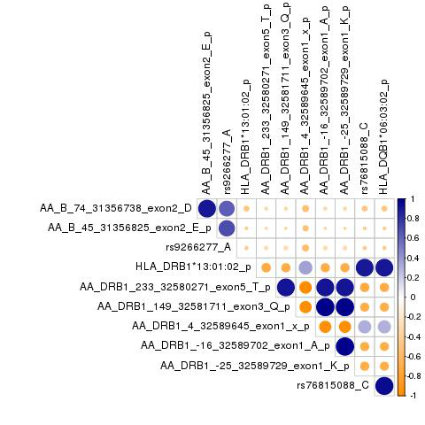

# Meta MG overall (USmerged + Itals) HLA analysis

**Start date:** 05-04-2021

**End date:** 05-04-2021

**Analysed by:** Ruth Chia

**Working directory:** `/data/NDRS_LNG/MyastheniaGravis/updated.April2020/MetaAnalysis.hg38.ByCohort.rerun/HLA/Overall`

___


<h1>Table of Contents<span class="tocSkip"></span></h1>
<div class="toc"><ul class="toc-item"><li><span><a href="#Download-code-for-HATK" data-toc-modified-id="Download-code-for-HATK-1">Download code for HATK</a></span></li><li><span><a href="#Meta-from-Imputation.1000G" data-toc-modified-id="Meta-from-Imputation.1000G-2">Meta from Imputation.1000G</a></span><ul class="toc-item"><li><span><a href="#4field" data-toc-modified-id="4field-2.1">4field</a></span></li><li><span><a href="#4field-GLM-plink" data-toc-modified-id="4field-GLM-plink-2.2">4field-GLM-plink</a></span><ul class="toc-item"><li><span><a href="#plot-(use-HATK-function---to-get-manhattan-and-heatmap)" data-toc-modified-id="plot-(use-HATK-function---to-get-manhattan-and-heatmap)-2.2.1">plot (use HATK function - to get manhattan and heatmap)</a></span></li></ul></li><li><span><a href="#4field-GLM-plink-conditional" data-toc-modified-id="4field-GLM-plink-conditional-2.3">4field-GLM-plink-conditional</a></span><ul class="toc-item"><li><span><a href="#plot--(use-HATK-function---to-get-manhattan-and-heatmap)" data-toc-modified-id="plot--(use-HATK-function---to-get-manhattan-and-heatmap)-2.3.1">plot  (use HATK function - to get manhattan and heatmap)</a></span></li></ul></li></ul></li><li><span><a href="#Check-correlation-of-top-snp-from-GWAS-with-top-hit-from-HLA-fine-mapping" data-toc-modified-id="Check-correlation-of-top-snp-from-GWAS-with-top-hit-from-HLA-fine-mapping-3">Check correlation of top snp from GWAS with top hit from HLA fine mapping</a></span></li></ul></div>

## Download code for HATK

HATK(HLA Analysis Tool-Kit) is a collection of tools and modules to perform HLA fine-mapping analysis, which is to identify which HLA allele or amino acid position of the HLA gene is driving the disease


```python
!git clone https://github.com/WansonChoi/HATK.git
```

    Cloning into 'HATK'...
    remote: Enumerating objects: 2246, done.
    remote: Counting objects: 100% (206/206), done.
    remote: Compressing objects: 100% (135/135), done.
    remote: Total 2246 (delta 92), reused 163 (delta 66), pack-reused 2040
    Receiving objects: 100% (2246/2246), 169.10 MiB | 20.93 MiB/s, done.
    Resolving deltas: 100% (1089/1089), done.
    Checking out files: 100% (718/718), done.


## Meta from Imputation.1000G
### 4field


```bash
%%bash
cd HATK

DIR_US="/data/NDRS_LNG/MyastheniaGravis/updated.April2020/US/Imputation.HLA/Imputation.1000G/4field"
DIR_Itals="/data/NDRS_LNG/MyastheniaGravis/updated.April2020/Itals/Imputation.HLA/Imputation.1000G/4field"

out="/data/NDRS_LNG/MyastheniaGravis/updated.April2020/MetaAnalysis.hg38.ByCohort.rerun/HLA/Overall"
mkdir $out/1000G/4field

python HATK.py \
    --metaanalysis \
    --s1-logistic-result $DIR_US/RESULT_MG.USmerged.1000G_REF.EUR.hatk.chr6.4field.hg38.assoc.logistic \
    --s1-bim $DIR_US/RESULT_MG.USmerged.1000G_REF.EUR.hatk.chr6.4field.hg38.bim \
    --s2-logistic-result $DIR_Itals/RESULT_MG.Itals.1000G_REF.EUR.hatk.chr6.4field.hg38.assoc.logistic \
    --s2-bim $DIR_Itals/RESULT_MG.Itals.1000G_REF.EUR.hatk.chr6.4field.hg38.bim \
    --out $out/1000G/4field/RESULT_Meta.MG.overall.USmerged.Itals.HLA.hg38
```

    Namespace(Ggroup=False, HLA=None, NoCaption=False, Pgroup=False, aa=None, ar=None, bmarkergenerator=False, chped=None, condition=None, condition_list=None, covar=None, covar_name=None, dict_AA=None, dict_SNPS=None, fam=None, fourF=False, hat=None, heatmap=False, hg=None, hla2hped=False, hped=None, imgt=None, imgt2seq=False, imgt_dir=None, input=None, leave_NotFound=False, logistic=False, manhattan=False, maptable=None, metaanalysis=True, multiprocess=1, no_indel=False, nomencleaner=False, omnibus=False, oneF=False, out='/data/NDRS_LNG/MyastheniaGravis/updated.April2020/MetaAnalysis.hg38.ByCohort.rerun/HLA/Overall/1000G/4field/RESULT_Meta.MG.overall.USmerged.Itals.HLA.hg38', phased=None, pheno=None, pheno_name=None, platform=None, point_color='#778899', point_size='15', reference_allele=None, rhped=None, s1_bim='/data/NDRS_LNG/MyastheniaGravis/updated.April2020/US/Imputation.HLA/Imputation.1000G/4field/RESULT_MG.USmerged.1000G_REF.EUR.hatk.chr6.4field.hg38.bim', s1_logistic_result='/data/NDRS_LNG/MyastheniaGravis/updated.April2020/US/Imputation.HLA/Imputation.1000G/4field/RESULT_MG.USmerged.1000G_REF.EUR.hatk.chr6.4field.hg38.assoc.logistic', s2_bim='/data/NDRS_LNG/MyastheniaGravis/updated.April2020/Itals/Imputation.HLA/Imputation.1000G/4field/RESULT_MG.Itals.1000G_REF.EUR.hatk.chr6.4field.hg38.bim', s2_logistic_result='/data/NDRS_LNG/MyastheniaGravis/updated.April2020/Itals/Imputation.HLA/Imputation.1000G/4field/RESULT_MG.Itals.1000G_REF.EUR.hatk.chr6.4field.hg38.assoc.logistic', save_intermediates=False, threeF=False, top_color='#FF0000', twoF=False, variants=None, yaxis_unit='10')
    
    [HLA_Study.py]: MetaAnalysis result : 
    /data/NDRS_LNG/MyastheniaGravis/updated.April2020/MetaAnalysis.hg38.ByCohort.rerun/HLA/Overall/1000G/4field/RESULT_Meta.MG.overall.USmerged.Itals.HLA.hg38.meta


### 4field-GLM-plink

metal file: `/data/NDRS_LNG/MyastheniaGravis/updated.April2020/MetaAnalysis.hg38.ByCohort.rerun/HLA/Overall/1000G/4field.GLM/metal.4field-GLM-plink.txt`

```
# THIS SCRIPT EXECUTES AN ANALYSIS OF TWO STUDIES - HLA imputed

# THE RESULTS FOR EACH STUDY ARE STORED IN FILES:
# /data/NDRS_LNG/MyastheniaGravis/updated.April2020/US/Imputation.HLA/Imputation.1000G/4field/GLM/toMeta.RESULT_MG.USmerged.1000G_REF.EUR.hatk.chr6.4field.hg38.tab
# /data/NDRS_LNG/MyastheniaGravis/updated.April2020/Itals/Imputation.HLA/Imputation.1000G/4field/GLM/toMeta.RESULT_MG.Itals.1000G_REF.EUR.hatk.chr6.4field.hg38.tab

SCHEME  STDERR
AVERAGEFREQ ON
MINMAXFREQ ON

# LOAD THE FIRST INPUT FILE
# UNCOMMENT THE NEXT LINE TO ENABLE GenomicControl CORRECTION
# GENOMICCONTROL ON

# === DESCRIBE AND PROCESS THE FIRST INPUT FILE ===
MARKER marker
ALLELE EffectAllele OtherAllele
FREQ   Freq_EffectAllele
EFFECT BETA
STDERR SE
PVALUE P
#WEIGHT OBS_CT
PROCESS /data/NDRS_LNG/MyastheniaGravis/updated.April2020/US/Imputation.HLA/Imputation.1000G/4field/GLM/toMeta.RESULT_MG.USmerged.1000G_REF.EUR.hatk.chr6.4field.hg38.tab

# === DESCRIBE AND PROCESS ADDITIONAL INPUT FILE ===
PROCESS /data/NDRS_LNG/MyastheniaGravis/updated.April2020/Itals/Imputation.HLA/Imputation.1000G/4field/GLM/toMeta.RESULT_MG.Itals.1000G_REF.EUR.hatk.chr6.4field.hg38.tab

OUTFILE META_MG.USmerged.Itals.UNRELATED.hg38.HLA.FreqBoth.glm .tbl
ANALYZE HETEROGENEITY
```


```bash
%%bash
out="/data/NDRS_LNG/MyastheniaGravis/updated.April2020/MetaAnalysis.hg38.ByCohort.rerun/HLA/Overall"
mkdir $out/1000G/4field.GLM
cd $out/1000G/4field.GLM

module load metal
metal /data/NDRS_LNG/MyastheniaGravis/updated.April2020/MetaAnalysis.hg38.ByCohort.rerun/HLA/Overall/1000G/4field.GLM/metal.4field-GLM-plink.txt
```

    MetaAnalysis Helper - (c) 2007 - 2009 Goncalo Abecasis
    This version released on 2018-08-28
    
    # This program faciliates meta-analysis of genome-wide association studies.
    # Commonly used commands are listed below:
    #
    # Options for describing input files ...
    #   SEPARATOR        [WHITESPACE|COMMA|BOTH|TAB] (default = WHITESPACE)
    #   COLUMNCOUNTING   [STRICT|LENIENT]            (default = 'STRICT')
    #   MARKERLABEL      [LABEL]                     (default = 'MARKER')
    #   ALLELELABELS     [LABEL1 LABEL2]             (default = 'ALLELE1','ALLELE2')
    #   EFFECTLABEL      [LABEL|log(LABEL)]          (default = 'EFFECT')
    #   FLIP
    #
    # Options for filtering input files ...
    #   ADDFILTER        [LABEL CONDITION VALUE]     (example = ADDFILTER N > 10)
    #                    (available conditions are <, >, <=, >=, =, !=, IN)
    #   REMOVEFILTERS
    #
    # Options for sample size weighted meta-analysis ...
    #   WEIGHTLABEL      [LABEL]                     (default = 'N')
    #   PVALUELABEL      [LABEL]                     (default = 'PVALUE')
    #   DEFAULTWEIGHT    [NUMBER]                    (default = 1.0)
    #   MINWEIGHT        [NUMBER]                    (default = 1.0)
    #
    # Options for inverse variance weighted meta-analysis ...
    #   STDERRLABEL      [LABEL]                     (default = 'STDERR')
    #   SCHEME           [SAMPLESIZE|STDERR]         (default = SAMPLESIZE)
    #
    # Options to enable tracking of allele frequencies ...
    #   AVERAGEFREQ      [ON|OFF]                    (default = OFF)
    #   MINMAXFREQ       [ON|OFF]                    (default = OFF)
    #   FREQLABEL        [LABEL]                     (default = 'FREQ')
    #
    # Options to enable tracking of user defined variables ...
    #   CUSTOMVARIABLE   [VARNAME]
    #   LABEL            [VARNAME] AS [HEADER]
    #
    # Options to enable tracking of chromosomes and positions ...
    #   TRACKPOSITIONS   [ON|OFF]                    (default = OFF
    #   CHROMOSOMELABEL  [LABEL]                     (default = 'CHROMOSOME')
    #   POSITIONLABEL    [LABEL]                     (default = 'POSITION')
    #
    # Options to enable explicit strand information ...
    #   USESTRAND        [ON|OFF]                    (default = OFF)
    #   STRANDLABEL      [LABEL]                     (default = 'STRAND')
    #
    # Automatic genomic control correction of input statistics ...
    #   GENOMICCONTROL   [ON|OFF|VALUE|LIST snps.txt](default = OFF)
    #
    # Options to account for samples overlap ...
    #   OVERLAP          [ON|OFF]                    (default = OFF)
    #   ZCUTOFF          [NUMBER]                    (default = 1.0)
    #
    # Options for general analysis control ...
    #   PROCESSFILE      [FILENAME]
    #   OUTFILE          [PREFIX SUFFIX]             (default = 'METAANALYSIS','.TBL')
    #   MAXWARNINGS      [NUMBER]                    (default = 20)
    #   VERBOSE          [ON|OFF]                    (default = 'OFF')
    #   LOGPVALUE        [ON|OFF]                    (default = 'OFF')
    #   ANALYZE          [HETEROGENEITY]
    #   CLEAR
    
    # Options for general run control ...
    #   SOURCE           [SCRIPTFILE]
    #   RETURN
    #   QUIT
    
    # Processing commands in /data/NDRS_LNG/MyastheniaGravis/updated.April2020/MetaAnalysis.hg38.ByCohort.rerun/HLA/Overall/1000G/4field.GLM/metal.4field-GLM-plink.txt ...
    ## Meta-analysis will be based on effect sizes and their standard errors ...
    ## Averaging of allele frequencies enabled
    ## Tracking of extreme allele frequencies enabled
    ## Set marker header to marker ...
    ## Set allele headers to EffectAllele and OtherAllele ...
    ## Set frequency header to Freq_EffectAllele ...
    ## Set effect header to BETA ...
    ## Set standard error header to SE ...
    ## Set p-value header to P ...
    ###########################################################################
    ## Processing file '/data/NDRS_LNG/MyastheniaGravis/updated.April2020/US/Imputation.HLA/Imputation.1000G/4field/GLM/toMeta.RESULT_MG.USmerged.1000G_REF.EUR.hatk.chr6.4field.hg38.tab'
    ## Processed 6759 markers ...
    
    ###########################################################################
    ## Processing file '/data/NDRS_LNG/MyastheniaGravis/updated.April2020/Itals/Imputation.HLA/Imputation.1000G/4field/GLM/toMeta.RESULT_MG.Itals.1000G_REF.EUR.hatk.chr6.4field.hg38.tab'
    ## Processed 10828 markers ...
    
    ## Set output file prefix and suffix to META_MG.USmerged.Itals.UNRELATED.hg38.HLA.FreqBoth.glm and .tbl ...
    ###########################################################################
    ## Running second pass analysis to evaluate heterogeneity...
    ## Processing file '/data/NDRS_LNG/MyastheniaGravis/updated.April2020/Itals/Imputation.HLA/Imputation.1000G/4field/GLM/toMeta.RESULT_MG.Itals.1000G_REF.EUR.hatk.chr6.4field.hg38.tab'
    ## Processing file '/data/NDRS_LNG/MyastheniaGravis/updated.April2020/US/Imputation.HLA/Imputation.1000G/4field/GLM/toMeta.RESULT_MG.USmerged.1000G_REF.EUR.hatk.chr6.4field.hg38.tab'
    
    ###########################################################################
    ## Executing meta-analysis ...
    ## Complete results will be stored in file 'META_MG.USmerged.Itals.UNRELATED.hg38.HLA.FreqBoth.glm1.tbl'
    ## Column descriptions will be stored in file 'META_MG.USmerged.Itals.UNRELATED.hg38.HLA.FreqBoth.glm1.tbl.info'
    ## Completed meta-analysis for 13769 markers!
    ## Smallest p-value is 7.627e-15 at marker 'HLA_DRB1*13:01:02:6:32578770:a:p'
    
    ## Clearing all stored statistics ...
    # Clearing user defined filters ...


    [+] Loading metal  2018-08-28 


```bash
%%bash
# Prepare file for input for plotting

module load R/3.5.2
DIR="/data/NDRS_LNG/MyastheniaGravis/updated.April2020"
out="/data/NDRS_LNG/MyastheniaGravis/updated.April2020/MetaAnalysis.hg38.ByCohort.rerun/HLA/Overall"

Rscript ReformatMetaResults.addMAF.v2.HLA.R \
$out/1000G/4field.GLM/META_MG.USmerged.Itals.UNRELATED.hg38.HLA.FreqBoth.glm1.tbl \
$DIR/US/Imputation.HLA/Imputation.1000G/4field/GLM/toMeta.RESULT_MG.USmerged.1000G_REF.EUR.hatk.chr6.4field.hg38.tab \
$DIR/Itals/Imputation.HLA/Imputation.1000G/4field/GLM/toMeta.RESULT_MG.Itals.1000G_REF.EUR.hatk.chr6.4field.hg38.tab \
$out/1000G/4field.GLM/META_MG.USmerged.Itals.UNRELATED.hg38.HLA.FreqBoth
```

    [1] 13769    15
    [1] 13769    24
    [1] 3477   12
    [1] 6759   10
    [1] 10828    10
    [1] 3817   19


    [-] Unloading gcc  9.2.0  ... 
    [-] Unloading GSL 2.6 for GCC 9.2.0 ... 
    [-] Unloading openmpi 4.0.5  for GCC 9.2.0 
    [-] Unloading ImageMagick  7.0.8  on cn3451 
    [-] Unloading HDF5  1.10.4 
    [-] Unloading NetCDF 4.7.4_gcc9.2.0 
    [-] Unloading pandoc  2.13  on cn3451 
    [-] Unloading pcre2 10.21  ... 
    [-] Unloading R 4.0.5 
    [+] Loading gcc  7.3.0  ... 
    [+] Loading GSL 2.4 for GCC 7.2.0 ... 
    [-] Unloading gcc  7.3.0  ... 
    [+] Loading gcc  7.3.0  ... 
    [+] Loading openmpi 3.0.2  for GCC 7.3.0 
    [+] Loading ImageMagick  7.0.8  on cn3451 
    [+] Loading HDF5  1.10.4 
    [+] Loading pandoc  2.13  on cn3451 
    [+] Loading R 3.5.2 
    
    The following have been reloaded with a version change:
      1) GSL/2.6_gcc-9.2.0 => GSL/2.4_gcc-7.2.0     3) gcc/9.2.0 => gcc/7.3.0
      2) R/4.0 => R/3.5.2
    
    Loading required package: data.table
    Loading required package: tidyverse
    -- Attaching packages --------------------------------------- tidyverse 1.2.1 --
    v ggplot2 3.3.2     v purrr   0.3.4
    v tibble  3.0.3     v dplyr   0.8.5
    v tidyr   0.8.3     v stringr 1.4.0
    v readr   1.3.1     v forcats 0.5.0
    -- Conflicts ------------------------------------------ tidyverse_conflicts() --
    x dplyr::between()   masks data.table::between()
    x dplyr::filter()    masks stats::filter()
    x dplyr::first()     masks data.table::first()
    x dplyr::lag()       masks stats::lag()
    x dplyr::last()      masks data.table::last()
    x purrr::transpose() masks data.table::transpose()


```python
import pandas as pd

pd.read_csv("/data/NDRS_LNG/MyastheniaGravis/updated.April2020/MetaAnalysis.hg38.ByCohort.rerun/HLA/Overall/1000G/4field.GLM/META_MG.USmerged.Itals.UNRELATED.hg38.HLA.FreqBoth.filteredDirection.HetISq80.TIDY.v2.txt",sep="\t").head()
```


<div>
<style scoped>
    .dataframe tbody tr th:only-of-type {
        vertical-align: middle;
    }

    .dataframe tbody tr th {
        vertical-align: top;
    }

    .dataframe thead th {
        text-align: right;
    }
</style>
<table border="1" class="dataframe">
  <thead>
    <tr style="text-align: right;">
      <th></th>
      <th>CHROM</th>
      <th>POS</th>
      <th>ID</th>
      <th>MarkerName</th>
      <th>EffectAllele</th>
      <th>OtherAllele</th>
      <th>maf_EA</th>
      <th>maf_EA.CASE</th>
      <th>maf_EA.CTRL</th>
      <th>beta</th>
      <th>StdErr</th>
      <th>P</th>
      <th>Direction</th>
      <th>HetISq</th>
    </tr>
  </thead>
  <tbody>
    <tr>
      <th>0</th>
      <td>6</td>
      <td>29942594</td>
      <td>AA_A_-11_29942594_exon1_L</td>
      <td>AA_A_-11_29942594_exon1_L:6:29942594:a:p</td>
      <td>p</td>
      <td>a</td>
      <td>0.073752</td>
      <td>0.077683</td>
      <td>0.073550</td>
      <td>-0.0135</td>
      <td>0.0680</td>
      <td>0.842600</td>
      <td>-+</td>
      <td>0.0</td>
    </tr>
    <tr>
      <th>1</th>
      <td>6</td>
      <td>29942594</td>
      <td>AA_A_-11_29942594_exon1_S</td>
      <td>AA_A_-11_29942594_exon1_S:6:29942594:p:a</td>
      <td>a</td>
      <td>p</td>
      <td>0.199069</td>
      <td>0.225574</td>
      <td>0.197704</td>
      <td>0.0391</td>
      <td>0.0438</td>
      <td>0.372500</td>
      <td>++</td>
      <td>0.0</td>
    </tr>
    <tr>
      <th>2</th>
      <td>6</td>
      <td>29942594</td>
      <td>AA_A_-11_29942594_exon1_x</td>
      <td>AA_A_-11_29942594_exon1_x:6:29942594:a:p</td>
      <td>p</td>
      <td>a</td>
      <td>0.125317</td>
      <td>0.147891</td>
      <td>0.124155</td>
      <td>0.0635</td>
      <td>0.0520</td>
      <td>0.221900</td>
      <td>--</td>
      <td>0.0</td>
    </tr>
    <tr>
      <th>3</th>
      <td>6</td>
      <td>29942582</td>
      <td>AA_A_-15_29942582_exon1_L</td>
      <td>AA_A_-15_29942582_exon1_L:6:29942582:a:p</td>
      <td>p</td>
      <td>a</td>
      <td>0.467301</td>
      <td>0.480513</td>
      <td>0.466621</td>
      <td>0.0846</td>
      <td>0.0368</td>
      <td>0.021510</td>
      <td>--</td>
      <td>0.0</td>
    </tr>
    <tr>
      <th>4</th>
      <td>6</td>
      <td>29942582</td>
      <td>AA_A_-15_29942582_exon1_V</td>
      <td>AA_A_-15_29942582_exon1_V:6:29942582:a:p</td>
      <td>p</td>
      <td>a</td>
      <td>0.407382</td>
      <td>0.371596</td>
      <td>0.409225</td>
      <td>-0.1215</td>
      <td>0.0379</td>
      <td>0.001359</td>
      <td>++</td>
      <td>0.0</td>
    </tr>
  </tbody>
</table>
</div>


#### plot (use HATK function - to get manhattan and heatmap)


```bash
%%bash
# first need to reformat the meta output from plink glm to match the input for HATK
# i.e have column : CHR,SNP,BP,A1,TEST,NMISS,OR,SE,L95,U95,STAT,P

module load R/3.5.2
R --vanilla --no-save

require(data.table)
require(tidyverse)

data <- fread("1000G/4field.GLM/META_MG.USmerged.Itals.UNRELATED.hg38.HLA.FreqBoth.filteredDirectionHetISq80MAF001overall.tbl",header=T)
data1 <- data %>%
         select(CHROM,ID,POS,EffectAllele,beta,StdErr,P) %>%
         mutate(OR = exp(beta)) %>%
         select(-beta)
data1$TEST <- "ADD"
data1$NMISS <- "NA"
data1$L95 <- "NA"
data1$U95 <- "NA"
data1$STAT <- "NA"
data1 <- data1 %>% select(CHROM,ID,POS,EffectAllele,TEST,NMISS,OR,StdErr,L95,U95,STAT,P)
colnames(data1) <- c("CHR","SNP","BP","A1","TEST","NMISS","OR","SE","L95","U95","STAT","P")
head(data1)
write.table(data1,"1000G/4field.GLM/META_MG.USmerged.Itals.UNRELATED.hg38.HLA.FreqBoth.filteredDirectionHetISq80MAF001overall.forHATK.assoc.logistic",sep=" ",quote=F,row.names=F,col.names=T)
```

    
    R version 3.5.2 (2018-12-20) -- "Eggshell Igloo"
    Copyright (C) 2018 The R Foundation for Statistical Computing
    Platform: x86_64-pc-linux-gnu (64-bit)
    
    R is free software and comes with ABSOLUTELY NO WARRANTY.
    You are welcome to redistribute it under certain conditions.
    Type 'license()' or 'licence()' for distribution details.
    
    R is a collaborative project with many contributors.
    Type 'contributors()' for more information and
    'citation()' on how to cite R or R packages in publications.
    
    Type 'demo()' for some demos, 'help()' for on-line help, or
    'help.start()' for an HTML browser interface to help.
    Type 'q()' to quit R.
    
    > 
    > require(data.table)
    > require(tidyverse)
    > 
    > data <- fread("1000G/4field.GLM/META_MG.USmerged.Itals.UNRELATED.hg38.HLA.FreqBoth.filteredDirectionHetISq80MAF001overall.tbl",header=T)
    > data1 <- data %>%
    +          select(CHROM,ID,POS,EffectAllele,beta,StdErr,P) %>%
    +          mutate(OR = exp(beta)) %>%
    +          select(-beta)
    > data1$TEST <- "ADD"
    > data1$NMISS <- "NA"
    > data1$L95 <- "NA"
    > data1$U95 <- "NA"
    > data1$STAT <- "NA"
    > data1 <- data1 %>% select(CHROM,ID,POS,EffectAllele,TEST,NMISS,OR,StdErr,L95,U95,STAT,P)
    > colnames(data1) <- c("CHR","SNP","BP","A1","TEST","NMISS","OR","SE","L95","U95","STAT","P")
    > head(data1)
      CHR        SNP       BP A1 TEST NMISS        OR     SE L95 U95 STAT      P
    1   6  rs1410689 25006557  a  ADD    NA 1.0362413 0.0369  NA  NA   NA 0.3335
    2   6 rs10946741 25010771  g  ADD    NA 1.0408108 0.0366  NA  NA   NA 0.2738
    3   6  rs9467377 25013892  a  ADD    NA 0.8848829 0.1041  NA  NA   NA 0.2401
    4   6   rs303890 25035692  a  ADD    NA 1.0293217 0.0395  NA  NA   NA 0.4640
    5   6   rs303898 25039374  g  ADD    NA 1.0583383 0.0368  NA  NA   NA 0.1233
    6   6   rs458664 25054937  a  ADD    NA 1.0428945 0.0380  NA  NA   NA 0.2694
    > write.table(data1,"1000G/4field.GLM/META_MG.USmerged.Itals.UNRELATED.hg38.HLA.FreqBoth.filteredDirectionHetISq80MAF001overall.forHATK.assoc.logistic",sep=" ",quote=F,row.names=F,col.names=T)
    > 


    [-] Unloading gcc  9.2.0  ... 
    [-] Unloading GSL 2.6 for GCC 9.2.0 ... 
    [-] Unloading openmpi 4.0.5  for GCC 9.2.0 
    [-] Unloading ImageMagick  7.0.8  on cn3451 
    [-] Unloading HDF5  1.10.4 
    [-] Unloading NetCDF 4.7.4_gcc9.2.0 
    [-] Unloading pandoc  2.13  on cn3451 
    [-] Unloading pcre2 10.21  ... 
    [-] Unloading R 4.0.5 
    [+] Loading gcc  7.3.0  ... 
    [+] Loading GSL 2.4 for GCC 7.2.0 ... 
    [-] Unloading gcc  7.3.0  ... 
    [+] Loading gcc  7.3.0  ... 
    [+] Loading openmpi 3.0.2  for GCC 7.3.0 
    [+] Loading ImageMagick  7.0.8  on cn3451 
    [+] Loading HDF5  1.10.4 
    [+] Loading pandoc  2.13  on cn3451 
    [+] Loading R 3.5.2 
    
    The following have been reloaded with a version change:
      1) GSL/2.6_gcc-9.2.0 => GSL/2.4_gcc-7.2.0     3) gcc/9.2.0 => gcc/7.3.0
      2) R/4.0 => R/3.5.2
    
    Loading required package: data.table
    Loading required package: tidyverse
    -- Attaching packages --------------------------------------- tidyverse 1.2.1 --
    v ggplot2 3.3.2     v purrr   0.3.4
    v tibble  3.0.3     v dplyr   0.8.5
    v tidyr   0.8.3     v stringr 1.4.0
    v readr   1.3.1     v forcats 0.5.0
    -- Conflicts ------------------------------------------ tidyverse_conflicts() --
    x dplyr::between()   masks data.table::between()
    x dplyr::filter()    masks stats::filter()
    x dplyr::first()     masks data.table::first()
    x dplyr::lag()       masks stats::lag()
    x dplyr::last()      masks data.table::last()
    x purrr::transpose() masks data.table::transpose()


```bash
%%bash
cd HATK/

python HATK.py \
    --manhattan \
    --ar ../1000G/4field.GLM/META_MG.USmerged.Itals.UNRELATED.hg38.HLA.FreqBoth.filteredDirectionHetISq80MAF001overall.forHATK.assoc.logistic \
    --imgt 3320 \
    --hg 38 \
    --yaxis-unit 5 \
    --out ../1000G/4field.GLM/META_MG.USmerged.Itals.UNRELATED.hg38.HLA.FreqBoth.filteredDirectionHetISq80MAF001overall
```

    Namespace(Ggroup=False, HLA=None, NoCaption=False, Pgroup=False, aa=None, ar=['../1000G/4field.GLM/META_MG.USmerged.Itals.UNRELATED.hg38.HLA.FreqBoth.filteredDirectionHetISq80MAF001overall.forHATK.assoc.logistic'], bmarkergenerator=False, chped=None, condition=None, condition_list=None, covar=None, covar_name=None, dict_AA=None, dict_SNPS=None, fam=None, fourF=False, hat=None, heatmap=False, hg='38', hla2hped=False, hped=None, imgt='3320', imgt2seq=False, imgt_dir=None, input=None, leave_NotFound=False, logistic=False, manhattan=True, maptable=None, metaanalysis=False, multiprocess=1, no_indel=False, nomencleaner=False, omnibus=False, oneF=False, out='../1000G/4field.GLM/META_MG.USmerged.Itals.UNRELATED.hg38.HLA.FreqBoth.filteredDirectionHetISq80MAF001overall', phased=None, pheno=None, pheno_name=None, platform=None, point_color='#778899', point_size='15', reference_allele=None, rhped=None, s1_bim=None, s1_logistic_result=None, s2_bim=None, s2_logistic_result=None, save_intermediates=False, threeF=False, top_color='#FF0000', twoF=False, variants=None, yaxis_unit='5')
    
    [HLA_Study.py]: Manhattan result : 
    ../1000G/4field.GLM/META_MG.USmerged.Itals.UNRELATED.hg38.HLA.FreqBoth.filteredDirectionHetISq80MAF001overall.pdf


### 4field-GLM-plink-conditional

metal file: `/data/NDRS_LNG/MyastheniaGravis/updated.April2020/MetaAnalysis.hg38.ByCohort.rerun/HLA/Overall/1000G/4field.GLM/metal.4field-GLM-plink.conditioned.1.txt`

```
# THIS SCRIPT EXECUTES AN ANALYSIS OF TWO STUDIES - HLA imputed

# THE RESULTS FOR EACH STUDY ARE STORED IN FILES:
# /data/NDRS_LNG/MyastheniaGravis/updated.April2020/US/Imputation.HLA/Imputation.1000G/4field/GLM.conditional/toMeta.RESULT_MG.USmerged.1000G_REF.EUR.hatk.chr6.4field.hg38.conditioned.HLA_DRB1.tab
# /data/NDRS_LNG/MyastheniaGravis/updated.April2020/Itals/Imputation.HLA/Imputation.1000G/4field/GLM.conditional/toMeta.RESULT_MG.Itals.1000G_REF.EUR.hatk.chr6.4field.hg38.conditioned.HLA_DRB1.tab

SCHEME  STDERR
AVERAGEFREQ ON
MINMAXFREQ ON

# LOAD THE FIRST INPUT FILE
# UNCOMMENT THE NEXT LINE TO ENABLE GenomicControl CORRECTION
# GENOMICCONTROL ON

# === DESCRIBE AND PROCESS THE FIRST INPUT FILE ===
MARKER marker
ALLELE EffectAllele OtherAllele
FREQ   Freq_EffectAllele
EFFECT BETA
STDERR SE
PVALUE P
#WEIGHT OBS_CT
PROCESS /data/NDRS_LNG/MyastheniaGravis/updated.April2020/US/Imputation.HLA/Imputation.1000G/4field/GLM.conditional/toMeta.RESULT_MG.USmerged.1000G_REF.EUR.hatk.chr6.4field.hg38.conditioned.HLA_DRB1.tab

# === DESCRIBE AND PROCESS ADDITIONAL INPUT FILE ===
PROCESS /data/NDRS_LNG/MyastheniaGravis/updated.April2020/Itals/Imputation.HLA/Imputation.1000G/4field/GLM.conditional/toMeta.RESULT_MG.Itals.1000G_REF.EUR.hatk.chr6.4field.hg38.conditioned.HLA_DRB1.tab

OUTFILE META_MG.USmerged.Itals.UNRELATED.hg38.conditioned.HLA_DRB1.FreqBoth.glm .tbl
ANALYZE HETEROGENEITY
```
____

metal file: `/data/NDRS_LNG/MyastheniaGravis/updated.April2020/MetaAnalysis.hg38.ByCohort.rerun/HLA/Overall/1000G/4field.GLM/metal.4field-GLM-plink.conditioned.2.txt`

```
# THIS SCRIPT EXECUTES AN ANALYSIS OF TWO STUDIES - HLA imputed

# THE RESULTS FOR EACH STUDY ARE STORED IN FILES:
# /data/NDRS_LNG/MyastheniaGravis/updated.April2020/US/Imputation.HLA/Imputation.1000G/4field/GLM.conditional/toMeta.RESULT_MG.USmerged.1000G_REF.EUR.hatk.chr6.4field.hg38.conditioned.AA.HLA_B.tab
# /data/NDRS_LNG/MyastheniaGravis/updated.April2020/Itals/Imputation.HLA/Imputation.1000G/4field/GLM.conditional/toMeta.RESULT_MG.Itals.1000G_REF.EUR.hatk.chr6.4field.hg38.conditioned.AA.HLA_B.tab

SCHEME  STDERR
AVERAGEFREQ ON
MINMAXFREQ ON

# LOAD THE FIRST INPUT FILE
# UNCOMMENT THE NEXT LINE TO ENABLE GenomicControl CORRECTION
# GENOMICCONTROL ON

# === DESCRIBE AND PROCESS THE FIRST INPUT FILE ===
MARKER marker
ALLELE EffectAllele OtherAllele
FREQ   Freq_EffectAllele
EFFECT BETA
STDERR SE
PVALUE P
#WEIGHT OBS_CT
PROCESS /data/NDRS_LNG/MyastheniaGravis/updated.April2020/US/Imputation.HLA/Imputation.1000G/4field/GLM.conditional/toMeta.RESULT_MG.USmerged.1000G_REF.EUR.hatk.chr6.4field.hg38.conditioned.AA.HLA_B.tab

# === DESCRIBE AND PROCESS ADDITIONAL INPUT FILE ===
PROCESS /data/NDRS_LNG/MyastheniaGravis/updated.April2020/Itals/Imputation.HLA/Imputation.1000G/4field/GLM.conditional/toMeta.RESULT_MG.Itals.1000G_REF.EUR.hatk.chr6.4field.hg38.conditioned.AA.HLA_B.tab

OUTFILE META_MG.USmerged.Itals.UNRELATED.hg38.conditioned.AA.HLA_B.FreqBoth.glm .tbl
ANALYZE HETEROGENEITY
```


```bash
%%bash
out="/data/NDRS_LNG/MyastheniaGravis/updated.April2020/MetaAnalysis.hg38.ByCohort.rerun/HLA/Overall"
cd $out/1000G/4field.GLM

module load metal
metal /data/NDRS_LNG/MyastheniaGravis/updated.April2020/MetaAnalysis.hg38.ByCohort.rerun/HLA/Overall/1000G/4field.GLM/metal.4field-GLM-plink.conditioned.1.txt
metal /data/NDRS_LNG/MyastheniaGravis/updated.April2020/MetaAnalysis.hg38.ByCohort.rerun/HLA/Overall/1000G/4field.GLM/metal.4field-GLM-plink.conditioned.2.txt
```

    MetaAnalysis Helper - (c) 2007 - 2009 Goncalo Abecasis
    This version released on 2018-08-28
    
    # This program faciliates meta-analysis of genome-wide association studies.
    # Commonly used commands are listed below:
    #
    # Options for describing input files ...
    #   SEPARATOR        [WHITESPACE|COMMA|BOTH|TAB] (default = WHITESPACE)
    #   COLUMNCOUNTING   [STRICT|LENIENT]            (default = 'STRICT')
    #   MARKERLABEL      [LABEL]                     (default = 'MARKER')
    #   ALLELELABELS     [LABEL1 LABEL2]             (default = 'ALLELE1','ALLELE2')
    #   EFFECTLABEL      [LABEL|log(LABEL)]          (default = 'EFFECT')
    #   FLIP
    #
    # Options for filtering input files ...
    #   ADDFILTER        [LABEL CONDITION VALUE]     (example = ADDFILTER N > 10)
    #                    (available conditions are <, >, <=, >=, =, !=, IN)
    #   REMOVEFILTERS
    #
    # Options for sample size weighted meta-analysis ...
    #   WEIGHTLABEL      [LABEL]                     (default = 'N')
    #   PVALUELABEL      [LABEL]                     (default = 'PVALUE')
    #   DEFAULTWEIGHT    [NUMBER]                    (default = 1.0)
    #   MINWEIGHT        [NUMBER]                    (default = 1.0)
    #
    # Options for inverse variance weighted meta-analysis ...
    #   STDERRLABEL      [LABEL]                     (default = 'STDERR')
    #   SCHEME           [SAMPLESIZE|STDERR]         (default = SAMPLESIZE)
    #
    # Options to enable tracking of allele frequencies ...
    #   AVERAGEFREQ      [ON|OFF]                    (default = OFF)
    #   MINMAXFREQ       [ON|OFF]                    (default = OFF)
    #   FREQLABEL        [LABEL]                     (default = 'FREQ')
    #
    # Options to enable tracking of user defined variables ...
    #   CUSTOMVARIABLE   [VARNAME]
    #   LABEL            [VARNAME] AS [HEADER]
    #
    # Options to enable tracking of chromosomes and positions ...
    #   TRACKPOSITIONS   [ON|OFF]                    (default = OFF
    #   CHROMOSOMELABEL  [LABEL]                     (default = 'CHROMOSOME')
    #   POSITIONLABEL    [LABEL]                     (default = 'POSITION')
    #
    # Options to enable explicit strand information ...
    #   USESTRAND        [ON|OFF]                    (default = OFF)
    #   STRANDLABEL      [LABEL]                     (default = 'STRAND')
    #
    # Automatic genomic control correction of input statistics ...
    #   GENOMICCONTROL   [ON|OFF|VALUE|LIST snps.txt](default = OFF)
    #
    # Options to account for samples overlap ...
    #   OVERLAP          [ON|OFF]                    (default = OFF)
    #   ZCUTOFF          [NUMBER]                    (default = 1.0)
    #
    # Options for general analysis control ...
    #   PROCESSFILE      [FILENAME]
    #   OUTFILE          [PREFIX SUFFIX]             (default = 'METAANALYSIS','.TBL')
    #   MAXWARNINGS      [NUMBER]                    (default = 20)
    #   VERBOSE          [ON|OFF]                    (default = 'OFF')
    #   LOGPVALUE        [ON|OFF]                    (default = 'OFF')
    #   ANALYZE          [HETEROGENEITY]
    #   CLEAR
    
    # Options for general run control ...
    #   SOURCE           [SCRIPTFILE]
    #   RETURN
    #   QUIT
    
    # Processing commands in /data/NDRS_LNG/MyastheniaGravis/updated.April2020/MetaAnalysis.hg38.ByCohort.rerun/HLA/Overall/1000G/4field.GLM/metal.4field-GLM-plink.conditioned.1.txt ...
    ## Meta-analysis will be based on effect sizes and their standard errors ...
    ## Averaging of allele frequencies enabled
    ## Tracking of extreme allele frequencies enabled
    ## Set marker header to marker ...
    ## Set allele headers to EffectAllele and OtherAllele ...
    ## Set frequency header to Freq_EffectAllele ...
    ## Set effect header to BETA ...
    ## Set standard error header to SE ...
    ## Set p-value header to P ...
    ###########################################################################
    ## Processing file '/data/NDRS_LNG/MyastheniaGravis/updated.April2020/US/Imputation.HLA/Imputation.1000G/4field/GLM.conditional/toMeta.RESULT_MG.USmerged.1000G_REF.EUR.hatk.chr6.4field.hg38.conditioned.HLA_DRB1.tab'
    ## Processed 6758 markers ...
    
    ###########################################################################
    ## Processing file '/data/NDRS_LNG/MyastheniaGravis/updated.April2020/Itals/Imputation.HLA/Imputation.1000G/4field/GLM.conditional/toMeta.RESULT_MG.Itals.1000G_REF.EUR.hatk.chr6.4field.hg38.conditioned.HLA_DRB1.tab'
    ## Processed 7381 markers ...
    
    ## Set output file prefix and suffix to META_MG.USmerged.Itals.UNRELATED.hg38.conditioned.HLA_DRB1.FreqBoth.glm and .tbl ...
    ###########################################################################
    ## Running second pass analysis to evaluate heterogeneity...
    ## Processing file '/data/NDRS_LNG/MyastheniaGravis/updated.April2020/Itals/Imputation.HLA/Imputation.1000G/4field/GLM.conditional/toMeta.RESULT_MG.Itals.1000G_REF.EUR.hatk.chr6.4field.hg38.conditioned.HLA_DRB1.tab'
    ## Processing file '/data/NDRS_LNG/MyastheniaGravis/updated.April2020/US/Imputation.HLA/Imputation.1000G/4field/GLM.conditional/toMeta.RESULT_MG.USmerged.1000G_REF.EUR.hatk.chr6.4field.hg38.conditioned.HLA_DRB1.tab'
    
    ###########################################################################
    ## Executing meta-analysis ...
    ## Complete results will be stored in file 'META_MG.USmerged.Itals.UNRELATED.hg38.conditioned.HLA_DRB1.FreqBoth.glm1.tbl'
    ## Column descriptions will be stored in file 'META_MG.USmerged.Itals.UNRELATED.hg38.conditioned.HLA_DRB1.FreqBoth.glm1.tbl.info'
    ## Completed meta-analysis for 10322 markers!
    ## Smallest p-value is 1.178e-13 at marker 'rs7775117:6:31377709:A:T'
    
    ## Clearing all stored statistics ...
    # Clearing user defined filters ...
    MetaAnalysis Helper - (c) 2007 - 2009 Goncalo Abecasis
    This version released on 2018-08-28
    
    # This program faciliates meta-analysis of genome-wide association studies.
    # Commonly used commands are listed below:
    #
    # Options for describing input files ...
    #   SEPARATOR        [WHITESPACE|COMMA|BOTH|TAB] (default = WHITESPACE)
    #   COLUMNCOUNTING   [STRICT|LENIENT]            (default = 'STRICT')
    #   MARKERLABEL      [LABEL]                     (default = 'MARKER')
    #   ALLELELABELS     [LABEL1 LABEL2]             (default = 'ALLELE1','ALLELE2')
    #   EFFECTLABEL      [LABEL|log(LABEL)]          (default = 'EFFECT')
    #   FLIP
    #
    # Options for filtering input files ...
    #   ADDFILTER        [LABEL CONDITION VALUE]     (example = ADDFILTER N > 10)
    #                    (available conditions are <, >, <=, >=, =, !=, IN)
    #   REMOVEFILTERS
    #
    # Options for sample size weighted meta-analysis ...
    #   WEIGHTLABEL      [LABEL]                     (default = 'N')
    #   PVALUELABEL      [LABEL]                     (default = 'PVALUE')
    #   DEFAULTWEIGHT    [NUMBER]                    (default = 1.0)
    #   MINWEIGHT        [NUMBER]                    (default = 1.0)
    #
    # Options for inverse variance weighted meta-analysis ...
    #   STDERRLABEL      [LABEL]                     (default = 'STDERR')
    #   SCHEME           [SAMPLESIZE|STDERR]         (default = SAMPLESIZE)
    #
    # Options to enable tracking of allele frequencies ...
    #   AVERAGEFREQ      [ON|OFF]                    (default = OFF)
    #   MINMAXFREQ       [ON|OFF]                    (default = OFF)
    #   FREQLABEL        [LABEL]                     (default = 'FREQ')
    #
    # Options to enable tracking of user defined variables ...
    #   CUSTOMVARIABLE   [VARNAME]
    #   LABEL            [VARNAME] AS [HEADER]
    #
    # Options to enable tracking of chromosomes and positions ...
    #   TRACKPOSITIONS   [ON|OFF]                    (default = OFF
    #   CHROMOSOMELABEL  [LABEL]                     (default = 'CHROMOSOME')
    #   POSITIONLABEL    [LABEL]                     (default = 'POSITION')
    #
    # Options to enable explicit strand information ...
    #   USESTRAND        [ON|OFF]                    (default = OFF)
    #   STRANDLABEL      [LABEL]                     (default = 'STRAND')
    #
    # Automatic genomic control correction of input statistics ...
    #   GENOMICCONTROL   [ON|OFF|VALUE|LIST snps.txt](default = OFF)
    #
    # Options to account for samples overlap ...
    #   OVERLAP          [ON|OFF]                    (default = OFF)
    #   ZCUTOFF          [NUMBER]                    (default = 1.0)
    #
    # Options for general analysis control ...
    #   PROCESSFILE      [FILENAME]
    #   OUTFILE          [PREFIX SUFFIX]             (default = 'METAANALYSIS','.TBL')
    #   MAXWARNINGS      [NUMBER]                    (default = 20)
    #   VERBOSE          [ON|OFF]                    (default = 'OFF')
    #   LOGPVALUE        [ON|OFF]                    (default = 'OFF')
    #   ANALYZE          [HETEROGENEITY]
    #   CLEAR
    
    # Options for general run control ...
    #   SOURCE           [SCRIPTFILE]
    #   RETURN
    #   QUIT
    
    # Processing commands in /data/NDRS_LNG/MyastheniaGravis/updated.April2020/MetaAnalysis.hg38.ByCohort.rerun/HLA/Overall/1000G/4field.GLM/metal.4field-GLM-plink.conditioned.2.txt ...
    ## Meta-analysis will be based on effect sizes and their standard errors ...
    ## Averaging of allele frequencies enabled
    ## Tracking of extreme allele frequencies enabled
    ## Set marker header to marker ...
    ## Set allele headers to EffectAllele and OtherAllele ...
    ## Set frequency header to Freq_EffectAllele ...
    ## Set effect header to BETA ...
    ## Set standard error header to SE ...
    ## Set p-value header to P ...
    ###########################################################################
    ## Processing file '/data/NDRS_LNG/MyastheniaGravis/updated.April2020/US/Imputation.HLA/Imputation.1000G/4field/GLM.conditional/toMeta.RESULT_MG.USmerged.1000G_REF.EUR.hatk.chr6.4field.hg38.conditioned.AA.HLA_B.tab'
    ## Processed 6755 markers ...
    
    ###########################################################################
    ## Processing file '/data/NDRS_LNG/MyastheniaGravis/updated.April2020/Itals/Imputation.HLA/Imputation.1000G/4field/GLM.conditional/toMeta.RESULT_MG.Itals.1000G_REF.EUR.hatk.chr6.4field.hg38.conditioned.AA.HLA_B.tab'
    ## Processed 10824 markers ...
    
    ## Set output file prefix and suffix to META_MG.USmerged.Itals.UNRELATED.hg38.conditioned.AA.HLA_B.FreqBoth.glm and .tbl ...
    ###########################################################################
    ## Running second pass analysis to evaluate heterogeneity...
    ## Processing file '/data/NDRS_LNG/MyastheniaGravis/updated.April2020/Itals/Imputation.HLA/Imputation.1000G/4field/GLM.conditional/toMeta.RESULT_MG.Itals.1000G_REF.EUR.hatk.chr6.4field.hg38.conditioned.AA.HLA_B.tab'
    ## Processing file '/data/NDRS_LNG/MyastheniaGravis/updated.April2020/US/Imputation.HLA/Imputation.1000G/4field/GLM.conditional/toMeta.RESULT_MG.USmerged.1000G_REF.EUR.hatk.chr6.4field.hg38.conditioned.AA.HLA_B.tab'
    
    ###########################################################################
    ## Executing meta-analysis ...
    ## Complete results will be stored in file 'META_MG.USmerged.Itals.UNRELATED.hg38.conditioned.AA.HLA_B.FreqBoth.glm1.tbl'
    ## Column descriptions will be stored in file 'META_MG.USmerged.Itals.UNRELATED.hg38.conditioned.AA.HLA_B.FreqBoth.glm1.tbl.info'
    ## Completed meta-analysis for 13765 markers!
    ## Smallest p-value is 8.255e-15 at marker 'rs7775117:6:31377709:A:T'
    
    ## Clearing all stored statistics ...
    # Clearing user defined filters ...


    [+] Loading metal  2018-08-28 


#### plot  (use HATK function - to get manhattan and heatmap)


```bash
%%bash
module load R/3.5.2
DIR="/data/NDRS_LNG/MyastheniaGravis/updated.April2020"
out="/data/NDRS_LNG/MyastheniaGravis/updated.April2020/MetaAnalysis.hg38.ByCohort.rerun/HLA/Overall"

Rscript ReformatMetaResults.addMAF.v2.HLA.R \
$out/1000G/4field.GLM/META_MG.USmerged.Itals.UNRELATED.hg38.conditioned.HLA_DRB1.FreqBoth.glm1.tbl \
$DIR/US/Imputation.HLA/Imputation.1000G/4field/GLM.conditional/toMeta.RESULT_MG.USmerged.1000G_REF.EUR.hatk.chr6.4field.hg38.conditioned.HLA_DRB1.tab \
$DIR/Itals/Imputation.HLA/Imputation.1000G/4field/GLM.conditional/toMeta.RESULT_MG.Itals.1000G_REF.EUR.hatk.chr6.4field.hg38.conditioned.HLA_DRB1.tab \
$out/1000G/4field.GLM/META_MG.USmerged.Itals.UNRELATED.hg38.conditioned.HLA_DRB1.FreqBoth

Rscript ReformatMetaResults.addMAF.v2.HLA.R \
$out/1000G/4field.GLM/META_MG.USmerged.Itals.UNRELATED.hg38.conditioned.AA.HLA_B.FreqBoth.glm1.tbl \
$DIR/US/Imputation.HLA/Imputation.1000G/4field/GLM.conditional/toMeta.RESULT_MG.USmerged.1000G_REF.EUR.hatk.chr6.4field.hg38.conditioned.AA.HLA_B.tab \
$DIR/Itals/Imputation.HLA/Imputation.1000G/4field/GLM.conditional/toMeta.RESULT_MG.Itals.1000G_REF.EUR.hatk.chr6.4field.hg38.conditioned.AA.HLA_B.tab \
$out/1000G/4field.GLM/META_MG.USmerged.Itals.UNRELATED.hg38.conditioned.AA.HLA_B.FreqBoth
```

    [1] 10322    15
    [1] 10322    24
    [1] 3489   12
    [1] 6758   10
    [1] 7381   10
    [1] 3816   19
    [1] 13765    15
    [1] 13765    24
    [1] 3516   12
    [1] 6755   10
    [1] 10824    10
    [1] 3813   19


    [-] Unloading gcc  9.2.0  ... 
    [-] Unloading GSL 2.6 for GCC 9.2.0 ... 
    [-] Unloading openmpi 4.0.5  for GCC 9.2.0 
    [-] Unloading ImageMagick  7.0.8  on cn3451 
    [-] Unloading HDF5  1.10.4 
    [-] Unloading NetCDF 4.7.4_gcc9.2.0 
    [-] Unloading pandoc  2.13  on cn3451 
    [-] Unloading pcre2 10.21  ... 
    [-] Unloading R 4.0.5 
    [+] Loading gcc  7.3.0  ... 
    [+] Loading GSL 2.4 for GCC 7.2.0 ... 
    [-] Unloading gcc  7.3.0  ... 
    [+] Loading gcc  7.3.0  ... 
    [+] Loading openmpi 3.0.2  for GCC 7.3.0 
    [+] Loading ImageMagick  7.0.8  on cn3451 
    [+] Loading HDF5  1.10.4 
    [+] Loading pandoc  2.13  on cn3451 
    [+] Loading R 3.5.2 
    
    The following have been reloaded with a version change:
      1) GSL/2.6_gcc-9.2.0 => GSL/2.4_gcc-7.2.0     3) gcc/9.2.0 => gcc/7.3.0
      2) R/4.0 => R/3.5.2
    
    Loading required package: data.table
    Loading required package: tidyverse
    -- Attaching packages --------------------------------------- tidyverse 1.2.1 --
    v ggplot2 3.3.2     v purrr   0.3.4
    v tibble  3.0.3     v dplyr   0.8.5
    v tidyr   0.8.3     v stringr 1.4.0
    v readr   1.3.1     v forcats 0.5.0
    -- Conflicts ------------------------------------------ tidyverse_conflicts() --
    x dplyr::between()   masks data.table::between()
    x dplyr::filter()    masks stats::filter()
    x dplyr::first()     masks data.table::first()
    x dplyr::lag()       masks stats::lag()
    x dplyr::last()      masks data.table::last()
    x purrr::transpose() masks data.table::transpose()
    Loading required package: data.table
    Loading required package: tidyverse
    -- Attaching packages --------------------------------------- tidyverse 1.2.1 --
    v ggplot2 3.3.2     v purrr   0.3.4
    v tibble  3.0.3     v dplyr   0.8.5
    v tidyr   0.8.3     v stringr 1.4.0
    v readr   1.3.1     v forcats 0.5.0
    -- Conflicts ------------------------------------------ tidyverse_conflicts() --
    x dplyr::between()   masks data.table::between()
    x dplyr::filter()    masks stats::filter()
    x dplyr::first()     masks data.table::first()
    x dplyr::lag()       masks stats::lag()
    x dplyr::last()      masks data.table::last()
    x purrr::transpose() masks data.table::transpose()


```bash
%%bash
# first need to reformat the meta output from plink glm to match the input for HATK
# i.e have column : CHR,SNP,BP,A1,TEST,NMISS,OR,SE,L95,U95,STAT,P

module load R/3.5.2
R --vanilla --no-save

require(data.table)
require(tidyverse)

## HLA_DRB1
data <- fread("1000G/4field.GLM/META_MG.USmerged.Itals.UNRELATED.hg38.conditioned.HLA_DRB1.FreqBoth.filteredDirection.HetISq80.TIDY.v2.txt",header=T)
data1 <- data %>%
         select(CHROM,ID,POS,EffectAllele,beta,StdErr,P) %>%
         mutate(OR = exp(beta)) %>%
         select(-beta)
data1$TEST <- "ADD"
data1$NMISS <- "NA"
data1$L95 <- "NA"
data1$U95 <- "NA"
data1$STAT <- "NA"
data1 <- data1 %>% select(CHROM,ID,POS,EffectAllele,TEST,NMISS,OR,StdErr,L95,U95,STAT,P)
colnames(data1) <- c("CHR","SNP","BP","A1","TEST","NMISS","OR","SE","L95","U95","STAT","P")
head(data1)
write.table(data1,"1000G/4field.GLM/META_MG.USmerged.Itals.UNRELATED.hg38.conditioned.HLA_DRB1.FreqBoth.filteredDirectionHetISq80MAF001overall.forHATK.assoc.logistic",sep=" ",quote=F,row.names=F,col.names=T)

## AA.HLA_B
data <- fread("1000G/4field.GLM/META_MG.USmerged.Itals.UNRELATED.hg38.conditioned.AA.HLA_B.FreqBoth.filteredDirection.HetISq80.TIDY.v2.txt",header=T)
data1 <- data %>%
         select(CHROM,ID,POS,EffectAllele,beta,StdErr,P) %>%
         mutate(OR = exp(beta)) %>%
         select(-beta)
data1$TEST <- "ADD"
data1$NMISS <- "NA"
data1$L95 <- "NA"
data1$U95 <- "NA"
data1$STAT <- "NA"
data1 <- data1 %>% select(CHROM,ID,POS,EffectAllele,TEST,NMISS,OR,StdErr,L95,U95,STAT,P)
colnames(data1) <- c("CHR","SNP","BP","A1","TEST","NMISS","OR","SE","L95","U95","STAT","P")
head(data1)
write.table(data1,"1000G/4field.GLM/META_MG.USmerged.Itals.UNRELATED.hg38.conditioned.AA.HLA_B.FreqBoth.filteredDirectionHetISq80MAF001overall.forHATK.assoc.logistic",sep=" ",quote=F,row.names=F,col.names=T)
```

    
    R version 3.5.2 (2018-12-20) -- "Eggshell Igloo"
    Copyright (C) 2018 The R Foundation for Statistical Computing
    Platform: x86_64-pc-linux-gnu (64-bit)
    
    R is free software and comes with ABSOLUTELY NO WARRANTY.
    You are welcome to redistribute it under certain conditions.
    Type 'license()' or 'licence()' for distribution details.
    
    R is a collaborative project with many contributors.
    Type 'contributors()' for more information and
    'citation()' on how to cite R or R packages in publications.
    
    Type 'demo()' for some demos, 'help()' for on-line help, or
    'help.start()' for an HTML browser interface to help.
    Type 'q()' to quit R.
    
    > 
    > require(data.table)
    > require(tidyverse)
    > 
    > ## HLA_DRB1
    > data <- fread("1000G/4field.GLM/META_MG.USmerged.Itals.UNRELATED.hg38.conditioned.HLA_DRB1.FreqBoth.filteredDirection.HetISq80.TIDY.v2.txt",header=T)
    > data1 <- data %>%
    +          select(CHROM,ID,POS,EffectAllele,beta,StdErr,P) %>%
    +          mutate(OR = exp(beta)) %>%
    +          select(-beta)
    > data1$TEST <- "ADD"
    > data1$NMISS <- "NA"
    > data1$L95 <- "NA"
    > data1$U95 <- "NA"
    > data1$STAT <- "NA"
    > data1 <- data1 %>% select(CHROM,ID,POS,EffectAllele,TEST,NMISS,OR,StdErr,L95,U95,STAT,P)
    > colnames(data1) <- c("CHR","SNP","BP","A1","TEST","NMISS","OR","SE","L95","U95","STAT","P")
    > head(data1)
      CHR                       SNP       BP A1 TEST NMISS        OR     SE L95 U95
    1   6 AA_A_-11_29942594_exon1_L 29942594  p  ADD    NA 0.9853090 0.0682  NA  NA
    2   6 AA_A_-11_29942594_exon1_S 29942594  a  ADD    NA 1.0327240 0.0439  NA  NA
    3   6 AA_A_-11_29942594_exon1_x 29942594  p  ADD    NA 1.0560125 0.0522  NA  NA
    4   6 AA_A_-15_29942582_exon1_L 29942582  p  ADD    NA 1.0792863 0.0369  NA  NA
    5   6 AA_A_-15_29942582_exon1_V 29942582  p  ADD    NA 0.8973583 0.0381  NA  NA
    6   6 AA_A_-15_29942582_exon1_x 29942582  p  ADD    NA 1.0560125 0.0522  NA  NA
      STAT        P
    1   NA 0.827800
    2   NA 0.463900
    3   NA 0.295800
    4   NA 0.038810
    5   NA 0.004425
    6   NA 0.295800
    > write.table(data1,"1000G/4field.GLM/META_MG.USmerged.Itals.UNRELATED.hg38.conditioned.HLA_DRB1.FreqBoth.filteredDirectionHetISq80MAF001overall.forHATK.assoc.logistic",sep=" ",quote=F,row.names=F,col.names=T)
    > 
    > ## AA.HLA_B
    > data <- fread("1000G/4field.GLM/META_MG.USmerged.Itals.UNRELATED.hg38.conditioned.AA.HLA_B.FreqBoth.filteredDirection.HetISq80.TIDY.v2.txt",header=T)
    > data1 <- data %>%
    +          select(CHROM,ID,POS,EffectAllele,beta,StdErr,P) %>%
    +          mutate(OR = exp(beta)) %>%
    +          select(-beta)
    > data1$TEST <- "ADD"
    > data1$NMISS <- "NA"
    > data1$L95 <- "NA"
    > data1$U95 <- "NA"
    > data1$STAT <- "NA"
    > data1 <- data1 %>% select(CHROM,ID,POS,EffectAllele,TEST,NMISS,OR,StdErr,L95,U95,STAT,P)
    > colnames(data1) <- c("CHR","SNP","BP","A1","TEST","NMISS","OR","SE","L95","U95","STAT","P")
    > head(data1)
      CHR                       SNP       BP A1 TEST NMISS        OR     SE L95 U95
    1   6 AA_A_-11_29942594_exon1_L 29942594  p  ADD    NA 1.0092425 0.0682  NA  NA
    2   6 AA_A_-11_29942594_exon1_S 29942594  a  ADD    NA 1.0433117 0.0440  NA  NA
    3   6 AA_A_-11_29942594_exon1_x 29942594  p  ADD    NA 1.0562237 0.0522  NA  NA
    4   6 AA_A_-15_29942582_exon1_L 29942582  p  ADD    NA 1.0684404 0.0371  NA  NA
    5   6 AA_A_-15_29942582_exon1_V 29942582  p  ADD    NA 0.9066489 0.0383  NA  NA
    6   6 AA_A_-15_29942582_exon1_x 29942582  p  ADD    NA 1.0562237 0.0522  NA  NA
      STAT       P
    1   NA 0.89310
    2   NA 0.33590
    3   NA 0.29510
    4   NA 0.07479
    5   NA 0.01044
    6   NA 0.29510
    > write.table(data1,"1000G/4field.GLM/META_MG.USmerged.Itals.UNRELATED.hg38.conditioned.AA.HLA_B.FreqBoth.filteredDirectionHetISq80MAF001overall.forHATK.assoc.logistic",sep=" ",quote=F,row.names=F,col.names=T)
    > 


    [-] Unloading gcc  9.2.0  ... 
    [-] Unloading GSL 2.6 for GCC 9.2.0 ... 
    [-] Unloading openmpi 4.0.5  for GCC 9.2.0 
    [-] Unloading ImageMagick  7.0.8  on cn3451 
    [-] Unloading HDF5  1.10.4 
    [-] Unloading NetCDF 4.7.4_gcc9.2.0 
    [-] Unloading pandoc  2.13  on cn3451 
    [-] Unloading pcre2 10.21  ... 
    [-] Unloading R 4.0.5 
    [+] Loading gcc  7.3.0  ... 
    [+] Loading GSL 2.4 for GCC 7.2.0 ... 
    [-] Unloading gcc  7.3.0  ... 
    [+] Loading gcc  7.3.0  ... 
    [+] Loading openmpi 3.0.2  for GCC 7.3.0 
    [+] Loading ImageMagick  7.0.8  on cn3451 
    [+] Loading HDF5  1.10.4 
    [+] Loading pandoc  2.13  on cn3451 
    [+] Loading R 3.5.2 
    
    The following have been reloaded with a version change:
      1) GSL/2.6_gcc-9.2.0 => GSL/2.4_gcc-7.2.0     3) gcc/9.2.0 => gcc/7.3.0
      2) R/4.0 => R/3.5.2
    
    Loading required package: data.table
    Loading required package: tidyverse
    -- Attaching packages --------------------------------------- tidyverse 1.2.1 --
    v ggplot2 3.3.2     v purrr   0.3.4
    v tibble  3.0.3     v dplyr   0.8.5
    v tidyr   0.8.3     v stringr 1.4.0
    v readr   1.3.1     v forcats 0.5.0
    -- Conflicts ------------------------------------------ tidyverse_conflicts() --
    x dplyr::between()   masks data.table::between()
    x dplyr::filter()    masks stats::filter()
    x dplyr::first()     masks data.table::first()
    x dplyr::lag()       masks stats::lag()
    x dplyr::last()      masks data.table::last()
    x purrr::transpose() masks data.table::transpose()


```bash
%%bash
cd HATK/

python HATK.py \
    --manhattan \
    --ar ../1000G/4field.GLM/META_MG.USmerged.Itals.UNRELATED.hg38.conditioned.HLA_DRB1.FreqBoth.filteredDirectionHetISq80MAF001overall.forHATK.assoc.logistic \
    --imgt 3320 \
    --hg 38 \
    --yaxis-unit 5 \
    --out ../1000G/4field.GLM/META_MG.USmerged.Itals.UNRELATED.hg38.conditioned.HLA_DRB1.FreqBoth.filteredDirectionHetISq80MAF001overall
    
python HATK.py \
    --manhattan \
    --ar ../1000G/4field.GLM/META_MG.USmerged.Itals.UNRELATED.hg38.conditioned.AA.HLA_B.FreqBoth.filteredDirectionHetISq80MAF001overall.forHATK.assoc.logistic \
    --imgt 3320 \
    --hg 38 \
    --yaxis-unit 5 \
    --out ../1000G/4field.GLM/META_MG.USmerged.Itals.UNRELATED.hg38.conditioned.AA.HLA_B.FreqBoth.filteredDirectionHetISq80MAF001overall    
```

    Namespace(Ggroup=False, HLA=None, NoCaption=False, Pgroup=False, aa=None, ar=['../1000G/4field.GLM/META_MG.USmerged.Itals.UNRELATED.hg38.conditioned.HLA_DRB1.FreqBoth.filteredDirectionHetISq80MAF001overall.forHATK.assoc.logistic'], bmarkergenerator=False, chped=None, condition=None, condition_list=None, covar=None, covar_name=None, dict_AA=None, dict_SNPS=None, fam=None, fourF=False, hat=None, heatmap=False, hg='38', hla2hped=False, hped=None, imgt='3320', imgt2seq=False, imgt_dir=None, input=None, leave_NotFound=False, logistic=False, manhattan=True, maptable=None, metaanalysis=False, multiprocess=1, no_indel=False, nomencleaner=False, omnibus=False, oneF=False, out='../1000G/4field.GLM/META_MG.USmerged.Itals.UNRELATED.hg38.conditioned.HLA_DRB1.FreqBoth.filteredDirectionHetISq80MAF001overall', phased=None, pheno=None, pheno_name=None, platform=None, point_color='#778899', point_size='15', reference_allele=None, rhped=None, s1_bim=None, s1_logistic_result=None, s2_bim=None, s2_logistic_result=None, save_intermediates=False, threeF=False, top_color='#FF0000', twoF=False, variants=None, yaxis_unit='5')
    
    [HLA_Study.py]: Manhattan result : 
    ../1000G/4field.GLM/META_MG.USmerged.Itals.UNRELATED.hg38.conditioned.HLA_DRB1.FreqBoth.filteredDirectionHetISq80MAF001overall.pdf
    Namespace(Ggroup=False, HLA=None, NoCaption=False, Pgroup=False, aa=None, ar=['../1000G/4field.GLM/META_MG.USmerged.Itals.UNRELATED.hg38.conditioned.AA.HLA_B.FreqBoth.filteredDirectionHetISq80MAF001overall.forHATK.assoc.logistic'], bmarkergenerator=False, chped=None, condition=None, condition_list=None, covar=None, covar_name=None, dict_AA=None, dict_SNPS=None, fam=None, fourF=False, hat=None, heatmap=False, hg='38', hla2hped=False, hped=None, imgt='3320', imgt2seq=False, imgt_dir=None, input=None, leave_NotFound=False, logistic=False, manhattan=True, maptable=None, metaanalysis=False, multiprocess=1, no_indel=False, nomencleaner=False, omnibus=False, oneF=False, out='../1000G/4field.GLM/META_MG.USmerged.Itals.UNRELATED.hg38.conditioned.AA.HLA_B.FreqBoth.filteredDirectionHetISq80MAF001overall', phased=None, pheno=None, pheno_name=None, platform=None, point_color='#778899', point_size='15', reference_allele=None, rhped=None, s1_bim=None, s1_logistic_result=None, s2_bim=None, s2_logistic_result=None, save_intermediates=False, threeF=False, top_color='#FF0000', twoF=False, variants=None, yaxis_unit='5')
    
    [HLA_Study.py]: Manhattan result : 
    ../1000G/4field.GLM/META_MG.USmerged.Itals.UNRELATED.hg38.conditioned.AA.HLA_B.FreqBoth.filteredDirectionHetISq80MAF001overall.pdf


```python

```


```python

```

## Check correlation of top snp from GWAS with top hit from HLA fine mapping

what to do:
1. Get genotype for `rs76815088` (chr6:32620936:T:C) and `rs9266277` (chr6:31358836:A:G) from USmerged and Itals dataset (use plink --recode A function)
2. Get genotype for top two HLA markers (`HLA_DRB1*13:01:02`) and (`HLA_DQB1*06:03:02`)
3. Merge and calculate correlation:
    - rs76815088 vs `HLA_DRB1*13:01:02`
    - rs76815088 vs `HLA_DQB1*06:03:02`
    - rs76815088 vs rs9266277
    - rs9266277 vs `HLA_DRB1*13:01:02`
    - rs9266277 vs `HLA_DQB1*06:03:02`
    - `HLA_DRB1*13:01:02` vs `HLA_DQB1*06:03:02`


```python
import pandas as pd
data = pd.read_csv("1000G/4field.GLM/META_MG.USmerged.Itals.UNRELATED.hg38.HLA.FreqBoth.filteredDirection.HetISq80.TIDY.v2.txt",sep="\t")
data1 = data[(data['P'] < 0.00000005)]
data1
```


<div>
<style scoped>
    .dataframe tbody tr th:only-of-type {
        vertical-align: middle;
    }

    .dataframe tbody tr th {
        vertical-align: top;
    }

    .dataframe thead th {
        text-align: right;
    }
</style>
<table border="1" class="dataframe">
  <thead>
    <tr style="text-align: right;">
      <th></th>
      <th>CHROM</th>
      <th>POS</th>
      <th>ID</th>
      <th>MarkerName</th>
      <th>EffectAllele</th>
      <th>OtherAllele</th>
      <th>maf_EA</th>
      <th>maf_EA.CASE</th>
      <th>maf_EA.CTRL</th>
      <th>beta</th>
      <th>StdErr</th>
      <th>P</th>
      <th>Direction</th>
      <th>HetISq</th>
    </tr>
  </thead>
  <tbody>
    <tr>
      <th>201</th>
      <td>6</td>
      <td>31356825</td>
      <td>AA_B_45_31356825_exon2_E</td>
      <td>AA_B_45_31356825_exon2_E:6:31356825:a:p</td>
      <td>p</td>
      <td>a</td>
      <td>0.387064</td>
      <td>0.377736</td>
      <td>0.387545</td>
      <td>0.2090</td>
      <td>0.0380</td>
      <td>3.895000e-08</td>
      <td>--</td>
      <td>41.6</td>
    </tr>
    <tr>
      <th>218</th>
      <td>6</td>
      <td>31356738</td>
      <td>AA_B_74_31356738_exon2</td>
      <td>AA_B_74_31356738_exon2:6:31356738:Y:D</td>
      <td>d</td>
      <td>y</td>
      <td>0.360484</td>
      <td>0.350507</td>
      <td>0.360998</td>
      <td>0.2316</td>
      <td>0.0390</td>
      <td>2.887000e-09</td>
      <td>++</td>
      <td>71.6</td>
    </tr>
    <tr>
      <th>493</th>
      <td>6</td>
      <td>32589702</td>
      <td>AA_DRB1_-16_32589702_exon1_A</td>
      <td>AA_DRB1_-16_32589702_exon1_A:6:32589702:a:p</td>
      <td>p</td>
      <td>a</td>
      <td>0.461287</td>
      <td>0.469568</td>
      <td>0.460861</td>
      <td>0.2273</td>
      <td>0.0364</td>
      <td>4.405000e-10</td>
      <td>--</td>
      <td>0.0</td>
    </tr>
    <tr>
      <th>504</th>
      <td>6</td>
      <td>32589729</td>
      <td>AA_DRB1_-25_32589729_exon1_K</td>
      <td>AA_DRB1_-25_32589729_exon1_K:6:32589729:a:p</td>
      <td>p</td>
      <td>a</td>
      <td>0.461287</td>
      <td>0.469568</td>
      <td>0.460861</td>
      <td>0.2273</td>
      <td>0.0364</td>
      <td>4.405000e-10</td>
      <td>--</td>
      <td>0.0</td>
    </tr>
    <tr>
      <th>536</th>
      <td>6</td>
      <td>32581711</td>
      <td>AA_DRB1_149_32581711_exon3_Q</td>
      <td>AA_DRB1_149_32581711_exon3_Q:6:32581711:a:p</td>
      <td>p</td>
      <td>a</td>
      <td>0.461287</td>
      <td>0.469568</td>
      <td>0.460861</td>
      <td>0.2273</td>
      <td>0.0364</td>
      <td>4.405000e-10</td>
      <td>--</td>
      <td>0.0</td>
    </tr>
    <tr>
      <th>550</th>
      <td>6</td>
      <td>32580271</td>
      <td>AA_DRB1_233_32580271_exon5_T</td>
      <td>AA_DRB1_233_32580271_exon5_T:6:32580271:a:p</td>
      <td>p</td>
      <td>a</td>
      <td>0.488521</td>
      <td>0.494928</td>
      <td>0.488191</td>
      <td>0.2281</td>
      <td>0.0364</td>
      <td>3.666000e-10</td>
      <td>--</td>
      <td>0.0</td>
    </tr>
    <tr>
      <th>580</th>
      <td>6</td>
      <td>32589645</td>
      <td>AA_DRB1_4_32589645_exon1_x</td>
      <td>AA_DRB1_4_32589645_exon1_x:6:32589645:a:p</td>
      <td>p</td>
      <td>a</td>
      <td>0.177915</td>
      <td>0.111586</td>
      <td>0.181331</td>
      <td>-0.3372</td>
      <td>0.0558</td>
      <td>1.519000e-09</td>
      <td>++</td>
      <td>0.0</td>
    </tr>
    <tr>
      <th>721</th>
      <td>6</td>
      <td>32659464</td>
      <td>HLA_DQB1*06:03:02</td>
      <td>HLA_DQB1*06:03:02:6:32659464:a:p</td>
      <td>p</td>
      <td>a</td>
      <td>0.060390</td>
      <td>0.026161</td>
      <td>0.062153</td>
      <td>-0.7866</td>
      <td>0.1084</td>
      <td>3.885000e-13</td>
      <td>++</td>
      <td>0.0</td>
    </tr>
    <tr>
      <th>746</th>
      <td>6</td>
      <td>32578770</td>
      <td>HLA_DRB1*13:01:02</td>
      <td>HLA_DRB1*13:01:02:6:32578770:a:p</td>
      <td>p</td>
      <td>a</td>
      <td>0.059553</td>
      <td>0.023225</td>
      <td>0.061424</td>
      <td>-0.8824</td>
      <td>0.1135</td>
      <td>7.627000e-15</td>
      <td>++</td>
      <td>25.8</td>
    </tr>
  </tbody>
</table>
</div>


```bash
%%bash
mkdir Correlation
cd Correlation
# get genotype for rs76815088

## US
DIR="/data/NDRS_LNG/MyastheniaGravis/updated.April2020/US"

echo "plink \
--vcf $DIR/Analysis.GLM.hg38/US.JointPostImputation/merged.vcf/US.chr6.vcf.gz \
--double-id \
--snp chr6:32620936:T:C \
--remove $DIR/Analysis.GLM.hg38/US.JointPostImputation/SamplesToRemove.dbGAP.FID_IID.forImputed.txt \
--pheno $DIR/COVARIATES.US_mg_noDups.UNRELATED.forImputed.txt \
--pheno-name PHENO \
--recode A \
--out USmerged.UNRELATED.rs76815088" > subset1.swarm

echo "plink \
--vcf $DIR/Analysis.GLM.hg38/US.JointPostImputation/merged.vcf/US.chr6.vcf.gz \
--double-id \
--snp chr6:31358836:A:G \
--remove $DIR/Analysis.GLM.hg38/US.JointPostImputation/SamplesToRemove.dbGAP.FID_IID.forImputed.txt \
--pheno $DIR/COVARIATES.US_mg_noDups.UNRELATED.forImputed.txt \
--pheno-name PHENO \
--recode A \
--out USmerged.UNRELATED.rs9266277" >> subset1.swarm

swarm --file subset1.swarm --logdir swarmOE_Corr -g 120 --time 04:00:00 --module plink/1.9.0-beta4.4
```

    14423347


    mkdir: cannot create directory 'Correlation': File exists


```bash
%%bash
cd Correlation
# get genotype for rs76815088

## Itals
DIR="/data/NDRS_LNG/MyastheniaGravis/updated.April2020/Itals"

echo "plink \
--vcf $DIR/Imputation.hg38/chr6.dose.vcf.gz \
--double-id \
--snp chr6:32620936:T:C \
--pheno $DIR/COVARIATES.Itals_mg_noDups.UNRELATED.forGLM.txt \
--pheno-name PHENO \
--recode A \
--out Itals.UNRELATED.rs76815088" > subset2.swarm

echo "plink \
--vcf $DIR/Imputation.hg38/chr6.dose.vcf.gz \
--double-id \
--snp chr6:31358836:A:G \
--pheno $DIR/COVARIATES.Itals_mg_noDups.UNRELATED.forGLM.txt \
--pheno-name PHENO \
--recode A \
--out Itals.UNRELATED.rs9266277" >> subset2.swarm

swarm --file subset2.swarm --logdir swarmOE_Corr -g 120 --time 04:00:00 --module plink/1.9.0-beta4.4
```

    14423862


```python
!head -n 1 1000G/4field.GLM/META_MG.USmerged.Itals.UNRELATED.hg38.HLA.FreqBoth.filteredDirection.HetISq80.TIDY.v2.txt | tr '\t' '\n' | cat -n
```

         1	CHROM
         2	POS
         3	ID
         4	MarkerName
         5	EffectAllele
         6	OtherAllele
         7	maf_EA
         8	maf_EA.CASE
         9	maf_EA.CTRL
        10	beta
        11	StdErr
        12	P
        13	Direction
        14	HetISq


```bash
%%bash
cd Correlation
# get genotype for HLA_DRB1*13:01:02 and HLA_DQB1*06:03:02

module load plink/1.9.0-beta4.4

awk 'NR==1;NR>1 {if($12 < 0.00000005) print}' OFS="\t" ../1000G/4field.GLM/META_MG.USmerged.Itals.UNRELATED.hg38.HLA.FreqBoth.filteredDirection.HetISq80.TIDY.v2.txt > hla.signif.txt
cut -f3 hla.signif.txt | tail -n +2 > hlaList.txt

## US + Itals
DIR="/data/NDRS_LNG/MyastheniaGravis/updated.April2020/MetaAnalysis.hg38.ByCohort.rerun/HLA/Overall/ForceMerge.US.Itals.geno"

plink \
--bfile $DIR/RESULT_MG.USmerged.Itals.1000G_REF.EUR.hatk.chr6.4field.hg38 \
--extract hlaList.txt \
--pheno $DIR/PhenoInfo.US.Itals_mg_noDups.UNRELATED.SampleNameUpdated.txt \
--pheno-name PHENO \
--recode A \
--out USmerged.Itals.UNRELATED.hlaSignif

```

    PLINK v1.90b4.4 64-bit (21 May 2017)           www.cog-genomics.org/plink/1.9/
    (C) 2005-2017 Shaun Purcell, Christopher Chang   GNU General Public License v3
    Logging to USmerged.Itals.UNRELATED.hlaSignif.log.
    Options in effect:
      --bfile /data/NDRS_LNG/MyastheniaGravis/updated.April2020/MetaAnalysis.hg38.ByCohort.rerun/HLA/Overall/ForceMerge.US.Itals.geno/RESULT_MG.USmerged.Itals.1000G_REF.EUR.hatk.chr6.4field.hg38
      --extract hlaList.txt
      --out USmerged.Itals.UNRELATED.hlaSignif
      --pheno /data/NDRS_LNG/MyastheniaGravis/updated.April2020/MetaAnalysis.hg38.ByCohort.rerun/HLA/Overall/ForceMerge.US.Itals.geno/PhenoInfo.US.Itals_mg_noDups.UNRELATED.SampleNameUpdated.txt
      --pheno-name PHENO
      --recode A
    
    257652 MB RAM detected; reserving 128826 MB for main workspace.
    6239 variants loaded from .bim file.
    43766 people (14833 males, 28933 females) loaded from .fam.
    39485 phenotype values present after --pheno.
    --extract: 9 variants remaining.
    Using 1 thread (no multithreaded calculations invoked).
    Before main variant filters, 43766 founders and 0 nonfounders present.
    Calculating allele frequencies... 0%1%2%3%4%5%6%7%8%9%10%11%12%13%14%15%16%17%18%19%20%21%22%23%24%25%26%27%28%29%30%31%32%33%34%35%36%37%38%39%40%41%42%43%44%45%46%47%48%49%50%51%52%53%54%55%56%57%58%59%60%61%62%63%64%65%66%67%68%69%70%71%72%73%74%75%76%77%78%79%80%81%82%83%84%85%86%87%88%89%90%91%92%93%94%95%96%97%98%99% done.
    9 variants and 43766 people pass filters and QC.
    Among remaining phenotypes, 1883 are cases and 37602 are controls.  (4281
    phenotypes are missing.)
    --recode A to USmerged.Itals.UNRELATED.hlaSignif.raw ... 0%1%2%3%4%5%6%7%8%9%10%11%12%13%14%15%16%17%18%19%20%21%22%23%24%25%26%27%28%29%30%31%32%33%34%35%36%37%38%39%40%41%42%43%44%45%46%47%48%49%50%51%52%53%54%55%56%57%58%59%60%61%62%63%64%65%66%67%68%69%70%71%72%73%74%75%76%77%78%79%80%81%82%83%84%85%86%87%88%89%90%91%92%93%94%95%96%97%98%99%done.


    [-] Unloading plink  1.9.0-beta4.4  on cn3451 
    [+] Loading plink  1.9.0-beta4.4  on cn3451 


```bash
%%bash
# Merge genotype data and run correlation matrix
cd Correlation/

module load R/3.5.2
R --vanilla --no-save

require(data.table)
require(tidyverse)
require(Hmisc)
library(corrplot)
library(RColorBrewer)

pheno <- fread("/data/NDRS_LNG/MyastheniaGravis/updated.April2020/MetaAnalysis.hg38.ByCohort.rerun/HLA/Overall/ForceMerge.US.Itals.geno/PhenoInfo.US.Itals_mg_noDups.UNRELATED.SampleNameUpdated.txt",header=T) %>%
         filter(!is.na(GENDER) & !is.na(age_at_onset))

hla <- fread("USmerged.Itals.UNRELATED.hlaSignif.raw",header=T) %>% select(-FID,-MAT,-PAT)
hlaInfo <- fread("hla.signif.txt",header=T)

itals.1 <- fread("Itals.UNRELATED.rs76815088.raw",header=T)
itals.2 <- fread("Itals.UNRELATED.rs9266277.raw",header=T)
temp <- merge(itals.1,itals.2,by=c("FID","IID","PAT","MAT","SEX","PHENOTYPE")) %>%
        select(-FID) %>% rename(FID_IID = IID)
itals <- merge(temp,pheno[,c("FID_IID","IID")],by="FID_IID") %>% select(-FID_IID,-MAT,-PAT,-SEX)

us.1 <- fread("USmerged.UNRELATED.rs76815088.raw",header=T)
us.2 <- fread("USmerged.UNRELATED.rs9266277.raw",header=T)
temp <- merge(us.1,us.2,by=c("FID","IID","PAT","MAT","SEX","PHENOTYPE")) %>%
        select(-FID) %>% rename(FID_IID = IID)
us <- merge(temp,pheno[,c("FID_IID","IID")],by="FID_IID") %>% select(-FID_IID,-MAT,-PAT,-SEX)

snps <- rbind(us,itals)

hla.snps <- merge(snps,hla,by=c("IID","PHENOTYPE"))


####
# order by variant position. Manually arrange it.
hla.snps <- merge(snps,hla,by=c("IID","PHENOTYPE")) %>%
            filter(IID %in% pheno$IID) %>%
            select(IID,PHENOTYPE,SEX,
                   AA_B_74_31356738_exon2_D,AA_B_45_31356825_exon2_E_p, 
                   `chr6:31358836:A:G_A`,`HLA_DRB1*13:01:02_p`,
                   AA_DRB1_233_32580271_exon5_T_p,AA_DRB1_149_32581711_exon3_Q_p,
                   AA_DRB1_4_32589645_exon1_x_p,`AA_DRB1_-16_32589702_exon1_A_p`,
                   `AA_DRB1_-25_32589729_exon1_K_p`,`chr6:32620936:T:C_C`,
                   ,`HLA_DQB1*06:03:02_p`) %>%
            rename(rs76815088_C = `chr6:32620936:T:C_C`,
                   rs9266277_A = `chr6:31358836:A:G_A`)
rownames(hla.snps) <- hla.snps$IID

data1 <- as.matrix(hla.snps %>% select(-IID,-SEX,-PHENOTYPE))

res2 <- rcorr(as.matrix(data1))
res2

# ++++++++++++++++++++++++++++
# flattenCorrMatrix
# ++++++++++++++++++++++++++++
# cormat : matrix of the correlation coefficients
# pmat : matrix of the correlation p-values
flattenCorrMatrix <- function(cormat, pmat) {
  ut <- upper.tri(cormat)
  data.frame(
    row = rownames(cormat)[row(cormat)[ut]],
    column = rownames(cormat)[col(cormat)[ut]],
    cor  =(cormat)[ut],
    p = pmat[ut]
    )
}
res3 <- flattenCorrMatrix(res2$r, res2$P)
write.table(res3,"CorrPlot_MG.HLAtypes.vs.GWAShits.txt",sep="\t",quote=F,row.names=F,col.names=T)

col <- colorRampPalette(c("darkorange","white","darkblue"))
jpeg(file = "CorrPlot_MG.HLAtypes.vs.GWAShits.jpeg")     
corrplot(res2$r, type="upper",tl.col = "black",col=col(200),
         p.mat = res2$P, sig.level = 0.01, insig = "blank", diag = FALSE, 
         number.cex = 0.5, number.digits = 2)
dev.off()  

pdf(file = "CorrPlot_MG.HLAtypes.vs.GWAShits.pdf")     
corrplot(res2$r, type="upper",tl.col = "black",col=col(200),
         p.mat = res2$P, sig.level = 0.01, insig = "blank", diag = FALSE, 
         number.cex = 0.5, number.digits = 2)
dev.off()   
        
jpeg(file = "Heatmap_MG.HLAtypes.vs.GWAShits.jpeg")       
col<- colorRampPalette(c("blue", "white", "red"))(20)
heatmap(x = res2$r, col = col, symm = TRUE)
dev.off() 

pdf(file = "Heatmap_MG.HLAtypes.vs.GWAShits.pdf")       
col<- colorRampPalette(c("blue", "white", "red"))(20)
heatmap(x = res2$r, col = col, symm = TRUE)
dev.off() 
```

    
    R version 3.5.2 (2018-12-20) -- "Eggshell Igloo"
    Copyright (C) 2018 The R Foundation for Statistical Computing
    Platform: x86_64-pc-linux-gnu (64-bit)
    
    R is free software and comes with ABSOLUTELY NO WARRANTY.
    You are welcome to redistribute it under certain conditions.
    Type 'license()' or 'licence()' for distribution details.
    
    R is a collaborative project with many contributors.
    Type 'contributors()' for more information and
    'citation()' on how to cite R or R packages in publications.
    
    Type 'demo()' for some demos, 'help()' for on-line help, or
    'help.start()' for an HTML browser interface to help.
    Type 'q()' to quit R.
    
    > 
    > require(data.table)
    > require(tidyverse)
    > require(Hmisc)
    > library(corrplot)
    > library(RColorBrewer)
    > 
    > pheno <- fread("/data/NDRS_LNG/MyastheniaGravis/updated.April2020/MetaAnalysis.hg38.ByCohort.rerun/HLA/Overall/ForceMerge.US.Itals.geno/PhenoInfo.US.Itals_mg_noDups.UNRELATED.SampleNameUpdated.txt",header=T) %>%
    +          filter(!is.na(GENDER) & !is.na(age_at_onset))
    > 
    > hla <- fread("USmerged.Itals.UNRELATED.hlaSignif.raw",header=T) %>% select(-FID,-MAT,-PAT)
    > hlaInfo <- fread("hla.signif.txt",header=T)
    > 
    > itals.1 <- fread("Itals.UNRELATED.rs76815088.raw",header=T)
    > itals.2 <- fread("Itals.UNRELATED.rs9266277.raw",header=T)
    > temp <- merge(itals.1,itals.2,by=c("FID","IID","PAT","MAT","SEX","PHENOTYPE")) %>%
    +         select(-FID) %>% rename(FID_IID = IID)
    > itals <- merge(temp,pheno[,c("FID_IID","IID")],by="FID_IID") %>% select(-FID_IID,-MAT,-PAT,-SEX)
    > 
    > us.1 <- fread("USmerged.UNRELATED.rs76815088.raw",header=T)
    > us.2 <- fread("USmerged.UNRELATED.rs9266277.raw",header=T)
    > temp <- merge(us.1,us.2,by=c("FID","IID","PAT","MAT","SEX","PHENOTYPE")) %>%
    +         select(-FID) %>% rename(FID_IID = IID)
    > us <- merge(temp,pheno[,c("FID_IID","IID")],by="FID_IID") %>% select(-FID_IID,-MAT,-PAT,-SEX)
    > 
    > snps <- rbind(us,itals)
    > 
    > hla.snps <- merge(snps,hla,by=c("IID","PHENOTYPE"))
    > 
    > 
    > ####
    > # order by variant position. Manually arrange it.
    > hla.snps <- merge(snps,hla,by=c("IID","PHENOTYPE")) %>%
    +             filter(IID %in% pheno$IID) %>%
    +             select(IID,PHENOTYPE,SEX,
    +                    AA_B_74_31356738_exon2_D,AA_B_45_31356825_exon2_E_p, 
    +                    `chr6:31358836:A:G_A`,`HLA_DRB1*13:01:02_p`,
    +                    AA_DRB1_233_32580271_exon5_T_p,AA_DRB1_149_32581711_exon3_Q_p,
    +                    AA_DRB1_4_32589645_exon1_x_p,`AA_DRB1_-16_32589702_exon1_A_p`,
    +                    `AA_DRB1_-25_32589729_exon1_K_p`,`chr6:32620936:T:C_C`,
    +                    ,`HLA_DQB1*06:03:02_p`) %>%
    +             rename(rs76815088_C = `chr6:32620936:T:C_C`,
    +                    rs9266277_A = `chr6:31358836:A:G_A`)
    > rownames(hla.snps) <- hla.snps$IID
    > 
    > data1 <- as.matrix(hla.snps %>% select(-IID,-SEX,-PHENOTYPE))
    > 
    > res2 <- rcorr(as.matrix(data1))
    > res2
                                   AA_B_74_31356738_exon2_D
    AA_B_74_31356738_exon2_D                           1.00
    AA_B_45_31356825_exon2_E_p                         0.94
    rs9266277_A                                        0.74
    HLA_DRB1*13:01:02_p                               -0.08
    AA_DRB1_233_32580271_exon5_T_p                     0.04
    AA_DRB1_149_32581711_exon3_Q_p                     0.04
    AA_DRB1_4_32589645_exon1_x_p                      -0.13
    AA_DRB1_-16_32589702_exon1_A_p                     0.04
    AA_DRB1_-25_32589729_exon1_K_p                     0.04
    rs76815088_C                                      -0.09
    HLA_DQB1*06:03:02_p                               -0.09
                                   AA_B_45_31356825_exon2_E_p rs9266277_A
    AA_B_74_31356738_exon2_D                             0.94        0.74
    AA_B_45_31356825_exon2_E_p                           1.00        0.79
    rs9266277_A                                          0.79        1.00
    HLA_DRB1*13:01:02_p                                 -0.03       -0.04
    AA_DRB1_233_32580271_exon5_T_p                       0.02        0.05
    AA_DRB1_149_32581711_exon3_Q_p                       0.02        0.06
    AA_DRB1_4_32589645_exon1_x_p                        -0.10       -0.13
    AA_DRB1_-16_32589702_exon1_A_p                       0.02        0.06
    AA_DRB1_-25_32589729_exon1_K_p                       0.02        0.06
    rs76815088_C                                        -0.03       -0.04
    HLA_DQB1*06:03:02_p                                 -0.03       -0.04
                                   HLA_DRB1*13:01:02_p
    AA_B_74_31356738_exon2_D                     -0.08
    AA_B_45_31356825_exon2_E_p                   -0.03
    rs9266277_A                                  -0.04
    HLA_DRB1*13:01:02_p                           1.00
    AA_DRB1_233_32580271_exon5_T_p               -0.24
    AA_DRB1_149_32581711_exon3_Q_p               -0.23
    AA_DRB1_4_32589645_exon1_x_p                  0.55
    AA_DRB1_-16_32589702_exon1_A_p               -0.23
    AA_DRB1_-25_32589729_exon1_K_p               -0.23
    rs76815088_C                                  0.93
    HLA_DQB1*06:03:02_p                           0.93
                                   AA_DRB1_233_32580271_exon5_T_p
    AA_B_74_31356738_exon2_D                                 0.04
    AA_B_45_31356825_exon2_E_p                               0.02
    rs9266277_A                                              0.05
    HLA_DRB1*13:01:02_p                                     -0.24
    AA_DRB1_233_32580271_exon5_T_p                           1.00
    AA_DRB1_149_32581711_exon3_Q_p                           0.95
    AA_DRB1_4_32589645_exon1_x_p                            -0.45
    AA_DRB1_-16_32589702_exon1_A_p                           0.95
    AA_DRB1_-25_32589729_exon1_K_p                           0.95
    rs76815088_C                                            -0.24
    HLA_DQB1*06:03:02_p                                     -0.23
                                   AA_DRB1_149_32581711_exon3_Q_p
    AA_B_74_31356738_exon2_D                                 0.04
    AA_B_45_31356825_exon2_E_p                               0.02
    rs9266277_A                                              0.06
    HLA_DRB1*13:01:02_p                                     -0.23
    AA_DRB1_233_32580271_exon5_T_p                           0.95
    AA_DRB1_149_32581711_exon3_Q_p                           1.00
    AA_DRB1_4_32589645_exon1_x_p                            -0.43
    AA_DRB1_-16_32589702_exon1_A_p                           1.00
    AA_DRB1_-25_32589729_exon1_K_p                           1.00
    rs76815088_C                                            -0.23
    HLA_DQB1*06:03:02_p                                     -0.22
                                   AA_DRB1_4_32589645_exon1_x_p
    AA_B_74_31356738_exon2_D                              -0.13
    AA_B_45_31356825_exon2_E_p                            -0.10
    rs9266277_A                                           -0.13
    HLA_DRB1*13:01:02_p                                    0.55
    AA_DRB1_233_32580271_exon5_T_p                        -0.45
    AA_DRB1_149_32581711_exon3_Q_p                        -0.43
    AA_DRB1_4_32589645_exon1_x_p                           1.00
    AA_DRB1_-16_32589702_exon1_A_p                        -0.43
    AA_DRB1_-25_32589729_exon1_K_p                        -0.43
    rs76815088_C                                           0.51
    HLA_DQB1*06:03:02_p                                    0.50
                                   AA_DRB1_-16_32589702_exon1_A_p
    AA_B_74_31356738_exon2_D                                 0.04
    AA_B_45_31356825_exon2_E_p                               0.02
    rs9266277_A                                              0.06
    HLA_DRB1*13:01:02_p                                     -0.23
    AA_DRB1_233_32580271_exon5_T_p                           0.95
    AA_DRB1_149_32581711_exon3_Q_p                           1.00
    AA_DRB1_4_32589645_exon1_x_p                            -0.43
    AA_DRB1_-16_32589702_exon1_A_p                           1.00
    AA_DRB1_-25_32589729_exon1_K_p                           1.00
    rs76815088_C                                            -0.23
    HLA_DQB1*06:03:02_p                                     -0.22
                                   AA_DRB1_-25_32589729_exon1_K_p rs76815088_C
    AA_B_74_31356738_exon2_D                                 0.04        -0.09
    AA_B_45_31356825_exon2_E_p                               0.02        -0.03
    rs9266277_A                                              0.06        -0.04
    HLA_DRB1*13:01:02_p                                     -0.23         0.93
    AA_DRB1_233_32580271_exon5_T_p                           0.95        -0.24
    AA_DRB1_149_32581711_exon3_Q_p                           1.00        -0.23
    AA_DRB1_4_32589645_exon1_x_p                            -0.43         0.51
    AA_DRB1_-16_32589702_exon1_A_p                           1.00        -0.23
    AA_DRB1_-25_32589729_exon1_K_p                           1.00        -0.23
    rs76815088_C                                            -0.23         1.00
    HLA_DQB1*06:03:02_p                                     -0.22         0.98
                                   HLA_DQB1*06:03:02_p
    AA_B_74_31356738_exon2_D                     -0.09
    AA_B_45_31356825_exon2_E_p                   -0.03
    rs9266277_A                                  -0.04
    HLA_DRB1*13:01:02_p                           0.93
    AA_DRB1_233_32580271_exon5_T_p               -0.23
    AA_DRB1_149_32581711_exon3_Q_p               -0.22
    AA_DRB1_4_32589645_exon1_x_p                  0.50
    AA_DRB1_-16_32589702_exon1_A_p               -0.22
    AA_DRB1_-25_32589729_exon1_K_p               -0.22
    rs76815088_C                                  0.98
    HLA_DQB1*06:03:02_p                           1.00
    
    n= 38318 
    
    
    P
                                   AA_B_74_31356738_exon2_D
    AA_B_74_31356738_exon2_D                               
    AA_B_45_31356825_exon2_E_p      0                      
    rs9266277_A                     0                      
    HLA_DRB1*13:01:02_p             0                      
    AA_DRB1_233_32580271_exon5_T_p  0                      
    AA_DRB1_149_32581711_exon3_Q_p  0                      
    AA_DRB1_4_32589645_exon1_x_p    0                      
    AA_DRB1_-16_32589702_exon1_A_p  0                      
    AA_DRB1_-25_32589729_exon1_K_p  0                      
    rs76815088_C                    0                      
    HLA_DQB1*06:03:02_p             0                      
                                   AA_B_45_31356825_exon2_E_p rs9266277_A
    AA_B_74_31356738_exon2_D        0                          0         
    AA_B_45_31356825_exon2_E_p                                 0         
    rs9266277_A                     0                                    
    HLA_DRB1*13:01:02_p             0                          0         
    AA_DRB1_233_32580271_exon5_T_p  0                          0         
    AA_DRB1_149_32581711_exon3_Q_p  0                          0         
    AA_DRB1_4_32589645_exon1_x_p    0                          0         
    AA_DRB1_-16_32589702_exon1_A_p  0                          0         
    AA_DRB1_-25_32589729_exon1_K_p  0                          0         
    rs76815088_C                    0                          0         
    HLA_DQB1*06:03:02_p             0                          0         
                                   HLA_DRB1*13:01:02_p
    AA_B_74_31356738_exon2_D        0                 
    AA_B_45_31356825_exon2_E_p      0                 
    rs9266277_A                     0                 
    HLA_DRB1*13:01:02_p                               
    AA_DRB1_233_32580271_exon5_T_p  0                 
    AA_DRB1_149_32581711_exon3_Q_p  0                 
    AA_DRB1_4_32589645_exon1_x_p    0                 
    AA_DRB1_-16_32589702_exon1_A_p  0                 
    AA_DRB1_-25_32589729_exon1_K_p  0                 
    rs76815088_C                    0                 
    HLA_DQB1*06:03:02_p             0                 
                                   AA_DRB1_233_32580271_exon5_T_p
    AA_B_74_31356738_exon2_D        0                            
    AA_B_45_31356825_exon2_E_p      0                            
    rs9266277_A                     0                            
    HLA_DRB1*13:01:02_p             0                            
    AA_DRB1_233_32580271_exon5_T_p                               
    AA_DRB1_149_32581711_exon3_Q_p  0                            
    AA_DRB1_4_32589645_exon1_x_p    0                            
    AA_DRB1_-16_32589702_exon1_A_p  0                            
    AA_DRB1_-25_32589729_exon1_K_p  0                            
    rs76815088_C                    0                            
    HLA_DQB1*06:03:02_p             0                            
                                   AA_DRB1_149_32581711_exon3_Q_p
    AA_B_74_31356738_exon2_D        0                            
    AA_B_45_31356825_exon2_E_p      0                            
    rs9266277_A                     0                            
    HLA_DRB1*13:01:02_p             0                            
    AA_DRB1_233_32580271_exon5_T_p  0                            
    AA_DRB1_149_32581711_exon3_Q_p                               
    AA_DRB1_4_32589645_exon1_x_p    0                            
    AA_DRB1_-16_32589702_exon1_A_p  0                            
    AA_DRB1_-25_32589729_exon1_K_p  0                            
    rs76815088_C                    0                            
    HLA_DQB1*06:03:02_p             0                            
                                   AA_DRB1_4_32589645_exon1_x_p
    AA_B_74_31356738_exon2_D        0                          
    AA_B_45_31356825_exon2_E_p      0                          
    rs9266277_A                     0                          
    HLA_DRB1*13:01:02_p             0                          
    AA_DRB1_233_32580271_exon5_T_p  0                          
    AA_DRB1_149_32581711_exon3_Q_p  0                          
    AA_DRB1_4_32589645_exon1_x_p                               
    AA_DRB1_-16_32589702_exon1_A_p  0                          
    AA_DRB1_-25_32589729_exon1_K_p  0                          
    rs76815088_C                    0                          
    HLA_DQB1*06:03:02_p             0                          
                                   AA_DRB1_-16_32589702_exon1_A_p
    AA_B_74_31356738_exon2_D        0                            
    AA_B_45_31356825_exon2_E_p      0                            
    rs9266277_A                     0                            
    HLA_DRB1*13:01:02_p             0                            
    AA_DRB1_233_32580271_exon5_T_p  0                            
    AA_DRB1_149_32581711_exon3_Q_p  0                            
    AA_DRB1_4_32589645_exon1_x_p    0                            
    AA_DRB1_-16_32589702_exon1_A_p                               
    AA_DRB1_-25_32589729_exon1_K_p  0                            
    rs76815088_C                    0                            
    HLA_DQB1*06:03:02_p             0                            
                                   AA_DRB1_-25_32589729_exon1_K_p rs76815088_C
    AA_B_74_31356738_exon2_D        0                              0          
    AA_B_45_31356825_exon2_E_p      0                              0          
    rs9266277_A                     0                              0          
    HLA_DRB1*13:01:02_p             0                              0          
    AA_DRB1_233_32580271_exon5_T_p  0                              0          
    AA_DRB1_149_32581711_exon3_Q_p  0                              0          
    AA_DRB1_4_32589645_exon1_x_p    0                              0          
    AA_DRB1_-16_32589702_exon1_A_p  0                              0          
    AA_DRB1_-25_32589729_exon1_K_p                                 0          
    rs76815088_C                    0                                         
    HLA_DQB1*06:03:02_p             0                              0          
                                   HLA_DQB1*06:03:02_p
    AA_B_74_31356738_exon2_D        0                 
    AA_B_45_31356825_exon2_E_p      0                 
    rs9266277_A                     0                 
    HLA_DRB1*13:01:02_p             0                 
    AA_DRB1_233_32580271_exon5_T_p  0                 
    AA_DRB1_149_32581711_exon3_Q_p  0                 
    AA_DRB1_4_32589645_exon1_x_p    0                 
    AA_DRB1_-16_32589702_exon1_A_p  0                 
    AA_DRB1_-25_32589729_exon1_K_p  0                 
    rs76815088_C                    0                 
    HLA_DQB1*06:03:02_p                               
    > 
    > # ++++++++++++++++++++++++++++
    > # flattenCorrMatrix
    > # ++++++++++++++++++++++++++++
    > # cormat : matrix of the correlation coefficients
    > # pmat : matrix of the correlation p-values
    > flattenCorrMatrix <- function(cormat, pmat) {
    +   ut <- upper.tri(cormat)
    +   data.frame(
    +     row = rownames(cormat)[row(cormat)[ut]],
    +     column = rownames(cormat)[col(cormat)[ut]],
    +     cor  =(cormat)[ut],
    +     p = pmat[ut]
    +     )
    + }
    > res3 <- flattenCorrMatrix(res2$r, res2$P)
    > write.table(res3,"CorrPlot_MG.HLAtypes.vs.GWAShits.txt",sep="\t",quote=F,row.names=F,col.names=T)
    > 
    > col <- colorRampPalette(c("darkorange","white","darkblue"))
    > jpeg(file = "CorrPlot_MG.HLAtypes.vs.GWAShits.jpeg")     
    > corrplot(res2$r, type="upper",tl.col = "black",col=col(200),
    +          p.mat = res2$P, sig.level = 0.01, insig = "blank", diag = FALSE, 
    +          number.cex = 0.5, number.digits = 2)
    > dev.off()  
    null device 
              1 
    > 
    > pdf(file = "CorrPlot_MG.HLAtypes.vs.GWAShits.pdf")     
    > corrplot(res2$r, type="upper",tl.col = "black",col=col(200),
    +          p.mat = res2$P, sig.level = 0.01, insig = "blank", diag = FALSE, 
    +          number.cex = 0.5, number.digits = 2)
    > dev.off()   
    null device 
              1 
    >         
    > jpeg(file = "Heatmap_MG.HLAtypes.vs.GWAShits.jpeg")       
    > col<- colorRampPalette(c("blue", "white", "red"))(20)
    > heatmap(x = res2$r, col = col, symm = TRUE)
    > dev.off() 
    null device 
              1 
    > 
    > pdf(file = "Heatmap_MG.HLAtypes.vs.GWAShits.pdf")       
    > col<- colorRampPalette(c("blue", "white", "red"))(20)
    > heatmap(x = res2$r, col = col, symm = TRUE)
    > dev.off() 
    null device 
              1 
    > 


    [-] Unloading gcc  9.2.0  ... 
    [-] Unloading GSL 2.6 for GCC 9.2.0 ... 
    [-] Unloading openmpi 4.0.5  for GCC 9.2.0 
    [-] Unloading ImageMagick  7.0.8  on cn3451 
    [-] Unloading HDF5  1.10.4 
    [-] Unloading NetCDF 4.7.4_gcc9.2.0 
    [-] Unloading pandoc  2.13  on cn3451 
    [-] Unloading pcre2 10.21  ... 
    [-] Unloading R 4.0.5 
    [+] Loading gcc  7.3.0  ... 
    [+] Loading GSL 2.4 for GCC 7.2.0 ... 
    [-] Unloading gcc  7.3.0  ... 
    [+] Loading gcc  7.3.0  ... 
    [+] Loading openmpi 3.0.2  for GCC 7.3.0 
    [+] Loading ImageMagick  7.0.8  on cn3451 
    [+] Loading HDF5  1.10.4 
    [+] Loading pandoc  2.13  on cn3451 
    [+] Loading R 3.5.2 
    
    The following have been reloaded with a version change:
      1) GSL/2.6_gcc-9.2.0 => GSL/2.4_gcc-7.2.0     3) gcc/9.2.0 => gcc/7.3.0
      2) R/4.0 => R/3.5.2
    
    Loading required package: data.table
    Loading required package: tidyverse
    -- Attaching packages --------------------------------------- tidyverse 1.2.1 --
    v ggplot2 3.3.2     v purrr   0.3.4
    v tibble  3.0.3     v dplyr   0.8.5
    v tidyr   0.8.3     v stringr 1.4.0
    v readr   1.3.1     v forcats 0.5.0
    -- Conflicts ------------------------------------------ tidyverse_conflicts() --
    x dplyr::between()   masks data.table::between()
    x dplyr::filter()    masks stats::filter()
    x dplyr::first()     masks data.table::first()
    x dplyr::lag()       masks stats::lag()
    x dplyr::last()      masks data.table::last()
    x purrr::transpose() masks data.table::transpose()
    Loading required package: Hmisc
    Loading required package: lattice
    Loading required package: survival
    Loading required package: Formula
    
    Attaching package: 'Hmisc'
    
    The following objects are masked from 'package:dplyr':
    
        src, summarize
    
    The following objects are masked from 'package:base':
    
        format.pval, units
    
    corrplot 0.85 loaded


```python
from IPython.display import display
from PIL import Image
corr="Correlation/CorrPlot_MG.HLAtypes.vs.GWAShits.jpeg"
display(Image.open(corr))
```





```python
from IPython.display import display
from PIL import Image
corr="Correlation/Heatmap_MG.HLAtypes.vs.GWAShits.jpeg"
display(Image.open(corr))
```


