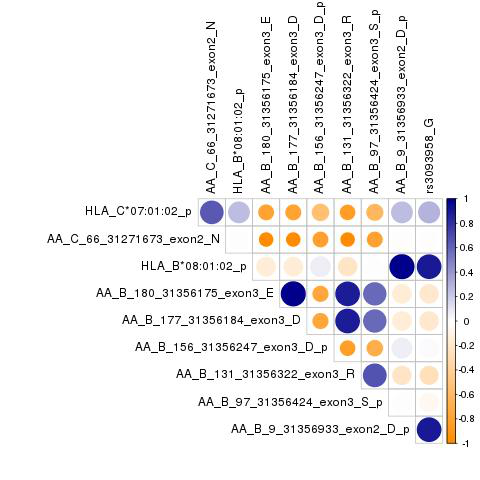
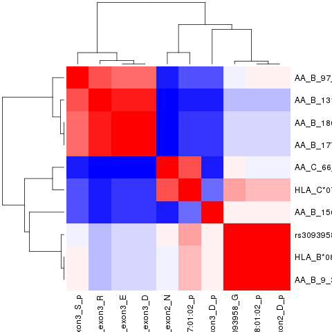

# Meta EOMG (USmerged + Itals) HLA analysis

**Start date:** 05-05-2021

**End date:** 05-05-2021

**Analysed by:** Ruth Chia

**Working directory:** `/data/NDRS_LNG/MyastheniaGravis/updated.April2020/MetaAnalysis.hg38.ByCohort.rerun/HLA/EOMG`

___


<h1>Table of Contents<span class="tocSkip"></span></h1>
<div class="toc"><ul class="toc-item"><li><span><a href="#Download-code-for-HATK" data-toc-modified-id="Download-code-for-HATK-1">Download code for HATK</a></span></li><li><span><a href="#Meta-from-Imputation.1000G" data-toc-modified-id="Meta-from-Imputation.1000G-2">Meta from Imputation.1000G</a></span><ul class="toc-item"><li><span><a href="#4field" data-toc-modified-id="4field-2.1">4field</a></span></li><li><span><a href="#4field-GLM-plink" data-toc-modified-id="4field-GLM-plink-2.2">4field-GLM-plink</a></span><ul class="toc-item"><li><span><a href="#plot-(use-HATK-function---to-get-manhattan-and-heatmap)" data-toc-modified-id="plot-(use-HATK-function---to-get-manhattan-and-heatmap)-2.2.1">plot (use HATK function - to get manhattan and heatmap)</a></span></li></ul></li></ul></li><li><span><a href="#Check-correlation-of-top-snp-from-GWAS-with-top-hit-from-HLA-fine-mapping" data-toc-modified-id="Check-correlation-of-top-snp-from-GWAS-with-top-hit-from-HLA-fine-mapping-3">Check correlation of top snp from GWAS with top hit from HLA fine mapping</a></span></li></ul></div>

## Download code for HATK

HATK(HLA Analysis Tool-Kit) is a collection of tools and modules to perform HLA fine-mapping analysis, which is to identify which HLA allele or amino acid position of the HLA gene is driving the disease


```python
!git clone https://github.com/WansonChoi/HATK.git
```

    Cloning into 'HATK'...
    remote: Enumerating objects: 2246, done.
    remote: Counting objects: 100% (206/206), done.
    remote: Compressing objects: 100% (135/135), done.
    remote: Total 2246 (delta 92), reused 163 (delta 66), pack-reused 2040
    Receiving objects: 100% (2246/2246), 169.10 MiB | 19.41 MiB/s, done.
    Resolving deltas: 100% (1089/1089), done.
    Checking out files: 100% (718/718), done.


## Meta from Imputation.1000G
### 4field


```bash
%%bash
cd HATK

DIR_US="/data/NDRS_LNG/MyastheniaGravis/updated.April2020/US/Imputation.HLA/Imputation.1000G.EOMG/4field"
DIR_Itals="/data/NDRS_LNG/MyastheniaGravis/updated.April2020/Itals/Imputation.HLA/Imputation.1000G.EOMG/4field"

out="/data/NDRS_LNG/MyastheniaGravis/updated.April2020/MetaAnalysis.hg38.ByCohort.rerun/HLA/EOMG"
mkdir $out/1000G
mkdir $out/1000G/4field

python HATK.py \
    --metaanalysis \
    --s1-logistic-result $DIR_US/RESULT_EOMG.USmerged.1000G_REF.EUR.hatk.chr6.4field.hg38.assoc.logistic \
    --s1-bim $DIR_US/RESULT_EOMG.USmerged.1000G_REF.EUR.hatk.chr6.4field.hg38.bim \
    --s2-logistic-result $DIR_Itals/RESULT_EOMG.Itals.1000G_REF.EUR.hatk.chr6.4field.hg38.assoc.logistic \
    --s2-bim $DIR_Itals/RESULT_EOMG.Itals.1000G_REF.EUR.hatk.chr6.4field.hg38.bim \
    --out $out/1000G/4field/RESULT_Meta.EOMG.overall.USmerged.Itals.HLA.hg38
```

    Namespace(Ggroup=False, HLA=None, NoCaption=False, Pgroup=False, aa=None, ar=None, bmarkergenerator=False, chped=None, condition=None, condition_list=None, covar=None, covar_name=None, dict_AA=None, dict_SNPS=None, fam=None, fourF=False, hat=None, heatmap=False, hg=None, hla2hped=False, hped=None, imgt=None, imgt2seq=False, imgt_dir=None, input=None, leave_NotFound=False, logistic=False, manhattan=False, maptable=None, metaanalysis=True, multiprocess=1, no_indel=False, nomencleaner=False, omnibus=False, oneF=False, out='/data/NDRS_LNG/MyastheniaGravis/updated.April2020/MetaAnalysis.hg38.ByCohort.rerun/HLA/EOMG/1000G/4field/RESULT_Meta.EOMG.overall.USmerged.Itals.HLA.hg38', phased=None, pheno=None, pheno_name=None, platform=None, point_color='#778899', point_size='15', reference_allele=None, rhped=None, s1_bim='/data/NDRS_LNG/MyastheniaGravis/updated.April2020/US/Imputation.HLA/Imputation.1000G.EOMG/4field/RESULT_EOMG.USmerged.1000G_REF.EUR.hatk.chr6.4field.hg38.bim', s1_logistic_result='/data/NDRS_LNG/MyastheniaGravis/updated.April2020/US/Imputation.HLA/Imputation.1000G.EOMG/4field/RESULT_EOMG.USmerged.1000G_REF.EUR.hatk.chr6.4field.hg38.assoc.logistic', s2_bim='/data/NDRS_LNG/MyastheniaGravis/updated.April2020/Itals/Imputation.HLA/Imputation.1000G.EOMG/4field/RESULT_EOMG.Itals.1000G_REF.EUR.hatk.chr6.4field.hg38.bim', s2_logistic_result='/data/NDRS_LNG/MyastheniaGravis/updated.April2020/Itals/Imputation.HLA/Imputation.1000G.EOMG/4field/RESULT_EOMG.Itals.1000G_REF.EUR.hatk.chr6.4field.hg38.assoc.logistic', save_intermediates=False, threeF=False, top_color='#FF0000', twoF=False, variants=None, yaxis_unit='10')
    
    [HLA_Study.py]: MetaAnalysis result : 
    /data/NDRS_LNG/MyastheniaGravis/updated.April2020/MetaAnalysis.hg38.ByCohort.rerun/HLA/EOMG/1000G/4field/RESULT_Meta.EOMG.overall.USmerged.Itals.HLA.hg38.meta


### 4field-GLM-plink

metal file: `/data/NDRS_LNG/MyastheniaGravis/updated.April2020/MetaAnalysis.hg38.ByCohort.rerun/HLA/EOMG/1000G/4field.GLM/metal.4field-GLM-plink.txt`

```
# THIS SCRIPT EXECUTES AN ANALYSIS OF TWO STUDIES - HLA imputed

# THE RESULTS FOR EACH STUDY ARE STORED IN FILES:
# /data/NDRS_LNG/MyastheniaGravis/updated.April2020/US/Imputation.HLA/Imputation.1000G.EOMG/4field/GLM/toMeta.RESULT_EOMG.USmerged.1000G_REF.EUR.hatk.chr6.4field.hg38.tab
# /data/NDRS_LNG/MyastheniaGravis/updated.April2020/Itals/Imputation.HLA/Imputation.1000G.EOMG/4field/GLM/toMeta.RESULT_EOMG.Itals.1000G_REF.EUR.hatk.chr6.4field.hg38.tab

SCHEME  STDERR
AVERAGEFREQ ON
MINMAXFREQ ON

# LOAD THE FIRST INPUT FILE
# UNCOMMENT THE NEXT LINE TO ENABLE GenomicControl CORRECTION
# GENOMICCONTROL ON

# === DESCRIBE AND PROCESS THE FIRST INPUT FILE ===
MARKER marker
ALLELE EffectAllele OtherAllele
FREQ   Freq_EffectAllele
EFFECT BETA
STDERR SE
PVALUE P
#WEIGHT OBS_CT
PROCESS /data/NDRS_LNG/MyastheniaGravis/updated.April2020/US/Imputation.HLA/Imputation.1000G.EOMG/4field/GLM/toMeta.RESULT_EOMG.USmerged.1000G_REF.EUR.hatk.chr6.4field.hg38.tab

# === DESCRIBE AND PROCESS ADDITIONAL INPUT FILE ===
PROCESS /data/NDRS_LNG/MyastheniaGravis/updated.April2020/Itals/Imputation.HLA/Imputation.1000G.EOMG/4field/GLM/toMeta.RESULT_EOMG.Itals.1000G_REF.EUR.hatk.chr6.4field.hg38.tab

OUTFILE META_EOMG.USmerged.Itals.UNRELATED.hg38.HLA.FreqBoth.glm .tbl
ANALYZE HETEROGENEITY
```


```bash
%%bash
out="/data/NDRS_LNG/MyastheniaGravis/updated.April2020/MetaAnalysis.hg38.ByCohort.rerun/HLA/EOMG"
#mkdir $out/1000G/4field.GLM
cd $out/1000G/4field.GLM

module load metal
metal /data/NDRS_LNG/MyastheniaGravis/updated.April2020/MetaAnalysis.hg38.ByCohort.rerun/HLA/EOMG/1000G/4field.GLM/metal.4field-GLM-plink.txt
```

    MetaAnalysis Helper - (c) 2007 - 2009 Goncalo Abecasis
    This version released on 2018-08-28
    
    # This program faciliates meta-analysis of genome-wide association studies.
    # Commonly used commands are listed below:
    #
    # Options for describing input files ...
    #   SEPARATOR        [WHITESPACE|COMMA|BOTH|TAB] (default = WHITESPACE)
    #   COLUMNCOUNTING   [STRICT|LENIENT]            (default = 'STRICT')
    #   MARKERLABEL      [LABEL]                     (default = 'MARKER')
    #   ALLELELABELS     [LABEL1 LABEL2]             (default = 'ALLELE1','ALLELE2')
    #   EFFECTLABEL      [LABEL|log(LABEL)]          (default = 'EFFECT')
    #   FLIP
    #
    # Options for filtering input files ...
    #   ADDFILTER        [LABEL CONDITION VALUE]     (example = ADDFILTER N > 10)
    #                    (available conditions are <, >, <=, >=, =, !=, IN)
    #   REMOVEFILTERS
    #
    # Options for sample size weighted meta-analysis ...
    #   WEIGHTLABEL      [LABEL]                     (default = 'N')
    #   PVALUELABEL      [LABEL]                     (default = 'PVALUE')
    #   DEFAULTWEIGHT    [NUMBER]                    (default = 1.0)
    #   MINWEIGHT        [NUMBER]                    (default = 1.0)
    #
    # Options for inverse variance weighted meta-analysis ...
    #   STDERRLABEL      [LABEL]                     (default = 'STDERR')
    #   SCHEME           [SAMPLESIZE|STDERR]         (default = SAMPLESIZE)
    #
    # Options to enable tracking of allele frequencies ...
    #   AVERAGEFREQ      [ON|OFF]                    (default = OFF)
    #   MINMAXFREQ       [ON|OFF]                    (default = OFF)
    #   FREQLABEL        [LABEL]                     (default = 'FREQ')
    #
    # Options to enable tracking of user defined variables ...
    #   CUSTOMVARIABLE   [VARNAME]
    #   LABEL            [VARNAME] AS [HEADER]
    #
    # Options to enable tracking of chromosomes and positions ...
    #   TRACKPOSITIONS   [ON|OFF]                    (default = OFF
    #   CHROMOSOMELABEL  [LABEL]                     (default = 'CHROMOSOME')
    #   POSITIONLABEL    [LABEL]                     (default = 'POSITION')
    #
    # Options to enable explicit strand information ...
    #   USESTRAND        [ON|OFF]                    (default = OFF)
    #   STRANDLABEL      [LABEL]                     (default = 'STRAND')
    #
    # Automatic genomic control correction of input statistics ...
    #   GENOMICCONTROL   [ON|OFF|VALUE|LIST snps.txt](default = OFF)
    #
    # Options to account for samples overlap ...
    #   OVERLAP          [ON|OFF]                    (default = OFF)
    #   ZCUTOFF          [NUMBER]                    (default = 1.0)
    #
    # Options for general analysis control ...
    #   PROCESSFILE      [FILENAME]
    #   OUTFILE          [PREFIX SUFFIX]             (default = 'METAANALYSIS','.TBL')
    #   MAXWARNINGS      [NUMBER]                    (default = 20)
    #   VERBOSE          [ON|OFF]                    (default = 'OFF')
    #   LOGPVALUE        [ON|OFF]                    (default = 'OFF')
    #   ANALYZE          [HETEROGENEITY]
    #   CLEAR
    
    # Options for general run control ...
    #   SOURCE           [SCRIPTFILE]
    #   RETURN
    #   QUIT
    
    # Processing commands in /data/NDRS_LNG/MyastheniaGravis/updated.April2020/MetaAnalysis.hg38.ByCohort.rerun/HLA/EOMG/1000G/4field.GLM/metal.4field-GLM-plink.txt ...
    ## Meta-analysis will be based on effect sizes and their standard errors ...
    ## Averaging of allele frequencies enabled
    ## Tracking of extreme allele frequencies enabled
    ## Set marker header to marker ...
    ## Set allele headers to EffectAllele and OtherAllele ...
    ## Set frequency header to Freq_EffectAllele ...
    ## Set effect header to BETA ...
    ## Set standard error header to SE ...
    ## Set p-value header to P ...
    ###########################################################################
    ## Processing file '/data/NDRS_LNG/MyastheniaGravis/updated.April2020/US/Imputation.HLA/Imputation.1000G.EOMG/4field/GLM/toMeta.RESULT_EOMG.USmerged.1000G_REF.EUR.hatk.chr6.4field.hg38.tab'
    ## Processed 6702 markers ...
    
    ###########################################################################
    ## Processing file '/data/NDRS_LNG/MyastheniaGravis/updated.April2020/Itals/Imputation.HLA/Imputation.1000G.EOMG/4field/GLM/toMeta.RESULT_EOMG.Itals.1000G_REF.EUR.hatk.chr6.4field.hg38.tab'
    ## Processed 10801 markers ...
    
    ## Set output file prefix and suffix to META_EOMG.USmerged.Itals.UNRELATED.hg38.HLA.FreqBoth.glm and .tbl ...
    ###########################################################################
    ## Running second pass analysis to evaluate heterogeneity...
    ## Processing file '/data/NDRS_LNG/MyastheniaGravis/updated.April2020/Itals/Imputation.HLA/Imputation.1000G.EOMG/4field/GLM/toMeta.RESULT_EOMG.Itals.1000G_REF.EUR.hatk.chr6.4field.hg38.tab'
    ## Processing file '/data/NDRS_LNG/MyastheniaGravis/updated.April2020/US/Imputation.HLA/Imputation.1000G.EOMG/4field/GLM/toMeta.RESULT_EOMG.USmerged.1000G_REF.EUR.hatk.chr6.4field.hg38.tab'
    
    ###########################################################################
    ## Executing meta-analysis ...
    ## Complete results will be stored in file 'META_EOMG.USmerged.Itals.UNRELATED.hg38.HLA.FreqBoth.glm1.tbl'
    ## Column descriptions will be stored in file 'META_EOMG.USmerged.Itals.UNRELATED.hg38.HLA.FreqBoth.glm1.tbl.info'
    ## Completed meta-analysis for 13761 markers!
    ## Smallest p-value is 9.119e-40 at marker 'HLA_B*08:01:02:6:31353872:a:p'
    
    ## Clearing all stored statistics ...
    # Clearing user defined filters ...


    [+] Loading metal  2018-08-28 


script to reformat meta output files before plotting: `ReformatMetaResults.addMAF.v2.HLA.R`

```
#!/usr/bin/env Rscript

args <- commandArgs(trailingOnly=TRUE)
if (length(args) != 4) {
  stop("USAGE: Rscript ReformatMetaResults.addMAF.v2.HLA.R args[1] args[2] args[3] args[4]
  where args[1] = metaResults
        args[2] = toMetaInput.US
        args[3] = toMetaInput.Itals
        args[4] = outputFileName")
}

# Load libraries
require(data.table)
require(tidyverse)


# Set variables
metaResults <- args[1]
toMetaInput.US <- args[2]
toMetaInput.Itals <- args[3]
outputFileName <- args[4]

# Read in files and reformat meta
meta0 <- fread(metaResults, header=T)

# make list of variants with chr,pos for merging with meta results
us.list <- fread(toMetaInput.US,header=T) %>% 
           select(marker,ID,CHROM,POS,OtherAllele,EffectAllele)
itals.list <- fread(toMetaInput.Itals,header=T) %>% 
           select(marker,ID,CHROM,POS,OtherAllele,EffectAllele)
list <- rbind(us.list,itals.list) %>% arrange(CHROM,POS) %>% distinct()

meta <- merge(meta0,list,by.x="MarkerName",by.y="marker",all.x=T)

meta$OA <- tolower(meta$OtherAllele)
meta$EA <- tolower(meta$EffectAllele)
meta$EffectAllele <- ifelse(meta$EA == meta$Allele1, meta$Allele1, meta$Allele2)
meta$OtherAllele <- ifelse(meta$EA == meta$Allele1, meta$Allele2, meta$Allele1)
meta$maf_EA.cases <- ifelse(meta$EA == meta$Allele1, meta$Freq1, 1 - meta$Freq1)
meta$beta <- ifelse(meta$EffectAllele == meta$Allele1, meta$Effect, meta$Effect*-1)

tmp1 <- meta %>% rename(P = `P-value`) %>% filter(P > 0.00000005)
tmp2 <- meta %>% rename(P = `P-value`) %>%
        filter(P < 0.00000005) %>%
        filter(Direction == "--" | Direction == "++")

data <- rbind(tmp1,tmp2) %>%
        mutate(CHROM = as.numeric(gsub("chr","",CHROM), POS = as.numeric(POS))) %>%
        filter(POS != is.na(POS)) %>%
        filter(HetISq <= 80) %>%
        filter(Direction == "--" | Direction == "+-" | Direction == "-+" | Direction == "++") %>%
        select(CHROM,POS,ID,MarkerName,EffectAllele,OtherAllele,maf_EA.cases,beta,StdErr,P,Direction,HetISq) %>%
        arrange(CHROM,POS)

dim(meta0)
dim(meta)
dim(data)

# Get frequency information
us <- fread(toMetaInput.US,header=T) %>%
      select(marker,Freq_EffectAllele,Freq_EffectAllele.CASE,Freq_EffectAllele.CTRL,
             ALLELE_CT,CASE_ALLELE_CT,CTRL_ALLELE_CT,
             EffectAllele_CT,EffectAllele_CT.CASE,EffectAllele_CT.CTRL)
colnames(us)[2:10] <- paste(colnames(us)[2:10],"_US",sep="")

itals <- fread(toMetaInput.Itals,header=T) %>%
         select(marker,Freq_EffectAllele,Freq_EffectAllele.CASE,Freq_EffectAllele.CTRL,
                ALLELE_CT,CASE_ALLELE_CT,CTRL_ALLELE_CT,
                EffectAllele_CT,EffectAllele_CT.CASE,EffectAllele_CT.CTRL)
colnames(itals)[2:10] <- paste(colnames(itals)[2:10],"_Italy",sep="")

both <- merge(us,itals,by="marker")

dim(us)
dim(itals)
dim(both)

both$Freq_EffectAllele <- (both$Freq_EffectAllele_US + both$Freq_EffectAllele_Italy)/2
both$Freq_EffectAllele.CASE <- (both$Freq_EffectAllele.CASE_US + both$Freq_EffectAllele.CASE_Italy)/2
both$Freq_EffectAllele.CTRL <- (both$Freq_EffectAllele.CTRL_US + both$Freq_EffectAllele.CTRL_Italy)/2

both$ALLELE_CT <- both$ALLELE_CT_US + both$ALLELE_CT_Italy
both$ALLELE_CT.CASE <- both$CASE_ALLELE_CT_US + both$CASE_ALLELE_CT_Italy
both$ALLELE_CT.CTRL <- both$CTRL_ALLELE_CT_US + both$CTRL_ALLELE_CT_Italy

both$EffectAllele_CT <- both$EffectAllele_CT_US + both$EffectAllele_CT_Italy
both$EffectAllele_CT.CASE <- both$EffectAllele_CT.CASE_US + both$EffectAllele_CT.CASE_Italy
both$EffectAllele_CT.CTRL <- both$EffectAllele_CT.CTRL_US + both$EffectAllele_CT.CTRL_Italy

both$maf_EA <- both$EffectAllele_CT/both$ALLELE_CT
both$maf_EA.CASE <- both$EffectAllele_CT.CASE/both$ALLELE_CT.CASE
both$maf_EA.CTRL <- both$EffectAllele_CT.CTRL/both$ALLELE_CT.CTRL
write.table(both,"MAF.USmerged.Itals.txt",sep="\t",quote=F,row.names=F,col.names=T)
            
freq <- both %>%
        select(marker,Freq_EffectAllele,Freq_EffectAllele.CASE,Freq_EffectAllele.CTRL,
              ALLELE_CT,ALLELE_CT.CASE,ALLELE_CT.CTRL,
              EffectAllele_CT,EffectAllele_CT.CASE,EffectAllele_CT.CTRL,
              maf_EA,maf_EA.CASE,maf_EA.CTRL)


# merge formatted meta results with frequency file
tmp <- merge(data,freq,by.x="MarkerName",by.y="marker")
data2 <- tmp %>% 
         select(CHROM,POS,ID,MarkerName,EffectAllele,OtherAllele,
                maf_EA,maf_EA.CASE,maf_EA.CTRL,beta,StdErr,P,Direction,HetISq)

write.table(data2,paste(args[4],".filteredDirection.HetISq80.TIDY.v2",".txt",sep=""),quote=F,row.names=F,col.names=T,sep="\t")
```


```bash
%%bash
cp ../Overall/ReformatMetaResults.addMAF.v2.HLA.R .

module load R/3.5.2
DIR="/data/NDRS_LNG/MyastheniaGravis/updated.April2020"
out="/data/NDRS_LNG/MyastheniaGravis/updated.April2020/MetaAnalysis.hg38.ByCohort.rerun/HLA/EOMG"

Rscript ReformatMetaResults.addMAF.v2.HLA.R \
$out/1000G/4field.GLM/META_EOMG.USmerged.Itals.UNRELATED.hg38.HLA.FreqBoth.glm1.tbl \
$DIR/US/Imputation.HLA/Imputation.1000G.EOMG/4field/GLM/toMeta.RESULT_EOMG.USmerged.1000G_REF.EUR.hatk.chr6.4field.hg38.tab \
$DIR/Itals/Imputation.HLA/Imputation.1000G.EOMG/4field/GLM/toMeta.RESULT_EOMG.Itals.1000G_REF.EUR.hatk.chr6.4field.hg38.tab \
$out/1000G/4field.GLM/META_EOMG.USmerged.Itals.UNRELATED.hg38.HLA.FreqBoth
```

    [1] 13761    15
    [1] 13761    24
    [1] 3390   12
    [1] 6702   10
    [1] 10801    10
    [1] 3741   19


    [-] Unloading gcc  9.2.0  ... 
    [-] Unloading GSL 2.6 for GCC 9.2.0 ... 
    [-] Unloading openmpi 4.0.5  for GCC 9.2.0 
    [-] Unloading ImageMagick  7.0.8  on cn3451 
    [-] Unloading HDF5  1.10.4 
    [-] Unloading NetCDF 4.7.4_gcc9.2.0 
    [-] Unloading pandoc  2.13  on cn3451 
    [-] Unloading pcre2 10.21  ... 
    [-] Unloading R 4.0.5 
    [+] Loading gcc  7.3.0  ... 
    [+] Loading GSL 2.4 for GCC 7.2.0 ... 
    [-] Unloading gcc  7.3.0  ... 
    [+] Loading gcc  7.3.0  ... 
    [+] Loading openmpi 3.0.2  for GCC 7.3.0 
    [+] Loading ImageMagick  7.0.8  on cn3451 
    [+] Loading HDF5  1.10.4 
    [+] Loading pandoc  2.13  on cn3451 
    [+] Loading R 3.5.2 
    
    The following have been reloaded with a version change:
      1) GSL/2.6_gcc-9.2.0 => GSL/2.4_gcc-7.2.0     3) gcc/9.2.0 => gcc/7.3.0
      2) R/4.0 => R/3.5.2
    
    Loading required package: data.table
    Loading required package: tidyverse
    -- Attaching packages --------------------------------------- tidyverse 1.2.1 --
    v ggplot2 3.3.2     v purrr   0.3.4
    v tibble  3.0.3     v dplyr   0.8.5
    v tidyr   0.8.3     v stringr 1.4.0
    v readr   1.3.1     v forcats 0.5.0
    -- Conflicts ------------------------------------------ tidyverse_conflicts() --
    x dplyr::between()   masks data.table::between()
    x dplyr::filter()    masks stats::filter()
    x dplyr::first()     masks data.table::first()
    x dplyr::lag()       masks stats::lag()
    x dplyr::last()      masks data.table::last()
    x purrr::transpose() masks data.table::transpose()


```python
import pandas as pd

pd.read_csv("/data/NDRS_LNG/MyastheniaGravis/updated.April2020/MetaAnalysis.hg38.ByCohort.rerun/HLA/EOMG/1000G/4field.GLM/META_EOMG.USmerged.Itals.UNRELATED.hg38.HLA.FreqBoth.filteredDirection.HetISq80.TIDY.v2.txt",sep="\t").head()
```


<div>
<style scoped>
    .dataframe tbody tr th:only-of-type {
        vertical-align: middle;
    }

    .dataframe tbody tr th {
        vertical-align: top;
    }

    .dataframe thead th {
        text-align: right;
    }
</style>
<table border="1" class="dataframe">
  <thead>
    <tr style="text-align: right;">
      <th></th>
      <th>CHROM</th>
      <th>POS</th>
      <th>ID</th>
      <th>MarkerName</th>
      <th>EffectAllele</th>
      <th>OtherAllele</th>
      <th>maf_EA</th>
      <th>maf_EA.CASE</th>
      <th>maf_EA.CTRL</th>
      <th>beta</th>
      <th>StdErr</th>
      <th>P</th>
      <th>Direction</th>
      <th>HetISq</th>
    </tr>
  </thead>
  <tbody>
    <tr>
      <th>0</th>
      <td>6</td>
      <td>29942594</td>
      <td>AA_A_-11_29942594_exon1_L</td>
      <td>AA_A_-11_29942594_exon1_L:6:29942594:a:p</td>
      <td>p</td>
      <td>a</td>
      <td>0.070329</td>
      <td>0.073109</td>
      <td>0.069720</td>
      <td>-0.0206</td>
      <td>0.1361</td>
      <td>0.8797</td>
      <td>++</td>
      <td>0.0</td>
    </tr>
    <tr>
      <th>1</th>
      <td>6</td>
      <td>29942594</td>
      <td>AA_A_-11_29942594_exon1_S</td>
      <td>AA_A_-11_29942594_exon1_S:6:29942594:p:a</td>
      <td>a</td>
      <td>p</td>
      <td>0.217778</td>
      <td>0.226050</td>
      <td>0.215968</td>
      <td>-0.0392</td>
      <td>0.0866</td>
      <td>0.6511</td>
      <td>--</td>
      <td>0.0</td>
    </tr>
    <tr>
      <th>2</th>
      <td>6</td>
      <td>29942594</td>
      <td>AA_A_-11_29942594_exon1_x</td>
      <td>AA_A_-11_29942594_exon1_x:6:29942594:a:p</td>
      <td>p</td>
      <td>a</td>
      <td>0.147449</td>
      <td>0.152941</td>
      <td>0.146247</td>
      <td>-0.0433</td>
      <td>0.1031</td>
      <td>0.6745</td>
      <td>+-</td>
      <td>0.0</td>
    </tr>
    <tr>
      <th>3</th>
      <td>6</td>
      <td>29942582</td>
      <td>AA_A_-15_29942582_exon1_L</td>
      <td>AA_A_-15_29942582_exon1_L:6:29942582:a:p</td>
      <td>p</td>
      <td>a</td>
      <td>0.456988</td>
      <td>0.473109</td>
      <td>0.453458</td>
      <td>0.0385</td>
      <td>0.0737</td>
      <td>0.6010</td>
      <td>-+</td>
      <td>63.9</td>
    </tr>
    <tr>
      <th>4</th>
      <td>6</td>
      <td>29942582</td>
      <td>AA_A_-15_29942582_exon1_V</td>
      <td>AA_A_-15_29942582_exon1_V:6:29942582:a:p</td>
      <td>p</td>
      <td>a</td>
      <td>0.395563</td>
      <td>0.373950</td>
      <td>0.400294</td>
      <td>-0.0160</td>
      <td>0.0760</td>
      <td>0.8329</td>
      <td>+-</td>
      <td>46.8</td>
    </tr>
  </tbody>
</table>
</div>


#### plot (use HATK function - to get manhattan and heatmap)


```bash
%%bash
# first need to reformat the meta output from plink glm to match the input for HATK
# i.e have column : CHR,SNP,BP,A1,TEST,NMISS,OR,SE,L95,U95,STAT,P

module load R/3.5.2
R --vanilla --no-save

require(data.table)
require(tidyverse)

data <- fread("1000G/4field.GLM/META_EOMG.USmerged.Itals.UNRELATED.hg38.HLA.FreqBoth.filteredDirection.HetISq80.TIDY.v2.txt",header=T)
data1 <- data %>%
         select(CHROM,ID,POS,EffectAllele,beta,StdErr,P) %>%
         mutate(OR = exp(beta)) %>%
         select(-beta)
data1$TEST <- "ADD"
data1$NMISS <- "NA"
data1$L95 <- "NA"
data1$U95 <- "NA"
data1$STAT <- "NA"
data1 <- data1 %>% select(CHROM,ID,POS,EffectAllele,TEST,NMISS,OR,StdErr,L95,U95,STAT,P)
colnames(data1) <- c("CHR","SNP","BP","A1","TEST","NMISS","OR","SE","L95","U95","STAT","P")
head(data1)
write.table(data1,"1000G/4field.GLM/META_EOMG.USmerged.Itals.UNRELATED.hg38.HLA.FreqBoth.filteredDirectionHetISq80MAF001overall.forHATK.assoc.logistic",sep=" ",quote=F,row.names=F,col.names=T)
```

    
    R version 3.5.2 (2018-12-20) -- "Eggshell Igloo"
    Copyright (C) 2018 The R Foundation for Statistical Computing
    Platform: x86_64-pc-linux-gnu (64-bit)
    
    R is free software and comes with ABSOLUTELY NO WARRANTY.
    You are welcome to redistribute it under certain conditions.
    Type 'license()' or 'licence()' for distribution details.
    
    R is a collaborative project with many contributors.
    Type 'contributors()' for more information and
    'citation()' on how to cite R or R packages in publications.
    
    Type 'demo()' for some demos, 'help()' for on-line help, or
    'help.start()' for an HTML browser interface to help.
    Type 'q()' to quit R.
    
    > 
    > require(data.table)
    > require(tidyverse)
    > 
    > data <- fread("1000G/4field.GLM/META_EOMG.USmerged.Itals.UNRELATED.hg38.HLA.FreqBoth.filteredDirection.HetISq80.TIDY.v2.txt",header=T)
    > data1 <- data %>%
    +          select(CHROM,ID,POS,EffectAllele,beta,StdErr,P) %>%
    +          mutate(OR = exp(beta)) %>%
    +          select(-beta)
    > data1$TEST <- "ADD"
    > data1$NMISS <- "NA"
    > data1$L95 <- "NA"
    > data1$U95 <- "NA"
    > data1$STAT <- "NA"
    > data1 <- data1 %>% select(CHROM,ID,POS,EffectAllele,TEST,NMISS,OR,StdErr,L95,U95,STAT,P)
    > colnames(data1) <- c("CHR","SNP","BP","A1","TEST","NMISS","OR","SE","L95","U95","STAT","P")
    > head(data1)
      CHR                       SNP       BP A1 TEST NMISS        OR     SE L95 U95
    1   6 AA_A_-11_29942594_exon1_L 29942594  p  ADD    NA 0.9796107 0.1361  NA  NA
    2   6 AA_A_-11_29942594_exon1_S 29942594  a  ADD    NA 0.9615584 0.0866  NA  NA
    3   6 AA_A_-11_29942594_exon1_x 29942594  p  ADD    NA 0.9576241 0.1031  NA  NA
    4   6 AA_A_-15_29942582_exon1_L 29942582  p  ADD    NA 1.0392507 0.0737  NA  NA
    5   6 AA_A_-15_29942582_exon1_V 29942582  p  ADD    NA 0.9841273 0.0760  NA  NA
    6   6 AA_A_-15_29942582_exon1_x 29942582  p  ADD    NA 0.9576241 0.1031  NA  NA
      STAT      P
    1   NA 0.8797
    2   NA 0.6511
    3   NA 0.6745
    4   NA 0.6010
    5   NA 0.8329
    6   NA 0.6745
    > write.table(data1,"1000G/4field.GLM/META_EOMG.USmerged.Itals.UNRELATED.hg38.HLA.FreqBoth.filteredDirectionHetISq80MAF001overall.forHATK.assoc.logistic",sep=" ",quote=F,row.names=F,col.names=T)
    > 


    [-] Unloading gcc  9.2.0  ... 
    [-] Unloading GSL 2.6 for GCC 9.2.0 ... 
    [-] Unloading openmpi 4.0.5  for GCC 9.2.0 
    [-] Unloading ImageMagick  7.0.8  on cn3451 
    [-] Unloading HDF5  1.10.4 
    [-] Unloading NetCDF 4.7.4_gcc9.2.0 
    [-] Unloading pandoc  2.13  on cn3451 
    [-] Unloading pcre2 10.21  ... 
    [-] Unloading R 4.0.5 
    [+] Loading gcc  7.3.0  ... 
    [+] Loading GSL 2.4 for GCC 7.2.0 ... 
    [-] Unloading gcc  7.3.0  ... 
    [+] Loading gcc  7.3.0  ... 
    [+] Loading openmpi 3.0.2  for GCC 7.3.0 
    [+] Loading ImageMagick  7.0.8  on cn3451 
    [+] Loading HDF5  1.10.4 
    [+] Loading pandoc  2.13  on cn3451 
    [+] Loading R 3.5.2 
    
    The following have been reloaded with a version change:
      1) GSL/2.6_gcc-9.2.0 => GSL/2.4_gcc-7.2.0     3) gcc/9.2.0 => gcc/7.3.0
      2) R/4.0 => R/3.5.2
    
    Loading required package: data.table
    Loading required package: tidyverse
    -- Attaching packages --------------------------------------- tidyverse 1.2.1 --
    v ggplot2 3.3.2     v purrr   0.3.4
    v tibble  3.0.3     v dplyr   0.8.5
    v tidyr   0.8.3     v stringr 1.4.0
    v readr   1.3.1     v forcats 0.5.0
    -- Conflicts ------------------------------------------ tidyverse_conflicts() --
    x dplyr::between()   masks data.table::between()
    x dplyr::filter()    masks stats::filter()
    x dplyr::first()     masks data.table::first()
    x dplyr::lag()       masks stats::lag()
    x dplyr::last()      masks data.table::last()
    x purrr::transpose() masks data.table::transpose()


```bash
%%bash
cd HATK/

python HATK.py \
    --manhattan \
    --ar ../1000G/4field.GLM/META_EOMG.USmerged.Itals.UNRELATED.hg38.HLA.FreqBoth.filteredDirectionHetISq80MAF001overall.forHATK.assoc.logistic \
    --imgt 3320 \
    --hg 38 \
    --yaxis-unit 5 \
    --out ../1000G/4field.GLM/META_EOMG.USmerged.Itals.UNRELATED.hg38.HLA.FreqBoth.filteredDirectionHetISq80MAF001overall
```

    Namespace(Ggroup=False, HLA=None, NoCaption=False, Pgroup=False, aa=None, ar=['../1000G/4field.GLM/META_EOMG.USmerged.Itals.UNRELATED.hg38.HLA.FreqBoth.filteredDirectionHetISq80MAF001overall.forHATK.assoc.logistic'], bmarkergenerator=False, chped=None, condition=None, condition_list=None, covar=None, covar_name=None, dict_AA=None, dict_SNPS=None, fam=None, fourF=False, hat=None, heatmap=False, hg='38', hla2hped=False, hped=None, imgt='3320', imgt2seq=False, imgt_dir=None, input=None, leave_NotFound=False, logistic=False, manhattan=True, maptable=None, metaanalysis=False, multiprocess=1, no_indel=False, nomencleaner=False, omnibus=False, oneF=False, out='../1000G/4field.GLM/META_EOMG.USmerged.Itals.UNRELATED.hg38.HLA.FreqBoth.filteredDirectionHetISq80MAF001overall', phased=None, pheno=None, pheno_name=None, platform=None, point_color='#778899', point_size='15', reference_allele=None, rhped=None, s1_bim=None, s1_logistic_result=None, s2_bim=None, s2_logistic_result=None, save_intermediates=False, threeF=False, top_color='#FF0000', twoF=False, variants=None, yaxis_unit='5')
    
    [HLA_Study.py]: Manhattan result : 
    ../1000G/4field.GLM/META_EOMG.USmerged.Itals.UNRELATED.hg38.HLA.FreqBoth.filteredDirectionHetISq80MAF001overall.pdf


## Check correlation of top snp from GWAS with top hit from HLA fine mapping

what to do:
1. Get genotype for `rs3093958` (chr6:31442744:A:G) from USmerged and Itals dataset (use plink --recode A function)
2. Get genotype for top marker at HLA-C and HLA-B region
3. Merge and calculate correlation


```python
import pandas as pd
data = pd.read_csv("1000G/4field.GLM/META_EOMG.USmerged.Itals.UNRELATED.hg38.HLA.FreqBoth.filteredDirection.HetISq80.TIDY.v2.txt",sep="\t")
data1 = data[(data['P'] < 0.00000000000000000005) &
             ((data['ID'].str.contains("HLA_B")) |
             (data['ID'].str.contains("HLA_C")) |
             (data['ID'].str.contains("AA_B")) |
             (data['ID'].str.contains("AA_C")))]
data1.to_csv('hla.signif.txt',sep="\t",index=False)
data1[['ID']].to_csv('hlaList.txt',sep="\t",index=False,header=False)
data1

```


<div>
<style scoped>
    .dataframe tbody tr th:only-of-type {
        vertical-align: middle;
    }

    .dataframe tbody tr th {
        vertical-align: top;
    }

    .dataframe thead th {
        text-align: right;
    }
</style>
<table border="1" class="dataframe">
  <thead>
    <tr style="text-align: right;">
      <th></th>
      <th>CHROM</th>
      <th>POS</th>
      <th>ID</th>
      <th>MarkerName</th>
      <th>EffectAllele</th>
      <th>OtherAllele</th>
      <th>maf_EA</th>
      <th>maf_EA.CASE</th>
      <th>maf_EA.CTRL</th>
      <th>beta</th>
      <th>StdErr</th>
      <th>P</th>
      <th>Direction</th>
      <th>HetISq</th>
    </tr>
  </thead>
  <tbody>
    <tr>
      <th>152</th>
      <td>6</td>
      <td>31356322</td>
      <td>AA_B_131_31356322_exon3</td>
      <td>AA_B_131_31356322_exon3:6:31356322:S:R</td>
      <td>r</td>
      <td>s</td>
      <td>0.295653</td>
      <td>0.384874</td>
      <td>0.276122</td>
      <td>0.7694</td>
      <td>0.0821</td>
      <td>7.481000e-21</td>
      <td>++</td>
      <td>0.0</td>
    </tr>
    <tr>
      <th>157</th>
      <td>6</td>
      <td>31356247</td>
      <td>AA_B_156_31356247_exon3_D</td>
      <td>AA_B_156_31356247_exon3_D:6:31356247:a:p</td>
      <td>p</td>
      <td>a</td>
      <td>0.241322</td>
      <td>0.352101</td>
      <td>0.217071</td>
      <td>0.7608</td>
      <td>0.0820</td>
      <td>1.684000e-20</td>
      <td>--</td>
      <td>0.0</td>
    </tr>
    <tr>
      <th>165</th>
      <td>6</td>
      <td>31356184</td>
      <td>AA_B_177_31356184_exon3</td>
      <td>AA_B_177_31356184_exon3:6:31356184:E:D</td>
      <td>d</td>
      <td>e</td>
      <td>0.280863</td>
      <td>0.371429</td>
      <td>0.261038</td>
      <td>0.7848</td>
      <td>0.0833</td>
      <td>4.270000e-21</td>
      <td>++</td>
      <td>0.0</td>
    </tr>
    <tr>
      <th>167</th>
      <td>6</td>
      <td>31356175</td>
      <td>AA_B_180_31356175_exon3</td>
      <td>AA_B_180_31356175_exon3:6:31356175:Q:E</td>
      <td>e</td>
      <td>q</td>
      <td>0.280863</td>
      <td>0.371429</td>
      <td>0.261038</td>
      <td>0.7848</td>
      <td>0.0833</td>
      <td>4.270000e-21</td>
      <td>++</td>
      <td>0.0</td>
    </tr>
    <tr>
      <th>213</th>
      <td>6</td>
      <td>31356424</td>
      <td>AA_B_97_31356424_exon3_S</td>
      <td>AA_B_97_31356424_exon3_S:6:31356424:a:p</td>
      <td>p</td>
      <td>a</td>
      <td>0.250528</td>
      <td>0.339496</td>
      <td>0.231052</td>
      <td>0.8117</td>
      <td>0.0852</td>
      <td>1.694000e-21</td>
      <td>--</td>
      <td>0.0</td>
    </tr>
    <tr>
      <th>220</th>
      <td>6</td>
      <td>31356933</td>
      <td>AA_B_9_31356933_exon2_D</td>
      <td>AA_B_9_31356933_exon2_D:6:31356933:a:p</td>
      <td>p</td>
      <td>a</td>
      <td>0.129188</td>
      <td>0.260504</td>
      <td>0.100442</td>
      <td>1.3632</td>
      <td>0.1033</td>
      <td>9.119000e-40</td>
      <td>--</td>
      <td>0.0</td>
    </tr>
    <tr>
      <th>351</th>
      <td>6</td>
      <td>31271673</td>
      <td>AA_C_66_31271673_exon2</td>
      <td>AA_C_66_31271673_exon2:6:31271673:K:N</td>
      <td>n</td>
      <td>k</td>
      <td>0.224117</td>
      <td>0.373109</td>
      <td>0.191501</td>
      <td>0.9457</td>
      <td>0.0838</td>
      <td>1.507000e-29</td>
      <td>--</td>
      <td>79.3</td>
    </tr>
    <tr>
      <th>596</th>
      <td>6</td>
      <td>31353872</td>
      <td>HLA_B*08:01:02</td>
      <td>HLA_B*08:01:02:6:31353872:a:p</td>
      <td>p</td>
      <td>a</td>
      <td>0.129188</td>
      <td>0.260504</td>
      <td>0.100442</td>
      <td>1.3632</td>
      <td>0.1033</td>
      <td>9.119000e-40</td>
      <td>--</td>
      <td>0.0</td>
    </tr>
    <tr>
      <th>645</th>
      <td>6</td>
      <td>31268749</td>
      <td>HLA_C*07:01:02</td>
      <td>HLA_C*07:01:02:6:31268749:a:p</td>
      <td>p</td>
      <td>a</td>
      <td>0.185783</td>
      <td>0.330252</td>
      <td>0.154157</td>
      <td>1.0676</td>
      <td>0.0896</td>
      <td>1.008000e-32</td>
      <td>--</td>
      <td>75.1</td>
    </tr>
  </tbody>
</table>
</div>


```bash
%%bash
mkdir Correlation
cd Correlation
# get genotype for rs3093958

## US
DIR="/data/NDRS_LNG/MyastheniaGravis/updated.April2020/US"

awk '{print $1,$2}' $DIR/Analysis.GLM.Onset.hg38/US.JointPostImputation/EOMG/COVARIATES.USmerged.EOMG.forImputed.txt > SampleList.EOMG.USmerged.FIDspaceIID.forImputed.txt

echo "plink \
--vcf $DIR/Analysis.GLM.hg38/US.JointPostImputation/merged.vcf/US.chr6.vcf.gz \
--double-id \
--snp chr6:31442744:A:G \
--remove $DIR/Analysis.GLM.hg38/US.JointPostImputation/SamplesToRemove.dbGAP.FID_IID.forImputed.txt \
--keep SampleList.EOMG.USmerged.FIDspaceIID.forImputed.txt \
--pheno $DIR/Analysis.GLM.Onset.hg38/US.JointPostImputation/EOMG/COVARIATES.USmerged.EOMG.forImputed.txt \
--pheno-name PHENO \
--recode A \
--out EOMG.USmerged.UNRELATED.rs3093958" > subset1.swarm

swarm --file subset1.swarm --logdir swarmOE_Corr -g 120 --time 14:00:00 --module plink/1.9.0-beta4.4
```

    14445928


```bash
%%bash
cd Correlation
# get genotype for rs3093958

## Itals
DIR="/data/NDRS_LNG/MyastheniaGravis/updated.April2020/Itals"

awk '{print $1,$2}' $DIR/Analysis.GLM.Onset.hg38.rerun/EOMG/COVARIATES.Itals.EOMG.forImputed.txt > SampleList.EOMG.Itals.FIDspaceIID.forImputed.txt

echo "plink \
--vcf $DIR/Imputation.hg38/chr6.dose.vcf.gz \
--double-id \
--snp chr6:31442744:A:G \
--keep SampleList.EOMG.Itals.FIDspaceIID.forImputed.txt \
--pheno $DIR/Analysis.GLM.Onset.hg38.rerun/EOMG/COVARIATES.Itals.EOMG.forImputed.txt \
--pheno-name PHENO \
--recode A \
--out EOMG.Itals.UNRELATED.rs3093958" > subset2.swarm

swarm --file subset2.swarm --logdir swarmOE_Corr -g 120 --time 04:00:00 --module plink/1.9.0-beta4.4
```

    14447711


```python
!head -n 1 1000G/4field.GLM/META_EOMG.USmerged.Itals.UNRELATED.hg38.HLA.FreqBoth.filteredDirection.HetISq80.TIDY.v2.txt | tr '\t' '\n' | cat -n
```

         1	CHROM
         2	POS
         3	ID
         4	MarkerName
         5	EffectAllele
         6	OtherAllele
         7	maf_EA
         8	maf_EA.CASE
         9	maf_EA.CTRL
        10	beta
        11	StdErr
        12	P
        13	Direction
        14	HetISq


```bash
%%bash
cd Correlation
# get genotype for signif HLA types

module load plink/1.9.0-beta4.4

## US + Itals
DIR="/data/NDRS_LNG/MyastheniaGravis/updated.April2020/MetaAnalysis.hg38.ByCohort.rerun/HLA/Overall/ForceMerge.US.Itals.geno"

plink \
--bfile $DIR/RESULT_MG.USmerged.Itals.1000G_REF.EUR.hatk.chr6.4field.hg38 \
--extract ../hlaList.txt \
--pheno $DIR/PhenoInfo.US.Itals_mg_noDups.UNRELATED.SampleNameUpdated.txt \
--pheno-name PHENO \
--recode A \
--out EOMG.USmerged.Itals.UNRELATED.hlaSignif

```

    PLINK v1.90b4.4 64-bit (21 May 2017)           www.cog-genomics.org/plink/1.9/
    (C) 2005-2017 Shaun Purcell, Christopher Chang   GNU General Public License v3
    Logging to EOMG.USmerged.Itals.UNRELATED.hlaSignif.log.
    Options in effect:
      --bfile /data/NDRS_LNG/MyastheniaGravis/updated.April2020/MetaAnalysis.hg38.ByCohort.rerun/HLA/Overall/ForceMerge.US.Itals.geno/RESULT_MG.USmerged.Itals.1000G_REF.EUR.hatk.chr6.4field.hg38
      --extract ../hlaList.txt
      --out EOMG.USmerged.Itals.UNRELATED.hlaSignif
      --pheno /data/NDRS_LNG/MyastheniaGravis/updated.April2020/MetaAnalysis.hg38.ByCohort.rerun/HLA/Overall/ForceMerge.US.Itals.geno/PhenoInfo.US.Itals_mg_noDups.UNRELATED.SampleNameUpdated.txt
      --pheno-name PHENO
      --recode A
    
    257652 MB RAM detected; reserving 128826 MB for main workspace.
    6239 variants loaded from .bim file.
    43766 people (14833 males, 28933 females) loaded from .fam.
    39485 phenotype values present after --pheno.
    --extract: 9 variants remaining.
    Using 1 thread (no multithreaded calculations invoked).
    Before main variant filters, 43766 founders and 0 nonfounders present.
    Calculating allele frequencies... 0%1%2%3%4%5%6%7%8%9%10%11%12%13%14%15%16%17%18%19%20%21%22%23%24%25%26%27%28%29%30%31%32%33%34%35%36%37%38%39%40%41%42%43%44%45%46%47%48%49%50%51%52%53%54%55%56%57%58%59%60%61%62%63%64%65%66%67%68%69%70%71%72%73%74%75%76%77%78%79%80%81%82%83%84%85%86%87%88%89%90%91%92%93%94%95%96%97%98%99% done.
    9 variants and 43766 people pass filters and QC.
    Among remaining phenotypes, 1883 are cases and 37602 are controls.  (4281
    phenotypes are missing.)
    --recode A to EOMG.USmerged.Itals.UNRELATED.hlaSignif.raw ... 0%1%2%3%4%5%6%7%8%9%10%11%12%13%14%15%16%17%18%19%20%21%22%23%24%25%26%27%28%29%30%31%32%33%34%35%36%37%38%39%40%41%42%43%44%45%46%47%48%49%50%51%52%53%54%55%56%57%58%59%60%61%62%63%64%65%66%67%68%69%70%71%72%73%74%75%76%77%78%79%80%81%82%83%84%85%86%87%88%89%90%91%92%93%94%95%96%97%98%99%done.


    [-] Unloading plink  1.9.0-beta4.4  on cn3451 
    [+] Loading plink  1.9.0-beta4.4  on cn3451 


```bash
%%bash
# Merge genotype data and run correlation matrix
cd Correlation/

module load R/3.5.2
R --vanilla --no-save

require(data.table)
require(tidyverse)
require(Hmisc)
library(corrplot)
library(RColorBrewer)

pheno <- fread("/data/NDRS_LNG/MyastheniaGravis/updated.April2020/MetaAnalysis.hg38.ByCohort.rerun/HLA/Overall/ForceMerge.US.Itals.geno/PhenoInfo.US.Itals_mg_noDups.UNRELATED.SampleNameUpdated.txt",header=T) %>%
         filter(!is.na(GENDER) & !is.na(age_at_onset))

hla <- fread("EOMG.USmerged.Itals.UNRELATED.hlaSignif.raw",header=T) %>% select(-FID,-MAT,-PAT)
hlaInfo <- fread("../hla.signif.txt",header=T)

temp <- fread("EOMG.Itals.UNRELATED.rs3093958.raw",header=T) %>%
           select(-FID) %>% rename(FID_IID = IID)        
itals <- merge(temp,pheno[,c("FID_IID","IID")],by="FID_IID") %>% select(-FID_IID,-MAT,-PAT,-SEX)

temp <- fread("EOMG.USmerged.UNRELATED.rs3093958.raw",header=T) %>%
           select(-FID) %>% rename(FID_IID = IID)        
us <- merge(temp,pheno[,c("FID_IID","IID")],by="FID_IID") %>% select(-FID_IID,-MAT,-PAT,-SEX)

snps <- rbind(us,itals)

# order by variant position. Manually arrange it.
hla.snps <- merge(snps,hla,by=c("IID","PHENOTYPE")) %>%
            filter(IID %in% pheno$IID) %>%
            select(IID,PHENOTYPE,SEX,
                   `HLA_C*07:01:02_p`, AA_C_66_31271673_exon2_N,`HLA_B*08:01:02_p`,
                   AA_B_180_31356175_exon3_E,AA_B_177_31356184_exon3_D,
                   AA_B_156_31356247_exon3_D_p,AA_B_131_31356322_exon3_R,
                   AA_B_97_31356424_exon3_S_p,AA_B_9_31356933_exon2_D_p,`chr6:31442744:A:G_G`) %>%
            rename(rs3093958_G = `chr6:31442744:A:G_G`)
rownames(hla.snps) <- hla.snps$IID

data1 <- as.matrix(hla.snps %>% select(-IID,-SEX,-PHENOTYPE))

res2 <- rcorr(as.matrix(data1))
res2

# ++++++++++++++++++++++++++++
# flattenCorrMatrix
# ++++++++++++++++++++++++++++
# cormat : matrix of the correlation coefficients
# pmat : matrix of the correlation p-values
flattenCorrMatrix <- function(cormat, pmat) {
  ut <- upper.tri(cormat)
  data.frame(
    row = rownames(cormat)[row(cormat)[ut]],
    column = rownames(cormat)[col(cormat)[ut]],
    cor  =(cormat)[ut],
    p = pmat[ut]
    )
}
res3 <- flattenCorrMatrix(res2$r, res2$P)
write.table(res3,"CorrPlot_EOMG.HLAtypes.vs.GWAShits.txt",sep="\t",quote=F,row.names=F,col.names=T)
         
col <- colorRampPalette(c("darkorange","white","darkblue"))
jpeg(file = "CorrPlot_EOMG.HLAtypes.vs.GWAShits.jpeg")     
corrplot(res2$r, type="upper",tl.col = "black",col=col(200),
         p.mat = res2$P, sig.level = 0.01, insig = "blank", diag = FALSE, 
         number.cex = 0.5, number.digits = 2)
dev.off()  

pdf(file = "CorrPlot_EOMG.HLAtypes.vs.GWAShits.pdf")     
corrplot(res2$r, type="upper",tl.col = "black",col=col(200),
         p.mat = res2$P, sig.level = 0.01, insig = "blank", diag = FALSE, 
         number.cex = 0.5, number.digits = 2)
dev.off()   
        
jpeg(file = "Heatmap_EOMG.HLAtypes.vs.GWAShits.jpeg")       
col<- colorRampPalette(c("blue", "white", "red"))(20)
heatmap(x = res2$r, col = col, symm = TRUE)
dev.off() 

pdf(file = "Heatmap_EOMG.HLAtypes.vs.GWAShits.pdf")       
col<- colorRampPalette(c("blue", "white", "red"))(20)
heatmap(x = res2$r, col = col, symm = TRUE)
dev.off() 
```

    
    R version 3.5.2 (2018-12-20) -- "Eggshell Igloo"
    Copyright (C) 2018 The R Foundation for Statistical Computing
    Platform: x86_64-pc-linux-gnu (64-bit)
    
    R is free software and comes with ABSOLUTELY NO WARRANTY.
    You are welcome to redistribute it under certain conditions.
    Type 'license()' or 'licence()' for distribution details.
    
    R is a collaborative project with many contributors.
    Type 'contributors()' for more information and
    'citation()' on how to cite R or R packages in publications.
    
    Type 'demo()' for some demos, 'help()' for on-line help, or
    'help.start()' for an HTML browser interface to help.
    Type 'q()' to quit R.
    
    > 
    > require(data.table)
    > require(tidyverse)
    > require(Hmisc)
    > library(corrplot)
    > library(RColorBrewer)
    > 
    > pheno <- fread("/data/NDRS_LNG/MyastheniaGravis/updated.April2020/MetaAnalysis.hg38.ByCohort.rerun/HLA/Overall/ForceMerge.US.Itals.geno/PhenoInfo.US.Itals_mg_noDups.UNRELATED.SampleNameUpdated.txt",header=T) %>%
    +          filter(!is.na(GENDER) & !is.na(age_at_onset))
    > 
    > hla <- fread("EOMG.USmerged.Itals.UNRELATED.hlaSignif.raw",header=T) %>% select(-FID,-MAT,-PAT)
    > hlaInfo <- fread("../hla.signif.txt",header=T)
    > 
    > temp <- fread("EOMG.Itals.UNRELATED.rs3093958.raw",header=T) %>%
    +            select(-FID) %>% rename(FID_IID = IID)        
    > itals <- merge(temp,pheno[,c("FID_IID","IID")],by="FID_IID") %>% select(-FID_IID,-MAT,-PAT,-SEX)
    > 
    > temp <- fread("EOMG.USmerged.UNRELATED.rs3093958.raw",header=T) %>%
    +            select(-FID) %>% rename(FID_IID = IID)        
    > us <- merge(temp,pheno[,c("FID_IID","IID")],by="FID_IID") %>% select(-FID_IID,-MAT,-PAT,-SEX)
    > 
    > snps <- rbind(us,itals)
    > 
    > # order by variant position. Manually arrange it.
    > hla.snps <- merge(snps,hla,by=c("IID","PHENOTYPE")) %>%
    +             filter(IID %in% pheno$IID) %>%
    +             select(IID,PHENOTYPE,SEX,
    +                    `HLA_C*07:01:02_p`, AA_C_66_31271673_exon2_N,`HLA_B*08:01:02_p`,
    +                    AA_B_180_31356175_exon3_E,AA_B_177_31356184_exon3_D,
    +                    AA_B_156_31356247_exon3_D_p,AA_B_131_31356322_exon3_R,
    +                    AA_B_97_31356424_exon3_S_p,AA_B_9_31356933_exon2_D_p,`chr6:31442744:A:G_G`) %>%
    +             rename(rs3093958_G = `chr6:31442744:A:G_G`)
    > rownames(hla.snps) <- hla.snps$IID
    > 
    > data1 <- as.matrix(hla.snps %>% select(-IID,-SEX,-PHENOTYPE))
    > 
    > res2 <- rcorr(as.matrix(data1))
    > res2
                                HLA_C*07:01:02_p AA_C_66_31271673_exon2_N
    HLA_C*07:01:02_p                        1.00                     0.88
    AA_C_66_31271673_exon2_N                0.88                     1.00
    HLA_B*08:01:02_p                        0.75                     0.66
    AA_B_180_31356175_exon3_E               0.39                     0.32
    AA_B_177_31356184_exon3_D               0.39                     0.32
    AA_B_156_31356247_exon3_D_p             0.47                     0.38
    AA_B_131_31356322_exon3_R               0.37                     0.32
    AA_B_97_31356424_exon3_S_p              0.45                     0.38
    AA_B_9_31356933_exon2_D_p               0.75                     0.66
    rs3093958_G                             0.76                     0.66
                                HLA_B*08:01:02_p AA_B_180_31356175_exon3_E
    HLA_C*07:01:02_p                        0.75                      0.39
    AA_C_66_31271673_exon2_N                0.66                      0.32
    HLA_B*08:01:02_p                        1.00                      0.61
    AA_B_180_31356175_exon3_E               0.61                      1.00
    AA_B_177_31356184_exon3_D               0.61                      1.00
    AA_B_156_31356247_exon3_D_p             0.68                      0.40
    AA_B_131_31356322_exon3_R               0.58                      0.97
    AA_B_97_31356424_exon3_S_p              0.66                      0.86
    AA_B_9_31356933_exon2_D_p               1.00                      0.61
    rs3093958_G                             0.97                      0.59
                                AA_B_177_31356184_exon3_D
    HLA_C*07:01:02_p                                 0.39
    AA_C_66_31271673_exon2_N                         0.32
    HLA_B*08:01:02_p                                 0.61
    AA_B_180_31356175_exon3_E                        1.00
    AA_B_177_31356184_exon3_D                        1.00
    AA_B_156_31356247_exon3_D_p                      0.40
    AA_B_131_31356322_exon3_R                        0.97
    AA_B_97_31356424_exon3_S_p                       0.86
    AA_B_9_31356933_exon2_D_p                        0.61
    rs3093958_G                                      0.59
                                AA_B_156_31356247_exon3_D_p
    HLA_C*07:01:02_p                                   0.47
    AA_C_66_31271673_exon2_N                           0.38
    HLA_B*08:01:02_p                                   0.68
    AA_B_180_31356175_exon3_E                          0.40
    AA_B_177_31356184_exon3_D                          0.40
    AA_B_156_31356247_exon3_D_p                        1.00
    AA_B_131_31356322_exon3_R                          0.37
    AA_B_97_31356424_exon3_S_p                         0.42
    AA_B_9_31356933_exon2_D_p                          0.68
    rs3093958_G                                        0.66
                                AA_B_131_31356322_exon3_R
    HLA_C*07:01:02_p                                 0.37
    AA_C_66_31271673_exon2_N                         0.32
    HLA_B*08:01:02_p                                 0.58
    AA_B_180_31356175_exon3_E                        0.97
    AA_B_177_31356184_exon3_D                        0.97
    AA_B_156_31356247_exon3_D_p                      0.37
    AA_B_131_31356322_exon3_R                        1.00
    AA_B_97_31356424_exon3_S_p                       0.89
    AA_B_9_31356933_exon2_D_p                        0.58
    rs3093958_G                                      0.57
                                AA_B_97_31356424_exon3_S_p
    HLA_C*07:01:02_p                                  0.45
    AA_C_66_31271673_exon2_N                          0.38
    HLA_B*08:01:02_p                                  0.66
    AA_B_180_31356175_exon3_E                         0.86
    AA_B_177_31356184_exon3_D                         0.86
    AA_B_156_31356247_exon3_D_p                       0.42
    AA_B_131_31356322_exon3_R                         0.89
    AA_B_97_31356424_exon3_S_p                        1.00
    AA_B_9_31356933_exon2_D_p                         0.66
    rs3093958_G                                       0.64
                                AA_B_9_31356933_exon2_D_p rs3093958_G
    HLA_C*07:01:02_p                                 0.75        0.76
    AA_C_66_31271673_exon2_N                         0.66        0.66
    HLA_B*08:01:02_p                                 1.00        0.97
    AA_B_180_31356175_exon3_E                        0.61        0.59
    AA_B_177_31356184_exon3_D                        0.61        0.59
    AA_B_156_31356247_exon3_D_p                      0.68        0.66
    AA_B_131_31356322_exon3_R                        0.58        0.57
    AA_B_97_31356424_exon3_S_p                       0.66        0.64
    AA_B_9_31356933_exon2_D_p                        1.00        0.97
    rs3093958_G                                      0.97        1.00
    
    n= 3313 
    
    
    P
                                HLA_C*07:01:02_p AA_C_66_31271673_exon2_N
    HLA_C*07:01:02_p                              0                      
    AA_C_66_31271673_exon2_N     0                                       
    HLA_B*08:01:02_p             0                0                      
    AA_B_180_31356175_exon3_E    0                0                      
    AA_B_177_31356184_exon3_D    0                0                      
    AA_B_156_31356247_exon3_D_p  0                0                      
    AA_B_131_31356322_exon3_R    0                0                      
    AA_B_97_31356424_exon3_S_p   0                0                      
    AA_B_9_31356933_exon2_D_p    0                0                      
    rs3093958_G                  0                0                      
                                HLA_B*08:01:02_p AA_B_180_31356175_exon3_E
    HLA_C*07:01:02_p             0                0                       
    AA_C_66_31271673_exon2_N     0                0                       
    HLA_B*08:01:02_p                              0                       
    AA_B_180_31356175_exon3_E    0                                        
    AA_B_177_31356184_exon3_D    0                0                       
    AA_B_156_31356247_exon3_D_p  0                0                       
    AA_B_131_31356322_exon3_R    0                0                       
    AA_B_97_31356424_exon3_S_p   0                0                       
    AA_B_9_31356933_exon2_D_p    0                0                       
    rs3093958_G                  0                0                       
                                AA_B_177_31356184_exon3_D
    HLA_C*07:01:02_p             0                       
    AA_C_66_31271673_exon2_N     0                       
    HLA_B*08:01:02_p             0                       
    AA_B_180_31356175_exon3_E    0                       
    AA_B_177_31356184_exon3_D                            
    AA_B_156_31356247_exon3_D_p  0                       
    AA_B_131_31356322_exon3_R    0                       
    AA_B_97_31356424_exon3_S_p   0                       
    AA_B_9_31356933_exon2_D_p    0                       
    rs3093958_G                  0                       
                                AA_B_156_31356247_exon3_D_p
    HLA_C*07:01:02_p             0                         
    AA_C_66_31271673_exon2_N     0                         
    HLA_B*08:01:02_p             0                         
    AA_B_180_31356175_exon3_E    0                         
    AA_B_177_31356184_exon3_D    0                         
    AA_B_156_31356247_exon3_D_p                            
    AA_B_131_31356322_exon3_R    0                         
    AA_B_97_31356424_exon3_S_p   0                         
    AA_B_9_31356933_exon2_D_p    0                         
    rs3093958_G                  0                         
                                AA_B_131_31356322_exon3_R
    HLA_C*07:01:02_p             0                       
    AA_C_66_31271673_exon2_N     0                       
    HLA_B*08:01:02_p             0                       
    AA_B_180_31356175_exon3_E    0                       
    AA_B_177_31356184_exon3_D    0                       
    AA_B_156_31356247_exon3_D_p  0                       
    AA_B_131_31356322_exon3_R                            
    AA_B_97_31356424_exon3_S_p   0                       
    AA_B_9_31356933_exon2_D_p    0                       
    rs3093958_G                  0                       
                                AA_B_97_31356424_exon3_S_p
    HLA_C*07:01:02_p             0                        
    AA_C_66_31271673_exon2_N     0                        
    HLA_B*08:01:02_p             0                        
    AA_B_180_31356175_exon3_E    0                        
    AA_B_177_31356184_exon3_D    0                        
    AA_B_156_31356247_exon3_D_p  0                        
    AA_B_131_31356322_exon3_R    0                        
    AA_B_97_31356424_exon3_S_p                            
    AA_B_9_31356933_exon2_D_p    0                        
    rs3093958_G                  0                        
                                AA_B_9_31356933_exon2_D_p rs3093958_G
    HLA_C*07:01:02_p             0                         0         
    AA_C_66_31271673_exon2_N     0                         0         
    HLA_B*08:01:02_p             0                         0         
    AA_B_180_31356175_exon3_E    0                         0         
    AA_B_177_31356184_exon3_D    0                         0         
    AA_B_156_31356247_exon3_D_p  0                         0         
    AA_B_131_31356322_exon3_R    0                         0         
    AA_B_97_31356424_exon3_S_p   0                         0         
    AA_B_9_31356933_exon2_D_p                              0         
    rs3093958_G                  0                                   
    > 
    > # ++++++++++++++++++++++++++++
    > # flattenCorrMatrix
    > # ++++++++++++++++++++++++++++
    > # cormat : matrix of the correlation coefficients
    > # pmat : matrix of the correlation p-values
    > flattenCorrMatrix <- function(cormat, pmat) {
    +   ut <- upper.tri(cormat)
    +   data.frame(
    +     row = rownames(cormat)[row(cormat)[ut]],
    +     column = rownames(cormat)[col(cormat)[ut]],
    +     cor  =(cormat)[ut],
    +     p = pmat[ut]
    +     )
    + }
    > res3 <- flattenCorrMatrix(res2$r, res2$P)
    > write.table(res3,"CorrPlot_EOMG.HLAtypes.vs.GWAShits.txt",sep="\t",quote=F,row.names=F,col.names=T)
    >          
    > col <- colorRampPalette(c("darkorange","white","darkblue"))
    > jpeg(file = "CorrPlot_EOMG.HLAtypes.vs.GWAShits.jpeg")     
    > corrplot(res2$r, type="upper",tl.col = "black",col=col(200),
    +          p.mat = res2$P, sig.level = 0.01, insig = "blank", diag = FALSE, 
    +          number.cex = 0.5, number.digits = 2)
    > dev.off()  
    null device 
              1 
    > 
    > pdf(file = "CorrPlot_EOMG.HLAtypes.vs.GWAShits.pdf")     
    > corrplot(res2$r, type="upper",tl.col = "black",col=col(200),
    +          p.mat = res2$P, sig.level = 0.01, insig = "blank", diag = FALSE, 
    +          number.cex = 0.5, number.digits = 2)
    > dev.off()   
    null device 
              1 
    >         
    > jpeg(file = "Heatmap_EOMG.HLAtypes.vs.GWAShits.jpeg")       
    > col<- colorRampPalette(c("blue", "white", "red"))(20)
    > heatmap(x = res2$r, col = col, symm = TRUE)
    > dev.off() 
    null device 
              1 
    > 
    > pdf(file = "Heatmap_EOMG.HLAtypes.vs.GWAShits.pdf")       
    > col<- colorRampPalette(c("blue", "white", "red"))(20)
    > heatmap(x = res2$r, col = col, symm = TRUE)
    > dev.off() 
    null device 
              1 
    > 


    [-] Unloading gcc  9.2.0  ... 
    [-] Unloading GSL 2.6 for GCC 9.2.0 ... 
    [-] Unloading openmpi 4.0.5  for GCC 9.2.0 
    [-] Unloading ImageMagick  7.0.8  on cn3451 
    [-] Unloading HDF5  1.10.4 
    [-] Unloading NetCDF 4.7.4_gcc9.2.0 
    [-] Unloading pandoc  2.13  on cn3451 
    [-] Unloading pcre2 10.21  ... 
    [-] Unloading R 4.0.5 
    [+] Loading gcc  7.3.0  ... 
    [+] Loading GSL 2.4 for GCC 7.2.0 ... 
    [-] Unloading gcc  7.3.0  ... 
    [+] Loading gcc  7.3.0  ... 
    [+] Loading openmpi 3.0.2  for GCC 7.3.0 
    [+] Loading ImageMagick  7.0.8  on cn3451 
    [+] Loading HDF5  1.10.4 
    [+] Loading pandoc  2.13  on cn3451 
    [+] Loading R 3.5.2 
    
    The following have been reloaded with a version change:
      1) GSL/2.6_gcc-9.2.0 => GSL/2.4_gcc-7.2.0     3) gcc/9.2.0 => gcc/7.3.0
      2) R/4.0 => R/3.5.2
    
    Loading required package: data.table
    Loading required package: tidyverse
    -- Attaching packages --------------------------------------- tidyverse 1.2.1 --
    v ggplot2 3.3.2     v purrr   0.3.4
    v tibble  3.0.3     v dplyr   0.8.5
    v tidyr   0.8.3     v stringr 1.4.0
    v readr   1.3.1     v forcats 0.5.0
    -- Conflicts ------------------------------------------ tidyverse_conflicts() --
    x dplyr::between()   masks data.table::between()
    x dplyr::filter()    masks stats::filter()
    x dplyr::first()     masks data.table::first()
    x dplyr::lag()       masks stats::lag()
    x dplyr::last()      masks data.table::last()
    x purrr::transpose() masks data.table::transpose()
    Loading required package: Hmisc
    Loading required package: lattice
    Loading required package: survival
    Loading required package: Formula
    
    Attaching package: 'Hmisc'
    
    The following objects are masked from 'package:dplyr':
    
        src, summarize
    
    The following objects are masked from 'package:base':
    
        format.pval, units
    
    corrplot 0.85 loaded


```python
from IPython.display import display
from PIL import Image
corr="Correlation/CorrPlot_EOMG.HLAtypes.vs.GWAShits.jpeg"
display(Image.open(corr))
```





```python
from IPython.display import display
from PIL import Image
corr="Correlation/Heatmap_EOMG.HLAtypes.vs.GWAShits.jpeg"
display(Image.open(corr))
```




