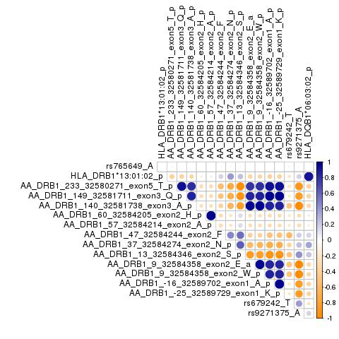
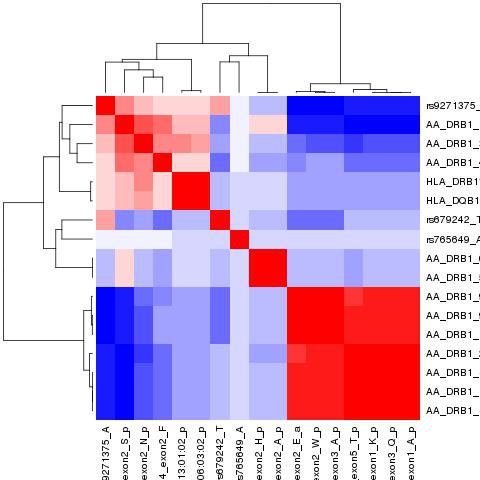

# Meta LOMG (USmerged + Itals) HLA analysis

**Start date:** 05-05-2021

**End date:** 05-05-2021

**Analysed by:** Ruth Chia

**Working directory:** `/data/NDRS_LNG/MyastheniaGravis/updated.April2020/MetaAnalysis.hg38.ByCohort.rerun/HLA/LOMG`

___


<h1>Table of Contents<span class="tocSkip"></span></h1>
<div class="toc"><ul class="toc-item"><li><span><a href="#Download-code-for-HATK" data-toc-modified-id="Download-code-for-HATK-1">Download code for HATK</a></span></li><li><span><a href="#Meta-from-Imputation.1000G" data-toc-modified-id="Meta-from-Imputation.1000G-2">Meta from Imputation.1000G</a></span><ul class="toc-item"><li><span><a href="#4field" data-toc-modified-id="4field-2.1">4field</a></span></li><li><span><a href="#4field-GLM-plink" data-toc-modified-id="4field-GLM-plink-2.2">4field-GLM-plink</a></span><ul class="toc-item"><li><span><a href="#plot-(use-HATK-function---to-get-manhattan-and-heatmap)" data-toc-modified-id="plot-(use-HATK-function---to-get-manhattan-and-heatmap)-2.2.1">plot (use HATK function - to get manhattan and heatmap)</a></span></li></ul></li><li><span><a href="#4field-GLM-plink-conditional" data-toc-modified-id="4field-GLM-plink-conditional-2.3">4field-GLM-plink-conditional</a></span><ul class="toc-item"><li><span><a href="#plot-(use-HATK-function---to-get-manhattan-and-heatmap)" data-toc-modified-id="plot-(use-HATK-function---to-get-manhattan-and-heatmap)-2.3.1">plot (use HATK function - to get manhattan and heatmap)</a></span></li></ul></li></ul></li><li><span><a href="#Check-correlation-of-top-snp-from-GWAS-with-top-hit-from-HLA-fine-mapping" data-toc-modified-id="Check-correlation-of-top-snp-from-GWAS-with-top-hit-from-HLA-fine-mapping-3">Check correlation of top snp from GWAS with top hit from HLA fine mapping</a></span><ul class="toc-item"><li><ul class="toc-item"><li><ul class="toc-item"><li><span><a href="#Some-interim-notes-on-conditional-analysis" data-toc-modified-id="Some-interim-notes-on-conditional-analysis-3.0.0.1">Some interim notes on conditional analysis</a></span></li></ul></li></ul></li></ul></li></ul></div>

## Download code for HATK

HATK(HLA Analysis Tool-Kit) is a collection of tools and modules to perform HLA fine-mapping analysis, which is to identify which HLA allele or amino acid position of the HLA gene is driving the disease


```python
!git clone https://github.com/WansonChoi/HATK.git
```

    Cloning into 'HATK'...
    remote: Enumerating objects: 2246, done.
    remote: Counting objects: 100% (206/206), done.
    remote: Compressing objects: 100% (135/135), done.
    remote: Total 2246 (delta 92), reused 163 (delta 66), pack-reused 2040
    Receiving objects: 100% (2246/2246), 169.10 MiB | 20.91 MiB/s, done.
    Resolving deltas: 100% (1089/1089), done.
    Checking out files: 100% (718/718), done.


## Meta from Imputation.1000G
### 4field


```bash
%%bash
cd HATK

DIR_US="/data/NDRS_LNG/MyastheniaGravis/updated.April2020/US/Imputation.HLA/Imputation.1000G.LOMG/4field"
DIR_Itals="/data/NDRS_LNG/MyastheniaGravis/updated.April2020/Itals/Imputation.HLA/Imputation.1000G.LOMG/4field"

out="/data/NDRS_LNG/MyastheniaGravis/updated.April2020/MetaAnalysis.hg38.ByCohort.rerun/HLA/LOMG"
mkdir $out/1000G
mkdir $out/1000G/4field

python HATK.py \
    --metaanalysis \
    --s1-logistic-result $DIR_US/RESULT_LOMG.USmerged.1000G_REF.EUR.hatk.chr6.4field.hg38.assoc.logistic \
    --s1-bim $DIR_US/RESULT_LOMG.USmerged.1000G_REF.EUR.hatk.chr6.4field.hg38.bim \
    --s2-logistic-result $DIR_Itals/RESULT_LOMG.Itals.1000G_REF.EUR.hatk.chr6.4field.hg38.assoc.logistic \
    --s2-bim $DIR_Itals/RESULT_LOMG.Itals.1000G_REF.EUR.hatk.chr6.4field.hg38.bim \
    --out $out/1000G/4field/RESULT_Meta.LOMG.overall.USmerged.Itals.HLA.hg38
```

    Namespace(Ggroup=False, HLA=None, NoCaption=False, Pgroup=False, aa=None, ar=None, bmarkergenerator=False, chped=None, condition=None, condition_list=None, covar=None, covar_name=None, dict_AA=None, dict_SNPS=None, fam=None, fourF=False, hat=None, heatmap=False, hg=None, hla2hped=False, hped=None, imgt=None, imgt2seq=False, imgt_dir=None, input=None, leave_NotFound=False, logistic=False, manhattan=False, maptable=None, metaanalysis=True, multiprocess=1, no_indel=False, nomencleaner=False, omnibus=False, oneF=False, out='/data/NDRS_LNG/MyastheniaGravis/updated.April2020/MetaAnalysis.hg38.ByCohort.rerun/HLA/LOMG/1000G/4field/RESULT_Meta.LOMG.overall.USmerged.Itals.HLA.hg38', phased=None, pheno=None, pheno_name=None, platform=None, point_color='#778899', point_size='15', reference_allele=None, rhped=None, s1_bim='/data/NDRS_LNG/MyastheniaGravis/updated.April2020/US/Imputation.HLA/Imputation.1000G.LOMG/4field/RESULT_LOMG.USmerged.1000G_REF.EUR.hatk.chr6.4field.hg38.bim', s1_logistic_result='/data/NDRS_LNG/MyastheniaGravis/updated.April2020/US/Imputation.HLA/Imputation.1000G.LOMG/4field/RESULT_LOMG.USmerged.1000G_REF.EUR.hatk.chr6.4field.hg38.assoc.logistic', s2_bim='/data/NDRS_LNG/MyastheniaGravis/updated.April2020/Itals/Imputation.HLA/Imputation.1000G.LOMG/4field/RESULT_LOMG.Itals.1000G_REF.EUR.hatk.chr6.4field.hg38.bim', s2_logistic_result='/data/NDRS_LNG/MyastheniaGravis/updated.April2020/Itals/Imputation.HLA/Imputation.1000G.LOMG/4field/RESULT_LOMG.Itals.1000G_REF.EUR.hatk.chr6.4field.hg38.assoc.logistic', save_intermediates=False, threeF=False, top_color='#FF0000', twoF=False, variants=None, yaxis_unit='10')
    
    [HLA_Study.py]: MetaAnalysis result : 
    /data/NDRS_LNG/MyastheniaGravis/updated.April2020/MetaAnalysis.hg38.ByCohort.rerun/HLA/LOMG/1000G/4field/RESULT_Meta.LOMG.overall.USmerged.Itals.HLA.hg38.meta


### 4field-GLM-plink

metal file: `/data/NDRS_LNG/MyastheniaGravis/updated.April2020/MetaAnalysis.hg38.ByCohort.rerun/HLA/LOMG/1000G/4field.GLM/metal.4field-GLM-plink.txt`

```
# THIS SCRIPT EXECUTES AN ANALYSIS OF TWO STUDIES - HLA imputed

# THE RESULTS FOR EACH STUDY ARE STORED IN FILES:
# /data/NDRS_LNG/MyastheniaGravis/updated.April2020/US/Imputation.HLA/Imputation.1000G.LOMG/4field/GLM/toMeta.RESULT_LOMG.USmerged.1000G_REF.EUR.hatk.chr6.4field.hg38.tab
# /data/NDRS_LNG/MyastheniaGravis/updated.April2020/Itals/Imputation.HLA/Imputation.1000G.LOMG/4field/GLM/toMeta.RESULT_LOMG.Itals.1000G_REF.EUR.hatk.chr6.4field.hg38.tab

SCHEME  STDERR
AVERAGEFREQ ON
MINMAXFREQ ON

# LOAD THE FIRST INPUT FILE
# UNCOMMENT THE NEXT LINE TO ENABLE GenomicControl CORRECTION
# GENOMICCONTROL ON

# === DESCRIBE AND PROCESS THE FIRST INPUT FILE ===
MARKER marker
ALLELE EffectAllele OtherAllele
FREQ   Freq_EffectAllele
EFFECT BETA
STDERR SE
PVALUE P
#WEIGHT OBS_CT
PROCESS /data/NDRS_LNG/MyastheniaGravis/updated.April2020/US/Imputation.HLA/Imputation.1000G.LOMG/4field/GLM/toMeta.RESULT_LOMG.USmerged.1000G_REF.EUR.hatk.chr6.4field.hg38.tab

# === DESCRIBE AND PROCESS ADDITIONAL INPUT FILE ===
PROCESS /data/NDRS_LNG/MyastheniaGravis/updated.April2020/Itals/Imputation.HLA/Imputation.1000G.LOMG/4field/GLM/toMeta.RESULT_LOMG.Itals.1000G_REF.EUR.hatk.chr6.4field.hg38.tab

OUTFILE META_LOMG.USmerged.Itals.UNRELATED.hg38.HLA.FreqBoth.glm .tbl
ANALYZE HETEROGENEITY
```


```bash
%%bash
out="/data/NDRS_LNG/MyastheniaGravis/updated.April2020/MetaAnalysis.hg38.ByCohort.rerun/HLA/LOMG"
#mkdir $out/1000G/4field.GLM
cd $out/1000G/4field.GLM

module load metal
metal /data/NDRS_LNG/MyastheniaGravis/updated.April2020/MetaAnalysis.hg38.ByCohort.rerun/HLA/LOMG/1000G/4field.GLM/metal.4field-GLM-plink.txt
```

    MetaAnalysis Helper - (c) 2007 - 2009 Goncalo Abecasis
    This version released on 2018-08-28
    
    # This program faciliates meta-analysis of genome-wide association studies.
    # Commonly used commands are listed below:
    #
    # Options for describing input files ...
    #   SEPARATOR        [WHITESPACE|COMMA|BOTH|TAB] (default = WHITESPACE)
    #   COLUMNCOUNTING   [STRICT|LENIENT]            (default = 'STRICT')
    #   MARKERLABEL      [LABEL]                     (default = 'MARKER')
    #   ALLELELABELS     [LABEL1 LABEL2]             (default = 'ALLELE1','ALLELE2')
    #   EFFECTLABEL      [LABEL|log(LABEL)]          (default = 'EFFECT')
    #   FLIP
    #
    # Options for filtering input files ...
    #   ADDFILTER        [LABEL CONDITION VALUE]     (example = ADDFILTER N > 10)
    #                    (available conditions are <, >, <=, >=, =, !=, IN)
    #   REMOVEFILTERS
    #
    # Options for sample size weighted meta-analysis ...
    #   WEIGHTLABEL      [LABEL]                     (default = 'N')
    #   PVALUELABEL      [LABEL]                     (default = 'PVALUE')
    #   DEFAULTWEIGHT    [NUMBER]                    (default = 1.0)
    #   MINWEIGHT        [NUMBER]                    (default = 1.0)
    #
    # Options for inverse variance weighted meta-analysis ...
    #   STDERRLABEL      [LABEL]                     (default = 'STDERR')
    #   SCHEME           [SAMPLESIZE|STDERR]         (default = SAMPLESIZE)
    #
    # Options to enable tracking of allele frequencies ...
    #   AVERAGEFREQ      [ON|OFF]                    (default = OFF)
    #   MINMAXFREQ       [ON|OFF]                    (default = OFF)
    #   FREQLABEL        [LABEL]                     (default = 'FREQ')
    #
    # Options to enable tracking of user defined variables ...
    #   CUSTOMVARIABLE   [VARNAME]
    #   LABEL            [VARNAME] AS [HEADER]
    #
    # Options to enable tracking of chromosomes and positions ...
    #   TRACKPOSITIONS   [ON|OFF]                    (default = OFF
    #   CHROMOSOMELABEL  [LABEL]                     (default = 'CHROMOSOME')
    #   POSITIONLABEL    [LABEL]                     (default = 'POSITION')
    #
    # Options to enable explicit strand information ...
    #   USESTRAND        [ON|OFF]                    (default = OFF)
    #   STRANDLABEL      [LABEL]                     (default = 'STRAND')
    #
    # Automatic genomic control correction of input statistics ...
    #   GENOMICCONTROL   [ON|OFF|VALUE|LIST snps.txt](default = OFF)
    #
    # Options to account for samples overlap ...
    #   OVERLAP          [ON|OFF]                    (default = OFF)
    #   ZCUTOFF          [NUMBER]                    (default = 1.0)
    #
    # Options for general analysis control ...
    #   PROCESSFILE      [FILENAME]
    #   OUTFILE          [PREFIX SUFFIX]             (default = 'METAANALYSIS','.TBL')
    #   MAXWARNINGS      [NUMBER]                    (default = 20)
    #   VERBOSE          [ON|OFF]                    (default = 'OFF')
    #   LOGPVALUE        [ON|OFF]                    (default = 'OFF')
    #   ANALYZE          [HETEROGENEITY]
    #   CLEAR
    
    # Options for general run control ...
    #   SOURCE           [SCRIPTFILE]
    #   RETURN
    #   QUIT
    
    # Processing commands in /data/NDRS_LNG/MyastheniaGravis/updated.April2020/MetaAnalysis.hg38.ByCohort.rerun/HLA/LOMG/1000G/4field.GLM/metal.4field-GLM-plink.txt ...
    ## Meta-analysis will be based on effect sizes and their standard errors ...
    ## Averaging of allele frequencies enabled
    ## Tracking of extreme allele frequencies enabled
    ## Set marker header to marker ...
    ## Set allele headers to EffectAllele and OtherAllele ...
    ## Set frequency header to Freq_EffectAllele ...
    ## Set effect header to BETA ...
    ## Set standard error header to SE ...
    ## Set p-value header to P ...
    ###########################################################################
    ## Processing file '/data/NDRS_LNG/MyastheniaGravis/updated.April2020/US/Imputation.HLA/Imputation.1000G.LOMG/4field/GLM/toMeta.RESULT_LOMG.USmerged.1000G_REF.EUR.hatk.chr6.4field.hg38.tab'
    ## Processed 6759 markers ...
    
    ###########################################################################
    ## Processing file '/data/NDRS_LNG/MyastheniaGravis/updated.April2020/Itals/Imputation.HLA/Imputation.1000G.LOMG/4field/GLM/toMeta.RESULT_LOMG.Itals.1000G_REF.EUR.hatk.chr6.4field.hg38.tab'
    ## Processed 10828 markers ...
    
    ## Set output file prefix and suffix to META_LOMG.USmerged.Itals.UNRELATED.hg38.HLA.FreqBoth.glm and .tbl ...
    ###########################################################################
    ## Running second pass analysis to evaluate heterogeneity...
    ## Processing file '/data/NDRS_LNG/MyastheniaGravis/updated.April2020/Itals/Imputation.HLA/Imputation.1000G.LOMG/4field/GLM/toMeta.RESULT_LOMG.Itals.1000G_REF.EUR.hatk.chr6.4field.hg38.tab'
    ## Processing file '/data/NDRS_LNG/MyastheniaGravis/updated.April2020/US/Imputation.HLA/Imputation.1000G.LOMG/4field/GLM/toMeta.RESULT_LOMG.USmerged.1000G_REF.EUR.hatk.chr6.4field.hg38.tab'
    
    ###########################################################################
    ## Executing meta-analysis ...
    ## Complete results will be stored in file 'META_LOMG.USmerged.Itals.UNRELATED.hg38.HLA.FreqBoth.glm1.tbl'
    ## Column descriptions will be stored in file 'META_LOMG.USmerged.Itals.UNRELATED.hg38.HLA.FreqBoth.glm1.tbl.info'
    ## Completed meta-analysis for 13763 markers!
    ## Smallest p-value is 4.226e-21 at marker 'AA_DRB1_13_32584346_exon2_S:6:32584346:a:p'
    
    ## Clearing all stored statistics ...
    # Clearing user defined filters ...


    [+] Loading metal  2018-08-28 


script to reformat meta output files before plotting: `ReformatMetaResults.addMAF.v2.HLA.R`

```
#!/usr/bin/env Rscript

args <- commandArgs(trailingOnly=TRUE)
if (length(args) != 4) {
  stop("USAGE: Rscript ReformatMetaResults.addMAF.v2.HLA.R args[1] args[2] args[3] args[4]
  where args[1] = metaResults
        args[2] = toMetaInput.US
        args[3] = toMetaInput.Itals
        args[4] = outputFileName")
}

# Load libraries
require(data.table)
require(tidyverse)


# Set variables
metaResults <- args[1]
toMetaInput.US <- args[2]
toMetaInput.Itals <- args[3]
outputFileName <- args[4]

# Read in files and reformat meta
meta0 <- fread(metaResults, header=T)

# make list of variants with chr,pos for merging with meta results
us.list <- fread(toMetaInput.US,header=T) %>% 
           select(marker,ID,CHROM,POS,OtherAllele,EffectAllele)
itals.list <- fread(toMetaInput.Itals,header=T) %>% 
           select(marker,ID,CHROM,POS,OtherAllele,EffectAllele)
list <- rbind(us.list,itals.list) %>% arrange(CHROM,POS) %>% distinct()

meta <- merge(meta0,list,by.x="MarkerName",by.y="marker",all.x=T)

meta$OA <- tolower(meta$OtherAllele)
meta$EA <- tolower(meta$EffectAllele)
meta$EffectAllele <- ifelse(meta$EA == meta$Allele1, meta$Allele1, meta$Allele2)
meta$OtherAllele <- ifelse(meta$EA == meta$Allele1, meta$Allele2, meta$Allele1)
meta$maf_EA.cases <- ifelse(meta$EA == meta$Allele1, meta$Freq1, 1 - meta$Freq1)
meta$beta <- ifelse(meta$EffectAllele == meta$Allele1, meta$Effect, meta$Effect*-1)

tmp1 <- meta %>% rename(P = `P-value`) %>% filter(P > 0.00000005)
tmp2 <- meta %>% rename(P = `P-value`) %>%
        filter(P < 0.00000005) %>%
        filter(Direction == "--" | Direction == "++")

data <- rbind(tmp1,tmp2) %>%
        mutate(CHROM = as.numeric(gsub("chr","",CHROM), POS = as.numeric(POS))) %>%
        filter(POS != is.na(POS)) %>%
        filter(HetISq <= 80) %>%
        filter(Direction == "--" | Direction == "+-" | Direction == "-+" | Direction == "++") %>%
        select(CHROM,POS,ID,MarkerName,EffectAllele,OtherAllele,maf_EA.cases,beta,StdErr,P,Direction,HetISq) %>%
        arrange(CHROM,POS)

dim(meta0)
dim(meta)
dim(data)

# Get frequency information
us <- fread(toMetaInput.US,header=T) %>%
      select(marker,Freq_EffectAllele,Freq_EffectAllele.CASE,Freq_EffectAllele.CTRL,
             ALLELE_CT,CASE_ALLELE_CT,CTRL_ALLELE_CT,
             EffectAllele_CT,EffectAllele_CT.CASE,EffectAllele_CT.CTRL)
colnames(us)[2:10] <- paste(colnames(us)[2:10],"_US",sep="")

itals <- fread(toMetaInput.Itals,header=T) %>%
         select(marker,Freq_EffectAllele,Freq_EffectAllele.CASE,Freq_EffectAllele.CTRL,
                ALLELE_CT,CASE_ALLELE_CT,CTRL_ALLELE_CT,
                EffectAllele_CT,EffectAllele_CT.CASE,EffectAllele_CT.CTRL)
colnames(itals)[2:10] <- paste(colnames(itals)[2:10],"_Italy",sep="")

both <- merge(us,itals,by="marker")

dim(us)
dim(itals)
dim(both)

both$Freq_EffectAllele <- (both$Freq_EffectAllele_US + both$Freq_EffectAllele_Italy)/2
both$Freq_EffectAllele.CASE <- (both$Freq_EffectAllele.CASE_US + both$Freq_EffectAllele.CASE_Italy)/2
both$Freq_EffectAllele.CTRL <- (both$Freq_EffectAllele.CTRL_US + both$Freq_EffectAllele.CTRL_Italy)/2

both$ALLELE_CT <- both$ALLELE_CT_US + both$ALLELE_CT_Italy
both$ALLELE_CT.CASE <- both$CASE_ALLELE_CT_US + both$CASE_ALLELE_CT_Italy
both$ALLELE_CT.CTRL <- both$CTRL_ALLELE_CT_US + both$CTRL_ALLELE_CT_Italy

both$EffectAllele_CT <- both$EffectAllele_CT_US + both$EffectAllele_CT_Italy
both$EffectAllele_CT.CASE <- both$EffectAllele_CT.CASE_US + both$EffectAllele_CT.CASE_Italy
both$EffectAllele_CT.CTRL <- both$EffectAllele_CT.CTRL_US + both$EffectAllele_CT.CTRL_Italy

both$maf_EA <- both$EffectAllele_CT/both$ALLELE_CT
both$maf_EA.CASE <- both$EffectAllele_CT.CASE/both$ALLELE_CT.CASE
both$maf_EA.CTRL <- both$EffectAllele_CT.CTRL/both$ALLELE_CT.CTRL
write.table(both,"MAF.USmerged.Itals.txt",sep="\t",quote=F,row.names=F,col.names=T)
            
freq <- both %>%
        select(marker,Freq_EffectAllele,Freq_EffectAllele.CASE,Freq_EffectAllele.CTRL,
              ALLELE_CT,ALLELE_CT.CASE,ALLELE_CT.CTRL,
              EffectAllele_CT,EffectAllele_CT.CASE,EffectAllele_CT.CTRL,
              maf_EA,maf_EA.CASE,maf_EA.CTRL)


# merge formatted meta results with frequency file
tmp <- merge(data,freq,by.x="MarkerName",by.y="marker")
data2 <- tmp %>% 
         select(CHROM,POS,ID,MarkerName,EffectAllele,OtherAllele,
                maf_EA,maf_EA.CASE,maf_EA.CTRL,beta,StdErr,P,Direction,HetISq)

write.table(data2,paste(args[4],".filteredDirection.HetISq80.TIDY.v2",".txt",sep=""),quote=F,row.names=F,col.names=T,sep="\t")
```


```bash
%%bash
cp ../Overall/ReformatMetaResults.addMAF.v2.HLA.R .

module load R/3.5.2
DIR="/data/NDRS_LNG/MyastheniaGravis/updated.April2020"
out="/data/NDRS_LNG/MyastheniaGravis/updated.April2020/MetaAnalysis.hg38.ByCohort.rerun/HLA/LOMG"

Rscript ReformatMetaResults.addMAF.v2.HLA.R \
$out/1000G/4field.GLM/META_LOMG.USmerged.Itals.UNRELATED.hg38.HLA.FreqBoth.glm1.tbl \
$DIR/US/Imputation.HLA/Imputation.1000G.LOMG/4field/GLM/toMeta.RESULT_LOMG.USmerged.1000G_REF.EUR.hatk.chr6.4field.hg38.tab \
$DIR/Itals/Imputation.HLA/Imputation.1000G.LOMG/4field/GLM/toMeta.RESULT_LOMG.Itals.1000G_REF.EUR.hatk.chr6.4field.hg38.tab \
$out/1000G/4field.GLM/META_LOMG.USmerged.Itals.UNRELATED.hg38.HLA.FreqBoth
```

    [1] 13763    15
    [1] 13763    24
    [1] 3517   12
    [1] 6759   10
    [1] 10828    10
    [1] 3823   19


    [-] Unloading gcc  9.2.0  ... 
    [-] Unloading GSL 2.6 for GCC 9.2.0 ... 
    [-] Unloading openmpi 4.0.5  for GCC 9.2.0 
    [-] Unloading ImageMagick  7.0.8  on cn3451 
    [-] Unloading HDF5  1.10.4 
    [-] Unloading NetCDF 4.7.4_gcc9.2.0 
    [-] Unloading pandoc  2.13  on cn3451 
    [-] Unloading pcre2 10.21  ... 
    [-] Unloading R 4.0.5 
    [+] Loading gcc  7.3.0  ... 
    [+] Loading GSL 2.4 for GCC 7.2.0 ... 
    [-] Unloading gcc  7.3.0  ... 
    [+] Loading gcc  7.3.0  ... 
    [+] Loading openmpi 3.0.2  for GCC 7.3.0 
    [+] Loading ImageMagick  7.0.8  on cn3451 
    [+] Loading HDF5  1.10.4 
    [+] Loading pandoc  2.13  on cn3451 
    [+] Loading R 3.5.2 
    
    The following have been reloaded with a version change:
      1) GSL/2.6_gcc-9.2.0 => GSL/2.4_gcc-7.2.0     3) gcc/9.2.0 => gcc/7.3.0
      2) R/4.0 => R/3.5.2
    
    Loading required package: data.table
    Loading required package: tidyverse
    -- Attaching packages --------------------------------------- tidyverse 1.2.1 --
    v ggplot2 3.3.2     v purrr   0.3.4
    v tibble  3.0.3     v dplyr   0.8.5
    v tidyr   0.8.3     v stringr 1.4.0
    v readr   1.3.1     v forcats 0.5.0
    -- Conflicts ------------------------------------------ tidyverse_conflicts() --
    x dplyr::between()   masks data.table::between()
    x dplyr::filter()    masks stats::filter()
    x dplyr::first()     masks data.table::first()
    x dplyr::lag()       masks stats::lag()
    x dplyr::last()      masks data.table::last()
    x purrr::transpose() masks data.table::transpose()


```python
import pandas as pd

pd.read_csv("/data/NDRS_LNG/MyastheniaGravis/updated.April2020/MetaAnalysis.hg38.ByCohort.rerun/HLA/LOMG/1000G/4field.GLM/META_LOMG.USmerged.Itals.UNRELATED.hg38.HLA.FreqBoth.filteredDirection.HetISq80.TIDY.v2.txt",sep="\t").head()
```


<div>
<style scoped>
    .dataframe tbody tr th:only-of-type {
        vertical-align: middle;
    }

    .dataframe tbody tr th {
        vertical-align: top;
    }

    .dataframe thead th {
        text-align: right;
    }
</style>
<table border="1" class="dataframe">
  <thead>
    <tr style="text-align: right;">
      <th></th>
      <th>CHROM</th>
      <th>POS</th>
      <th>ID</th>
      <th>MarkerName</th>
      <th>EffectAllele</th>
      <th>OtherAllele</th>
      <th>maf_EA</th>
      <th>maf_EA.CASE</th>
      <th>maf_EA.CTRL</th>
      <th>beta</th>
      <th>StdErr</th>
      <th>P</th>
      <th>Direction</th>
      <th>HetISq</th>
    </tr>
  </thead>
  <tbody>
    <tr>
      <th>0</th>
      <td>6</td>
      <td>29942594</td>
      <td>AA_A_-11_29942594_exon1_L</td>
      <td>AA_A_-11_29942594_exon1_L:6:29942594:a:p</td>
      <td>p</td>
      <td>a</td>
      <td>0.074077</td>
      <td>0.079812</td>
      <td>0.073859</td>
      <td>-0.0030</td>
      <td>0.0803</td>
      <td>0.970100</td>
      <td>-+</td>
      <td>0.0</td>
    </tr>
    <tr>
      <th>1</th>
      <td>6</td>
      <td>29942594</td>
      <td>AA_A_-11_29942594_exon1_S</td>
      <td>AA_A_-11_29942594_exon1_S:6:29942594:p:a</td>
      <td>a</td>
      <td>p</td>
      <td>0.197295</td>
      <td>0.225352</td>
      <td>0.196229</td>
      <td>0.0540</td>
      <td>0.0522</td>
      <td>0.300500</td>
      <td>+-</td>
      <td>0.0</td>
    </tr>
    <tr>
      <th>2</th>
      <td>6</td>
      <td>29942594</td>
      <td>AA_A_-11_29942594_exon1_x</td>
      <td>AA_A_-11_29942594_exon1_x:6:29942594:a:p</td>
      <td>p</td>
      <td>a</td>
      <td>0.123218</td>
      <td>0.145540</td>
      <td>0.122370</td>
      <td>0.0793</td>
      <td>0.0621</td>
      <td>0.201700</td>
      <td>--</td>
      <td>0.0</td>
    </tr>
    <tr>
      <th>3</th>
      <td>6</td>
      <td>29942582</td>
      <td>AA_A_-15_29942582_exon1_L</td>
      <td>AA_A_-15_29942582_exon1_L:6:29942582:a:p</td>
      <td>p</td>
      <td>a</td>
      <td>0.468279</td>
      <td>0.483959</td>
      <td>0.467684</td>
      <td>0.0886</td>
      <td>0.0435</td>
      <td>0.041550</td>
      <td>--</td>
      <td>0.0</td>
    </tr>
    <tr>
      <th>4</th>
      <td>6</td>
      <td>29942582</td>
      <td>AA_A_-15_29942582_exon1_V</td>
      <td>AA_A_-15_29942582_exon1_V:6:29942582:a:p</td>
      <td>p</td>
      <td>a</td>
      <td>0.408503</td>
      <td>0.370501</td>
      <td>0.409946</td>
      <td>-0.1329</td>
      <td>0.0449</td>
      <td>0.003074</td>
      <td>++</td>
      <td>0.0</td>
    </tr>
  </tbody>
</table>
</div>


#### plot (use HATK function - to get manhattan and heatmap)


```bash
%%bash
# first need to reformat the meta output from plink glm to match the input for HATK
# i.e have column : CHR,SNP,BP,A1,TEST,NMISS,OR,SE,L95,U95,STAT,P

module load R/3.5.2
R --vanilla --no-save

require(data.table)
require(tidyverse)

data <- fread("1000G/4field.GLM/META_LOMG.USmerged.Itals.UNRELATED.hg38.HLA.FreqBoth.filteredDirection.HetISq80.TIDY.v2.txt",header=T)
data1 <- data %>%
         select(CHROM,ID,POS,EffectAllele,beta,StdErr,P) %>%
         mutate(OR = exp(beta)) %>%
         select(-beta)
data1$TEST <- "ADD"
data1$NMISS <- "NA"
data1$L95 <- "NA"
data1$U95 <- "NA"
data1$STAT <- "NA"
data1 <- data1 %>% select(CHROM,ID,POS,EffectAllele,TEST,NMISS,OR,StdErr,L95,U95,STAT,P)
colnames(data1) <- c("CHR","SNP","BP","A1","TEST","NMISS","OR","SE","L95","U95","STAT","P")
head(data1)
write.table(data1,"1000G/4field.GLM/META_LOMG.USmerged.Itals.UNRELATED.hg38.HLA.FreqBoth.filteredDirectionHetISq80MAF001overall.forHATK.assoc.logistic",sep=" ",quote=F,row.names=F,col.names=T)
```

    
    R version 3.5.2 (2018-12-20) -- "Eggshell Igloo"
    Copyright (C) 2018 The R Foundation for Statistical Computing
    Platform: x86_64-pc-linux-gnu (64-bit)
    
    R is free software and comes with ABSOLUTELY NO WARRANTY.
    You are welcome to redistribute it under certain conditions.
    Type 'license()' or 'licence()' for distribution details.
    
    R is a collaborative project with many contributors.
    Type 'contributors()' for more information and
    'citation()' on how to cite R or R packages in publications.
    
    Type 'demo()' for some demos, 'help()' for on-line help, or
    'help.start()' for an HTML browser interface to help.
    Type 'q()' to quit R.
    
    > 
    > require(data.table)
    > require(tidyverse)
    > 
    > data <- fread("1000G/4field.GLM/META_LOMG.USmerged.Itals.UNRELATED.hg38.HLA.FreqBoth.filteredDirection.HetISq80.TIDY.v2.txt",header=T)
    > data1 <- data %>%
    +          select(CHROM,ID,POS,EffectAllele,beta,StdErr,P) %>%
    +          mutate(OR = exp(beta)) %>%
    +          select(-beta)
    > data1$TEST <- "ADD"
    > data1$NMISS <- "NA"
    > data1$L95 <- "NA"
    > data1$U95 <- "NA"
    > data1$STAT <- "NA"
    > data1 <- data1 %>% select(CHROM,ID,POS,EffectAllele,TEST,NMISS,OR,StdErr,L95,U95,STAT,P)
    > colnames(data1) <- c("CHR","SNP","BP","A1","TEST","NMISS","OR","SE","L95","U95","STAT","P")
    > head(data1)
      CHR                       SNP       BP A1 TEST NMISS        OR     SE L95 U95
    1   6 AA_A_-11_29942594_exon1_L 29942594  p  ADD    NA 0.9970045 0.0803  NA  NA
    2   6 AA_A_-11_29942594_exon1_S 29942594  a  ADD    NA 1.0554846 0.0522  NA  NA
    3   6 AA_A_-11_29942594_exon1_x 29942594  p  ADD    NA 1.0825290 0.0621  NA  NA
    4   6 AA_A_-15_29942582_exon1_L 29942582  p  ADD    NA 1.0926435 0.0435  NA  NA
    5   6 AA_A_-15_29942582_exon1_V 29942582  p  ADD    NA 0.8755526 0.0449  NA  NA
    6   6 AA_A_-15_29942582_exon1_x 29942582  p  ADD    NA 1.0825290 0.0621  NA  NA
      STAT        P
    1   NA 0.970100
    2   NA 0.300500
    3   NA 0.201700
    4   NA 0.041550
    5   NA 0.003074
    6   NA 0.201700
    > write.table(data1,"1000G/4field.GLM/META_LOMG.USmerged.Itals.UNRELATED.hg38.HLA.FreqBoth.filteredDirectionHetISq80MAF001overall.forHATK.assoc.logistic",sep=" ",quote=F,row.names=F,col.names=T)
    > 


    [-] Unloading gcc  9.2.0  ... 
    [-] Unloading GSL 2.6 for GCC 9.2.0 ... 
    [-] Unloading openmpi 4.0.5  for GCC 9.2.0 
    [-] Unloading ImageMagick  7.0.8  on cn3451 
    [-] Unloading HDF5  1.10.4 
    [-] Unloading NetCDF 4.7.4_gcc9.2.0 
    [-] Unloading pandoc  2.13  on cn3451 
    [-] Unloading pcre2 10.21  ... 
    [-] Unloading R 4.0.5 
    [+] Loading gcc  7.3.0  ... 
    [+] Loading GSL 2.4 for GCC 7.2.0 ... 
    [-] Unloading gcc  7.3.0  ... 
    [+] Loading gcc  7.3.0  ... 
    [+] Loading openmpi 3.0.2  for GCC 7.3.0 
    [+] Loading ImageMagick  7.0.8  on cn3451 
    [+] Loading HDF5  1.10.4 
    [+] Loading pandoc  2.13  on cn3451 
    [+] Loading R 3.5.2 
    
    The following have been reloaded with a version change:
      1) GSL/2.6_gcc-9.2.0 => GSL/2.4_gcc-7.2.0     3) gcc/9.2.0 => gcc/7.3.0
      2) R/4.0 => R/3.5.2
    
    Loading required package: data.table
    Loading required package: tidyverse
    -- Attaching packages --------------------------------------- tidyverse 1.2.1 --
    v ggplot2 3.3.2     v purrr   0.3.4
    v tibble  3.0.3     v dplyr   0.8.5
    v tidyr   0.8.3     v stringr 1.4.0
    v readr   1.3.1     v forcats 0.5.0
    -- Conflicts ------------------------------------------ tidyverse_conflicts() --
    x dplyr::between()   masks data.table::between()
    x dplyr::filter()    masks stats::filter()
    x dplyr::first()     masks data.table::first()
    x dplyr::lag()       masks stats::lag()
    x dplyr::last()      masks data.table::last()
    x purrr::transpose() masks data.table::transpose()


```bash
%%bash
cd HATK/

python HATK.py \
    --manhattan \
    --ar ../1000G/4field.GLM/META_LOMG.USmerged.Itals.UNRELATED.hg38.HLA.FreqBoth.filteredDirectionHetISq80MAF001overall.forHATK.assoc.logistic \
    --imgt 3320 \
    --hg 38 \
    --yaxis-unit 5 \
    --out ../1000G/4field.GLM/META_LOMG.USmerged.Itals.UNRELATED.hg38.HLA.FreqBoth.filteredDirectionHetISq80MAF001overall
```

    Namespace(Ggroup=False, HLA=None, NoCaption=False, Pgroup=False, aa=None, ar=['../1000G/4field.GLM/META_LOMG.USmerged.Itals.UNRELATED.hg38.HLA.FreqBoth.filteredDirectionHetISq80MAF001overall.forHATK.assoc.logistic'], bmarkergenerator=False, chped=None, condition=None, condition_list=None, covar=None, covar_name=None, dict_AA=None, dict_SNPS=None, fam=None, fourF=False, hat=None, heatmap=False, hg='38', hla2hped=False, hped=None, imgt='3320', imgt2seq=False, imgt_dir=None, input=None, leave_NotFound=False, logistic=False, manhattan=True, maptable=None, metaanalysis=False, multiprocess=1, no_indel=False, nomencleaner=False, omnibus=False, oneF=False, out='../1000G/4field.GLM/META_LOMG.USmerged.Itals.UNRELATED.hg38.HLA.FreqBoth.filteredDirectionHetISq80MAF001overall', phased=None, pheno=None, pheno_name=None, platform=None, point_color='#778899', point_size='15', reference_allele=None, rhped=None, s1_bim=None, s1_logistic_result=None, s2_bim=None, s2_logistic_result=None, save_intermediates=False, threeF=False, top_color='#FF0000', twoF=False, variants=None, yaxis_unit='5')
    
    [HLA_Study.py]: Manhattan result : 
    ../1000G/4field.GLM/META_LOMG.USmerged.Itals.UNRELATED.hg38.HLA.FreqBoth.filteredDirectionHetISq80MAF001overall.pdf


### 4field-GLM-plink-conditional

metal file: `/data/NDRS_LNG/MyastheniaGravis/updated.April2020/MetaAnalysis.hg38.ByCohort.rerun/HLA/LOMG/1000G/4field.GLM/metal.4field-GLM-plink.conditioned.1.txt`

```
# THIS SCRIPT EXECUTES AN ANALYSIS OF TWO STUDIES - HLA imputed

# THE RESULTS FOR EACH STUDY ARE STORED IN FILES:
# /data/NDRS_LNG/MyastheniaGravis/updated.April2020/US/Imputation.HLA/Imputation.1000G.LOMG/4field/GLM.conditional/toMeta.RESULT_LOMG.USmerged.1000G_REF.EUR.hatk.chr6.4field.hg38.conditioned.AA.HLA_DRB1.tab
# /data/NDRS_LNG/MyastheniaGravis/updated.April2020/Itals/Imputation.HLA/Imputation.1000G.LOMG/4field/GLM.conditional/toMeta.RESULT_LOMG.Itals.1000G_REF.EUR.hatk.chr6.4field.hg38.conditioned.AA.HLA_DRB1.tab

SCHEME  STDERR
AVERAGEFREQ ON
MINMAXFREQ ON

# LOAD THE FIRST INPUT FILE
# UNCOMMENT THE NEXT LINE TO ENABLE GenomicControl CORRECTION
# GENOMICCONTROL ON

# === DESCRIBE AND PROCESS THE FIRST INPUT FILE ===
MARKER marker
ALLELE EffectAllele OtherAllele
FREQ   Freq_EffectAllele
EFFECT BETA
STDERR SE
PVALUE P
#WEIGHT OBS_CT
PROCESS /data/NDRS_LNG/MyastheniaGravis/updated.April2020/US/Imputation.HLA/Imputation.1000G.LOMG/4field/GLM.conditional/toMeta.RESULT_LOMG.USmerged.1000G_REF.EUR.hatk.chr6.4field.hg38.conditioned.AA.HLA_DRB1.tab

# === DESCRIBE AND PROCESS ADDITIONAL INPUT FILE ===
PROCESS /data/NDRS_LNG/MyastheniaGravis/updated.April2020/Itals/Imputation.HLA/Imputation.1000G.LOMG/4field/GLM.conditional/toMeta.RESULT_LOMG.Itals.1000G_REF.EUR.hatk.chr6.4field.hg38.conditioned.AA.HLA_DRB1.tab

OUTFILE META_LOMG.USmerged.Itals.UNRELATED.hg38.conditioned.AA.HLA_DRB1.FreqBoth.glm .tbl
ANALYZE HETEROGENEITY
```

___


metal file: `/data/NDRS_LNG/MyastheniaGravis/updated.April2020/MetaAnalysis.hg38.ByCohort.rerun/HLA/LOMG/1000G/4field.GLM/metal.4field-GLM-plink.conditioned.2.txt`

```
# THIS SCRIPT EXECUTES AN ANALYSIS OF TWO STUDIES - HLA imputed

# THE RESULTS FOR EACH STUDY ARE STORED IN FILES:
# /data/NDRS_LNG/MyastheniaGravis/updated.April2020/US/Imputation.HLA/Imputation.1000G.LOMG/4field/GLM.conditional/toMeta.RESULT_LOMG.USmerged.1000G_REF.EUR.hatk.chr6.4field.hg38.conditioned.HLA_DQB1.tab
# /data/NDRS_LNG/MyastheniaGravis/updated.April2020/Itals/Imputation.HLA/Imputation.1000G.LOMG/4field/GLM.conditional/toMeta.RESULT_LOMG.Itals.1000G_REF.EUR.hatk.chr6.4field.hg38.conditioned.HLA_DQB1.tab

SCHEME  STDERR
AVERAGEFREQ ON
MINMAXFREQ ON

# LOAD THE FIRST INPUT FILE
# UNCOMMENT THE NEXT LINE TO ENABLE GenomicControl CORRECTION
# GENOMICCONTROL ON

# === DESCRIBE AND PROCESS THE FIRST INPUT FILE ===
MARKER marker
ALLELE EffectAllele OtherAllele
FREQ   Freq_EffectAllele
EFFECT BETA
STDERR SE
PVALUE P
#WEIGHT OBS_CT
PROCESS /data/NDRS_LNG/MyastheniaGravis/updated.April2020/US/Imputation.HLA/Imputation.1000G.LOMG/4field/GLM.conditional/toMeta.RESULT_LOMG.USmerged.1000G_REF.EUR.hatk.chr6.4field.hg38.conditioned.HLA_DQB1.tab

# === DESCRIBE AND PROCESS ADDITIONAL INPUT FILE ===
PROCESS /data/NDRS_LNG/MyastheniaGravis/updated.April2020/Itals/Imputation.HLA/Imputation.1000G.LOMG/4field/GLM.conditional/toMeta.RESULT_LOMG.Itals.1000G_REF.EUR.hatk.chr6.4field.hg38.conditioned.HLA_DQB1.tab

OUTFILE META_LOMG.USmerged.Itals.UNRELATED.hg38.conditioned.HLA_DQB1.FreqBoth.glm .tbl
ANALYZE HETEROGENEITY
```


```bash
%%bash
out="/data/NDRS_LNG/MyastheniaGravis/updated.April2020/MetaAnalysis.hg38.ByCohort.rerun/HLA/LOMG"
#mkdir $out/1000G/4field.GLM
cd $out/1000G/4field.GLM

module load metal
metal /data/NDRS_LNG/MyastheniaGravis/updated.April2020/MetaAnalysis.hg38.ByCohort.rerun/HLA/LOMG/1000G/4field.GLM/metal.4field-GLM-plink.conditioned.1.txt
metal /data/NDRS_LNG/MyastheniaGravis/updated.April2020/MetaAnalysis.hg38.ByCohort.rerun/HLA/LOMG/1000G/4field.GLM/metal.4field-GLM-plink.conditioned.2.txt
```

    MetaAnalysis Helper - (c) 2007 - 2009 Goncalo Abecasis
    This version released on 2018-08-28
    
    # This program faciliates meta-analysis of genome-wide association studies.
    # Commonly used commands are listed below:
    #
    # Options for describing input files ...
    #   SEPARATOR        [WHITESPACE|COMMA|BOTH|TAB] (default = WHITESPACE)
    #   COLUMNCOUNTING   [STRICT|LENIENT]            (default = 'STRICT')
    #   MARKERLABEL      [LABEL]                     (default = 'MARKER')
    #   ALLELELABELS     [LABEL1 LABEL2]             (default = 'ALLELE1','ALLELE2')
    #   EFFECTLABEL      [LABEL|log(LABEL)]          (default = 'EFFECT')
    #   FLIP
    #
    # Options for filtering input files ...
    #   ADDFILTER        [LABEL CONDITION VALUE]     (example = ADDFILTER N > 10)
    #                    (available conditions are <, >, <=, >=, =, !=, IN)
    #   REMOVEFILTERS
    #
    # Options for sample size weighted meta-analysis ...
    #   WEIGHTLABEL      [LABEL]                     (default = 'N')
    #   PVALUELABEL      [LABEL]                     (default = 'PVALUE')
    #   DEFAULTWEIGHT    [NUMBER]                    (default = 1.0)
    #   MINWEIGHT        [NUMBER]                    (default = 1.0)
    #
    # Options for inverse variance weighted meta-analysis ...
    #   STDERRLABEL      [LABEL]                     (default = 'STDERR')
    #   SCHEME           [SAMPLESIZE|STDERR]         (default = SAMPLESIZE)
    #
    # Options to enable tracking of allele frequencies ...
    #   AVERAGEFREQ      [ON|OFF]                    (default = OFF)
    #   MINMAXFREQ       [ON|OFF]                    (default = OFF)
    #   FREQLABEL        [LABEL]                     (default = 'FREQ')
    #
    # Options to enable tracking of user defined variables ...
    #   CUSTOMVARIABLE   [VARNAME]
    #   LABEL            [VARNAME] AS [HEADER]
    #
    # Options to enable tracking of chromosomes and positions ...
    #   TRACKPOSITIONS   [ON|OFF]                    (default = OFF
    #   CHROMOSOMELABEL  [LABEL]                     (default = 'CHROMOSOME')
    #   POSITIONLABEL    [LABEL]                     (default = 'POSITION')
    #
    # Options to enable explicit strand information ...
    #   USESTRAND        [ON|OFF]                    (default = OFF)
    #   STRANDLABEL      [LABEL]                     (default = 'STRAND')
    #
    # Automatic genomic control correction of input statistics ...
    #   GENOMICCONTROL   [ON|OFF|VALUE|LIST snps.txt](default = OFF)
    #
    # Options to account for samples overlap ...
    #   OVERLAP          [ON|OFF]                    (default = OFF)
    #   ZCUTOFF          [NUMBER]                    (default = 1.0)
    #
    # Options for general analysis control ...
    #   PROCESSFILE      [FILENAME]
    #   OUTFILE          [PREFIX SUFFIX]             (default = 'METAANALYSIS','.TBL')
    #   MAXWARNINGS      [NUMBER]                    (default = 20)
    #   VERBOSE          [ON|OFF]                    (default = 'OFF')
    #   LOGPVALUE        [ON|OFF]                    (default = 'OFF')
    #   ANALYZE          [HETEROGENEITY]
    #   CLEAR
    
    # Options for general run control ...
    #   SOURCE           [SCRIPTFILE]
    #   RETURN
    #   QUIT
    
    # Processing commands in /data/NDRS_LNG/MyastheniaGravis/updated.April2020/MetaAnalysis.hg38.ByCohort.rerun/HLA/LOMG/1000G/4field.GLM/metal.4field-GLM-plink.conditioned.1.txt ...
    ## Meta-analysis will be based on effect sizes and their standard errors ...
    ## Averaging of allele frequencies enabled
    ## Tracking of extreme allele frequencies enabled
    ## Set marker header to marker ...
    ## Set allele headers to EffectAllele and OtherAllele ...
    ## Set frequency header to Freq_EffectAllele ...
    ## Set effect header to BETA ...
    ## Set standard error header to SE ...
    ## Set p-value header to P ...
    ###########################################################################
    ## Processing file '/data/NDRS_LNG/MyastheniaGravis/updated.April2020/US/Imputation.HLA/Imputation.1000G.LOMG/4field/GLM.conditional/toMeta.RESULT_LOMG.USmerged.1000G_REF.EUR.hatk.chr6.4field.hg38.conditioned.AA.HLA_DRB1.tab'
    ## Processed 6758 markers ...
    
    ###########################################################################
    ## Processing file '/data/NDRS_LNG/MyastheniaGravis/updated.April2020/Itals/Imputation.HLA/Imputation.1000G.LOMG/4field/GLM.conditional/toMeta.RESULT_LOMG.Itals.1000G_REF.EUR.hatk.chr6.4field.hg38.conditioned.AA.HLA_DRB1.tab'
    ## Processed 10525 markers ...
    
    ## Set output file prefix and suffix to META_LOMG.USmerged.Itals.UNRELATED.hg38.conditioned.AA.HLA_DRB1.FreqBoth.glm and .tbl ...
    ###########################################################################
    ## Running second pass analysis to evaluate heterogeneity...
    ## Processing file '/data/NDRS_LNG/MyastheniaGravis/updated.April2020/Itals/Imputation.HLA/Imputation.1000G.LOMG/4field/GLM.conditional/toMeta.RESULT_LOMG.Itals.1000G_REF.EUR.hatk.chr6.4field.hg38.conditioned.AA.HLA_DRB1.tab'
    ## Processing file '/data/NDRS_LNG/MyastheniaGravis/updated.April2020/US/Imputation.HLA/Imputation.1000G.LOMG/4field/GLM.conditional/toMeta.RESULT_LOMG.USmerged.1000G_REF.EUR.hatk.chr6.4field.hg38.conditioned.AA.HLA_DRB1.tab'
    
    ###########################################################################
    ## Executing meta-analysis ...
    ## Complete results will be stored in file 'META_LOMG.USmerged.Itals.UNRELATED.hg38.conditioned.AA.HLA_DRB1.FreqBoth.glm1.tbl'
    ## Column descriptions will be stored in file 'META_LOMG.USmerged.Itals.UNRELATED.hg38.conditioned.AA.HLA_DRB1.FreqBoth.glm1.tbl.info'
    ## Completed meta-analysis for 13460 markers!
    ## Smallest p-value is 1.076e-10 at marker 'rs7775117:6:31377709:A:T'
    
    ## Clearing all stored statistics ...
    # Clearing user defined filters ...
    MetaAnalysis Helper - (c) 2007 - 2009 Goncalo Abecasis
    This version released on 2018-08-28
    
    # This program faciliates meta-analysis of genome-wide association studies.
    # Commonly used commands are listed below:
    #
    # Options for describing input files ...
    #   SEPARATOR        [WHITESPACE|COMMA|BOTH|TAB] (default = WHITESPACE)
    #   COLUMNCOUNTING   [STRICT|LENIENT]            (default = 'STRICT')
    #   MARKERLABEL      [LABEL]                     (default = 'MARKER')
    #   ALLELELABELS     [LABEL1 LABEL2]             (default = 'ALLELE1','ALLELE2')
    #   EFFECTLABEL      [LABEL|log(LABEL)]          (default = 'EFFECT')
    #   FLIP
    #
    # Options for filtering input files ...
    #   ADDFILTER        [LABEL CONDITION VALUE]     (example = ADDFILTER N > 10)
    #                    (available conditions are <, >, <=, >=, =, !=, IN)
    #   REMOVEFILTERS
    #
    # Options for sample size weighted meta-analysis ...
    #   WEIGHTLABEL      [LABEL]                     (default = 'N')
    #   PVALUELABEL      [LABEL]                     (default = 'PVALUE')
    #   DEFAULTWEIGHT    [NUMBER]                    (default = 1.0)
    #   MINWEIGHT        [NUMBER]                    (default = 1.0)
    #
    # Options for inverse variance weighted meta-analysis ...
    #   STDERRLABEL      [LABEL]                     (default = 'STDERR')
    #   SCHEME           [SAMPLESIZE|STDERR]         (default = SAMPLESIZE)
    #
    # Options to enable tracking of allele frequencies ...
    #   AVERAGEFREQ      [ON|OFF]                    (default = OFF)
    #   MINMAXFREQ       [ON|OFF]                    (default = OFF)
    #   FREQLABEL        [LABEL]                     (default = 'FREQ')
    #
    # Options to enable tracking of user defined variables ...
    #   CUSTOMVARIABLE   [VARNAME]
    #   LABEL            [VARNAME] AS [HEADER]
    #
    # Options to enable tracking of chromosomes and positions ...
    #   TRACKPOSITIONS   [ON|OFF]                    (default = OFF
    #   CHROMOSOMELABEL  [LABEL]                     (default = 'CHROMOSOME')
    #   POSITIONLABEL    [LABEL]                     (default = 'POSITION')
    #
    # Options to enable explicit strand information ...
    #   USESTRAND        [ON|OFF]                    (default = OFF)
    #   STRANDLABEL      [LABEL]                     (default = 'STRAND')
    #
    # Automatic genomic control correction of input statistics ...
    #   GENOMICCONTROL   [ON|OFF|VALUE|LIST snps.txt](default = OFF)
    #
    # Options to account for samples overlap ...
    #   OVERLAP          [ON|OFF]                    (default = OFF)
    #   ZCUTOFF          [NUMBER]                    (default = 1.0)
    #
    # Options for general analysis control ...
    #   PROCESSFILE      [FILENAME]
    #   OUTFILE          [PREFIX SUFFIX]             (default = 'METAANALYSIS','.TBL')
    #   MAXWARNINGS      [NUMBER]                    (default = 20)
    #   VERBOSE          [ON|OFF]                    (default = 'OFF')
    #   LOGPVALUE        [ON|OFF]                    (default = 'OFF')
    #   ANALYZE          [HETEROGENEITY]
    #   CLEAR
    
    # Options for general run control ...
    #   SOURCE           [SCRIPTFILE]
    #   RETURN
    #   QUIT
    
    # Processing commands in /data/NDRS_LNG/MyastheniaGravis/updated.April2020/MetaAnalysis.hg38.ByCohort.rerun/HLA/LOMG/1000G/4field.GLM/metal.4field-GLM-plink.conditioned.2.txt ...
    ## Meta-analysis will be based on effect sizes and their standard errors ...
    ## Averaging of allele frequencies enabled
    ## Tracking of extreme allele frequencies enabled
    ## Set marker header to marker ...
    ## Set allele headers to EffectAllele and OtherAllele ...
    ## Set frequency header to Freq_EffectAllele ...
    ## Set effect header to BETA ...
    ## Set standard error header to SE ...
    ## Set p-value header to P ...
    ###########################################################################
    ## Processing file '/data/NDRS_LNG/MyastheniaGravis/updated.April2020/US/Imputation.HLA/Imputation.1000G.LOMG/4field/GLM.conditional/toMeta.RESULT_LOMG.USmerged.1000G_REF.EUR.hatk.chr6.4field.hg38.conditioned.HLA_DQB1.tab'
    ## Processed 6758 markers ...
    
    ###########################################################################
    ## Processing file '/data/NDRS_LNG/MyastheniaGravis/updated.April2020/Itals/Imputation.HLA/Imputation.1000G.LOMG/4field/GLM.conditional/toMeta.RESULT_LOMG.Itals.1000G_REF.EUR.hatk.chr6.4field.hg38.conditioned.HLA_DQB1.tab'
    ## Processed 10827 markers ...
    
    ## Set output file prefix and suffix to META_LOMG.USmerged.Itals.UNRELATED.hg38.conditioned.HLA_DQB1.FreqBoth.glm and .tbl ...
    ###########################################################################
    ## Running second pass analysis to evaluate heterogeneity...
    ## Processing file '/data/NDRS_LNG/MyastheniaGravis/updated.April2020/Itals/Imputation.HLA/Imputation.1000G.LOMG/4field/GLM.conditional/toMeta.RESULT_LOMG.Itals.1000G_REF.EUR.hatk.chr6.4field.hg38.conditioned.HLA_DQB1.tab'
    ## Processing file '/data/NDRS_LNG/MyastheniaGravis/updated.April2020/US/Imputation.HLA/Imputation.1000G.LOMG/4field/GLM.conditional/toMeta.RESULT_LOMG.USmerged.1000G_REF.EUR.hatk.chr6.4field.hg38.conditioned.HLA_DQB1.tab'
    
    ###########################################################################
    ## Executing meta-analysis ...
    ## Complete results will be stored in file 'META_LOMG.USmerged.Itals.UNRELATED.hg38.conditioned.HLA_DQB1.FreqBoth.glm1.tbl'
    ## Column descriptions will be stored in file 'META_LOMG.USmerged.Itals.UNRELATED.hg38.conditioned.HLA_DQB1.FreqBoth.glm1.tbl.info'
    ## Completed meta-analysis for 13762 markers!
    ## Smallest p-value is 2.941e-15 at marker 'AA_DRB1_-25_32589729_exon1_K:6:32589729:a:p'
    
    ## Clearing all stored statistics ...
    # Clearing user defined filters ...


    [+] Loading metal  2018-08-28 


```bash
%%bash
cp ../Overall/ReformatMetaResults.addMAF.v2.HLA.R .

module load R/3.5.2
DIR="/data/NDRS_LNG/MyastheniaGravis/updated.April2020"
out="/data/NDRS_LNG/MyastheniaGravis/updated.April2020/MetaAnalysis.hg38.ByCohort.rerun/HLA/LOMG"

Rscript ReformatMetaResults.addMAF.v2.HLA.R \
$out/1000G/4field.GLM/META_LOMG.USmerged.Itals.UNRELATED.hg38.conditioned.AA.HLA_DRB1.FreqBoth.glm1.tbl \
$DIR/US/Imputation.HLA/Imputation.1000G.LOMG/4field/GLM.conditional/toMeta.RESULT_LOMG.USmerged.1000G_REF.EUR.hatk.chr6.4field.hg38.conditioned.AA.HLA_DRB1.tab \
$DIR/Itals/Imputation.HLA/Imputation.1000G.LOMG/4field/GLM.conditional/toMeta.RESULT_LOMG.Itals.1000G_REF.EUR.hatk.chr6.4field.hg38.conditioned.AA.HLA_DRB1.tab \
$out/1000G/4field.GLM/META_LOMG.USmerged.Itals.UNRELATED.hg38.conditioned.AA.HLA_DRB1.FreqBoth

Rscript ReformatMetaResults.addMAF.v2.HLA.R \
$out/1000G/4field.GLM/META_LOMG.USmerged.Itals.UNRELATED.hg38.conditioned.HLA_DQB1.FreqBoth.glm1.tbl \
$DIR/US/Imputation.HLA/Imputation.1000G.LOMG/4field/GLM.conditional/toMeta.RESULT_LOMG.USmerged.1000G_REF.EUR.hatk.chr6.4field.hg38.conditioned.HLA_DQB1.tab \
$DIR/Itals/Imputation.HLA/Imputation.1000G.LOMG/4field/GLM.conditional/toMeta.RESULT_LOMG.Itals.1000G_REF.EUR.hatk.chr6.4field.hg38.conditioned.HLA_DQB1.tab \
$out/1000G/4field.GLM/META_LOMG.USmerged.Itals.UNRELATED.hg38.conditioned.HLA_DQB1.FreqBoth
```

    [1] 13460    15
    [1] 13460    24
    [1] 3654   12
    [1] 6758   10
    [1] 10525    10
    [1] 3822   19
    [1] 13762    15
    [1] 13762    24
    [1] 3512   12
    [1] 6758   10
    [1] 10827    10
    [1] 3822   19


    [-] Unloading gcc  9.2.0  ... 
    [-] Unloading GSL 2.6 for GCC 9.2.0 ... 
    [-] Unloading openmpi 4.0.5  for GCC 9.2.0 
    [-] Unloading ImageMagick  7.0.8  on cn3451 
    [-] Unloading HDF5  1.10.4 
    [-] Unloading NetCDF 4.7.4_gcc9.2.0 
    [-] Unloading pandoc  2.13  on cn3451 
    [-] Unloading pcre2 10.21  ... 
    [-] Unloading R 4.0.5 
    [+] Loading gcc  7.3.0  ... 
    [+] Loading GSL 2.4 for GCC 7.2.0 ... 
    [-] Unloading gcc  7.3.0  ... 
    [+] Loading gcc  7.3.0  ... 
    [+] Loading openmpi 3.0.2  for GCC 7.3.0 
    [+] Loading ImageMagick  7.0.8  on cn3451 
    [+] Loading HDF5  1.10.4 
    [+] Loading pandoc  2.13  on cn3451 
    [+] Loading R 3.5.2 
    
    The following have been reloaded with a version change:
      1) GSL/2.6_gcc-9.2.0 => GSL/2.4_gcc-7.2.0     3) gcc/9.2.0 => gcc/7.3.0
      2) R/4.0 => R/3.5.2
    
    Loading required package: data.table
    Loading required package: tidyverse
    -- Attaching packages --------------------------------------- tidyverse 1.2.1 --
    v ggplot2 3.3.2     v purrr   0.3.4
    v tibble  3.0.3     v dplyr   0.8.5
    v tidyr   0.8.3     v stringr 1.4.0
    v readr   1.3.1     v forcats 0.5.0
    -- Conflicts ------------------------------------------ tidyverse_conflicts() --
    x dplyr::between()   masks data.table::between()
    x dplyr::filter()    masks stats::filter()
    x dplyr::first()     masks data.table::first()
    x dplyr::lag()       masks stats::lag()
    x dplyr::last()      masks data.table::last()
    x purrr::transpose() masks data.table::transpose()
    Loading required package: data.table
    Loading required package: tidyverse
    -- Attaching packages --------------------------------------- tidyverse 1.2.1 --
    v ggplot2 3.3.2     v purrr   0.3.4
    v tibble  3.0.3     v dplyr   0.8.5
    v tidyr   0.8.3     v stringr 1.4.0
    v readr   1.3.1     v forcats 0.5.0
    -- Conflicts ------------------------------------------ tidyverse_conflicts() --
    x dplyr::between()   masks data.table::between()
    x dplyr::filter()    masks stats::filter()
    x dplyr::first()     masks data.table::first()
    x dplyr::lag()       masks stats::lag()
    x dplyr::last()      masks data.table::last()
    x purrr::transpose() masks data.table::transpose()


```python
import pandas as pd

pd.read_csv("/data/NDRS_LNG/MyastheniaGravis/updated.April2020/MetaAnalysis.hg38.ByCohort.rerun/HLA/LOMG/1000G/4field.GLM/META_LOMG.USmerged.Itals.UNRELATED.hg38.conditioned.AA.HLA_DRB1.FreqBoth.filteredDirection.HetISq80.TIDY.v2.txt",sep="\t").head()
```


<div>
<style scoped>
    .dataframe tbody tr th:only-of-type {
        vertical-align: middle;
    }

    .dataframe tbody tr th {
        vertical-align: top;
    }

    .dataframe thead th {
        text-align: right;
    }
</style>
<table border="1" class="dataframe">
  <thead>
    <tr style="text-align: right;">
      <th></th>
      <th>CHROM</th>
      <th>POS</th>
      <th>ID</th>
      <th>MarkerName</th>
      <th>EffectAllele</th>
      <th>OtherAllele</th>
      <th>maf_EA</th>
      <th>maf_EA.CASE</th>
      <th>maf_EA.CTRL</th>
      <th>beta</th>
      <th>StdErr</th>
      <th>P</th>
      <th>Direction</th>
      <th>HetISq</th>
    </tr>
  </thead>
  <tbody>
    <tr>
      <th>0</th>
      <td>6</td>
      <td>29942594</td>
      <td>AA_A_-11_29942594_exon1_L</td>
      <td>AA_A_-11_29942594_exon1_L:6:29942594:a:p</td>
      <td>p</td>
      <td>a</td>
      <td>0.074077</td>
      <td>0.079812</td>
      <td>0.073859</td>
      <td>-0.0384</td>
      <td>0.0806</td>
      <td>0.633400</td>
      <td>++</td>
      <td>0.0</td>
    </tr>
    <tr>
      <th>1</th>
      <td>6</td>
      <td>29942594</td>
      <td>AA_A_-11_29942594_exon1_S</td>
      <td>AA_A_-11_29942594_exon1_S:6:29942594:p:a</td>
      <td>a</td>
      <td>p</td>
      <td>0.197295</td>
      <td>0.225352</td>
      <td>0.196229</td>
      <td>0.0157</td>
      <td>0.0525</td>
      <td>0.765200</td>
      <td>+-</td>
      <td>0.0</td>
    </tr>
    <tr>
      <th>2</th>
      <td>6</td>
      <td>29942594</td>
      <td>AA_A_-11_29942594_exon1_x</td>
      <td>AA_A_-11_29942594_exon1_x:6:29942594:a:p</td>
      <td>p</td>
      <td>a</td>
      <td>0.123218</td>
      <td>0.145540</td>
      <td>0.122370</td>
      <td>0.0461</td>
      <td>0.0625</td>
      <td>0.460400</td>
      <td>-+</td>
      <td>0.0</td>
    </tr>
    <tr>
      <th>3</th>
      <td>6</td>
      <td>29942582</td>
      <td>AA_A_-15_29942582_exon1_L</td>
      <td>AA_A_-15_29942582_exon1_L:6:29942582:a:p</td>
      <td>p</td>
      <td>a</td>
      <td>0.468279</td>
      <td>0.483959</td>
      <td>0.467684</td>
      <td>0.1047</td>
      <td>0.0436</td>
      <td>0.016420</td>
      <td>--</td>
      <td>0.0</td>
    </tr>
    <tr>
      <th>4</th>
      <td>6</td>
      <td>29942582</td>
      <td>AA_A_-15_29942582_exon1_V</td>
      <td>AA_A_-15_29942582_exon1_V:6:29942582:a:p</td>
      <td>p</td>
      <td>a</td>
      <td>0.408503</td>
      <td>0.370501</td>
      <td>0.409946</td>
      <td>-0.1330</td>
      <td>0.0450</td>
      <td>0.003133</td>
      <td>++</td>
      <td>0.0</td>
    </tr>
  </tbody>
</table>
</div>


```python
import pandas as pd

pd.read_csv("/data/NDRS_LNG/MyastheniaGravis/updated.April2020/MetaAnalysis.hg38.ByCohort.rerun/HLA/LOMG/1000G/4field.GLM/META_LOMG.USmerged.Itals.UNRELATED.hg38.conditioned.HLA_DQB1.FreqBoth.filteredDirection.HetISq80.TIDY.v2.txt",sep="\t").head()
```


<div>
<style scoped>
    .dataframe tbody tr th:only-of-type {
        vertical-align: middle;
    }

    .dataframe tbody tr th {
        vertical-align: top;
    }

    .dataframe thead th {
        text-align: right;
    }
</style>
<table border="1" class="dataframe">
  <thead>
    <tr style="text-align: right;">
      <th></th>
      <th>CHROM</th>
      <th>POS</th>
      <th>ID</th>
      <th>MarkerName</th>
      <th>EffectAllele</th>
      <th>OtherAllele</th>
      <th>maf_EA</th>
      <th>maf_EA.CASE</th>
      <th>maf_EA.CTRL</th>
      <th>beta</th>
      <th>StdErr</th>
      <th>P</th>
      <th>Direction</th>
      <th>HetISq</th>
    </tr>
  </thead>
  <tbody>
    <tr>
      <th>0</th>
      <td>6</td>
      <td>29942594</td>
      <td>AA_A_-11_29942594_exon1_L</td>
      <td>AA_A_-11_29942594_exon1_L:6:29942594:a:p</td>
      <td>p</td>
      <td>a</td>
      <td>0.074077</td>
      <td>0.079812</td>
      <td>0.073859</td>
      <td>-0.0030</td>
      <td>0.0804</td>
      <td>0.969800</td>
      <td>-+</td>
      <td>0.0</td>
    </tr>
    <tr>
      <th>1</th>
      <td>6</td>
      <td>29942594</td>
      <td>AA_A_-11_29942594_exon1_S</td>
      <td>AA_A_-11_29942594_exon1_S:6:29942594:p:a</td>
      <td>a</td>
      <td>p</td>
      <td>0.197295</td>
      <td>0.225352</td>
      <td>0.196229</td>
      <td>0.0482</td>
      <td>0.0523</td>
      <td>0.356500</td>
      <td>+-</td>
      <td>0.0</td>
    </tr>
    <tr>
      <th>2</th>
      <td>6</td>
      <td>29942594</td>
      <td>AA_A_-11_29942594_exon1_x</td>
      <td>AA_A_-11_29942594_exon1_x:6:29942594:a:p</td>
      <td>p</td>
      <td>a</td>
      <td>0.123218</td>
      <td>0.145540</td>
      <td>0.122370</td>
      <td>0.0710</td>
      <td>0.0623</td>
      <td>0.254200</td>
      <td>--</td>
      <td>0.0</td>
    </tr>
    <tr>
      <th>3</th>
      <td>6</td>
      <td>29942582</td>
      <td>AA_A_-15_29942582_exon1_L</td>
      <td>AA_A_-15_29942582_exon1_L:6:29942582:a:p</td>
      <td>p</td>
      <td>a</td>
      <td>0.468279</td>
      <td>0.483959</td>
      <td>0.467684</td>
      <td>0.0804</td>
      <td>0.0436</td>
      <td>0.065110</td>
      <td>--</td>
      <td>0.0</td>
    </tr>
    <tr>
      <th>4</th>
      <td>6</td>
      <td>29942582</td>
      <td>AA_A_-15_29942582_exon1_V</td>
      <td>AA_A_-15_29942582_exon1_V:6:29942582:a:p</td>
      <td>p</td>
      <td>a</td>
      <td>0.408503</td>
      <td>0.370501</td>
      <td>0.409946</td>
      <td>-0.1202</td>
      <td>0.0450</td>
      <td>0.007553</td>
      <td>++</td>
      <td>0.0</td>
    </tr>
  </tbody>
</table>
</div>


#### plot (use HATK function - to get manhattan and heatmap)


```bash
%%bash
# first need to reformat the meta output from plink glm to match the input for HATK
# i.e have column : CHR,SNP,BP,A1,TEST,NMISS,OR,SE,L95,U95,STAT,P

module load R/3.5.2
R --vanilla --no-save

require(data.table)
require(tidyverse)

data <- fread("1000G/4field.GLM/META_LOMG.USmerged.Itals.UNRELATED.hg38.conditioned.AA.HLA_DRB1.FreqBoth.filteredDirection.HetISq80.TIDY.v2.txt",header=T)
data1 <- data %>%
         select(CHROM,ID,POS,EffectAllele,beta,StdErr,P) %>%
         mutate(OR = exp(beta)) %>%
         select(-beta)
data1$TEST <- "ADD"
data1$NMISS <- "NA"
data1$L95 <- "NA"
data1$U95 <- "NA"
data1$STAT <- "NA"
data1 <- data1 %>% select(CHROM,ID,POS,EffectAllele,TEST,NMISS,OR,StdErr,L95,U95,STAT,P)
colnames(data1) <- c("CHR","SNP","BP","A1","TEST","NMISS","OR","SE","L95","U95","STAT","P")
head(data1)
write.table(data1,"1000G/4field.GLM/META_LOMG.USmerged.Itals.UNRELATED.hg38.conditioned.AA.HLA_DRB1.FreqBoth.filteredDirectionHetISq80MAF001overall.forHATK.assoc.logistic",sep=" ",quote=F,row.names=F,col.names=T)

## HLA_DQB1
data <- fread("1000G/4field.GLM/META_LOMG.USmerged.Itals.UNRELATED.hg38.conditioned.HLA_DQB1.FreqBoth.filteredDirection.HetISq80.TIDY.v2.txt",header=T)
data1 <- data %>%
         select(CHROM,ID,POS,EffectAllele,beta,StdErr,P) %>%
         mutate(OR = exp(beta)) %>%
         select(-beta)
data1$TEST <- "ADD"
data1$NMISS <- "NA"
data1$L95 <- "NA"
data1$U95 <- "NA"
data1$STAT <- "NA"
data1 <- data1 %>% select(CHROM,ID,POS,EffectAllele,TEST,NMISS,OR,StdErr,L95,U95,STAT,P)
colnames(data1) <- c("CHR","SNP","BP","A1","TEST","NMISS","OR","SE","L95","U95","STAT","P")
head(data1)
write.table(data1,"1000G/4field.GLM/META_LOMG.USmerged.Itals.UNRELATED.hg38.conditioned.HLA_DQB1.FreqBoth.filteredDirectionHetISq80MAF001overall.forHATK.assoc.logistic",sep=" ",quote=F,row.names=F,col.names=T)
```

    
    R version 3.5.2 (2018-12-20) -- "Eggshell Igloo"
    Copyright (C) 2018 The R Foundation for Statistical Computing
    Platform: x86_64-pc-linux-gnu (64-bit)
    
    R is free software and comes with ABSOLUTELY NO WARRANTY.
    You are welcome to redistribute it under certain conditions.
    Type 'license()' or 'licence()' for distribution details.
    
    R is a collaborative project with many contributors.
    Type 'contributors()' for more information and
    'citation()' on how to cite R or R packages in publications.
    
    Type 'demo()' for some demos, 'help()' for on-line help, or
    'help.start()' for an HTML browser interface to help.
    Type 'q()' to quit R.
    
    > 
    > require(data.table)
    > require(tidyverse)
    > 
    > data <- fread("1000G/4field.GLM/META_LOMG.USmerged.Itals.UNRELATED.hg38.conditioned.AA.HLA_DRB1.FreqBoth.filteredDirection.HetISq80.TIDY.v2.txt",header=T)
    > data1 <- data %>%
    +          select(CHROM,ID,POS,EffectAllele,beta,StdErr,P) %>%
    +          mutate(OR = exp(beta)) %>%
    +          select(-beta)
    > data1$TEST <- "ADD"
    > data1$NMISS <- "NA"
    > data1$L95 <- "NA"
    > data1$U95 <- "NA"
    > data1$STAT <- "NA"
    > data1 <- data1 %>% select(CHROM,ID,POS,EffectAllele,TEST,NMISS,OR,StdErr,L95,U95,STAT,P)
    > colnames(data1) <- c("CHR","SNP","BP","A1","TEST","NMISS","OR","SE","L95","U95","STAT","P")
    > head(data1)
      CHR                       SNP       BP A1 TEST NMISS        OR     SE L95 U95
    1   6 AA_A_-11_29942594_exon1_L 29942594  p  ADD    NA 0.9623279 0.0806  NA  NA
    2   6 AA_A_-11_29942594_exon1_S 29942594  a  ADD    NA 1.0158239 0.0525  NA  NA
    3   6 AA_A_-11_29942594_exon1_x 29942594  p  ADD    NA 1.0471791 0.0625  NA  NA
    4   6 AA_A_-15_29942582_exon1_L 29942582  p  ADD    NA 1.1103774 0.0436  NA  NA
    5   6 AA_A_-15_29942582_exon1_V 29942582  p  ADD    NA 0.8754651 0.0450  NA  NA
    6   6 AA_A_-15_29942582_exon1_x 29942582  p  ADD    NA 1.0471791 0.0625  NA  NA
      STAT        P
    1   NA 0.633400
    2   NA 0.765200
    3   NA 0.460400
    4   NA 0.016420
    5   NA 0.003133
    6   NA 0.460400
    > write.table(data1,"1000G/4field.GLM/META_LOMG.USmerged.Itals.UNRELATED.hg38.conditioned.AA.HLA_DRB1.FreqBoth.filteredDirectionHetISq80MAF001overall.forHATK.assoc.logistic",sep=" ",quote=F,row.names=F,col.names=T)
    > 
    > ## HLA_DQB1
    > data <- fread("1000G/4field.GLM/META_LOMG.USmerged.Itals.UNRELATED.hg38.conditioned.HLA_DQB1.FreqBoth.filteredDirection.HetISq80.TIDY.v2.txt",header=T)
    > data1 <- data %>%
    +          select(CHROM,ID,POS,EffectAllele,beta,StdErr,P) %>%
    +          mutate(OR = exp(beta)) %>%
    +          select(-beta)
    > data1$TEST <- "ADD"
    > data1$NMISS <- "NA"
    > data1$L95 <- "NA"
    > data1$U95 <- "NA"
    > data1$STAT <- "NA"
    > data1 <- data1 %>% select(CHROM,ID,POS,EffectAllele,TEST,NMISS,OR,StdErr,L95,U95,STAT,P)
    > colnames(data1) <- c("CHR","SNP","BP","A1","TEST","NMISS","OR","SE","L95","U95","STAT","P")
    > head(data1)
      CHR                       SNP       BP A1 TEST NMISS        OR     SE L95 U95
    1   6 AA_A_-11_29942594_exon1_L 29942594  p  ADD    NA 0.9970045 0.0804  NA  NA
    2   6 AA_A_-11_29942594_exon1_S 29942594  a  ADD    NA 1.0493805 0.0523  NA  NA
    3   6 AA_A_-11_29942594_exon1_x 29942594  p  ADD    NA 1.0735812 0.0623  NA  NA
    4   6 AA_A_-15_29942582_exon1_L 29942582  p  ADD    NA 1.0837205 0.0436  NA  NA
    5   6 AA_A_-15_29942582_exon1_V 29942582  p  ADD    NA 0.8867431 0.0450  NA  NA
    6   6 AA_A_-15_29942582_exon1_x 29942582  p  ADD    NA 1.0735812 0.0623  NA  NA
      STAT        P
    1   NA 0.969800
    2   NA 0.356500
    3   NA 0.254200
    4   NA 0.065110
    5   NA 0.007553
    6   NA 0.254200
    > write.table(data1,"1000G/4field.GLM/META_LOMG.USmerged.Itals.UNRELATED.hg38.conditioned.HLA_DQB1.FreqBoth.filteredDirectionHetISq80MAF001overall.forHATK.assoc.logistic",sep=" ",quote=F,row.names=F,col.names=T)
    > 


    [-] Unloading gcc  9.2.0  ... 
    [-] Unloading GSL 2.6 for GCC 9.2.0 ... 
    [-] Unloading openmpi 4.0.5  for GCC 9.2.0 
    [-] Unloading ImageMagick  7.0.8  on cn3451 
    [-] Unloading HDF5  1.10.4 
    [-] Unloading NetCDF 4.7.4_gcc9.2.0 
    [-] Unloading pandoc  2.13  on cn3451 
    [-] Unloading pcre2 10.21  ... 
    [-] Unloading R 4.0.5 
    [+] Loading gcc  7.3.0  ... 
    [+] Loading GSL 2.4 for GCC 7.2.0 ... 
    [-] Unloading gcc  7.3.0  ... 
    [+] Loading gcc  7.3.0  ... 
    [+] Loading openmpi 3.0.2  for GCC 7.3.0 
    [+] Loading ImageMagick  7.0.8  on cn3451 
    [+] Loading HDF5  1.10.4 
    [+] Loading pandoc  2.13  on cn3451 
    [+] Loading R 3.5.2 
    
    The following have been reloaded with a version change:
      1) GSL/2.6_gcc-9.2.0 => GSL/2.4_gcc-7.2.0     3) gcc/9.2.0 => gcc/7.3.0
      2) R/4.0 => R/3.5.2
    
    Loading required package: data.table
    Loading required package: tidyverse
    -- Attaching packages --------------------------------------- tidyverse 1.2.1 --
    v ggplot2 3.3.2     v purrr   0.3.4
    v tibble  3.0.3     v dplyr   0.8.5
    v tidyr   0.8.3     v stringr 1.4.0
    v readr   1.3.1     v forcats 0.5.0
    -- Conflicts ------------------------------------------ tidyverse_conflicts() --
    x dplyr::between()   masks data.table::between()
    x dplyr::filter()    masks stats::filter()
    x dplyr::first()     masks data.table::first()
    x dplyr::lag()       masks stats::lag()
    x dplyr::last()      masks data.table::last()
    x purrr::transpose() masks data.table::transpose()


```bash
%%bash
cd HATK/

python HATK.py \
    --manhattan \
    --ar ../1000G/4field.GLM/META_LOMG.USmerged.Itals.UNRELATED.hg38.conditioned.AA.HLA_DRB1.FreqBoth.filteredDirectionHetISq80MAF001overall.forHATK.assoc.logistic \
    --imgt 3320 \
    --hg 38 \
    --yaxis-unit 5 \
    --out ../1000G/4field.GLM/META_LOMG.USmerged.Itals.UNRELATED.hg38.conditioned.AA.HLA_DRB1.FreqBoth.filteredDirectionHetISq80MAF001overall

cd HATK/

python HATK.py \
    --manhattan \
    --ar ../1000G/4field.GLM/META_LOMG.USmerged.Itals.UNRELATED.hg38.conditioned.HLA_DQB1.FreqBoth.filteredDirectionHetISq80MAF001overall.forHATK.assoc.logistic \
    --imgt 3320 \
    --hg 38 \
    --yaxis-unit 5 \
    --out ../1000G/4field.GLM/META_LOMG.USmerged.Itals.UNRELATED.hg38.conditioned.HLA_DQB1.FreqBoth.filteredDirectionHetISq80MAF001overall
```

    Namespace(Ggroup=False, HLA=None, NoCaption=False, Pgroup=False, aa=None, ar=['../1000G/4field.GLM/META_LOMG.USmerged.Itals.UNRELATED.hg38.conditioned.AA.HLA_DRB1.FreqBoth.filteredDirectionHetISq80MAF001overall.forHATK.assoc.logistic'], bmarkergenerator=False, chped=None, condition=None, condition_list=None, covar=None, covar_name=None, dict_AA=None, dict_SNPS=None, fam=None, fourF=False, hat=None, heatmap=False, hg='38', hla2hped=False, hped=None, imgt='3320', imgt2seq=False, imgt_dir=None, input=None, leave_NotFound=False, logistic=False, manhattan=True, maptable=None, metaanalysis=False, multiprocess=1, no_indel=False, nomencleaner=False, omnibus=False, oneF=False, out='../1000G/4field.GLM/META_LOMG.USmerged.Itals.UNRELATED.hg38.conditioned.AA.HLA_DRB1.FreqBoth.filteredDirectionHetISq80MAF001overall', phased=None, pheno=None, pheno_name=None, platform=None, point_color='#778899', point_size='15', reference_allele=None, rhped=None, s1_bim=None, s1_logistic_result=None, s2_bim=None, s2_logistic_result=None, save_intermediates=False, threeF=False, top_color='#FF0000', twoF=False, variants=None, yaxis_unit='5')
    
    [HLA_Study.py]: Manhattan result : 
    ../1000G/4field.GLM/META_LOMG.USmerged.Itals.UNRELATED.hg38.conditioned.AA.HLA_DRB1.FreqBoth.filteredDirectionHetISq80MAF001overall.pdf
    Namespace(Ggroup=False, HLA=None, NoCaption=False, Pgroup=False, aa=None, ar=['../1000G/4field.GLM/META_LOMG.USmerged.Itals.UNRELATED.hg38.conditioned.HLA_DQB1.FreqBoth.filteredDirectionHetISq80MAF001overall.forHATK.assoc.logistic'], bmarkergenerator=False, chped=None, condition=None, condition_list=None, covar=None, covar_name=None, dict_AA=None, dict_SNPS=None, fam=None, fourF=False, hat=None, heatmap=False, hg='38', hla2hped=False, hped=None, imgt='3320', imgt2seq=False, imgt_dir=None, input=None, leave_NotFound=False, logistic=False, manhattan=True, maptable=None, metaanalysis=False, multiprocess=1, no_indel=False, nomencleaner=False, omnibus=False, oneF=False, out='../1000G/4field.GLM/META_LOMG.USmerged.Itals.UNRELATED.hg38.conditioned.HLA_DQB1.FreqBoth.filteredDirectionHetISq80MAF001overall', phased=None, pheno=None, pheno_name=None, platform=None, point_color='#778899', point_size='15', reference_allele=None, rhped=None, s1_bim=None, s1_logistic_result=None, s2_bim=None, s2_logistic_result=None, save_intermediates=False, threeF=False, top_color='#FF0000', twoF=False, variants=None, yaxis_unit='5')
    
    [HLA_Study.py]: Manhattan result : 
    ../1000G/4field.GLM/META_LOMG.USmerged.Itals.UNRELATED.hg38.conditioned.HLA_DQB1.FreqBoth.filteredDirectionHetISq80MAF001overall.pdf


    bash: line 11: fg: no job control
    bash: line 12: cd: HATK/: No such file or directory


## Check correlation of top snp from GWAS with top hit from HLA fine mapping

what to do:
1. Get genotype for `rs9271375` (chr6:32619290:G:A) and `rs679242` (chr6:32603181:G:T) from USmerged and Itals dataset (use plink --recode A function)
2. Get genotype for top marker at HLA-DRB1,HLA-DQA1 and HLA-DQB1 region
3. Merge and calculate correlation


```python
import pandas as pd
data = pd.read_csv("1000G/4field.GLM/META_LOMG.USmerged.Itals.UNRELATED.hg38.HLA.FreqBoth.filteredDirection.HetISq80.TIDY.v2.txt",sep="\t")
data1 = data[(data['P'] < 0.0000000001) &
             ((data['ID'].str.contains("HLA_")) |
             (data['ID'].str.contains("AA_")))]
data1.to_csv('hla.signif.txt',sep="\t",index=False)
data1[['ID']].to_csv('hlaList.txt',sep="\t",index=False,header=False)
data1.sort_values(by=['POS'])

```


<div>
<style scoped>
    .dataframe tbody tr th:only-of-type {
        vertical-align: middle;
    }

    .dataframe tbody tr th {
        vertical-align: top;
    }

    .dataframe thead th {
        text-align: right;
    }
</style>
<table border="1" class="dataframe">
  <thead>
    <tr style="text-align: right;">
      <th></th>
      <th>CHROM</th>
      <th>POS</th>
      <th>ID</th>
      <th>MarkerName</th>
      <th>EffectAllele</th>
      <th>OtherAllele</th>
      <th>maf_EA</th>
      <th>maf_EA.CASE</th>
      <th>maf_EA.CTRL</th>
      <th>beta</th>
      <th>StdErr</th>
      <th>P</th>
      <th>Direction</th>
      <th>HetISq</th>
    </tr>
  </thead>
  <tbody>
    <tr>
      <th>740</th>
      <td>6</td>
      <td>32578770</td>
      <td>HLA_DRB1*13:01:02</td>
      <td>HLA_DRB1*13:01:02:6:32578770:a:p</td>
      <td>p</td>
      <td>a</td>
      <td>0.060564</td>
      <td>0.021909</td>
      <td>0.062032</td>
      <td>-0.9685</td>
      <td>0.1388</td>
      <td>3.035000e-12</td>
      <td>++</td>
      <td>0.0</td>
    </tr>
    <tr>
      <th>540</th>
      <td>6</td>
      <td>32580271</td>
      <td>AA_DRB1_233_32580271_exon5_T</td>
      <td>AA_DRB1_233_32580271_exon5_T:6:32580271:a:p</td>
      <td>p</td>
      <td>a</td>
      <td>0.492127</td>
      <td>0.557512</td>
      <td>0.489644</td>
      <td>0.4005</td>
      <td>0.0435</td>
      <td>3.200000e-20</td>
      <td>--</td>
      <td>48.1</td>
    </tr>
    <tr>
      <th>527</th>
      <td>6</td>
      <td>32581711</td>
      <td>AA_DRB1_149_32581711_exon3_Q</td>
      <td>AA_DRB1_149_32581711_exon3_Q:6:32581711:a:p</td>
      <td>p</td>
      <td>a</td>
      <td>0.464429</td>
      <td>0.528951</td>
      <td>0.461978</td>
      <td>0.3975</td>
      <td>0.0434</td>
      <td>5.175000e-20</td>
      <td>--</td>
      <td>49.3</td>
    </tr>
    <tr>
      <th>521</th>
      <td>6</td>
      <td>32581738</td>
      <td>AA_DRB1_140_32581738_exon3_A</td>
      <td>AA_DRB1_140_32581738_exon3_A:6:32581738:a:p</td>
      <td>p</td>
      <td>a</td>
      <td>0.405955</td>
      <td>0.464789</td>
      <td>0.403720</td>
      <td>0.3541</td>
      <td>0.0435</td>
      <td>4.172000e-16</td>
      <td>--</td>
      <td>0.0</td>
    </tr>
    <tr>
      <th>567</th>
      <td>6</td>
      <td>32584244</td>
      <td>AA_DRB1_47_32584244_exon2</td>
      <td>AA_DRB1_47_32584244_exon2:6:32584244:Y:F</td>
      <td>f</td>
      <td>y</td>
      <td>0.486888</td>
      <td>0.417840</td>
      <td>0.489510</td>
      <td>-0.3338</td>
      <td>0.0431</td>
      <td>1.007000e-14</td>
      <td>--</td>
      <td>0.0</td>
    </tr>
    <tr>
      <th>560</th>
      <td>6</td>
      <td>32584274</td>
      <td>AA_DRB1_37_32584274_exon2_N</td>
      <td>AA_DRB1_37_32584274_exon2_N:6:32584274:a:p</td>
      <td>p</td>
      <td>a</td>
      <td>0.236101</td>
      <td>0.142410</td>
      <td>0.239659</td>
      <td>-0.5564</td>
      <td>0.0603</td>
      <td>2.862000e-20</td>
      <td>++</td>
      <td>75.5</td>
    </tr>
    <tr>
      <th>519</th>
      <td>6</td>
      <td>32584346</td>
      <td>AA_DRB1_13_32584346_exon2_S</td>
      <td>AA_DRB1_13_32584346_exon2_S:6:32584346:a:p</td>
      <td>p</td>
      <td>a</td>
      <td>0.371314</td>
      <td>0.328638</td>
      <td>0.372935</td>
      <td>-0.4414</td>
      <td>0.0468</td>
      <td>4.226000e-21</td>
      <td>++</td>
      <td>72.1</td>
    </tr>
    <tr>
      <th>599</th>
      <td>6</td>
      <td>32584358</td>
      <td>AA_DRB1_9_32584358_exon2_E</td>
      <td>AA_DRB1_9_32584358_exon2_E:6:32584358:p:a</td>
      <td>a</td>
      <td>p</td>
      <td>0.415359</td>
      <td>0.476135</td>
      <td>0.413051</td>
      <td>0.3669</td>
      <td>0.0435</td>
      <td>3.133000e-17</td>
      <td>++</td>
      <td>0.0</td>
    </tr>
    <tr>
      <th>601</th>
      <td>6</td>
      <td>32584358</td>
      <td>AA_DRB1_9_32584358_exon2_W</td>
      <td>AA_DRB1_9_32584358_exon2_W:6:32584358:a:p</td>
      <td>p</td>
      <td>a</td>
      <td>0.407257</td>
      <td>0.468310</td>
      <td>0.404939</td>
      <td>0.3620</td>
      <td>0.0435</td>
      <td>8.311000e-17</td>
      <td>--</td>
      <td>0.0</td>
    </tr>
    <tr>
      <th>483</th>
      <td>6</td>
      <td>32589702</td>
      <td>AA_DRB1_-16_32589702_exon1_A</td>
      <td>AA_DRB1_-16_32589702_exon1_A:6:32589702:a:p</td>
      <td>p</td>
      <td>a</td>
      <td>0.464429</td>
      <td>0.528951</td>
      <td>0.461978</td>
      <td>0.3975</td>
      <td>0.0434</td>
      <td>5.175000e-20</td>
      <td>--</td>
      <td>49.3</td>
    </tr>
    <tr>
      <th>494</th>
      <td>6</td>
      <td>32589729</td>
      <td>AA_DRB1_-25_32589729_exon1_K</td>
      <td>AA_DRB1_-25_32589729_exon1_K:6:32589729:a:p</td>
      <td>p</td>
      <td>a</td>
      <td>0.464429</td>
      <td>0.528951</td>
      <td>0.461978</td>
      <td>0.3975</td>
      <td>0.0434</td>
      <td>5.175000e-20</td>
      <td>--</td>
      <td>49.3</td>
    </tr>
    <tr>
      <th>715</th>
      <td>6</td>
      <td>32659464</td>
      <td>HLA_DQB1*06:03:02</td>
      <td>HLA_DQB1*06:03:02:6:32659464:a:p</td>
      <td>p</td>
      <td>a</td>
      <td>0.061337</td>
      <td>0.025822</td>
      <td>0.062686</td>
      <td>-0.8428</td>
      <td>0.1298</td>
      <td>8.510000e-11</td>
      <td>++</td>
      <td>0.0</td>
    </tr>
  </tbody>
</table>
</div>


##### Some interim notes on conditional analysis

Looks like the second signal post-conditioning of the top hit is still there, but is sub-significant. Will rerun the correlation analysis to include variants that jumped to subsignificant p-values.


```python
!awk 'NR==1;NR>1 {if($12 < 0.0000005) print}' 1000G/4field.GLM/META_LOMG.USmerged.Itals.UNRELATED.hg38.conditioned.AA.HLA_DRB1.FreqBoth.filteredDirection.HetISq80.TIDY.v2.txt > hla.signif.conditional.txt
!cut -f3 hla.signif.conditional.txt | tail -n +2 >> hlaList.txt
```


```bash
%%bash
mkdir Correlation
cd Correlation
# get genotype for rs9271375 and rs679242

## US
DIR="/data/NDRS_LNG/MyastheniaGravis/updated.April2020/US"

awk '{print $1,$2}' $DIR/Analysis.GLM.Onset.hg38/US.JointPostImputation/LOMG/COVARIATES.USmerged.LOMG.forImputed.txt > SampleList.LOMG.USmerged.FIDspaceIID.forImputed.txt

echo "plink \
--vcf $DIR/Analysis.GLM.hg38/US.JointPostImputation/merged.vcf/US.chr6.vcf.gz \
--double-id \
--snps chr6:32619290:G:A,chr6:32603181:G:T \
--remove $DIR/Analysis.GLM.hg38/US.JointPostImputation/SamplesToRemove.dbGAP.FID_IID.forImputed.txt \
--keep SampleList.LOMG.USmerged.FIDspaceIID.forImputed.txt \
--pheno $DIR/Analysis.GLM.Onset.hg38/US.JointPostImputation/LOMG/COVARIATES.USmerged.LOMG.forImputed.txt \
--pheno-name PHENO \
--recode A \
--out LOMG.USmerged.UNRELATED.rs9271375.rs679242" > subset1.swarm

swarm --file subset1.swarm --logdir swarmOE_Corr -g 120 --time 14:00:00 --module plink/1.9.0-beta4.4
```

    14447687


```bash
%%bash
cd Correlation
# get genotype for rs9271375 and rs679242

## Itals
DIR="/data/NDRS_LNG/MyastheniaGravis/updated.April2020/Itals"

awk '{print $1,$2}' $DIR/Analysis.GLM.Onset.hg38.rerun/LOMG/COVARIATES.Itals.LOMG.forImputed.txt > SampleList.LOMG.Itals.FIDspaceIID.forImputed.txt

echo "plink \
--vcf $DIR/Imputation.hg38/chr6.dose.vcf.gz \
--double-id \
--snps chr6:32619290:G:A,chr6:32603181:G:T \
--keep SampleList.LOMG.Itals.FIDspaceIID.forImputed.txt \
--pheno $DIR/Analysis.GLM.Onset.hg38.rerun/LOMG/COVARIATES.Itals.LOMG.forImputed.txt \
--pheno-name PHENO \
--recode A \
--out LOMG.Itals.UNRELATED.rs9271375.rs679242" > subset2.swarm

swarm --file subset2.swarm --logdir swarmOE_Corr -g 120 --time 04:00:00 --module plink/1.9.0-beta4.4
```

    14447719


```python
!head -n 1 1000G/4field.GLM/META_LOMG.USmerged.Itals.UNRELATED.hg38.HLA.FreqBoth.filteredDirection.HetISq80.TIDY.v2.txt | tr '\t' '\n' | cat -n
```

         1	CHROM
         2	POS
         3	ID
         4	MarkerName
         5	EffectAllele
         6	OtherAllele
         7	maf_EA
         8	maf_EA.CASE
         9	maf_EA.CTRL
        10	beta
        11	StdErr
        12	P
        13	Direction
        14	HetISq


```bash
%%bash
cd Correlation
# get genotype for signif HLA types

module load plink/1.9.0-beta4.4

## US + Itals
DIR="/data/NDRS_LNG/MyastheniaGravis/updated.April2020/MetaAnalysis.hg38.ByCohort.rerun/HLA/Overall/ForceMerge.US.Itals.geno"

plink \
--bfile $DIR/RESULT_MG.USmerged.Itals.1000G_REF.EUR.hatk.chr6.4field.hg38 \
--extract ../hlaList.txt \
--pheno $DIR/PhenoInfo.US.Itals_mg_noDups.UNRELATED.SampleNameUpdated.txt \
--pheno-name PHENO \
--recode A \
--out LOMG.USmerged.Itals.UNRELATED.hlaSignif

```

    PLINK v1.90b4.4 64-bit (21 May 2017)           www.cog-genomics.org/plink/1.9/
    (C) 2005-2017 Shaun Purcell, Christopher Chang   GNU General Public License v3
    Logging to LOMG.USmerged.Itals.UNRELATED.hlaSignif.log.
    Options in effect:
      --bfile /data/NDRS_LNG/MyastheniaGravis/updated.April2020/MetaAnalysis.hg38.ByCohort.rerun/HLA/Overall/ForceMerge.US.Itals.geno/RESULT_MG.USmerged.Itals.1000G_REF.EUR.hatk.chr6.4field.hg38
      --extract ../hlaList.txt
      --out LOMG.USmerged.Itals.UNRELATED.hlaSignif
      --pheno /data/NDRS_LNG/MyastheniaGravis/updated.April2020/MetaAnalysis.hg38.ByCohort.rerun/HLA/Overall/ForceMerge.US.Itals.geno/PhenoInfo.US.Itals_mg_noDups.UNRELATED.SampleNameUpdated.txt
      --pheno-name PHENO
      --recode A
    
    257652 MB RAM detected; reserving 128826 MB for main workspace.
    6239 variants loaded from .bim file.
    43766 people (14833 males, 28933 females) loaded from .fam.
    39485 phenotype values present after --pheno.
    --extract: 15 variants remaining.
    Using 1 thread (no multithreaded calculations invoked).
    Before main variant filters, 43766 founders and 0 nonfounders present.
    Calculating allele frequencies... 0%1%2%3%4%5%6%7%8%9%10%11%12%13%14%15%16%17%18%19%20%21%22%23%24%25%26%27%28%29%30%31%32%33%34%35%36%37%38%39%40%41%42%43%44%45%46%47%48%49%50%51%52%53%54%55%56%57%58%59%60%61%62%63%64%65%66%67%68%69%70%71%72%73%74%75%76%77%78%79%80%81%82%83%84%85%86%87%88%89%90%91%92%93%94%95%96%97%98%99% done.
    Total genotyping rate is 0.999697.
    15 variants and 43766 people pass filters and QC.
    Among remaining phenotypes, 1883 are cases and 37602 are controls.  (4281
    phenotypes are missing.)
    --recode A to LOMG.USmerged.Itals.UNRELATED.hlaSignif.raw ... 0%1%2%3%4%5%6%7%8%9%10%11%12%13%14%15%16%17%18%19%20%21%22%23%24%25%26%27%28%29%30%31%32%33%34%35%36%37%38%39%40%41%42%43%44%45%46%47%48%49%50%51%52%53%54%55%56%57%58%59%60%61%62%63%64%65%66%67%68%69%70%71%72%73%74%75%76%77%78%79%80%81%82%83%84%85%86%87%88%89%90%91%92%93%94%95%96%97%98%99%done.


    [-] Unloading plink  1.9.0-beta4.4  on cn3451 
    [+] Loading plink  1.9.0-beta4.4  on cn3451 


```bash
%%bash
# Merge genotype data and run correlation matrix
cd Correlation/

module load R/3.5.2
R --vanilla --no-save

require(data.table)
require(tidyverse)
require(Hmisc)
library(corrplot)
library(RColorBrewer)

pheno <- fread("/data/NDRS_LNG/MyastheniaGravis/updated.April2020/MetaAnalysis.hg38.ByCohort.rerun/HLA/Overall/ForceMerge.US.Itals.geno/PhenoInfo.US.Itals_mg_noDups.UNRELATED.SampleNameUpdated.txt",header=T) %>%
         filter(!is.na(GENDER) & !is.na(age_at_onset))

hla <- fread("LOMG.USmerged.Itals.UNRELATED.hlaSignif.raw",header=T) %>% select(-FID,-MAT,-PAT)
hlaInfo.temp1 <- fread("../hla.signif.txt",header=T)
hlaInfo.temp2 <- fread("../hla.signif.conditional.txt",header=T)
hlaInfo <- rbind(hlaInfo.temp1,hlaInfo.temp2)

temp <- fread("LOMG.Itals.UNRELATED.rs9271375.rs679242.raw",header=T) %>%
           select(-FID) %>% rename(FID_IID = IID)        
itals <- merge(temp,pheno[,c("FID_IID","IID")],by="FID_IID") %>% select(-FID_IID,-MAT,-PAT,-SEX)

temp <- fread("LOMG.USmerged.UNRELATED.rs9271375.rs679242.raw",header=T) %>%
           select(-FID) %>% rename(FID_IID = IID)        
us <- merge(temp,pheno[,c("FID_IID","IID")],by="FID_IID") %>% select(-FID_IID,-MAT,-PAT,-SEX)

snps <- rbind(us,itals)

# order by variant position. Manually arrange it.
hla.snps <- merge(snps,hla,by=c("IID","PHENOTYPE")) %>%
            filter(IID %in% pheno$IID) %>%
            select(IID,PHENOTYPE,SEX,
                   rs765649_A,`HLA_DRB1*13:01:02_p`,`AA_DRB1_233_32580271_exon5_T_p`,
                   AA_DRB1_149_32581711_exon3_Q_p,AA_DRB1_140_32581738_exon3_A_p,
                   AA_DRB1_60_32584205_exon2_H_p,AA_DRB1_57_32584214_exon2_A_p,
                   AA_DRB1_47_32584244_exon2_F,AA_DRB1_37_32584274_exon2_N_p,
                   AA_DRB1_13_32584346_exon2_S_p,AA_DRB1_9_32584358_exon2_E_a,
                   AA_DRB1_9_32584358_exon2_W_p,`AA_DRB1_-16_32589702_exon1_A_p`,
                   `AA_DRB1_-25_32589729_exon1_K_p`,`chr6:32603181:G:T_T`,
                   `chr6:32619290:G:A_A`,`HLA_DQB1*06:03:02_p`) %>%
            rename(rs679242_T = `chr6:32603181:G:T_T`,
                   rs9271375_A = `chr6:32619290:G:A_A`)
                   
rownames(hla.snps) <- hla.snps$IID

data1 <- as.matrix(hla.snps %>% select(-IID,-SEX,-PHENOTYPE))

res2 <- rcorr(as.matrix(data1))
res2

# ++++++++++++++++++++++++++++
# flattenCorrMatrix
# ++++++++++++++++++++++++++++
# cormat : matrix of the correlation coefficients
# pmat : matrix of the correlation p-values
flattenCorrMatrix <- function(cormat, pmat) {
  ut <- upper.tri(cormat)
  data.frame(
    row = rownames(cormat)[row(cormat)[ut]],
    column = rownames(cormat)[col(cormat)[ut]],
    cor  =(cormat)[ut],
    p = pmat[ut]
    )
}
res3 <- flattenCorrMatrix(res2$r, res2$P)
write.table(res3,"CorrPlot_LOMG.HLAtypes.vs.GWAShits.txt",sep="\t",quote=F,row.names=F,col.names=T)
         
col <- colorRampPalette(c("darkorange","white","darkblue"))
jpeg(file = "CorrPlot_LOMG.HLAtypes.vs.GWAShits.jpeg")     
corrplot(res2$r, type="upper",tl.col = "black",col=col(200),
         p.mat = res2$P, sig.level = 0.01, insig = "blank", diag = FALSE, 
         number.cex = 0.5, number.digits = 2)
dev.off()  

pdf(file = "CorrPlot_LOMG.HLAtypes.vs.GWAShits.pdf")     
corrplot(res2$r, type="upper",tl.col = "black",col=col(200),
         p.mat = res2$P, sig.level = 0.01, insig = "blank", diag = FALSE, 
         number.cex = 0.5, number.digits = 2)
dev.off()   
        
jpeg(file = "Heatmap_LOMG.HLAtypes.vs.GWAShits.jpeg")       
col<- colorRampPalette(c("blue", "white", "red"))(20)
heatmap(x = res2$r, col = col, symm = TRUE)
dev.off() 

pdf(file = "Heatmap_LOMG.HLAtypes.vs.GWAShits.pdf")       
col<- colorRampPalette(c("blue", "white", "red"))(20)
heatmap(x = res2$r, col = col, symm = TRUE)
dev.off() 
```

    
    R version 3.5.2 (2018-12-20) -- "Eggshell Igloo"
    Copyright (C) 2018 The R Foundation for Statistical Computing
    Platform: x86_64-pc-linux-gnu (64-bit)
    
    R is free software and comes with ABSOLUTELY NO WARRANTY.
    You are welcome to redistribute it under certain conditions.
    Type 'license()' or 'licence()' for distribution details.
    
    R is a collaborative project with many contributors.
    Type 'contributors()' for more information and
    'citation()' on how to cite R or R packages in publications.
    
    Type 'demo()' for some demos, 'help()' for on-line help, or
    'help.start()' for an HTML browser interface to help.
    Type 'q()' to quit R.
    
    > 
    > require(data.table)
    > require(tidyverse)
    > require(Hmisc)
    > library(corrplot)
    > library(RColorBrewer)
    > 
    > pheno <- fread("/data/NDRS_LNG/MyastheniaGravis/updated.April2020/MetaAnalysis.hg38.ByCohort.rerun/HLA/Overall/ForceMerge.US.Itals.geno/PhenoInfo.US.Itals_mg_noDups.UNRELATED.SampleNameUpdated.txt",header=T) %>%
    +          filter(!is.na(GENDER) & !is.na(age_at_onset))
    > 
    > hla <- fread("LOMG.USmerged.Itals.UNRELATED.hlaSignif.raw",header=T) %>% select(-FID,-MAT,-PAT)
    > hlaInfo.temp1 <- fread("../hla.signif.txt",header=T)
    > hlaInfo.temp2 <- fread("../hla.signif.conditional.txt",header=T)
    > hlaInfo <- rbind(hlaInfo.temp1,hlaInfo.temp2)
    > 
    > temp <- fread("LOMG.Itals.UNRELATED.rs9271375.rs679242.raw",header=T) %>%
    +            select(-FID) %>% rename(FID_IID = IID)        
    > itals <- merge(temp,pheno[,c("FID_IID","IID")],by="FID_IID") %>% select(-FID_IID,-MAT,-PAT,-SEX)
    > 
    > temp <- fread("LOMG.USmerged.UNRELATED.rs9271375.rs679242.raw",header=T) %>%
    +            select(-FID) %>% rename(FID_IID = IID)        
    > us <- merge(temp,pheno[,c("FID_IID","IID")],by="FID_IID") %>% select(-FID_IID,-MAT,-PAT,-SEX)
    > 
    > snps <- rbind(us,itals)
    > 
    > # order by variant position. Manually arrange it.
    > hla.snps <- merge(snps,hla,by=c("IID","PHENOTYPE")) %>%
    +             filter(IID %in% pheno$IID) %>%
    +             select(IID,PHENOTYPE,SEX,
    +                    rs765649_A,`HLA_DRB1*13:01:02_p`,`AA_DRB1_233_32580271_exon5_T_p`,
    +                    AA_DRB1_149_32581711_exon3_Q_p,AA_DRB1_140_32581738_exon3_A_p,
    +                    AA_DRB1_60_32584205_exon2_H_p,AA_DRB1_57_32584214_exon2_A_p,
    +                    AA_DRB1_47_32584244_exon2_F,AA_DRB1_37_32584274_exon2_N_p,
    +                    AA_DRB1_13_32584346_exon2_S_p,AA_DRB1_9_32584358_exon2_E_a,
    +                    AA_DRB1_9_32584358_exon2_W_p,`AA_DRB1_-16_32589702_exon1_A_p`,
    +                    `AA_DRB1_-25_32589729_exon1_K_p`,`chr6:32603181:G:T_T`,
    +                    `chr6:32619290:G:A_A`,`HLA_DQB1*06:03:02_p`) %>%
    +             rename(rs679242_T = `chr6:32603181:G:T_T`,
    +                    rs9271375_A = `chr6:32619290:G:A_A`)
    >                    
    > rownames(hla.snps) <- hla.snps$IID
    > 
    > data1 <- as.matrix(hla.snps %>% select(-IID,-SEX,-PHENOTYPE))
    > 
    > res2 <- rcorr(as.matrix(data1))
    > res2
                                   rs765649_A HLA_DRB1*13:01:02_p
    rs765649_A                           1.00               -0.01
    HLA_DRB1*13:01:02_p                 -0.01                1.00
    AA_DRB1_233_32580271_exon5_T_p      -0.02               -0.25
    AA_DRB1_149_32581711_exon3_Q_p      -0.01               -0.24
    AA_DRB1_140_32581738_exon3_A_p      -0.01               -0.21
    AA_DRB1_60_32584205_exon2_H_p        0.00               -0.04
    AA_DRB1_57_32584214_exon2_A_p        0.00               -0.04
    AA_DRB1_47_32584244_exon2_F          0.02                0.26
    AA_DRB1_37_32584274_exon2_N_p        0.03                0.47
    AA_DRB1_13_32584346_exon2_S_p        0.03                0.33
    AA_DRB1_9_32584358_exon2_E_a        -0.01               -0.22
    AA_DRB1_9_32584358_exon2_W_p        -0.01               -0.21
    AA_DRB1_-16_32589702_exon1_A_p      -0.01               -0.24
    AA_DRB1_-25_32589729_exon1_K_p      -0.01               -0.24
    rs679242_T                          -0.03               -0.11
    rs9271375_A                          0.02                0.26
    HLA_DQB1*06:03:02_p                 -0.01                0.94
                                   AA_DRB1_233_32580271_exon5_T_p
    rs765649_A                                              -0.02
    HLA_DRB1*13:01:02_p                                     -0.25
    AA_DRB1_233_32580271_exon5_T_p                           1.00
    AA_DRB1_149_32581711_exon3_Q_p                           0.95
    AA_DRB1_140_32581738_exon3_A_p                           0.84
    AA_DRB1_60_32584205_exon2_H_p                           -0.17
    AA_DRB1_57_32584214_exon2_A_p                           -0.17
    AA_DRB1_47_32584244_exon2_F                             -0.40
    AA_DRB1_37_32584274_exon2_N_p                           -0.54
    AA_DRB1_13_32584346_exon2_S_p                           -0.76
    AA_DRB1_9_32584358_exon2_E_a                             0.82
    AA_DRB1_9_32584358_exon2_W_p                             0.84
    AA_DRB1_-16_32589702_exon1_A_p                           0.95
    AA_DRB1_-25_32589729_exon1_K_p                           0.95
    rs679242_T                                              -0.10
    rs9271375_A                                             -0.69
    HLA_DQB1*06:03:02_p                                     -0.24
                                   AA_DRB1_149_32581711_exon3_Q_p
    rs765649_A                                              -0.01
    HLA_DRB1*13:01:02_p                                     -0.24
    AA_DRB1_233_32580271_exon5_T_p                           0.95
    AA_DRB1_149_32581711_exon3_Q_p                           1.00
    AA_DRB1_140_32581738_exon3_A_p                           0.89
    AA_DRB1_60_32584205_exon2_H_p                           -0.16
    AA_DRB1_57_32584214_exon2_A_p                           -0.16
    AA_DRB1_47_32584244_exon2_F                             -0.35
    AA_DRB1_37_32584274_exon2_N_p                           -0.51
    AA_DRB1_13_32584346_exon2_S_p                           -0.72
    AA_DRB1_9_32584358_exon2_E_a                             0.87
    AA_DRB1_9_32584358_exon2_W_p                             0.88
    AA_DRB1_-16_32589702_exon1_A_p                           1.00
    AA_DRB1_-25_32589729_exon1_K_p                           1.00
    rs679242_T                                              -0.08
    rs9271375_A                                             -0.64
    HLA_DQB1*06:03:02_p                                     -0.23
                                   AA_DRB1_140_32581738_exon3_A_p
    rs765649_A                                              -0.01
    HLA_DRB1*13:01:02_p                                     -0.21
    AA_DRB1_233_32580271_exon5_T_p                           0.84
    AA_DRB1_149_32581711_exon3_Q_p                           0.89
    AA_DRB1_140_32581738_exon3_A_p                           1.00
    AA_DRB1_60_32584205_exon2_H_p                           -0.14
    AA_DRB1_57_32584214_exon2_A_p                           -0.14
    AA_DRB1_47_32584244_exon2_F                             -0.24
    AA_DRB1_37_32584274_exon2_N_p                           -0.45
    AA_DRB1_13_32584346_exon2_S_p                           -0.64
    AA_DRB1_9_32584358_exon2_E_a                             0.98
    AA_DRB1_9_32584358_exon2_W_p                             1.00
    AA_DRB1_-16_32589702_exon1_A_p                           0.89
    AA_DRB1_-25_32589729_exon1_K_p                           0.89
    rs679242_T                                              -0.35
    rs9271375_A                                             -0.77
    HLA_DQB1*06:03:02_p                                     -0.20
                                   AA_DRB1_60_32584205_exon2_H_p
    rs765649_A                                              0.00
    HLA_DRB1*13:01:02_p                                    -0.04
    AA_DRB1_233_32580271_exon5_T_p                         -0.17
    AA_DRB1_149_32581711_exon3_Q_p                         -0.16
    AA_DRB1_140_32581738_exon3_A_p                         -0.14
    AA_DRB1_60_32584205_exon2_H_p                           1.00
    AA_DRB1_57_32584214_exon2_A_p                           1.00
    AA_DRB1_47_32584244_exon2_F                            -0.17
    AA_DRB1_37_32584274_exon2_N_p                          -0.10
    AA_DRB1_13_32584346_exon2_S_p                           0.23
    AA_DRB1_9_32584358_exon2_E_a                           -0.15
    AA_DRB1_9_32584358_exon2_W_p                           -0.14
    AA_DRB1_-16_32589702_exon1_A_p                         -0.16
    AA_DRB1_-25_32589729_exon1_K_p                         -0.16
    rs679242_T                                             -0.08
    rs9271375_A                                            -0.16
    HLA_DQB1*06:03:02_p                                    -0.05
                                   AA_DRB1_57_32584214_exon2_A_p
    rs765649_A                                              0.00
    HLA_DRB1*13:01:02_p                                    -0.04
    AA_DRB1_233_32580271_exon5_T_p                         -0.17
    AA_DRB1_149_32581711_exon3_Q_p                         -0.16
    AA_DRB1_140_32581738_exon3_A_p                         -0.14
    AA_DRB1_60_32584205_exon2_H_p                           1.00
    AA_DRB1_57_32584214_exon2_A_p                           1.00
    AA_DRB1_47_32584244_exon2_F                            -0.17
    AA_DRB1_37_32584274_exon2_N_p                          -0.10
    AA_DRB1_13_32584346_exon2_S_p                           0.23
    AA_DRB1_9_32584358_exon2_E_a                           -0.15
    AA_DRB1_9_32584358_exon2_W_p                           -0.14
    AA_DRB1_-16_32589702_exon1_A_p                         -0.16
    AA_DRB1_-25_32589729_exon1_K_p                         -0.16
    rs679242_T                                             -0.08
    rs9271375_A                                            -0.16
    HLA_DQB1*06:03:02_p                                    -0.05
                                   AA_DRB1_47_32584244_exon2_F
    rs765649_A                                            0.02
    HLA_DRB1*13:01:02_p                                   0.26
    AA_DRB1_233_32580271_exon5_T_p                       -0.40
    AA_DRB1_149_32581711_exon3_Q_p                       -0.35
    AA_DRB1_140_32581738_exon3_A_p                       -0.24
    AA_DRB1_60_32584205_exon2_H_p                        -0.17
    AA_DRB1_57_32584214_exon2_A_p                        -0.17
    AA_DRB1_47_32584244_exon2_F                           1.00
    AA_DRB1_37_32584274_exon2_N_p                         0.53
    AA_DRB1_13_32584346_exon2_S_p                         0.62
    AA_DRB1_9_32584358_exon2_E_a                         -0.25
    AA_DRB1_9_32584358_exon2_W_p                         -0.24
    AA_DRB1_-16_32589702_exon1_A_p                       -0.35
    AA_DRB1_-25_32589729_exon1_K_p                       -0.35
    rs679242_T                                           -0.42
    rs9271375_A                                           0.28
    HLA_DQB1*06:03:02_p                                   0.26
                                   AA_DRB1_37_32584274_exon2_N_p
    rs765649_A                                              0.03
    HLA_DRB1*13:01:02_p                                     0.47
    AA_DRB1_233_32580271_exon5_T_p                         -0.54
    AA_DRB1_149_32581711_exon3_Q_p                         -0.51
    AA_DRB1_140_32581738_exon3_A_p                         -0.45
    AA_DRB1_60_32584205_exon2_H_p                          -0.10
    AA_DRB1_57_32584214_exon2_A_p                          -0.10
    AA_DRB1_47_32584244_exon2_F                             0.53
    AA_DRB1_37_32584274_exon2_N_p                           1.00
    AA_DRB1_13_32584346_exon2_S_p                           0.67
    AA_DRB1_9_32584358_exon2_E_a                           -0.43
    AA_DRB1_9_32584358_exon2_W_p                           -0.45
    AA_DRB1_-16_32589702_exon1_A_p                         -0.51
    AA_DRB1_-25_32589729_exon1_K_p                         -0.51
    rs679242_T                                             -0.23
    rs9271375_A                                             0.33
    HLA_DQB1*06:03:02_p                                     0.43
                                   AA_DRB1_13_32584346_exon2_S_p
    rs765649_A                                              0.03
    HLA_DRB1*13:01:02_p                                     0.33
    AA_DRB1_233_32580271_exon5_T_p                         -0.76
    AA_DRB1_149_32581711_exon3_Q_p                         -0.72
    AA_DRB1_140_32581738_exon3_A_p                         -0.64
    AA_DRB1_60_32584205_exon2_H_p                           0.23
    AA_DRB1_57_32584214_exon2_A_p                           0.23
    AA_DRB1_47_32584244_exon2_F                             0.62
    AA_DRB1_37_32584274_exon2_N_p                           0.67
    AA_DRB1_13_32584346_exon2_S_p                           1.00
    AA_DRB1_9_32584358_exon2_E_a                           -0.65
    AA_DRB1_9_32584358_exon2_W_p                           -0.64
    AA_DRB1_-16_32589702_exon1_A_p                         -0.72
    AA_DRB1_-25_32589729_exon1_K_p                         -0.72
    rs679242_T                                             -0.34
    rs9271375_A                                             0.50
    HLA_DQB1*06:03:02_p                                     0.32
                                   AA_DRB1_9_32584358_exon2_E_a
    rs765649_A                                            -0.01
    HLA_DRB1*13:01:02_p                                   -0.22
    AA_DRB1_233_32580271_exon5_T_p                         0.82
    AA_DRB1_149_32581711_exon3_Q_p                         0.87
    AA_DRB1_140_32581738_exon3_A_p                         0.98
    AA_DRB1_60_32584205_exon2_H_p                         -0.15
    AA_DRB1_57_32584214_exon2_A_p                         -0.15
    AA_DRB1_47_32584244_exon2_F                           -0.25
    AA_DRB1_37_32584274_exon2_N_p                         -0.43
    AA_DRB1_13_32584346_exon2_S_p                         -0.65
    AA_DRB1_9_32584358_exon2_E_a                           1.00
    AA_DRB1_9_32584358_exon2_W_p                           0.98
    AA_DRB1_-16_32589702_exon1_A_p                         0.87
    AA_DRB1_-25_32589729_exon1_K_p                         0.87
    rs679242_T                                            -0.35
    rs9271375_A                                           -0.79
    HLA_DQB1*06:03:02_p                                   -0.21
                                   AA_DRB1_9_32584358_exon2_W_p
    rs765649_A                                            -0.01
    HLA_DRB1*13:01:02_p                                   -0.21
    AA_DRB1_233_32580271_exon5_T_p                         0.84
    AA_DRB1_149_32581711_exon3_Q_p                         0.88
    AA_DRB1_140_32581738_exon3_A_p                         1.00
    AA_DRB1_60_32584205_exon2_H_p                         -0.14
    AA_DRB1_57_32584214_exon2_A_p                         -0.14
    AA_DRB1_47_32584244_exon2_F                           -0.24
    AA_DRB1_37_32584274_exon2_N_p                         -0.45
    AA_DRB1_13_32584346_exon2_S_p                         -0.64
    AA_DRB1_9_32584358_exon2_E_a                           0.98
    AA_DRB1_9_32584358_exon2_W_p                           1.00
    AA_DRB1_-16_32589702_exon1_A_p                         0.88
    AA_DRB1_-25_32589729_exon1_K_p                         0.88
    rs679242_T                                            -0.35
    rs9271375_A                                           -0.78
    HLA_DQB1*06:03:02_p                                   -0.20
                                   AA_DRB1_-16_32589702_exon1_A_p
    rs765649_A                                              -0.01
    HLA_DRB1*13:01:02_p                                     -0.24
    AA_DRB1_233_32580271_exon5_T_p                           0.95
    AA_DRB1_149_32581711_exon3_Q_p                           1.00
    AA_DRB1_140_32581738_exon3_A_p                           0.89
    AA_DRB1_60_32584205_exon2_H_p                           -0.16
    AA_DRB1_57_32584214_exon2_A_p                           -0.16
    AA_DRB1_47_32584244_exon2_F                             -0.35
    AA_DRB1_37_32584274_exon2_N_p                           -0.51
    AA_DRB1_13_32584346_exon2_S_p                           -0.72
    AA_DRB1_9_32584358_exon2_E_a                             0.87
    AA_DRB1_9_32584358_exon2_W_p                             0.88
    AA_DRB1_-16_32589702_exon1_A_p                           1.00
    AA_DRB1_-25_32589729_exon1_K_p                           1.00
    rs679242_T                                              -0.08
    rs9271375_A                                             -0.64
    HLA_DQB1*06:03:02_p                                     -0.23
                                   AA_DRB1_-25_32589729_exon1_K_p rs679242_T
    rs765649_A                                              -0.01      -0.03
    HLA_DRB1*13:01:02_p                                     -0.24      -0.11
    AA_DRB1_233_32580271_exon5_T_p                           0.95      -0.10
    AA_DRB1_149_32581711_exon3_Q_p                           1.00      -0.08
    AA_DRB1_140_32581738_exon3_A_p                           0.89      -0.35
    AA_DRB1_60_32584205_exon2_H_p                           -0.16      -0.08
    AA_DRB1_57_32584214_exon2_A_p                           -0.16      -0.08
    AA_DRB1_47_32584244_exon2_F                             -0.35      -0.42
    AA_DRB1_37_32584274_exon2_N_p                           -0.51      -0.23
    AA_DRB1_13_32584346_exon2_S_p                           -0.72      -0.34
    AA_DRB1_9_32584358_exon2_E_a                             0.87      -0.35
    AA_DRB1_9_32584358_exon2_W_p                             0.88      -0.35
    AA_DRB1_-16_32589702_exon1_A_p                           1.00      -0.08
    AA_DRB1_-25_32589729_exon1_K_p                           1.00      -0.08
    rs679242_T                                              -0.08       1.00
    rs9271375_A                                             -0.64       0.45
    HLA_DQB1*06:03:02_p                                     -0.23      -0.11
                                   rs9271375_A HLA_DQB1*06:03:02_p
    rs765649_A                            0.02               -0.01
    HLA_DRB1*13:01:02_p                   0.26                0.94
    AA_DRB1_233_32580271_exon5_T_p       -0.69               -0.24
    AA_DRB1_149_32581711_exon3_Q_p       -0.64               -0.23
    AA_DRB1_140_32581738_exon3_A_p       -0.77               -0.20
    AA_DRB1_60_32584205_exon2_H_p        -0.16               -0.05
    AA_DRB1_57_32584214_exon2_A_p        -0.16               -0.05
    AA_DRB1_47_32584244_exon2_F           0.28                0.26
    AA_DRB1_37_32584274_exon2_N_p         0.33                0.43
    AA_DRB1_13_32584346_exon2_S_p         0.50                0.32
    AA_DRB1_9_32584358_exon2_E_a         -0.79               -0.21
    AA_DRB1_9_32584358_exon2_W_p         -0.78               -0.20
    AA_DRB1_-16_32589702_exon1_A_p       -0.64               -0.23
    AA_DRB1_-25_32589729_exon1_K_p       -0.64               -0.23
    rs679242_T                            0.45               -0.11
    rs9271375_A                           1.00                0.26
    HLA_DQB1*06:03:02_p                   0.26                1.00
    
    n
                                   rs765649_A HLA_DRB1*13:01:02_p
    rs765649_A                          34826               34826
    HLA_DRB1*13:01:02_p                 34826               35005
    AA_DRB1_233_32580271_exon5_T_p      34826               35005
    AA_DRB1_149_32581711_exon3_Q_p      34826               35005
    AA_DRB1_140_32581738_exon3_A_p      34826               35005
    AA_DRB1_60_32584205_exon2_H_p       34826               35005
    AA_DRB1_57_32584214_exon2_A_p       34826               35005
    AA_DRB1_47_32584244_exon2_F         34826               35005
    AA_DRB1_37_32584274_exon2_N_p       34826               35005
    AA_DRB1_13_32584346_exon2_S_p       34826               35005
    AA_DRB1_9_32584358_exon2_E_a        34826               35005
    AA_DRB1_9_32584358_exon2_W_p        34826               35005
    AA_DRB1_-16_32589702_exon1_A_p      34826               35005
    AA_DRB1_-25_32589729_exon1_K_p      34826               35005
    rs679242_T                          34826               35005
    rs9271375_A                         34826               35005
    HLA_DQB1*06:03:02_p                 34826               35005
                                   AA_DRB1_233_32580271_exon5_T_p
    rs765649_A                                              34826
    HLA_DRB1*13:01:02_p                                     35005
    AA_DRB1_233_32580271_exon5_T_p                          35005
    AA_DRB1_149_32581711_exon3_Q_p                          35005
    AA_DRB1_140_32581738_exon3_A_p                          35005
    AA_DRB1_60_32584205_exon2_H_p                           35005
    AA_DRB1_57_32584214_exon2_A_p                           35005
    AA_DRB1_47_32584244_exon2_F                             35005
    AA_DRB1_37_32584274_exon2_N_p                           35005
    AA_DRB1_13_32584346_exon2_S_p                           35005
    AA_DRB1_9_32584358_exon2_E_a                            35005
    AA_DRB1_9_32584358_exon2_W_p                            35005
    AA_DRB1_-16_32589702_exon1_A_p                          35005
    AA_DRB1_-25_32589729_exon1_K_p                          35005
    rs679242_T                                              35005
    rs9271375_A                                             35005
    HLA_DQB1*06:03:02_p                                     35005
                                   AA_DRB1_149_32581711_exon3_Q_p
    rs765649_A                                              34826
    HLA_DRB1*13:01:02_p                                     35005
    AA_DRB1_233_32580271_exon5_T_p                          35005
    AA_DRB1_149_32581711_exon3_Q_p                          35005
    AA_DRB1_140_32581738_exon3_A_p                          35005
    AA_DRB1_60_32584205_exon2_H_p                           35005
    AA_DRB1_57_32584214_exon2_A_p                           35005
    AA_DRB1_47_32584244_exon2_F                             35005
    AA_DRB1_37_32584274_exon2_N_p                           35005
    AA_DRB1_13_32584346_exon2_S_p                           35005
    AA_DRB1_9_32584358_exon2_E_a                            35005
    AA_DRB1_9_32584358_exon2_W_p                            35005
    AA_DRB1_-16_32589702_exon1_A_p                          35005
    AA_DRB1_-25_32589729_exon1_K_p                          35005
    rs679242_T                                              35005
    rs9271375_A                                             35005
    HLA_DQB1*06:03:02_p                                     35005
                                   AA_DRB1_140_32581738_exon3_A_p
    rs765649_A                                              34826
    HLA_DRB1*13:01:02_p                                     35005
    AA_DRB1_233_32580271_exon5_T_p                          35005
    AA_DRB1_149_32581711_exon3_Q_p                          35005
    AA_DRB1_140_32581738_exon3_A_p                          35005
    AA_DRB1_60_32584205_exon2_H_p                           35005
    AA_DRB1_57_32584214_exon2_A_p                           35005
    AA_DRB1_47_32584244_exon2_F                             35005
    AA_DRB1_37_32584274_exon2_N_p                           35005
    AA_DRB1_13_32584346_exon2_S_p                           35005
    AA_DRB1_9_32584358_exon2_E_a                            35005
    AA_DRB1_9_32584358_exon2_W_p                            35005
    AA_DRB1_-16_32589702_exon1_A_p                          35005
    AA_DRB1_-25_32589729_exon1_K_p                          35005
    rs679242_T                                              35005
    rs9271375_A                                             35005
    HLA_DQB1*06:03:02_p                                     35005
                                   AA_DRB1_60_32584205_exon2_H_p
    rs765649_A                                             34826
    HLA_DRB1*13:01:02_p                                    35005
    AA_DRB1_233_32580271_exon5_T_p                         35005
    AA_DRB1_149_32581711_exon3_Q_p                         35005
    AA_DRB1_140_32581738_exon3_A_p                         35005
    AA_DRB1_60_32584205_exon2_H_p                          35005
    AA_DRB1_57_32584214_exon2_A_p                          35005
    AA_DRB1_47_32584244_exon2_F                            35005
    AA_DRB1_37_32584274_exon2_N_p                          35005
    AA_DRB1_13_32584346_exon2_S_p                          35005
    AA_DRB1_9_32584358_exon2_E_a                           35005
    AA_DRB1_9_32584358_exon2_W_p                           35005
    AA_DRB1_-16_32589702_exon1_A_p                         35005
    AA_DRB1_-25_32589729_exon1_K_p                         35005
    rs679242_T                                             35005
    rs9271375_A                                            35005
    HLA_DQB1*06:03:02_p                                    35005
                                   AA_DRB1_57_32584214_exon2_A_p
    rs765649_A                                             34826
    HLA_DRB1*13:01:02_p                                    35005
    AA_DRB1_233_32580271_exon5_T_p                         35005
    AA_DRB1_149_32581711_exon3_Q_p                         35005
    AA_DRB1_140_32581738_exon3_A_p                         35005
    AA_DRB1_60_32584205_exon2_H_p                          35005
    AA_DRB1_57_32584214_exon2_A_p                          35005
    AA_DRB1_47_32584244_exon2_F                            35005
    AA_DRB1_37_32584274_exon2_N_p                          35005
    AA_DRB1_13_32584346_exon2_S_p                          35005
    AA_DRB1_9_32584358_exon2_E_a                           35005
    AA_DRB1_9_32584358_exon2_W_p                           35005
    AA_DRB1_-16_32589702_exon1_A_p                         35005
    AA_DRB1_-25_32589729_exon1_K_p                         35005
    rs679242_T                                             35005
    rs9271375_A                                            35005
    HLA_DQB1*06:03:02_p                                    35005
                                   AA_DRB1_47_32584244_exon2_F
    rs765649_A                                           34826
    HLA_DRB1*13:01:02_p                                  35005
    AA_DRB1_233_32580271_exon5_T_p                       35005
    AA_DRB1_149_32581711_exon3_Q_p                       35005
    AA_DRB1_140_32581738_exon3_A_p                       35005
    AA_DRB1_60_32584205_exon2_H_p                        35005
    AA_DRB1_57_32584214_exon2_A_p                        35005
    AA_DRB1_47_32584244_exon2_F                          35005
    AA_DRB1_37_32584274_exon2_N_p                        35005
    AA_DRB1_13_32584346_exon2_S_p                        35005
    AA_DRB1_9_32584358_exon2_E_a                         35005
    AA_DRB1_9_32584358_exon2_W_p                         35005
    AA_DRB1_-16_32589702_exon1_A_p                       35005
    AA_DRB1_-25_32589729_exon1_K_p                       35005
    rs679242_T                                           35005
    rs9271375_A                                          35005
    HLA_DQB1*06:03:02_p                                  35005
                                   AA_DRB1_37_32584274_exon2_N_p
    rs765649_A                                             34826
    HLA_DRB1*13:01:02_p                                    35005
    AA_DRB1_233_32580271_exon5_T_p                         35005
    AA_DRB1_149_32581711_exon3_Q_p                         35005
    AA_DRB1_140_32581738_exon3_A_p                         35005
    AA_DRB1_60_32584205_exon2_H_p                          35005
    AA_DRB1_57_32584214_exon2_A_p                          35005
    AA_DRB1_47_32584244_exon2_F                            35005
    AA_DRB1_37_32584274_exon2_N_p                          35005
    AA_DRB1_13_32584346_exon2_S_p                          35005
    AA_DRB1_9_32584358_exon2_E_a                           35005
    AA_DRB1_9_32584358_exon2_W_p                           35005
    AA_DRB1_-16_32589702_exon1_A_p                         35005
    AA_DRB1_-25_32589729_exon1_K_p                         35005
    rs679242_T                                             35005
    rs9271375_A                                            35005
    HLA_DQB1*06:03:02_p                                    35005
                                   AA_DRB1_13_32584346_exon2_S_p
    rs765649_A                                             34826
    HLA_DRB1*13:01:02_p                                    35005
    AA_DRB1_233_32580271_exon5_T_p                         35005
    AA_DRB1_149_32581711_exon3_Q_p                         35005
    AA_DRB1_140_32581738_exon3_A_p                         35005
    AA_DRB1_60_32584205_exon2_H_p                          35005
    AA_DRB1_57_32584214_exon2_A_p                          35005
    AA_DRB1_47_32584244_exon2_F                            35005
    AA_DRB1_37_32584274_exon2_N_p                          35005
    AA_DRB1_13_32584346_exon2_S_p                          35005
    AA_DRB1_9_32584358_exon2_E_a                           35005
    AA_DRB1_9_32584358_exon2_W_p                           35005
    AA_DRB1_-16_32589702_exon1_A_p                         35005
    AA_DRB1_-25_32589729_exon1_K_p                         35005
    rs679242_T                                             35005
    rs9271375_A                                            35005
    HLA_DQB1*06:03:02_p                                    35005
                                   AA_DRB1_9_32584358_exon2_E_a
    rs765649_A                                            34826
    HLA_DRB1*13:01:02_p                                   35005
    AA_DRB1_233_32580271_exon5_T_p                        35005
    AA_DRB1_149_32581711_exon3_Q_p                        35005
    AA_DRB1_140_32581738_exon3_A_p                        35005
    AA_DRB1_60_32584205_exon2_H_p                         35005
    AA_DRB1_57_32584214_exon2_A_p                         35005
    AA_DRB1_47_32584244_exon2_F                           35005
    AA_DRB1_37_32584274_exon2_N_p                         35005
    AA_DRB1_13_32584346_exon2_S_p                         35005
    AA_DRB1_9_32584358_exon2_E_a                          35005
    AA_DRB1_9_32584358_exon2_W_p                          35005
    AA_DRB1_-16_32589702_exon1_A_p                        35005
    AA_DRB1_-25_32589729_exon1_K_p                        35005
    rs679242_T                                            35005
    rs9271375_A                                           35005
    HLA_DQB1*06:03:02_p                                   35005
                                   AA_DRB1_9_32584358_exon2_W_p
    rs765649_A                                            34826
    HLA_DRB1*13:01:02_p                                   35005
    AA_DRB1_233_32580271_exon5_T_p                        35005
    AA_DRB1_149_32581711_exon3_Q_p                        35005
    AA_DRB1_140_32581738_exon3_A_p                        35005
    AA_DRB1_60_32584205_exon2_H_p                         35005
    AA_DRB1_57_32584214_exon2_A_p                         35005
    AA_DRB1_47_32584244_exon2_F                           35005
    AA_DRB1_37_32584274_exon2_N_p                         35005
    AA_DRB1_13_32584346_exon2_S_p                         35005
    AA_DRB1_9_32584358_exon2_E_a                          35005
    AA_DRB1_9_32584358_exon2_W_p                          35005
    AA_DRB1_-16_32589702_exon1_A_p                        35005
    AA_DRB1_-25_32589729_exon1_K_p                        35005
    rs679242_T                                            35005
    rs9271375_A                                           35005
    HLA_DQB1*06:03:02_p                                   35005
                                   AA_DRB1_-16_32589702_exon1_A_p
    rs765649_A                                              34826
    HLA_DRB1*13:01:02_p                                     35005
    AA_DRB1_233_32580271_exon5_T_p                          35005
    AA_DRB1_149_32581711_exon3_Q_p                          35005
    AA_DRB1_140_32581738_exon3_A_p                          35005
    AA_DRB1_60_32584205_exon2_H_p                           35005
    AA_DRB1_57_32584214_exon2_A_p                           35005
    AA_DRB1_47_32584244_exon2_F                             35005
    AA_DRB1_37_32584274_exon2_N_p                           35005
    AA_DRB1_13_32584346_exon2_S_p                           35005
    AA_DRB1_9_32584358_exon2_E_a                            35005
    AA_DRB1_9_32584358_exon2_W_p                            35005
    AA_DRB1_-16_32589702_exon1_A_p                          35005
    AA_DRB1_-25_32589729_exon1_K_p                          35005
    rs679242_T                                              35005
    rs9271375_A                                             35005
    HLA_DQB1*06:03:02_p                                     35005
                                   AA_DRB1_-25_32589729_exon1_K_p rs679242_T
    rs765649_A                                              34826      34826
    HLA_DRB1*13:01:02_p                                     35005      35005
    AA_DRB1_233_32580271_exon5_T_p                          35005      35005
    AA_DRB1_149_32581711_exon3_Q_p                          35005      35005
    AA_DRB1_140_32581738_exon3_A_p                          35005      35005
    AA_DRB1_60_32584205_exon2_H_p                           35005      35005
    AA_DRB1_57_32584214_exon2_A_p                           35005      35005
    AA_DRB1_47_32584244_exon2_F                             35005      35005
    AA_DRB1_37_32584274_exon2_N_p                           35005      35005
    AA_DRB1_13_32584346_exon2_S_p                           35005      35005
    AA_DRB1_9_32584358_exon2_E_a                            35005      35005
    AA_DRB1_9_32584358_exon2_W_p                            35005      35005
    AA_DRB1_-16_32589702_exon1_A_p                          35005      35005
    AA_DRB1_-25_32589729_exon1_K_p                          35005      35005
    rs679242_T                                              35005      35005
    rs9271375_A                                             35005      35005
    HLA_DQB1*06:03:02_p                                     35005      35005
                                   rs9271375_A HLA_DQB1*06:03:02_p
    rs765649_A                           34826               34826
    HLA_DRB1*13:01:02_p                  35005               35005
    AA_DRB1_233_32580271_exon5_T_p       35005               35005
    AA_DRB1_149_32581711_exon3_Q_p       35005               35005
    AA_DRB1_140_32581738_exon3_A_p       35005               35005
    AA_DRB1_60_32584205_exon2_H_p        35005               35005
    AA_DRB1_57_32584214_exon2_A_p        35005               35005
    AA_DRB1_47_32584244_exon2_F          35005               35005
    AA_DRB1_37_32584274_exon2_N_p        35005               35005
    AA_DRB1_13_32584346_exon2_S_p        35005               35005
    AA_DRB1_9_32584358_exon2_E_a         35005               35005
    AA_DRB1_9_32584358_exon2_W_p         35005               35005
    AA_DRB1_-16_32589702_exon1_A_p       35005               35005
    AA_DRB1_-25_32589729_exon1_K_p       35005               35005
    rs679242_T                           35005               35005
    rs9271375_A                          35005               35005
    HLA_DQB1*06:03:02_p                  35005               35005
    
    P
                                   rs765649_A HLA_DRB1*13:01:02_p
    rs765649_A                                0.0765             
    HLA_DRB1*13:01:02_p            0.0765                        
    AA_DRB1_233_32580271_exon5_T_p 0.0032     0.0000             
    AA_DRB1_149_32581711_exon3_Q_p 0.0806     0.0000             
    AA_DRB1_140_32581738_exon3_A_p 0.1459     0.0000             
    AA_DRB1_60_32584205_exon2_H_p  0.7479     0.0000             
    AA_DRB1_57_32584214_exon2_A_p  0.7479     0.0000             
    AA_DRB1_47_32584244_exon2_F    0.0000     0.0000             
    AA_DRB1_37_32584274_exon2_N_p  0.0000     0.0000             
    AA_DRB1_13_32584346_exon2_S_p  0.0000     0.0000             
    AA_DRB1_9_32584358_exon2_E_a   0.0969     0.0000             
    AA_DRB1_9_32584358_exon2_W_p   0.1457     0.0000             
    AA_DRB1_-16_32589702_exon1_A_p 0.0806     0.0000             
    AA_DRB1_-25_32589729_exon1_K_p 0.0806     0.0000             
    rs679242_T                     0.0000     0.0000             
    rs9271375_A                    0.0005     0.0000             
    HLA_DQB1*06:03:02_p            0.1145     0.0000             
                                   AA_DRB1_233_32580271_exon5_T_p
    rs765649_A                     0.0032                        
    HLA_DRB1*13:01:02_p            0.0000                        
    AA_DRB1_233_32580271_exon5_T_p                               
    AA_DRB1_149_32581711_exon3_Q_p 0.0000                        
    AA_DRB1_140_32581738_exon3_A_p 0.0000                        
    AA_DRB1_60_32584205_exon2_H_p  0.0000                        
    AA_DRB1_57_32584214_exon2_A_p  0.0000                        
    AA_DRB1_47_32584244_exon2_F    0.0000                        
    AA_DRB1_37_32584274_exon2_N_p  0.0000                        
    AA_DRB1_13_32584346_exon2_S_p  0.0000                        
    AA_DRB1_9_32584358_exon2_E_a   0.0000                        
    AA_DRB1_9_32584358_exon2_W_p   0.0000                        
    AA_DRB1_-16_32589702_exon1_A_p 0.0000                        
    AA_DRB1_-25_32589729_exon1_K_p 0.0000                        
    rs679242_T                     0.0000                        
    rs9271375_A                    0.0000                        
    HLA_DQB1*06:03:02_p            0.0000                        
                                   AA_DRB1_149_32581711_exon3_Q_p
    rs765649_A                     0.0806                        
    HLA_DRB1*13:01:02_p            0.0000                        
    AA_DRB1_233_32580271_exon5_T_p 0.0000                        
    AA_DRB1_149_32581711_exon3_Q_p                               
    AA_DRB1_140_32581738_exon3_A_p 0.0000                        
    AA_DRB1_60_32584205_exon2_H_p  0.0000                        
    AA_DRB1_57_32584214_exon2_A_p  0.0000                        
    AA_DRB1_47_32584244_exon2_F    0.0000                        
    AA_DRB1_37_32584274_exon2_N_p  0.0000                        
    AA_DRB1_13_32584346_exon2_S_p  0.0000                        
    AA_DRB1_9_32584358_exon2_E_a   0.0000                        
    AA_DRB1_9_32584358_exon2_W_p   0.0000                        
    AA_DRB1_-16_32589702_exon1_A_p 0.0000                        
    AA_DRB1_-25_32589729_exon1_K_p 0.0000                        
    rs679242_T                     0.0000                        
    rs9271375_A                    0.0000                        
    HLA_DQB1*06:03:02_p            0.0000                        
                                   AA_DRB1_140_32581738_exon3_A_p
    rs765649_A                     0.1459                        
    HLA_DRB1*13:01:02_p            0.0000                        
    AA_DRB1_233_32580271_exon5_T_p 0.0000                        
    AA_DRB1_149_32581711_exon3_Q_p 0.0000                        
    AA_DRB1_140_32581738_exon3_A_p                               
    AA_DRB1_60_32584205_exon2_H_p  0.0000                        
    AA_DRB1_57_32584214_exon2_A_p  0.0000                        
    AA_DRB1_47_32584244_exon2_F    0.0000                        
    AA_DRB1_37_32584274_exon2_N_p  0.0000                        
    AA_DRB1_13_32584346_exon2_S_p  0.0000                        
    AA_DRB1_9_32584358_exon2_E_a   0.0000                        
    AA_DRB1_9_32584358_exon2_W_p   0.0000                        
    AA_DRB1_-16_32589702_exon1_A_p 0.0000                        
    AA_DRB1_-25_32589729_exon1_K_p 0.0000                        
    rs679242_T                     0.0000                        
    rs9271375_A                    0.0000                        
    HLA_DQB1*06:03:02_p            0.0000                        
                                   AA_DRB1_60_32584205_exon2_H_p
    rs765649_A                     0.7479                       
    HLA_DRB1*13:01:02_p            0.0000                       
    AA_DRB1_233_32580271_exon5_T_p 0.0000                       
    AA_DRB1_149_32581711_exon3_Q_p 0.0000                       
    AA_DRB1_140_32581738_exon3_A_p 0.0000                       
    AA_DRB1_60_32584205_exon2_H_p                               
    AA_DRB1_57_32584214_exon2_A_p  0.0000                       
    AA_DRB1_47_32584244_exon2_F    0.0000                       
    AA_DRB1_37_32584274_exon2_N_p  0.0000                       
    AA_DRB1_13_32584346_exon2_S_p  0.0000                       
    AA_DRB1_9_32584358_exon2_E_a   0.0000                       
    AA_DRB1_9_32584358_exon2_W_p   0.0000                       
    AA_DRB1_-16_32589702_exon1_A_p 0.0000                       
    AA_DRB1_-25_32589729_exon1_K_p 0.0000                       
    rs679242_T                     0.0000                       
    rs9271375_A                    0.0000                       
    HLA_DQB1*06:03:02_p            0.0000                       
                                   AA_DRB1_57_32584214_exon2_A_p
    rs765649_A                     0.7479                       
    HLA_DRB1*13:01:02_p            0.0000                       
    AA_DRB1_233_32580271_exon5_T_p 0.0000                       
    AA_DRB1_149_32581711_exon3_Q_p 0.0000                       
    AA_DRB1_140_32581738_exon3_A_p 0.0000                       
    AA_DRB1_60_32584205_exon2_H_p  0.0000                       
    AA_DRB1_57_32584214_exon2_A_p                               
    AA_DRB1_47_32584244_exon2_F    0.0000                       
    AA_DRB1_37_32584274_exon2_N_p  0.0000                       
    AA_DRB1_13_32584346_exon2_S_p  0.0000                       
    AA_DRB1_9_32584358_exon2_E_a   0.0000                       
    AA_DRB1_9_32584358_exon2_W_p   0.0000                       
    AA_DRB1_-16_32589702_exon1_A_p 0.0000                       
    AA_DRB1_-25_32589729_exon1_K_p 0.0000                       
    rs679242_T                     0.0000                       
    rs9271375_A                    0.0000                       
    HLA_DQB1*06:03:02_p            0.0000                       
                                   AA_DRB1_47_32584244_exon2_F
    rs765649_A                     0.0000                     
    HLA_DRB1*13:01:02_p            0.0000                     
    AA_DRB1_233_32580271_exon5_T_p 0.0000                     
    AA_DRB1_149_32581711_exon3_Q_p 0.0000                     
    AA_DRB1_140_32581738_exon3_A_p 0.0000                     
    AA_DRB1_60_32584205_exon2_H_p  0.0000                     
    AA_DRB1_57_32584214_exon2_A_p  0.0000                     
    AA_DRB1_47_32584244_exon2_F                               
    AA_DRB1_37_32584274_exon2_N_p  0.0000                     
    AA_DRB1_13_32584346_exon2_S_p  0.0000                     
    AA_DRB1_9_32584358_exon2_E_a   0.0000                     
    AA_DRB1_9_32584358_exon2_W_p   0.0000                     
    AA_DRB1_-16_32589702_exon1_A_p 0.0000                     
    AA_DRB1_-25_32589729_exon1_K_p 0.0000                     
    rs679242_T                     0.0000                     
    rs9271375_A                    0.0000                     
    HLA_DQB1*06:03:02_p            0.0000                     
                                   AA_DRB1_37_32584274_exon2_N_p
    rs765649_A                     0.0000                       
    HLA_DRB1*13:01:02_p            0.0000                       
    AA_DRB1_233_32580271_exon5_T_p 0.0000                       
    AA_DRB1_149_32581711_exon3_Q_p 0.0000                       
    AA_DRB1_140_32581738_exon3_A_p 0.0000                       
    AA_DRB1_60_32584205_exon2_H_p  0.0000                       
    AA_DRB1_57_32584214_exon2_A_p  0.0000                       
    AA_DRB1_47_32584244_exon2_F    0.0000                       
    AA_DRB1_37_32584274_exon2_N_p                               
    AA_DRB1_13_32584346_exon2_S_p  0.0000                       
    AA_DRB1_9_32584358_exon2_E_a   0.0000                       
    AA_DRB1_9_32584358_exon2_W_p   0.0000                       
    AA_DRB1_-16_32589702_exon1_A_p 0.0000                       
    AA_DRB1_-25_32589729_exon1_K_p 0.0000                       
    rs679242_T                     0.0000                       
    rs9271375_A                    0.0000                       
    HLA_DQB1*06:03:02_p            0.0000                       
                                   AA_DRB1_13_32584346_exon2_S_p
    rs765649_A                     0.0000                       
    HLA_DRB1*13:01:02_p            0.0000                       
    AA_DRB1_233_32580271_exon5_T_p 0.0000                       
    AA_DRB1_149_32581711_exon3_Q_p 0.0000                       
    AA_DRB1_140_32581738_exon3_A_p 0.0000                       
    AA_DRB1_60_32584205_exon2_H_p  0.0000                       
    AA_DRB1_57_32584214_exon2_A_p  0.0000                       
    AA_DRB1_47_32584244_exon2_F    0.0000                       
    AA_DRB1_37_32584274_exon2_N_p  0.0000                       
    AA_DRB1_13_32584346_exon2_S_p                               
    AA_DRB1_9_32584358_exon2_E_a   0.0000                       
    AA_DRB1_9_32584358_exon2_W_p   0.0000                       
    AA_DRB1_-16_32589702_exon1_A_p 0.0000                       
    AA_DRB1_-25_32589729_exon1_K_p 0.0000                       
    rs679242_T                     0.0000                       
    rs9271375_A                    0.0000                       
    HLA_DQB1*06:03:02_p            0.0000                       
                                   AA_DRB1_9_32584358_exon2_E_a
    rs765649_A                     0.0969                      
    HLA_DRB1*13:01:02_p            0.0000                      
    AA_DRB1_233_32580271_exon5_T_p 0.0000                      
    AA_DRB1_149_32581711_exon3_Q_p 0.0000                      
    AA_DRB1_140_32581738_exon3_A_p 0.0000                      
    AA_DRB1_60_32584205_exon2_H_p  0.0000                      
    AA_DRB1_57_32584214_exon2_A_p  0.0000                      
    AA_DRB1_47_32584244_exon2_F    0.0000                      
    AA_DRB1_37_32584274_exon2_N_p  0.0000                      
    AA_DRB1_13_32584346_exon2_S_p  0.0000                      
    AA_DRB1_9_32584358_exon2_E_a                               
    AA_DRB1_9_32584358_exon2_W_p   0.0000                      
    AA_DRB1_-16_32589702_exon1_A_p 0.0000                      
    AA_DRB1_-25_32589729_exon1_K_p 0.0000                      
    rs679242_T                     0.0000                      
    rs9271375_A                    0.0000                      
    HLA_DQB1*06:03:02_p            0.0000                      
                                   AA_DRB1_9_32584358_exon2_W_p
    rs765649_A                     0.1457                      
    HLA_DRB1*13:01:02_p            0.0000                      
    AA_DRB1_233_32580271_exon5_T_p 0.0000                      
    AA_DRB1_149_32581711_exon3_Q_p 0.0000                      
    AA_DRB1_140_32581738_exon3_A_p 0.0000                      
    AA_DRB1_60_32584205_exon2_H_p  0.0000                      
    AA_DRB1_57_32584214_exon2_A_p  0.0000                      
    AA_DRB1_47_32584244_exon2_F    0.0000                      
    AA_DRB1_37_32584274_exon2_N_p  0.0000                      
    AA_DRB1_13_32584346_exon2_S_p  0.0000                      
    AA_DRB1_9_32584358_exon2_E_a   0.0000                      
    AA_DRB1_9_32584358_exon2_W_p                               
    AA_DRB1_-16_32589702_exon1_A_p 0.0000                      
    AA_DRB1_-25_32589729_exon1_K_p 0.0000                      
    rs679242_T                     0.0000                      
    rs9271375_A                    0.0000                      
    HLA_DQB1*06:03:02_p            0.0000                      
                                   AA_DRB1_-16_32589702_exon1_A_p
    rs765649_A                     0.0806                        
    HLA_DRB1*13:01:02_p            0.0000                        
    AA_DRB1_233_32580271_exon5_T_p 0.0000                        
    AA_DRB1_149_32581711_exon3_Q_p 0.0000                        
    AA_DRB1_140_32581738_exon3_A_p 0.0000                        
    AA_DRB1_60_32584205_exon2_H_p  0.0000                        
    AA_DRB1_57_32584214_exon2_A_p  0.0000                        
    AA_DRB1_47_32584244_exon2_F    0.0000                        
    AA_DRB1_37_32584274_exon2_N_p  0.0000                        
    AA_DRB1_13_32584346_exon2_S_p  0.0000                        
    AA_DRB1_9_32584358_exon2_E_a   0.0000                        
    AA_DRB1_9_32584358_exon2_W_p   0.0000                        
    AA_DRB1_-16_32589702_exon1_A_p                               
    AA_DRB1_-25_32589729_exon1_K_p 0.0000                        
    rs679242_T                     0.0000                        
    rs9271375_A                    0.0000                        
    HLA_DQB1*06:03:02_p            0.0000                        
                                   AA_DRB1_-25_32589729_exon1_K_p rs679242_T
    rs765649_A                     0.0806                         0.0000    
    HLA_DRB1*13:01:02_p            0.0000                         0.0000    
    AA_DRB1_233_32580271_exon5_T_p 0.0000                         0.0000    
    AA_DRB1_149_32581711_exon3_Q_p 0.0000                         0.0000    
    AA_DRB1_140_32581738_exon3_A_p 0.0000                         0.0000    
    AA_DRB1_60_32584205_exon2_H_p  0.0000                         0.0000    
    AA_DRB1_57_32584214_exon2_A_p  0.0000                         0.0000    
    AA_DRB1_47_32584244_exon2_F    0.0000                         0.0000    
    AA_DRB1_37_32584274_exon2_N_p  0.0000                         0.0000    
    AA_DRB1_13_32584346_exon2_S_p  0.0000                         0.0000    
    AA_DRB1_9_32584358_exon2_E_a   0.0000                         0.0000    
    AA_DRB1_9_32584358_exon2_W_p   0.0000                         0.0000    
    AA_DRB1_-16_32589702_exon1_A_p 0.0000                         0.0000    
    AA_DRB1_-25_32589729_exon1_K_p                                0.0000    
    rs679242_T                     0.0000                                   
    rs9271375_A                    0.0000                         0.0000    
    HLA_DQB1*06:03:02_p            0.0000                         0.0000    
                                   rs9271375_A HLA_DQB1*06:03:02_p
    rs765649_A                     0.0005      0.1145             
    HLA_DRB1*13:01:02_p            0.0000      0.0000             
    AA_DRB1_233_32580271_exon5_T_p 0.0000      0.0000             
    AA_DRB1_149_32581711_exon3_Q_p 0.0000      0.0000             
    AA_DRB1_140_32581738_exon3_A_p 0.0000      0.0000             
    AA_DRB1_60_32584205_exon2_H_p  0.0000      0.0000             
    AA_DRB1_57_32584214_exon2_A_p  0.0000      0.0000             
    AA_DRB1_47_32584244_exon2_F    0.0000      0.0000             
    AA_DRB1_37_32584274_exon2_N_p  0.0000      0.0000             
    AA_DRB1_13_32584346_exon2_S_p  0.0000      0.0000             
    AA_DRB1_9_32584358_exon2_E_a   0.0000      0.0000             
    AA_DRB1_9_32584358_exon2_W_p   0.0000      0.0000             
    AA_DRB1_-16_32589702_exon1_A_p 0.0000      0.0000             
    AA_DRB1_-25_32589729_exon1_K_p 0.0000      0.0000             
    rs679242_T                     0.0000      0.0000             
    rs9271375_A                                0.0000             
    HLA_DQB1*06:03:02_p            0.0000                         
    > 
    > # ++++++++++++++++++++++++++++
    > # flattenCorrMatrix
    > # ++++++++++++++++++++++++++++
    > # cormat : matrix of the correlation coefficients
    > # pmat : matrix of the correlation p-values
    > flattenCorrMatrix <- function(cormat, pmat) {
    +   ut <- upper.tri(cormat)
    +   data.frame(
    +     row = rownames(cormat)[row(cormat)[ut]],
    +     column = rownames(cormat)[col(cormat)[ut]],
    +     cor  =(cormat)[ut],
    +     p = pmat[ut]
    +     )
    + }
    > res3 <- flattenCorrMatrix(res2$r, res2$P)
    > write.table(res3,"CorrPlot_LOMG.HLAtypes.vs.GWAShits.txt",sep="\t",quote=F,row.names=F,col.names=T)
    >          
    > col <- colorRampPalette(c("darkorange","white","darkblue"))
    > jpeg(file = "CorrPlot_LOMG.HLAtypes.vs.GWAShits.jpeg")     
    > corrplot(res2$r, type="upper",tl.col = "black",col=col(200),
    +          p.mat = res2$P, sig.level = 0.01, insig = "blank", diag = FALSE, 
    +          number.cex = 0.5, number.digits = 2)
    > dev.off()  
    null device 
              1 
    > 
    > pdf(file = "CorrPlot_LOMG.HLAtypes.vs.GWAShits.pdf")     
    > corrplot(res2$r, type="upper",tl.col = "black",col=col(200),
    +          p.mat = res2$P, sig.level = 0.01, insig = "blank", diag = FALSE, 
    +          number.cex = 0.5, number.digits = 2)
    > dev.off()   
    null device 
              1 
    >         
    > jpeg(file = "Heatmap_LOMG.HLAtypes.vs.GWAShits.jpeg")       
    > col<- colorRampPalette(c("blue", "white", "red"))(20)
    > heatmap(x = res2$r, col = col, symm = TRUE)
    > dev.off() 
    null device 
              1 
    > 
    > pdf(file = "Heatmap_LOMG.HLAtypes.vs.GWAShits.pdf")       
    > col<- colorRampPalette(c("blue", "white", "red"))(20)
    > heatmap(x = res2$r, col = col, symm = TRUE)
    > dev.off() 
    null device 
              1 
    > 


    [-] Unloading gcc  9.2.0  ... 
    [-] Unloading GSL 2.6 for GCC 9.2.0 ... 
    [-] Unloading openmpi 4.0.5  for GCC 9.2.0 
    [-] Unloading ImageMagick  7.0.8  on cn3451 
    [-] Unloading HDF5  1.10.4 
    [-] Unloading NetCDF 4.7.4_gcc9.2.0 
    [-] Unloading pandoc  2.13  on cn3451 
    [-] Unloading pcre2 10.21  ... 
    [-] Unloading R 4.0.5 
    [+] Loading gcc  7.3.0  ... 
    [+] Loading GSL 2.4 for GCC 7.2.0 ... 
    [-] Unloading gcc  7.3.0  ... 
    [+] Loading gcc  7.3.0  ... 
    [+] Loading openmpi 3.0.2  for GCC 7.3.0 
    [+] Loading ImageMagick  7.0.8  on cn3451 
    [+] Loading HDF5  1.10.4 
    [+] Loading pandoc  2.13  on cn3451 
    [+] Loading R 3.5.2 
    
    The following have been reloaded with a version change:
      1) GSL/2.6_gcc-9.2.0 => GSL/2.4_gcc-7.2.0     3) gcc/9.2.0 => gcc/7.3.0
      2) R/4.0 => R/3.5.2
    
    Loading required package: data.table
    Loading required package: tidyverse
    -- Attaching packages --------------------------------------- tidyverse 1.2.1 --
    v ggplot2 3.3.2     v purrr   0.3.4
    v tibble  3.0.3     v dplyr   0.8.5
    v tidyr   0.8.3     v stringr 1.4.0
    v readr   1.3.1     v forcats 0.5.0
    -- Conflicts ------------------------------------------ tidyverse_conflicts() --
    x dplyr::between()   masks data.table::between()
    x dplyr::filter()    masks stats::filter()
    x dplyr::first()     masks data.table::first()
    x dplyr::lag()       masks stats::lag()
    x dplyr::last()      masks data.table::last()
    x purrr::transpose() masks data.table::transpose()
    Loading required package: Hmisc
    Loading required package: lattice
    Loading required package: survival
    Loading required package: Formula
    
    Attaching package: 'Hmisc'
    
    The following objects are masked from 'package:dplyr':
    
        src, summarize
    
    The following objects are masked from 'package:base':
    
        format.pval, units
    
    corrplot 0.85 loaded


```python
from IPython.display import display
from PIL import Image
corr="Correlation/CorrPlot_LOMG.HLAtypes.vs.GWAShits.jpeg"
display(Image.open(corr))
```





```python
from IPython.display import display
from PIL import Image
corr="Correlation/Heatmap_LOMG.HLAtypes.vs.GWAShits.jpeg"
display(Image.open(corr))
```




